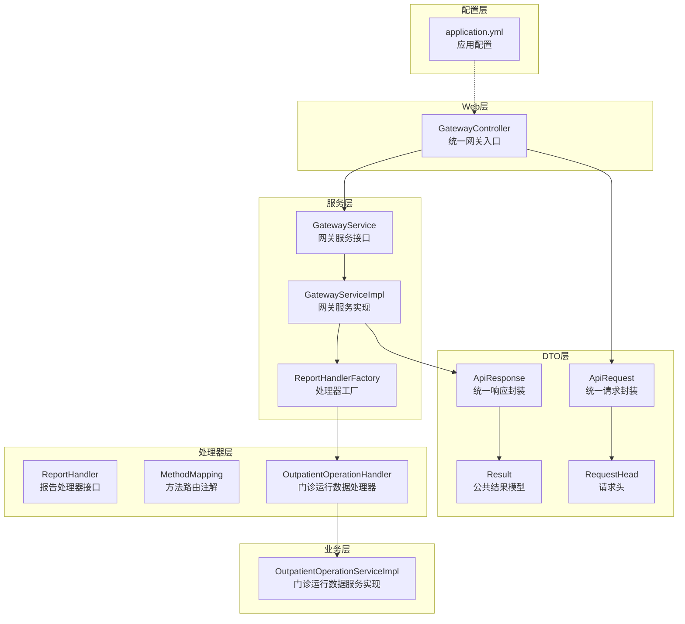
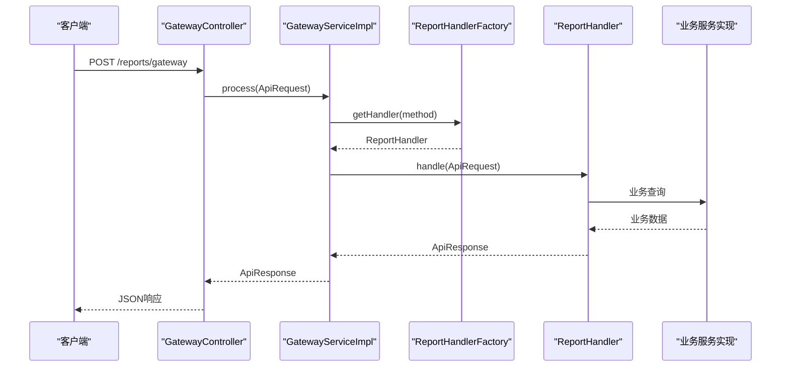
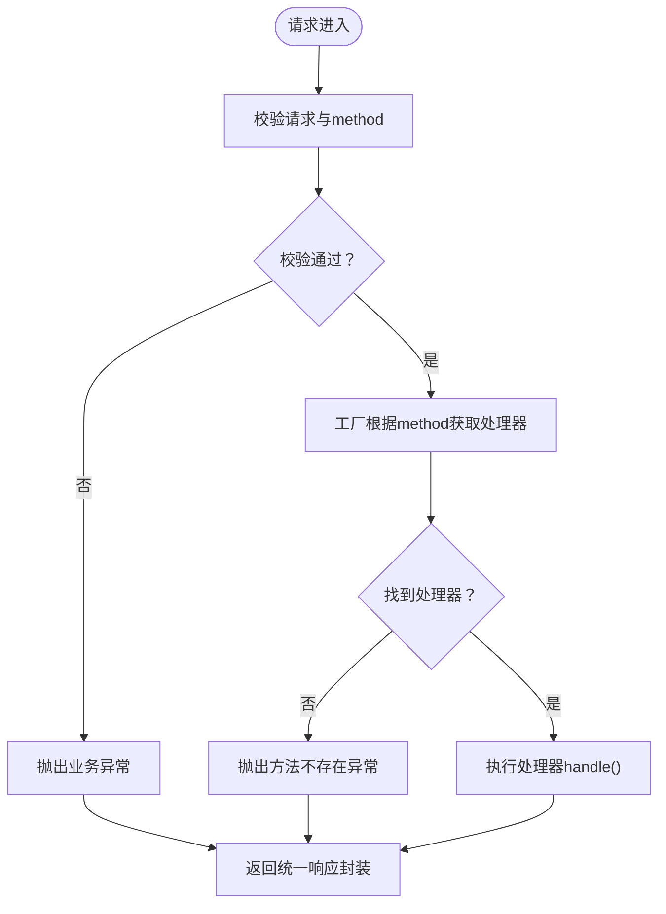
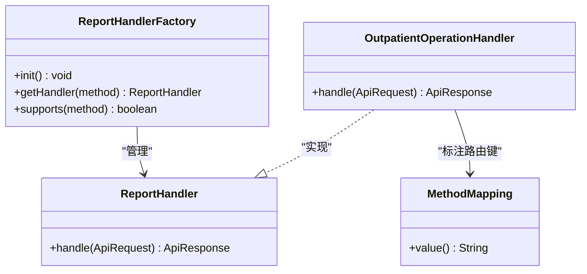
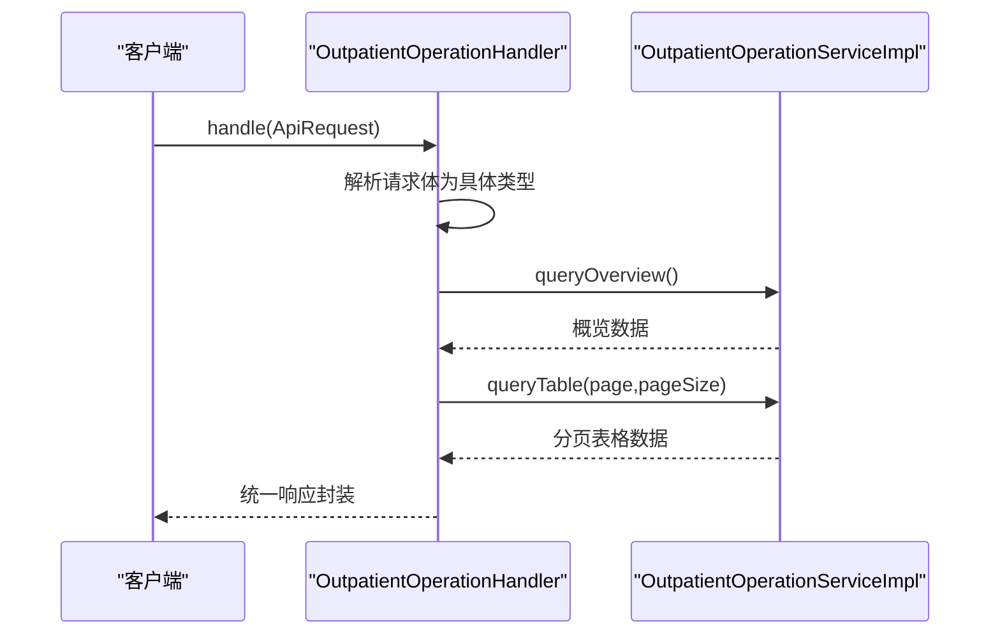
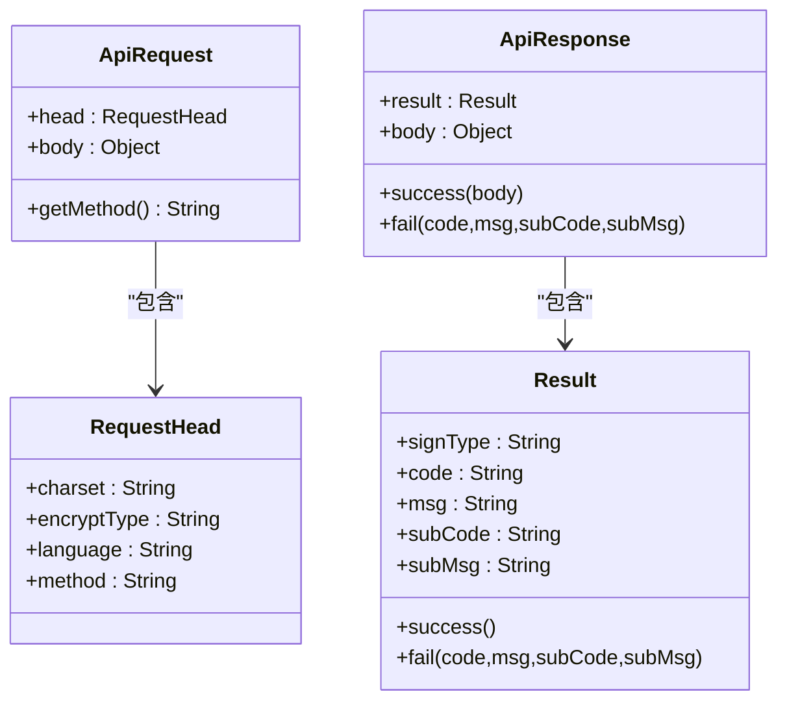
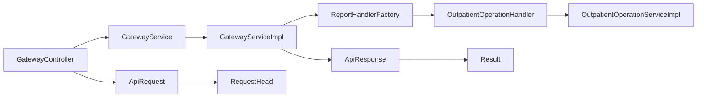

# API接口文档

<cite>
**本文档引用的文件**
- [GatewayController.java](file://src/main/java/com/reports/controller/GatewayController.java)
- [GatewayService.java](file://src/main/java/com/reports/service/GatewayService.java)
- [GatewayServiceImpl.java](file://src/main/java/com/reports/service/impl/GatewayServiceImpl.java)
- [ApiRequest.java](file://src/main/java/com/reports/dto/common/ApiRequest.java)
- [ApiResponse.java](file://src/main/java/com/reports/dto/common/ApiResponse.java)
- [RequestHead.java](file://src/main/java/com/reports/dto/common/RequestHead.java)
- [Result.java](file://src/main/java/com/reports/dto/common/Result.java)
- [ReportHandler.java](file://src/main/java/com/reports/service/handler/ReportHandler.java)
- [MethodMapping.java](file://src/main/java/com/reports/service/handler/MethodMapping.java)
- [ReportHandlerFactory.java](file://src/main/java/com/reports/service/handler/ReportHandlerFactory.java)
- [OutpatientOperationHandler.java](file://src/main/java/com/reports/service/handler/impl/OutpatientOperationHandler.java)
- [OutpatientOperationServiceImpl.java](file://src/main/java/com/reports/service/impl/OutpatientOperationServiceImpl.java)
- [ResultCode.java](file://src/main/java/com/reports/enums/ResultCode.java)
- [application.yml](file://src/main/resources/application.yml)
- [api-interface.md](file://reports-web/api-interface.md)
</cite>

## 目录
1. [简介](#简介)
2. [项目结构](#项目结构)
3. [核心组件](#核心组件)
4. [架构总览](#架构总览)
5. [详细组件分析](#详细组件分析)
6. [依赖关系分析](#依赖关系分析)
7. [性能考虑](#性能考虑)
8. [故障排除指南](#故障排除指南)
9. [结论](#结论)
10. [附录](#附录)

## 简介
本文件为报告系统的统一网关API与各类报告API的全面技术文档。系统采用统一网关入口接收请求，基于方法路由分发至具体报告处理器，实现多类报告数据的统一接入与输出。文档覆盖RESTful API的HTTP方法、URL模式、请求/响应模式、认证与安全、错误处理策略、版本信息、常见用例、客户端实现指南、性能优化技巧、调试与监控方法，以及未来可能的迁移与兼容性说明。

## 项目结构
系统采用Spring Boot工程，核心模块包括：
- 控制器层：统一网关入口控制器
- 服务层：网关服务与报告处理器工厂
- DTO层：统一请求/响应封装与公共结果模型
- 处理器层：报告处理器接口与注解路由
- 业务层：具体报告服务实现（以门诊运行数据为例）
- 配置层：应用配置与日志追踪

图表来源
- [GatewayController.java:1-38](file://src/main/java/com/reports/controller/GatewayController.java#L1-L38)
- [GatewayService.java:1-17](file://src/main/java/com/reports/service/GatewayService.java#L1-L17)
- [GatewayServiceImpl.java:1-51](file://src/main/java/com/reports/service/impl/GatewayServiceImpl.java#L1-L51)
- [ReportHandlerFactory.java:1-74](file://src/main/java/com/reports/service/handler/ReportHandlerFactory.java#L1-L74)
- [ApiRequest.java:1-35](file://src/main/java/com/reports/dto/common/ApiRequest.java#L1-L35)
- [ApiResponse.java:1-57](file://src/main/java/com/reports/dto/common/ApiResponse.java#L1-L57)
- [Result.java:1-78](file://src/main/java/com/reports/dto/common/Result.java#L1-L78)
- [RequestHead.java:1-37](file://src/main/java/com/reports/dto/common/RequestHead.java#L1-L37)
- [ReportHandler.java:1-28](file://src/main/java/com/reports/service/handler/ReportHandler.java#L1-L28)
- [MethodMapping.java:1-29](file://src/main/java/com/reports/service/handler/MethodMapping.java#L1-L29)
- [OutpatientOperationHandler.java:1-65](file://src/main/java/com/reports/service/handler/impl/OutpatientOperationHandler.java#L1-L65)
- [OutpatientOperationServiceImpl.java:1-253](file://src/main/java/com/reports/service/impl/OutpatientOperationServiceImpl.java#L1-L253)
- [application.yml:1-32](file://src/main/resources/application.yml#L1-L32)

章节来源
- [GatewayController.java:1-38](file://src/main/java/com/reports/controller/GatewayController.java#L1-L38)
- [application.yml:1-32](file://src/main/resources/application.yml#L1-L32)

## 核心组件
- 统一网关入口：接收POST请求，转发至网关服务进行处理
- 网关服务：校验请求、解析method、路由到具体处理器
- 报告处理器工厂：扫描并注册所有处理器，按method路由
- 统一请求/响应封装：标准化请求头与响应体结构
- 报告处理器接口与注解：定义处理契约与路由键
- 业务服务实现：具体报告数据查询与组装

章节来源
- [GatewayController.java:28-35](file://src/main/java/com/reports/controller/GatewayController.java#L28-L35)
- [GatewayServiceImpl.java:29-48](file://src/main/java/com/reports/service/impl/GatewayServiceImpl.java#L29-L48)
- [ReportHandlerFactory.java:31-71](file://src/main/java/com/reports/service/handler/ReportHandlerFactory.java#L31-L71)
- [ApiRequest.java:17-32](file://src/main/java/com/reports/dto/common/ApiRequest.java#L17-L32)
- [ApiResponse.java:17-54](file://src/main/java/com/reports/dto/common/ApiResponse.java#L17-L54)
- [Result.java:15-75](file://src/main/java/com/reports/dto/common/Result.java#L15-L75)
- [ReportHandler.java:19-27](file://src/main/java/com/reports/service/handler/ReportHandler.java#L19-L27)
- [MethodMapping.java:21-28](file://src/main/java/com/reports/service/handler/MethodMapping.java#L21-L28)

## 架构总览
统一网关采用“请求头method路由 + 处理器工厂注册 + 统一响应封装”的设计，确保新增报告接口只需实现处理器并标注路由键即可接入。

图表来源
- [GatewayController.java:31-35](file://src/main/java/com/reports/controller/GatewayController.java#L31-L35)
- [GatewayServiceImpl.java:31-47](file://src/main/java/com/reports/service/impl/GatewayServiceImpl.java#L31-L47)
- [ReportHandlerFactory.java:57-63](file://src/main/java/com/reports/service/handler/ReportHandlerFactory.java#L57-L63)
- [OutpatientOperationHandler.java:34-61](file://src/main/java/com/reports/service/handler/impl/OutpatientOperationHandler.java#L34-L61)

## 详细组件分析

### 统一网关API
- HTTP方法：POST
- URL模式：/reports/gateway
- 请求体：统一请求封装（包含head与body）
- 响应体：统一响应封装（包含result与body）
- 认证与安全：未在代码中实现鉴权逻辑，建议在网关层或过滤器中增加鉴权与签名验证
- 错误处理：参数缺失、方法不存在等场景抛出业务异常，由全局异常处理器统一返回

图表来源
- [GatewayServiceImpl.java:32-47](file://src/main/java/com/reports/service/impl/GatewayServiceImpl.java#L32-L47)
- [ReportHandlerFactory.java:57-63](file://src/main/java/com/reports/service/handler/ReportHandlerFactory.java#L57-L63)

章节来源
- [GatewayController.java:31-35](file://src/main/java/com/reports/controller/GatewayController.java#L31-L35)
- [GatewayServiceImpl.java:31-48](file://src/main/java/com/reports/service/impl/GatewayServiceImpl.java#L31-L48)
- [ApiRequest.java:17-32](file://src/main/java/com/reports/dto/common/ApiRequest.java#L17-L32)
- [ApiResponse.java:17-54](file://src/main/java/com/reports/dto/common/ApiResponse.java#L17-L54)

### 报告处理器与路由机制
- 处理器接口：定义handle(ApiRequest)方法
- 路由注解：@MethodMapping(value="方法路由键")
- 工厂初始化：扫描所有ReportHandler实现，读取注解值注册到映射表
- 支持判断：supports(method)用于外部判定是否支持某方法

图表来源
- [ReportHandler.java:19-27](file://src/main/java/com/reports/service/handler/ReportHandler.java#L19-L27)
- [MethodMapping.java:21-28](file://src/main/java/com/reports/service/handler/MethodMapping.java#L21-L28)
- [ReportHandlerFactory.java:31-71](file://src/main/java/com/reports/service/handler/ReportHandlerFactory.java#L31-L71)
- [OutpatientOperationHandler.java:20-31](file://src/main/java/com/reports/service/handler/impl/OutpatientOperationHandler.java#L20-L31)

章节来源
- [ReportHandler.java:19-27](file://src/main/java/com/reports/service/handler/ReportHandler.java#L19-L27)
- [MethodMapping.java:21-28](file://src/main/java/com/reports/service/handler/MethodMapping.java#L21-L28)
- [ReportHandlerFactory.java:31-71](file://src/main/java/com/reports/service/handler/ReportHandlerFactory.java#L31-L71)

### 门诊运行数据统计API（示例）
- 方法路由键：reports.outp.outpatient-operation
- 请求体：门诊运行数据查询请求对象
- 响应体：概览数据 + 表格分页数据
- 数据模式：支持mock/jdbc/mybatis-plus三种模式，可通过配置切换

图表来源
- [OutpatientOperationHandler.java:34-61](file://src/main/java/com/reports/service/handler/impl/OutpatientOperationHandler.java#L34-L61)
- [OutpatientOperationServiceImpl.java:47-73](file://src/main/java/com/reports/service/impl/OutpatientOperationServiceImpl.java#L47-L73)

章节来源
- [OutpatientOperationHandler.java:20-31](file://src/main/java/com/reports/service/handler/impl/OutpatientOperationHandler.java#L20-L31)
- [OutpatientOperationHandler.java:34-61](file://src/main/java/com/reports/service/handler/impl/OutpatientOperationHandler.java#L34-L61)
- [OutpatientOperationServiceImpl.java:21-33](file://src/main/java/com/reports/service/impl/OutpatientOperationServiceImpl.java#L21-L33)

### 统一请求/响应模型
- 请求封装：包含head（含字符集、加密类型、语言、method）与body
- 响应封装：包含result（含code/msg/subCode/subMsg/success）与body
- 成功/失败静态构造：提供便捷的响应构建方法

图表来源
- [ApiRequest.java:17-32](file://src/main/java/com/reports/dto/common/ApiRequest.java#L17-L32)
- [RequestHead.java:15-34](file://src/main/java/com/reports/dto/common/RequestHead.java#L15-L34)
- [ApiResponse.java:17-54](file://src/main/java/com/reports/dto/common/ApiResponse.java#L17-L54)
- [Result.java:15-75](file://src/main/java/com/reports/dto/common/Result.java#L15-L75)

章节来源
- [ApiRequest.java:17-32](file://src/main/java/com/reports/dto/common/ApiRequest.java#L17-L32)
- [RequestHead.java:15-34](file://src/main/java/com/reports/dto/common/RequestHead.java#L15-L34)
- [ApiResponse.java:17-54](file://src/main/java/com/reports/dto/common/ApiResponse.java#L17-L54)
- [Result.java:15-75](file://src/main/java/com/reports/dto/common/Result.java#L15-L75)

### 报告Web前端API（参考）
- 通用接口：/api/outpatient/overview（GET）、/api/outpatient/department-stats（GET）、/api/outpatient/export（POST）
- 通用响应格式：code/message/data
- 导出接口：返回下载链接与文件名

章节来源
- [api-interface.md:10-253](file://reports-web/api-interface.md#L10-L253)

## 依赖关系分析
- 控制器依赖网关服务接口与实现
- 网关服务依赖处理器工厂
- 处理器工厂依赖处理器接口实现
- 处理器实现依赖业务服务
- 统一模型贯穿请求/响应全链路

图表来源
- [GatewayController.java:21-26](file://src/main/java/com/reports/controller/GatewayController.java#L21-L26)
- [GatewayServiceImpl.java:22-26](file://src/main/java/com/reports/service/impl/GatewayServiceImpl.java#L22-L26)
- [ReportHandlerFactory.java:23-29](file://src/main/java/com/reports/service/handler/ReportHandlerFactory.java#L23-L29)
- [OutpatientOperationHandler.java:24-30](file://src/main/java/com/reports/service/handler/impl/OutpatientOperationHandler.java#L24-L30)
- [OutpatientOperationServiceImpl.java:38-44](file://src/main/java/com/reports/service/impl/OutpatientOperationServiceImpl.java#L38-L44)
- [ApiRequest.java:20](file://src/main/java/com/reports/dto/common/ApiRequest.java#L20)
- [RequestHead.java:34](file://src/main/java/com/reports/dto/common/RequestHead.java#L34)
- [ApiResponse.java:20](file://src/main/java/com/reports/dto/common/ApiResponse.java#L20)
- [Result.java:23](file://src/main/java/com/reports/dto/common/Result.java#L23)

章节来源
- [GatewayController.java:21-26](file://src/main/java/com/reports/controller/GatewayController.java#L21-L26)
- [GatewayServiceImpl.java:22-26](file://src/main/java/com/reports/service/impl/GatewayServiceImpl.java#L22-L26)
- [ReportHandlerFactory.java:23-29](file://src/main/java/com/reports/service/handler/ReportHandlerFactory.java#L23-L29)
- [OutpatientOperationHandler.java:24-30](file://src/main/java/com/reports/service/handler/impl/OutpatientOperationHandler.java#L24-L30)
- [OutpatientOperationServiceImpl.java:38-44](file://src/main/java/com/reports/service/impl/OutpatientOperationServiceImpl.java#L38-L44)

## 性能考虑
- 处理器工厂使用并发映射，避免线程安全问题
- 业务层支持多种数据模式，可根据环境选择最优方案
- 建议对高频接口增加缓存与限流策略
- 响应体统一封装便于后续扩展与监控

## 故障排除指南
- 参数缺失：检查请求头method与body是否完整
- 方法不存在：确认处理器是否正确标注@MethodMapping且值唯一
- 数据库异常：检查数据源配置与SQL执行情况
- 日志追踪：启用traceId便于定位问题

章节来源
- [GatewayServiceImpl.java:32-44](file://src/main/java/com/reports/service/impl/GatewayServiceImpl.java#L32-L44)
- [ReportHandlerFactory.java:35-49](file://src/main/java/com/reports/service/handler/ReportHandlerFactory.java#L35-L49)
- [ResultCode.java:11-64](file://src/main/java/com/reports/enums/ResultCode.java#L11-L64)
- [application.yml:25-31](file://src/main/resources/application.yml#L25-L31)

## 结论
本系统通过统一网关与处理器工厂实现了灵活可扩展的报告API体系，统一的请求/响应模型提升了跨接口的一致性与可维护性。建议在生产环境中补充鉴权、签名、限流与缓存等安全与性能措施，并完善文档与监控体系。

## 附录

### API清单与规范
- 统一网关
  - 方法：POST
  - 路径：/reports/gateway
  - 请求体：统一请求封装（包含head.method与body）
  - 响应体：统一响应封装（包含result与body）

- 报告处理器示例
  - 方法路由键：reports.outp.outpatient-operation
  - 处理器：OutpatientOperationHandler
  - 功能：概览数据 + 表格分页数据

章节来源
- [GatewayController.java:31-35](file://src/main/java/com/reports/controller/GatewayController.java#L31-L35)
- [MethodMapping.java:21-28](file://src/main/java/com/reports/service/handler/MethodMapping.java#L21-L28)
- [OutpatientOperationHandler.java:20-31](file://src/main/java/com/reports/service/handler/impl/OutpatientOperationHandler.java#L20-L31)

### 安全与认证
- 当前未实现鉴权与签名逻辑，建议在网关层或过滤器中增加：
  - 请求签名验证
  - Token鉴权
  - IP白名单
  - 请求体加密与解密

章节来源
- [RequestHead.java:18-23](file://src/main/java/com/reports/dto/common/RequestHead.java#L18-L23)

### 错误码与响应
- 统一结果码枚举：包含成功、参数错误、方法不存在、数据异常、系统错误等
- 响应模型：code/msg/subCode/subMsg/success

章节来源
- [ResultCode.java:11-64](file://src/main/java/com/reports/enums/ResultCode.java#L11-L64)
- [Result.java:15-75](file://src/main/java/com/reports/dto/common/Result.java#L15-L75)

### 版本信息
- 当前版本：未在代码中显式声明版本号
- 建议：在application.yml中增加version字段并在响应头中返回

章节来源
- [application.yml:8](file://src/main/resources/application.yml#L8)

### 客户端实现指南
- 使用统一网关路径：/reports/gateway
- 设置请求头：head.method为具体方法路由键
- 设置Content-Type：application/json
- 处理响应：解析统一响应封装的result与body

章节来源
- [GatewayController.java:18](file://src/main/java/com/reports/controller/GatewayController.java#L18)
- [ApiRequest.java:20](file://src/main/java/com/reports/dto/common/ApiRequest.java#L20)
- [RequestHead.java:34](file://src/main/java/com/reports/dto/common/RequestHead.java#L34)

### 性能优化技巧
- 使用处理器工厂的并发映射减少锁竞争
- 业务层支持多种数据模式，按环境选择最优
- 对高频接口增加缓存与限流
- 启用traceId进行全链路追踪

章节来源
- [ReportHandlerFactory.java:24](file://src/main/java/com/reports/service/handler/ReportHandlerFactory.java#L24)
- [OutpatientOperationServiceImpl.java:21-33](file://src/main/java/com/reports/service/impl/OutpatientOperationServiceImpl.java#L21-L33)
- [application.yml:25-31](file://src/main/resources/application.yml#L25-L31)

### 调试与监控
- 日志级别：com.reports设置为TRACE，控制台输出包含traceId
- 建议：集成分布式追踪（如Zipkin/Sleuth）与指标监控（Prometheus）

章节来源
- [application.yml:27-31](file://src/main/resources/application.yml#L27-L31)

### 迁移与兼容性
- 新增报告接口：实现ReportHandler并标注@MethodMapping，自动注册
- 兼容性：统一响应封装保证前后端兼容
- 建议：保留旧方法路由键，新增方法时提供迁移指引

章节来源
- [ReportHandlerFactory.java:31-51](file://src/main/java/com/reports/service/handler/ReportHandlerFactory.java#L31-L51)
- [MethodMapping.java:21-28](file://src/main/java/com/reports/service/handler/MethodMapping.java#L21-L28)