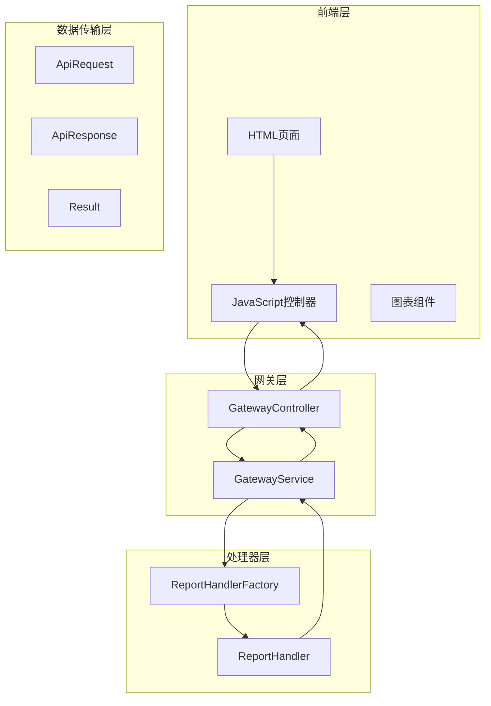
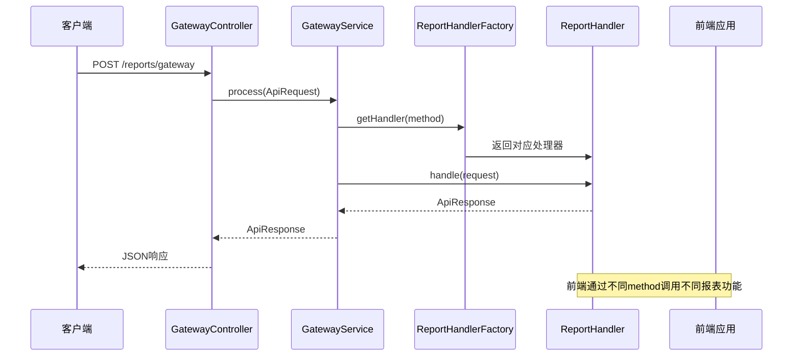
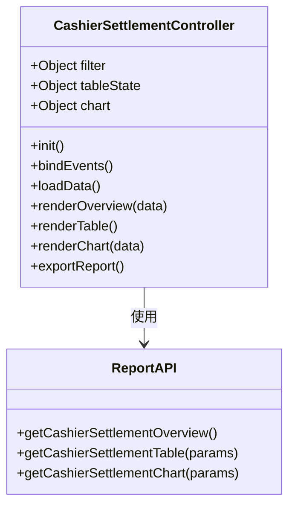
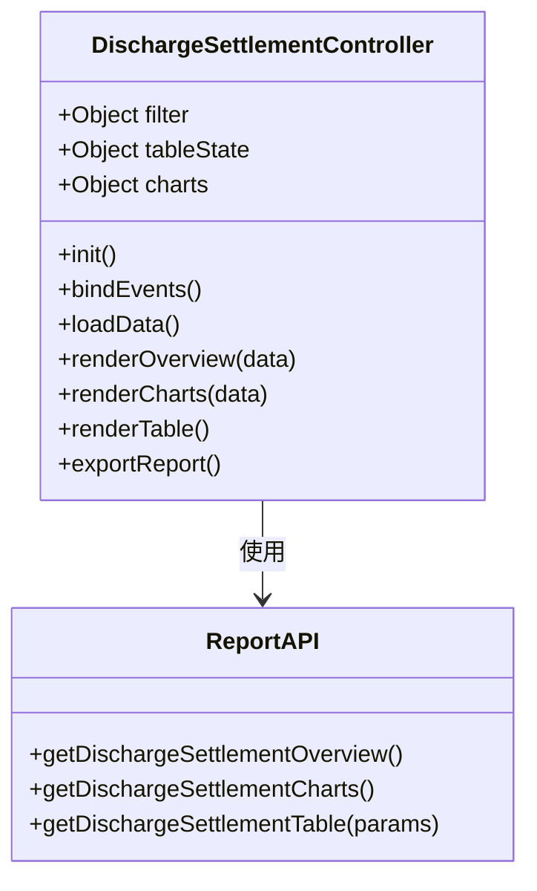
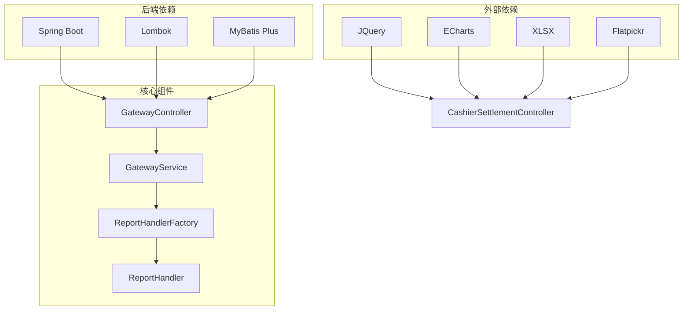

# 收费报告API

<cite>
**本文档引用的文件**
- [cash-cashier-settlement.md](file://reports-web/api/cash-cashier-settlement.md)
- [cash-discharge-settlement.md](file://reports-web/api/cash-discharge-settlement.md)
- [GatewayController.java](file://src/main/java/com/reports/controller/GatewayController.java)
- [GatewayService.java](file://src/main/java/com/reports/service/GatewayService.java)
- [GatewayServiceImpl.java](file://src/main/java/com/reports/service/impl/GatewayServiceImpl.java)
- [ReportHandler.java](file://src/main/java/com/reports/service/handler/ReportHandler.java)
- [ReportHandlerFactory.java](file://src/main/java/com/reports/service/handler/ReportHandlerFactory.java)
- [ApiRequest.java](file://src/main/java/com/reports/dto/common/ApiRequest.java)
- [ApiResponse.java](file://src/main/java/com/reports/dto/common/ApiResponse.java)
- [RequestHead.java](file://src/main/java/com/reports/dto/common/RequestHead.java)
- [Result.java](file://src/main/java/com/reports/dto/common/Result.java)
- [ResultCode.java](file://src/main/java/com/reports/enums/ResultCode.java)
- [cash-cashier-settlement-app.js](file://reports-web/cash/js/cash-cashier-settlement-app.js)
- [cash-discharge-settlement-app.js](file://reports-web/cash/js/cash-discharge-settlement-app.js)
- [cash-cashier-settlement.html](file://reports-web/cash/cash-cashier-settlement.html)
</cite>

## 目录
1. [简介](#简介)
2. [项目结构](#项目结构)
3. [核心组件](#核心组件)
4. [架构概览](#架构概览)
5. [详细组件分析](#详细组件分析)
6. [依赖关系分析](#依赖关系分析)
7. [性能考虑](#性能考虑)
8. [故障排除指南](#故障排除指南)
9. [结论](#结论)
10. [附录](#附录)

## 简介

收费报告API是一套专门针对医院收费业务的统计分析接口系统，主要包含两个核心模块：

- **收银结算统计**：提供收费员工作量统计、业务来源分析和工作量报表功能
- **出院结算统计**：提供出院结算情况分析、结算渠道分析和费用类型统计

该系统采用统一的网关入口设计，通过方法路由机制实现灵活的报表处理，支持多种统计维度和丰富的图表展示功能。

## 项目结构

项目采用前后端分离的架构设计，主要分为以下几个层次：



**图表来源**
- [GatewayController.java:16-37](file://src/main/java/com/reports/controller/GatewayController.java#L16-L37)
- [GatewayServiceImpl.java:18-50](file://src/main/java/com/reports/service/impl/GatewayServiceImpl.java#L18-L50)
- [ReportHandlerFactory.java:14-73](file://src/main/java/com/reports/service/handler/ReportHandlerFactory.java#L14-L73)

**章节来源**
- [cash-cashier-settlement.md:1-153](file://reports-web/api/cash-cashier-settlement.md#L1-L153)
- [cash-discharge-settlement.md:1-136](file://reports-web/api/cash-discharge-settlement.md#L1-L136)

## 核心组件

### 统一网关入口

系统通过单一入口 `/reports/gateway` 接收所有报表请求，采用POST方法和JSON格式传输数据。

### 请求响应模型

系统定义了标准的请求响应格式，确保前后端交互的一致性：

- **ApiRequest<T>**: 统一请求包装对象，包含请求头和请求体
- **ApiResponse<T>**: 统一响应包装对象，包含结果状态和业务数据
- **Result**: 标准响应结果，包含业务状态码和消息

### 处理器路由机制

通过 `ReportHandlerFactory` 实现动态处理器注册和路由分发，支持基于 `@MethodMapping` 注解的方法映射。

**章节来源**
- [ApiRequest.java:12-34](file://src/main/java/com/reports/dto/common/ApiRequest.java#L12-L34)
- [ApiResponse.java:12-56](file://src/main/java/com/reports/dto/common/ApiResponse.java#L12-L56)
- [Result.java:10-77](file://src/main/java/com/reports/dto/common/Result.java#L10-L77)

## 架构概览

系统采用分层架构设计，实现了清晰的关注点分离：



**图表来源**
- [GatewayController.java:31-35](file://src/main/java/com/reports/controller/GatewayController.java#L31-L35)
- [GatewayServiceImpl.java:29-47](file://src/main/java/com/reports/service/impl/GatewayServiceImpl.java#L29-L47)
- [ReportHandlerFactory.java:54-64](file://src/main/java/com/reports/service/handler/ReportHandlerFactory.java#L54-L64)

## 详细组件分析

### 收费员结账统计API

#### 接口规范

| 属性 | 详情 |
|------|------|
| 接口地址 | `http://localhost:18089/reports/gateway` |
| 请求方法 | POST |
| Content-Type | application/json |
| 接口名称 | 收费员结账统计 |

#### 请求参数

| 参数名 | 类型 | 必填 | 说明 |
|--------|------|------|------|
| tab | string | 是 | 统计页签：cashier（按收费员统计）、source（按来源方式统计）、workload（工作量报表） |
| dimension | string | 是 | 统计维度：month（按月统计）、day（按天统计） |
| startDate | string | 是 | 开始日期，格式 yyyy-MM-dd |
| endDate | string | 是 | 结束日期，格式 yyyy-MM-dd |
| page | number | 否 | 当前页码，默认 1 |
| pageSize | number | 否 | 每页条数，默认 10 |
| extend_params1 | any | 否 | 扩展参数1 |
| extend_params2 | any | 否 | 扩展参数2 |
| extend_params3 | any | 否 | 扩展参数3 |

#### 响应数据结构

系统提供三种核心数据组件：

1. **概览数据 (overview)**：关键指标统计
2. **表格数据 (table)**：详细的统计表格
3. **图表数据 (chart)**：可视化分析图表

#### 统计维度说明

| tab 取值 | 表格说明 | 图表说明 |
|----------|----------|----------|
| cashier | 每行一个日期，列为各收费员及汇总 | 收费员业务工作量分析 |
| source | 每行一个日期，列为各业务来源及汇总 | 来源方式工作量分析 |
| workload | 每行一个收费员的工作量明细 | 不返回图表 |

**章节来源**
- [cash-cashier-settlement.md:10-153](file://reports-web/api/cash-cashier-settlement.md#L10-L153)

### 出院结算统计API

#### 接口规范

| 属性 | 详情 |
|------|------|
| 接口地址 | `http://localhost:18089/reports/gateway` |
| 请求方法 | POST |
| Content-Type | application/json |
| 接口名称 | 出院结算报表 |

#### 请求参数

| 参数名 | 类型 | 必填 | 说明 |
|--------|------|------|------|
| dimension | string | 是 | 统计维度：month（按月统计）、day（按天统计） |
| startDate | string | 是 | 开始日期，格式 yyyy-MM-dd |
| endDate | string | 是 | 结束日期，格式 yyyy-MM-dd |
| page | number | 否 | 当前页码，默认 1 |
| pageSize | number | 否 | 每页条数，默认 10 |
| extend_params1 | any | 否 | 扩展参数1 |
| extend_params2 | any | 否 | 扩展参数2 |
| extend_params3 | any | 否 | 扩展参数3 |

#### 响应数据结构

| 参数名 | 类型 | 说明 |
|--------|------|------|
| body.overview | object | 出院结算概览数据 |
| body.overview.totalDischargeCount | number | 总出院人数 |
| body.overview.totalDischargeCompare | number | 总出院人数同比 |
| body.overview.dischargedCount | number | 已出院人数 |
| body.overview.dischargedCompare | number | 已出院人数同比 |
| body.overview.notDischargedCount | number | 未出院人数 |
| body.overview.notDischargedCompare | number | 未出院人数同比 |
| body.overview.settlementAmount | number | 结算金额 |
| body.overview.settlementAmountCompare | number | 结算金额同比 |
| body.charts | object | 图表分析数据 |
| body.charts.channelAnalysis | array | 结算渠道分析 |
| body.charts.patientTypeAnalysis | array | 结算费别人次分析 |
| body.charts.amountTypeAnalysis | array | 结算费别金额分析 |
| body.table | object | 结算明细表格 |
| body.table.list | array | 日期维度结算数据列表 |
| body.table.total | number | 总记录数 |
| body.table.page | number | 当前页码 |
| body.table.pageSize | number | 每页条数 |

**章节来源**
- [cash-discharge-settlement.md:10-136](file://reports-web/api/cash-discharge-settlement.md#L10-L136)

### 前端集成组件

#### 收费员结账统计前端控制器

前端通过 `CashierSettlementController` 实现完整的交互逻辑：



**图表来源**
- [cash-cashier-settlement-app.js:4-519](file://reports-web/cash/js/cash-cashier-settlement-app.js#L4-L519)

#### 出院结算统计前端控制器



**图表来源**
- [cash-discharge-settlement-app.js:4-385](file://reports-web/cash/js/cash-discharge-settlement-app.js#L4-L385)

**章节来源**
- [cash-cashier-settlement-app.js:1-519](file://reports-web/cash/js/cash-cashier-settlement-app.js#L1-L519)
- [cash-discharge-settlement-app.js:1-385](file://reports-web/cash/js/cash-discharge-settlement-app.js#L1-L385)

## 依赖关系分析

系统采用松耦合的设计模式，各组件之间的依赖关系清晰明确：



**图表来源**
- [cash-cashier-settlement-app.js:1-519](file://reports-web/cash/js/cash-cashier-settlement-app.js#L1-L519)
- [cash-discharge-settlement-app.js:1-385](file://reports-web/cash/js/cash-discharge-settlement-app.js#L1-L385)

**章节来源**
- [GatewayController.java:1-38](file://src/main/java/com/reports/controller/GatewayController.java#L1-L38)
- [ReportHandlerFactory.java:1-74](file://src/main/java/com/reports/service/handler/ReportHandlerFactory.java#L1-L74)

## 性能考虑

### 缓存策略

系统建议在以下场景实施缓存机制：
- 频繁访问的概览数据
- 固定时间段的历史统计
- 常用的图表数据

### 分页优化

对于大量数据的报表，系统提供了完善的分页支持：
- 默认每页10条记录
- 支持10、20、50条记录切换
- 前端实现智能分页控件

### 并发处理

网关服务支持并发请求处理，通过线程池管理提高系统吞吐量。

## 故障排除指南

### 常见错误类型

| 错误代码 | 错误类型 | 描述 | 解决方案 |
|----------|----------|------|----------|
| 20001 | PARAM_ERROR | 请求参数错误 | 检查请求参数格式和类型 |
| 20002 | PARAM_MISSING | 必填参数缺失 | 确保所有必需参数都已提供 |
| 20003 | PARAM_FORMAT_ERROR | 参数格式错误 | 验证日期格式和数值类型 |
| 30001 | METHOD_NOT_FOUND | 请求的方法不存在 | 检查method参数是否正确 |
| 30002 | METHOD_NOT_IMPLEMENTED | 请求的方法尚未实现 | 确认对应处理器已注册 |

### 调试建议

1. **启用日志追踪**：检查后端日志中的请求处理信息
2. **验证网络连接**：确认前端能够正常访问网关接口
3. **检查数据权限**：验证用户是否有权访问相应报表
4. **监控系统资源**：观察内存和CPU使用情况

**章节来源**
- [ResultCode.java:8-77](file://src/main/java/com/reports/enums/ResultCode.java#L8-L77)

## 结论

收费报告API系统通过标准化的接口设计和灵活的架构实现，为医院收费业务提供了全面的统计分析能力。系统的主要优势包括：

1. **统一的接口规范**：所有报表通过相同的网关入口提供服务
2. **灵活的统计维度**：支持按天、按月等多种统计周期
3. **丰富的数据展示**：提供概览、表格、图表等多种数据呈现方式
4. **完善的导出功能**：支持Excel格式的数据导出
5. **良好的扩展性**：基于处理器工厂的路由机制便于功能扩展

该系统能够有效支撑医院收费管理的日常运营需求，为管理层决策提供及时准确的数据支持。

## 附录

### API使用示例

#### 收费员结账统计请求示例

```json
{
    "head": {
        "charset": "utf-8",
        "encrypt_type": "AES",
        "language": "zh_CN",
        "method": "reports.cash.cash-cashier-settlement"
    },
    "body": {
        "tab": "cashier",
        "dimension": "day",
        "startDate": "2025-09-22",
        "endDate": "2025-10-22",
        "page": 1,
        "pageSize": 10
    }
}
```

#### 出院结算统计请求示例

```json
{
    "head": {
        "charset": "utf-8",
        "encrypt_type": "AES",
        "language": "zh_CN",
        "method": "reports.cash.cash-discharge-settlement"
    },
    "body": {
        "dimension": "day",
        "startDate": "2025-09-22",
        "endDate": "2025-10-22",
        "page": 1,
        "pageSize": 10
    }
}
```

### 集成指南

1. **前端集成**：通过 `ReportAPI` 对象调用相应的报表接口
2. **后端集成**：在现有Spring Boot应用中添加对应的处理器实现
3. **配置要求**：确保正确的MIME类型和字符编码设置
4. **安全考虑**：根据实际需求添加必要的安全认证机制