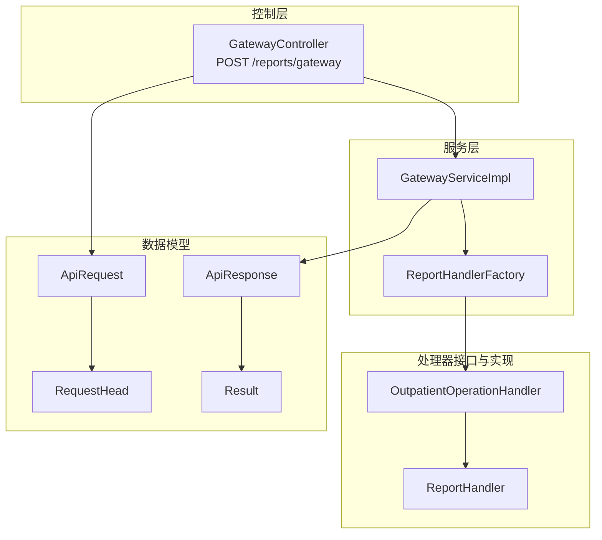
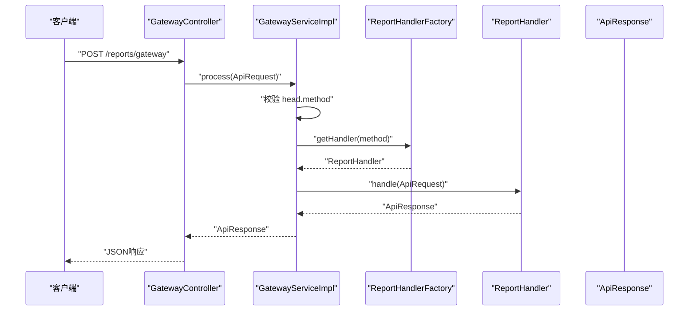
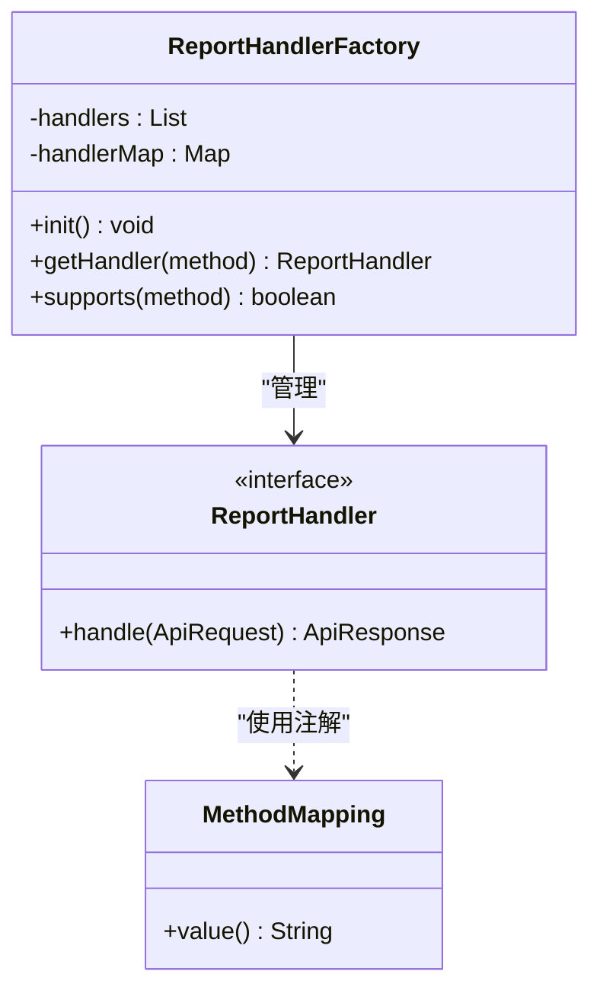
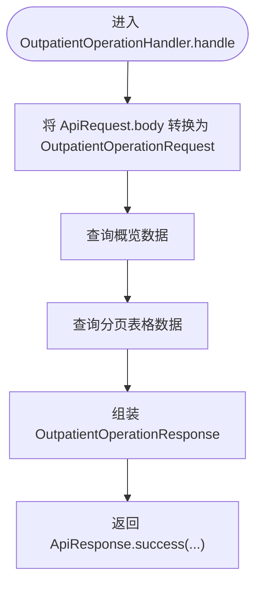
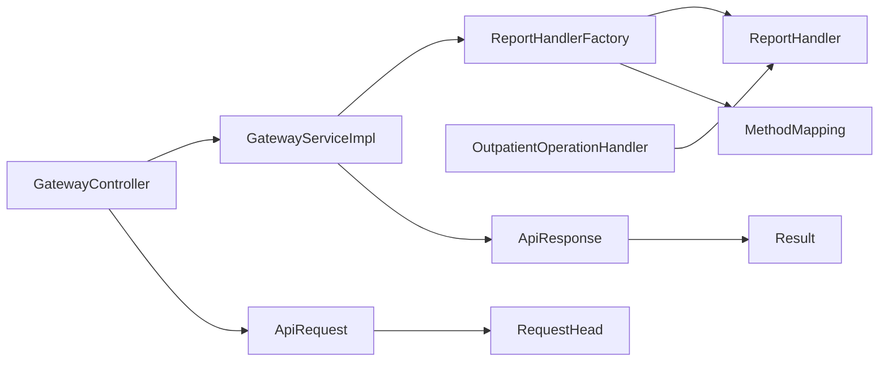

# 统一网关API

<cite>
**本文引用的文件**
- [GatewayController.java](file://src/main/java/com/reports/controller/GatewayController.java)
- [GatewayService.java](file://src/main/java/com/reports/service/GatewayService.java)
- [GatewayServiceImpl.java](file://src/main/java/com/reports/service/impl/GatewayServiceImpl.java)
- [ReportHandler.java](file://src/main/java/com/reports/service/handler/ReportHandler.java)
- [ReportHandlerFactory.java](file://src/main/java/com/reports/service/handler/ReportHandlerFactory.java)
- [MethodMapping.java](file://src/main/java/com/reports/service/handler/MethodMapping.java)
- [ApiRequest.java](file://src/main/java/com/reports/dto/common/ApiRequest.java)
- [ApiResponse.java](file://src/main/java/com/reports/dto/common/ApiResponse.java)
- [RequestHead.java](file://src/main/java/com/reports/dto/common/RequestHead.java)
- [Result.java](file://src/main/java/com/reports/dto/common/Result.java)
- [ResultCode.java](file://src/main/java/com/reports/enums/ResultCode.java)
- [OutpatientOperationHandler.java](file://src/main/java/com/reports/service/handler/impl/OutpatientOperationHandler.java)
- [OutpatientOperationRequest.java](file://src/main/java/com/reports/dto/request/OutpatientOperationRequest.java)
- [OutpatientOperationResponse.java](file://src/main/java/com/reports/dto/response/OutpatientOperationResponse.java)
- [GlobalExceptionHandler.java](file://src/main/java/com/reports/exception/GlobalExceptionHandler.java)
</cite>

## 目录
1. [简介](#简介)
2. [项目结构](#项目结构)
3. [核心组件](#核心组件)
4. [架构总览](#架构总览)
5. [详细组件分析](#详细组件分析)
6. [依赖关系分析](#依赖关系分析)
7. [性能与扩展性](#性能与扩展性)
8. [故障排查指南](#故障排查指南)
9. [结论](#结论)
10. [附录](#附录)

## 简介
本文件面向统一网关API的使用者与维护者，系统化阐述POST /reports/gateway端点的请求与响应规范、数据模型、参数校验规则、method路由机制与处理器工厂工作原理，并提供客户端调用示例与最佳实践建议。

## 项目结构
统一网关位于Spring MVC控制器层，通过统一的ApiRequest/ApiResponse封装请求与响应；请求经由GatewayService进入处理器工厂，按method动态路由到具体ReportHandler实现，最终返回标准响应结构。

图表来源
- [GatewayController.java:1-38](file://src/main/java/com/reports/controller/GatewayController.java#L1-L38)
- [GatewayServiceImpl.java:1-51](file://src/main/java/com/reports/service/impl/GatewayServiceImpl.java#L1-L51)
- [ReportHandlerFactory.java:1-74](file://src/main/java/com/reports/service/handler/ReportHandlerFactory.java#L1-L74)
- [ReportHandler.java:1-28](file://src/main/java/com/reports/service/handler/ReportHandler.java#L1-L28)
- [OutpatientOperationHandler.java:1-65](file://src/main/java/com/reports/service/handler/impl/OutpatientOperationHandler.java#L1-L65)
- [ApiRequest.java:1-35](file://src/main/java/com/reports/dto/common/ApiRequest.java#L1-L35)
- [RequestHead.java:1-37](file://src/main/java/com/reports/dto/common/RequestHead.java#L1-L37)
- [ApiResponse.java:1-57](file://src/main/java/com/reports/dto/common/ApiResponse.java#L1-L57)
- [Result.java:1-78](file://src/main/java/com/reports/dto/common/Result.java#L1-L78)

章节来源
- [GatewayController.java:1-38](file://src/main/java/com/reports/controller/GatewayController.java#L1-L38)
- [GatewayService.java:1-17](file://src/main/java/com/reports/service/GatewayService.java#L1-L17)
- [GatewayServiceImpl.java:1-51](file://src/main/java/com/reports/service/impl/GatewayServiceImpl.java#L1-L51)

## 核心组件
- 控制器：接收HTTP请求，透传至网关服务。
- 网关服务：校验method，路由到处理器并执行。
- 处理器工厂：基于注解扫描注册处理器，按method查找。
- 统一请求/响应：ApiRequest/ApiResponse封装head/body与公共Result。
- DTO集合：请求体、响应体、分页结果等。

章节来源
- [ApiRequest.java:1-35](file://src/main/java/com/reports/dto/common/ApiRequest.java#L1-L35)
- [ApiResponse.java:1-57](file://src/main/java/com/reports/dto/common/ApiResponse.java#L1-L57)
- [RequestHead.java:1-37](file://src/main/java/com/reports/dto/common/RequestHead.java#L1-L37)
- [Result.java:1-78](file://src/main/java/com/reports/dto/common/Result.java#L1-L78)
- [ReportHandlerFactory.java:1-74](file://src/main/java/com/reports/service/handler/ReportHandlerFactory.java#L1-L74)
- [ReportHandler.java:1-28](file://src/main/java/com/reports/service/handler/ReportHandler.java#L1-L28)

## 架构总览
POST /reports/gateway的调用链路如下：

图表来源
- [GatewayController.java:28-35](file://src/main/java/com/reports/controller/GatewayController.java#L28-L35)
- [GatewayServiceImpl.java:29-48](file://src/main/java/com/reports/service/impl/GatewayServiceImpl.java#L29-L48)
- [ReportHandlerFactory.java:54-64](file://src/main/java/com/reports/service/handler/ReportHandlerFactory.java#L54-L64)
- [ReportHandler.java:21-25](file://src/main/java/com/reports/service/handler/ReportHandler.java#L21-L25)

## 详细组件分析

### API端点与调用规范
- 端点路径：/reports/gateway
- HTTP方法：POST
- 内容类型：application/json
- 请求体：ApiRequest<T>
- 响应体：ApiResponse<T>

请求体字段
- head：RequestHead，包含method等元信息
- body：任意对象，具体类型由各处理器约定

响应体字段
- result：Result，包含code/msg/subCode/subMsg/success
- body：业务响应体，泛型类型由处理器决定

章节来源
- [GatewayController.java:18-35](file://src/main/java/com/reports/controller/GatewayController.java#L18-L35)
- [ApiRequest.java:17-32](file://src/main/java/com/reports/dto/common/ApiRequest.java#L17-L32)
- [ApiResponse.java:17-33](file://src/main/java/com/reports/dto/common/ApiResponse.java#L17-L33)

### 数据模型与字段定义

#### ApiRequest<T>
- head：RequestHead
- body：T（请求体）
- getMethod()：从head.method派生

章节来源
- [ApiRequest.java:13-34](file://src/main/java/com/reports/dto/common/ApiRequest.java#L13-L34)

#### RequestHead
- charset：字符集，默认utf-8
- encryptType：加密类型，默认AES
- language：语言，默认zh_CN
- method：接口方法名，用于路由分发

章节来源
- [RequestHead.java:11-36](file://src/main/java/com/reports/dto/common/RequestHead.java#L11-L36)

#### ApiResponse<T>
- result：Result
- body：T（响应体）
- success(body)/success(body, subMsg)/fail(code,msg,subCode,subMsg)

章节来源
- [ApiResponse.java:13-56](file://src/main/java/com/reports/dto/common/ApiResponse.java#L13-L56)

#### Result
- signType：签名类型，默认md5
- code：系统级响应码
- msg：系统级消息
- subCode：业务响应码
- subMsg：业务响应消息
- success：是否成功

章节来源
- [Result.java:11-77](file://src/main/java/com/reports/dto/common/Result.java#L11-L77)

#### 统一结果码枚举（ResultCode）
- SUCCESS：10000
- PARAM_ERROR：20001
- PARAM_MISSING：20002
- PARAM_FORMAT_ERROR：20003
- METHOD_NOT_FOUND：30001
- METHOD_NOT_IMPLEMENTED：30002
- DATA_NOT_FOUND：40001
- DB_ERROR：50001
- DATASOURCE_ERROR：50002
- SQL_EXEC_ERROR：50003
- SYSTEM_ERROR：99999

章节来源
- [ResultCode.java:9-76](file://src/main/java/com/reports/enums/ResultCode.java#L9-L76)

### 参数验证规则
- 必填项：ApiRequest必须非空，且head.method必须非空白
- 否则抛出业务异常，返回“参数缺失”类错误码

章节来源
- [GatewayServiceImpl.java:32-35](file://src/main/java/com/reports/service/impl/GatewayServiceImpl.java#L32-L35)
- [ResultCode.java:23-24](file://src/main/java/com/reports/enums/ResultCode.java#L23-L24)

### method字段的路由机制与处理器工厂
- method来源于RequestHead.method
- 处理器通过@MethodMapping标注其支持的method值
- 工厂在启动时扫描所有ReportHandler实现，建立method到处理器的映射
- 若method不存在，抛出“方法不存在”错误

图表来源
- [ReportHandlerFactory.java:21-73](file://src/main/java/com/reports/service/handler/ReportHandlerFactory.java#L21-L73)
- [ReportHandler.java:19-27](file://src/main/java/com/reports/service/handler/ReportHandler.java#L19-L27)
- [MethodMapping.java:21-28](file://src/main/java/com/reports/service/handler/MethodMapping.java#L21-L28)

章节来源
- [ReportHandlerFactory.java:31-51](file://src/main/java/com/reports/service/handler/ReportHandlerFactory.java#L31-L51)
- [ReportHandlerFactory.java:58-71](file://src/main/java/com/reports/service/handler/ReportHandlerFactory.java#L58-L71)

### 处理器实现示例：门诊运行数据统计
- 处理器：OutpatientOperationHandler
- method：reports.outp.outpatient-operation
- 输入：OutpatientOperationRequest（继承BaseRequestBody）
- 输出：OutpatientOperationResponse（包含概览与分页表格）

图表来源
- [OutpatientOperationHandler.java:33-62](file://src/main/java/com/reports/service/handler/impl/OutpatientOperationHandler.java#L33-L62)
- [OutpatientOperationRequest.java:12-36](file://src/main/java/com/reports/dto/request/OutpatientOperationRequest.java#L12-L36)
- [OutpatientOperationResponse.java:10-24](file://src/main/java/com/reports/dto/response/OutpatientOperationResponse.java#L10-L24)

章节来源
- [OutpatientOperationHandler.java:21-62](file://src/main/java/com/reports/service/handler/impl/OutpatientOperationHandler.java#L21-L62)

### 错误码与异常处理
- 网关层：参数缺失、方法不存在
- 全局异常：业务异常、参数绑定异常、非法参数、数据源异常、其他异常
- 返回统一ApiResponse，result携带系统码与业务码

章节来源
- [GatewayServiceImpl.java:32-44](file://src/main/java/com/reports/service/impl/GatewayServiceImpl.java#L32-L44)
- [GlobalExceptionHandler.java:23-83](file://src/main/java/com/reports/exception/GlobalExceptionHandler.java#L23-L83)
- [ResultCode.java:9-76](file://src/main/java/com/reports/enums/ResultCode.java#L9-L76)

## 依赖关系分析
- 控制器依赖网关服务
- 网关服务依赖处理器工厂
- 处理器工厂依赖处理器接口与注解
- 处理器实现依赖具体业务服务与DTO

图表来源
- [GatewayController.java:21-26](file://src/main/java/com/reports/controller/GatewayController.java#L21-L26)
- [GatewayServiceImpl.java:22-27](file://src/main/java/com/reports/service/impl/GatewayServiceImpl.java#L22-L27)
- [ReportHandlerFactory.java:23-29](file://src/main/java/com/reports/service/handler/ReportHandlerFactory.java#L23-L29)
- [ReportHandler.java:19-25](file://src/main/java/com/reports/service/handler/ReportHandler.java#L19-L25)
- [MethodMapping.java:21-26](file://src/main/java/com/reports/service/handler/MethodMapping.java#L21-L26)
- [OutpatientOperationHandler.java:20-31](file://src/main/java/com/reports/service/handler/impl/OutpatientOperationHandler.java#L20-L31)
- [ApiRequest.java:20-25](file://src/main/java/com/reports/dto/common/ApiRequest.java#L20-L25)
- [RequestHead.java:34](file://src/main/java/com/reports/dto/common/RequestHead.java#L34)
- [ApiResponse.java:20-25](file://src/main/java/com/reports/dto/common/ApiResponse.java#L20-L25)
- [Result.java:22-43](file://src/main/java/com/reports/dto/common/Result.java#L22-L43)

## 性能与扩展性
- 处理器注册采用并发安全Map，启动期一次性构建路由表，运行期O(1)查找
- 建议：新增处理器只需实现ReportHandler并添加@MethodMapping，无需改动网关与工厂
- 建议：对高频接口可考虑缓存热点查询结果，避免重复计算

## 故障排查指南
- method为空或缺失：检查RequestHead.method是否正确设置
- 方法不存在：确认@MethodMapping的value与请求method一致，且处理器已加载
- 参数绑定失败：检查请求体JSON结构与DTO字段匹配
- 其他异常：查看全局异常处理器返回的系统码与业务码定位问题

章节来源
- [GatewayServiceImpl.java:32-44](file://src/main/java/com/reports/service/impl/GatewayServiceImpl.java#L32-L44)
- [GlobalExceptionHandler.java:23-83](file://src/main/java/com/reports/exception/GlobalExceptionHandler.java#L23-L83)

## 结论
统一网关以ApiRequest/ApiResponse为统一契约，借助method路由与处理器工厂实现高内聚、低耦合的扩展架构。通过标准化的错误码与异常处理，确保调用方获得一致的反馈体验。

## 附录

### 请求示例
- 请求URL：POST /reports/gateway
- Content-Type：application/json
- 请求体示例（结构示意）：
{
  "head": {
    "method": "reports.outp.outpatient-operation",
    "charset": "utf-8",
    "encryptType": "AES",
    "language": "zh_CN"
  },
  "body": {
    "startDate": "yyyy-MM-dd",
    "endDate": "yyyy-MM-dd",
    "deptCode": "科室编码",
    "deptName": "科室名称"
  }
}

### 响应示例
- 成功响应示例（结构示意）：
{
  "result": {
    "code": "10000",
    "msg": "接口调用成功，并且业务系统也处理成功",
    "subCode": "success",
    "subMsg": "处理成功",
    "success": true
  },
  "body": {
    "overview": { /* 概览数据 */ },
    "table": { /* 分页表格数据 */ }
  }
}

- 失败响应示例（结构示意）：
{
  "result": {
    "code": "20002",
    "msg": "必填参数缺失",
    "subCode": "param_missing",
    "subMsg": "请求报文或 method 不能为空",
    "success": false
  },
  "body": null
}

### 客户端调用最佳实践
- 固定head字段：method必须与处理器@MethodMapping一致；charset/encryptType/language按需设置默认值
- body字段：严格遵循对应处理器的DTO定义；日期格式保持一致
- 错误处理：根据result.code与result.subCode分别处理系统与业务错误
- 幂等性：如涉及写操作，客户端需自定义幂等键并做好重试策略
- 日志追踪：结合服务端日志与TraceId定位问题