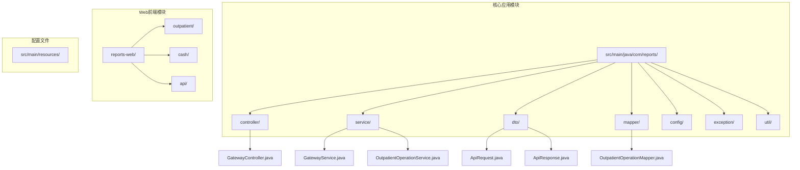
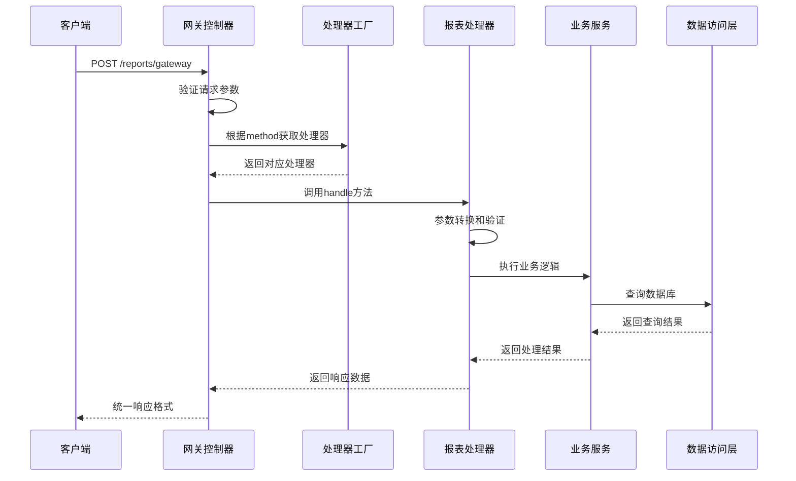
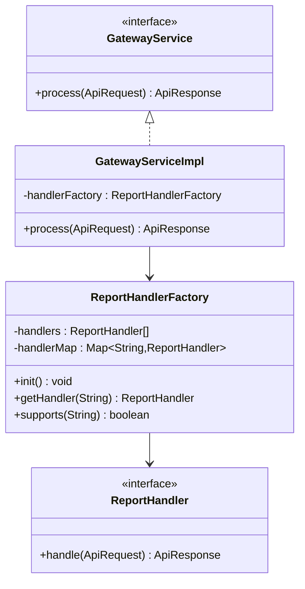
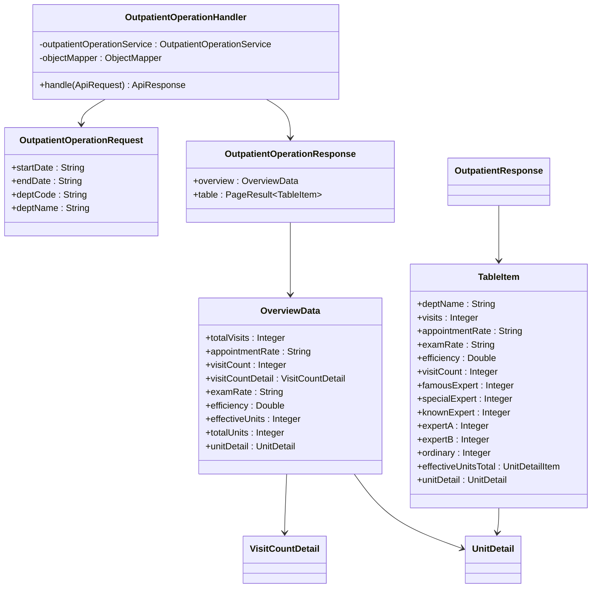
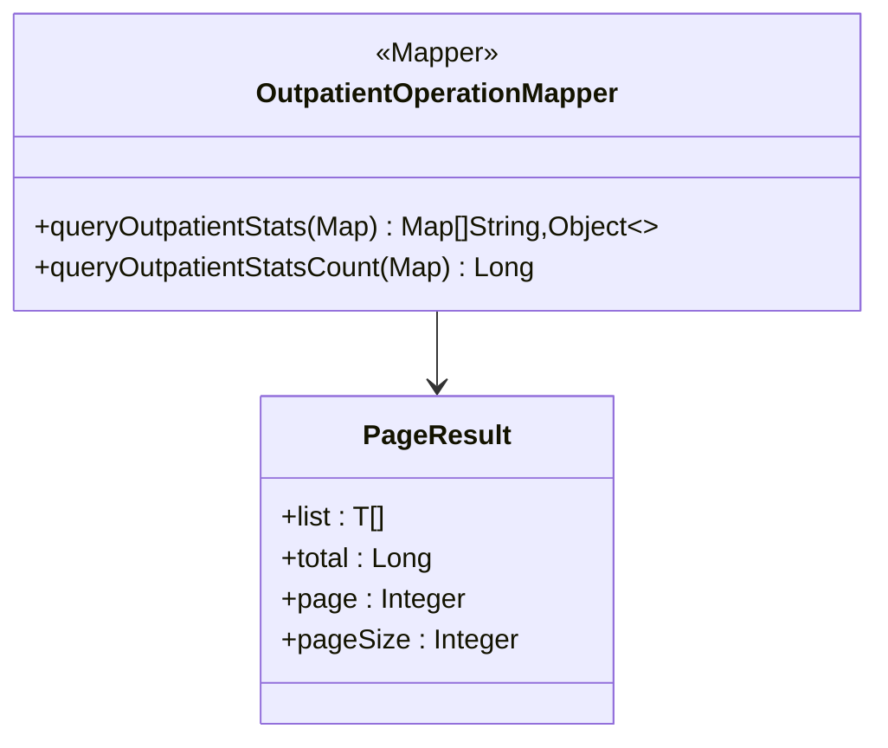
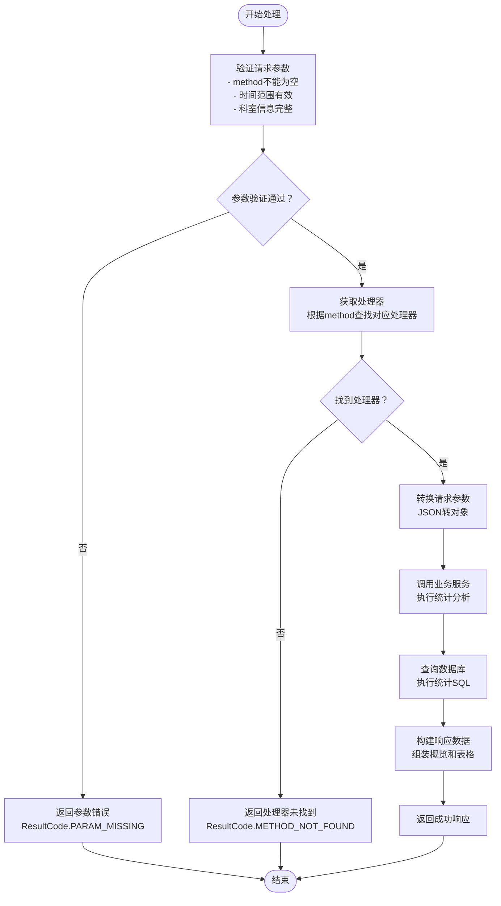

# 专科治疗统计API

<cite>
**本文档引用的文件**
- [GatewayController.java](file://src/main/java/com/reports/controller/GatewayController.java)
- [GatewayService.java](file://src/main/java/com/reports/service/GatewayService.java)
- [GatewayServiceImpl.java](file://src/main/java/com/reports/service/impl/GatewayServiceImpl.java)
- [ReportHandler.java](file://src/main/java/com/reports/service/handler/ReportHandler.java)
- [ReportHandlerFactory.java](file://src/main/java/com/reports/service/handler/ReportHandlerFactory.java)
- [MethodMapping.java](file://src/main/java/com/reports/service/handler/MethodMapping.java)
- [OutpatientOperationHandler.java](file://src/main/java/com/reports/service/handler/impl/OutpatientOperationHandler.java)
- [OutpatientOperationRequest.java](file://src/main/java/com/reports/dto/request/OutpatientOperationRequest.java)
- [OutpatientOperationResponse.java](file://src/main/java/com/reports/dto/response/OutpatientOperationResponse.java)
- [OverviewData.java](file://src/main/java/com/reports/dto/response/OverviewData.java)
- [TableItem.java](file://src/main/java/com/reports/dto/response/TableItem.java)
- [UnitDetail.java](file://src/main/java/com/reports/dto/response/UnitDetail.java)
- [VisitCountDetail.java](file://src/main/java/com/reports/dto/response/VisitCountDetail.java)
- [PageResult.java](file://src/main/java/com/reports/dto/common/PageResult.java)
- [ApiResponse.java](file://src/main/java/com/reports/dto/common/ApiResponse.java)
- [OutpatientOperationMapper.java](file://src/main/java/com/reports/mapper/OutpatientOperationMapper.java)
</cite>

## 目录
1. [简介](#简介)
2. [项目结构](#项目结构)
3. [核心组件](#核心组件)
4. [架构概览](#架构概览)
5. [详细组件分析](#详细组件分析)
6. [接口规范](#接口规范)
7. [数据模型](#数据模型)
8. [处理流程](#处理流程)
9. [性能考虑](#性能考虑)
10. [故障排除指南](#故障排除指南)
11. [结论](#结论)

## 简介

专科治疗统计API是一个基于Spring Boot的企业级报表系统，专门用于分析和统计各专科门诊的治疗情况。该系统提供了全面的医疗数据分析功能，包括专科接诊量统计、治疗效果评估、专家门诊效率分析和专科资源配置优化等核心功能。

系统采用统一网关架构设计，通过方法映射机制实现灵活的报表处理扩展，支持多种统计维度的数据分析和可视化展示。该API特别适用于医疗机构进行专科建设指导和医疗资源配置优化决策支持。

## 项目结构

该项目采用标准的Maven多模块架构，主要包含以下核心目录结构：



**图表来源**
- [GatewayController.java:1-38](file://src/main/java/com/reports/controller/GatewayController.java#L1-L38)
- [GatewayService.java:1-17](file://src/main/java/com/reports/service/GatewayService.java#L1-L17)
- [OutpatientOperationMapper.java:1-31](file://src/main/java/com/reports/mapper/OutpatientOperationMapper.java#L1-L31)

**章节来源**
- [GatewayController.java:1-38](file://src/main/java/com/reports/controller/GatewayController.java#L1-L38)
- [GatewayService.java:1-17](file://src/main/java/com/reports/service/GatewayService.java#L1-L17)

## 核心组件

### 统一网关控制器
系统的核心入口点，负责接收所有报表请求并进行统一处理。网关控制器提供RESTful API接口，支持POST请求方式访问。

### 报表处理器工厂
采用工厂模式设计，自动扫描和注册所有实现了`ReportHandler`接口的处理器。通过`@MethodMapping`注解实现方法到处理器的映射关系管理。

### 报表处理器接口
定义了标准化的报表处理接口，所有具体的统计分析功能都需要实现此接口。处理器需要声明对应的method标识符以便网关识别。

**章节来源**
- [GatewayController.java:13-38](file://src/main/java/com/reports/controller/GatewayController.java#L13-L38)
- [ReportHandlerFactory.java:14-74](file://src/main/java/com/reports/service/handler/ReportHandlerFactory.java#L14-L74)
- [ReportHandler.java:6-28](file://src/main/java/com/reports/service/handler/ReportHandler.java#L6-L28)

## 架构概览

系统采用分层架构设计，通过统一网关实现请求路由和处理分发：



**图表来源**
- [GatewayController.java:28-35](file://src/main/java/com/reports/controller/GatewayController.java#L28-L35)
- [GatewayServiceImpl.java:29-48](file://src/main/java/com/reports/service/impl/GatewayServiceImpl.java#L29-L48)
- [ReportHandlerFactory.java:54-64](file://src/main/java/com/reports/service/handler/ReportHandlerFactory.java#L54-L64)

## 详细组件分析

### 网关服务实现

网关服务实现了统一的请求处理逻辑，包含完整的参数验证和异常处理机制：



**图表来源**
- [GatewayService.java:6-16](file://src/main/java/com/reports/service/GatewayService.java#L6-L16)
- [GatewayServiceImpl.java:15-51](file://src/main/java/com/reports/service/impl/GatewayServiceImpl.java#L15-L51)
- [ReportHandlerFactory.java:14-74](file://src/main/java/com/reports/service/handler/ReportHandlerFactory.java#L14-L74)

### 门诊运行数据统计处理器

专门处理门诊运行数据统计的处理器，实现了完整的统计分析功能：



**图表来源**
- [OutpatientOperationHandler.java:16-65](file://src/main/java/com/reports/service/handler/impl/OutpatientOperationHandler.java#L16-L65)
- [OutpatientOperationRequest.java:7-37](file://src/main/java/com/reports/dto/request/OutpatientOperationRequest.java#L7-L37)
- [OutpatientOperationResponse.java:6-25](file://src/main/java/com/reports/dto/response/OutpatientOperationResponse.java#L6-L25)
- [OverviewData.java:5-57](file://src/main/java/com/reports/dto/response/OverviewData.java#L5-L57)
- [TableItem.java:5-82](file://src/main/java/com/reports/dto/response/TableItem.java#L5-L82)

**章节来源**
- [OutpatientOperationHandler.java:16-65](file://src/main/java/com/reports/service/handler/impl/OutpatientOperationHandler.java#L16-L65)
- [OutpatientOperationRequest.java:7-37](file://src/main/java/com/reports/dto/request/OutpatientOperationRequest.java#L7-L37)
- [OutpatientOperationResponse.java:6-25](file://src/main/java/com/reports/dto/response/OutpatientOperationResponse.java#L6-L25)

### 数据访问层

数据访问层提供了基础的数据库操作接口，当前使用示例SQL进行演示：



**图表来源**
- [OutpatientOperationMapper.java:9-31](file://src/main/java/com/reports/mapper/OutpatientOperationMapper.java#L9-L31)
- [PageResult.java:9-64](file://src/main/java/com/reports/dto/common/PageResult.java#L9-L64)

**章节来源**
- [OutpatientOperationMapper.java:9-31](file://src/main/java/com/reports/mapper/OutpatientOperationMapper.java#L9-L31)

## 接口规范

### 统一网关接口

系统提供统一的网关接口作为所有报表功能的入口点：

**请求地址**: `/reports/gateway`

**请求方法**: `POST`

**请求头**:
- `Content-Type`: `application/json`

**请求体结构**:
```json
{
  "head": {
    "method": "reports.outp.outpatient-operation",
    "traceId": "string",
    "timestamp": "string"
  },
  "body": {
    "startDate": "2024-01-01",
    "endDate": "2024-12-31",
    "deptCode": "string",
    "deptName": "string"
  }
}
```

**响应体结构**:
```json
{
  "result": {
    "code": "string",
    "msg": "string",
    "subCode": "string",
    "subMsg": "string"
  },
  "body": {
    "overview": {
      "totalVisits": 0,
      "appointmentRate": "string",
      "visitCount": 0,
      "visitCountDetail": {
        "famousExpert": 0,
        "specialExpert": 0,
        "knownExpert": 0,
        "expertA": 0,
        "expertB": 0,
        "ordinary": 0
      },
      "examRate": "string",
      "efficiency": 0.0,
      "effectiveUnits": 0,
      "totalUnits": 0,
      "unitDetail": {
        "famousExpert": {},
        "specialExpert": {},
        "knownExpert": {},
        "expertA": {},
        "expertB": {},
        "ordinary": {}
      }
    },
    "table": {
      "list": [],
      "total": 0,
      "page": 0,
      "pageSize": 0
    }
  }
}
```

**章节来源**
- [GatewayController.java:28-35](file://src/main/java/com/reports/controller/GatewayController.java#L28-L35)
- [ApiResponse.java:7-57](file://src/main/java/com/reports/dto/common/ApiResponse.java#L7-L57)

## 数据模型

### 核心数据结构

系统定义了完整的数据传输对象来支持专科治疗统计分析：

#### 概览数据模型
- **总就诊人次**: 全部科室的患者就诊总次数
- **预约率**: 预约患者占总就诊患者的百分比
- **就诊人次**: 实际到院就诊的患者数量
- **检查率**: 进行医学检查的患者比例
- **效率**: 医疗资源利用效率指标
- **有效单元数**: 实际发挥作用的医疗单元数量
- **总单元数**: 医疗机构的总单元配置数量

#### 专家级别分类
系统按照专家资质对医生进行分级统计：
- **名医**: 资深专家，具有丰富临床经验
- **特需专家**: 提供特殊医疗服务的专家
- **知名专家**: 在特定领域有较高声誉的专家
- **专家A/B**: 不同级别的专业医师
- **普通**: 基础医疗服务人员

#### 单元明细统计
- **有效单元总数**: 各专家级别下实际工作的单元数量
- **单元明细**: 按专家级别细分的资源配置详情

**章节来源**
- [OverviewData.java:5-57](file://src/main/java/com/reports/dto/response/OverviewData.java#L5-L57)
- [VisitCountDetail.java:5-42](file://src/main/java/com/reports/dto/response/VisitCountDetail.java#L5-L42)
- [UnitDetail.java:5-19](file://src/main/java/com/reports/dto/response/UnitDetail.java#L5-L19)
- [TableItem.java:5-82](file://src/main/java/com/reports/dto/response/TableItem.java#L5-L82)

## 处理流程

### 统计分析处理流程

系统提供了完整的专科治疗统计分析流程：



**图表来源**
- [GatewayServiceImpl.java:29-48](file://src/main/java/com/reports/service/impl/GatewayServiceImpl.java#L29-L48)
- [OutpatientOperationHandler.java:33-62](file://src/main/java/com/reports/service/handler/impl/OutpatientOperationHandler.java#L33-L62)

### 专科统计分析维度

系统支持多维度的专科治疗统计分析：

#### 1. 专科接诊量统计
- 按科室分类的患者就诊数量
- 时间序列的接诊趋势分析
- 专家级别分布的接诊情况

#### 2. 治疗效果评估
- 治疗成功率指标计算
- 不同专家级别的疗效对比
- 专科发展水平评估

#### 3. 专家门诊效率分析
- 各专家级别的接诊效率
- 医疗资源配置利用率
- 专家工作负荷分析

#### 4. 专科资源配置
- 医疗单元的有效利用情况
- 专家资源的合理配置
- 设备和人员的匹配度分析

**章节来源**
- [OutpatientOperationHandler.java:33-62](file://src/main/java/com/reports/service/handler/impl/OutpatientOperationHandler.java#L33-L62)

## 性能考虑

### 系统性能优化策略

#### 1. 缓存机制
- 使用ConcurrentHashMap缓存处理器实例
- 支持热点数据的缓存策略
- 减少重复的对象创建开销

#### 2. 异步处理
- 对于大数据量的统计分析支持异步处理
- 提供进度查询和结果通知机制
- 避免长时间阻塞请求线程

#### 3. 数据库优化
- 提供分页查询支持，避免全量数据加载
- 优化SQL查询性能，添加必要的索引
- 支持批量数据处理和流式读取

#### 4. 内存管理
- 合理控制响应数据大小
- 提供数据压缩和传输优化
- 避免内存泄漏和过度占用

## 故障排除指南

### 常见问题及解决方案

#### 1. 请求参数错误
**问题**: `PARAM_MISSING` 错误
**原因**: 请求报文或method字段为空
**解决方案**: 
- 检查请求JSON格式是否正确
- 确保method字段不为空且格式正确
- 验证时间范围参数的有效性

#### 2. 处理器未找到
**问题**: `METHOD_NOT_FOUND` 错误  
**原因**: method值不在已注册的处理器列表中
**解决方案**:
- 检查method字符串是否与处理器注解一致
- 确认处理器类已正确标注`@MethodMapping`
- 验证处理器类已被Spring容器扫描

#### 3. 数据转换异常
**问题**: JSON转换失败
**解决方案**:
- 检查请求体结构是否符合预期
- 确保字段命名与DTO定义一致
- 验证日期格式是否为yyyy-MM-dd

#### 4. 数据库连接问题
**问题**: SQL执行异常
**解决方案**:
- 检查数据库连接配置
- 验证SQL语法和参数绑定
- 确认表结构和字段存在

**章节来源**
- [GatewayServiceImpl.java:32-44](file://src/main/java/com/reports/service/impl/GatewayServiceImpl.java#L32-L44)
- [ReportHandlerFactory.java:36-49](file://src/main/java/com/reports/service/handler/ReportHandlerFactory.java#L36-L49)

## 结论

专科治疗统计API提供了一个完整、灵活且可扩展的医疗数据分析平台。通过统一网关架构和模块化设计，系统能够支持各种复杂的统计分析需求。

### 主要优势

1. **统一入口**: 通过单一网关接口提供所有报表功能
2. **灵活扩展**: 基于注解的处理器注册机制便于功能扩展
3. **标准化输出**: 统一的响应格式便于前端集成和数据展示
4. **性能优化**: 多层次的缓存和优化策略确保系统高效运行

### 应用价值

该API特别适用于医疗机构进行：
- 专科建设指导和规划
- 医疗资源配置优化
- 医生绩效评估和管理
- 医院运营效率分析
- 医疗质量监控和改进

通过深入分析各专科的治疗统计数据，医疗机构可以更好地了解自身运营状况，制定科学的发展策略，提高医疗服务质量和效率。