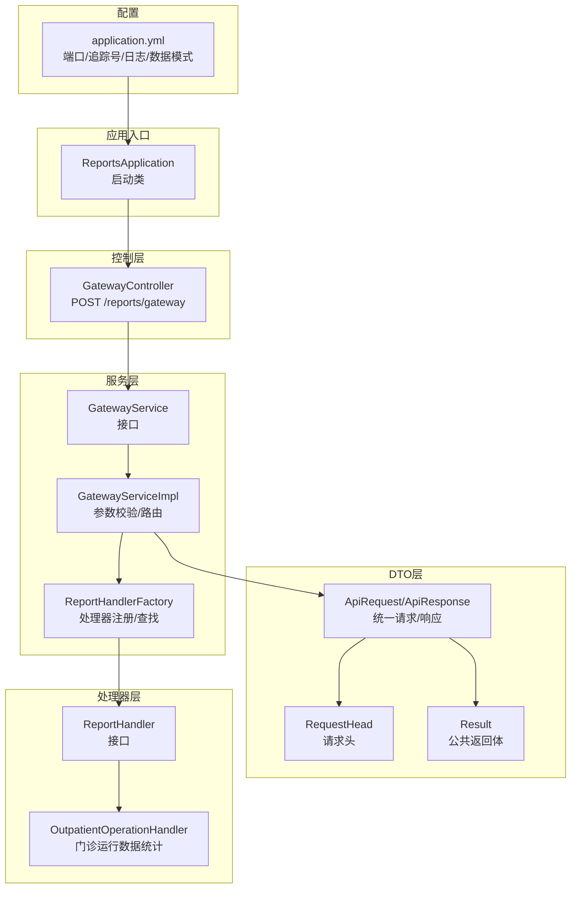
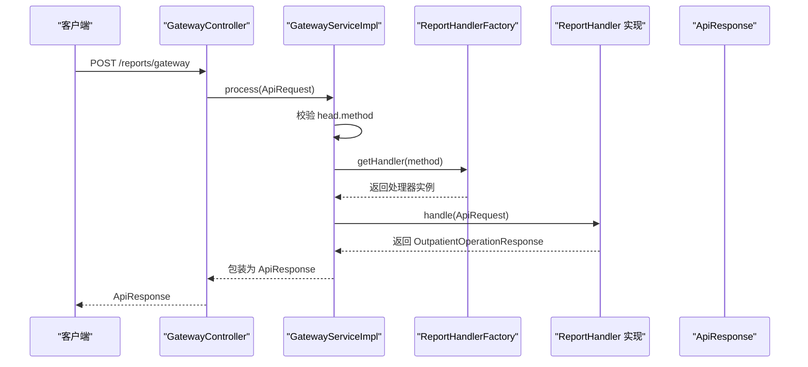
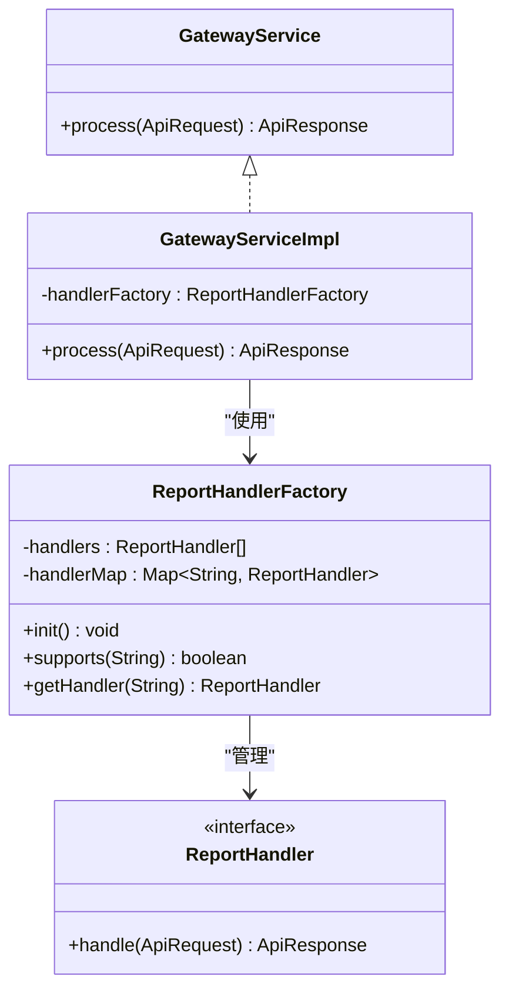
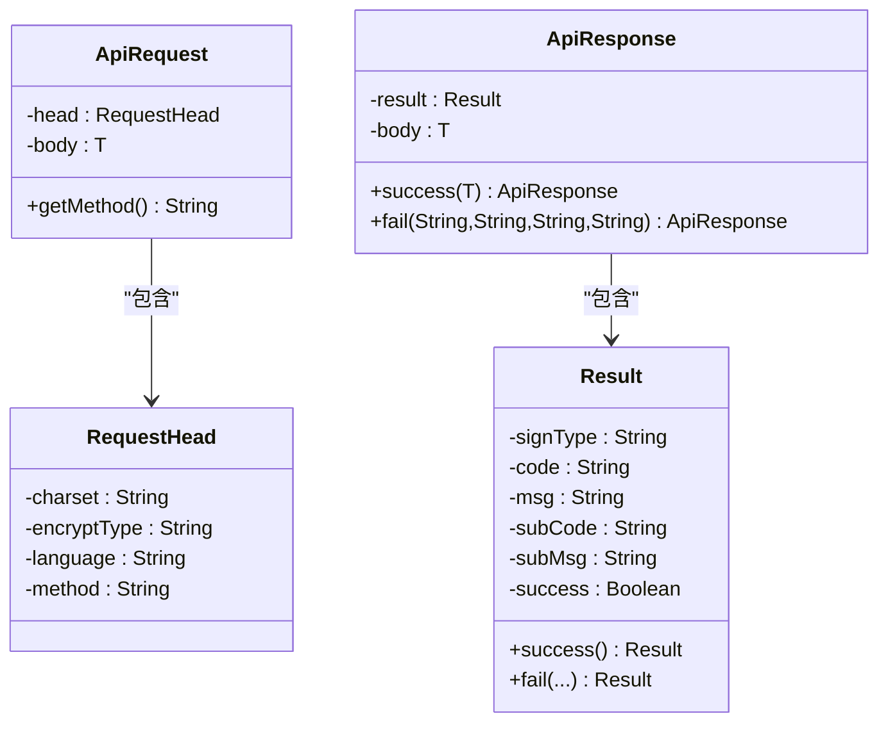
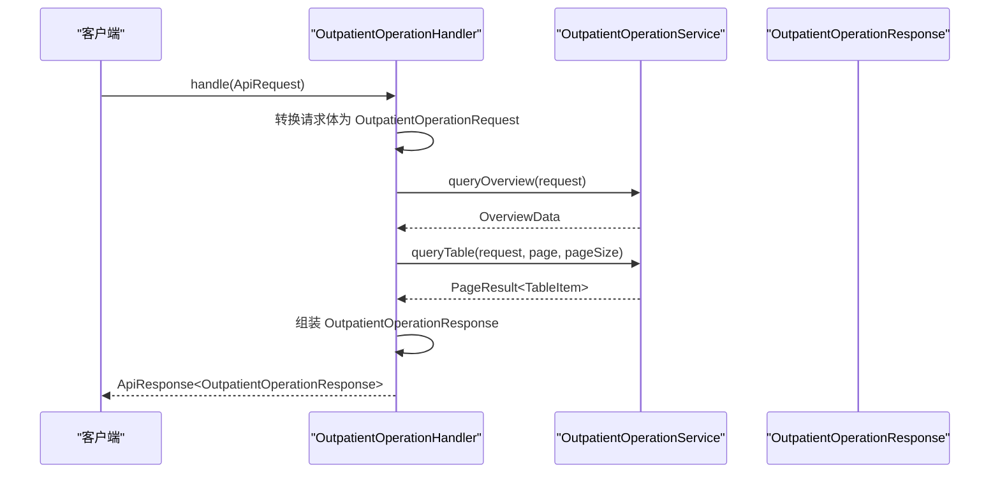
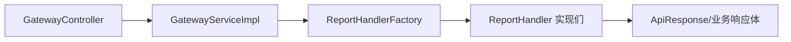

# 互联网医院API

<cite>
**本文引用的文件**
- [ReportsApplication.java](file://src/main/java/com/reports/ReportsApplication.java)
- [GatewayController.java](file://src/main/java/com/reports/controller/GatewayController.java)
- [GatewayService.java](file://src/main/java/com/reports/service/GatewayService.java)
- [GatewayServiceImpl.java](file://src/main/java/com/reports/service/impl/GatewayServiceImpl.java)
- [ReportHandler.java](file://src/main/java/com/reports/service/handler/ReportHandler.java)
- [ReportHandlerFactory.java](file://src/main/java/com/reports/service/handler/ReportHandlerFactory.java)
- [MethodMapping.java](file://src/main/java/com/reports/service/handler/MethodMapping.java)
- [ApiRequest.java](file://src/main/java/com/reports/dto/common/ApiRequest.java)
- [ApiResponse.java](file://src/main/java/com/reports/dto/common/ApiResponse.java)
- [RequestHead.java](file://src/main/java/com/reports/dto/common/RequestHead.java)
- [Result.java](file://src/main/java/com/reports/dto/common/Result.java)
- [OutpatientOperationRequest.java](file://src/main/java/com/reports/dto/request/OutpatientOperationRequest.java)
- [OutpatientOperationResponse.java](file://src/main/java/com/reports/dto/response/OutpatientOperationResponse.java)
- [OutpatientOperationHandler.java](file://src/main/java/com/reports/service/handler/impl/OutpatientOperationHandler.java)
- [application.yml](file://src/main/resources/application.yml)
</cite>

## 目录
1. [简介](#简介)
2. [项目结构](#项目结构)
3. [核心组件](#核心组件)
4. [架构总览](#架构总览)
5. [详细组件分析](#详细组件分析)
6. [依赖分析](#依赖分析)
7. [性能考虑](#性能考虑)
8. [故障排查指南](#故障排查指南)
9. [结论](#结论)
10. [附录](#附录)

## 简介
本项目为互联网医院提供统一的报表与统计分析API网关，围绕线上医疗服务的关键指标，如在线问诊量、电子处方统计、远程会诊分析、线上服务满意度等，构建统一的数据查询与展示能力。系统采用“网关 + 处理器工厂 + 多种报表处理器”的架构设计，通过 method 路由分发到不同的业务处理器，实现高内聚、低耦合的扩展式报表体系。

## 项目结构
后端基于 Spring Boot，核心模块包括：
- 应用入口：启动类负责应用初始化
- 控制层：统一网关入口，接收请求并交由服务层处理
- 服务层：网关服务负责校验与路由，工厂负责处理器注册与查找
- DTO 层：统一请求/响应封装、公共返回体、请求头
- 处理器层：按业务划分的报表处理器，通过注解注册到工厂
- 配置：应用端口、追踪号规则、日志级别、数据模式等

图表来源
- [ReportsApplication.java:11-16](file://src/main/java/com/reports/ReportsApplication.java#L11-L16)
- [GatewayController.java:18-35](file://src/main/java/com/reports/controller/GatewayController.java#L18-L35)
- [GatewayServiceImpl.java:20-48](file://src/main/java/com/reports/service/impl/GatewayServiceImpl.java#L20-L48)
- [ReportHandlerFactory.java:21-51](file://src/main/java/com/reports/service/handler/ReportHandlerFactory.java#L21-L51)
- [ApiRequest.java:13-34](file://src/main/java/com/reports/dto/common/ApiRequest.java#L13-L34)
- [RequestHead.java:11-36](file://src/main/java/com/reports/dto/common/RequestHead.java#L11-L36)
- [Result.java:11-77](file://src/main/java/com/reports/dto/common/Result.java#L11-L77)
- [ReportHandler.java:19-27](file://src/main/java/com/reports/service/handler/ReportHandler.java#L19-L27)
- [OutpatientOperationHandler.java:22-62](file://src/main/java/com/reports/service/handler/impl/OutpatientOperationHandler.java#L22-L62)
- [application.yml:1-32](file://src/main/resources/application.yml#L1-L32)

章节来源
- [ReportsApplication.java:11-16](file://src/main/java/com/reports/ReportsApplication.java#L11-L16)
- [application.yml:1-32](file://src/main/resources/application.yml#L1-L32)

## 核心组件
- 统一网关入口：接收统一请求，透传至网关服务处理
- 网关服务：校验请求合法性，解析 method 并路由到对应处理器
- 处理器工厂：自动扫描并注册带有路由注解的处理器，提供按 method 查找
- 统一请求/响应封装：统一封装请求头、请求体、返回体与业务状态
- 报表处理器：面向具体业务的统计实现，如门诊运行数据统计

章节来源
- [GatewayController.java:18-35](file://src/main/java/com/reports/controller/GatewayController.java#L18-L35)
- [GatewayService.java:9-16](file://src/main/java/com/reports/service/GatewayService.java#L9-L16)
- [GatewayServiceImpl.java:20-48](file://src/main/java/com/reports/service/impl/GatewayServiceImpl.java#L20-L48)
- [ReportHandlerFactory.java:21-73](file://src/main/java/com/reports/service/handler/ReportHandlerFactory.java#L21-L73)
- [ApiRequest.java:13-34](file://src/main/java/com/reports/dto/common/ApiRequest.java#L13-L34)
- [ApiResponse.java:13-56](file://src/main/java/com/reports/dto/common/ApiResponse.java#L13-L56)
- [RequestHead.java:11-36](file://src/main/java/com/reports/dto/common/RequestHead.java#L11-L36)
- [Result.java:11-77](file://src/main/java/com/reports/dto/common/Result.java#L11-L77)

## 架构总览
系统采用“单点入口 + 多处理器”的网关架构，请求经由统一网关进入，依据 method 分发到对应处理器执行业务逻辑，最终以统一响应体返回。

图表来源
- [GatewayController.java:31-35](file://src/main/java/com/reports/controller/GatewayController.java#L31-L35)
- [GatewayServiceImpl.java:31-47](file://src/main/java/com/reports/service/impl/GatewayServiceImpl.java#L31-L47)
- [ReportHandlerFactory.java:58-64](file://src/main/java/com/reports/service/handler/ReportHandlerFactory.java#L58-L64)
- [OutpatientOperationHandler.java:34-61](file://src/main/java/com/reports/service/handler/impl/OutpatientOperationHandler.java#L34-L61)
- [ApiResponse.java:38-54](file://src/main/java/com/reports/dto/common/ApiResponse.java#L38-L54)

## 详细组件分析

### 统一网关入口
- 责任：接收请求，记录日志，调用网关服务处理
- 关键点：路径固定为 /reports/gateway；请求体为统一 ApiRequest；返回统一 ApiResponse

章节来源
- [GatewayController.java:18-35](file://src/main/java/com/reports/controller/GatewayController.java#L18-L35)

### 网关服务与工厂
- 网关服务：校验请求头 method，为空则抛出业务异常；根据 method 从工厂获取处理器并执行
- 处理器工厂：扫描所有 ReportHandler 实现，读取 MethodMapping 注解中的 method 值进行注册；提供 supports/getHandler 方法

图表来源
- [GatewayService.java:9-16](file://src/main/java/com/reports/service/GatewayService.java#L9-L16)
- [GatewayServiceImpl.java:20-48](file://src/main/java/com/reports/service/impl/GatewayServiceImpl.java#L20-L48)
- [ReportHandlerFactory.java:21-73](file://src/main/java/com/reports/service/handler/ReportHandlerFactory.java#L21-L73)
- [ReportHandler.java:19-27](file://src/main/java/com/reports/service/handler/ReportHandler.java#L19-L27)

章节来源
- [GatewayServiceImpl.java:20-48](file://src/main/java/com/reports/service/impl/GatewayServiceImpl.java#L20-L48)
- [ReportHandlerFactory.java:21-73](file://src/main/java/com/reports/service/handler/ReportHandlerFactory.java#L21-L73)

### 统一请求/响应与请求头
- 统一请求：包含 RequestHead（含 method）与任意类型请求体
- 统一响应：包含 Result（code/msg/subCode/subMsg/success）与业务响应体
- 请求头：包含字符集、加密类型、语言与 method

图表来源
- [ApiRequest.java:13-34](file://src/main/java/com/reports/dto/common/ApiRequest.java#L13-L34)
- [ApiResponse.java:13-56](file://src/main/java/com/reports/dto/common/ApiResponse.java#L13-L56)
- [RequestHead.java:11-36](file://src/main/java/com/reports/dto/common/RequestHead.java#L11-L36)
- [Result.java:11-77](file://src/main/java/com/reports/dto/common/Result.java#L11-L77)

章节来源
- [ApiRequest.java:13-34](file://src/main/java/com/reports/dto/common/ApiRequest.java#L13-L34)
- [ApiResponse.java:13-56](file://src/main/java/com/reports/dto/common/ApiResponse.java#L13-L56)
- [RequestHead.java:11-36](file://src/main/java/com/reports/dto/common/RequestHead.java#L11-L36)
- [Result.java:11-77](file://src/main/java/com/reports/dto/common/Result.java#L11-L77)

### 报表处理器与示例：门诊运行数据统计
- 处理器职责：将通用 ApiRequest 的 body 转换为具体请求类型，调用服务查询概览与分页表格数据，组装统一响应
- 路由标识：通过 MethodMapping 注解声明 method，如 reports.outp.outpatient-operation
- 请求参数：开始日期、结束日期、科室编码/名称等
- 响应结构：包含概览数据与分页表格数据

图表来源
- [OutpatientOperationHandler.java:34-61](file://src/main/java/com/reports/service/handler/impl/OutpatientOperationHandler.java#L34-L61)
- [OutpatientOperationRequest.java:12-36](file://src/main/java/com/reports/dto/request/OutpatientOperationRequest.java#L12-L36)
- [OutpatientOperationResponse.java:10-24](file://src/main/java/com/reports/dto/response/OutpatientOperationResponse.java#L10-L24)

章节来源
- [OutpatientOperationHandler.java:22-62](file://src/main/java/com/reports/service/handler/impl/OutpatientOperationHandler.java#L22-L62)
- [OutpatientOperationRequest.java:12-36](file://src/main/java/com/reports/dto/request/OutpatientOperationRequest.java#L12-L36)
- [OutpatientOperationResponse.java:10-24](file://src/main/java/com/reports/dto/response/OutpatientOperationResponse.java#L10-L24)

### 方法映射注解
- 作用：为处理器实现类声明 method 路由键，工厂在初始化时读取并注册
- 规范：value 不可为空；重复注册会发出警告并覆盖

章节来源
- [ReportHandlerFactory.java:32-51](file://src/main/java/com/reports/service/handler/ReportHandlerFactory.java#L32-L51)
- [MethodMapping.java](file://src/main/java/com/reports/service/handler/MethodMapping.java)

## 依赖分析
- 组件内聚性：控制器仅负责入口与日志；服务层负责路由与异常；处理器专注于业务数据聚合
- 松耦合：通过 method 与注解实现运行时绑定，新增报表只需实现 ReportHandler 并标注 MethodMapping
- 可扩展性：工厂模式集中管理处理器生命周期与注册，便于横向扩展

图表来源
- [GatewayController.java:18-35](file://src/main/java/com/reports/controller/GatewayController.java#L18-L35)
- [GatewayServiceImpl.java:20-48](file://src/main/java/com/reports/service/impl/GatewayServiceImpl.java#L20-L48)
- [ReportHandlerFactory.java:21-73](file://src/main/java/com/reports/service/handler/ReportHandlerFactory.java#L21-L73)
- [ReportHandler.java:19-27](file://src/main/java/com/reports/service/handler/ReportHandler.java#L19-L27)

## 性能考虑
- 处理器注册：工厂在容器启动时完成扫描与注册，避免运行时反射开销
- 路由查找：使用并发安全的 Map 存储，查找复杂度近似 O(1)
- 日志追踪：统一注入 traceId，便于链路追踪与性能定位
- 数据模式：配置中提供 mock/jdbc/mybatis-plus 等数据模式，便于在不同环境切换

章节来源
- [ReportHandlerFactory.java:24-51](file://src/main/java/com/reports/service/handler/ReportHandlerFactory.java#L24-L51)
- [application.yml:13-23](file://src/main/resources/application.yml#L13-L23)

## 故障排查指南
- method 缺失或为空：网关服务会抛出业务异常，检查请求头中的 method 字段
- method 未找到：工厂未注册对应处理器，检查处理器是否实现 ReportHandler 并正确标注 MethodMapping
- 参数转换失败：处理器内部将通用请求体转换为具体类型，若转换失败，检查请求体结构与字段命名
- 异常处理：全局异常处理与业务异常配合，确保错误信息标准化输出

章节来源
- [GatewayServiceImpl.java:33-47](file://src/main/java/com/reports/service/impl/GatewayServiceImpl.java#L33-L47)
- [ReportHandlerFactory.java:45-46](file://src/main/java/com/reports/service/handler/ReportHandlerFactory.java#L45-L46)

## 结论
本项目通过统一网关与工厂化处理器设计，为互联网医院提供了清晰、可扩展的统计分析API框架。结合门诊运行数据统计示例，可快速扩展在线问诊量、电子处方统计、远程会诊分析、线上服务满意度等指标的查询与展示能力。建议后续在以下方面持续优化：
- 新增更多报表处理器，覆盖更多业务场景
- 完善数据源适配（JDBC/MyBatis Plus），提升真实数据支撑能力
- 引入缓存与分页策略，优化大数据量查询性能
- 增强监控与告警，完善链路追踪与日志分析

## 附录
- 启动与访问
  - 应用启动类：ReportsApplication
  - 端口与上下文：application.yml 中配置
  - 访问路径：POST /reports/gateway
- 示例请求体结构
  - 请求头：包含 method、字符集、加密类型、语言
  - 请求体：具体业务请求对象（如门诊运行数据统计请求）
- 响应体结构
  - 返回统一 ApiResponse，包含 Result 与业务响应体

章节来源
- [ReportsApplication.java:11-16](file://src/main/java/com/reports/ReportsApplication.java#L11-L16)
- [application.yml:1-32](file://src/main/resources/application.yml#L1-L32)
- [ApiRequest.java:13-34](file://src/main/java/com/reports/dto/common/ApiRequest.java#L13-L34)
- [ApiResponse.java:13-56](file://src/main/java/com/reports/dto/common/ApiResponse.java#L13-L56)