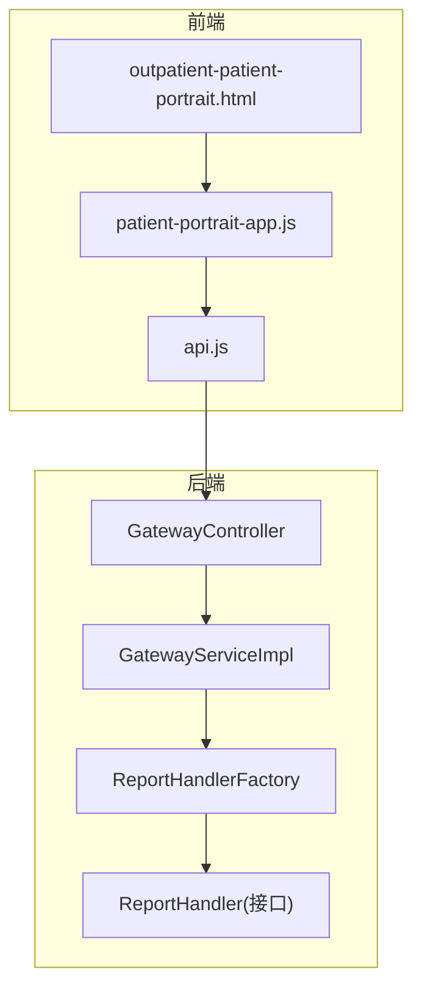
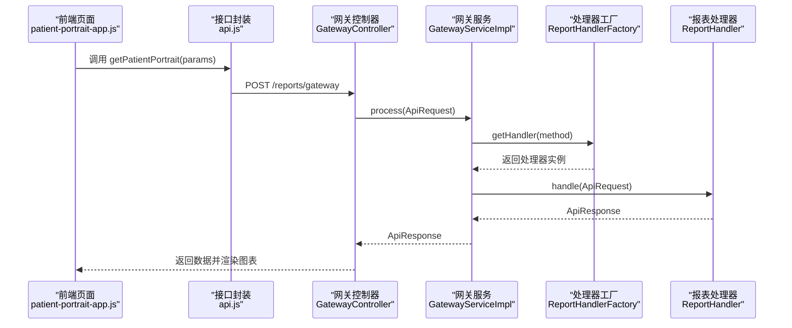
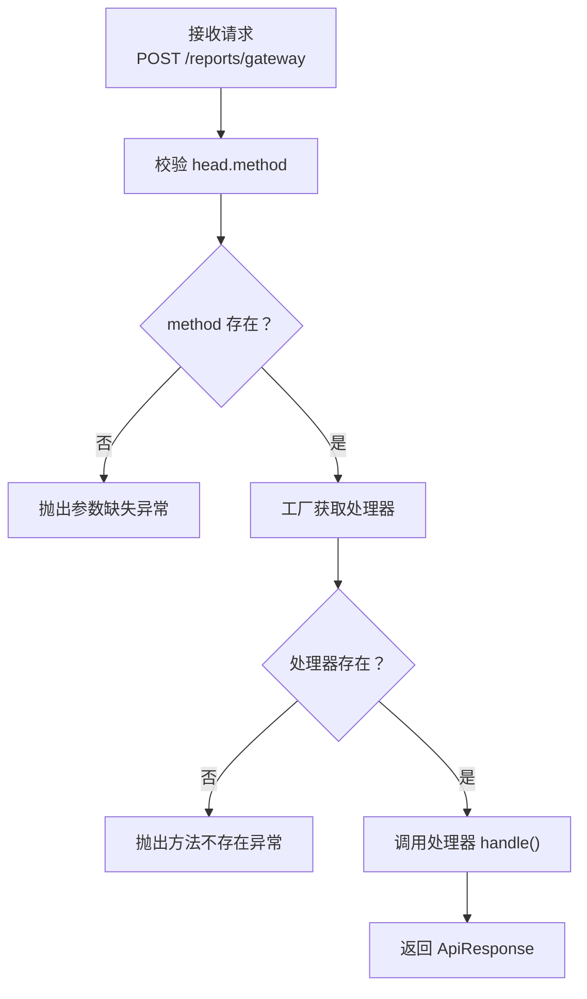
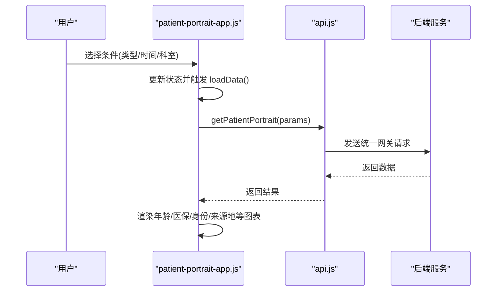
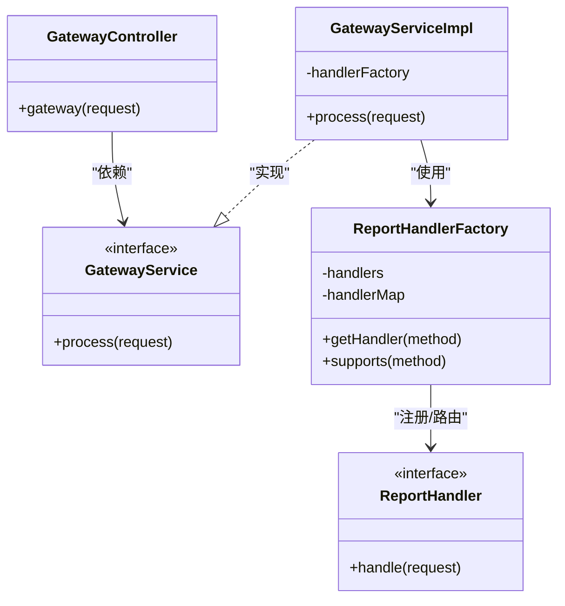

# 患者画像分析API

<cite>
**本文档引用的文件**
- [GatewayController.java](file://src/main/java/com/reports/controller/GatewayController.java)
- [GatewayService.java](file://src/main/java/com/reports/service/GatewayService.java)
- [GatewayServiceImpl.java](file://src/main/java/com/reports/service/impl/GatewayServiceImpl.java)
- [ReportHandler.java](file://src/main/java/com/reports/service/handler/ReportHandler.java)
- [ReportHandlerFactory.java](file://src/main/java/com/reports/service/handler/ReportHandlerFactory.java)
- [ApiRequest.java](file://src/main/java/com/reports/dto/common/ApiRequest.java)
- [ApiResponse.java](file://src/main/java/com/reports/dto/common/ApiResponse.java)
- [RequestHead.java](file://src/main/java/com/reports/dto/common/RequestHead.java)
- [BaseRequestBody.java](file://src/main/java/com/reports/dto/common/BaseRequestBody.java)
- [Result.java](file://src/main/java/com/reports/dto/common/Result.java)
- [ResultCode.java](file://src/main/java/com/reports/enums/ResultCode.java)
- [outpatient-patient-portrait.html](file://reports-web/outpatient/outpatient-patient-portrait.html)
- [patient-portrait-app.js](file://reports-web/outpatient/js/patient-portrait-app.js)
- [api.js](file://reports-web/outpatient/js/api.js)
</cite>

## 目录
1. [简介](#简介)
2. [项目结构](#项目结构)
3. [核心组件](#核心组件)
4. [架构总览](#架构总览)
5. [详细组件分析](#详细组件分析)
6. [依赖关系分析](#依赖关系分析)
7. [性能考虑](#性能考虑)
8. [故障排除指南](#故障排除指南)
9. [结论](#结论)
10. [附录](#附录)

## 简介
本项目提供基于患者历史就诊数据的画像分析能力，涵盖患者年龄分布、疾病谱分析、就诊偏好分析与健康风险评估等维度。前端通过统一网关接口调用后端报表处理器，返回多维统计图表数据，支撑精准医疗与患者服务优化决策。

## 项目结构
系统采用前后端分离架构，前端负责可视化展示与交互，后端提供统一网关与处理器工厂模式，按 method 路由到具体报表处理器。

**图示来源**
- [GatewayController.java:1-38](file://src/main/java/com/reports/controller/GatewayController.java#L1-L38)
- [GatewayServiceImpl.java:1-51](file://src/main/java/com/reports/service/impl/GatewayServiceImpl.java#L1-L51)
- [ReportHandlerFactory.java:1-74](file://src/main/java/com/reports/service/handler/ReportHandlerFactory.java#L1-L74)
- [ReportHandler.java:1-28](file://src/main/java/com/reports/service/handler/ReportHandler.java#L1-L28)
- [outpatient-patient-portrait.html:1-127](file://reports-web/outpatient/outpatient-patient-portrait.html#L1-L127)
- [patient-portrait-app.js:1-247](file://reports-web/outpatient/js/patient-portrait-app.js#L1-L247)
- [api.js:1-159](file://reports-web/outpatient/js/api.js#L1-L159)

**章节来源**
- [GatewayController.java:1-38](file://src/main/java/com/reports/controller/GatewayController.java#L1-L38)
- [GatewayServiceImpl.java:1-51](file://src/main/java/com/reports/service/impl/GatewayServiceImpl.java#L1-L51)
- [ReportHandlerFactory.java:1-74](file://src/main/java/com/reports/service/handler/ReportHandlerFactory.java#L1-L74)
- [outpatient-patient-portrait.html:1-127](file://reports-web/outpatient/outpatient-patient-portrait.html#L1-L127)

## 核心组件
- 统一网关控制器：接收统一请求报文，转发至网关服务处理。
- 网关服务实现：校验请求、根据 method 查找处理器并执行。
- 处理器工厂：自动扫描并注册带注解的报表处理器，按 method 路由。
- 报表处理器接口：定义 handle 方法，承载具体业务逻辑。
- 统一请求/响应DTO：封装 head、body、结果码与通用字段。
- 前端页面与应用：提供患者画像可视化界面与交互逻辑。

**章节来源**
- [GatewayController.java:1-38](file://src/main/java/com/reports/controller/GatewayController.java#L1-L38)
- [GatewayService.java:1-17](file://src/main/java/com/reports/service/GatewayService.java#L1-L17)
- [GatewayServiceImpl.java:1-51](file://src/main/java/com/reports/service/impl/GatewayServiceImpl.java#L1-L51)
- [ReportHandler.java:1-28](file://src/main/java/com/reports/service/handler/ReportHandler.java#L1-L28)
- [ReportHandlerFactory.java:1-74](file://src/main/java/com/reports/service/handler/ReportHandlerFactory.java#L1-L74)
- [ApiRequest.java:1-35](file://src/main/java/com/reports/dto/common/ApiRequest.java#L1-L35)
- [ApiResponse.java:1-57](file://src/main/java/com/reports/dto/common/ApiResponse.java#L1-L57)
- [RequestHead.java:1-37](file://src/main/java/com/reports/dto/common/RequestHead.java#L1-L37)
- [BaseRequestBody.java:1-31](file://src/main/java/com/reports/dto/common/BaseRequestBody.java#L1-L31)
- [Result.java:1-78](file://src/main/java/com/reports/dto/common/Result.java#L1-L78)
- [ResultCode.java:1-77](file://src/main/java/com/reports/enums/ResultCode.java#L1-L77)

## 架构总览
统一网关采用方法名路由机制，前端通过统一配置调用不同报表 endpoint，后端按 method 分发到对应处理器。

**图示来源**
- [patient-portrait-app.js:97-111](file://reports-web/outpatient/js/patient-portrait-app.js#L97-L111)
- [api.js:55-61](file://reports-web/outpatient/js/api.js#L55-L61)
- [GatewayController.java:28-35](file://src/main/java/com/reports/controller/GatewayController.java#L28-L35)
- [GatewayServiceImpl.java:29-48](file://src/main/java/com/reports/service/impl/GatewayServiceImpl.java#L29-L48)
- [ReportHandlerFactory.java:54-64](file://src/main/java/com/reports/service/handler/ReportHandlerFactory.java#L54-L64)
- [ReportHandler.java:19-27](file://src/main/java/com/reports/service/handler/ReportHandler.java#L19-L27)

## 详细组件分析

### 统一网关与请求处理流程
- 控制器接收 POST /reports/gateway，封装为 ApiRequest 并交由网关服务处理。
- 网关服务校验 head.method，通过工厂按 method 获取处理器并执行。
- 处理器返回 ApiResponse，包含公共 Result 与业务 body。

**图示来源**
- [GatewayController.java:28-35](file://src/main/java/com/reports/controller/GatewayController.java#L28-L35)
- [GatewayServiceImpl.java:29-48](file://src/main/java/com/reports/service/impl/GatewayServiceImpl.java#L29-L48)
- [ReportHandlerFactory.java:54-64](file://src/main/java/com/reports/service/handler/ReportHandlerFactory.java#L54-L64)

**章节来源**
- [GatewayController.java:1-38](file://src/main/java/com/reports/controller/GatewayController.java#L1-L38)
- [GatewayServiceImpl.java:1-51](file://src/main/java/com/reports/service/impl/GatewayServiceImpl.java#L1-L51)
- [ReportHandlerFactory.java:1-74](file://src/main/java/com/reports/service/handler/ReportHandlerFactory.java#L1-L74)

### 前端交互与数据渲染
- 页面提供患者类型、时间范围、科室筛选等条件。
- 应用逻辑根据用户选择动态加载数据并渲染多图表。
- 支持 Mock/真实接口切换，便于开发调试。

**图示来源**
- [outpatient-patient-portrait.html:24-62](file://reports-web/outpatient/outpatient-patient-portrait.html#L24-L62)
- [patient-portrait-app.js:18-119](file://reports-web/outpatient/js/patient-portrait-app.js#L18-L119)
- [api.js:55-61](file://reports-web/outpatient/js/api.js#L55-L61)

**章节来源**
- [outpatient-patient-portrait.html:1-127](file://reports-web/outpatient/outpatient-patient-portrait.html#L1-L127)
- [patient-portrait-app.js:1-247](file://reports-web/outpatient/js/patient-portrait-app.js#L1-L247)
- [api.js:1-159](file://reports-web/outpatient/js/api.js#L1-L159)

### 数据模型与接口规范

#### 统一请求报文
- head：包含 method、字符集、加密类型、语言等。
- body：泛型请求体，支持扩展参数。

**章节来源**
- [ApiRequest.java:1-35](file://src/main/java/com/reports/dto/common/ApiRequest.java#L1-L35)
- [RequestHead.java:1-37](file://src/main/java/com/reports/dto/common/RequestHead.java#L1-L37)
- [BaseRequestBody.java:1-31](file://src/main/java/com/reports/dto/common/BaseRequestBody.java#L1-L31)

#### 统一响应报文
- result：包含 code、msg、subCode、subMsg、success 等。
- body：业务响应数据。

**章节来源**
- [ApiResponse.java:1-57](file://src/main/java/com/reports/dto/common/ApiResponse.java#L1-L57)
- [Result.java:1-78](file://src/main/java/com/reports/dto/common/Result.java#L1-L78)
- [ResultCode.java:1-77](file://src/main/java/com/reports/enums/ResultCode.java#L1-L77)

### 患者画像分析接口定义

- 接口名称：获取患者画像数据
- 方法：GET
- 路径：/api/outpatient/patient-portrait
- 方法名：reports.outp.outpatient-patient-portrait.endpoint
- 请求参数：
  - patientType：患者类型（outpatient/inpatient）
  - startDate：开始日期（yyyy-MM-dd）
  - endDate：结束日期（yyyy-MM-dd）
  - deptName：科室名称（可选）
- 响应数据：
  - ageAnalysis：年龄区间分析（含建档量、门诊量分类与数值）
  - insuranceAnalysis：医保身份构成分析
  - identityAnalysis：身份类别构成分析
  - registerOriginAnalysis：挂号患者归属地分析
  - archiveOriginAnalysis：建档患者归属地分析

**章节来源**
- [api.js:55-61](file://reports-web/outpatient/js/api.js#L55-L61)
- [patient-portrait-app.js:97-119](file://reports-web/outpatient/js/patient-portrait-app.js#L97-L119)
- [outpatient-patient-portrait.html:24-62](file://reports-web/outpatient/outpatient-patient-portrait.html#L24-L62)

## 依赖关系分析
- 控制器依赖网关服务；网关服务依赖处理器工厂；工厂依赖处理器接口实现。
- 前端通过 api.js 封装统一方法名调用，映射到后端具体报表处理器。
- 统一 DTO 提供跨模块一致的请求/响应结构。

**图示来源**
- [GatewayController.java:1-38](file://src/main/java/com/reports/controller/GatewayController.java#L1-L38)
- [GatewayService.java:1-17](file://src/main/java/com/reports/service/GatewayService.java#L1-L17)
- [GatewayServiceImpl.java:1-51](file://src/main/java/com/reports/service/impl/GatewayServiceImpl.java#L1-L51)
- [ReportHandlerFactory.java:1-74](file://src/main/java/com/reports/service/handler/ReportHandlerFactory.java#L1-L74)
- [ReportHandler.java:1-28](file://src/main/java/com/reports/service/handler/ReportHandler.java#L1-L28)

**章节来源**
- [GatewayController.java:1-38](file://src/main/java/com/reports/controller/GatewayController.java#L1-L38)
- [GatewayServiceImpl.java:1-51](file://src/main/java/com/reports/service/impl/GatewayServiceImpl.java#L1-L51)
- [ReportHandlerFactory.java:1-74](file://src/main/java/com/reports/service/handler/ReportHandlerFactory.java#L1-L74)

## 性能考虑
- 图表渲染：前端使用 ECharts，建议在大数据量时启用渐进式渲染与数据分页。
- 网关路由：处理器工厂初始化时一次性注册，运行期按 method 查找为 O(1)，避免重复扫描。
- 请求校验：网关服务在进入业务处理前完成参数校验，减少无效调用。
- 建议：对高频查询增加缓存策略与限流保护，确保系统稳定性。

## 故障排除指南
- 参数缺失：当 head.method 为空时，抛出参数缺失异常。
- 方法不存在：当 method 未注册处理器时，抛出方法不存在异常。
- 业务异常：通过 ResultCode 枚举统一错误码，前端据此提示用户或重试。

**章节来源**
- [GatewayServiceImpl.java:29-48](file://src/main/java/com/reports/service/impl/GatewayServiceImpl.java#L29-L48)
- [ResultCode.java:1-77](file://src/main/java/com/reports/enums/ResultCode.java#L1-L77)

## 结论
本项目通过统一网关与处理器工厂模式，实现了灵活可扩展的报表接口体系。患者画像分析接口提供多维度统计视图，结合前端可视化组件，能够有效支撑精准医疗与患者服务优化实践。

## 附录

### 方法名与接口映射参考
- 患者画像：reports.outp.outpatient-patient-portrait.endpoint
- 门诊运行：reports.outp.outpatient-operation
- 门诊收入：reports.outp.outpatient-revenue
- 人工窗口：reports.outp.outpatient-window-stats
- 检验统计：reports.outp.outpatient-lab-stats
- 医技统计：reports.outp.outpatient-med-tech
- 爽约退号：reports.outp.outpatient-no-show
- 门诊预警：reports.outp.outpatient-alert
- 诊室使用率：reports.outp.outpatient-room-usage
- 专科治疗：reports.outp.outpatient-specialty-treatment
- 治疗统计：reports.outp.outpatient-treatment-stats
- 预测统计：reports.outp.outpatient-forecast
- 服务质量：reports.outp.outpatient-service-quality
- 质量控制：reports.outp.outpatient-quality-control
- 互联网医院：reports.outp.outpatient-internet-hospital

**章节来源**
- [api.js:1-159](file://reports-web/outpatient/js/api.js#L1-L159)