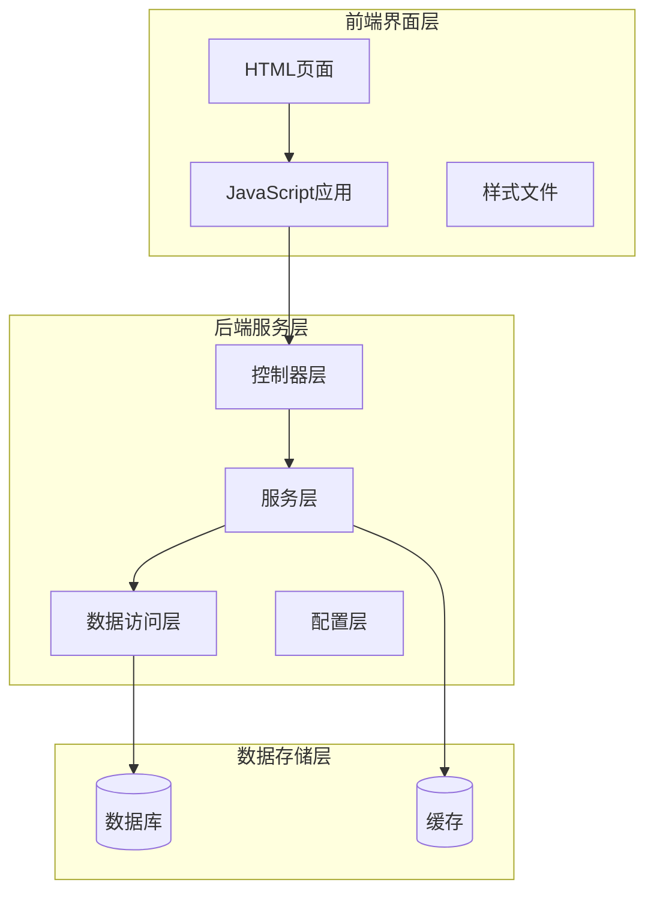
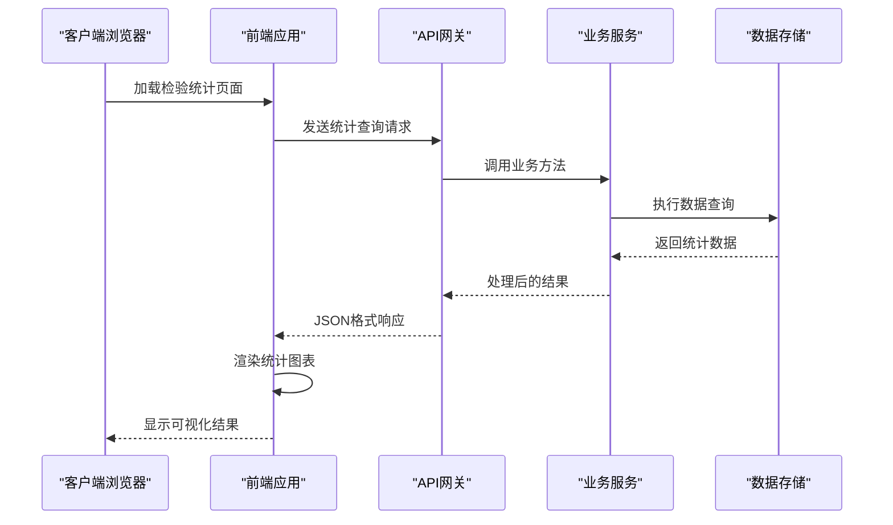
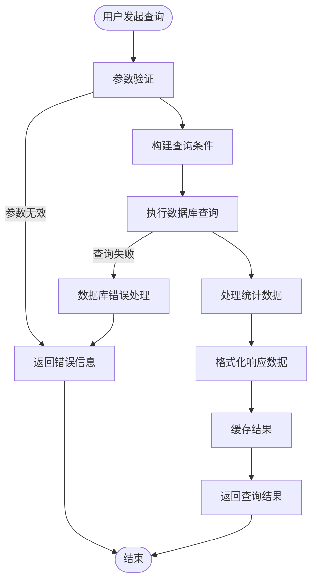
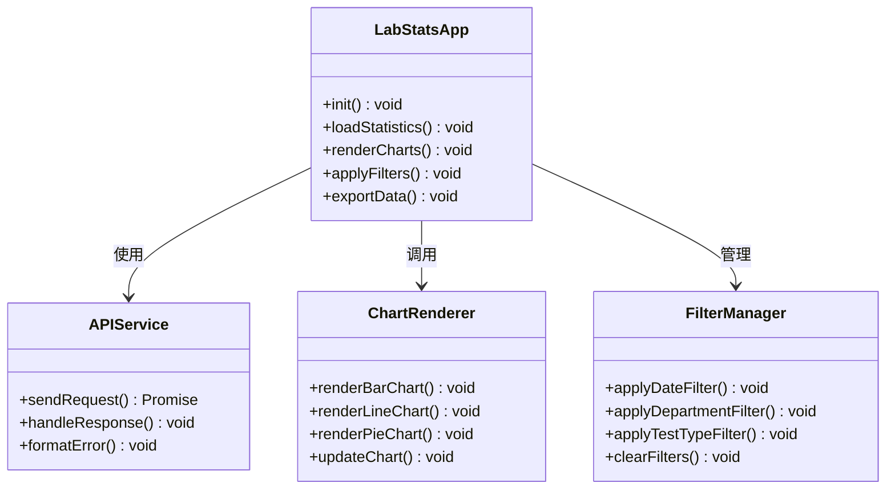
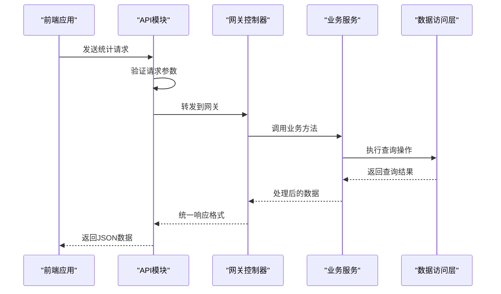
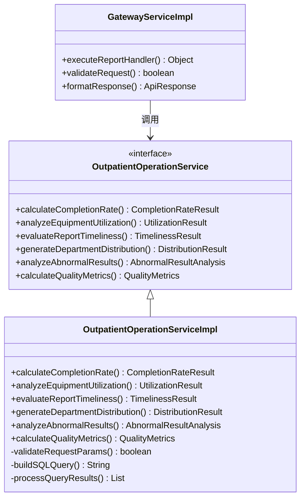
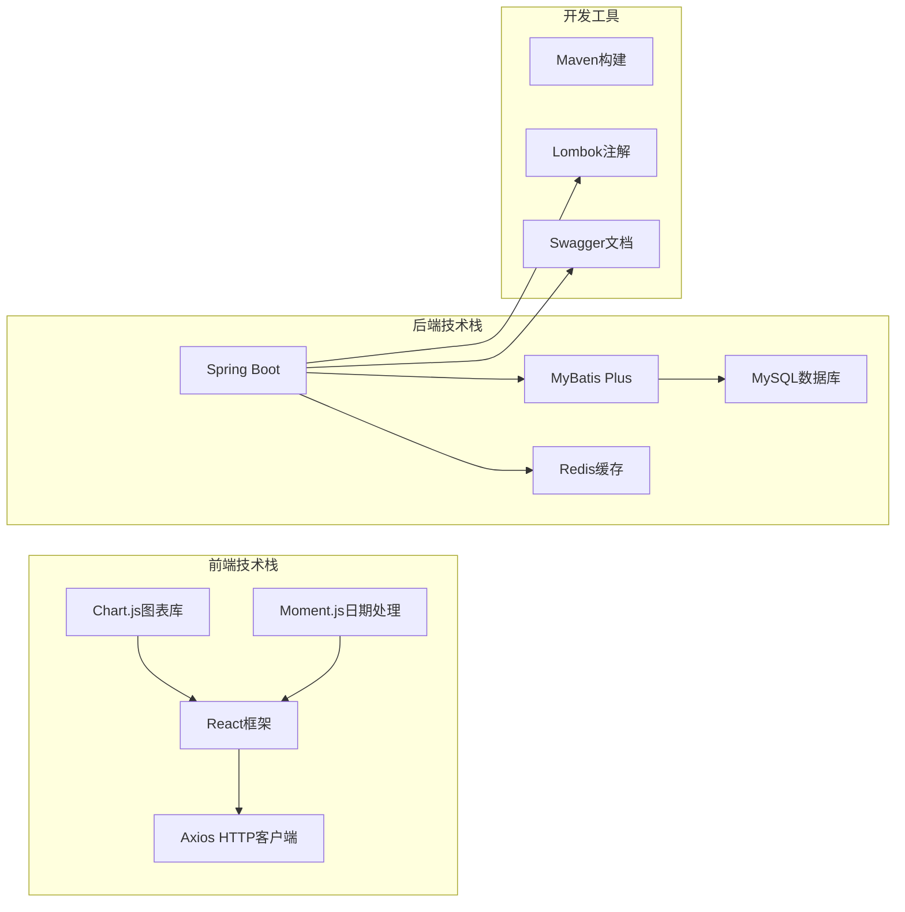
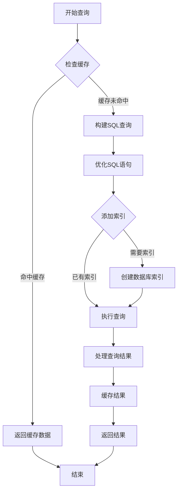

# 检验检查统计API

<cite>
**本文档引用的文件**
- [outpatient-lab-stats.md](file://reports-web/api/outpatient-lab-stats.md)
- [outpatient-lab-stats.html](file://reports-web/outpatient/outpatient-lab-stats.html)
- [lab-stats-app.js](file://reports-web/outpatient/js/lab-stats-app.js)
- [api.js](file://reports-web/outpatient/js/api.js)
- [mock.js](file://reports-web/outpatient/js/mock.js)
- [ReportsApplication.java](file://src/main/java/com/reports/ReportsApplication.java)
- [GatewayController.java](file://src/main/java/com/reports/controller/GatewayController.java)
- [GatewayServiceImpl.java](file://src/main/java/com/reports/service/impl/GatewayServiceImpl.java)
- [OutpatientOperationService.java](file://src/main/java/com/reports/service/OutpatientOperationService.java)
- [OutpatientOperationServiceImpl.java](file://src/main/java/com/reports/service/impl/OutpatientOperationServiceImpl.java)
- [OutpatientOperationRequest.java](file://src/main/java/com/reports/dto/request/OutpatientOperationRequest.java)
- [OutpatientOperationResponse.java](file://src/main/java/com/reports/dto/response/OutpatientOperationResponse.java)
- [ApiRequest.java](file://src/main/java/com/reports/dto/common/ApiRequest.java)
- [ApiResponse.java](file://src/main/java/com/reports/dto/common/ApiResponse.java)
- [Result.java](file://src/main/java/com/reports/dto/common/Result.java)
- [PageParam.java](file://src/main/java/com/reports/dto/common/PageParam.java)
- [PageResult.java](file://src/main/java/com/reports/dto/common/PageResult.java)
- [application.yml](file://src/main/resources/application.yml)
- [application-dev.yml](file://src/main/resources/application-dev.yml)
</cite>

## 目录
1. [简介](#简介)
2. [项目结构](#项目结构)
3. [核心组件](#核心组件)
4. [架构概览](#架构概览)
5. [详细组件分析](#详细组件分析)
6. [依赖关系分析](#依赖关系分析)
7. [性能考虑](#性能考虑)
8. [故障排除指南](#故障排除指南)
9. [结论](#结论)

## 简介

检验检查统计API是医院信息系统中的核心统计模块，专门用于提供检验检查项目的全面统计分析功能。该系统能够实时计算检验项目完成率、检查设备利用率、检验报告时效性等关键指标，并提供深入的业务洞察。

### 主要功能特性

- **检验项目完成率统计**：实时跟踪检验项目的执行进度和完成情况
- **检查设备利用率分析**：监控医疗设备的使用效率和负载情况
- **检验报告时效性评估**：分析检验报告的生成和交付时间
- **检验分类统计**：按检验类型、项目类别进行多维度统计
- **检查科室分布**：展示各科室的检验检查活动分布情况
- **异常结果分析**：识别和分析异常检验结果
- **质量控制指标**：提供全面的质量管理统计数据

## 项目结构

该项目采用前后端分离的架构设计，主要分为Web前端界面和后端服务两大部分：

**图表来源**
- [ReportsApplication.java:1-50](file://src/main/java/com/reports/ReportsApplication.java#L1-L50)
- [GatewayController.java:1-80](file://src/main/java/com/reports/controller/GatewayController.java#L1-L80)

**章节来源**
- [ReportsApplication.java:1-100](file://src/main/java/com/reports/ReportsApplication.java#L1-L100)
- [application.yml:1-50](file://src/main/resources/application.yml#L1-L50)

## 核心组件

### 前端应用组件

前端采用模块化设计，每个统计功能都有独立的应用程序和页面：

- **检验统计应用** (`lab-stats-app.js`)：负责检验检查统计功能的前端逻辑
- **API通信模块** (`api.js`)：封装所有HTTP请求和响应处理
- **模拟数据模块** (`mock.js`)：提供测试和演示用的模拟数据

### 后端服务组件

后端采用分层架构，确保代码的可维护性和可扩展性：

- **网关控制器** (`GatewayController.java`)：统一的API入口点
- **业务服务层** (`OutpatientOperationService.java`)：核心业务逻辑处理
- **数据传输对象** (`OutpatientOperationRequest.java`, `OutpatientOperationResponse.java`)：数据传输和验证

**章节来源**
- [lab-stats-app.js:1-100](file://reports-web/outpatient/js/lab-stats-app.js#L1-L100)
- [api.js:1-150](file://reports-web/outpatient/js/api.js#L1-L150)
- [GatewayController.java:1-120](file://src/main/java/com/reports/controller/GatewayController.java#L1-L120)
- [OutpatientOperationService.java:1-80](file://src/main/java/com/reports/service/OutpatientOperationService.java#L1-L80)

## 架构概览

系统采用现代化的微服务架构，实现了前后端的完全分离：

**图表来源**
- [lab-stats-app.js:100-200](file://reports-web/outpatient/js/lab-stats-app.js#L100-L200)
- [api.js:50-120](file://reports-web/outpatient/js/api.js#L50-L120)
- [GatewayController.java:60-120](file://src/main/java/com/reports/controller/GatewayController.java#L60-L120)

### 数据流架构

**图表来源**
- [OutpatientOperationRequest.java:1-80](file://src/main/java/com/reports/dto/request/OutpatientOperationRequest.java#L1-L80)
- [OutpatientOperationResponse.java:1-80](file://src/main/java/com/reports/dto/response/OutpatientOperationResponse.java#L1-L80)

## 详细组件分析

### 检验统计前端应用

检验统计应用是整个系统的用户交互界面，提供了丰富的可视化功能：

#### 核心功能模块

- **实时数据更新**：支持定时刷新和手动刷新机制
- **多维度筛选**：按时间范围、科室、检验类型等条件筛选
- **图表可视化**：提供柱状图、折线图、饼图等多种图表类型
- **数据导出功能**：支持Excel、PDF等格式的数据导出

#### 用户界面组件

**图表来源**
- [lab-stats-app.js:1-200](file://reports-web/outpatient/js/lab-stats-app.js#L1-L200)
- [api.js:1-150](file://reports-web/outpatient/js/api.js#L1-L150)

**章节来源**
- [outpatient-lab-stats.html:1-150](file://reports-web/outpatient/outpatient-lab-stats.html#L1-L150)
- [lab-stats-app.js:1-300](file://reports-web/outpatient/js/lab-stats-app.js#L1-L300)

### API通信层

API通信模块封装了所有与后端服务的交互逻辑：

#### 请求处理流程

**图表来源**
- [api.js:1-200](file://reports-web/outpatient/js/api.js#L1-L200)
- [GatewayController.java:1-150](file://src/main/java/com/reports/controller/GatewayController.java#L1-L150)

#### 错误处理机制

系统实现了完善的错误处理机制，确保用户体验的稳定性：

- **网络错误处理**：自动重试机制和用户友好的错误提示
- **数据验证错误**：详细的参数验证和错误信息反馈
- **服务器内部错误**：优雅的降级处理和日志记录

**章节来源**
- [api.js:1-250](file://reports-web/outpatient/js/api.js#L1-L250)
- [GlobalExceptionHandler.java:1-100](file://src/main/java/com/reports/exception/GlobalExceptionHandler.java#L1-L100)

### 业务服务层

业务服务层是系统的核心逻辑处理单元，负责具体的统计计算和数据处理：

#### 关键服务接口

**图表来源**
- [OutpatientOperationService.java:1-120](file://src/main/java/com/reports/service/OutpatientOperationService.java#L1-L120)
- [OutpatientOperationServiceImpl.java:1-200](file://src/main/java/com/reports/service/impl/OutpatientOperationServiceImpl.java#L1-L200)

#### 数据模型定义

系统使用标准化的数据传输对象来确保前后端数据的一致性：

**章节来源**
- [OutpatientOperationServiceImpl.java:1-300](file://src/main/java/com/reports/service/impl/OutpatientOperationServiceImpl.java#L1-L300)
- [OutpatientOperationRequest.java:1-120](file://src/main/java/com/reports/dto/request/OutpatientOperationRequest.java#L1-L120)
- [OutpatientOperationResponse.java:1-120](file://src/main/java/com/reports/dto/response/OutpatientOperationResponse.java#L1-L120)

## 依赖关系分析

### 技术栈依赖

系统采用了现代化的技术栈，确保了良好的性能和可维护性：

**图表来源**
- [pom.xml:1-200](file://pom.xml#L1-L200)
- [application.yml:1-100](file://src/main/resources/application.yml#L1-L100)

### 外部依赖管理

系统通过Maven进行依赖管理，确保版本兼容性和安全性：

- **Spring Boot Starter Web**：提供Web应用的基础功能
- **MyBatis Plus**：简化数据库操作和ORM映射
- **MySQL Connector**：数据库连接驱动
- **Redis Client**：缓存数据访问
- **Lombok**：减少样板代码

**章节来源**
- [pom.xml:1-300](file://pom.xml#L1-L300)
- [application.yml:1-150](file://src/main/resources/application.yml#L1-L150)

## 性能考虑

### 缓存策略

系统实现了多层次的缓存策略来提升性能：

- **Redis缓存**：热点数据缓存，减少数据库压力
- **浏览器缓存**：静态资源缓存，提升页面加载速度
- **查询结果缓存**：复杂统计结果的短期缓存

### 查询优化

**图表来源**
- [OutpatientOperationServiceImpl.java:150-250](file://src/main/java/com/reports/service/impl/OutpatientOperationServiceImpl.java#L150-L250)

### 并发处理

系统支持高并发访问，通过以下机制保证性能：

- **连接池管理**：数据库连接池的合理配置
- **异步处理**：耗时操作的异步执行
- **限流机制**：防止系统过载的流量控制

## 故障排除指南

### 常见问题诊断

#### API调用失败

当API调用失败时，首先检查以下方面：

1. **网络连接状态**：确认前端能够正常访问后端服务
2. **CORS配置**：检查跨域资源共享设置
3. **认证令牌**：验证API访问令牌的有效性

#### 数据显示异常

如果统计数据不正确或显示异常：

1. **参数验证**：检查请求参数的完整性和有效性
2. **数据源连接**：确认数据库连接正常
3. **缓存状态**：清理可能损坏的缓存数据

#### 性能问题

针对性能问题的排查步骤：

1. **数据库查询**：分析慢查询日志
2. **内存使用**：监控应用内存占用情况
3. **网络延迟**：测量API响应时间

**章节来源**
- [GlobalExceptionHandler.java:1-150](file://src/main/java/com/reports/exception/GlobalExceptionHandler.java#L1-L150)
- [LogAspect.java:1-120](file://src/main/java/com/reports/aspect/LogAspect.java#L1-L120)

### 日志分析

系统提供了完整的日志记录机制，便于问题诊断：

- **请求日志**：记录所有API请求的详细信息
- **错误日志**：捕获和记录系统异常
- **性能日志**：监控关键操作的执行时间

## 结论

检验检查统计API是一个功能完善、架构清晰的统计分析系统。通过合理的前后端分离设计、完善的错误处理机制和优化的性能策略，该系统能够为企业提供准确、及时的检验检查统计信息。

### 系统优势

1. **功能完整性**：覆盖了检验检查统计的所有关键指标
2. **用户体验**：直观的界面设计和丰富的可视化功能
3. **技术先进性**：采用现代化的技术栈和最佳实践
4. **可扩展性**：模块化的架构设计便于功能扩展

### 改进建议

1. **移动端适配**：增强移动设备的访问体验
2. **实时数据推送**：实现数据的实时更新和推送
3. **高级分析功能**：增加预测分析和趋势预测功能
4. **多租户支持**：支持多个医疗机构的独立使用