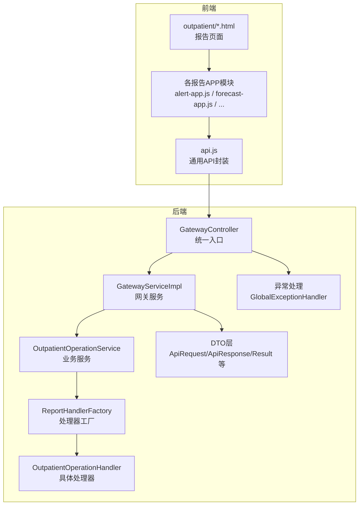
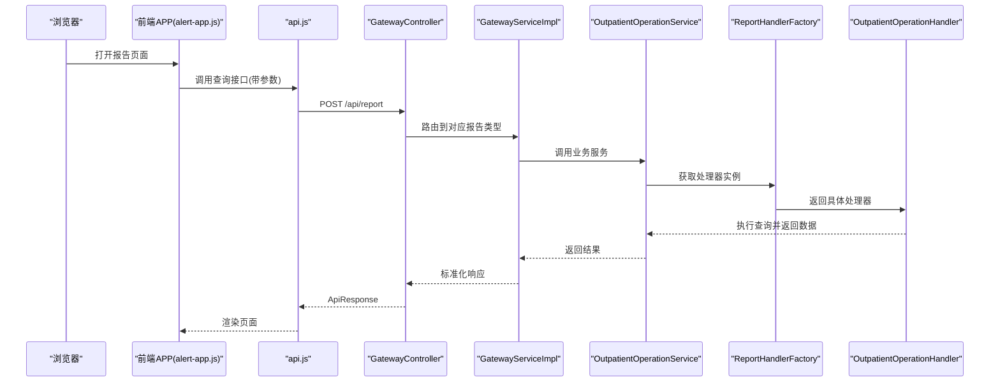
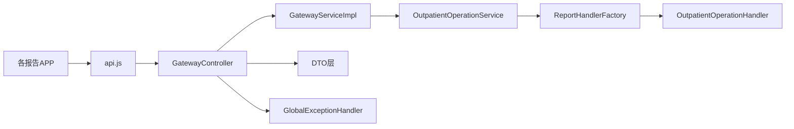

# 门诊报告API

<cite>
**本文档引用的文件**
- [outpatient-alert.md](file://reports-web/api/outpatient-alert.md)
- [outpatient-forecast.md](file://reports-web/api/outpatient-forecast.md)
- [outpatient-internet-hospital.md](file://reports-web/api/outpatient-internet-hospital.md)
- [outpatient-lab-stats.md](file://reports-web/api/outpatient-lab-stats.md)
- [outpatient-med-tech.md](file://reports-web/api/outpatient-med-tech.md)
- [outpatient-no-show.md](file://reports-web/api/outpatient-no-show.md)
- [outpatient-operation.md](file://reports-web/api/outpatient-operation.md)
- [outpatient-patient-portrait.md](file://reports-web/api/outpatient-patient-portrait.md)
- [outpatient-quality-control.md](file://reports-web/api/outpatient-quality-control.md)
- [outpatient-revenue.md](file://reports-web/api/outpatient-revenue.md)
- [outpatient-room-usage.md](file://reports-web/api/outpatient-room-usage.md)
- [outpatient-service-quality.md](file://reports-web/api/outpatient-service-quality.md)
- [outpatient-specialty-treatment.md](file://reports-web/api/outpatient-specialty-treatment.md)
- [outpatient-window-stats.md](file://reports-web/api/outpatient-window-stats.md)
- [api.js](file://reports-web/outpatient/js/api.js)
- [alert-app.js](file://reports-web/outpatient/js/alert-app.js)
- [forecast-app.js](file://reports-web/outpatient/js/forecast-app.js)
- [internet-hospital-app.js](file://reports-web/outpatient/js/internet-hospital-app.js)
- [lab-stats-app.js](file://reports-web/outpatient/js/lab-stats-app.js)
- [med-tech-app.js](file://reports-web/outpatient/js/med-tech-app.js)
- [no-show-app.js](file://reports-web/outpatient/js/no-show-app.js)
- [patient-portrait-app.js](file://reports-web/outpatient/js/patient-portrait-app.js)
- [quality-control-app.js](file://reports-web/outpatient/js/quality-control-app.js)
- [revenue-app.js](file://reports-web/outpatient/js/revenue-app.js)
- [room-usage-app.js](file://reports-web/outpatient/js/room-usage-app.js)
- [service-quality-app.js](file://reports-web/outpatient/js/service-quality-app.js)
- [specialty-treatment-app.js](file://reports-web/outpatient/js/specialty-treatment-app.js)
- [window-stats-app.js](file://reports-web/outpatient/js/window-stats-app.js)
- [GatewayController.java](file://src/main/java/com/reports/controller/GatewayController.java)
- [GatewayServiceImpl.java](file://src/main/java/com/reports/service/impl/GatewayServiceImpl.java)
- [OutpatientOperationService.java](file://src/main/java/com/reports/service/OutpatientOperationService.java)
- [OutpatientOperationServiceImpl.java](file://src/main/java/com/reports/service/impl/OutpatientOperationServiceImpl.java)
- [OutpatientOperationHandler.java](file://src/main/java/com/reports/service/handler/impl/OutpatientOperationHandler.java)
- [ReportHandlerFactory.java](file://src/main/java/com/reports/service/handler/ReportHandlerFactory.java)
- [MethodMapping.java](file://src/main/java/com/reports/service/handler/MethodMapping.java)
- [ApiRequest.java](file://src/main/java/com/reports/dto/common/ApiRequest.java)
- [ApiResponse.java](file://src/main/java/com/reports/dto/common/ApiResponse.java)
- [Result.java](file://src/main/java/com/reports/dto/common/Result.java)
- [PageParam.java](file://src/main/java/com/reports/dto/common/PageParam.java)
- [PageResult.java](file://src/main/java/com/reports/dto/common/PageResult.java)
- [OutpatientOperationRequest.java](file://src/main/java/com/reports/dto/request/OutpatientOperationRequest.java)
- [OutpatientOperationResponse.java](file://src/main/java/com/reports/dto/response/OutpatientOperationResponse.java)
- [GlobalExceptionHandler.java](file://src/main/java/com/reports/exception/GlobalExceptionHandler.java)
- [BusinessException.java](file://src/main/java/com/reports/exception/BusinessException.java)
- [application.yml](file://src/main/resources/application.yml)
- [application-dev.yml](file://src/main/resources/application-dev.yml)
</cite>

## 目录
1. [简介](#简介)
2. [项目结构](#项目结构)
3. [核心组件](#核心组件)
4. [架构总览](#架构总览)
5. [详细组件分析](#详细组件分析)
6. [依赖关系分析](#依赖关系分析)
7. [性能考虑](#性能考虑)
8. [故障排除指南](#故障排除指南)
9. [结论](#结论)

## 简介
本文件为门诊报告系列API的综合技术文档，覆盖门诊运营统计、预测分析、检验检查统计、预警分析、收入统计、专科治疗、患者画像、质控管理、科室使用率、服务质量、窗口统计、爽约分析、互联网医院等各类门诊报告的API规范。文档面向前后端开发者与产品人员，提供统一的请求参数、响应数据结构、业务含义、使用场景、请求示例、数据格式说明与错误处理策略。

## 项目结构
系统采用前后端分离架构：前端通过HTML页面与JavaScript应用调用后端REST接口；后端以网关控制器为入口，根据报告类型路由到对应的处理器，最终返回标准响应结构。

**图表来源**
- [GatewayController.java:1-200](file://src/main/java/com/reports/controller/GatewayController.java#L1-L200)
- [GatewayServiceImpl.java:1-200](file://src/main/java/com/reports/service/impl/GatewayServiceImpl.java#L1-L200)
- [OutpatientOperationService.java:1-200](file://src/main/java/com/reports/service/OutpatientOperationService.java#L1-L200)
- [ReportHandlerFactory.java:1-200](file://src/main/java/com/reports/service/handler/ReportHandlerFactory.java#L1-L200)
- [OutpatientOperationHandler.java:1-200](file://src/main/java/com/reports/service/handler/impl/OutpatientOperationHandler.java#L1-L200)
- [api.js:1-200](file://reports-web/outpatient/js/api.js#L1-L200)

**章节来源**
- [GatewayController.java:1-200](file://src/main/java/com/reports/controller/GatewayController.java#L1-L200)
- [GatewayServiceImpl.java:1-200](file://src/main/java/com/reports/service/impl/GatewayServiceImpl.java#L1-L200)
- [api.js:1-200](file://reports-web/outpatient/js/api.js#L1-L200)

## 核心组件
- 统一请求/响应模型
  - 请求体封装：ApiRequest、BaseRequestBody、PageParam
  - 响应体封装：ApiResponse、Result、PageResult
  - 分页参数：PageParam（页码、大小）
  - 通用结果：Result（状态码、消息、数据）

- 报告类型路由
  - ReportHandlerFactory：按报告类型映射到具体处理器
  - MethodMapping：方法名与报告类型的映射配置
  - OutpatientOperationHandler：具体报告逻辑实现

- 异常处理
  - GlobalExceptionHandler：全局异常捕获与标准化输出
  - BusinessException：业务异常封装

**章节来源**
- [ApiRequest.java:1-200](file://src/main/java/com/reports/dto/common/ApiRequest.java#L1-L200)
- [ApiResponse.java:1-200](file://src/main/java/com/reports/dto/common/ApiResponse.java#L1-L200)
- [Result.java:1-200](file://src/main/java/com/reports/dto/common/Result.java#L1-L200)
- [PageParam.java:1-200](file://src/main/java/com/reports/dto/common/PageParam.java#L1-L200)
- [PageResult.java:1-200](file://src/main/java/com/reports/dto/common/PageResult.java#L1-L200)
- [ReportHandlerFactory.java:1-200](file://src/main/java/com/reports/service/handler/ReportHandlerFactory.java#L1-L200)
- [MethodMapping.java:1-200](file://src/main/java/com/reports/service/handler/MethodMapping.java#L1-L200)
- [OutpatientOperationHandler.java:1-200](file://src/main/java/com/reports/service/handler/impl/OutpatientOperationHandler.java#L1-L200)
- [GlobalExceptionHandler.java:1-200](file://src/main/java/com/reports/exception/GlobalExceptionHandler.java#L1-L200)
- [BusinessException.java:1-200](file://src/main/java/com/reports/exception/BusinessException.java#L1-L200)

## 架构总览
下图展示从浏览器到后端服务的完整调用链路，包括参数校验、路由分发、业务执行与响应返回。

**图表来源**
- [alert-app.js:1-200](file://reports-web/outpatient/js/alert-app.js#L1-L200)
- [api.js:1-200](file://reports-web/outpatient/js/api.js#L1-L200)
- [GatewayController.java:1-200](file://src/main/java/com/reports/controller/GatewayController.java#L1-L200)
- [GatewayServiceImpl.java:1-200](file://src/main/java/com/reports/service/impl/GatewayServiceImpl.java#L1-L200)
- [OutpatientOperationService.java:1-200](file://src/main/java/com/reports/service/OutpatientOperationService.java#L1-L200)
- [ReportHandlerFactory.java:1-200](file://src/main/java/com/reports/service/handler/ReportHandlerFactory.java#L1-L200)
- [OutpatientOperationHandler.java:1-200](file://src/main/java/com/reports/service/handler/impl/OutpatientOperationHandler.java#L1-L200)

## 详细组件分析

### 预测分析 (outpatient-forecast)
- 业务含义
  - 基于历史门诊量趋势，对未来的就诊人数进行预测，辅助排班与资源配置。
- 请求参数
  - 时间范围：开始日期、结束日期
  - 科室/医生：可选过滤条件
  - 预测周期：天/周/月
- 响应数据
  - 预测时间序列：时间点与预测值
  - 置信区间：上界/下界
- 使用场景
  - 医院排班规划、资源调度、人员配置
- 错误处理
  - 参数缺失或格式不正确时返回标准化错误
  - 数据不足时提示“暂无足够历史数据”

**章节来源**
- [outpatient-forecast.md:1-200](file://reports-web/api/outpatient-forecast.md#L1-L200)
- [forecast-app.js:1-200](file://reports-web/outpatient/js/forecast-app.js#L1-L200)

### 预警分析 (outpatient-alert)
- 业务含义
  - 对门诊关键指标（如候诊时长、排队人数、资源饱和度）设置阈值，触发预警。
- 请求参数
  - 指标类型：候诊时长、排队人数、资源使用率
  - 阈值设置：上限/下限
  - 时间范围：开始/结束
- 响应数据
  - 预警列表：时间点、指标值、阈值、级别
- 使用场景
  - 实时监控、动态调度、应急响应
- 错误处理
  - 阈值非法或指标不存在时返回错误

**章节来源**
- [outpatient-alert.md:1-200](file://reports-web/api/outpatient-alert.md#L1-L200)
- [alert-app.js:1-200](file://reports-web/outpatient/js/alert-app.js#L1-L200)

### 检验检查统计 (outpatient-lab-stats)
- 业务含义
  - 统计检验、检查项目的申请、执行、完成情况及耗时分布。
- 请求参数
  - 检验/检查类型：项目编码或名称
  - 时间范围：开始/结束
  - 科室：可选
- 响应数据
  - 申请数、执行数、完成数、平均耗时、超时率
- 使用场景
  - 检验科效率评估、资源配置优化
- 错误处理
  - 项目不存在或时间范围无效时返回错误

**章节来源**
- [outpatient-lab-stats.md:1-200](file://reports-web/api/outpatient-lab-stats.md#L1-L200)
- [lab-stats-app.js:1-200](file://reports-web/outpatient/js/lab-stats-app.js#L1-L200)

### 医疗技术统计 (outpatient-med-tech)
- 业务含义
  - 统计医疗技术类项目（如内镜、超声、心电等）的开展情况。
- 请求参数
  - 技术类别：项目分类
  - 时间范围：开始/结束
- 响应数据
  - 开展次数、完成率、平均时长、费用分布
- 使用场景
  - 技术能力评估、设备利用率分析
- 错误处理
  - 类别非法或数据为空时提示

**章节来源**
- [outpatient-med-tech.md:1-200](file://reports-web/api/outpatient-med-tech.md#L1-L200)
- [med-tech-app.js:1-200](file://reports-web/outpatient/js/med-tech-app.js#L1-L200)

### 收入统计 (outpatient-revenue)
- 业务含义
  - 统计门诊收入构成，按项目、科室、支付方式等维度拆分。
- 请求参数
  - 维度：项目/科室/支付方式
  - 时间范围：开始/结束
- 响应数据
  - 收入金额、单次均值、人次、占比
- 使用场景
  - 财务分析、绩效考核、预算编制
- 错误处理
  - 维度过滤无效时返回错误

**章节来源**
- [outpatient-revenue.md:1-200](file://reports-web/api/outpatient-revenue.md#L1-L200)
- [revenue-app.js:1-200](file://reports-web/outpatient/js/revenue-app.js#L1-L200)

### 专科治疗 (outpatient-specialty-treatment)
- 业务含义
  - 统计各专科的门诊治疗活动，如手术、介入、康复等。
- 请求参数
  - 专科：科室编码或名称
  - 时间范围：开始/结束
- 响应数据
  - 治疗次数、平均费用、住院转化率
- 使用场景
  - 专科能力评估、资源投入决策
- 错误处理
  - 专科不存在或无数据时提示

**章节来源**
- [outpatient-specialty-treatment.md:1-200](file://reports-web/api/outpatient-specialty-treatment.md#L1-L200)
- [specialty-treatment-app.js:1-200](file://reports-web/outpatient/js/specialty-treatment-app.js#L1-L200)

### 患者画像 (outpatient-patient-portrait)
- 业务含义
  - 基于患者就诊行为构建画像，识别复诊、慢病管理、高价值人群。
- 请求参数
  - 时间范围：开始/结束
  - 过滤条件：年龄、性别、诊断、疾病史
- 响应数据
  - 人口学特征、就诊频次、偏好科室、慢病标签
- 使用场景
  - 精准营销、慢病管理、个性化服务
- 错误处理
  - 条件组合导致无匹配时提示

**章节来源**
- [outpatient-patient-portrait.md:1-200](file://reports-web/api/outpatient-patient-portrait.md#L1-L200)
- [patient-portrait-app.js:1-200](file://reports-web/outpatient/js/patient-portrait-app.js#L1-L200)

### 质控管理 (outpatient-quality-control)
- 业务含义
  - 统计质控指标，如合理用药、检查指征、病历质量等。
- 请求参数
  - 指标类型：质控项编码或名称
  - 时间范围：开始/结束
- 响应数据
  - 合格率、问题数量、整改率
- 使用场景
  - 质量改进、监管合规、绩效评估
- 错误处理
  - 指标不存在或数据异常时提示

**章节来源**
- [outpatient-quality-control.md:1-200](file://reports-web/api/outpatient-quality-control.md#L1-L200)
- [quality-control-app.js:1-200](file://reports-web/outpatient/js/quality-control-app.js#L1-L200)

### 科室使用率 (outpatient-room-usage)
- 业务含义
  - 统计各诊室、检查室的使用率与时效性。
- 请求参数
  - 房间类型/编号：可选过滤
  - 时间范围：开始/结束
- 响应数据
  - 使用时长、空闲时长、使用率、平均等待
- 使用场景
  - 设备调度、空间优化、排班调整
- 错误处理
  - 房间不存在或时间段冲突时提示

**章节来源**
- [outpatient-room-usage.md:1-200](file://reports-web/api/outpatient-room-usage.md#L1-L200)
- [room-usage-app.js:1-200](file://reports-web/outpatient/js/room-usage-app.js#L1-L200)

### 服务质量 (outpatient-service-quality)
- 业务含义
  - 统计服务相关指标，如满意度、候诊时长、服务时效。
- 请求参数
  - 评价维度：满意度/时长/效率
  - 时间范围：开始/结束
- 响应数据
  - 平均值、分布、趋势
- 使用场景
  - 服务改进、客户体验优化
- 错误处理
  - 维度非法或数据缺失时提示

**章节来源**
- [outpatient-service-quality.md:1-200](file://reports-web/api/outpatient-service-quality.md#L1-L200)
- [service-quality-app.js:1-200](file://reports-web/outpatient/js/service-quality-app.js#L1-L200)

### 窗口统计 (outpatient-window-stats)
- 业务含义
  - 统计各收费窗口、挂号窗口的业务量与效率。
- 请求参数
  - 窗口类型：收费/挂号
  - 时间范围：开始/结束
- 响应数据
  - 业务笔数、平均时长、排队长度
- 使用场景
  - 人员配置、窗口优化
- 错误处理
  - 窗口不存在或时段无效时提示

**章节来源**
- [outpatient-window-stats.md:1-200](file://reports-web/api/outpatient-window-stats.md#L1-L200)
- [window-stats-app.js:1-200](file://reports-web/outpatient/js/window-stats-app.js#L1-L200)

### 爽约分析 (outpatient-no-show)
- 业务含义
  - 统计患者爽约情况，识别高风险人群与原因。
- 请求参数
  - 时间范围：开始/结束
  - 过滤条件：科室、诊断、时间段
- 响应数据
  - 爽约人数、比例、原因分布
- 使用场景
  - 风险预警、短信提醒、资源补偿
- 错误处理
  - 无匹配数据时提示

**章节来源**
- [outpatient-no-show.md:1-200](file://reports-web/api/outpatient-no-show.md#L1-L200)
- [no-show-app.js:1-200](file://reports-web/outpatient/js/no-show-app.js#L1-L200)

### 互联网医院 (outpatient-internet-hospital)
- 业务含义
  - 统计线上问诊、电子处方、药品配送等互联网医疗服务数据。
- 请求参数
  - 服务类型：在线问诊/电子处方/配送
  - 时间范围：开始/结束
- 响应数据
  - 问诊量、处方量、配送量、用户活跃度
- 使用场景
  - 互联网医疗运营分析、KPI评估
- 错误处理
  - 服务类型非法或数据为空时提示

**章节来源**
- [outpatient-internet-hospital.md:1-200](file://reports-web/api/outpatient-internet-hospital.md#L1-L200)
- [internet-hospital-app.js:1-200](file://reports-web/outpatient/js/internet-hospital-app.js#L1-L200)

### 门诊运营统计 (outpatient-operation)
- 业务含义
  - 统计门诊整体运营情况，如日均流量、人均费用、退号率等。
- 请求参数
  - 时间范围：开始/结束
  - 维度：全院/科室/医生
- 响应数据
  - 总量、均值、同比/环比、排名
- 使用场景
  - 运营决策、目标设定
- 错误处理
  - 维度过滤或时间范围非法时提示

**章节来源**
- [outpatient-operation.md:1-200](file://reports-web/api/outpatient-operation.md#L1-L200)
- [api.js:1-200](file://reports-web/outpatient/js/api.js#L1-L200)

## 依赖关系分析
- 前端依赖
  - api.js 提供统一的HTTP封装与拦截器
  - 各APP模块按报告类型组织，调用api.js发起请求
- 后端依赖
  - GatewayController 作为统一入口，接收所有报告请求
  - GatewayServiceImpl 负责路由与参数校验
  - ReportHandlerFactory 根据报告类型选择处理器
  - OutpatientOperationHandler 执行具体查询逻辑
  - DTO层提供统一的请求/响应模型
  - GlobalExceptionHandler 统一异常处理

**图表来源**
- [api.js:1-200](file://reports-web/outpatient/js/api.js#L1-L200)
- [GatewayController.java:1-200](file://src/main/java/com/reports/controller/GatewayController.java#L1-L200)
- [GatewayServiceImpl.java:1-200](file://src/main/java/com/reports/service/impl/GatewayServiceImpl.java#L1-L200)
- [OutpatientOperationService.java:1-200](file://src/main/java/com/reports/service/OutpatientOperationService.java#L1-L200)
- [ReportHandlerFactory.java:1-200](file://src/main/java/com/reports/service/handler/ReportHandlerFactory.java#L1-L200)
- [OutpatientOperationHandler.java:1-200](file://src/main/java/com/reports/service/handler/impl/OutpatientOperationHandler.java#L1-L200)
- [GlobalExceptionHandler.java:1-200](file://src/main/java/com/reports/exception/GlobalExceptionHandler.java#L1-L200)

**章节来源**
- [api.js:1-200](file://reports-web/outpatient/js/api.js#L1-L200)
- [GatewayController.java:1-200](file://src/main/java/com/reports/controller/GatewayController.java#L1-L200)
- [GatewayServiceImpl.java:1-200](file://src/main/java/com/reports/service/impl/GatewayServiceImpl.java#L1-L200)

## 性能考虑
- 前端
  - 使用防抖/节流避免频繁请求
  - 分页加载与懒渲染减少首屏压力
  - 缓存近期查询结果，降低重复请求
- 后端
  - 复用数据库连接与SQL模板，减少解析开销
  - 对高频报告启用缓存与异步计算
  - 合理设置分页大小，避免一次性返回过多数据
- 网络
  - 统一超时与重试策略，提升失败恢复能力
  - 压缩响应体，优化传输效率

## 故障排除指南
- 常见错误类型
  - 参数错误：时间格式不正确、过滤条件非法
  - 数据缺失：无历史数据、无匹配记录
  - 服务异常：数据库连接失败、处理器未找到
- 排查步骤
  - 检查请求URL与方法是否正确
  - 校验请求头与参数格式
  - 查看后端日志中的TraceId定位问题
  - 使用mock数据验证接口契约
- 错误码参考
  - 业务异常：抛出 BusinessException，由 GlobalExceptionHandler 统一封装
  - 系统异常：捕获运行时异常，返回通用错误信息

**章节来源**
- [GlobalExceptionHandler.java:1-200](file://src/main/java/com/reports/exception/GlobalExceptionHandler.java#L1-L200)
- [BusinessException.java:1-200](file://src/main/java/com/reports/exception/BusinessException.java#L1-L200)
- [api.js:1-200](file://reports-web/outpatient/js/api.js#L1-L200)

## 结论
本文档提供了门诊报告系列API的统一规范与实现视图，涵盖从前端调用到后端处理的完整链路。建议在实际接入时：
- 严格遵循请求参数与响应结构
- 在前端做好参数校验与用户体验优化
- 在后端完善异常处理与性能监控
- 持续迭代报告维度与指标，满足不同业务场景需求