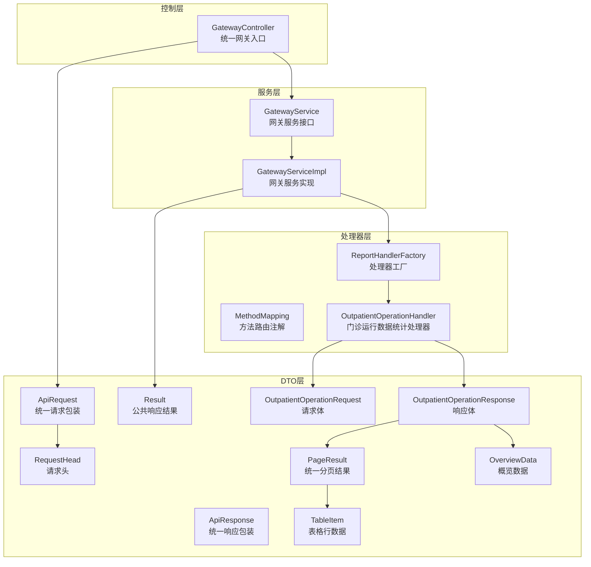
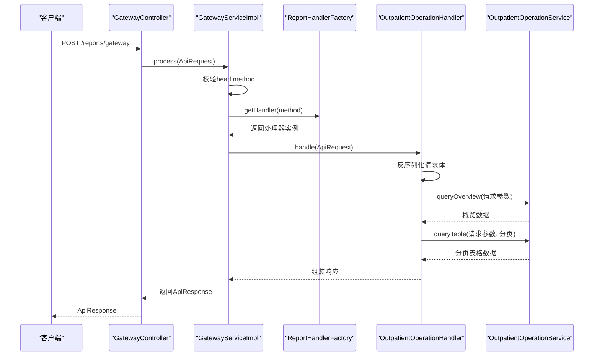
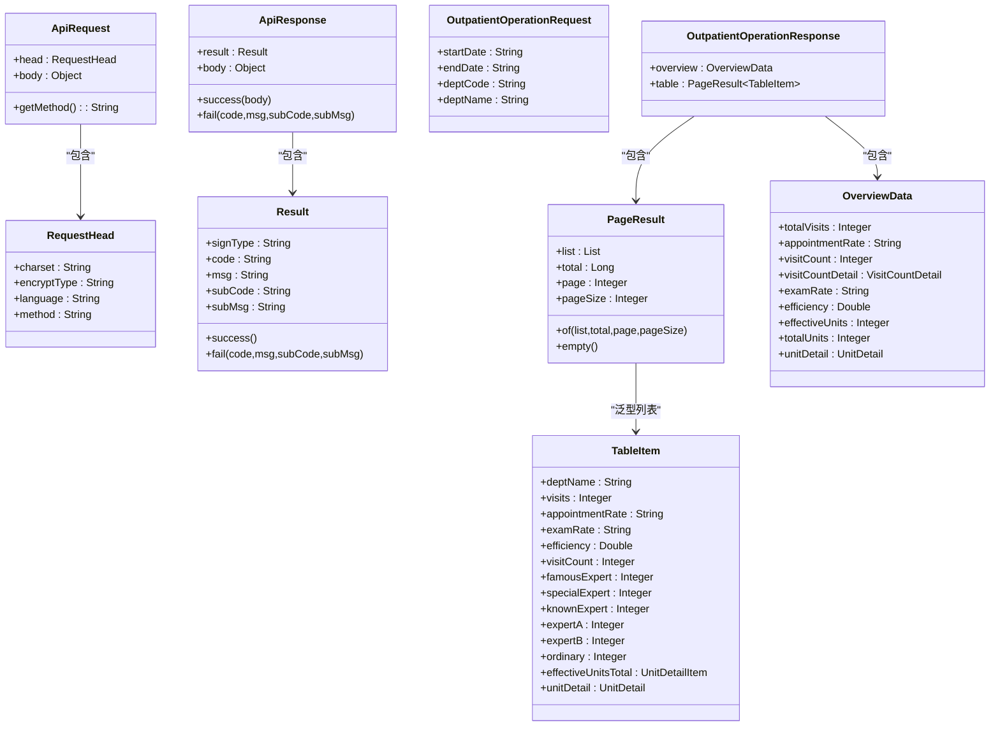
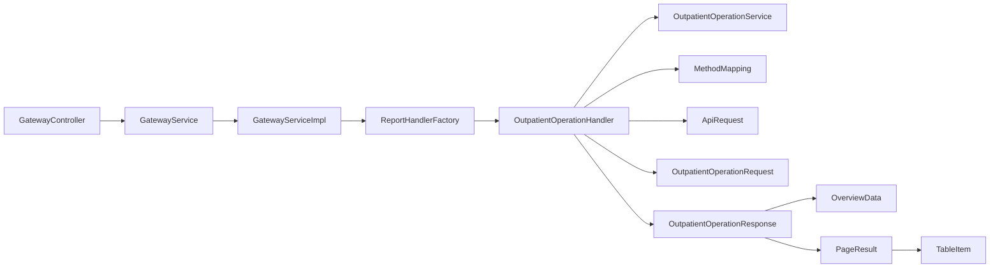

# 门诊收入统计API

<cite>
**本文档引用的文件**
- [GatewayController.java](file://src/main/java/com/reports/controller/GatewayController.java)
- [GatewayService.java](file://src/main/java/com/reports/service/GatewayService.java)
- [GatewayServiceImpl.java](file://src/main/java/com/reports/service/impl/GatewayServiceImpl.java)
- [ReportHandlerFactory.java](file://src/main/java/com/reports/service/handler/ReportHandlerFactory.java)
- [MethodMapping.java](file://src/main/java/com/reports/service/handler/MethodMapping.java)
- [OutpatientOperationHandler.java](file://src/main/java/com/reports/service/handler/impl/OutpatientOperationHandler.java)
- [ApiRequest.java](file://src/main/java/com/reports/dto/common/ApiRequest.java)
- [ApiResponse.java](file://src/main/java/com/reports/dto/common/ApiResponse.java)
- [RequestHead.java](file://src/main/java/com/reports/dto/common/RequestHead.java)
- [Result.java](file://src/main/java/com/reports/dto/common/Result.java)
- [PageResult.java](file://src/main/java/com/reports/dto/common/PageResult.java)
- [OutpatientOperationRequest.java](file://src/main/java/com/reports/dto/request/OutpatientOperationRequest.java)
- [OutpatientOperationResponse.java](file://src/main/java/com/reports/dto/response/OutpatientOperationResponse.java)
- [OverviewData.java](file://src/main/java/com/reports/dto/response/OverviewData.java)
- [TableItem.java](file://src/main/java/com/reports/dto/response/TableItem.java)
</cite>

## 目录
1. [简介](#简介)
2. [项目结构](#项目结构)
3. [核心组件](#核心组件)
4. [架构总览](#架构总览)
5. [详细组件分析](#详细组件分析)
6. [依赖关系分析](#依赖关系分析)
7. [性能考虑](#性能考虑)
8. [故障排除指南](#故障排除指南)
9. [结论](#结论)

## 简介
本文件为“门诊收入统计API”的接口文档，基于当前代码库实现进行说明。系统通过统一网关入口接收请求，根据请求中的方法标识动态路由到对应的报表处理器，完成门诊运行数据的概览与表格统计查询。

当前仓库中已实现的报表处理器为“门诊运行数据统计”，其返回内容包含概览数据与分页表格数据。根据该处理器的响应模型，可以扩展实现“门诊收入统计”所需的收入构成分析、成本核算分析、效益评估指标与财务报表生成功能。

## 项目结构
系统采用分层架构与处理器路由模式：
- 控制层：统一网关控制器接收请求
- 服务层：网关服务负责请求校验与处理器路由
- 处理器层：按方法标识动态加载报表处理器
- DTO层：定义请求、响应与通用数据传输对象
- 配置层：数据源与MyBatis Plus配置（用于支撑后续数据库查询）

**图表来源**
- [GatewayController.java:1-38](file://src/main/java/com/reports/controller/GatewayController.java#L1-L38)
- [GatewayServiceImpl.java:1-51](file://src/main/java/com/reports/service/impl/GatewayServiceImpl.java#L1-L51)
- [ReportHandlerFactory.java:1-74](file://src/main/java/com/reports/service/handler/ReportHandlerFactory.java#L1-L74)
- [OutpatientOperationHandler.java:1-65](file://src/main/java/com/reports/service/handler/impl/OutpatientOperationHandler.java#L1-L65)
- [ApiRequest.java:1-35](file://src/main/java/com/reports/dto/common/ApiRequest.java#L1-L35)
- [ApiResponse.java:1-57](file://src/main/java/com/reports/dto/common/ApiResponse.java#L1-L57)
- [RequestHead.java:1-37](file://src/main/java/com/reports/dto/common/RequestHead.java#L1-L37)
- [Result.java:1-78](file://src/main/java/com/reports/dto/common/Result.java#L1-L78)
- [PageResult.java:1-64](file://src/main/java/com/reports/dto/common/PageResult.java#L1-L64)
- [OutpatientOperationRequest.java:1-37](file://src/main/java/com/reports/dto/request/OutpatientOperationRequest.java#L1-L37)
- [OutpatientOperationResponse.java:1-25](file://src/main/java/com/reports/dto/response/OutpatientOperationResponse.java#L1-L25)
- [OverviewData.java:1-57](file://src/main/java/com/reports/dto/response/OverviewData.java#L1-L57)
- [TableItem.java:1-82](file://src/main/java/com/reports/dto/response/TableItem.java#L1-L82)

**章节来源**
- [GatewayController.java:1-38](file://src/main/java/com/reports/controller/GatewayController.java#L1-L38)
- [GatewayServiceImpl.java:1-51](file://src/main/java/com/reports/service/impl/GatewayServiceImpl.java#L1-L51)
- [ReportHandlerFactory.java:1-74](file://src/main/java/com/reports/service/handler/ReportHandlerFactory.java#L1-L74)
- [OutpatientOperationHandler.java:1-65](file://src/main/java/com/reports/service/handler/impl/OutpatientOperationHandler.java#L1-L65)

## 核心组件
- 统一网关入口：接收POST请求，解析请求头中的方法标识，交由网关服务处理
- 网关服务：校验请求参数，根据方法标识获取处理器并执行
- 处理器工厂：自动扫描并注册所有报表处理器，按方法标识映射到具体处理器
- 报表处理器：实现具体业务逻辑，如门诊运行数据统计
- DTO层：统一请求/响应包装、分页结果、业务数据模型

**章节来源**
- [GatewayController.java:28-35](file://src/main/java/com/reports/controller/GatewayController.java#L28-L35)
- [GatewayServiceImpl.java:29-48](file://src/main/java/com/reports/service/impl/GatewayServiceImpl.java#L29-L48)
- [ReportHandlerFactory.java:31-52](file://src/main/java/com/reports/service/handler/ReportHandlerFactory.java#L31-L52)
- [OutpatientOperationHandler.java:33-62](file://src/main/java/com/reports/service/handler/impl/OutpatientOperationHandler.java#L33-L62)

## 架构总览
下图展示了从客户端到业务处理器的完整调用链路：

**图表来源**
- [GatewayController.java:31-35](file://src/main/java/com/reports/controller/GatewayController.java#L31-L35)
- [GatewayServiceImpl.java:31-47](file://src/main/java/com/reports/service/impl/GatewayServiceImpl.java#L31-L47)
- [ReportHandlerFactory.java:57-64](file://src/main/java/com/reports/service/handler/ReportHandlerFactory.java#L57-L64)
- [OutpatientOperationHandler.java:33-62](file://src/main/java/com/reports/service/handler/impl/OutpatientOperationHandler.java#L33-L62)

## 详细组件分析

### 统一网关入口（GatewayController）
- 责任：提供统一的HTTP入口，接收请求并委托给网关服务处理
- 关键点：使用@RequestMapping定义基础路径；@PostMapping接收请求体；日志记录请求信息

**章节来源**
- [GatewayController.java:16-35](file://src/main/java/com/reports/controller/GatewayController.java#L16-L35)

### 网关服务（GatewayService/GatewayServiceImpl）
- 责任：校验请求完整性，根据方法标识获取处理器并执行
- 关键点：参数校验（请求头与方法标识）；异常处理（缺少参数、方法不存在）；处理器获取与执行

**章节来源**
- [GatewayService.java:9-16](file://src/main/java/com/reports/service/GatewayService.java#L9-L16)
- [GatewayServiceImpl.java:29-48](file://src/main/java/com/reports/service/impl/GatewayServiceImpl.java#L29-L48)

### 处理器工厂（ReportHandlerFactory）
- 责任：自动扫描所有报表处理器实现，从@MethodMapping注解读取方法标识并注册
- 关键点：初始化时遍历处理器集合，校验注解完整性；提供按方法标识获取处理器的能力

**章节来源**
- [ReportHandlerFactory.java:31-52](file://src/main/java/com/reports/service/handler/ReportHandlerFactory.java#L31-L52)
- [ReportHandlerFactory.java:57-64](file://src/main/java/com/reports/service/handler/ReportHandlerFactory.java#L57-L64)

### 方法路由注解（MethodMapping）
- 责任：标注在处理器实现类上，声明该处理器处理的方法标识
- 关键点：简化工厂注册流程，避免手动实现getMethod()

**章节来源**
- [MethodMapping.java:21-28](file://src/main/java/com/reports/service/handler/MethodMapping.java#L21-L28)

### 门诊运行数据统计处理器（OutpatientOperationHandler）
- 责任：实现门诊运行数据统计的业务逻辑
- 关键点：将通用请求体转换为具体请求类型；调用服务查询概览与表格数据；组装统一响应

**章节来源**
- [OutpatientOperationHandler.java:33-62](file://src/main/java/com/reports/service/handler/impl/OutpatientOperationHandler.java#L33-L62)

### DTO层设计
- 统一请求包装（ApiRequest）：包含请求头与请求体
- 统一响应包装（ApiResponse）：包含公共结果与业务响应体
- 请求头（RequestHead）：包含方法标识等元信息
- 公共结果（Result）：统一的成功/失败状态
- 分页结果（PageResult）：统一分页数据结构
- 门诊运行数据请求体（OutpatientOperationRequest）：包含时间范围与科室信息
- 门诊运行数据响应体（OutpatientOperationResponse）：包含概览与分页表格
- 概览数据（OverviewData）：包含就诊人次、预约率、效率等指标
- 表格行数据（TableItem）：包含各维度统计与单元明细

**图表来源**
- [ApiRequest.java:12-34](file://src/main/java/com/reports/dto/common/ApiRequest.java#L12-L34)
- [ApiResponse.java:12-56](file://src/main/java/com/reports/dto/common/ApiResponse.java#L12-L56)
- [RequestHead.java:10-36](file://src/main/java/com/reports/dto/common/RequestHead.java#L10-L36)
- [Result.java:10-77](file://src/main/java/com/reports/dto/common/Result.java#L10-L77)
- [PageResult.java:14-63](file://src/main/java/com/reports/dto/common/PageResult.java#L14-L63)
- [OutpatientOperationRequest.java:10-36](file://src/main/java/com/reports/dto/request/OutpatientOperationRequest.java#L10-L36)
- [OutpatientOperationResponse.java:9-24](file://src/main/java/com/reports/dto/response/OutpatientOperationResponse.java#L9-L24)
- [OverviewData.java:8-56](file://src/main/java/com/reports/dto/response/OverviewData.java#L8-L56)
- [TableItem.java:8-81](file://src/main/java/com/reports/dto/response/TableItem.java#L8-L81)

## 依赖关系分析
- 控制器依赖网关服务接口
- 网关服务实现依赖处理器工厂
- 处理器工厂依赖所有处理器实现
- 处理器实现依赖服务接口与ObjectMapper
- DTO层相互独立，通过组合关系连接业务响应

**图表来源**
- [GatewayController.java:21-26](file://src/main/java/com/reports/controller/GatewayController.java#L21-L26)
- [GatewayServiceImpl.java:22-27](file://src/main/java/com/reports/service/impl/GatewayServiceImpl.java#L22-L27)
- [ReportHandlerFactory.java:23-29](file://src/main/java/com/reports/service/handler/ReportHandlerFactory.java#L23-L29)
- [OutpatientOperationHandler.java:24-31](file://src/main/java/com/reports/service/handler/impl/OutpatientOperationHandler.java#L24-L31)
- [ApiRequest.java:12-34](file://src/main/java/com/reports/dto/common/ApiRequest.java#L12-L34)
- [OutpatientOperationRequest.java:10-36](file://src/main/java/com/reports/dto/request/OutpatientOperationRequest.java#L10-L36)
- [OutpatientOperationResponse.java:9-24](file://src/main/java/com/reports/dto/response/OutpatientOperationResponse.java#L9-L24)
- [OverviewData.java:8-56](file://src/main/java/com/reports/dto/response/OverviewData.java#L8-L56)
- [PageResult.java:14-63](file://src/main/java/com/reports/dto/common/PageResult.java#L14-L63)
- [TableItem.java:8-81](file://src/main/java/com/reports/dto/response/TableItem.java#L8-L81)

**章节来源**
- [GatewayController.java:21-26](file://src/main/java/com/reports/controller/GatewayController.java#L21-L26)
- [GatewayServiceImpl.java:22-27](file://src/main/java/com/reports/service/impl/GatewayServiceImpl.java#L22-L27)
- [ReportHandlerFactory.java:23-29](file://src/main/java/com/reports/service/handler/ReportHandlerFactory.java#L23-L29)
- [OutpatientOperationHandler.java:24-31](file://src/main/java/com/reports/service/handler/impl/OutpatientOperationHandler.java#L24-L31)

## 性能考虑
- 处理器注册：工厂在应用启动时扫描并注册处理器，避免运行时反射开销
- 请求转换：处理器内部对请求体进行类型转换，建议确保输入参数校验前置以减少无效处理
- 分页策略：表格数据默认分页大小较小，有利于前端渲染与网络传输
- 日志级别：生产环境建议调整日志级别，避免高频trace影响性能

[本节为通用性能建议，不直接分析具体文件]

## 故障排除指南
- 参数缺失：当请求头或方法标识为空时，抛出业务异常并返回相应错误码
- 方法不存在：当方法标识未注册时，抛出业务异常并提示方法不存在
- 异常处理：全局异常处理捕获业务异常，保证对外响应格式一致

**章节来源**
- [GatewayServiceImpl.java:32-44](file://src/main/java/com/reports/service/impl/GatewayServiceImpl.java#L32-L44)

## 结论
当前代码库提供了完善的统一网关与处理器路由机制，能够稳定地将请求分发至具体的报表处理器。基于现有架构，可快速扩展“门诊收入统计”功能，包括收入构成分析、成本核算、效益评估与财务报表生成等模块。通过复用DTO层与分页机制，可确保接口的一致性与可维护性。