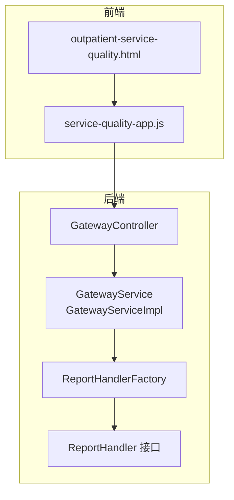
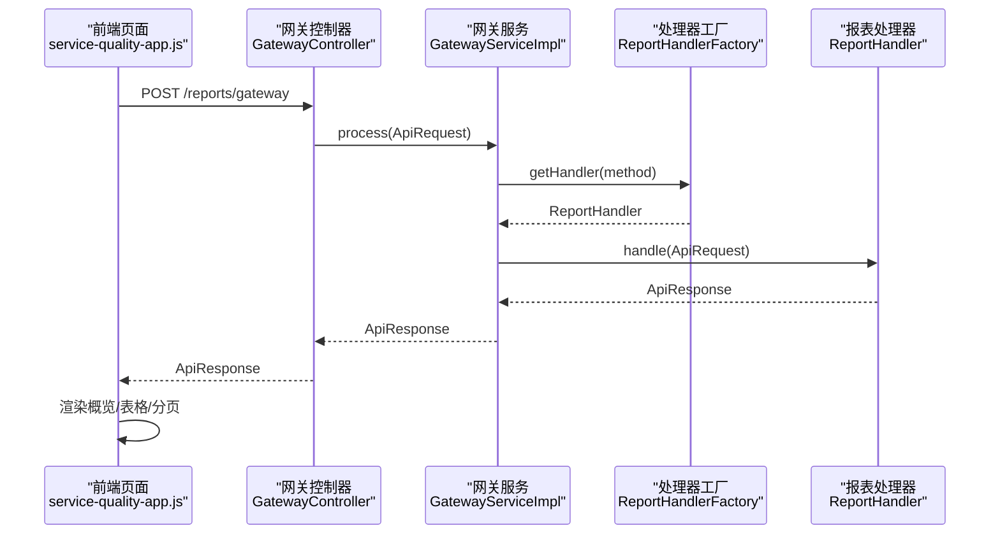
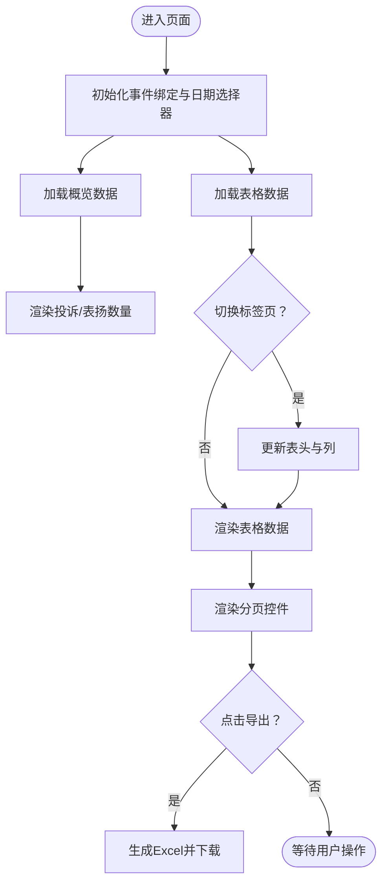
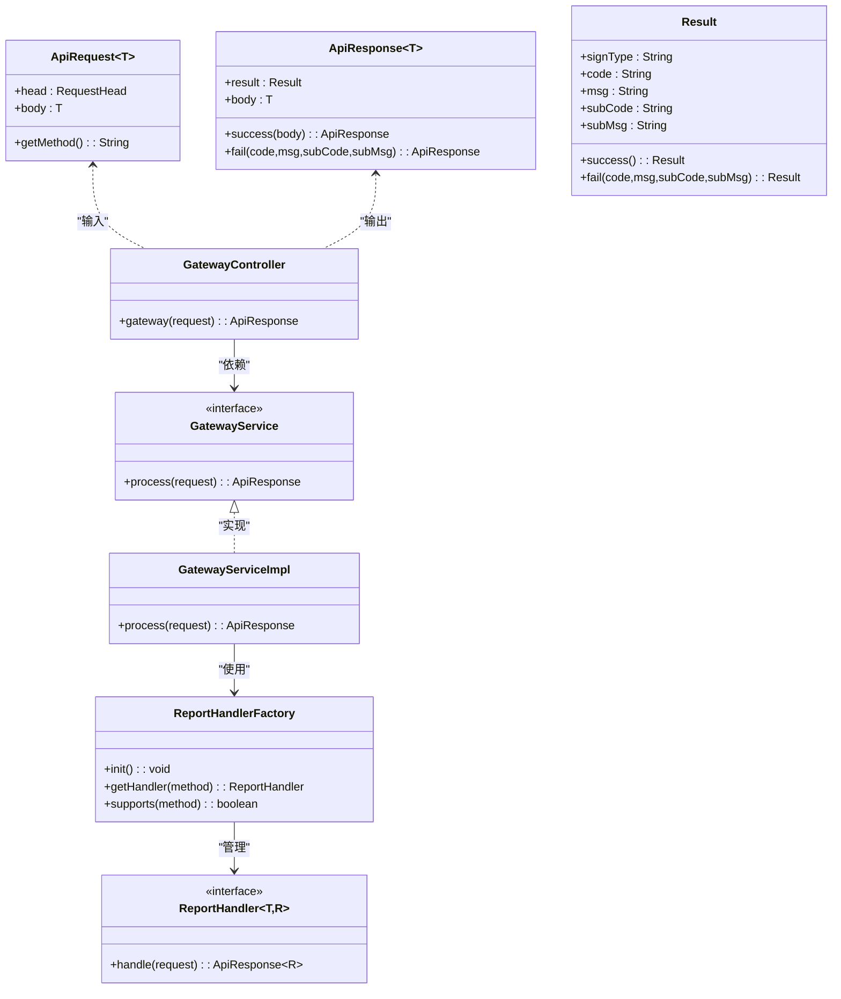
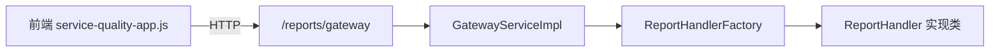

# 门诊服务质量API

<cite>
**本文引用的文件**
- [outpatient-service-quality.html](file://reports-web/outpatient/outpatient-service-quality.html)
- [service-quality-app.js](file://reports-web/outpatient/js/service-quality-app.js)
- [GatewayController.java](file://src/main/java/com/reports/controller/GatewayController.java)
- [GatewayService.java](file://src/main/java/com/reports/service/GatewayService.java)
- [GatewayServiceImpl.java](file://src/main/java/com/reports/service/impl/GatewayServiceImpl.java)
- [ReportHandler.java](file://src/main/java/com/reports/service/handler/ReportHandler.java)
- [ReportHandlerFactory.java](file://src/main/java/com/reports/service/handler/ReportHandlerFactory.java)
- [ApiRequest.java](file://src/main/java/com/reports/dto/common/ApiRequest.java)
- [ApiResponse.java](file://src/main/java/com/reports/dto/common/ApiResponse.java)
- [Result.java](file://src/main/java/com/reports/dto/common/Result.java)
- [ResultCode.java](file://src/main/java/com/reports/enums/ResultCode.java)
- [OutpatientOperationRequest.java](file://src/main/java/com/reports/dto/request/OutpatientOperationRequest.java)
- [OutpatientOperationService.java](file://src/main/java/com/reports/service/OutpatientOperationService.java)
- [api-interface.md](file://reports-web/api-interface.md)
</cite>

## 目录
1. [简介](#简介)
2. [项目结构](#项目结构)
3. [核心组件](#核心组件)
4. [架构总览](#架构总览)
5. [详细组件分析](#详细组件分析)
6. [依赖分析](#依赖分析)
7. [性能考虑](#性能考虑)
8. [故障排查指南](#故障排查指南)
9. [结论](#结论)
10. [附录](#附录)

## 简介
本文件面向“门诊服务质量API”的接口与前端展示，聚焦于患者满意度与服务质量评估功能，涵盖服务流程评价、医护人员表现、环境设施评分以及改进措施跟踪等维度。文档基于现有代码库中的统一网关、处理器分发机制与前端页面交互逻辑，给出接口定义、数据模型、调用流程与可视化呈现方式，并提供服务质量指标体系、评价方法设计、反馈收集机制与持续改进计划的实践建议。

## 项目结构
后端采用统一网关 + 处理器工厂模式，通过 method 路由到具体报表处理器；前端以 HTML 页面承载视图与交互，JavaScript 控制器负责筛选、分页、表格渲染与导出。

图表来源
- [GatewayController.java:1-38](file://src/main/java/com/reports/controller/GatewayController.java#L1-L38)
- [GatewayService.java:1-17](file://src/main/java/com/reports/service/GatewayService.java#L1-L17)
- [GatewayServiceImpl.java:1-51](file://src/main/java/com/reports/service/impl/GatewayServiceImpl.java#L1-L51)
- [ReportHandlerFactory.java:1-74](file://src/main/java/com/reports/service/handler/ReportHandlerFactory.java#L1-L74)
- [ReportHandler.java:1-28](file://src/main/java/com/reports/service/handler/ReportHandler.java#L1-L28)
- [outpatient-service-quality.html:1-298](file://reports-web/outpatient/outpatient-service-quality.html#L1-L298)
- [service-quality-app.js:1-336](file://reports-web/outpatient/js/service-quality-app.js#L1-L336)

章节来源
- [GatewayController.java:1-38](file://src/main/java/com/reports/controller/GatewayController.java#L1-L38)
- [GatewayServiceImpl.java:1-51](file://src/main/java/com/reports/service/impl/GatewayServiceImpl.java#L1-L51)
- [ReportHandlerFactory.java:1-74](file://src/main/java/com/reports/service/handler/ReportHandlerFactory.java#L1-L74)
- [outpatient-service-quality.html:1-298](file://reports-web/outpatient/outpatient-service-quality.html#L1-L298)
- [service-quality-app.js:1-336](file://reports-web/outpatient/js/service-quality-app.js#L1-L336)

## 核心组件
- 统一网关控制器：接收统一请求，转发给网关服务处理。
- 网关服务与实现：校验请求、解析 method 并委派给对应处理器。
- 处理器工厂：自动扫描并注册带有路由注解的处理器。
- 报表处理器接口：定义 handle(ApiRequest) 的处理契约。
- 前端页面与控制器：提供时间范围、科室筛选、投诉/表扬切换、分页与导出能力。

章节来源
- [GatewayController.java:1-38](file://src/main/java/com/reports/controller/GatewayController.java#L1-L38)
- [GatewayService.java:1-17](file://src/main/java/com/reports/service/GatewayService.java#L1-L17)
- [GatewayServiceImpl.java:1-51](file://src/main/java/com/reports/service/impl/GatewayServiceImpl.java#L1-L51)
- [ReportHandler.java:1-28](file://src/main/java/com/reports/service/handler/ReportHandler.java#L1-L28)
- [ReportHandlerFactory.java:1-74](file://src/main/java/com/reports/service/handler/ReportHandlerFactory.java#L1-L74)
- [outpatient-service-quality.html:1-298](file://reports-web/outpatient/outpatient-service-quality.html#L1-L298)
- [service-quality-app.js:1-336](file://reports-web/outpatient/js/service-quality-app.js#L1-L336)

## 架构总览
统一网关通过 method 将请求路由到具体处理器，处理器返回统一响应对象，前端控制器据此渲染概览与表格数据，并支持分页与导出。

图表来源
- [GatewayController.java:1-38](file://src/main/java/com/reports/controller/GatewayController.java#L1-L38)
- [GatewayServiceImpl.java:1-51](file://src/main/java/com/reports/service/impl/GatewayServiceImpl.java#L1-L51)
- [ReportHandlerFactory.java:1-74](file://src/main/java/com/reports/service/handler/ReportHandlerFactory.java#L1-L74)
- [ReportHandler.java:1-28](file://src/main/java/com/reports/service/handler/ReportHandler.java#L1-L28)
- [service-quality-app.js:1-336](file://reports-web/outpatient/js/service-quality-app.js#L1-L336)

## 详细组件分析

### 前端页面与控制器（门诊服务质量分析）
- 功能点
  - 时间范围选择（近一周/近一月/昨日/今日）与自定义日期区间联动。
  - 科室筛选下拉框联动更新概览与表格。
  - 投诉/表扬双标签页切换，动态渲染不同表头与列。
  - 分页控件与每页条数选择，支持跳转到指定页。
  - 导出当前页数据为 Excel。
- 数据流
  - 初始化时加载概览与表格数据。
  - 筛选条件变化触发重新加载。
  - 表格渲染根据当前标签页决定列结构。
  - 导出时根据当前标签页生成对应表头与行数据。

图表来源
- [service-quality-app.js:1-336](file://reports-web/outpatient/js/service-quality-app.js#L1-L336)
- [outpatient-service-quality.html:1-298](file://reports-web/outpatient/outpatient-service-quality.html#L1-L298)

章节来源
- [outpatient-service-quality.html:1-298](file://reports-web/outpatient/outpatient-service-quality.html#L1-L298)
- [service-quality-app.js:1-336](file://reports-web/outpatient/js/service-quality-app.js#L1-L336)

### 统一网关与处理器分发
- 网关控制器
  - 路径：/reports/gateway
  - 方法：POST
  - 输入：ApiRequest<Object>
  - 输出：ApiResponse<?>
- 网关服务
  - 校验 head.method 是否存在。
  - 通过 ReportHandlerFactory 根据 method 获取处理器。
  - 调用处理器 handle 返回统一响应。
- 处理器工厂
  - 扫描所有 ReportHandler 实现类，读取 @MethodMapping 注解作为路由键。
  - 支持查询是否支持某 method。

图表来源
- [ApiRequest.java:1-35](file://src/main/java/com/reports/dto/common/ApiRequest.java#L1-L35)
- [ApiResponse.java:1-57](file://src/main/java/com/reports/dto/common/ApiResponse.java#L1-L57)
- [Result.java:1-78](file://src/main/java/com/reports/dto/common/Result.java#L1-L78)
- [GatewayController.java:1-38](file://src/main/java/com/reports/controller/GatewayController.java#L1-L38)
- [GatewayService.java:1-17](file://src/main/java/com/reports/service/GatewayService.java#L1-L17)
- [GatewayServiceImpl.java:1-51](file://src/main/java/com/reports/service/impl/GatewayServiceImpl.java#L1-L51)
- [ReportHandlerFactory.java:1-74](file://src/main/java/com/reports/service/handler/ReportHandlerFactory.java#L1-L74)
- [ReportHandler.java:1-28](file://src/main/java/com/reports/service/handler/ReportHandler.java#L1-L28)

章节来源
- [GatewayController.java:1-38](file://src/main/java/com/reports/controller/GatewayController.java#L1-L38)
- [GatewayServiceImpl.java:1-51](file://src/main/java/com/reports/service/impl/GatewayServiceImpl.java#L1-L51)
- [ReportHandlerFactory.java:1-74](file://src/main/java/com/reports/service/handler/ReportHandlerFactory.java#L1-L74)
- [ReportHandler.java:1-28](file://src/main/java/com/reports/service/handler/ReportHandler.java#L1-L28)
- [ApiRequest.java:1-35](file://src/main/java/com/reports/dto/common/ApiRequest.java#L1-L35)
- [ApiResponse.java:1-57](file://src/main/java/com/reports/dto/common/ApiResponse.java#L1-L57)
- [Result.java:1-78](file://src/main/java/com/reports/dto/common/Result.java#L1-L78)

### 数据模型与请求/响应
- 统一请求包装 ApiRequest<T>
  - head：包含 method 等请求头信息。
  - body：泛型请求体。
- 统一响应包装 ApiResponse<T>
  - result：公共响应结果对象。
  - body：泛型响应体。
- 公共响应结果 Result
  - 包含 code/msg/subCode/subMsg/success 等字段。
- 统一结果码枚举 ResultCode
  - 定义了常见错误码与语义，如参数缺失、方法不存在、系统错误等。

章节来源
- [ApiRequest.java:1-35](file://src/main/java/com/reports/dto/common/ApiRequest.java#L1-L35)
- [ApiResponse.java:1-57](file://src/main/java/com/reports/dto/common/ApiResponse.java#L1-L57)
- [Result.java:1-78](file://src/main/java/com/reports/dto/common/Result.java#L1-L78)
- [ResultCode.java:1-77](file://src/main/java/com/reports/enums/ResultCode.java#L1-L77)

### 示例：门诊运行数据统计（参考）
虽然本模块聚焦“服务质量”，但可参考现有“门诊运行数据统计”接口的请求/响应格式与分页设计，用于理解统一报文规范与前端分页渲染模式。

- 请求参数
  - startDate/endDate：日期范围
  - deptCode/deptName：科室筛选
  - page/pageSize：分页
- 响应结构
  - data.list：列表数据
  - data.total/page/pageSize：分页信息

章节来源
- [OutpatientOperationRequest.java:1-37](file://src/main/java/com/reports/dto/request/OutpatientOperationRequest.java#L1-L37)
- [OutpatientOperationService.java:1-24](file://src/main/java/com/reports/service/OutpatientOperationService.java#L1-L24)
- [api-interface.md:1-253](file://reports-web/api-interface.md#L1-L253)

## 依赖分析
- 前端依赖
  - 使用 Bootstrap、Flatpickr、xlsx 等库实现 UI、日期选择与导出。
  - 通过 ReportAPI 调用后端接口，使用全局 API_CONFIG 控制 Mock 模式。
- 后端依赖
  - Spring 管理 ReportHandler 实现类与工厂。
  - 处理器需标注 @MethodMapping(value="...")，否则在工厂初始化时报错。
  - 网关服务对缺失 method 或未知 method 进行异常处理。

图表来源
- [service-quality-app.js:1-336](file://reports-web/outpatient/js/service-quality-app.js#L1-L336)
- [GatewayServiceImpl.java:1-51](file://src/main/java/com/reports/service/impl/GatewayServiceImpl.java#L1-L51)
- [ReportHandlerFactory.java:1-74](file://src/main/java/com/reports/service/handler/ReportHandlerFactory.java#L1-L74)

章节来源
- [service-quality-app.js:1-336](file://reports-web/outpatient/js/service-quality-app.js#L1-L336)
- [GatewayServiceImpl.java:1-51](file://src/main/java/com/reports/service/impl/GatewayServiceImpl.java#L1-L51)
- [ReportHandlerFactory.java:1-74](file://src/main/java/com/reports/service/handler/ReportHandlerFactory.java#L1-L74)

## 性能考虑
- 前端
  - 分页渲染：避免一次性渲染大量行，已通过每页条数控制与分页组件实现。
  - 导出 Excel：仅导出当前页数据，避免超大数据集导致内存压力。
- 后端
  - 处理器工厂在启动时完成注册，运行期按需查找，复杂度 O(1)。
  - 建议对高频查询增加缓存策略与数据库索引优化。
  - 对大分页场景限制最大页大小，防止资源耗尽。

## 故障排查指南
- 常见错误码
  - 参数缺失：检查 head.method 是否存在。
  - 方法不存在：确认 @MethodMapping 注解配置正确且唯一。
  - 系统错误：查看服务端日志定位异常堆栈。
- 前端调试
  - 切换 Mock 模式：通过页面上的开关按钮切换 API_CONFIG.useMock。
  - 控制台查看网络请求与响应，确认 data 结构与字段映射一致。
- 处理器开发
  - 确保实现类标注 @MethodMapping，value 不能为空。
  - 在 handle 中对请求体进行必要校验与转换，返回统一 ApiResponse。

章节来源
- [ResultCode.java:1-77](file://src/main/java/com/reports/enums/ResultCode.java#L1-L77)
- [GatewayServiceImpl.java:1-51](file://src/main/java/com/reports/service/impl/GatewayServiceImpl.java#L1-L51)
- [ReportHandlerFactory.java:1-74](file://src/main/java/com/reports/service/handler/ReportHandlerFactory.java#L1-L74)
- [service-quality-app.js:1-336](file://reports-web/outpatient/js/service-quality-app.js#L1-L336)

## 结论
本项目通过统一网关与处理器工厂实现了灵活的接口扩展能力，前端页面提供了直观的服务质量数据展示与交互。结合现有“门诊运行数据统计”接口规范，可快速扩展“服务质量”相关报表与指标。建议在后续迭代中补充真实的服务质量指标体系与数据采集流程，完善字典管理与数据维护能力，以支撑持续改进闭环。

## 附录

### 接口定义（基于现有网关与前端交互）
- 统一网关
  - 地址：/reports/gateway
  - 方法：POST
  - 请求体：ApiRequest<Object>
  - 响应体：ApiResponse<?>
- 前端调用约定
  - 通过 service-quality-app.js 中的 ReportAPI 发起请求。
  - 支持 Mock 模式切换，便于前后端并行开发与联调。

章节来源
- [GatewayController.java:1-38](file://src/main/java/com/reports/controller/GatewayController.java#L1-L38)
- [ApiRequest.java:1-35](file://src/main/java/com/reports/dto/common/ApiRequest.java#L1-L35)
- [ApiResponse.java:1-57](file://src/main/java/com/reports/dto/common/ApiResponse.java#L1-L57)
- [service-quality-app.js:1-336](file://reports-web/outpatient/js/service-quality-app.js#L1-L336)

### 服务质量指标体系与评价方法设计（实践建议）
- 指标体系
  - 服务流程评价：候诊时间、检查/检验等待时间、复诊预约率、一次就诊解决率。
  - 医护人员表现：服务态度评分、沟通效率、专业水平评价、投诉/表扬比。
  - 环境设施评分：候诊区舒适度、清洁度、标识清晰度、无障碍设施可用性。
  - 改进措施跟踪：问题整改及时率、重复问题发生率、患者回访满意度。
- 评价方法
  - 问卷调查与现场评分相结合，设置多维权重。
  - 引入实时监控（如排队系统数据）与定期评估（满意度调查）。
- 反馈收集机制
  - 线上自助评价、意见箱、电话回访、门诊日志记录。
  - 建立字典管理与数据维护流程，确保基础数据准确。
- 持续改进计划
  - 设定 KPI 目标与里程碑，按科室/岗位维度分解。
  - 定期发布质量报告，公开排名与改进建议，形成激励与问责机制。

### 患者体验优化方案（实践建议）
- 流程优化
  - 精简就诊环节，推广移动端预约与检查预约。
  - 设置智能导诊与候诊提醒，减少无效等待。
- 人员培训
  - 服务礼仪与沟通技巧培训，建立服务承诺与监督机制。
- 环境改善
  - 升级候诊区设施，完善指引标识与便民服务。
- 数据驱动
  - 基于投诉/表扬数据分析，识别高风险环节与改进机会。
  - 建立改进措施跟踪表，闭环验证效果。