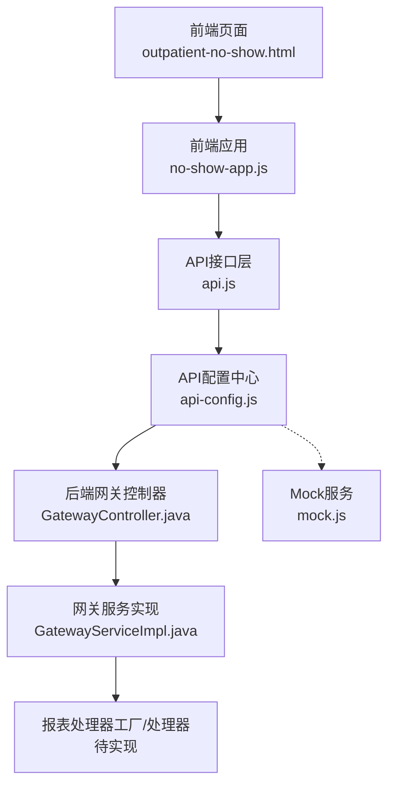
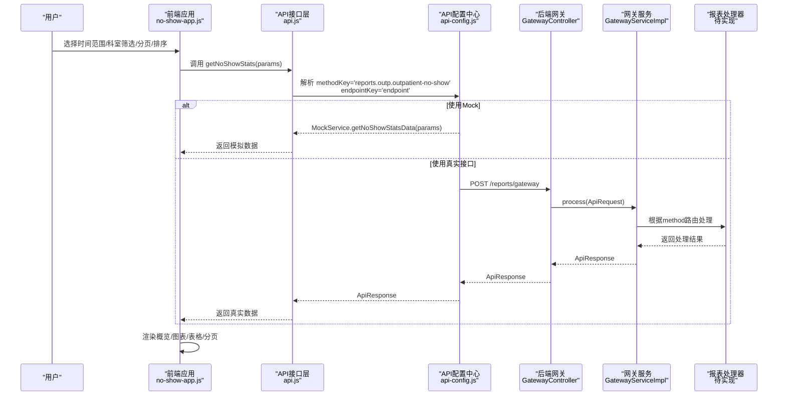
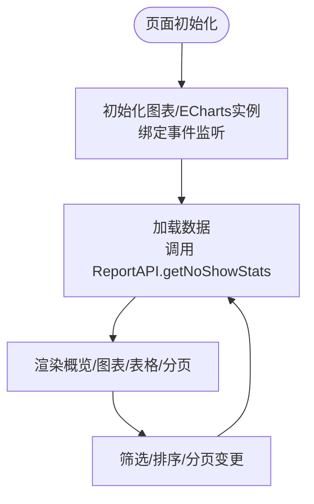
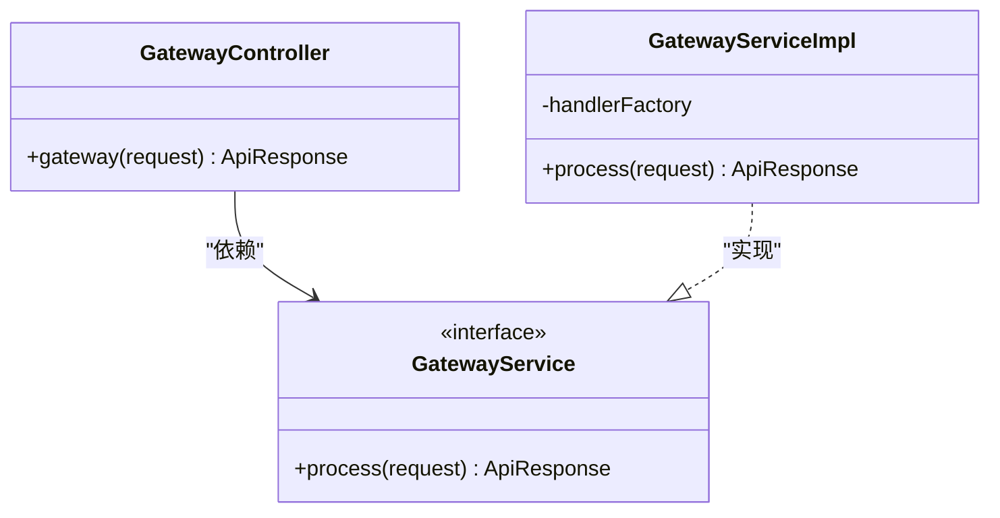
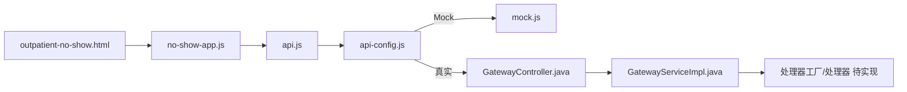

# 门诊爽约分析API

<cite>
**本文引用的文件**
- [outpatient-no-show.html](file://reports-web/outpatient/outpatient-no-show.html)
- [no-show-app.js](file://reports-web/outpatient/js/no-show-app.js)
- [api-config.js](file://reports-web/api-config.js)
- [api.js](file://reports-web/outpatient/js/api.js)
- [mock.js](file://reports-web/outpatient/js/mock.js)
- [GatewayController.java](file://src/main/java/com/reports/controller/GatewayController.java)
- [GatewayService.java](file://src/main/java/com/reports/service/GatewayService.java)
- [GatewayServiceImpl.java](file://src/main/java/com/reports/service/impl/GatewayServiceImpl.java)
- [ApiRequest.java](file://src/main/java/com/reports/dto/common/ApiRequest.java)
- [ApiResponse.java](file://src/main/java/com/reports/dto/common/ApiResponse.java)
- [PageResult.java](file://src/main/java/com/reports/dto/common/PageResult.java)
- [application.yml](file://src/main/resources/application.yml)
</cite>

## 目录
1. [简介](#简介)
2. [项目结构](#项目结构)
3. [核心组件](#核心组件)
4. [架构总览](#架构总览)
5. [详细组件分析](#详细组件分析)
6. [依赖关系分析](#依赖关系分析)
7. [性能考虑](#性能考虑)
8. [故障排查指南](#故障排查指南)
9. [结论](#结论)
10. [附录](#附录)

## 简介
本文件为“门诊爽约分析API”的详细接口文档，面向需要统计分析患者爽约行为、识别高风险患者并制定预防策略的医疗管理人员与技术团队。文档覆盖以下主题：
- 爽约率计算与统计口径
- 爽约原因多维分析（退号来源、退号渠道、年龄分布等）
- 高风险患者识别与干预措施效果评估
- 爽约预测模型与风险评估指标
- 预防策略制定与跟踪管理机制
- 减少爽约率的实施方案与患者管理优化建议

该系统采用前后端分离架构：前端通过统一API配置中心调用后端网关，后端通过统一网关路由到具体报表处理器，当前实现以Mock模式提供演示数据。

## 项目结构
系统主要由三层组成：
- 前端展示层：负责用户交互、图表渲染、数据导出与Mock/真实接口切换
- API接口层：封装统一的请求方法与路由映射
- 后端网关层：接收统一请求，按method路由到对应处理器

**图表来源**
- [outpatient-no-show.html](file://reports-web/outpatient/outpatient-no-show.html)
- [no-show-app.js](file://reports-web/outpatient/js/no-show-app.js)
- [api.js](file://reports-web/outpatient/js/api.js)
- [api-config.js](file://reports-web/api-config.js)
- [GatewayController.java](file://src/main/java/com/reports/controller/GatewayController.java)
- [GatewayServiceImpl.java](file://src/main/java/com/reports/service/impl/GatewayServiceImpl.java)
- [mock.js](file://reports-web/outpatient/js/mock.js)

**章节来源**
- [outpatient-no-show.html](file://reports-web/outpatient/outpatient-no-show.html)
- [no-show-app.js](file://reports-web/outpatient/js/no-show-app.js)
- [api-config.js](file://reports-web/api-config.js)
- [api.js](file://reports-web/outpatient/js/api.js)
- [GatewayController.java](file://src/main/java/com/reports/controller/GatewayController.java)
- [GatewayServiceImpl.java](file://src/main/java/com/reports/service/impl/GatewayServiceImpl.java)
- [mock.js](file://reports-web/outpatient/js/mock.js)

## 核心组件
- 统一网关入口：接收统一请求，校验method并路由到对应处理器
- API配置中心：集中管理method与后端接口映射，支持Mock/真实接口切换
- 前端应用：负责筛选条件、分页排序、图表渲染与数据导出
- Mock服务：提供演示数据，便于前端联调与功能验证

关键数据结构（响应体概览）：
- 概览数据：包含退号数、退号率、爽约数、爽约率
- 图表数据：退号来源（省市区）、退号渠道（窗口/小程序）、年龄区间柱状图
- 表格数据：按科室统计退号与爽约数量、比例及来源分布

**章节来源**
- [GatewayController.java](file://src/main/java/com/reports/controller/GatewayController.java)
- [GatewayServiceImpl.java](file://src/main/java/com/reports/service/impl/GatewayServiceImpl.java)
- [api-config.js](file://reports-web/api-config.js)
- [api.js](file://reports-web/outpatient/js/api.js)
- [no-show-app.js](file://reports-web/outpatient/js/no-show-app.js)
- [mock.js](file://reports-web/outpatient/js/mock.js)

## 架构总览
系统采用“前端统一API配置 -> 后端统一网关 -> 报表处理器”的分层设计。前端通过ReportAPI调用统一方法名，API配置中心根据useMock开关选择Mock或真实接口；后端网关解析method并路由到对应处理器。

**图表来源**
- [no-show-app.js](file://reports-web/outpatient/js/no-show-app.js)
- [api.js](file://reports-web/outpatient/js/api.js)
- [api-config.js](file://reports-web/api-config.js)
- [GatewayController.java](file://src/main/java/com/reports/controller/GatewayController.java)
- [GatewayServiceImpl.java](file://src/main/java/com/reports/service/impl/GatewayServiceImpl.java)
- [mock.js](file://reports-web/outpatient/js/mock.js)

## 详细组件分析

### 前端页面与应用（outpatient-no-show.html + no-show-app.js）
- 页面职责：提供时间范围筛选（近一周/近一月/昨日/今日/自定义日期）、科室筛选、概览卡片、三类图表（退号来源、退号渠道、年龄区间）、分页表格与导出Excel功能
- 应用逻辑：维护状态（当前页、每页大小、排序字段/方向、过滤条件），发起请求、渲染数据、处理分页与排序、导出Excel

**图表来源**
- [outpatient-no-show.html](file://reports-web/outpatient/outpatient-no-show.html)
- [no-show-app.js](file://reports-web/outpatient/js/no-show-app.js)

**章节来源**
- [outpatient-no-show.html](file://reports-web/outpatient/outpatient-no-show.html)
- [no-show-app.js](file://reports-web/outpatient/js/no-show-app.js)

### API接口层（api.js）
- 提供统一方法：getNoShowStats(params)用于获取爽约退号统计数据
- 参数：分页参数（page/pageSize）与筛选参数（deptName、startDate、endDate）
- 返回：Promise，最终解析为统一响应体

**章节来源**
- [api.js](file://reports-web/outpatient/js/api.js)

### API配置中心（api-config.js）
- 方法映射：将methodKey映射到后端接口路径，如'reports.outp.outpatient-no-show' -> '/api/outpatient/no-show-stats'
- Mock/真实接口切换：useMock=true时走MockService，否则走真实后端
- Mock路由：根据methodKey与endpointKey路由到对应MockService方法

**章节来源**
- [api-config.js](file://reports-web/api-config.js)

### 后端网关（GatewayController + GatewayServiceImpl）
- 网关控制器：接收POST请求，转发给网关服务处理
- 网关服务：校验请求头method，通过工厂获取处理器并执行处理
- 异常处理：缺失method或找不到method时抛出业务异常

**图表来源**
- [GatewayController.java](file://src/main/java/com/reports/controller/GatewayController.java)
- [GatewayService.java](file://src/main/java/com/reports/service/GatewayService.java)
- [GatewayServiceImpl.java](file://src/main/java/com/reports/service/impl/GatewayServiceImpl.java)

**章节来源**
- [GatewayController.java](file://src/main/java/com/reports/controller/GatewayController.java)
- [GatewayServiceImpl.java](file://src/main/java/com/reports/service/impl/GatewayServiceImpl.java)

### Mock服务（mock.js）
- 提供getNoShowStatsData(params)：返回概览数据、图表数据与分页表格数据
- 数据结构：概览（退号数/退号率/爽约数/爽约率）、退号来源（省市区）、退号渠道（窗口/小程序）、年龄区间、表格（科室维度）

**章节来源**
- [mock.js](file://reports-web/outpatient/js/mock.js)

## 依赖关系分析
- 前端依赖关系：页面依赖应用脚本，应用脚本依赖API接口层，API接口层依赖配置中心；配置中心在Mock模式下依赖Mock服务
- 后端依赖关系：网关控制器依赖网关服务，网关服务依赖处理器工厂与处理器；处理器工厂/处理器目前未在仓库中实现，但已预留扩展点

**图表来源**
- [outpatient-no-show.html](file://reports-web/outpatient/outpatient-no-show.html)
- [no-show-app.js](file://reports-web/outpatient/js/no-show-app.js)
- [api.js](file://reports-web/outpatient/js/api.js)
- [api-config.js](file://reports-web/api-config.js)
- [mock.js](file://reports-web/outpatient/js/mock.js)
- [GatewayController.java](file://src/main/java/com/reports/controller/GatewayController.java)
- [GatewayServiceImpl.java](file://src/main/java/com/reports/service/impl/GatewayServiceImpl.java)

**章节来源**
- [api-config.js](file://reports-web/api-config.js)
- [api.js](file://reports-web/outpatient/js/api.js)
- [no-show-app.js](file://reports-web/outpatient/js/no-show-app.js)
- [mock.js](file://reports-web/outpatient/js/mock.js)
- [GatewayController.java](file://src/main/java/com/reports/controller/GatewayController.java)
- [GatewayServiceImpl.java](file://src/main/java/com/reports/service/impl/GatewayServiceImpl.java)

## 性能考虑
- 前端性能
  - ECharts图表按需初始化与resize适配，避免重复渲染
  - 分页查询减少一次性传输数据量
  - Mock模式下延迟模拟，便于观察加载状态
- 后端性能
  - 统一网关减少重复路由逻辑
  - 处理器按需扩展，避免不必要的计算
  - 建议在真实数据源场景下增加缓存与索引优化

[本节为通用指导，不直接分析具体文件]

## 故障排查指南
- 常见问题
  - method缺失或错误：后端会抛出参数缺失或method不存在异常
  - Mock/真实接口切换：检查API配置中心useMock开关与localStorage持久化
  - 图表不显示：确认ECharts实例初始化与容器尺寸
- 定位步骤
  - 查看浏览器控制台网络请求与错误信息
  - 检查后端日志追踪号（TraceId）与请求method
  - 验证Mock数据是否正常返回

**章节来源**
- [GatewayServiceImpl.java](file://src/main/java/com/reports/service/impl/GatewayServiceImpl.java)
- [api-config.js](file://reports-web/api-config.js)
- [application.yml](file://src/main/resources/application.yml)

## 结论
本系统提供了完整的门诊爽约分析能力：从前端交互到后端网关路由，均以统一配置与接口规范为基础。当前实现以Mock模式为主，便于快速验证功能；在接入真实数据源后，可通过扩展处理器实现更丰富的统计与预测分析。

[本节为总结性内容，不直接分析具体文件]

## 附录

### 接口定义（基于现有实现）
- 方法名：reports.outp.outpatient-no-show
- 端点：/api/outpatient/no-show-stats
- 请求方式：GET
- 请求参数（示例）
  - page：页码
  - pageSize：每页条数
  - deptName：科室名称（可选）
  - startDate：开始日期（yyyy-MM-dd）
  - endDate：结束日期（yyyy-MM-dd）
- 响应体（概览）
  - overview.refundCount：退号数
  - overview.refundRate：退号率
  - overview.noShowCount：爽约数
  - overview.noShowRate：爽约率
- 响应体（图表）
  - refundOrigin：退号来源（省市区）
  - refundChannel：退号渠道（窗口/小程序）
  - ageAnalysis：年龄区间柱状图（categories/data）
- 响应体（表格）
  - table.list：科室维度数据
  - table.total：总记录数
  - table.page：当前页
  - table.pageSize：每页条数

**章节来源**
- [api-config.js](file://reports-web/api-config.js)
- [api.js](file://reports-web/outpatient/js/api.js)
- [mock.js](file://reports-web/outpatient/js/mock.js)

### 爽约分析与预防策略实施建议
- 统计分析
  - 爽约率计算：爽约数/预约数×100%，按科室、医生、时间段、来源地等维度拆分
  - 原因分析：退号来源（省市区）、退号渠道（窗口/小程序）、年龄区间、性别、既往就诊记录
- 高风险识别
  - 指标：历史爽约次数、距离就诊时间过短、退号频繁、跨省异地患者等
  - 模型：基于机器学习的二分类模型（是否高风险），特征包括人口学、行为、地理等
- 干预措施
  - 提醒通知：短信/微信/APP推送就诊提醒
  - 灵活改签：允许免费改期且保留优先号源
  - 信用机制：建立患者信用等级与爽约关联
- 效果评估
  - 对比干预前后爽约率变化、平均等待时间、资源利用率
  - A/B试验：随机分组对比不同干预策略效果
- 实施方案
  - 分阶段推进：先识别高风险人群，再逐步扩大干预范围
  - 数据驱动：持续监控关键指标，动态调整阈值与策略
  - 跨部门协作：医务、信息、客服、财务协同推进

[本节为概念性内容，不直接分析具体文件]