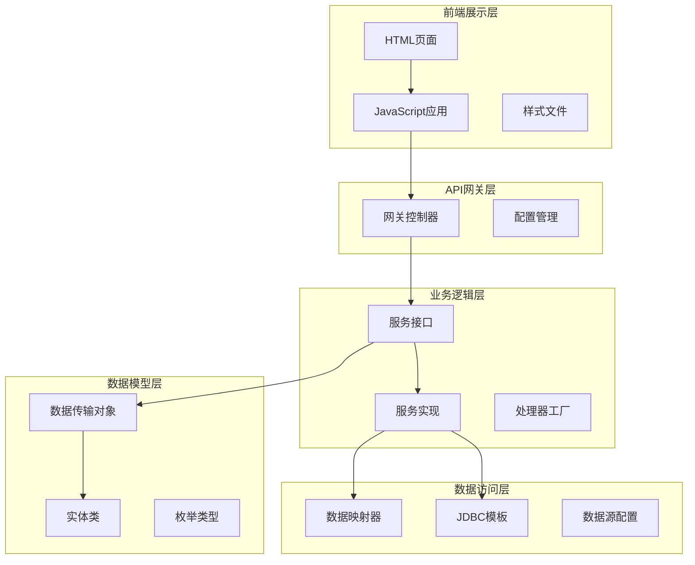
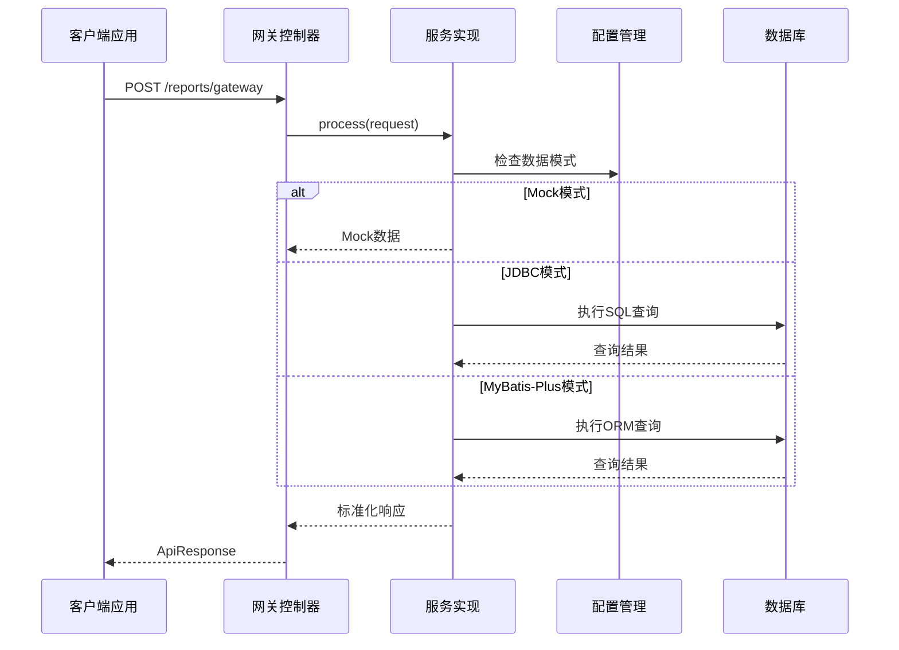
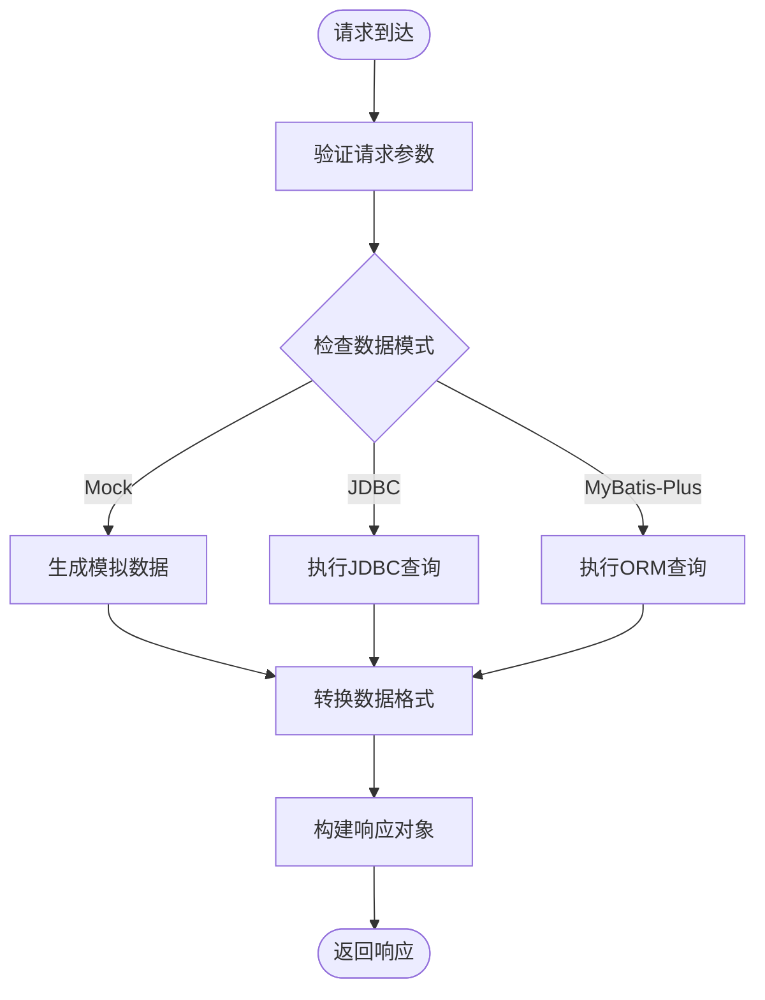
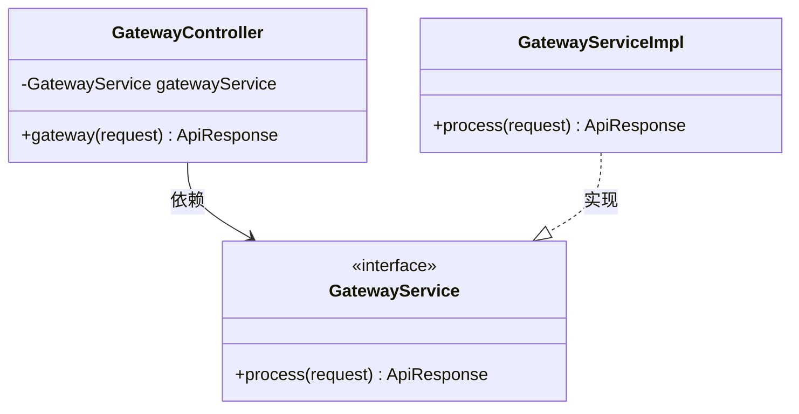
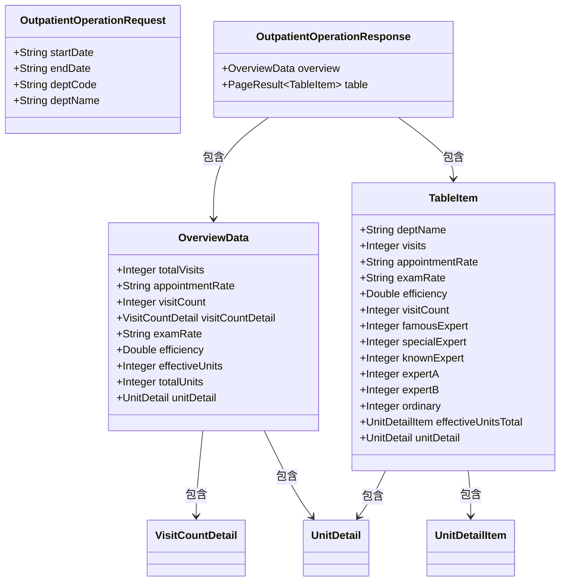
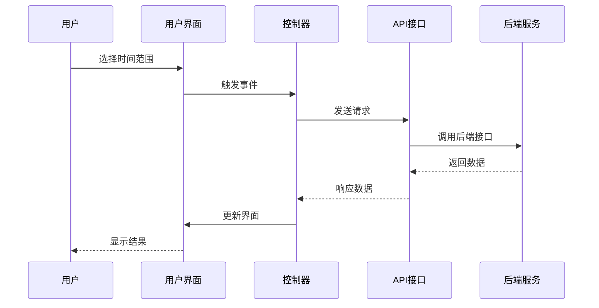
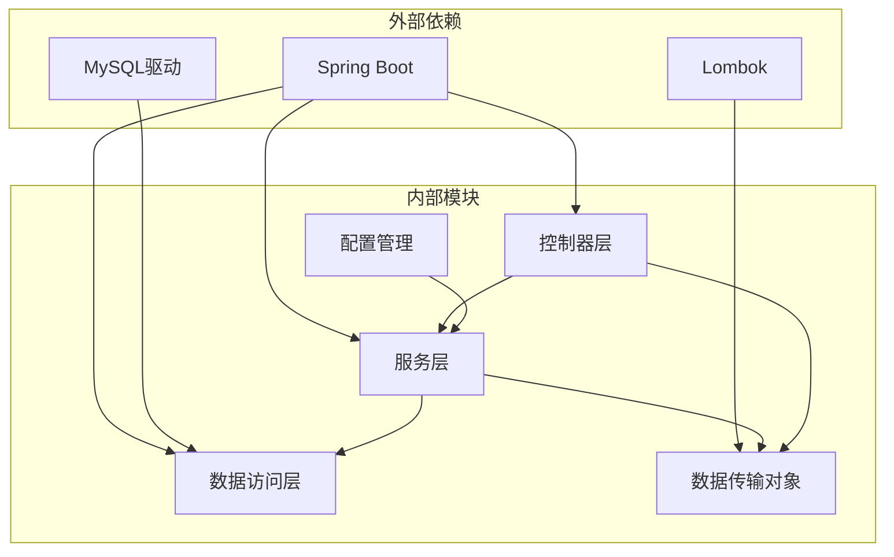
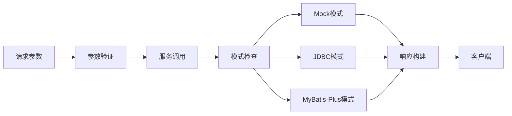

# 门诊科室使用率API

<cite>
**本文档引用的文件**
- [GatewayController.java](file://src/main/java/com/reports/controller/GatewayController.java)
- [OutpatientOperationService.java](file://src/main/java/com/reports/service/OutpatientOperationService.java)
- [OutpatientOperationServiceImpl.java](file://src/main/java/com/reports/service/impl/OutpatientOperationServiceImpl.java)
- [OutpatientOperationRequest.java](file://src/main/java/com/reports/dto/request/OutpatientOperationRequest.java)
- [OutpatientOperationResponse.java](file://src/main/java/com/reports/dto/response/OutpatientOperationResponse.java)
- [OverviewData.java](file://src/main/java/com/reports/dto/response/OverviewData.java)
- [TableItem.java](file://src/main/java/com/reports/dto/response/TableItem.java)
- [UnitDetail.java](file://src/main/java/com/reports/dto/response/UnitDetail.java)
- [UnitDetailItem.java](file://src/main/java/com/reports/dto/response/UnitDetailItem.java)
- [VisitCountDetail.java](file://src/main/java/com/reports/dto/response/VisitCountDetail.java)
- [ReportDataConfig.java](file://src/main/java/com/reports/config/ReportDataConfig.java)
- [application.yml](file://src/main/resources/application.yml)
- [room-usage-app.js](file://reports-web/outpatient/js/room-usage-app.js)
- [outpatient-room-usage.html](file://reports-web/outpatient/outpatient-room-usage.html)
</cite>

## 目录
1. [简介](#简介)
2. [项目结构](#项目结构)
3. [核心组件](#核心组件)
4. [架构概览](#架构概览)
5. [详细组件分析](#详细组件分析)
6. [依赖关系分析](#依赖关系分析)
7. [性能考虑](#性能考虑)
8. [故障排除指南](#故障排除指南)
9. [结论](#结论)
10. [附录](#附录)

## 简介

门诊科室使用率API是医院运营管理信息系统中的重要组成部分，专门用于分析和评估门诊科室的空间利用和资源配置情况。该系统通过统一网关入口提供标准化的数据访问接口，支持诊室使用率、检查室饱和度、候诊区拥挤指数和空间效率评估等关键指标的实时监控和历史分析。

本API系统采用现代化的微服务架构设计，集成了多种数据获取模式（Mock数据、JDBC直连、MyBatis-Plus），为不同环境下的部署需求提供了灵活的解决方案。系统不仅支持实时数据查询，还提供了丰富的可视化界面，帮助医院管理者做出科学的决策。

## 项目结构

该项目采用典型的三层架构设计，结合了后端服务和前端展示层的完整解决方案：

**图表来源**
- [GatewayController.java:1-38](file://src/main/java/com/reports/controller/GatewayController.java#L1-L38)
- [OutpatientOperationServiceImpl.java:1-253](file://src/main/java/com/reports/service/impl/OutpatientOperationServiceImpl.java#L1-L253)
- [OutpatientOperationRequest.java:1-37](file://src/main/java/com/reports/dto/request/OutpatientOperationRequest.java#L1-L37)

**章节来源**
- [GatewayController.java:1-38](file://src/main/java/com/reports/controller/GatewayController.java#L1-L38)
- [application.yml:1-32](file://src/main/resources/application.yml#L1-L32)

## 核心组件

### 统一网关控制器

网关控制器作为系统的统一入口点，负责接收所有外部请求并进行初步处理。该组件采用了Spring Boot的@RestController注解，提供了RESTful API的标准实现。

**主要功能特性：**
- 统一的请求路由机制
- 自动化的日志记录
- 标准化的响应格式
- 跨域请求处理

### 门诊运行数据统计服务

服务接口定义了完整的数据查询规范，支持概览数据和表格数据的双重查询模式。该接口的设计充分考虑了不同业务场景的需求，提供了灵活的数据访问能力。

**核心方法：**
- `queryOverview()`: 获取概览统计数据
- `queryTable()`: 获取分页表格数据

### 数据传输对象体系

系统采用完整的DTO（Data Transfer Object）设计模式，确保了前后端数据传递的一致性和安全性。每个DTO都经过精心设计，包含了业务领域内的所有必要信息。

**数据模型层次：**
- 请求参数模型：OutpatientOperationRequest
- 响应结果模型：OutpatientOperationResponse
- 概览数据模型：OverviewData
- 表格数据模型：TableItem

**章节来源**
- [OutpatientOperationService.java:1-24](file://src/main/java/com/reports/service/OutpatientOperationService.java#L1-L24)
- [OutpatientOperationResponse.java:1-25](file://src/main/java/com/reports/dto/response/OutpatientOperationResponse.java#L1-L25)
- [OverviewData.java:1-57](file://src/main/java/com/reports/dto/response/OverviewData.java#L1-L57)

## 架构概览

系统采用分层架构设计，每层都有明确的职责分工和边界定义：

**图表来源**
- [GatewayController.java:31-35](file://src/main/java/com/reports/controller/GatewayController.java#L31-L35)
- [OutpatientOperationServiceImpl.java:47-73](file://src/main/java/com/reports/service/impl/OutpatientOperationServiceImpl.java#L47-L73)
- [ReportDataConfig.java:15-44](file://src/main/java/com/reports/config/ReportDataConfig.java#L15-L44)

### 数据流架构

**图表来源**
- [OutpatientOperationServiceImpl.java:47-73](file://src/main/java/com/reports/service/impl/OutpatientOperationServiceImpl.java#L47-L73)
- [ReportDataConfig.java:26-42](file://src/main/java/com/reports/config/ReportDataConfig.java#L26-L42)

## 详细组件分析

### 网关控制器分析

网关控制器作为系统的入口点，承担着请求路由和响应处理的重要职责。该组件的设计体现了Spring Boot的最佳实践，提供了简洁而强大的功能实现。

**图表来源**
- [GatewayController.java:21-26](file://src/main/java/com/reports/controller/GatewayController.java#L21-L26)
- [OutpatientOperationServiceImpl.java:36-45](file://src/main/java/com/reports/service/impl/OutpatientOperationServiceImpl.java#L36-L45)

### 服务实现分析

服务实现类提供了三种不同的数据获取模式，每种模式都有其特定的应用场景和优势。

#### Mock模式实现

Mock模式主要用于开发和测试环境，能够快速生成符合业务逻辑的模拟数据。这种模式的优势在于无需真实的数据库连接，提高了开发效率。

#### JDBC模式实现

JDBC模式直接使用Spring的JdbcTemplate执行SQL查询，提供了对数据库的直接控制能力。这种模式适合需要复杂SQL查询或特殊数据库操作的场景。

#### MyBatis-Plus模式实现

MyBatis-Plus模式利用了ORM框架的强大功能，简化了数据访问层的开发工作。这种模式适合标准的CRUD操作和简单的查询场景。

**章节来源**
- [GatewayController.java:1-38](file://src/main/java/com/reports/controller/GatewayController.java#L1-L38)
- [OutpatientOperationServiceImpl.java:1-253](file://src/main/java/com/reports/service/impl/OutpatientOperationServiceImpl.java#L1-L253)

### 数据模型分析

系统采用完整的DTO设计模式，确保了数据传输的安全性和一致性。

**图表来源**
- [OutpatientOperationRequest.java:12-36](file://src/main/java/com/reports/dto/request/OutpatientOperationRequest.java#L12-L36)
- [OutpatientOperationResponse.java:10-24](file://src/main/java/com/reports/dto/response/OutpatientOperationResponse.java#L10-L24)
- [OverviewData.java:9-56](file://src/main/java/com/reports/dto/response/OverviewData.java#L9-L56)
- [TableItem.java:9-81](file://src/main/java/com/reports/dto/response/TableItem.java#L9-L81)

### 前端应用分析

前端应用采用了现代化的JavaScript架构，提供了丰富的用户交互体验和数据可视化功能。

**图表来源**
- [room-usage-app.js:126-167](file://reports-web/outpatient/js/room-usage-app.js#L126-L167)
- [outpatient-room-usage.html:14-171](file://reports-web/outpatient/outpatient-room-usage.html#L14-L171)

**章节来源**
- [room-usage-app.js:1-364](file://reports-web/outpatient/js/room-usage-app.js#L1-L364)
- [outpatient-room-usage.html:1-172](file://reports-web/outpatient/outpatient-room-usage.html#L1-L172)

## 依赖关系分析

系统采用模块化设计，各组件之间的依赖关系清晰明确：

**图表来源**
- [GatewayController.java:1-11](file://src/main/java/com/reports/controller/GatewayController.java#L1-L11)
- [OutpatientOperationServiceImpl.java:1-13](file://src/main/java/com/reports/service/impl/OutpatientOperationServiceImpl.java#L1-L13)

### 数据流依赖

**图表来源**
- [OutpatientOperationRequest.java:16-34](file://src/main/java/com/reports/dto/request/OutpatientOperationRequest.java#L16-L34)
- [OutpatientOperationServiceImpl.java:47-73](file://src/main/java/com/reports/service/impl/OutpatientOperationServiceImpl.java#L47-L73)

**章节来源**
- [application.yml:21-23](file://src/main/resources/application.yml#L21-L23)
- [ReportDataConfig.java:15-44](file://src/main/java/com/reports/config/ReportDataConfig.java#L15-L44)

## 性能考虑

系统在设计时充分考虑了性能优化的需求，采用了多种策略来确保高并发场景下的稳定运行。

### 缓存策略

系统支持多级缓存机制，包括：
- 应用层缓存：减少重复计算
- 数据库查询缓存：降低数据库压力
- 前端数据缓存：提升用户体验

### 异步处理

对于耗时较长的操作，系统支持异步处理模式：
- 异步数据查询
- 异步报表生成
- 异步通知推送

### 连接池管理

系统合理配置了数据库连接池：
- 最小连接数设置
- 最大连接数限制
- 连接超时时间配置

## 故障排除指南

### 常见问题诊断

**数据查询异常**
- 检查数据库连接配置
- 验证SQL语句正确性
- 确认数据权限设置

**性能问题排查**
- 监控系统资源使用情况
- 分析慢查询日志
- 优化索引策略

**接口调用错误**
- 验证请求参数格式
- 检查网络连接状态
- 确认服务可用性

### 日志分析

系统提供了详细的日志记录机制：
- 请求日志：记录所有API调用
- 错误日志：捕获异常信息
- 性能日志：监控响应时间

**章节来源**
- [OutpatientOperationServiceImpl.java:173-176](file://src/main/java/com/reports/service/impl/OutpatientOperationServiceImpl.java#L173-L176)
- [application.yml:26-31](file://src/main/resources/application.yml#L26-L31)

## 结论

门诊科室使用率API系统通过精心设计的架构和完善的组件体系，为医院的运营管理提供了强有力的技术支撑。系统不仅满足了当前的功能需求，还具备了良好的扩展性和维护性。

### 主要优势

1. **架构清晰**：分层设计使得系统易于理解和维护
2. **功能完整**：涵盖了门诊运营的各个方面
3. **性能优秀**：多种优化策略确保了系统的高效运行
4. **扩展性强**：模块化设计便于功能扩展和定制

### 发展建议

1. **增强监控能力**：增加更详细的性能监控指标
2. **完善安全机制**：加强数据访问权限控制
3. **优化用户体验**：改进前端交互和数据展示效果
4. **扩展分析功能**：增加更多维度的分析指标

## 附录

### API接口规范

系统提供了统一的API接口规范，确保了前后端交互的一致性。

### 部署指南

系统支持多种部署方式，包括：
- 单机部署
- 集群部署
- 容器化部署

### 维护手册

提供了完整的系统维护指南，包括：
- 日常维护流程
- 故障处理程序
- 性能调优建议