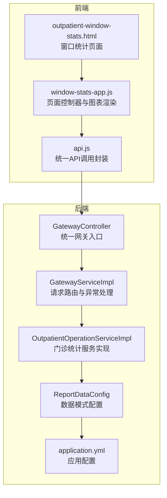
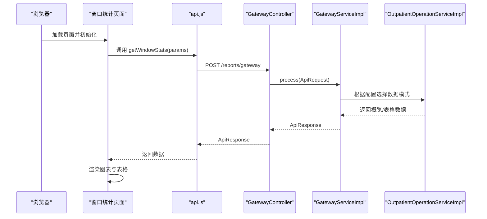
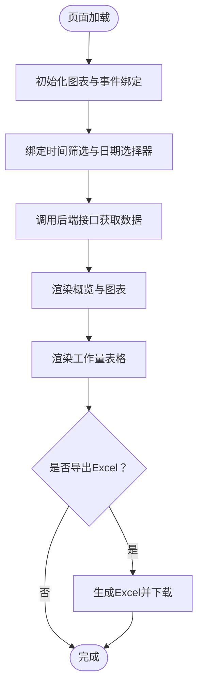
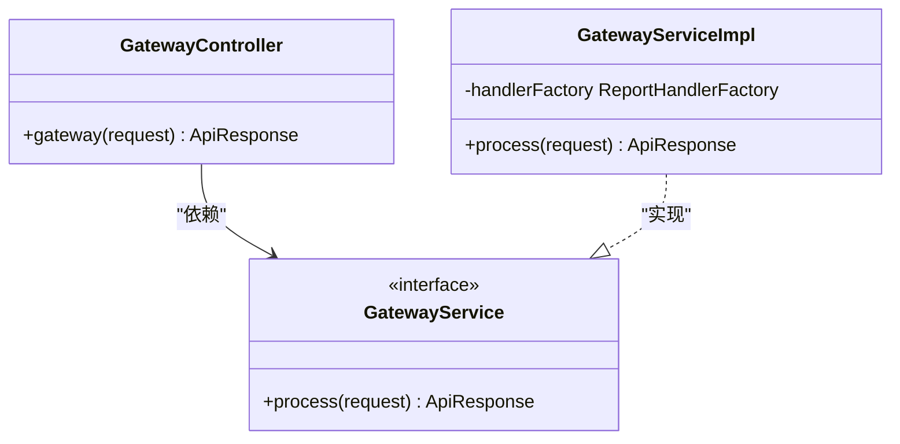
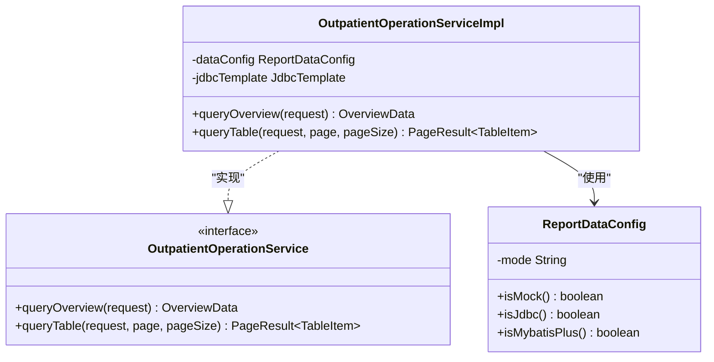
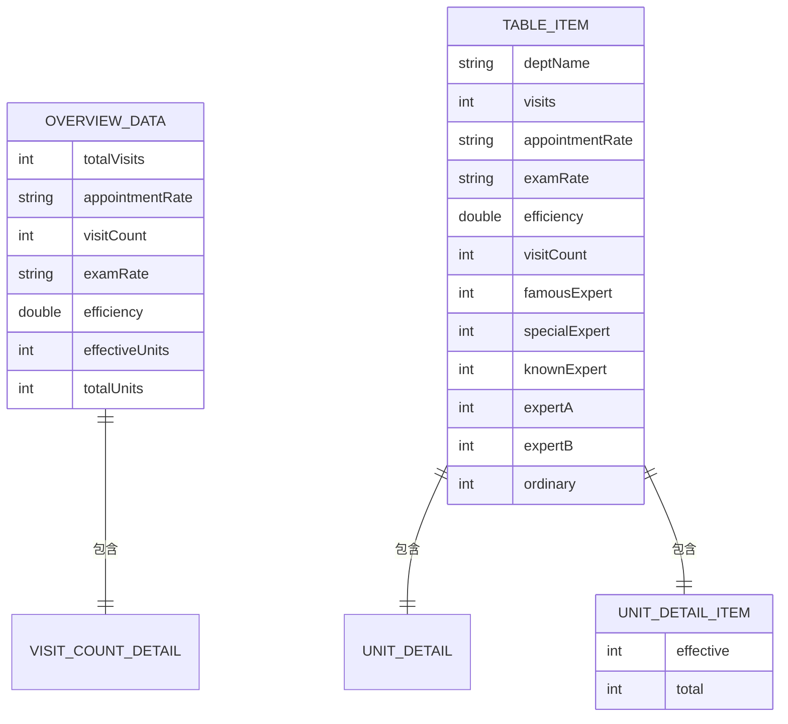
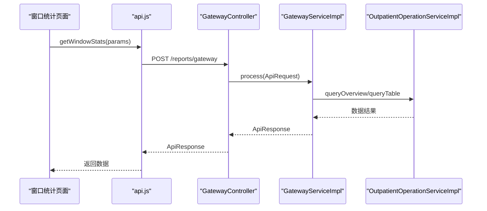
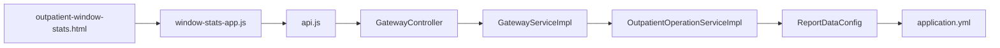

# 门诊窗口统计API

<cite>
**本文档引用的文件**
- [outpatient-window-stats.html](file://reports-web/outpatient/outpatient-window-stats.html)
- [window-stats-app.js](file://reports-web/outpatient/js/window-stats-app.js)
- [api.js](file://reports-web/outpatient/js/api.js)
- [GatewayController.java](file://src/main/java/com/reports/controller/GatewayController.java)
- [GatewayService.java](file://src/main/java/com/reports/service/GatewayService.java)
- [GatewayServiceImpl.java](file://src/main/java/com/reports/service/impl/GatewayServiceImpl.java)
- [OutpatientOperationService.java](file://src/main/java/com/reports/service/OutpatientOperationService.java)
- [OutpatientOperationServiceImpl.java](file://src/main/java/com/reports/service/impl/OutpatientOperationServiceImpl.java)
- [OutpatientOperationRequest.java](file://src/main/java/com/reports/dto/request/OutpatientOperationRequest.java)
- [OutpatientOperationResponse.java](file://src/main/java/com/reports/dto/response/OutpatientOperationResponse.java)
- [OverviewData.java](file://src/main/java/com/reports/dto/response/OverviewData.java)
- [TableItem.java](file://src/main/java/com/reports/dto/response/TableItem.java)
- [application.yml](file://src/main/resources/application.yml)
- [ReportDataConfig.java](file://src/main/java/com/reports/config/ReportDataConfig.java)
- [api-interface.md](file://reports-web/api-interface.md)
</cite>

## 目录
1. [简介](#简介)
2. [项目结构](#项目结构)
3. [核心组件](#核心组件)
4. [架构总览](#架构总览)
5. [详细组件分析](#详细组件分析)
6. [依赖关系分析](#依赖关系分析)
7. [性能考虑](#性能考虑)
8. [故障排除指南](#故障排除指南)
9. [结论](#结论)
10. [附录](#附录)

## 简介
本文件为“门诊窗口统计API”的详细接口文档，聚焦于各服务窗口（挂号、缴费、取药、检查预约等）的工作效率与业务量分析。文档涵盖窗口排队时间、业务处理时长、人员配置优化与工作负荷分析，并提供窗口服务优化与人员调度指导。该系统采用前后端分离架构，前端负责展示与交互，后端提供统一网关与多数据源适配能力。

## 项目结构
系统由前端页面与后端服务两部分组成：
- 前端：窗口统计页面、图表渲染与数据导出功能
- 后端：统一网关入口、请求路由与数据服务层

**图示来源**
- [outpatient-window-stats.html:1-130](file://reports-web/outpatient/outpatient-window-stats.html#L1-L130)
- [window-stats-app.js:1-349](file://reports-web/outpatient/js/window-stats-app.js#L1-L349)
- [api.js:1-159](file://reports-web/outpatient/js/api.js#L1-L159)
- [GatewayController.java:1-38](file://src/main/java/com/reports/controller/GatewayController.java#L1-L38)
- [GatewayServiceImpl.java:1-51](file://src/main/java/com/reports/service/impl/GatewayServiceImpl.java#L1-L51)
- [OutpatientOperationServiceImpl.java:1-253](file://src/main/java/com/reports/service/impl/OutpatientOperationServiceImpl.java#L1-L253)
- [ReportDataConfig.java:1-45](file://src/main/java/com/reports/config/ReportDataConfig.java#L1-L45)
- [application.yml:1-32](file://src/main/resources/application.yml#L1-L32)

**章节来源**
- [outpatient-window-stats.html:1-130](file://reports-web/outpatient/outpatient-window-stats.html#L1-L130)
- [window-stats-app.js:1-349](file://reports-web/outpatient/js/window-stats-app.js#L1-L349)
- [api.js:1-159](file://reports-web/outpatient/js/api.js#L1-L159)
- [GatewayController.java:1-38](file://src/main/java/com/reports/controller/GatewayController.java#L1-L38)
- [GatewayServiceImpl.java:1-51](file://src/main/java/com/reports/service/impl/GatewayServiceImpl.java#L1-L51)
- [OutpatientOperationServiceImpl.java:1-253](file://src/main/java/com/reports/service/impl/OutpatientOperationServiceImpl.java#L1-L253)
- [ReportDataConfig.java:1-45](file://src/main/java/com/reports/config/ReportDataConfig.java#L1-L45)
- [application.yml:1-32](file://src/main/resources/application.yml#L1-L32)

## 核心组件
- 统一网关入口：接收前端请求，进行校验与路由
- 网关服务实现：根据method选择对应处理器
- 门诊统计服务：提供概览与表格数据，支持Mock/JDBC/MyBatis-Plus三种数据模式
- 前端页面控制器：负责时间筛选、图表渲染与数据导出
- API封装：统一方法映射与请求调用

**章节来源**
- [GatewayController.java:28-35](file://src/main/java/com/reports/controller/GatewayController.java#L28-L35)
- [GatewayServiceImpl.java:29-48](file://src/main/java/com/reports/service/impl/GatewayServiceImpl.java#L29-L48)
- [OutpatientOperationServiceImpl.java:47-73](file://src/main/java/com/reports/service/impl/OutpatientOperationServiceImpl.java#L47-L73)
- [window-stats-app.js:73-90](file://reports-web/outpatient/js/window-stats-app.js#L73-L90)
- [api.js:64-69](file://reports-web/outpatient/js/api.js#L64-L69)

## 架构总览
系统采用“前端页面 + 统一网关 + 服务实现”的分层架构。前端通过统一API封装调用后端接口；后端网关根据method路由到具体处理器；服务层根据配置选择数据源模式，返回标准化数据结构。

**图示来源**
- [window-stats-app.js:73-90](file://reports-web/outpatient/js/window-stats-app.js#L73-L90)
- [api.js:64-69](file://reports-web/outpatient/js/api.js#L64-L69)
- [GatewayController.java:31-35](file://src/main/java/com/reports/controller/GatewayController.java#L31-L35)
- [GatewayServiceImpl.java:30-47](file://src/main/java/com/reports/service/impl/GatewayServiceImpl.java#L30-L47)
- [OutpatientOperationServiceImpl.java:47-73](file://src/main/java/com/reports/service/impl/OutpatientOperationServiceImpl.java#L47-L73)

## 详细组件分析

### 前端页面与交互流程
- 页面初始化：绑定时间筛选按钮、日期范围选择器、图表容器
- 数据加载：根据时间范围调用后端接口，渲染概览卡片、饼图、柱状图、折线图与工作量表格
- 数据导出：将表格数据导出为Excel文件

**图示来源**
- [window-stats-app.js:16-90](file://reports-web/outpatient/js/window-stats-app.js#L16-L90)
- [window-stats-app.js:247-279](file://reports-web/outpatient/js/window-stats-app.js#L247-L279)
- [window-stats-app.js:285-346](file://reports-web/outpatient/js/window-stats-app.js#L285-L346)

**章节来源**
- [outpatient-window-stats.html:24-100](file://reports-web/outpatient/outpatient-window-stats.html#L24-L100)
- [window-stats-app.js:16-90](file://reports-web/outpatient/js/window-stats-app.js#L16-L90)
- [window-stats-app.js:247-279](file://reports-web/outpatient/js/window-stats-app.js#L247-L279)
- [window-stats-app.js:285-346](file://reports-web/outpatient/js/window-stats-app.js#L285-L346)

### 后端统一网关与路由
- 网关控制器：接收POST请求，封装为ApiRequest并交由网关服务处理
- 网关服务：校验请求完整性，根据method获取处理器并执行
- 异常处理：缺失method或找不到处理器时抛出业务异常

**图示来源**
- [GatewayController.java:28-35](file://src/main/java/com/reports/controller/GatewayController.java#L28-L35)
- [GatewayServiceImpl.java:29-48](file://src/main/java/com/reports/service/impl/GatewayServiceImpl.java#L29-L48)

**章节来源**
- [GatewayController.java:28-35](file://src/main/java/com/reports/controller/GatewayController.java#L28-L35)
- [GatewayServiceImpl.java:29-48](file://src/main/java/com/reports/service/impl/GatewayServiceImpl.java#L29-L48)

### 门诊统计服务实现
- 数据模式：支持Mock、JDBC、MyBatis-Plus三种模式，通过配置项切换
- 概览数据：包含总门诊量、预约率、就诊人次、检查率、效率、有效单元数等
- 表格数据：支持分页，包含各专家类型的出诊人次与单元明细
- 回退机制：当JDBC查询失败时自动回退到Mock数据

**图示来源**
- [OutpatientOperationService.java:11-23](file://src/main/java/com/reports/service/OutpatientOperationService.java#L11-L23)
- [OutpatientOperationServiceImpl.java:47-73](file://src/main/java/com/reports/service/impl/OutpatientOperationServiceImpl.java#L47-L73)
- [ReportDataConfig.java:26-42](file://src/main/java/com/reports/config/ReportDataConfig.java#L26-L42)

**章节来源**
- [OutpatientOperationServiceImpl.java:47-73](file://src/main/java/com/reports/service/impl/OutpatientOperationServiceImpl.java#L47-L73)
- [OutpatientOperationServiceImpl.java:77-148](file://src/main/java/com/reports/service/impl/OutpatientOperationServiceImpl.java#L77-L148)
- [OutpatientOperationServiceImpl.java:152-212](file://src/main/java/com/reports/service/impl/OutpatientOperationServiceImpl.java#L152-L212)
- [OutpatientOperationServiceImpl.java:216-241](file://src/main/java/com/reports/service/impl/OutpatientOperationServiceImpl.java#L216-L241)
- [ReportDataConfig.java:26-42](file://src/main/java/com/reports/config/ReportDataConfig.java#L26-L42)

### 数据模型与字段说明
- 概览数据：总门诊量、预约率、就诊人次、检查率、效率、有效单元数、单元明细等
- 表格行数据：科室名称、门诊量、预约率、检查率、效率、各类专家出诊人次、单元明细等
- 请求参数：开始日期、结束日期、科室编码/名称等

**图示来源**
- [OverviewData.java:9-56](file://src/main/java/com/reports/dto/response/OverviewData.java#L9-L56)
- [TableItem.java:9-81](file://src/main/java/com/reports/dto/response/TableItem.java#L9-L81)

**章节来源**
- [OverviewData.java:9-56](file://src/main/java/com/reports/dto/response/OverviewData.java#L9-L56)
- [TableItem.java:9-81](file://src/main/java/com/reports/dto/response/TableItem.java#L9-L81)
- [OutpatientOperationRequest.java:12-36](file://src/main/java/com/reports/dto/request/OutpatientOperationRequest.java#L12-L36)

### API接口定义与调用
- 前端通过统一API封装调用后端接口，方法名为“reports.outp.outpatient-window-stats.endpoint”
- 后端网关根据method路由到对应处理器
- 支持时间范围筛选、日期范围筛选、科室筛选等参数

**图示来源**
- [api.js:64-69](file://reports-web/outpatient/js/api.js#L64-L69)
- [GatewayController.java:31-35](file://src/main/java/com/reports/controller/GatewayController.java#L31-L35)
- [GatewayServiceImpl.java:40-47](file://src/main/java/com/reports/service/impl/GatewayServiceImpl.java#L40-L47)
- [OutpatientOperationServiceImpl.java:47-73](file://src/main/java/com/reports/service/impl/OutpatientOperationServiceImpl.java#L47-L73)

**章节来源**
- [api.js:64-69](file://reports-web/outpatient/js/api.js#L64-L69)
- [GatewayServiceImpl.java:40-47](file://src/main/java/com/reports/service/impl/GatewayServiceImpl.java#L40-L47)
- [OutpatientOperationServiceImpl.java:47-73](file://src/main/java/com/reports/service/impl/OutpatientOperationServiceImpl.java#L47-L73)

## 依赖关系分析
- 前端依赖：Bootstrap、Flatpickr、ECharts、xlsx等第三方库
- 后端依赖：Spring Boot、JDBC模板、日志追踪、配置读取
- 配置耦合：数据模式配置影响服务层数据源选择

**图示来源**
- [outpatient-window-stats.html:102-127](file://reports-web/outpatient/outpatient-window-stats.html#L102-L127)
- [window-stats-app.js:23-31](file://reports-web/outpatient/js/window-stats-app.js#L23-L31)
- [api.js:64-69](file://reports-web/outpatient/js/api.js#L64-L69)
- [GatewayController.java:31-35](file://src/main/java/com/reports/controller/GatewayController.java#L31-L35)
- [GatewayServiceImpl.java:40-47](file://src/main/java/com/reports/service/impl/GatewayServiceImpl.java#L40-L47)
- [OutpatientOperationServiceImpl.java:42-44](file://src/main/java/com/reports/service/impl/OutpatientOperationServiceImpl.java#L42-L44)
- [ReportDataConfig.java:26-42](file://src/main/java/com/reports/config/ReportDataConfig.java#L26-L42)
- [application.yml:21-23](file://src/main/resources/application.yml#L21-L23)

**章节来源**
- [application.yml:21-23](file://src/main/resources/application.yml#L21-L23)
- [ReportDataConfig.java:26-42](file://src/main/java/com/reports/config/ReportDataConfig.java#L26-L42)

## 性能考虑
- 数据模式选择：生产环境建议使用JDBC或MyBatis-Plus以提升查询性能
- 图表渲染：ECharts在大数据量时注意分页与懒加载策略
- 缓存策略：可引入Redis缓存热点时间段的统计结果
- 并发控制：合理设置线程池与连接池，避免高并发导致的资源争用
- 导出优化：Excel导出建议异步处理并提供下载链接

## 故障排除指南
- 请求参数缺失：method为空或请求报文缺失会触发业务异常
- 数据源异常：JDBC查询失败会自动回退到Mock数据
- 配置问题：确认reports.data.mode配置正确且生效

**章节来源**
- [GatewayServiceImpl.java:32-44](file://src/main/java/com/reports/service/impl/GatewayServiceImpl.java#L32-L44)
- [OutpatientOperationServiceImpl.java:173-177](file://src/main/java/com/reports/service/impl/OutpatientOperationServiceImpl.java#L173-L177)
- [OutpatientOperationServiceImpl.java:208-212](file://src/main/java/com/reports/service/impl/OutpatientOperationServiceImpl.java#L208-L212)
- [application.yml:21-23](file://src/main/resources/application.yml#L21-L23)

## 结论
本系统提供了完整的门诊窗口统计能力，从前端可视化到后端多数据源适配，满足不同场景下的统计需求。通过概览数据与分时段工作量表格，可有效评估各窗口的业务处理能力与效率，并为人员配置与调度提供数据支撑。

## 附录

### 接口清单与字段说明
- 获取窗口统计概览数据
  - 方法：GET /api/outpatient/window-stats
  - 参数：timeRange、startDate、endDate、deptName
  - 返回：概览数据对象
- 获取各窗口业务分时段工作量统计
  - 方法：GET /api/outpatient/department-stats
  - 参数：page、pageSize、startDate、endDate、deptName、sortColumn、sortDirection
  - 返回：分页表格数据
- 导出Excel
  - 方法：POST /api/outpatient/export
  - 参数：startDate、endDate、deptName、timeRange
  - 返回：下载链接与文件名

**章节来源**
- [api-interface.md:5-72](file://reports-web/api-interface.md#L5-L72)
- [api-interface.md:75-161](file://reports-web/api-interface.md#L75-L161)
- [api-interface.md:164-218](file://reports-web/api-interface.md#L164-L218)