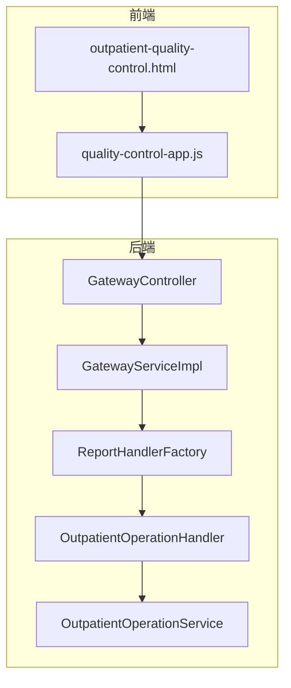
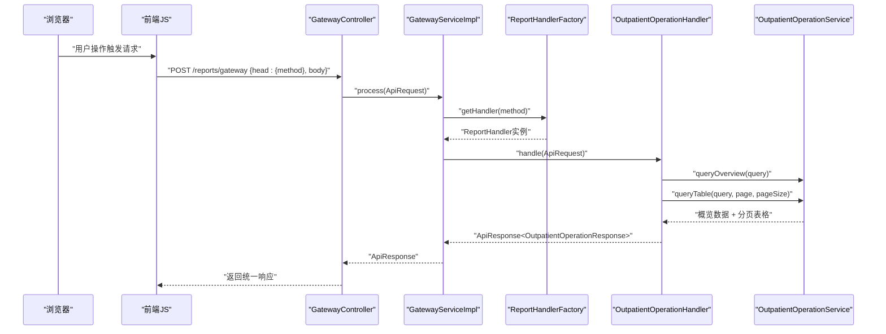
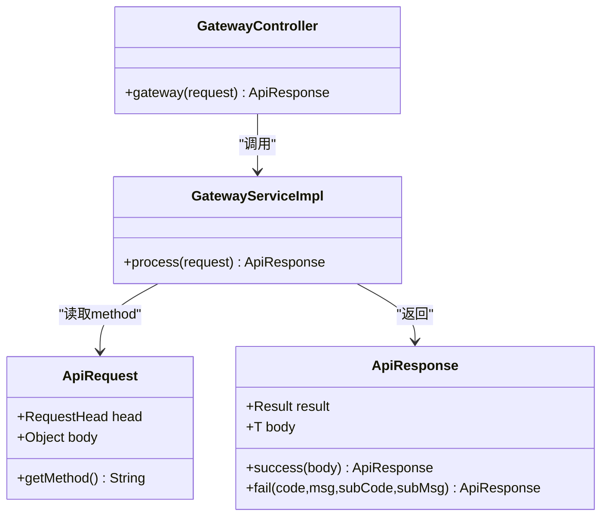
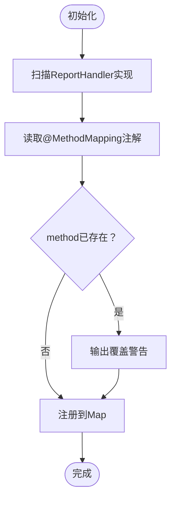
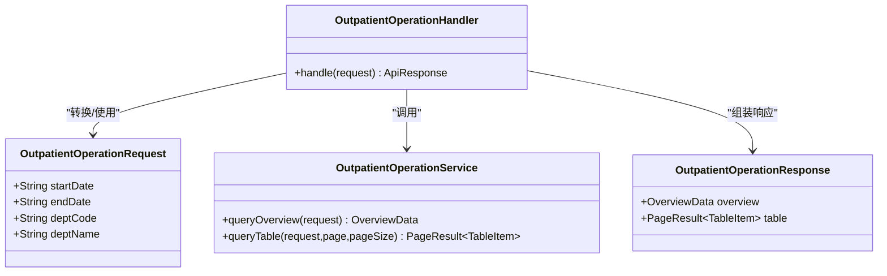
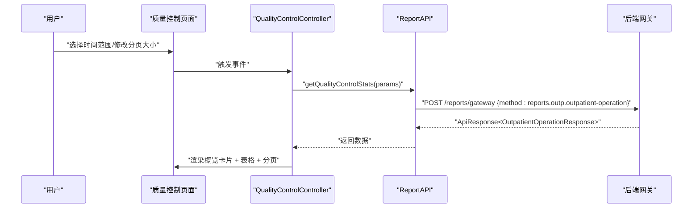
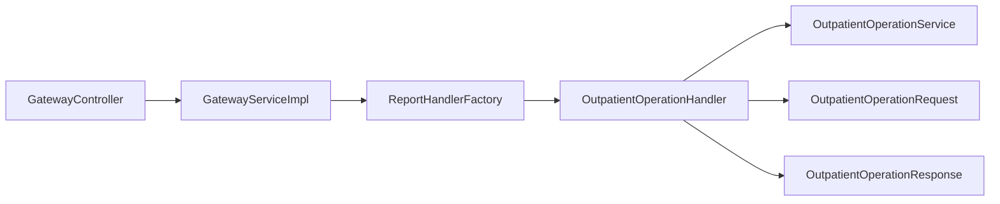

# 门诊质控管理API

<cite>
**本文档引用的文件**
- [GatewayController.java](file://src/main/java/com/reports/controller/GatewayController.java)
- [GatewayService.java](file://src/main/java/com/reports/service/GatewayService.java)
- [GatewayServiceImpl.java](file://src/main/java/com/reports/service/impl/GatewayServiceImpl.java)
- [ApiRequest.java](file://src/main/java/com/reports/dto/common/ApiRequest.java)
- [ApiResponse.java](file://src/main/java/com/reports/dto/common/ApiResponse.java)
- [ReportHandler.java](file://src/main/java/com/reports/service/handler/ReportHandler.java)
- [ReportHandlerFactory.java](file://src/main/java/com/reports/service/handler/ReportHandlerFactory.java)
- [OutpatientOperationHandler.java](file://src/main/java/com/reports/service/handler/impl/OutpatientOperationHandler.java)
- [OutpatientOperationRequest.java](file://src/main/java/com/reports/dto/request/OutpatientOperationRequest.java)
- [OutpatientOperationResponse.java](file://src/main/java/com/reports/dto/response/OutpatientOperationResponse.java)
- [OutpatientOperationService.java](file://src/main/java/com/reports/service/OutpatientOperationService.java)
- [outpatient-quality-control.html](file://reports-web/outpatient/outpatient-quality-control.html)
- [quality-control-app.js](file://reports-web/outpatient/js/quality-control-app.js)
</cite>

## 目录
1. [简介](#简介)
2. [项目结构](#项目结构)
3. [核心组件](#核心组件)
4. [架构总览](#架构总览)
5. [详细组件分析](#详细组件分析)
6. [依赖关系分析](#依赖关系分析)
7. [性能考虑](#性能考虑)
8. [故障排除指南](#故障排除指南)
9. [结论](#结论)
10. [附录](#附录)

## 简介
本项目为“门诊质控管理API”，围绕医疗质量控制与监管目标，提供统一网关入口与可扩展的报表处理器体系，支撑如下关键能力：
- 质控指标展示：包含电子病历使用率、标准诊断使用率、准时出诊率、停诊率、化疗病历完整率、严重不良反应发生率、静脉治疗相关不良事件发生率、危急值30分钟内通报完成率、静脉采血相关差错发生率、门诊手术并发症发生率、每千门诊诊疗人次不良事件发生率等。
- 统计与可视化：前端页面以卡片与表格形式展示指标概览与历史趋势，支持分页、导出Excel等功能。
- 数据维护与报告生成：提供数据维护弹窗与Word导出预览（开发中），便于质控数据的录入与归档。

本API采用统一请求/响应封装、基于method的处理器路由分发模式，便于后续扩展新的质控报表与监管指标。

## 项目结构
后端采用Spring Boot工程，核心模块划分如下：
- 控制层：统一网关入口，接收请求并交由服务层处理。
- 服务层：网关服务负责校验与路由；处理器工厂自动注册各报表处理器；各处理器调用对应服务实现业务逻辑。
- DTO层：统一封装请求/响应对象及分页结果。
- 前端页面：提供质控指标展示页面与交互逻辑，对接后端API。

图表来源
- [GatewayController.java:1-38](file://src/main/java/com/reports/controller/GatewayController.java#L1-L38)
- [GatewayServiceImpl.java:1-51](file://src/main/java/com/reports/service/impl/GatewayServiceImpl.java#L1-L51)
- [ReportHandlerFactory.java:1-74](file://src/main/java/com/reports/service/handler/ReportHandlerFactory.java#L1-L74)
- [OutpatientOperationHandler.java:1-65](file://src/main/java/com/reports/service/handler/impl/OutpatientOperationHandler.java#L1-L65)
- [OutpatientOperationService.java:1-24](file://src/main/java/com/reports/service/OutpatientOperationService.java#L1-L24)
- [outpatient-quality-control.html:1-403](file://reports-web/outpatient/outpatient-quality-control.html#L1-L403)
- [quality-control-app.js:1-241](file://reports-web/outpatient/js/quality-control-app.js#L1-L241)

章节来源
- [GatewayController.java:1-38](file://src/main/java/com/reports/controller/GatewayController.java#L1-L38)
- [outpatient-quality-control.html:1-403](file://reports-web/outpatient/outpatient-quality-control.html#L1-L403)

## 核心组件
- 统一网关入口
  - 路径：/reports/gateway
  - 方法：POST
  - 功能：接收统一请求对象，交由网关服务处理。
- 网关服务
  - 校验请求合法性（head与method），根据method从处理器工厂获取对应处理器并执行。
- 处理器工厂
  - 自动扫描所有ReportHandler实现，读取MethodMapping注解进行注册，支持动态路由与覆盖提示。
- 报表处理器
  - 示例：门诊运行数据统计处理器，负责将通用请求体转换为具体请求类型，调用服务查询概览与分页表格数据，组装统一响应。
- DTO与分页
  - 统一请求/响应封装，包含结果状态与业务体；分页结果包含列表与总数。
- 前端页面与控制器
  - 页面提供指标筛选、概览卡片、表格分页与导出功能；前端JavaScript通过API调用后端接口。

章节来源
- [GatewayController.java:28-35](file://src/main/java/com/reports/controller/GatewayController.java#L28-L35)
- [GatewayServiceImpl.java:29-48](file://src/main/java/com/reports/service/impl/GatewayServiceImpl.java#L29-L48)
- [ReportHandlerFactory.java:31-52](file://src/main/java/com/reports/service/handler/ReportHandlerFactory.java#L31-L52)
- [OutpatientOperationHandler.java:33-62](file://src/main/java/com/reports/service/handler/impl/OutpatientOperationHandler.java#L33-L62)
- [ApiRequest.java:17-32](file://src/main/java/com/reports/dto/common/ApiRequest.java#L17-L32)
- [ApiResponse.java:17-54](file://src/main/java/com/reports/dto/common/ApiResponse.java#L17-L54)
- [outpatient-quality-control.html:61-245](file://reports-web/outpatient/outpatient-quality-control.html#L61-L245)
- [quality-control-app.js:58-77](file://reports-web/outpatient/js/quality-control-app.js#L58-L77)

## 架构总览
整体采用“网关+工厂+处理器”的分发架构，前端通过统一网关调用不同报表处理器，实现按method路由的可扩展设计。

图表来源
- [GatewayController.java:31-35](file://src/main/java/com/reports/controller/GatewayController.java#L31-L35)
- [GatewayServiceImpl.java:31-47](file://src/main/java/com/reports/service/impl/GatewayServiceImpl.java#L31-L47)
- [ReportHandlerFactory.java:57-64](file://src/main/java/com/reports/service/handler/ReportHandlerFactory.java#L57-L64)
- [OutpatientOperationHandler.java:34-61](file://src/main/java/com/reports/service/handler/impl/OutpatientOperationHandler.java#L34-L61)
- [OutpatientOperationService.java:13-22](file://src/main/java/com/reports/service/OutpatientOperationService.java#L13-L22)

## 详细组件分析

### 统一网关与请求/响应封装
- 统一请求对象包含head与body，head中携带method用于路由；body可能为LinkedHashMap，处理器内部会转换为具体类型。
- 统一响应对象包含结果状态与业务体，提供成功/失败静态构造方法。
- 网关服务在处理前进行参数校验，若method缺失或无效则抛出业务异常。

图表来源
- [ApiRequest.java:17-32](file://src/main/java/com/reports/dto/common/ApiRequest.java#L17-L32)
- [ApiResponse.java:17-54](file://src/main/java/com/reports/dto/common/ApiResponse.java#L17-L54)
- [GatewayController.java:31-35](file://src/main/java/com/reports/controller/GatewayController.java#L31-L35)
- [GatewayServiceImpl.java:31-47](file://src/main/java/com/reports/service/impl/GatewayServiceImpl.java#L31-L47)

章节来源
- [ApiRequest.java:17-32](file://src/main/java/com/reports/dto/common/ApiRequest.java#L17-L32)
- [ApiResponse.java:17-54](file://src/main/java/com/reports/dto/common/ApiResponse.java#L17-L54)
- [GatewayController.java:28-35](file://src/main/java/com/reports/controller/GatewayController.java#L28-L35)
- [GatewayServiceImpl.java:31-47](file://src/main/java/com/reports/service/impl/GatewayServiceImpl.java#L31-L47)

### 处理器工厂与路由分发
- 处理器工厂在初始化时扫描所有ReportHandler实现，读取MethodMapping注解中的method键进行注册；重复注册会输出警告。
- getHandler根据method返回对应处理器，不存在时抛出业务异常。
- 支持supports判断是否支持某method，便于前端或测试场景预检。

图表来源
- [ReportHandlerFactory.java:31-52](file://src/main/java/com/reports/service/handler/ReportHandlerFactory.java#L31-L52)

章节来源
- [ReportHandlerFactory.java:31-74](file://src/main/java/com/reports/service/handler/ReportHandlerFactory.java#L31-L74)

### 门诊运行数据统计处理器
- 处理器职责：将通用请求体转换为具体请求类型，调用服务查询概览与表格数据，组装统一响应。
- 请求体字段：startDate、endDate、deptCode、deptName（可选）。
- 响应体字段：概览数据与分页表格数据。

图表来源
- [OutpatientOperationHandler.java:33-62](file://src/main/java/com/reports/service/handler/impl/OutpatientOperationHandler.java#L33-L62)
- [OutpatientOperationRequest.java:16-35](file://src/main/java/com/reports/dto/request/OutpatientOperationRequest.java#L16-L35)
- [OutpatientOperationResponse.java:14-23](file://src/main/java/com/reports/dto/response/OutpatientOperationResponse.java#L14-L23)
- [OutpatientOperationService.java:13-22](file://src/main/java/com/reports/service/OutpatientOperationService.java#L13-L22)

章节来源
- [OutpatientOperationHandler.java:33-62](file://src/main/java/com/reports/service/handler/impl/OutpatientOperationHandler.java#L33-L62)
- [OutpatientOperationRequest.java:16-35](file://src/main/java/com/reports/dto/request/OutpatientOperationRequest.java#L16-L35)
- [OutpatientOperationResponse.java:14-23](file://src/main/java/com/reports/dto/response/OutpatientOperationResponse.java#L14-L23)
- [OutpatientOperationService.java:13-22](file://src/main/java/com/reports/service/OutpatientOperationService.java#L13-L22)

### 前端页面与交互流程
- 页面提供时间范围选择、指标概览卡片、表格分页与导出Excel功能。
- JavaScript控制器负责绑定事件、加载数据、渲染概览与表格、分页导航与跳转。
- 导出Excel时按指标列顺序生成工作簿并下载。

图表来源
- [quality-control-app.js:58-77](file://reports-web/outpatient/js/quality-control-app.js#L58-L77)
- [outpatient-quality-control.html:61-245](file://reports-web/outpatient/outpatient-quality-control.html#L61-L245)

章节来源
- [quality-control-app.js:58-171](file://reports-web/outpatient/js/quality-control-app.js#L58-L171)
- [outpatient-quality-control.html:61-245](file://reports-web/outpatient/outpatient-quality-control.html#L61-L245)

## 依赖关系分析
- 控制层依赖服务层；服务层依赖处理器工厂与处理器；处理器依赖服务接口与DTO。
- 处理器工厂通过注解驱动自动注册，降低硬编码耦合。
- 前端通过统一网关与后端交互，method作为路由键，便于横向扩展新报表。

图表来源
- [GatewayController.java:1-38](file://src/main/java/com/reports/controller/GatewayController.java#L1-L38)
- [GatewayServiceImpl.java:1-51](file://src/main/java/com/reports/service/impl/GatewayServiceImpl.java#L1-L51)
- [ReportHandlerFactory.java:1-74](file://src/main/java/com/reports/service/handler/ReportHandlerFactory.java#L1-L74)
- [OutpatientOperationHandler.java:1-65](file://src/main/java/com/reports/service/handler/impl/OutpatientOperationHandler.java#L1-L65)
- [OutpatientOperationService.java:1-24](file://src/main/java/com/reports/service/OutpatientOperationService.java#L1-L24)
- [OutpatientOperationRequest.java:1-37](file://src/main/java/com/reports/dto/request/OutpatientOperationRequest.java#L1-L37)
- [OutpatientOperationResponse.java:1-25](file://src/main/java/com/reports/dto/response/OutpatientOperationResponse.java#L1-L25)

章节来源
- [GatewayController.java:1-38](file://src/main/java/com/reports/controller/GatewayController.java#L1-L38)
- [GatewayServiceImpl.java:1-51](file://src/main/java/com/reports/service/impl/GatewayServiceImpl.java#L1-L51)
- [ReportHandlerFactory.java:1-74](file://src/main/java/com/reports/service/handler/ReportHandlerFactory.java#L1-L74)
- [OutpatientOperationHandler.java:1-65](file://src/main/java/com/reports/service/handler/impl/OutpatientOperationHandler.java#L1-L65)
- [OutpatientOperationService.java:1-24](file://src/main/java/com/reports/service/OutpatientOperationService.java#L1-L24)
- [OutpatientOperationRequest.java:1-37](file://src/main/java/com/reports/dto/request/OutpatientOperationRequest.java#L1-L37)
- [OutpatientOperationResponse.java:1-25](file://src/main/java/com/reports/dto/response/OutpatientOperationResponse.java#L1-L25)

## 性能考虑
- 处理器工厂使用并发映射存储处理器，避免多线程竞争；初始化时一次性注册，运行期查找为O(1)。
- 网关服务对请求进行快速校验，减少无效调用成本。
- 建议：分页参数合理设置默认值与最大值，避免大页数导致数据库压力；对高频指标可增加缓存策略；前端导出Excel时注意大数据量的内存占用与分批导出。

## 故障排除指南
- method缺失或为空：网关服务会抛出业务异常，检查请求head.method是否正确传入。
- method未注册：处理器工厂在初始化阶段会校验注解，若缺失或为空会抛出异常；请确保实现类上标注MethodMapping且值非空。
- 处理器不存在：getHandler找不到对应处理器时抛出业务异常；请确认method拼写与注册一致。
- 响应解析异常：前端期望的响应结构与后端不一致时可能出现解析错误；请核对响应体结构与字段命名。

章节来源
- [GatewayServiceImpl.java:32-44](file://src/main/java/com/reports/service/impl/GatewayServiceImpl.java#L32-L44)
- [ReportHandlerFactory.java:35-49](file://src/main/java/com/reports/service/handler/ReportHandlerFactory.java#L35-L49)
- [ReportHandlerFactory.java:57-64](file://src/main/java/com/reports/service/handler/ReportHandlerFactory.java#L57-L64)

## 结论
本项目通过统一网关与处理器工厂实现了可扩展的报表处理架构，前端页面提供了直观的质控指标展示与导出能力。建议后续结合实际业务完善以下方面：
- 新增更多质控指标处理器，覆盖诊疗规范执行率、医疗安全事件统计、服务质量评估与持续改进措施。
- 完善数据维护弹窗与Word导出功能，提升质控数据录入与归档效率。
- 引入缓存与分页优化，保障高并发下的稳定性与性能。

## 附录

### 接口定义（统一网关）
- 地址：/reports/gateway
- 方法：POST
- 请求头示例：
  - method: reports.outp.outpatient-operation
- 请求体示例：
  - startDate: "YYYY-MM"
  - endDate: "YYYY-MM"
  - deptCode: "科室编码"
  - deptName: "科室名称（可选）"
- 响应体示例：
  - overview: 概览数据对象
  - table: 分页表格数据对象

章节来源
- [GatewayController.java:31-35](file://src/main/java/com/reports/controller/GatewayController.java#L31-L35)
- [OutpatientOperationHandler.java:34-61](file://src/main/java/com/reports/service/handler/impl/OutpatientOperationHandler.java#L34-L61)
- [OutpatientOperationRequest.java:16-35](file://src/main/java/com/reports/dto/request/OutpatientOperationRequest.java#L16-L35)
- [OutpatientOperationResponse.java:14-23](file://src/main/java/com/reports/dto/response/OutpatientOperationResponse.java#L14-L23)

### 质控指标说明（来源于前端页面）
- 门诊电子病历使用率
- 门诊标准诊断使用率
- 门诊准时出诊率
- 门诊停诊率
- 门诊化疗病历记录完整率
- 门诊化疗严重不良反应发生率
- 门诊化疗患者静脉治疗相关不良事件发生率
- 门诊危急值30分钟内通报完成率
- 门诊静脉采血相关差错发生率
- 门诊手术并发症发生率
- 每千门诊诊疗人次不良事件发生率

章节来源
- [outpatient-quality-control.html:76-197](file://reports-web/outpatient/outpatient-quality-control.html#L76-L197)
- [quality-control-app.js:17-29](file://reports-web/outpatient/js/quality-control-app.js#L17-L29)