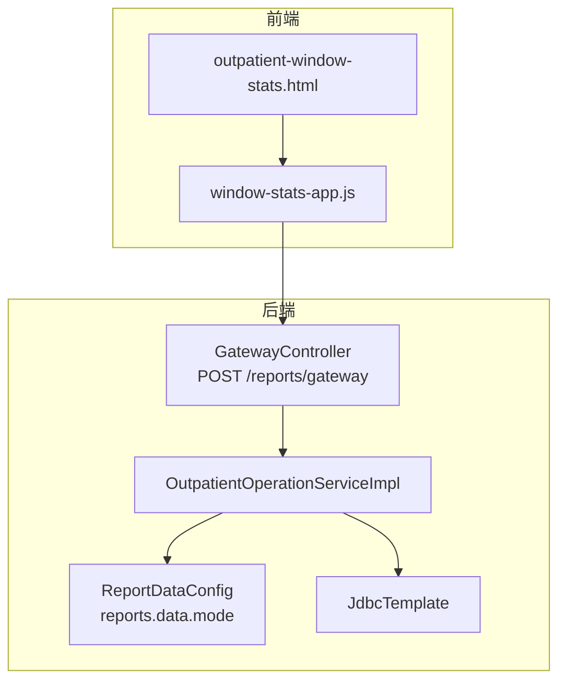
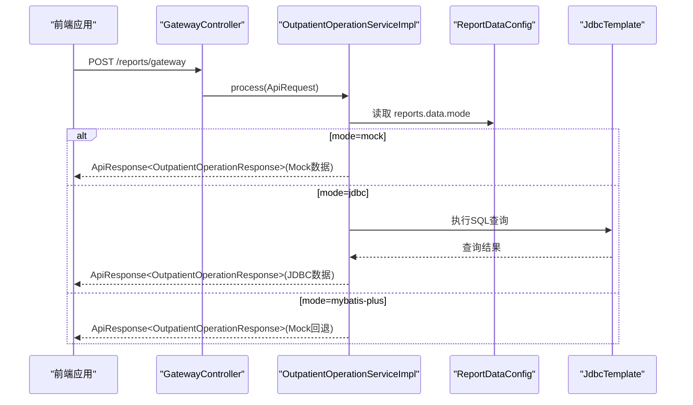
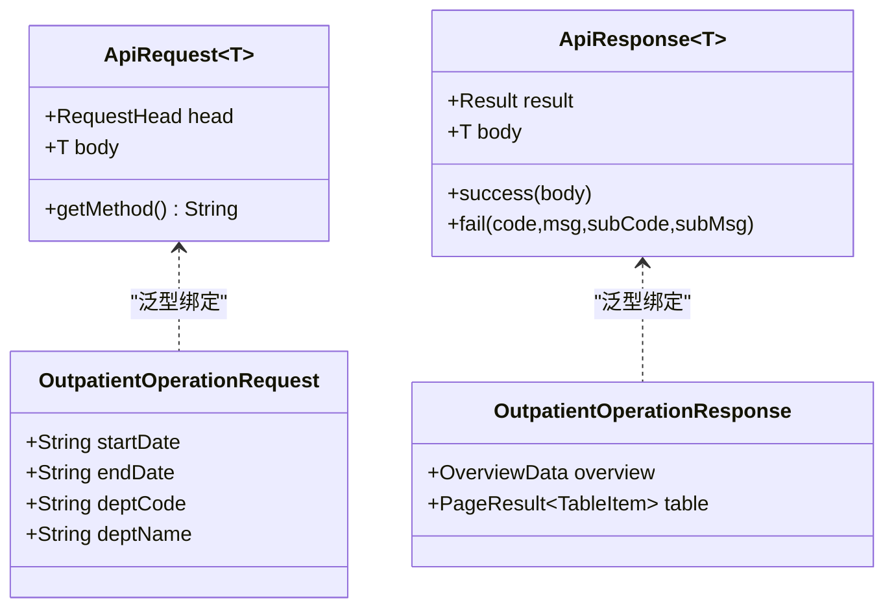
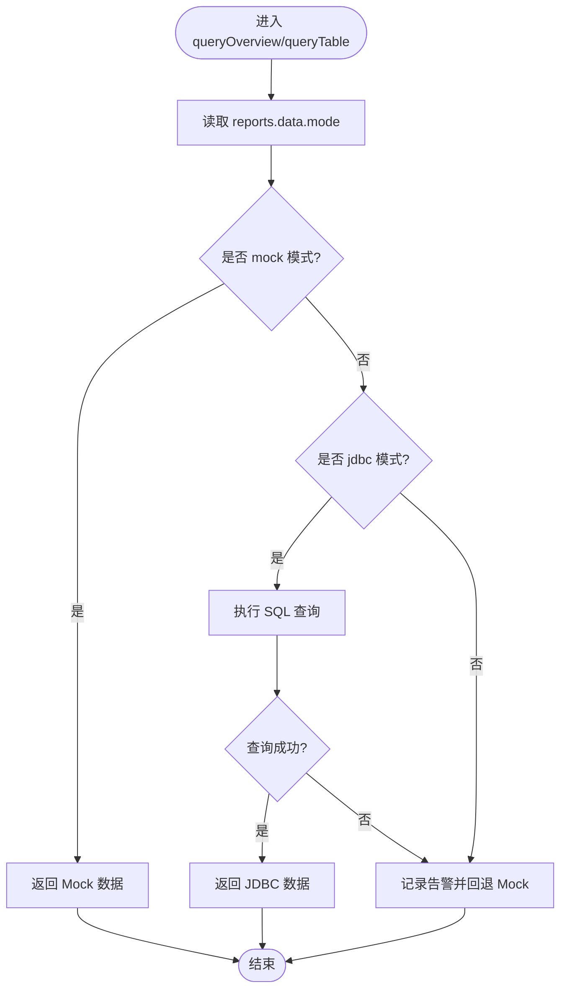
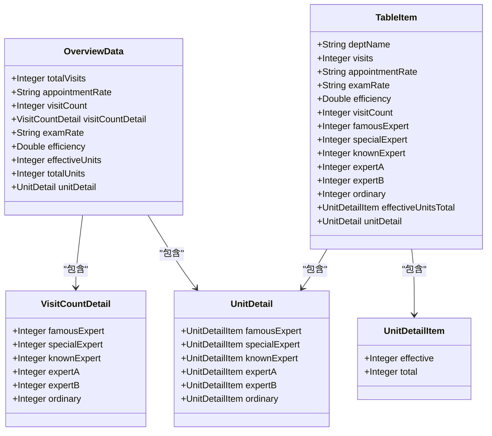
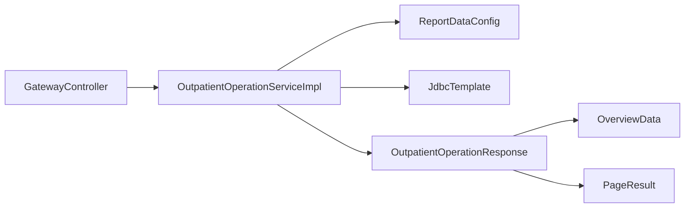

# 门诊运营统计API

<cite>
**本文档引用的文件**
- [GatewayController.java](file://src/main/java/com/reports/controller/GatewayController.java)
- [OutpatientOperationService.java](file://src/main/java/com/reports/service/OutpatientOperationService.java)
- [OutpatientOperationServiceImpl.java](file://src/main/java/com/reports/service/impl/OutpatientOperationServiceImpl.java)
- [OutpatientOperationRequest.java](file://src/main/java/com/reports/dto/request/OutpatientOperationRequest.java)
- [OutpatientOperationResponse.java](file://src/main/java/com/reports/dto/response/OutpatientOperationResponse.java)
- [OverviewData.java](file://src/main/java/com/reports/dto/response/OverviewData.java)
- [TableItem.java](file://src/main/java/com/reports/dto/response/TableItem.java)
- [VisitCountDetail.java](file://src/main/java/com/reports/dto/response/VisitCountDetail.java)
- [UnitDetail.java](file://src/main/java/com/reports/dto/response/UnitDetail.java)
- [UnitDetailItem.java](file://src/main/java/com/reports/dto/response/UnitDetailItem.java)
- [ApiRequest.java](file://src/main/java/com/reports/dto/common/ApiRequest.java)
- [ApiResponse.java](file://src/main/java/com/reports/dto/common/ApiResponse.java)
- [ReportDataConfig.java](file://src/main/java/com/reports/config/ReportDataConfig.java)
- [application.yml](file://src/main/resources/application.yml)
- [outpatient-window-stats.html](file://reports-web/outpatient/outpatient-window-stats.html)
- [window-stats-app.js](file://reports-web/outpatient/js/window-stats-app.js)
</cite>

## 目录
1. [简介](#简介)
2. [项目结构](#项目结构)
3. [核心组件](#核心组件)
4. [架构总览](#架构总览)
5. [详细组件分析](#详细组件分析)
6. [依赖关系分析](#依赖关系分析)
7. [性能考虑](#性能考虑)
8. [故障排查指南](#故障排查指南)
9. [结论](#结论)
10. [附录](#附录)

## 简介
本文件为“门诊运营统计API”的完整接口文档，面向需要获取门诊运行情况统计指标（如门诊人次、预约率、检查率、效率、单元使用情况等）的前后端开发者与产品人员。文档覆盖统一网关入口、请求参数配置、响应数据结构、时间范围筛选、数据格式规范，并提供正常与异常场景下的请求与响应示例路径，帮助快速集成与排障。

## 项目结构
该系统采用“统一网关 + 业务服务 + DTO模型 + 配置开关”的分层设计：
- 控制层：统一网关接收请求并转发至具体业务处理器
- 服务层：门诊运营统计服务定义接口，实现类支持多数据源模式（Mock/JDBC/MyBatis-Plus）
- DTO层：请求/响应对象定义清晰的数据结构
- 配置层：通过配置文件控制数据模式与日志追踪

图表来源
- [GatewayController.java:18-35](file://src/main/java/com/reports/controller/GatewayController.java#L18-L35)
- [OutpatientOperationServiceImpl.java:36-73](file://src/main/java/com/reports/service/impl/OutpatientOperationServiceImpl.java#L36-L73)
- [ReportDataConfig.java:16-44](file://src/main/java/com/reports/config/ReportDataConfig.java#L16-L44)
- [application.yml:21-23](file://src/main/resources/application.yml#L21-L23)

章节来源
- [GatewayController.java:1-38](file://src/main/java/com/reports/controller/GatewayController.java#L1-L38)
- [OutpatientOperationServiceImpl.java:1-253](file://src/main/java/com/reports/service/impl/OutpatientOperationServiceImpl.java#L1-L253)
- [application.yml:1-32](file://src/main/resources/application.yml#L1-L32)

## 核心组件
- 统一网关控制器：接收统一请求体，调用网关服务进行处理
- 门诊运营统计服务接口：定义概览数据与表格分页查询能力
- 门诊运营统计服务实现：根据配置选择数据源模式执行查询
- DTO模型：请求体、响应体及各类统计明细对象
- 配置中心：控制数据模式（Mock/JDBC/MyBatis-Plus）

章节来源
- [GatewayController.java:28-35](file://src/main/java/com/reports/controller/GatewayController.java#L28-L35)
- [OutpatientOperationService.java:11-23](file://src/main/java/com/reports/service/OutpatientOperationService.java#L11-L23)
- [OutpatientOperationServiceImpl.java:47-73](file://src/main/java/com/reports/service/impl/OutpatientOperationServiceImpl.java#L47-L73)
- [ReportDataConfig.java:16-44](file://src/main/java/com/reports/config/ReportDataConfig.java#L16-L44)

## 架构总览
统一网关入口负责接收请求并交由服务层处理；服务层依据配置选择数据源模式，优先返回Mock数据，其次尝试JDBC直连SQL，最后回退到Mock。响应体封装统一结果与业务数据。

图表来源
- [GatewayController.java:31-35](file://src/main/java/com/reports/controller/GatewayController.java#L31-L35)
- [OutpatientOperationServiceImpl.java:47-73](file://src/main/java/com/reports/service/impl/OutpatientOperationServiceImpl.java#L47-L73)
- [ReportDataConfig.java:26-42](file://src/main/java/com/reports/config/ReportDataConfig.java#L26-L42)

## 详细组件分析

### 接口定义与统一请求/响应
- 统一请求体：包含请求头与请求体两部分
- 统一响应体：包含结果状态与业务数据
- 业务请求体：门诊运营统计请求参数
- 业务响应体：概览数据 + 表格分页数据

图表来源
- [ApiRequest.java:13-34](file://src/main/java/com/reports/dto/common/ApiRequest.java#L13-L34)
- [ApiResponse.java:13-56](file://src/main/java/com/reports/dto/common/ApiResponse.java#L13-L56)
- [OutpatientOperationRequest.java:12-36](file://src/main/java/com/reports/dto/request/OutpatientOperationRequest.java#L12-L36)
- [OutpatientOperationResponse.java:10-24](file://src/main/java/com/reports/dto/response/OutpatientOperationResponse.java#L10-L24)

章节来源
- [ApiRequest.java:1-35](file://src/main/java/com/reports/dto/common/ApiRequest.java#L1-L35)
- [ApiResponse.java:1-57](file://src/main/java/com/reports/dto/common/ApiResponse.java#L1-L57)
- [OutpatientOperationRequest.java:1-37](file://src/main/java/com/reports/dto/request/OutpatientOperationRequest.java#L1-L37)
- [OutpatientOperationResponse.java:1-25](file://src/main/java/com/reports/dto/response/OutpatientOperationResponse.java#L1-L25)

### 统一网关入口
- 路径：/reports/gateway
- 方法：POST
- 功能：接收统一请求体，调用网关服务处理并返回统一响应

章节来源
- [GatewayController.java:18-35](file://src/main/java/com/reports/controller/GatewayController.java#L18-L35)

### 门诊运营统计服务接口
- 查询概览数据：queryOverview(OutpatientOperationRequest)
- 查询表格分页数据：queryTable(OutpatientOperationRequest, page, pageSize)

章节来源
- [OutpatientOperationService.java:11-23](file://src/main/java/com/reports/service/OutpatientOperationService.java#L11-L23)

### 门诊运营统计服务实现
- 数据模式选择：根据配置决定使用Mock/JDBC/MyBatis-Plus
- 概览数据查询：按日期范围统计总人次、预约率、检查率、效率、单元数等
- 表格数据查询：按科室维度统计并分页返回
- 异常回退：JDBC查询失败时自动回退到Mock数据

图表来源
- [OutpatientOperationServiceImpl.java:47-73](file://src/main/java/com/reports/service/impl/OutpatientOperationServiceImpl.java#L47-L73)
- [OutpatientOperationServiceImpl.java:152-177](file://src/main/java/com/reports/service/impl/OutpatientOperationServiceImpl.java#L152-L177)
- [OutpatientOperationServiceImpl.java:179-212](file://src/main/java/com/reports/service/impl/OutpatientOperationServiceImpl.java#L179-L212)

章节来源
- [OutpatientOperationServiceImpl.java:36-73](file://src/main/java/com/reports/service/impl/OutpatientOperationServiceImpl.java#L36-L73)
- [OutpatientOperationServiceImpl.java:152-212](file://src/main/java/com/reports/service/impl/OutpatientOperationServiceImpl.java#L152-L212)

### 请求参数配置
- 时间范围：startDate（开始日期，yyyy-MM-dd）、endDate（结束日期，yyyy-MM-dd）
- 科室筛选：deptCode（可选）、deptName（可选）
- 分页参数：page、pageSize（仅表格查询使用）

章节来源
- [OutpatientOperationRequest.java:19-34](file://src/main/java/com/reports/dto/request/OutpatientOperationRequest.java#L19-L34)

### 响应数据结构
- 概览数据（OverviewData）：总就诊人次、预约率、就诊人次、检查率、效率、有效/总单元数、各类专家人次明细
- 表格行数据（TableItem）：科室名称、就诊人次、预约率、检查率、效率、各类专家数量、有效单元总数、单元明细
- 单元明细项（UnitDetailItem）：有效数、总数
- 单元明细（UnitDetail）：按专家级别分组的有效/总数
- 就诊人次明细（VisitCountDetail）：按专家级别分组的就诊人次

图表来源
- [OverviewData.java:9-56](file://src/main/java/com/reports/dto/response/OverviewData.java#L9-L56)
- [TableItem.java:9-81](file://src/main/java/com/reports/dto/response/TableItem.java#L9-L81)
- [UnitDetailItem.java:9-21](file://src/main/java/com/reports/dto/response/UnitDetailItem.java#L9-L21)
- [UnitDetail.java:9-18](file://src/main/java/com/reports/dto/response/UnitDetail.java#L9-L18)
- [VisitCountDetail.java:9-41](file://src/main/java/com/reports/dto/response/VisitCountDetail.java#L9-L41)

章节来源
- [OverviewData.java:1-57](file://src/main/java/com/reports/dto/response/OverviewData.java#L1-L57)
- [TableItem.java:1-82](file://src/main/java/com/reports/dto/response/TableItem.java#L1-L82)
- [UnitDetailItem.java:1-22](file://src/main/java/com/reports/dto/response/UnitDetailItem.java#L1-L22)
- [UnitDetail.java:1-19](file://src/main/java/com/reports/dto/response/UnitDetail.java#L1-L19)
- [VisitCountDetail.java:1-42](file://src/main/java/com/reports/dto/response/VisitCountDetail.java#L1-L42)

### 数据模式与配置
- 配置项：reports.data.mode
  - mock：返回模拟数据（默认）
  - jdbc：通过JdbcTemplate执行SQL查询
  - mybatis-plus：通过MyBatis-Plus查询（当前回退到Mock）
- 日志追踪：reports.trace.* 控制追踪号前缀、长度与格式

章节来源
- [application.yml:21-23](file://src/main/resources/application.yml#L21-L23)
- [ReportDataConfig.java:16-44](file://src/main/java/com/reports/config/ReportDataConfig.java#L16-L44)

### 前端集成参考
- 页面：outpatient-window-stats.html
- 交互脚本：window-stats-app.js
- 前端通过API获取数据并渲染图表与表格，支持Mock模式切换

章节来源
- [outpatient-window-stats.html:1-130](file://reports-web/outpatient/outpatient-window-stats.html#L1-L130)
- [window-stats-app.js:73-90](file://reports-web/outpatient/js/window-stats-app.js#L73-L90)

## 依赖关系分析
- 控制器依赖网关服务
- 服务实现依赖配置与JDBC模板
- 响应体依赖概览与表格数据模型

图表来源
- [GatewayController.java:21-26](file://src/main/java/com/reports/controller/GatewayController.java#L21-L26)
- [OutpatientOperationServiceImpl.java:38-44](file://src/main/java/com/reports/service/impl/OutpatientOperationServiceImpl.java#L38-L44)
- [OutpatientOperationResponse.java:17-22](file://src/main/java/com/reports/dto/response/OutpatientOperationResponse.java#L17-L22)

章节来源
- [GatewayController.java:1-38](file://src/main/java/com/reports/controller/GatewayController.java#L1-L38)
- [OutpatientOperationServiceImpl.java:1-253](file://src/main/java/com/reports/service/impl/OutpatientOperationServiceImpl.java#L1-L253)
- [OutpatientOperationResponse.java:1-25](file://src/main/java/com/reports/dto/response/OutpatientOperationResponse.java#L1-L25)

## 性能考虑
- 数据模式选择：生产环境建议使用jdbc模式以获取实时数据；开发/联调阶段可使用mock提升响应速度
- SQL优化：表格查询使用分组与排序，注意在大范围时间与多科室场景下建立索引
- 回退策略：JDBC失败自动回退mock，避免阻塞前端渲染
- 日志级别：合理设置日志级别，避免高频统计场景产生过多日志

## 故障排查指南
- 现象：接口返回Mock数据
  - 可能原因：配置为mock或JDBC查询异常回退
  - 排查步骤：检查配置项reports.data.mode；查看服务日志中JDBC查询异常记录
- 现象：表格数据为空或总数不正确
  - 可能原因：时间范围不匹配或数据库无对应记录
  - 排查步骤：确认startDate与endDate格式与范围；核对数据库中门诊记录是否存在
- 现象：接口超时或响应缓慢
  - 可能原因：JDBC查询未命中索引或数据量过大
  - 排查步骤：优化SQL与索引；缩小时间范围；必要时启用分页参数

章节来源
- [OutpatientOperationServiceImpl.java:173-176](file://src/main/java/com/reports/service/impl/OutpatientOperationServiceImpl.java#L173-L176)
- [OutpatientOperationServiceImpl.java:208-211](file://src/main/java/com/reports/service/impl/OutpatientOperationServiceImpl.java#L208-L211)

## 结论
本接口通过统一网关与灵活的数据模式，为门诊运营统计提供了稳定、可扩展的能力。建议在生产环境使用jdbc模式并配合合理的索引与分页策略，以获得最佳性能与准确性。

## 附录

### 接口定义
- 统一网关入口
  - 方法：POST
  - 路径：/reports/gateway
  - 请求体：ApiRequest<OutpatientOperationRequest>
  - 响应体：ApiResponse<OutpatientOperationResponse>

章节来源
- [GatewayController.java:31-35](file://src/main/java/com/reports/controller/GatewayController.java#L31-L35)
- [ApiRequest.java:13-34](file://src/main/java/com/reports/dto/common/ApiRequest.java#L13-L34)
- [ApiResponse.java:13-56](file://src/main/java/com/reports/dto/common/ApiResponse.java#L13-L56)

### 请求参数说明
- 时间范围
  - startDate：开始日期，格式 yyyy-MM-dd
  - endDate：结束日期，格式 yyyy-MM-dd
- 科室筛选
  - deptCode：科室编码（可选）
  - deptName：科室名称（可选）
- 分页参数（表格查询）
  - page：页码
  - pageSize：每页条数

章节来源
- [OutpatientOperationRequest.java:19-34](file://src/main/java/com/reports/dto/request/OutpatientOperationRequest.java#L19-L34)

### 响应数据说明
- 概览数据（OverviewData）
  - 字段：总就诊人次、预约率、就诊人次、检查率、效率、有效/总单元数、各类专家人次明细
- 表格数据（TableItem）
  - 字段：科室名称、就诊人次、预约率、检查率、效率、各类专家数量、有效单元总数、单元明细
- 单元明细（UnitDetailItem）
  - 字段：有效数、总数
- 单元明细（UnitDetail）
  - 字段：按专家级别分组的有效/总数
- 就诊人次明细（VisitCountDetail）
  - 字段：按专家级别分组的就诊人次

章节来源
- [OverviewData.java:14-54](file://src/main/java/com/reports/dto/response/OverviewData.java#L14-L54)
- [TableItem.java:19-79](file://src/main/java/com/reports/dto/response/TableItem.java#L19-L79)
- [UnitDetailItem.java:14-19](file://src/main/java/com/reports/dto/response/UnitDetailItem.java#L14-L19)
- [UnitDetail.java:11-16](file://src/main/java/com/reports/dto/response/UnitDetail.java#L11-L16)
- [VisitCountDetail.java:14-39](file://src/main/java/com/reports/dto/response/VisitCountDetail.java#L14-L39)

### 数据模式配置
- 配置项：reports.data.mode
  - mock：返回模拟数据（默认）
  - jdbc：JdbcTemplate直连SQL
  - mybatis-plus：MyBatis-Plus查询（当前回退到Mock）

章节来源
- [application.yml:21-23](file://src/main/resources/application.yml#L21-L23)
- [ReportDataConfig.java:26-42](file://src/main/java/com/reports/config/ReportDataConfig.java#L26-L42)

### 请求与响应示例（示例路径）
- 正常请求示例（概览数据）
  - 请求体：ApiRequest<OutpatientOperationRequest>
  - 示例路径：[示例请求体:12-36](file://src/main/java/com/reports/dto/request/OutpatientOperationRequest.java#L12-L36)
- 正常响应示例（概览数据）
  - 响应体：ApiResponse<OutpatientOperationResponse>
  - 示例路径：[示例响应体:10-24](file://src/main/java/com/reports/dto/response/OutpatientOperationResponse.java#L10-L24)
- 正常响应示例（表格数据）
  - 响应体：ApiResponse<PageResult<TableItem>>
  - 示例路径：[表格数据模型:9-81](file://src/main/java/com/reports/dto/response/TableItem.java#L9-L81)
- 异常响应示例
  - 响应体：ApiResponse.fail(code, msg, subCode, subMsg)
  - 示例路径：[统一响应封装:52-54](file://src/main/java/com/reports/dto/common/ApiResponse.java#L52-L54)