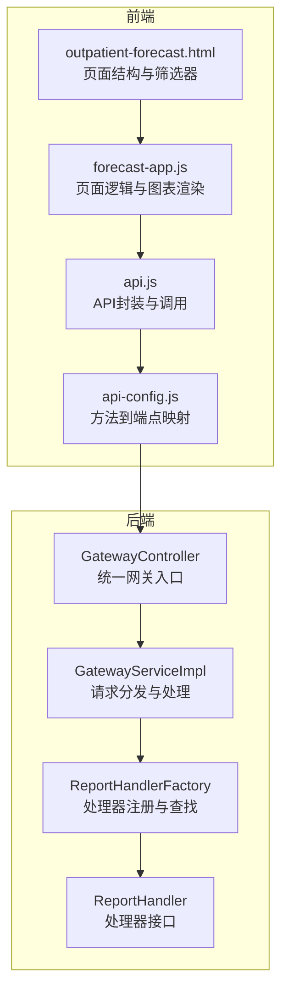
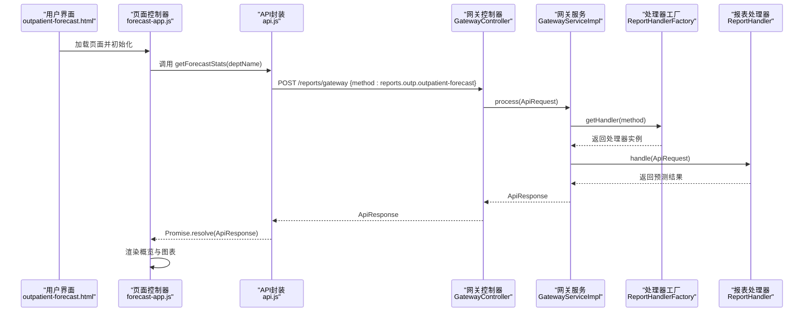
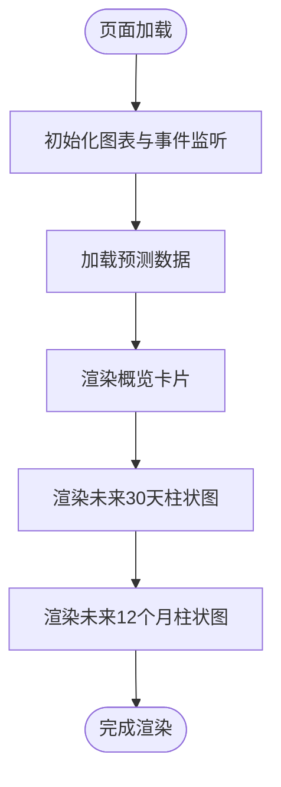
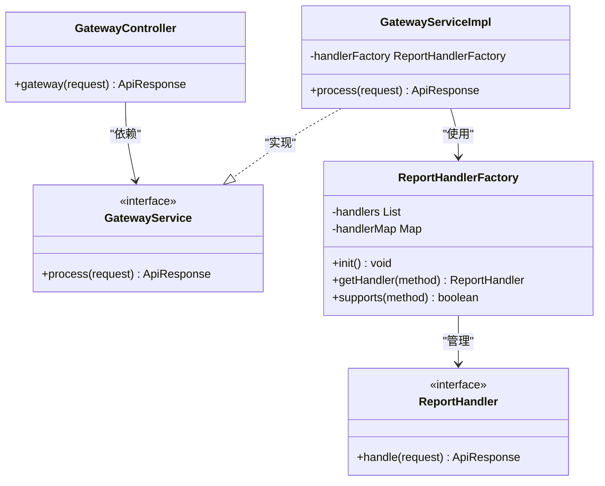
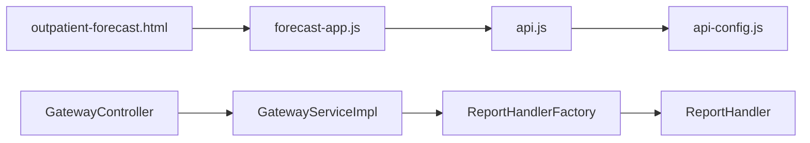

# 门诊预测分析API

<cite>
**本文档引用的文件**
- [outpatient-forecast.html](file://reports-web/outpatient/outpatient-forecast.html)
- [forecast-app.js](file://reports-web/outpatient/js/forecast-app.js)
- [api.js](file://reports-web/outpatient/js/api.js)
- [api-config.js](file://reports-web/api-config.js)
- [outpatient-forecast.md](file://reports-web/api/outpatient-forecast.md)
- [GatewayController.java](file://src/main/java/com/reports/controller/GatewayController.java)
- [GatewayService.java](file://src/main/java/com/reports/service/GatewayService.java)
- [GatewayServiceImpl.java](file://src/main/java/com/reports/service/impl/GatewayServiceImpl.java)
- [ApiRequest.java](file://src/main/java/com/reports/dto/common/ApiRequest.java)
- [ApiResponse.java](file://src/main/java/com/reports/dto/common/ApiResponse.java)
- [ReportHandler.java](file://src/main/java/com/reports/service/handler/ReportHandler.java)
- [ReportHandlerFactory.java](file://src/main/java/com/reports/service/handler/ReportHandlerFactory.java)
</cite>

## 目录
1. [简介](#简介)
2. [项目结构](#项目结构)
3. [核心组件](#核心组件)
4. [架构总览](#架构总览)
5. [详细组件分析](#详细组件分析)
6. [依赖关系分析](#依赖关系分析)
7. [性能考虑](#性能考虑)
8. [故障排除指南](#故障排除指南)
9. [结论](#结论)
10. [附录](#附录)

## 简介
本文件为“门诊预测分析API”的详细接口文档，面向需要基于历史数据进行门诊流量预测与趋势分析的场景。系统提供以下能力：
- 预测周期设置：支持按“明日”、“未来一周”、“未来一月”、“未来一年”四个维度输出预测值
- 预测结果展示：以卡片与柱状图形式直观呈现预测概览与时间序列预测
- 时间序列数据格式：提供未来30天与未来12个月的预测数据结构
- 不确定性分析：当前接口返回固定预测值，未包含置信区间等不确定性指标；可在后续版本扩展
- 预测准确性验证：建议通过对比历史真实值与预测值计算误差指标（如MAE、RMSE）进行验证
- 实际应用场景：用于门诊资源配置、人员排班、设备与耗材准备等

## 项目结构
前端采用HTML+JavaScript+图表库的方式实现预测报表页面，后端通过统一网关路由到具体报表处理器。

**图表来源**
- [outpatient-forecast.html:1-133](file://reports-web/outpatient/outpatient-forecast.html#L1-L133)
- [forecast-app.js:1-158](file://reports-web/outpatient/js/forecast-app.js#L1-L158)
- [api.js:103-158](file://reports-web/outpatient/js/api.js#L103-L158)
- [api-config.js:65-68](file://reports-web/api-config.js#L65-L68)
- [GatewayController.java:1-38](file://src/main/java/com/reports/controller/GatewayController.java#L1-L38)
- [GatewayServiceImpl.java:1-51](file://src/main/java/com/reports/service/impl/GatewayServiceImpl.java#L1-L51)
- [ReportHandlerFactory.java:1-74](file://src/main/java/com/reports/service/handler/ReportHandlerFactory.java#L1-L74)

**章节来源**
- [outpatient-forecast.html:1-133](file://reports-web/outpatient/outpatient-forecast.html#L1-L133)
- [forecast-app.js:1-158](file://reports-web/outpatient/js/forecast-app.js#L1-L158)
- [api.js:103-158](file://reports-web/outpatient/js/api.js#L103-L158)
- [api-config.js:65-68](file://reports-web/api-config.js#L65-L68)
- [GatewayController.java:1-38](file://src/main/java/com/reports/controller/GatewayController.java#L1-L38)
- [GatewayServiceImpl.java:1-51](file://src/main/java/com/reports/service/impl/GatewayServiceImpl.java#L1-L51)
- [ReportHandlerFactory.java:1-74](file://src/main/java/com/reports/service/handler/ReportHandlerFactory.java#L1-L74)

## 核心组件
- 统一网关控制器：接收所有报表请求，交由网关服务处理
- 网关服务实现：校验请求、根据method路由到对应处理器
- 处理器工厂：自动扫描并注册所有报表处理器，按method查找
- 前端页面控制器：负责筛选器交互、图表初始化与数据渲染
- API封装：统一封装请求方法，将method映射到后端端点

**章节来源**
- [GatewayController.java:1-38](file://src/main/java/com/reports/controller/GatewayController.java#L1-L38)
- [GatewayService.java:1-17](file://src/main/java/com/reports/service/GatewayService.java#L1-L17)
- [GatewayServiceImpl.java:1-51](file://src/main/java/com/reports/service/impl/GatewayServiceImpl.java#L1-L51)
- [ReportHandlerFactory.java:1-74](file://src/main/java/com/reports/service/handler/ReportHandlerFactory.java#L1-L74)
- [forecast-app.js:1-158](file://reports-web/outpatient/js/forecast-app.js#L1-L158)
- [api.js:103-158](file://reports-web/outpatient/js/api.js#L103-L158)

## 架构总览
下图展示了从前端到后端的完整调用链路与数据流向。

**图表来源**
- [outpatient-forecast.html:1-133](file://reports-web/outpatient/outpatient-forecast.html#L1-L133)
- [forecast-app.js:38-51](file://reports-web/outpatient/js/forecast-app.js#L38-L51)
- [api.js:127-133](file://reports-web/outpatient/js/api.js#L127-L133)
- [GatewayController.java:28-35](file://src/main/java/com/reports/controller/GatewayController.java#L28-L35)
- [GatewayServiceImpl.java:29-48](file://src/main/java/com/reports/service/impl/GatewayServiceImpl.java#L29-L48)
- [ReportHandlerFactory.java:54-64](file://src/main/java/com/reports/service/handler/ReportHandlerFactory.java#L54-L64)

## 详细组件分析

### 前端页面与交互流程
- 页面结构：包含科室筛选器、预测概览卡片与两个柱状图容器
- 事件绑定：筛选器变更时触发数据加载
- 数据渲染：将后端返回的概览与时间序列数据渲染到页面元素与图表中

**图表来源**
- [forecast-app.js:16-51](file://reports-web/outpatient/js/forecast-app.js#L16-L51)

**章节来源**
- [outpatient-forecast.html:23-105](file://reports-web/outpatient/outpatient-forecast.html#L23-L105)
- [forecast-app.js:1-158](file://reports-web/outpatient/js/forecast-app.js#L1-L158)

### API定义与数据格式
- 接口地址：POST /reports/gateway
- 方法标识：reports.outp.outpatient-forecast
- 请求体字段：
  - deptName：科室名称，空字符串表示全部
  - extend_params1/2/3：扩展参数（预留）
- 响应体字段：
  - overview：预测概览（tomorrow、nextWeek、nextMonth、nextYear）
  - monthForecast：未来30天预测（dates、data）
  - yearForecast：未来12个月预测（months、data）

```mermaid
erDiagram
API_REQUEST {
object head
object body
}
REQUEST_HEAD {
string method
string charset
string encrypt_type
string language
}
API_RESPONSE {
object result
object body
}
RESULT {
string sign_type
string code
string msg
string sub_code
string sub_msg
boolean success
}
BODY {
object overview
object monthForecast
object yearForecast
}
OVERVIEW {
number tomorrow
number nextWeek
number nextMonth
number nextYear
}
MONTH_FORECAST {
array dates
array data
}
YEAR_FORECAST {
array months
array data
}
API_REQUEST ||--|| REQUEST_HEAD : "包含"
API_RESPONSE ||--|| RESULT : "包含"
API_RESPONSE ||--|| BODY : "包含"
BODY ||--|| OVERVIEW : "包含"
BODY ||--|| MONTH_FORECAST : "包含"
BODY ||--|| YEAR_FORECAST : "包含"
```

**图表来源**
- [ApiRequest.java:1-35](file://src/main/java/com/reports/dto/common/ApiRequest.java#L1-L35)
- [ApiResponse.java:1-57](file://src/main/java/com/reports/dto/common/ApiResponse.java#L1-L57)
- [outpatient-forecast.md:12-66](file://reports-web/api/outpatient-forecast.md#L12-L66)

**章节来源**
- [outpatient-forecast.md:1-84](file://reports-web/api/outpatient-forecast.md#L1-L84)
- [ApiRequest.java:1-35](file://src/main/java/com/reports/dto/common/ApiRequest.java#L1-L35)
- [ApiResponse.java:1-57](file://src/main/java/com/reports/dto/common/ApiResponse.java#L1-L57)

### 后端路由与处理机制
- 统一网关入口：接收所有报表请求，记录trace日志
- 请求校验：method必填，缺失则抛出业务异常
- 处理器查找：通过工厂按method精确匹配处理器
- 异常处理：找不到method时抛出业务异常

**图表来源**
- [GatewayController.java:1-38](file://src/main/java/com/reports/controller/GatewayController.java#L1-L38)
- [GatewayService.java:1-17](file://src/main/java/com/reports/service/GatewayService.java#L1-L17)
- [GatewayServiceImpl.java:1-51](file://src/main/java/com/reports/service/impl/GatewayServiceImpl.java#L1-L51)
- [ReportHandlerFactory.java:1-74](file://src/main/java/com/reports/service/handler/ReportHandlerFactory.java#L1-L74)
- [ReportHandler.java:1-28](file://src/main/java/com/reports/service/handler/ReportHandler.java#L1-L28)

**章节来源**
- [GatewayController.java:1-38](file://src/main/java/com/reports/controller/GatewayController.java#L1-L38)
- [GatewayServiceImpl.java:1-51](file://src/main/java/com/reports/service/impl/GatewayServiceImpl.java#L1-L51)
- [ReportHandlerFactory.java:1-74](file://src/main/java/com/reports/service/handler/ReportHandlerFactory.java#L1-L74)

## 依赖关系分析
- 前端依赖关系：
  - 页面依赖图表库进行可视化
  - 控制器依赖API封装进行数据请求
  - API封装依赖方法到端点映射
- 后端依赖关系：
  - 控制器依赖网关服务
  - 网关服务依赖处理器工厂
  - 工厂依赖处理器接口实现

**图表来源**
- [outpatient-forecast.html:1-133](file://reports-web/outpatient/outpatient-forecast.html#L1-L133)
- [forecast-app.js:1-158](file://reports-web/outpatient/js/forecast-app.js#L1-L158)
- [api.js:103-158](file://reports-web/outpatient/js/api.js#L103-L158)
- [api-config.js:65-68](file://reports-web/api-config.js#L65-L68)
- [GatewayController.java:1-38](file://src/main/java/com/reports/controller/GatewayController.java#L1-L38)
- [GatewayServiceImpl.java:1-51](file://src/main/java/com/reports/service/impl/GatewayServiceImpl.java#L1-L51)
- [ReportHandlerFactory.java:1-74](file://src/main/java/com/reports/service/handler/ReportHandlerFactory.java#L1-L74)

**章节来源**
- [api.js:103-158](file://reports-web/outpatient/js/api.js#L103-L158)
- [api-config.js:65-68](file://reports-web/api-config.js#L65-L68)
- [GatewayServiceImpl.java:1-51](file://src/main/java/com/reports/service/impl/GatewayServiceImpl.java#L1-L51)

## 性能考虑
- 前端渲染优化：图表在窗口大小变化时自动调整尺寸，避免频繁重绘
- 请求合并：页面仅在筛选器变更时发起请求，减少不必要的网络开销
- 后端处理：统一网关与工厂模式降低耦合度，便于扩展与维护
- 数据传输：响应体包含必要字段，避免冗余数据传输

## 故障排除指南
- 常见错误类型：
  - 请求参数缺失：method为空或请求体不完整
  - 方法不存在：method未注册或拼写错误
- 定位步骤：
  - 检查前端API封装中的method是否正确
  - 检查后端处理器工厂是否已注册对应方法
  - 查看网关服务的日志与异常信息
- 建议排查：
  - 确认请求头中的method与后端处理器注解一致
  - 确认后端启动日志中是否显示处理器注册成功
  - 使用最小化请求体进行测试，逐步添加参数定位问题

**章节来源**
- [GatewayServiceImpl.java:32-44](file://src/main/java/com/reports/service/impl/GatewayServiceImpl.java#L32-L44)
- [ReportHandlerFactory.java:31-52](file://src/main/java/com/reports/service/handler/ReportHandlerFactory.java#L31-L52)

## 结论
本接口通过统一网关与处理器工厂实现了可扩展的报表体系，前端提供了直观的预测结果展示。当前实现聚焦于预测概览与时间序列展示，后续可在此基础上增加不确定性分析、多模型对比与预测精度评估等功能，以满足更复杂的业务需求。

## 附录

### 接口调用示例
- 请求示例（JSON）：参见“接口基本信息”与“请求报文”
- 响应示例（JSON）：参见“响应报文”

### 参数配置说明
- 预测周期：通过响应体中的overview字段获取不同周期的预测值
- 时间序列：monthForecast与yearForecast分别提供未来30天与未来12个月的数据
- 科室筛选：deptName为空表示全院汇总，非空表示按科室过滤

### 预测准确性验证方法
- 计算误差指标：对比历史真实值与预测值，计算平均绝对误差（MAE）、均方根误差（RMSE）等
- 分时段评估：按日、周、月分别评估预测精度
- 回测分析：在历史时间段内进行滚动预测，观察误差随时间的变化趋势

### 实际应用场景示例
- 人员排班：根据未来一周的预测门诊量合理安排医生与护士
- 设备准备：依据未来一月的预测量准备检查设备与耗材
- 资源配置：结合未来一年的趋势分析，规划科室扩建与设备更新

**章节来源**
- [outpatient-forecast.md:1-84](file://reports-web/api/outpatient-forecast.md#L1-L84)
- [forecast-app.js:53-154](file://reports-web/outpatient/js/forecast-app.js#L53-L154)