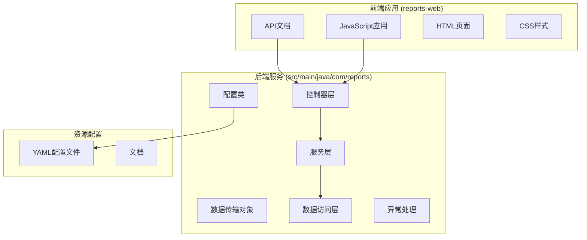
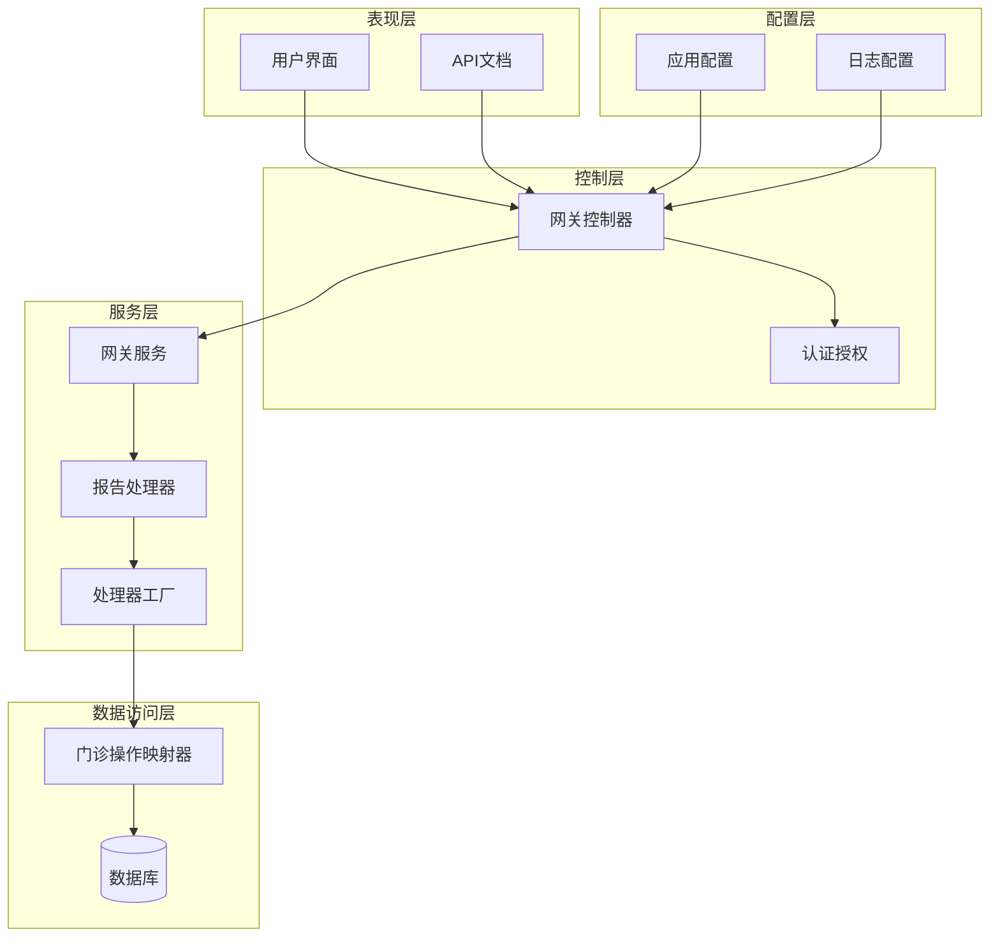
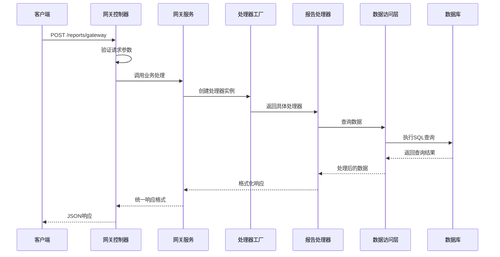
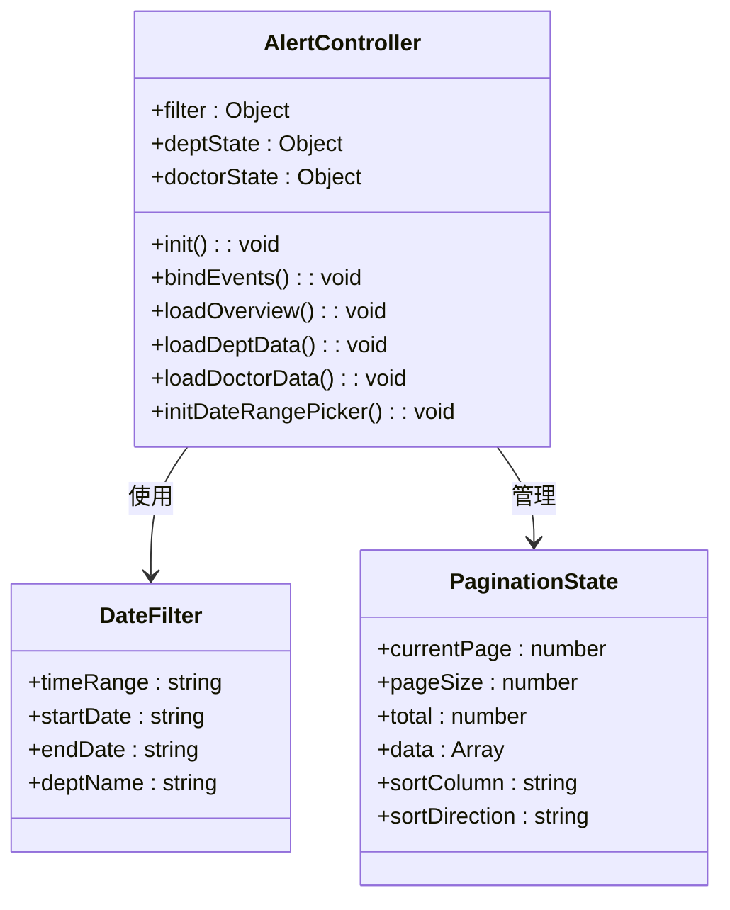
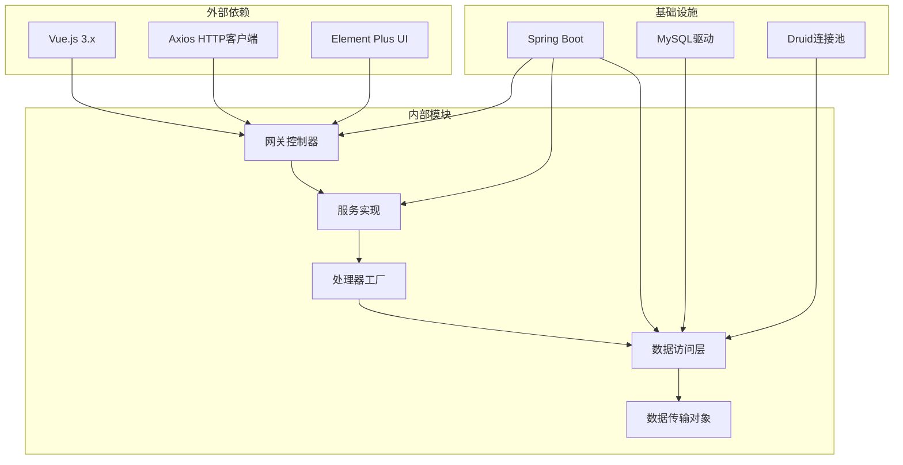
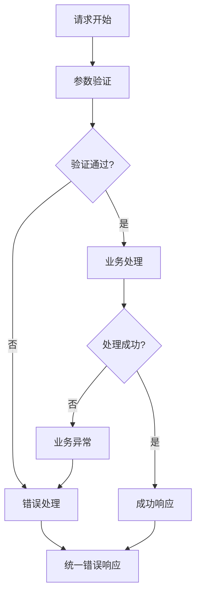

# 门诊预警分析API

<cite>
**本文档引用的文件**
- [outpatient-alert.md](file://reports-web/api/outpatient-alert.md)
- [alert-app.js](file://reports-web/outpatient/js/alert-app.js)
- [mock.js](file://reports-web/outpatient/js/mock.js)
- [GatewayController.java](file://src/main/java/com/reports/controller/GatewayController.java)
- [GatewayService.java](file://src/main/java/com/reports/service/GatewayService.java)
- [GatewayServiceImpl.java](file://src/main/java/com/reports/service/impl/GatewayServiceImpl.java)
- [ReportHandler.java](file://src/main/java/com/reports/service/handler/ReportHandler.java)
- [ReportHandlerFactory.java](file://src/main/java/com/reports/service/handler/ReportHandlerFactory.java)
- [OutpatientOperationService.java](file://src/main/java/com/reports/service/OutpatientOperationService.java)
- [OutpatientOperationServiceImpl.java](file://src/main/java/com/reports/service/impl/OutpatientOperationServiceImpl.java)
- [OutpatientOperationMapper.java](file://src/main/java/com/reports/mapper/OutpatientOperationMapper.java)
- [OutpatientOperationRequest.java](file://src/main/java/com/reports/dto/request/OutpatientOperationRequest.java)
- [OutpatientOperationResponse.java](file://src/main/java/com/reports/dto/response/OutpatientOperationResponse.java)
- [ApiResponse.java](file://src/main/java/com/reports/dto/common/ApiResponse.java)
- [Result.java](file://src/main/java/com/reports/dto/common/Result.java)
- [PageResult.java](file://src/main/java/com/reports/dto/common/PageResult.java)
- [GlobalExceptionHandler.java](file://src/main/java/com/reports/exception/GlobalExceptionHandler.java)
- [BusinessException.java](file://src/main/java/com/reports/exception/BusinessException.java)
- [application.yml](file://src/main/resources/application.yml)
- [application-dev.yml](file://src/main/resources/application-dev.yml)
</cite>

## 目录
1. [简介](#简介)
2. [项目结构](#项目结构)
3. [核心组件](#核心组件)
4. [架构概览](#架构概览)
5. [详细组件分析](#详细组件分析)
6. [依赖关系分析](#依赖关系分析)
7. [性能考虑](#性能考虑)
8. [故障排除指南](#故障排除指南)
9. [结论](#结论)

## 简介

门诊预警分析API是一个基于阈值设定的智能预警系统，旨在为医疗机构提供实时的门诊运营监控和预警服务。该系统通过分析门诊就诊数据，识别潜在的风险点和异常情况，包括超时未就诊预警、异常排队预警、资源紧张预警等智能预警功能。

系统采用前后端分离的架构设计，前端使用Vue.js框架构建交互界面，后端基于Spring Boot提供RESTful API服务。通过统一的网关接口，实现了对多个门诊相关报表功能的集中管理和服务化。

## 项目结构

该项目采用标准的Maven多模块项目结构，主要包含以下核心目录：

**图表来源**
- [application.yml](file://src/main/resources/application.yml)
- [application-dev.yml](file://src/main/resources/application-dev.yml)

**章节来源**
- [outpatient-alert.md](file://reports-web/api/outpatient-alert.md)
- [alert-app.js](file://reports-web/outpatient/js/alert-app.js)

## 核心组件

### 网关控制器 (GatewayController)

网关控制器是整个系统的入口点，负责接收所有外部请求并进行统一处理。它实现了基于方法名映射的服务调用机制，支持动态路由到不同的业务处理器。

### 预警处理器工厂 (ReportHandlerFactory)

处理器工厂模式的设计使得系统能够根据请求的方法名动态创建相应的处理器实例。这种设计模式提供了良好的扩展性，便于添加新的预警类型和分析算法。

### 数据传输对象 (DTO)

系统定义了完整的数据传输对象体系，包括通用的请求响应封装、分页参数、业务结果封装等，确保了前后端数据交换的一致性和安全性。

**章节来源**
- [GatewayController.java](file://src/main/java/com/reports/controller/GatewayController.java)
- [ReportHandlerFactory.java](file://src/main/java/com/reports/service/handler/ReportHandlerFactory.java)
- [ApiResponse.java](file://src/main/java/com/reports/dto/common/ApiResponse.java)

## 架构概览

系统采用分层架构设计，实现了清晰的关注点分离：

**图表来源**
- [GatewayController.java](file://src/main/java/com/reports/controller/GatewayController.java)
- [GatewayService.java](file://src/main/java/com/reports/service/GatewayService.java)
- [ReportHandlerFactory.java](file://src/main/java/com/reports/service/handler/ReportHandlerFactory.java)

### 数据流处理流程

系统的核心数据流遵循以下处理模式：

**图表来源**
- [GatewayController.java](file://src/main/java/com/reports/controller/GatewayController.java)
- [GatewayServiceImpl.java](file://src/main/java/com/reports/service/impl/GatewayServiceImpl.java)
- [ReportHandlerFactory.java](file://src/main/java/com/reports/service/handler/ReportHandlerFactory.java)

## 详细组件分析

### 预警统计接口实现

#### 接口规范

门诊预警统计接口提供了完整的预警数据分析功能，支持按科室和医生维度的数据统计：

**请求参数说明**

| 参数名 | 类型 | 必填 | 说明 |
|--------|------|------|------|
| timeRange | string | 是 | 统计时间范围，如 today、week、month |
| startDate | string | 是 | 开始日期，格式 yyyy-MM-dd |
| endDate | string | 是 | 结束日期，格式 yyyy-MM-dd |
| deptName | string | 否 | 科室名称过滤条件 |
| page | number | 否 | 当前页码，默认1 |
| pageSize | number | 否 | 每页条数，默认10 |

**响应数据结构**

系统返回三个层次的数据：

1. **概览数据 (overview)**：总览所有预警指标
2. **科室数据 (deptTable)**：按科室统计的预警信息
3. **医生数据 (doctorTable)**：按医生统计的预警信息

#### 前端应用逻辑

前端使用Vue.js框架构建交互界面，实现了完整的数据展示和交互功能：

**图表来源**
- [alert-app.js](file://reports-web/outpatient/js/alert-app.js)

**章节来源**
- [outpatient-alert.md](file://reports-web/api/outpatient-alert.md)
- [alert-app.js](file://reports-web/outpatient/js/alert-app.js)

### 预警规则配置机制

系统支持灵活的预警规则配置，主要包括以下方面：

#### 阈值设定

- **超时未就诊预警**：基于患者预约时间和实际就诊时间的差值设定阈值
- **异常排队预警**：通过分析排队人数与正常水平的偏离度识别异常
- **资源紧张预警**：监控医疗资源使用率，当超过预设阈值时触发

#### 触发条件设置

预警触发条件采用可配置的方式，支持：
- 时间范围过滤
- 科室层级筛选
- 医生个人指标
- 动态阈值调整

#### 预警级别划分

系统采用多级预警机制：
- **一级预警**：严重异常，需要立即处理
- **二级预警**：中等风险，需要关注
- **三级预警**：轻微异常，需要观察

**章节来源**
- [mock.js](file://reports-web/outpatient/js/mock.js)

### 数据分析方法

#### 统计指标计算

系统提供多种统计指标用于预警分析：

1. **剩余预警数量**：当前未处理的预警总数
2. **预约预警数量**：因预约问题产生的预警
3. **早退预警数量**：患者提前离开产生的预警

#### 数据聚合策略

- **时间维度聚合**：按天、周、月等时间粒度进行数据汇总
- **科室维度聚合**：按不同科室进行业务量统计
- **医生维度聚合**：按医生个人工作量分析

**章节来源**
- [outpatient-alert.md](file://reports-web/api/outpatient-alert.md)

## 依赖关系分析

系统采用模块化的依赖管理，各组件之间的耦合度较低：

**图表来源**
- [application.yml](file://src/main/resources/application.yml)
- [application-dev.yml](file://src/main/resources/application-dev.yml)

### 错误处理机制

系统实现了完善的错误处理和异常管理：

**图表来源**
- [GlobalExceptionHandler.java](file://src/main/java/com/reports/exception/GlobalExceptionHandler.java)
- [BusinessException.java](file://src/main/java/com/reports/exception/BusinessException.java)

**章节来源**
- [GlobalExceptionHandler.java](file://src/main/java/com/reports/exception/GlobalExceptionHandler.java)
- [BusinessException.java](file://src/main/java/com/reports/exception/BusinessException.java)

## 性能考虑

### 缓存策略

系统采用多层次缓存机制：
- **Redis缓存**：存储热点数据和频繁访问的统计结果
- **本地缓存**：Spring Cache注解实现的本地缓存
- **数据库查询优化**：合理的索引设计和查询优化

### 并发处理

- **线程安全**：使用ThreadLocal确保每个请求的独立性
- **连接池管理**：配置合理的数据库连接池大小
- **异步处理**：对于耗时操作采用异步处理方式

### 监控指标

系统集成了全面的监控指标：
- **响应时间**：接口平均响应时间和P95延迟
- **吞吐量**：每秒请求数和并发用户数
- **错误率**：业务错误和系统错误的统计
- **资源使用**：CPU、内存、数据库连接使用情况

## 故障排除指南

### 常见问题诊断

#### 接口调用失败

**症状**：API返回错误状态码或异常信息

**排查步骤**：
1. 检查请求参数格式是否正确
2. 验证时间范围参数的有效性
3. 确认科室名称参数的准确性
4. 查看服务器日志获取详细错误信息

#### 数据查询异常

**症状**：查询结果为空或不完整

**排查步骤**：
1. 验证数据库连接配置
2. 检查SQL查询语句的正确性
3. 确认数据权限配置
4. 查看数据同步状态

#### 前端显示问题

**症状**：页面无法正常加载或数据显示异常

**排查步骤**：
1. 检查网络连接和跨域配置
2. 验证API接口的可用性
3. 查看浏览器控制台错误信息
4. 确认静态资源的正确加载

### 性能优化建议

#### 数据库优化

- **索引优化**：为常用查询字段建立合适的索引
- **查询优化**：避免N+1查询和不必要的JOIN操作
- **分页优化**：大数据量场景下使用游标分页

#### 缓存优化

- **缓存策略**：合理设置缓存过期时间和更新策略
- **缓存穿透防护**：对空结果也进行缓存
- **缓存雪崩预防**：添加随机过期时间

#### 前端优化

- **懒加载**：大表格数据采用虚拟滚动
- **请求合并**：合并多次相似的API请求
- **图片优化**：使用适当的图片格式和尺寸

**章节来源**
- [GlobalExceptionHandler.java](file://src/main/java/com/reports/exception/GlobalExceptionHandler.java)

## 结论

门诊预警分析API系统通过模块化的设计和灵活的架构，为医疗机构提供了全面的门诊运营监控解决方案。系统的主要优势包括：

1. **功能完整性**：涵盖了超时未就诊、异常排队、资源紧张等多种预警类型
2. **扩展性强**：基于工厂模式的设计便于添加新的预警规则和分析算法
3. **性能优异**：采用多层缓存和优化的数据库查询策略
4. **易于维护**：清晰的分层架构和完善的错误处理机制

该系统为医院管理者提供了及时、准确的预警信息，有助于提高门诊服务质量，优化资源配置，降低运营风险。通过持续的功能完善和性能优化，该系统将成为医院信息化建设的重要组成部分。