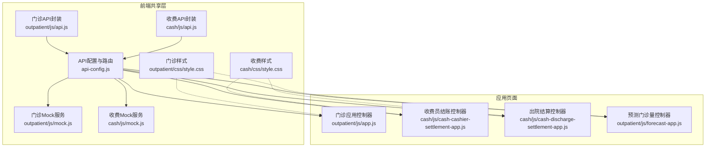
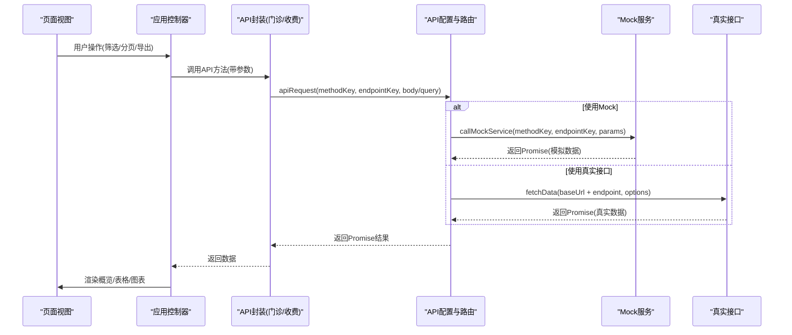
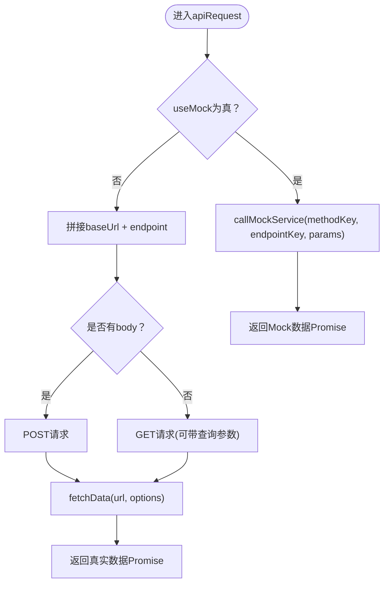
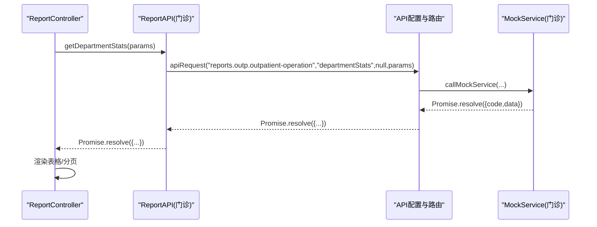
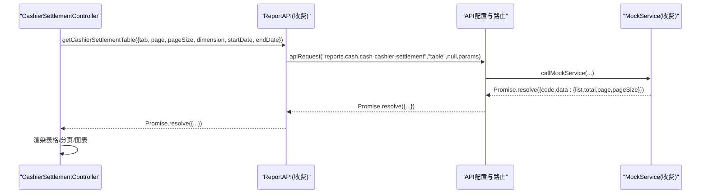
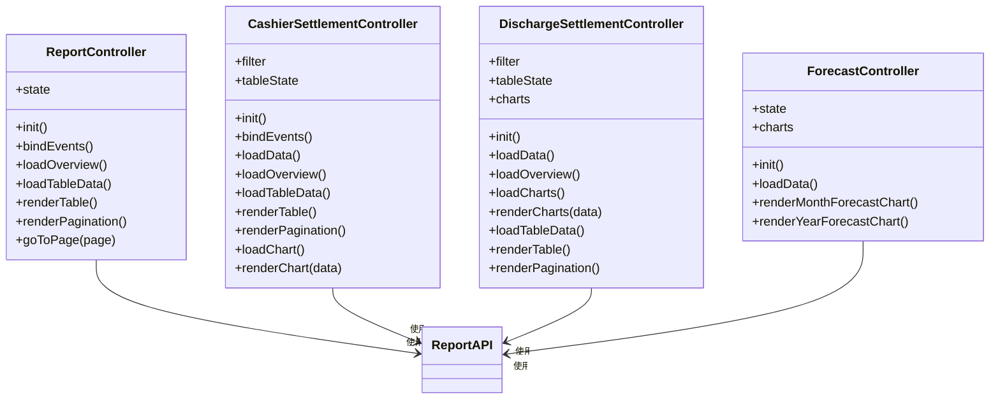
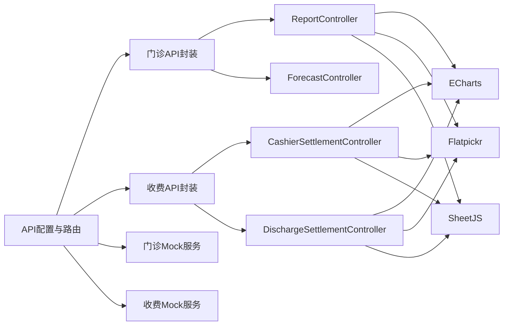

# 共享组件与工具

<cite>
**本文引用的文件**
- [api-config.js](file://reports-web/api-config.js)
- [cash\js\api.js](file://reports-web/cash/js/api.js)
- [outpatient\js\api.js](file://reports-web/outpatient/js/api.js)
- [cash\js\mock.js](file://reports-web/cash/js/mock.js)
- [outpatient\js\mock.js](file://reports-web/outpatient/js/mock.js)
- [cash\css\style.css](file://reports-web/cash/css/style.css)
- [outpatient\css\style.css](file://reports-web/outpatient/css/style.css)
- [cash\js\cash-cashier-settlement-app.js](file://reports-web/cash/js/cash-cashier-settlement-app.js)
- [outpatient\js\app.js](file://reports-web/outpatient/js/app.js)
- [cash\js\cash-discharge-settlement-app.js](file://reports-web/cash/js/cash-discharge-settlement-app.js)
- [outpatient\js\forecast-app.js](file://reports-web/outpatient/js/forecast-app.js)
- [cash-cashier-settlement.md](file://reports-web/api/cash-cashier-settlement.md)
- [outpatient-operation.md](file://reports-web/api/outpatient-operation.md)
</cite>

## 目录
1. [简介](#简介)
2. [项目结构](#项目结构)
3. [核心组件](#核心组件)
4. [架构总览](#架构总览)
5. [详细组件分析](#详细组件分析)
6. [依赖关系分析](#依赖关系分析)
7. [性能考虑](#性能考虑)
8. [故障排查指南](#故障排查指南)
9. [结论](#结论)
10. [附录](#附录)

## 简介
本文件面向共享组件与工具，聚焦门诊与收费两大模块共用的API封装、Mock数据模拟与样式体系，提供统一的接口调用规范、Mock数据结构与生成规则、样式主题与响应式设计原则，并给出组件复用最佳实践、性能优化建议与维护指南。文档同时包含实际使用示例与集成方法，帮助开发者快速上手与稳定维护。

## 项目结构
- 统一API配置与路由中心：集中管理接口地址、方法映射、Mock开关与请求封装。
- 模块化API层：门诊与收费分别提供独立的API封装对象，统一通过路由中心转发。
- Mock服务：按模块提供完整的模拟数据生成与分页逻辑，便于联调与测试。
- 样式体系：基于CSS变量的主题系统，覆盖门诊与收费页面的通用布局、表格、图表容器等。
- 应用控制器：每个报表页面对应独立控制器，负责状态管理、事件绑定、数据加载与渲染。

**图表来源**
- [api-config.js:1-315](file://reports-web/api-config.js#L1-L315)
- [cash\js\api.js:1-135](file://reports-web/cash/js/api.js#L1-L135)
- [outpatient\js\api.js:1-159](file://reports-web/outpatient/js/api.js#L1-L159)
- [cash\js\mock.js:1-589](file://reports-web/cash/js/mock.js#L1-L589)
- [outpatient\js\mock.js:1-800](file://reports-web/outpatient/js/mock.js#L1-L800)
- [cash\css\style.css:1-839](file://reports-web/cash/css/style.css#L1-L839)
- [outpatient\css\style.css:1-734](file://reports-web/outpatient/css/style.css#L1-L734)
- [cash\js\cash-cashier-settlement-app.js:1-519](file://reports-web/cash/js/cash-cashier-settlement-app.js#L1-L519)
- [outpatient\js\app.js:1-632](file://reports-web/outpatient/js/app.js#L1-L632)
- [cash\js\cash-discharge-settlement-app.js:1-385](file://reports-web/cash/js/cash-discharge-settlement-app.js#L1-L385)
- [outpatient\js\forecast-app.js:1-158](file://reports-web/outpatient/js/forecast-app.js#L1-L158)

**章节来源**
- [api-config.js:1-315](file://reports-web/api-config.js#L1-L315)
- [cash\js\api.js:1-135](file://reports-web/cash/js/api.js#L1-L135)
- [outpatient\js\api.js:1-159](file://reports-web/outpatient/js/api.js#L1-L159)

## 核心组件
- 统一API配置与路由中心
  - 提供全局Mock开关、真实接口基础地址与方法映射。
  - 统一封装请求流程，自动根据useMock决定走Mock或真实接口。
  - 提供Mock路由表，将methodKey与endpointKey映射到具体MockService方法。
- 门诊API封装
  - 提供概览、科室统计、导出等接口方法，统一调用apiRequest。
- 收费API封装
  - 提供出院结算、收费员结账、住院预交金等接口方法，统一调用apiRequest。
- Mock服务
  - 门诊Mock：概览、表格、收入、窗口、检验、医技、爽约、预警、诊室、专科治疗、治疗、预测、服务、质量控制、互联网医院等。
  - 收费Mock：出院结算、收费员结账、住院预交金等，含分页与图表数据生成。
- 样式体系
  - 基于CSS变量的主题系统，统一颜色、字体、间距与组件风格。
  - 面向不同报表页面的专用样式（如收入统计、患者画像、窗口统计、检验统计、图表容器等）。

**章节来源**
- [api-config.js:118-153](file://reports-web/api-config.js#L118-L153)
- [api-config.js:182-290](file://reports-web/api-config.js#L182-L290)
- [cash\js\api.js:6-135](file://reports-web/cash/js/api.js#L6-L135)
- [outpatient\js\api.js:6-159](file://reports-web/outpatient/js/api.js#L6-L159)
- [cash\js\mock.js:5-589](file://reports-web/cash/js/mock.js#L5-L589)
- [outpatient\js\mock.js:5-800](file://reports-web/outpatient/js/mock.js#L5-L800)
- [cash\css\style.css:6-839](file://reports-web/cash/css/style.css#L6-L839)
- [outpatient\css\style.css:6-734](file://reports-web/outpatient/css/style.css#L6-L734)

## 架构总览
统一API配置与路由中心作为核心枢纽，门诊与收费模块通过各自的API封装调用；Mock服务与真实接口通过统一开关切换。应用控制器负责页面状态与交互，依赖API封装进行数据加载与渲染。

**图表来源**
- [api-config.js:118-153](file://reports-web/api-config.js#L118-L153)
- [api-config.js:182-290](file://reports-web/api-config.js#L182-L290)
- [cash\js\api.js:6-135](file://reports-web/cash/js/api.js#L6-L135)
- [outpatient\js\api.js:6-159](file://reports-web/outpatient/js/api.js#L6-L159)

## 详细组件分析

### 统一API配置与路由中心
- 功能要点
  - 全局Mock开关：useMock=true时走MockService，false时走真实接口。
  - 方法映射：以methodKey为索引，映射到具体endpoint路径。
  - 请求封装：apiRequest根据是否Mock选择调用callMockService或fetchData。
  - Mock路由：callMockService将methodKey与endpointKey路由到对应MockService方法。
  - 模式持久化：setMockMode与initMockMode支持localStorage保存与恢复。
- 使用建议
  - 在开发阶段启用Mock，提高联调效率。
  - 生产环境确保useMock=false，避免误用Mock数据。
  - 新增接口时同步更新API_CONFIG.methods与Mock路由表。

**图表来源**
- [api-config.js:118-153](file://reports-web/api-config.js#L118-L153)
- [api-config.js:158-177](file://reports-web/api-config.js#L158-L177)
- [api-config.js:182-290](file://reports-web/api-config.js#L182-L290)

**章节来源**
- [api-config.js:6-107](file://reports-web/api-config.js#L6-L107)
- [api-config.js:118-153](file://reports-web/api-config.js#L118-L153)
- [api-config.js:182-290](file://reports-web/api-config.js#L182-L290)
- [api-config.js:296-315](file://reports-web/api-config.js#L296-L315)

### 门诊API封装
- 功能要点
  - 提供概览、科室统计、导出等方法，内部统一调用apiRequest。
  - 支持按时间范围、科室名称、分页参数等动态传参。
- 参数规范
  - getOverview：无参数。
  - getDepartmentStats：params={page, pageSize, deptName, startDate, endDate}。
  - exportExcel：params为导出所需参数。
- 返回值格式
  - 统一返回Promise，解析后包含code与data字段，data结构由Mock或真实接口决定。

**图表来源**
- [outpatient\js\api.js:11-28](file://reports-web/outpatient/js/api.js#L11-L28)
- [api-config.js:118-153](file://reports-web/api-config.js#L118-L153)
- [api-config.js:182-290](file://reports-web/api-config.js#L182-L290)

**章节来源**
- [outpatient\js\api.js:6-159](file://reports-web/outpatient/js/api.js#L6-L159)

### 收费API封装
- 功能要点
  - 出院结算：概览、图表、表格、导出。
  - 收费员结账：概览、表格、图表、导出。
  - 住院预交金：概览、汇总/进项/退项表格、趋势/渠道/支付方式图表、导出。
- 参数规范
  - 通用：params={page, pageSize, dimension, startDate, endDate}。
  - 收费员结账：额外支持tab={cashier, source, workload}。
  - 住院预交金：图表支持type参数，如income_count/amount、refund_count/amount等。
- 返回值格式
  - 统一Promise，包含code与data，data结构由Mock或真实接口决定。

**图表来源**
- [cash\js\api.js:43-68](file://reports-web/cash/js/api.js#L43-L68)
- [api-config.js:118-153](file://reports-web/api-config.js#L118-L153)
- [api-config.js:259-265](file://reports-web/api-config.js#L259-L265)

**章节来源**
- [cash\js\api.js:6-135](file://reports-web/cash/js/api.js#L6-L135)

### Mock数据服务（门诊）
- 数据结构与生成规则
  - 概览：包含总门诊量、预约率、接诊效率等指标，随机生成明细与单元数据。
  - 表格：支持按科室筛选、分页；随机生成各指标数据。
  - 收入：支持按科室/医生维度，生成收入与服务收入。
  - 窗口统计：包含来源、年龄、时间分布与工作量表格。
  - 检验/医技/爽约/预警/诊室/专科治疗/治疗/预测/服务/质量控制/互联网医院等均有完整Mock数据生成。
- 调试方法
  - 通过API配置中心的Mock开关切换，快速验证UI与交互。
  - 使用浏览器开发者工具查看网络请求与返回数据，定位问题。
  - 修改Mock数据生成逻辑，模拟边界场景（空数据、异常数据、大数据量）。

**章节来源**
- [outpatient\js\mock.js:10-125](file://reports-web/outpatient/js/mock.js#L10-L125)
- [outpatient\js\mock.js:127-240](file://reports-web/outpatient/js/mock.js#L127-L240)
- [outpatient\js\mock.js:242-495](file://reports-web/outpatient/js/mock.js#L242-L495)
- [outpatient\js\mock.js:497-762](file://reports-web/outpatient/js/mock.js#L497-L762)
- [outpatient\js\mock.js:764-800](file://reports-web/outpatient/js/mock.js#L764-L800)

### Mock数据服务（收费）
- 数据结构与生成规则
  - 出院结算：概览、图表（渠道/类型分析）、表格（按日/月维度），支持分页与同比数据。
  - 收费员结账：概览、表格（按收费员/来源/工作量）、图表（工作量分析）。
  - 住院预交金：概览、汇总/进项/退项表格、趋势/渠道/支付方式图表。
- 调试方法
  - 通过Mock开关切换，验证不同tab/workload图表显示。
  - 调整dimension参数，观察日/月维度数据差异。
  - 使用导出功能验证数据完整性与格式。

**章节来源**
- [cash\js\mock.js:5-122](file://reports-web/cash/js/mock.js#L5-L122)
- [cash\js\mock.js:124-294](file://reports-web/cash/js/mock.js#L124-L294)
- [cash\js\mock.js:296-589](file://reports-web/cash/js/mock.js#L296-L589)

### 样式规范与主题定制
- 主题系统
  - 使用CSS变量定义主色、辅助色、文本色、边框色等，便于统一主题切换。
  - 页面级样式覆盖：针对不同报表页面提供专用样式类（如收入统计、患者画像、窗口统计、检验统计、图表容器等）。
- 响应式设计
  - 使用Bootstrap栅格系统配合自定义样式，适配不同屏幕尺寸。
  - 图表容器采用最小高度与百分比宽度，保证在不同分辨率下良好显示。
- 最佳实践
  - 优先使用语义化类名，避免内联样式污染。
  - 通过CSS变量统一修改主题色，减少重复修改成本。
  - 为表格、分页、筛选区等通用组件提供一致的视觉与交互体验。

**章节来源**
- [cash\css\style.css:6-839](file://reports-web/cash/css/style.css#L6-L839)
- [outpatient\css\style.css:6-734](file://reports-web/outpatient/css/style.css#L6-L734)

### 组件复用与集成示例
- 通用控制器模式
  - 报表页面均采用“控制器 + API封装 + Mock/真实接口”的模式，便于复用。
  - 控制器职责清晰：状态管理、事件绑定、数据加载、渲染与导出。
- 集成步骤
  - 引入API配置与路由中心、对应模块的API封装与Mock服务。
  - 在页面初始化时创建控制器实例，绑定事件并加载数据。
  - 根据需要切换Mock模式，验证UI与交互。
- 示例参考
  - 门诊量统计：ReportController负责概览与表格渲染，支持排序、分页与导出。
  - 收费员结账：CashierSettlementController负责多tab切换、图表与表格联动。
  - 出院结算：DischargeSettlementController负责概览、饼图与表格。
  - 预测门诊量：ForecastController负责月度/年度预测图表。

**图表来源**
- [outpatient\js\app.js:5-489](file://reports-web/outpatient/js/app.js#L5-L489)
- [cash\js\cash-cashier-settlement-app.js:4-447](file://reports-web/cash/js/cash-cashier-settlement-app.js#L4-L447)
- [cash\js\cash-discharge-settlement-app.js:4-315](file://reports-web/cash/js/cash-discharge-settlement-app.js#L4-L315)
- [outpatient\js\forecast-app.js:4-155](file://reports-web/outpatient/js/forecast-app.js#L4-L155)

**章节来源**
- [outpatient\js\app.js:1-632](file://reports-web/outpatient/js/app.js#L1-L632)
- [cash\js\cash-cashier-settlement-app.js:1-519](file://reports-web/cash/js/cash-cashier-settlement-app.js#L1-L519)
- [cash\js\cash-discharge-settlement-app.js:1-385](file://reports-web/cash/js/cash-discharge-settlement-app.js#L1-L385)
- [outpatient\js\forecast-app.js:1-158](file://reports-web/outpatient/js/forecast-app.js#L1-L158)

## 依赖关系分析
- 模块耦合
  - API封装仅依赖API配置与路由中心，低耦合高内聚。
  - Mock服务与真实接口通过统一路由解耦，便于切换。
- 外部依赖
  - ECharts用于图表渲染。
  - Flatpickr用于日期选择器。
  - SheetJS用于Excel导出。
- 潜在风险
  - 若API配置缺失或方法映射错误，将导致请求失败。
  - Mock数据与真实接口字段不一致可能引发渲染异常。

**图表来源**
- [api-config.js:118-153](file://reports-web/api-config.js#L118-L153)
- [cash\js\api.js:6-135](file://reports-web/cash/js/api.js#L6-L135)
- [outpatient\js\api.js:6-159](file://reports-web/outpatient/js/api.js#L6-L159)
- [cash\js\cash-cashier-settlement-app.js:30-447](file://reports-web/cash/js/cash-cashier-settlement-app.js#L30-L447)
- [cash\js\cash-discharge-settlement-app.js:29-205](file://reports-web/cash/js/cash-discharge-settlement-app.js#L29-L205)
- [outpatient\js\app.js:38-489](file://reports-web/outpatient/js/app.js#L38-L489)
- [outpatient\js\forecast-app.js:22-155](file://reports-web/outpatient/js/forecast-app.js#L22-L155)

**章节来源**
- [api-config.js:118-153](file://reports-web/api-config.js#L118-L153)
- [cash\js\cash-cashier-settlement-app.js:30-447](file://reports-web/cash/js/cash-cashier-settlement-app.js#L30-L447)
- [cash\js\cash-discharge-settlement-app.js:29-205](file://reports-web/cash/js/cash-discharge-settlement-app.js#L29-L205)
- [outpatient\js\app.js:38-489](file://reports-web/outpatient/js/app.js#L38-L489)
- [outpatient\js\forecast-app.js:22-155](file://reports-web/outpatient/js/forecast-app.js#L22-L155)

## 性能考虑
- 数据分页与懒加载
  - 合理设置pageSize，避免一次性加载过多数据。
  - 使用虚拟滚动或无限滚动（如适用）提升大数据量表格性能。
- 图表渲染优化
  - 控制图表数量与复杂度，避免频繁重绘。
  - 使用window.resize节流，减少resize事件触发频率。
- 请求合并与并发
  - 合理使用Promise.all并发加载多个接口，缩短首屏时间。
  - 对高频请求增加缓存策略（如时间段内缓存）。
- 样式与资源
  - 合并与压缩CSS/JS，减少请求数量。
  - 按需引入第三方库，避免冗余依赖。

## 故障排查指南
- Mock与真实接口切换
  - 确认API配置中心useMock开关状态，检查localStorage保存值。
  - 如切换后无效，检查initMockMode执行时机。
- 请求失败
  - 检查API配置methods中methodKey与endpointKey是否存在。
  - 确认真实接口baseUrl与网关地址一致。
- 数据渲染异常
  - 对照Mock数据结构与真实接口返回字段，确保渲染逻辑兼容。
  - 检查分页参数与排序逻辑，避免越界访问。
- 导出功能
  - 确认数据为空时的提示逻辑。
  - 检查表头与数据行列对齐，确保样式正确。

**章节来源**
- [api-config.js:296-315](file://reports-web/api-config.js#L296-L315)
- [api-config.js:118-153](file://reports-web/api-config.js#L118-L153)
- [outpatient\js\app.js:495-621](file://reports-web/outpatient/js/app.js#L495-L621)
- [cash\js\cash-cashier-settlement-app.js:453-516](file://reports-web/cash/js/cash-cashier-settlement-app.js#L453-L516)
- [cash\js\cash-discharge-settlement-app.js:321-382](file://reports-web/cash/js/cash-discharge-settlement-app.js#L321-L382)

## 结论
通过统一的API配置与路由中心、模块化的API封装、完善的Mock数据与样式体系，门诊与收费两大模块实现了高内聚、低耦合的共享组件与工具。遵循本文提供的使用方法、参数规范、Mock规则与最佳实践，可显著提升开发效率与系统稳定性。

## 附录
- 实际使用示例
  - 门诊量统计：调用ReportAPI.getDepartmentStats(params)，在ReportController中渲染表格与分页。
  - 收费员结账：调用ReportAPI.getCashierSettlementTable(params)，在CashierSettlementController中渲染多tab表格与图表。
  - 出院结算：调用ReportAPI.getDischargeSettlementTable(params)，在DischargeSettlementController中渲染概览与表格。
  - 预测门诊量：调用ReportAPI.getForecastStats(params)，在ForecastController中渲染月度/年度预测图表。
- 集成方法
  - 引入api-config.js、对应模块API封装与Mock服务。
  - 在页面初始化时创建控制器实例，绑定事件并调用loadData。
  - 通过setMockMode切换Mock与真实接口，满足开发与测试需求。

**章节来源**
- [outpatient\js\app.js:190-489](file://reports-web/outpatient/js/app.js#L190-L489)
- [cash\js\cash-cashier-settlement-app.js:101-447](file://reports-web/cash/js/cash-cashier-settlement-app.js#L101-L447)
- [cash\js\cash-discharge-settlement-app.js:87-205](file://reports-web/cash/js/cash-discharge-settlement-app.js#L87-L205)
- [outpatient\js\forecast-app.js:38-155](file://reports-web/outpatient/js/forecast-app.js#L38-L155)