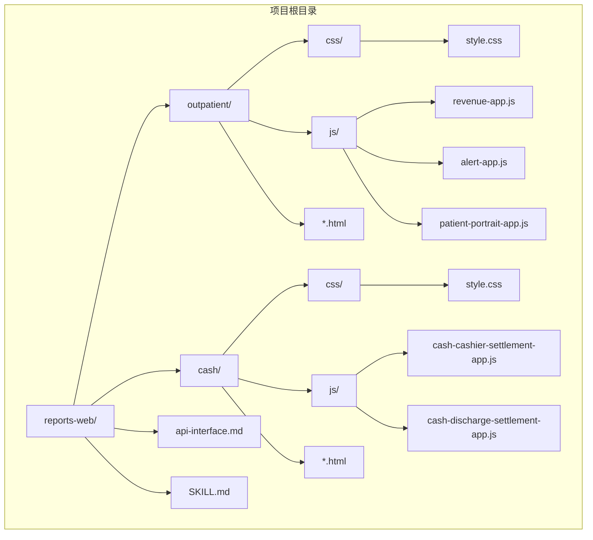
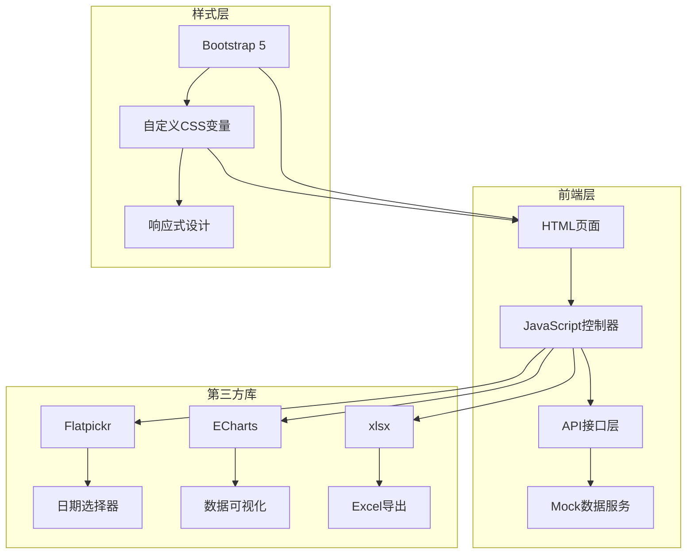
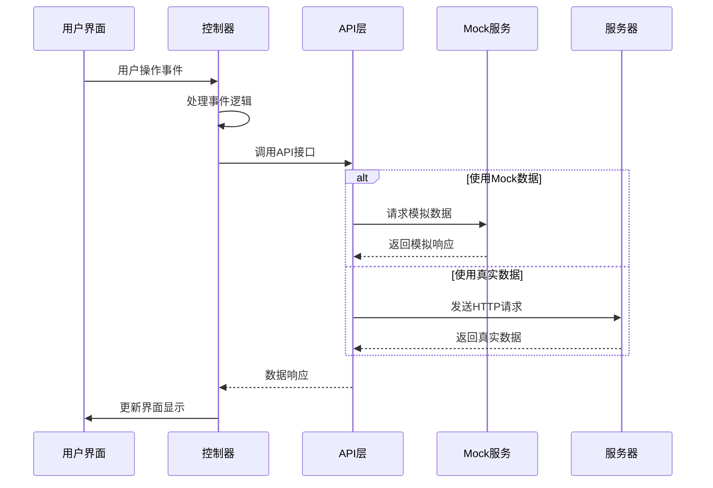
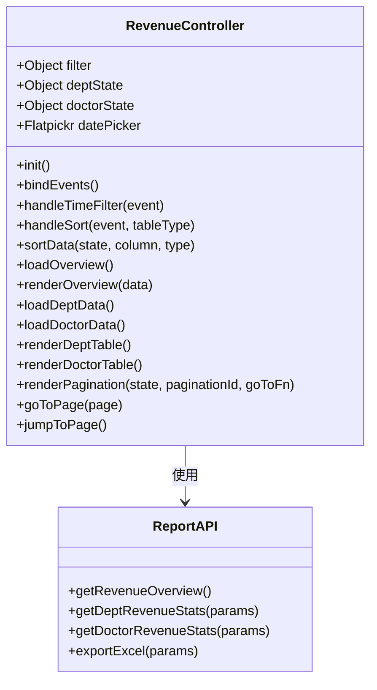
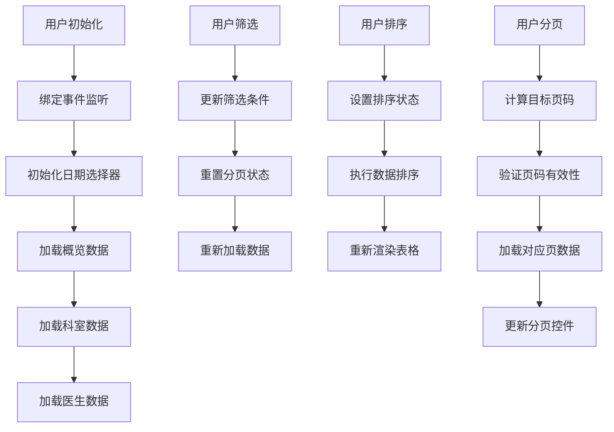
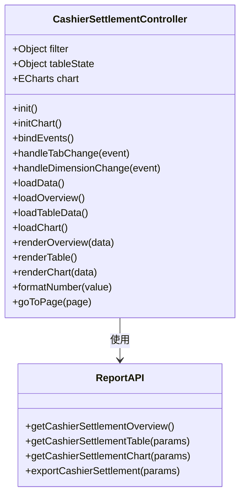
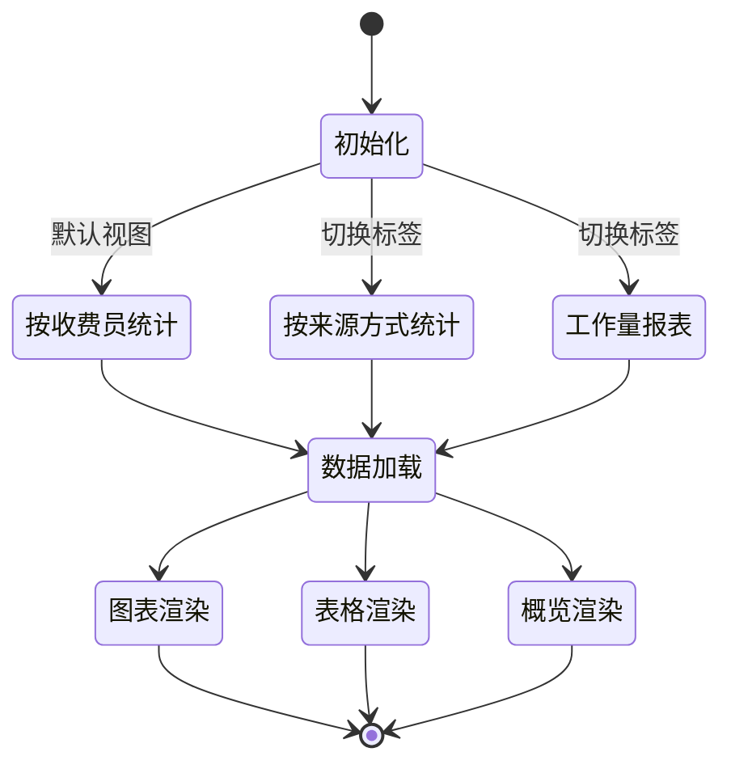
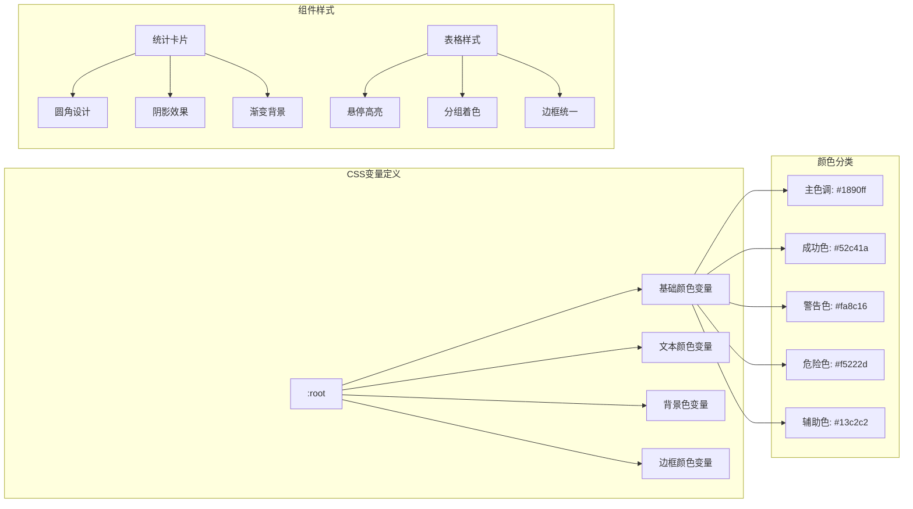
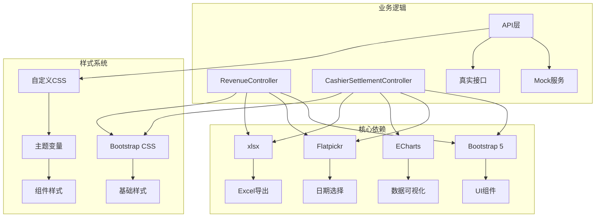

# 前端界面文档

<cite>
**本文档引用的文件**
- [outpatient-revenue.html](file://reports-web/outpatient/outpatient-revenue.html)
- [cash-cashier-settlement.html](file://reports-web/cash/cash-cashier-settlement.html)
- [revenue-app.js](file://reports-web/outpatient/js/revenue-app.js)
- [cash-cashier-settlement-app.js](file://reports-web/cash/js/cash-cashier-settlement-app.js)
- [style.css](file://reports-web/outpatient/css/style.css)
- [style.css](file://reports-web/cash/css/style.css)
- [api.js](file://reports-web/outpatient/js/api.js)
- [api.js](file://reports-web/cash/js/api.js)
- [mock.js](file://reports-web/outpatient/js/mock.js)
- [mock.js](file://reports-web/cash/js/mock.js)
- [outpatient-alert.html](file://reports-web/outpatient/outpatient-alert.html)
- [outpatient-patient-portrait.html](file://reports-web/outpatient/outpatient-patient-portrait.html)
- [cash-discharge-settlement.html](file://reports-web/cash/cash-discharge-settlement.html)
</cite>

## 目录
1. [简介](#简介)
2. [项目结构](#项目结构)
3. [核心组件](#核心组件)
4. [架构概览](#架构概览)
5. [详细组件分析](#详细组件分析)
6. [依赖关系分析](#依赖关系分析)
7. [性能考虑](#性能考虑)
8. [故障排除指南](#故障排除指南)
9. [结论](#结论)
10. [附录](#附录)

## 简介

本项目是一个基于Web的医疗报表系统，提供了门诊和现金管理两大模块的可视化界面。系统采用现代化的前端技术栈，包括Bootstrap 5、Flatpickr日期选择器、ECharts图表库和xlsx电子表格处理库，为医疗机构提供全面的数据分析和报表功能。

系统主要包含两个核心功能模块：
- **门诊报表模块**：提供门诊收入分析、预警统计、患者画像等多维度数据分析
- **现金管理模块**：提供收费员结账统计、出院结算报表、住院预交金统计等功能

## 项目结构

项目采用清晰的模块化组织结构，每个功能模块都有独立的HTML页面、JavaScript控制器和CSS样式文件。

**图表来源**
- [outpatient-revenue.html:1-164](file://reports-web/outpatient/outpatient-revenue.html#L1-L164)
- [cash-cashier-settlement.html:1-101](file://reports-web/cash/cash-cashier-settlement.html#L1-L101)

**章节来源**
- [outpatient-revenue.html:1-164](file://reports-web/outpatient/outpatient-revenue.html#L1-L164)
- [cash-cashier-settlement.html:1-101](file://reports-web/cash/cash-cashier-settlement.html#L1-L101)

## 核心组件

### 门诊收入分析组件

门诊收入分析组件是系统的核心功能之一，提供全面的门诊收入统计和分析能力。

#### 视觉外观特征
- **布局结构**：采用Bootstrap网格系统，响应式设计支持不同屏幕尺寸
- **颜色方案**：使用蓝色系为主色调(#1890ff)，辅以绿色(#52c41a)、紫色(#722ed1)等专业色彩
- **卡片设计**：统计信息采用圆角卡片布局，具有阴影效果
- **图标系统**：使用Bootstrap Icons提供直观的视觉标识

#### 用户交互模式
- **时间筛选**：支持"今日"、"昨日"、"近一周"、"近一月"快速筛选
- **日期范围选择**：使用Flatpickr提供直观的日期选择体验
- **科室筛选**：下拉选择框支持按科室过滤数据
- **表格排序**：点击表头可按指定列进行升序/降序排序
- **分页导航**：支持每页显示数量自定义和跳转到指定页码

#### 属性配置
- **时间范围**：支持多种时间粒度选择
- **数据分页**：每页显示10/20/50条记录
- **排序规则**：支持数字和文本类型字段排序
- **筛选条件**：支持科室名称精确匹配

**章节来源**
- [revenue-app.js:1-516](file://reports-web/outpatient/js/revenue-app.js#L1-L516)
- [style.css:1-734](file://reports-web/outpatient/css/style.css#L1-L734)

### 收费员结账统计组件

收费员结账统计组件专注于现金管理场景，提供详细的收费员工作量和统计分析。

#### 视觉外观特征
- **标签页设计**：使用Bootstrap Tabs实现"按收费员统计"、"按来源方式统计"、"工作量报表"三种视图切换
- **概览卡片**：采用5列布局展示关键指标，每个指标配有同比变化显示
- **表格布局**：根据不同的统计维度动态生成表格结构
- **图表集成**：使用ECharts创建柱状图展示工作量趋势

#### 用户交互模式
- **统计维度切换**：支持"按天统计"和"按月统计"两种时间维度
- **标签页切换**：通过服务标签快速切换不同的统计视图
- **图表缩放**：响应窗口大小变化自动调整图表尺寸
- **数据导出**：支持将当前视图数据导出为Excel格式

#### 属性配置
- **统计维度**：支持日/月两种时间粒度
- **数据视图**：三种不同的统计分析视图
- **图表配置**：可配置的颜色、字体、边距等样式参数
- **数据格式**：支持整数和小数格式的数值显示

**章节来源**
- [cash-cashier-settlement-app.js:1-519](file://reports-web/cash/js/cash-cashier-settlement-app.js#L1-L519)
- [style.css:1-839](file://reports-web/cash/css/style.css#L1-L839)

## 架构概览

系统采用分层架构设计，确保了良好的可维护性和扩展性。

**图表来源**
- [revenue-app.js:1-516](file://reports-web/outpatient/js/revenue-app.js#L1-L516)
- [cash-cashier-settlement-app.js:1-519](file://reports-web/cash/js/cash-cashier-settlement-app.js#L1-L519)

### 数据流架构

**图表来源**
- [api.js:1-159](file://reports-web/outpatient/js/api.js#L1-L159)
- [mock.js:1-1017](file://reports-web/outpatient/js/mock.js#L1-L1017)

## 详细组件分析

### 门诊收入分析控制器

门诊收入分析控制器实现了完整的数据管理和界面更新逻辑。

#### 类结构设计

**图表来源**
- [revenue-app.js:4-383](file://reports-web/outpatient/js/revenue-app.js#L4-L383)

#### 数据处理流程

**图表来源**
- [revenue-app.js:32-383](file://reports-web/outpatient/js/revenue-app.js#L32-L383)

#### 核心功能特性

1. **智能数据缓存**：控制器维护多个状态对象，避免重复请求相同数据
2. **响应式排序**：支持多字段、多方向的复杂排序逻辑
3. **动态分页**：根据数据总量动态计算分页信息
4. **实时更新**：所有数据变更都会触发界面自动更新

**章节来源**
- [revenue-app.js:1-516](file://reports-web/outpatient/js/revenue-app.js#L1-L516)

### 收费员结账统计控制器

收费员结账统计控制器提供了复杂的多维度数据分析能力。

#### 控制器架构

**图表来源**
- [cash-cashier-settlement-app.js:4-447](file://reports-web/cash/js/cash-cashier-settlement-app.js#L4-L447)

#### 多视图切换机制

**图表来源**
- [cash-cashier-settlement-app.js:83-107](file://reports-web/cash/js/cash-cashier-settlement-app.js#L83-L107)

#### 图表集成特性

1. **自适应布局**：图表容器会根据窗口大小自动调整
2. **交互式工具提示**：支持鼠标悬停查看详细数据
3. **动态数据更新**：支持实时刷新和数据对比
4. **多系列支持**：可以同时展示多个数据系列进行对比分析

**章节来源**
- [cash-cashier-settlement-app.js:1-519](file://reports-web/cash/js/cash-cashier-settlement-app.js#L1-L519)

### 样式系统与主题支持

系统采用CSS变量和Bootstrap 5构建了灵活的主题系统。

#### 主题变量体系

**图表来源**
- [style.css:6-22](file://reports-web/outpatient/css/style.css#L6-L22)
- [style.css:6-22](file://reports-web/cash/css/style.css#L6-L22)

#### 响应式设计策略

系统采用移动优先的设计理念，确保在各种设备上的良好体验：

1. **网格系统**：使用Bootstrap 5的响应式网格系统
2. **断点设计**：针对不同屏幕尺寸优化布局
3. **触摸友好**：按钮和交互元素适合触摸操作
4. **字体适配**：根据屏幕尺寸调整字体大小

**章节来源**
- [style.css:1-734](file://reports-web/outpatient/css/style.css#L1-L734)
- [style.css:1-839](file://reports-web/cash/css/style.css#L1-L839)

## 依赖关系分析

系统依赖关系清晰，第三方库与业务逻辑分离良好。

**图表来源**
- [outpatient-revenue.html:155-161](file://reports-web/outpatient/outpatient-revenue.html#L155-L161)
- [cash-cashier-settlement.html:91-98](file://reports-web/cash/cash-cashier-settlement.html#L91-L98)

### 第三方库集成

#### Bootstrap 5集成
- **栅格系统**：提供响应式布局基础
- **组件库**：按钮、表格、模态框等UI组件
- **JavaScript插件**：提供交互增强功能

#### Flatpickr集成
- **日期范围选择**：支持开始和结束日期选择
- **本地化支持**：内置中文语言包
- **自定义格式**：支持多种日期格式化选项

#### ECharts集成
- **图表类型**：支持柱状图、折线图等多种图表
- **交互功能**：缩放、平移、数据钻取
- **主题定制**：支持自定义颜色和样式

#### xlsx集成
- **数据导出**：支持Excel格式数据导出
- **样式保留**：导出时保留原始样式
- **多工作表**：支持单个文件中包含多个工作表

**章节来源**
- [outpatient-revenue.html:155-161](file://reports-web/outpatient/outpatient-revenue.html#L155-L161)
- [cash-cashier-settlement.html:91-98](file://reports-web/cash/cash-cashier-settlement.html#L91-L98)

## 性能考虑

系统在设计时充分考虑了性能优化，采用了多种策略提升用户体验。

### 加载性能优化

1. **懒加载策略**：非关键资源延迟加载
2. **CDN加速**：第三方库通过CDN提供
3. **缓存策略**：合理利用浏览器缓存机制

### 运行时性能优化

1. **虚拟滚动**：大数据量时采用虚拟滚动减少DOM节点
2. **防抖节流**：输入事件和窗口 resize 事件的防抖处理
3. **内存管理**：及时清理事件监听器和定时器

### 渲染性能优化

1. **批量更新**：将多次DOM更新合并为一次
2. **CSS动画**：使用transform和opacity属性优化动画性能
3. **图表优化**：ECharts图表使用Canvas渲染

## 故障排除指南

### 常见问题及解决方案

#### 数据加载失败
- **症状**：页面空白或显示错误信息
- **原因**：网络连接问题或API接口异常
- **解决**：检查网络连接，确认API服务正常运行

#### 图表显示异常
- **症状**：图表不显示或显示不完整
- **原因**：容器尺寸未正确设置或ECharts初始化失败
- **解决**：确保容器有明确的高度，检查resize事件处理

#### 日期选择器问题
- **症状**：日期选择器无法打开或选择无效
- **原因**：Flatpickr初始化失败或配置错误
- **解决**：检查日期格式配置，确保locale正确加载

#### Excel导出失败
- **症状**：导出按钮点击无响应
- **原因**：xlsx库未正确加载或数据格式不支持
- **解决**：检查数据结构，确保数据类型正确

**章节来源**
- [revenue-app.js:163-172](file://reports-web/outpatient/js/revenue-app.js#L163-L172)
- [cash-cashier-settlement-app.js:382-402](file://reports-web/cash/js/cash-cashier-settlement-app.js#L382-L402)

## 结论

本前端界面系统展现了现代Web应用的最佳实践，通过合理的架构设计、丰富的交互功能和优秀的用户体验，为医疗机构提供了强大的数据分析工具。

### 主要优势

1. **模块化设计**：清晰的功能模块划分，便于维护和扩展
2. **响应式布局**：适配各种设备和屏幕尺寸
3. **丰富的交互**：支持多种用户交互模式和数据操作
4. **数据可视化**：通过图表直观展示复杂数据
5. **性能优化**：采用多种技术手段提升系统性能

### 技术亮点

1. **现代化技术栈**：使用最新的前端技术和最佳实践
2. **可访问性设计**：遵循WCAG标准，支持键盘导航和屏幕阅读器
3. **跨浏览器兼容**：支持主流浏览器的最新版本
4. **国际化支持**：内置多语言支持框架
5. **安全考虑**：实施了必要的安全防护措施

该系统为医疗行业的数据可视化和报表分析提供了完整的解决方案，具有良好的扩展性和维护性。

## 附录

### API接口规范

系统提供了完整的API接口规范，支持Mock数据和真实数据两种模式。

#### 门诊报表API
- `GET /api/outpatient/revenue-overview` - 获取门诊收入概览
- `GET /api/outpatient/dept-revenue` - 获取科室收入统计
- `GET /api/outpatient/doctor-revenue` - 获取医生收入统计

#### 现金管理API
- `GET /api/cash/cashier-settlement/overview` - 获取收费员结账概览
- `GET /api/cash/cashier-settlement/table` - 获取收费员结账表格数据
- `GET /api/cash/cashier-settlement/chart` - 获取收费员结账图表数据

### 样式定制指南

系统支持通过CSS变量进行主题定制，包括颜色、字体、间距等各个方面。

#### 自定义变量
- `--primary-color`: 主色调
- `--section-bg`: 区域背景色
- `--card-bg`: 卡片背景色
- `--text-primary`: 主要文字颜色
- `--border-color`: 边框颜色

### 组件扩展建议

1. **新增报表类型**：按照现有控制器模式添加新的报表组件
2. **数据导入功能**：支持从CSV、JSON等格式导入数据
3. **通知系统**：集成消息推送和提醒功能
4. **权限管理**：添加用户权限和角色管理功能
5. **数据备份**：实现数据的自动备份和恢复功能