# 收费报告界面

<cite>
**本文档引用的文件**
- [cash-cashier-settlement-app.js](file://reports-web/cash/js/cash-cashier-settlement-app.js)
- [cash-discharge-settlement-app.js](file://reports-web/cash/js/cash-discharge-settlement-app.js)
- [cash-inpatient-prepayment-app.js](file://reports-web/cash/js/cash-inpatient-prepayment-app.js)
- [revenue-app.js](file://reports-web/outpatient/js/revenue-app.js)
- [api.js](file://reports-web/cash/js/api.js)
- [api.js](file://reports-web/outpatient/js/api.js)
- [mock.js](file://reports-web/cash/js/mock.js)
- [style.css](file://reports-web/cash/css/style.css)
- [style.css](file://reports-web/outpatient/css/style.css)
- [cash-cashier-settlement.html](file://reports-web/cash/cash-cashier-settlement.html)
- [cash-discharge-settlement.html](file://reports-web/cash/cash-discharge-settlement.html)
- [cash-inpatient-prepayment.html](file://reports-web/cash/cash-inpatient-prepayment.html)
- [outpatient-revenue.html](file://reports-web/outpatient/outpatient-revenue.html)
- [api-config.js](file://reports-web/api-config.js)
- [api-interface.md](file://reports-web/api-interface.md)
</cite>

## 目录
1. [项目概述](#项目概述)
2. [项目结构](#项目结构)
3. [核心组件](#核心组件)
4. [架构概览](#架构概览)
5. [详细组件分析](#详细组件分析)
6. [依赖关系分析](#依赖关系分析)
7. [性能考虑](#性能考虑)
8. [故障排除指南](#故障排除指南)
9. [结论](#结论)

## 项目概述

收费报告界面是基于现代Web技术构建的医疗收费数据分析系统，主要包含三个核心收费报告页面：收费员结账统计、出院结算报表和住院预交金统计。该系统采用前后端分离架构，通过统一的API接口层与后端服务进行数据交互，支持Mock数据模式和真实接口模式切换。

系统特点：
- **响应式设计**：基于Bootstrap框架，支持多种设备访问
- **可视化图表**：集成ECharts实现丰富的数据可视化
- **数据导出功能**：支持Excel格式的数据导出
- **灵活的筛选机制**：支持多种时间维度和统计维度
- **Mock数据支持**：便于开发和测试阶段使用

## 项目结构

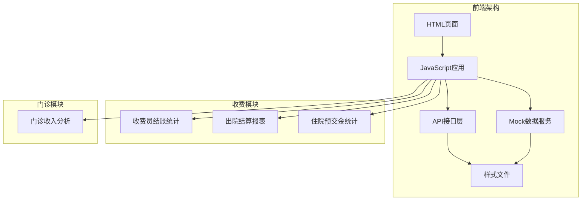

**图表来源**
- [cash-cashier-settlement.html:1-126](file://reports-web/cash/cash-cashier-settlement.html#L1-L126)
- [cash-discharge-settlement.html:1-198](file://reports-web/cash/cash-discharge-settlement.html#L1-L198)
- [cash-inpatient-prepayment.html:1-356](file://reports-web/cash/cash-inpatient-prepayment.html#L1-L356)
- [outpatient-revenue.html:1-187](file://reports-web/outpatient/outpatient-revenue.html#L1-L187)

**章节来源**
- [cash-cashier-settlement.html:1-126](file://reports-web/cash/cash-cashier-settlement.html#L1-L126)
- [cash-discharge-settlement.html:1-198](file://reports-web/cash/cash-discharge-settlement.html#L1-L198)
- [cash-inpatient-prepayment.html:1-356](file://reports-web/cash/cash-inpatient-prepayment.html#L1-L356)
- [outpatient-revenue.html:1-187](file://reports-web/outpatient/outpatient-revenue.html#L1-L187)

## 核心组件

### 收费员结账统计控制器

收费员结账统计页面的核心控制器实现了完整的数据处理和展示逻辑：

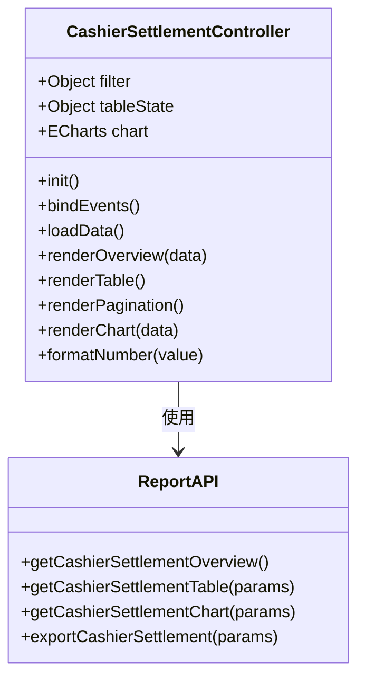

**图表来源**
- [cash-cashier-settlement-app.js:4-447](file://reports-web/cash/js/cash-cashier-settlement-app.js#L4-L447)

### 出院结算报表控制器

出院结算报表提供了多维度的统计分析功能：

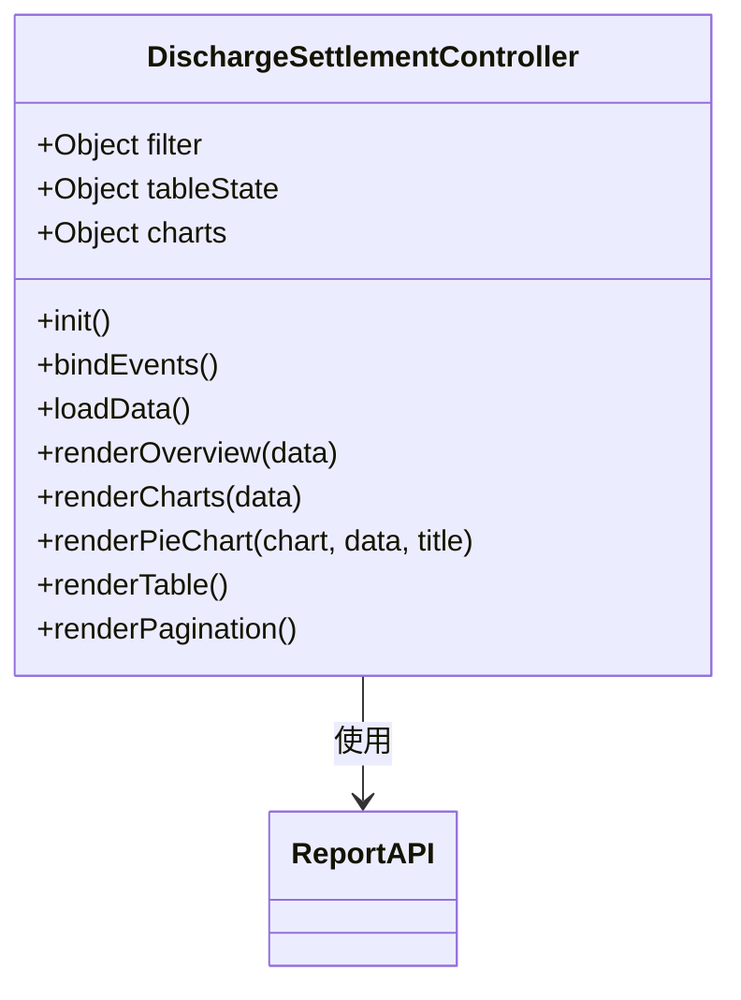

**图表来源**
- [cash-discharge-settlement-app.js:4-315](file://reports-web/cash/js/cash-discharge-settlement-app.js#L4-L315)

### 住院预交金统计控制器

住院预交金统计是最复杂的收费报表，支持三种统计模式：

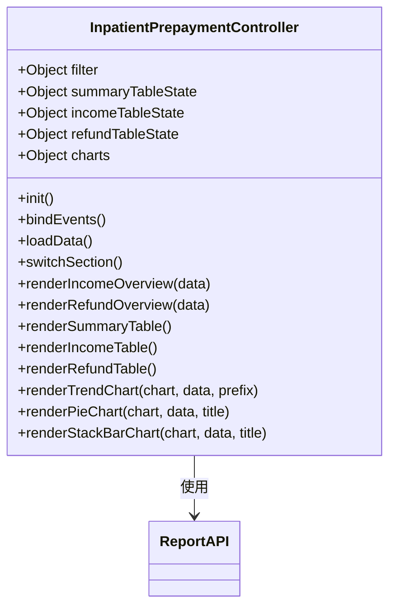

**图表来源**
- [cash-inpatient-prepayment-app.js:4-800](file://reports-web/cash/js/cash-inpatient-prepayment-app.js#L4-L800)

### 门诊收入分析控制器

门诊收入分析页面专注于门诊收入的统计分析：

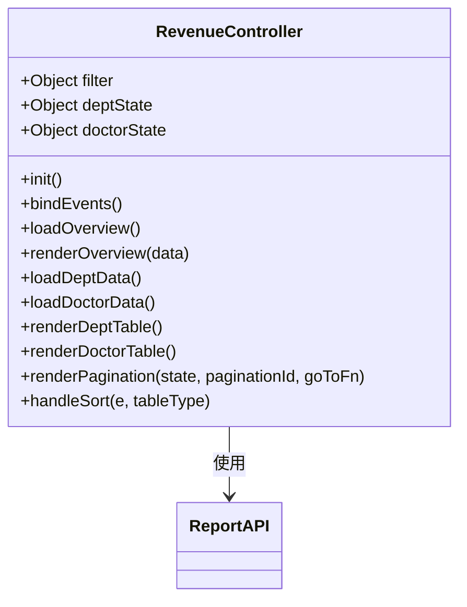

**图表来源**
- [revenue-app.js:4-383](file://reports-web/outpatient/js/revenue-app.js#L4-L383)

**章节来源**
- [cash-cashier-settlement-app.js:1-519](file://reports-web/cash/js/cash-cashier-settlement-app.js#L1-L519)
- [cash-discharge-settlement-app.js:1-385](file://reports-web/cash/js/cash-discharge-settlement-app.js#L1-L385)
- [cash-inpatient-prepayment-app.js:1-800](file://reports-web/cash/js/cash-inpatient-prepayment-app.js#L1-L800)
- [revenue-app.js:1-516](file://reports-web/outpatient/js/revenue-app.js#L1-L516)

## 架构概览

系统采用分层架构设计，确保了良好的可维护性和扩展性：

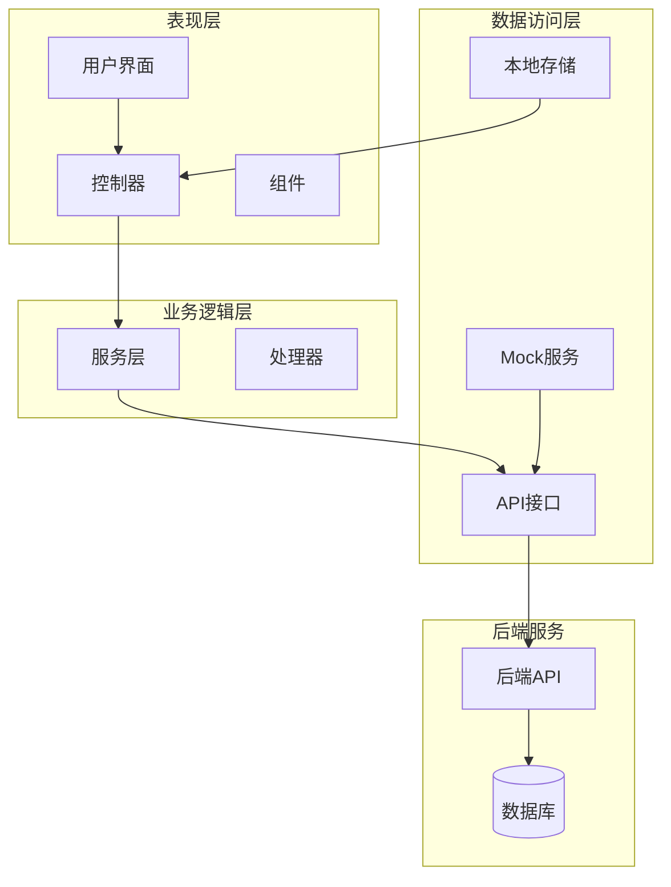

**图表来源**
- [api.js:6-134](file://reports-web/cash/js/api.js#L6-L134)
- [api.js:6-159](file://reports-web/outpatient/js/api.js#L6-L159)

### 数据流处理

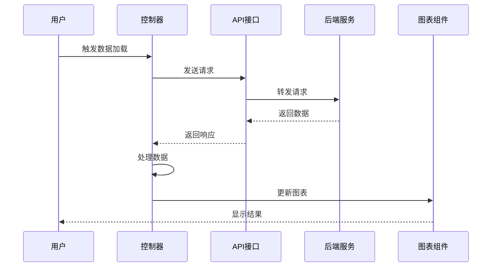

**图表来源**
- [cash-cashier-settlement-app.js:101-107](file://reports-web/cash/js/cash-cashier-settlement-app.js#L101-L107)
- [cash-discharge-settlement-app.js:87-93](file://reports-web/cash/js/cash-discharge-settlement-app.js#L87-L93)

## 详细组件分析

### 收费员结账统计页面

#### 功能特性

收费员结账统计页面提供了三个主要的统计维度：

1. **按收费员统计**：显示不同收费员的工作量统计
2. **按来源方式统计**：分析收费来源的各种方式
3. **工作量报表**：详细的工作量统计信息

#### 数据处理逻辑

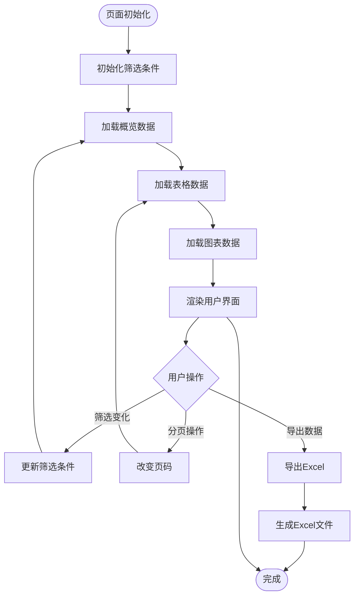

**图表来源**
- [cash-cashier-settlement-app.js:23-107](file://reports-web/cash/js/cash-cashier-settlement-app.js#L23-L107)

#### 核心数据结构

页面使用以下数据结构来管理状态：

| 属性 | 类型 | 描述 |
|------|------|------|
| filter | Object | 筛选条件对象 |
| tableState | Object | 表格状态管理 |
| chart | ECharts | 图表实例 |

**章节来源**
- [cash-cashier-settlement-app.js:5-21](file://reports-web/cash/js/cash-cashier-settlement-app.js#L5-L21)

### 出院结算报表页面

#### 统计维度

出院结算报表支持多种统计维度：

1. **时间维度**：按天或按月统计
2. **对比分析**：与去年同期数据对比
3. **多维分析**：从不同角度分析结算情况

#### 图表展示

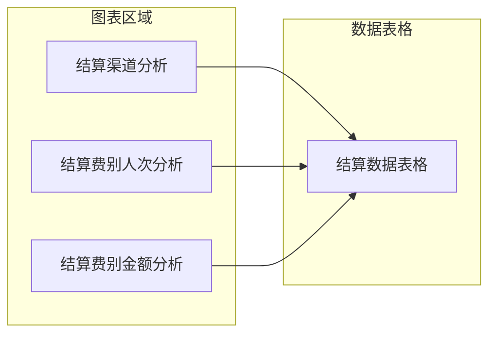

**图表来源**
- [cash-discharge-settlement-app.js:135-139](file://reports-web/cash/js/cash-discharge-settlement-app.js#L135-L139)

**章节来源**
- [cash-discharge-settlement-app.js:29-133](file://reports-web/cash/js/cash-discharge-settlement-app.js#L29-L133)

### 住院预交金统计页面

#### 三重统计模式

住院预交金统计页面提供三种不同的统计模式：

1. **汇总统计**：整体的预交金收支情况
2. **进项统计**：预交金的收入情况
3. **退项统计**：预交金的退款情况

#### 高级图表功能

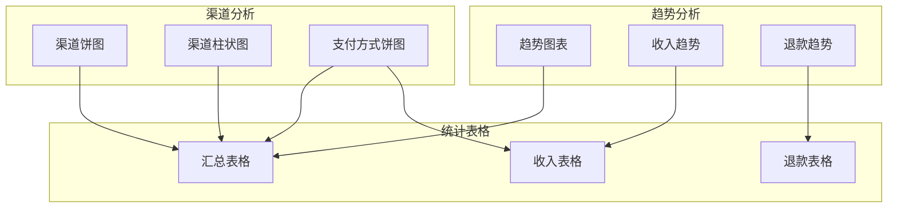

**图表来源**
- [cash-inpatient-prepayment-app.js:42-57](file://reports-web/cash/js/cash-inpatient-prepayment-app.js#L42-L57)

**章节来源**
- [cash-inpatient-prepayment-app.js:35-203](file://reports-web/cash/js/cash-inpatient-prepayment-app.js#L35-L203)

### 门诊收入分析页面

#### 双表并列设计

门诊收入分析页面采用双表并列的设计模式：

1. **科室收入统计**：各科室的收入情况
2. **医生效益统计**：各医生的效益分析

#### 排序功能

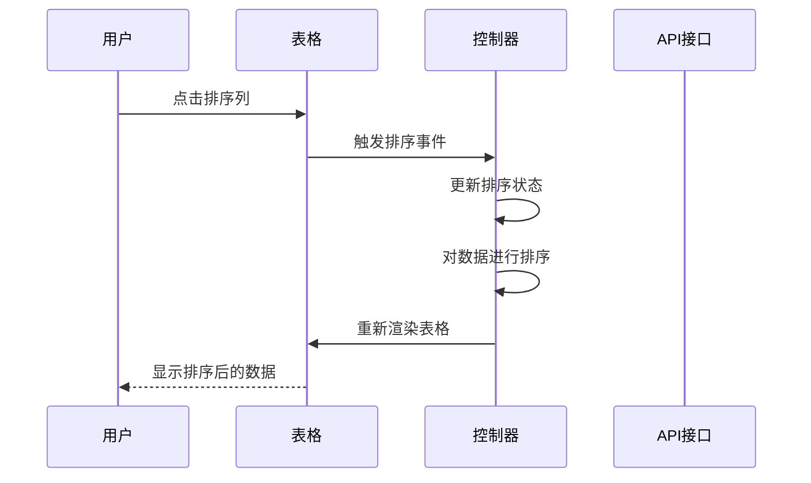

**图表来源**
- [revenue-app.js:121-146](file://reports-web/outpatient/js/revenue-app.js#L121-L146)

**章节来源**
- [revenue-app.js:69-146](file://reports-web/outpatient/js/revenue-app.js#L69-L146)

## 依赖关系分析

### 外部依赖

系统使用了多个重要的外部库：

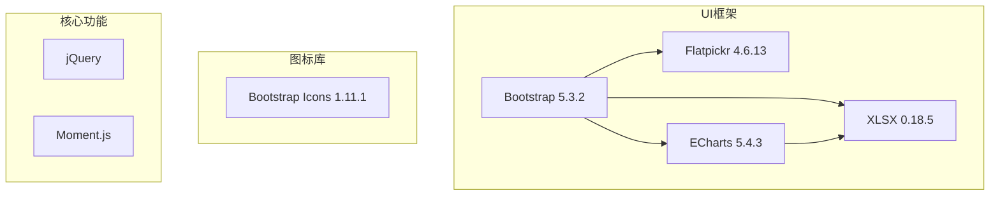

**图表来源**
- [cash-cashier-settlement.html:8-101](file://reports-web/cash/cash-cashier-settlement.html#L8-L101)
- [cash-discharge-settlement.html:7-173](file://reports-web/cash/cash-discharge-settlement.html#L7-L173)
- [cash-inpatient-prepayment.html:6-331](file://reports-web/cash/cash-inpatient-prepayment.html#L6-L331)
- [outpatient-revenue.html:6-163](file://reports-web/outpatient/outpatient-revenue.html#L6-L163)

### 内部模块依赖

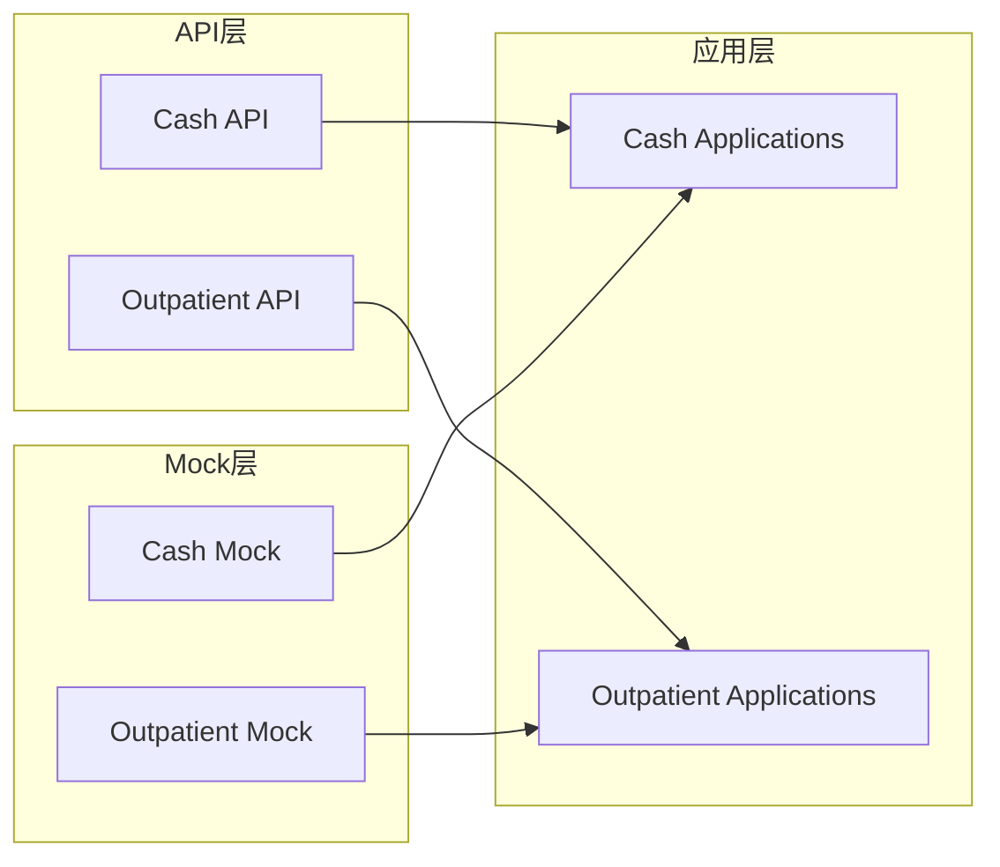

**图表来源**
- [api.js:6-134](file://reports-web/cash/js/api.js#L6-L134)
- [api.js:6-159](file://reports-web/outpatient/js/api.js#L6-L159)

**章节来源**
- [api-config.js](file://reports-web/api-config.js)
- [api-interface.md](file://reports-web/api-interface.md)

## 性能考虑

### 数据缓存策略

系统实现了多层次的数据缓存机制：

1. **内存缓存**：避免重复的API调用
2. **本地存储**：持久化用户偏好设置
3. **图表缓存**：减少图表重绘开销

### 异步加载优化

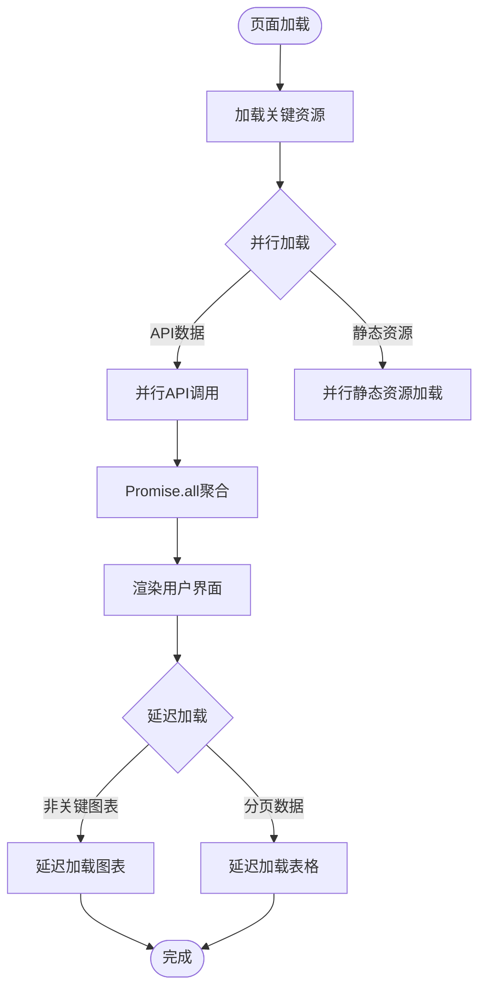

**图表来源**
- [cash-cashier-settlement-app.js:101-107](file://reports-web/cash/js/cash-cashier-settlement-app.js#L101-L107)

### 性能监控

系统提供了性能监控功能，包括：

- **加载时间统计**
- **内存使用监控**
- **网络请求优化**

## 故障排除指南

### 常见问题及解决方案

#### API接口问题

| 问题类型 | 症状 | 解决方案 |
|----------|------|----------|
| 网络超时 | 请求长时间无响应 | 检查网络连接，增加超时时间 |
| 数据格式错误 | 页面显示异常 | 验证API返回数据格式 |
| 权限不足 | 访问被拒绝 | 检查用户权限配置 |
| 服务器错误 | 500错误 | 查看服务器日志，重启服务 |

#### 图表显示问题

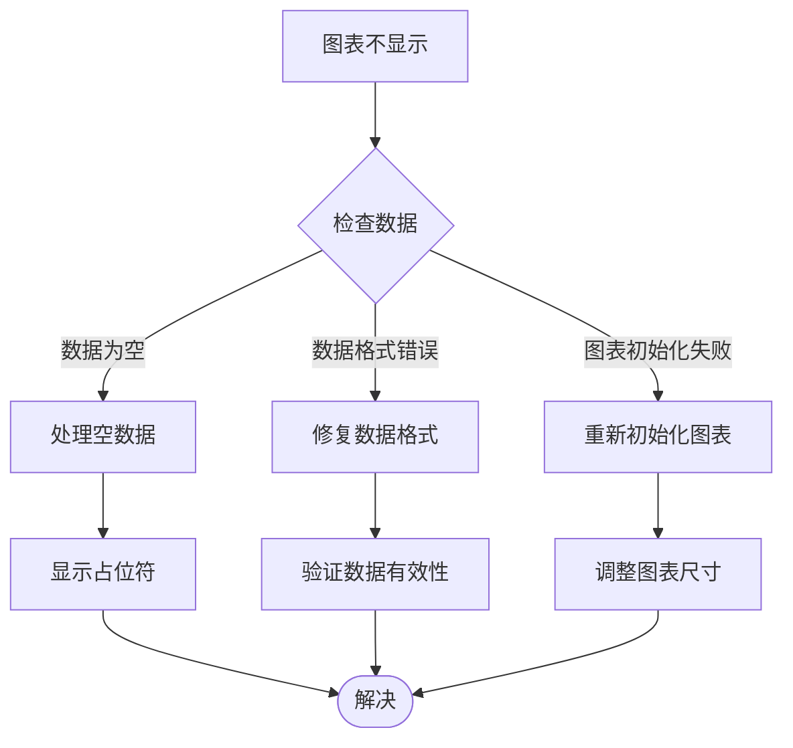

**图表来源**
- [cash-discharge-settlement-app.js:124-133](file://reports-web/cash/js/cash-discharge-settlement-app.js#L124-L133)

#### 数据导出问题

| 问题 | 可能原因 | 解决方法 |
|------|----------|----------|
| Excel文件无法打开 | 文件格式损坏 | 检查XLSX库版本 |
| 导出数据不完整 | 数据量过大 | 分批导出或优化查询 |
| 中文乱码 | 编码问题 | 设置正确的字符编码 |

**章节来源**
- [cash-cashier-settlement-app.js:453-516](file://reports-web/cash/js/cash-cashier-settlement-app.js#L453-L516)
- [cash-discharge-settlement-app.js:321-382](file://reports-web/cash/js/cash-discharge-settlement-app.js#L321-L382)

### 调试工具

系统提供了多种调试工具：

1. **浏览器开发者工具**：检查网络请求和JavaScript错误
2. **Mock数据切换**：便于开发和测试
3. **性能分析工具**：监控应用性能

## 结论

收费报告界面是一个功能完整、架构清晰的医疗收费数据分析系统。通过合理的模块划分和设计模式，系统实现了良好的可维护性和扩展性。

### 主要优势

1. **模块化设计**：每个页面都有独立的控制器和数据处理逻辑
2. **响应式布局**：适配多种设备和屏幕尺寸
3. **丰富的可视化**：通过ECharts提供直观的数据展示
4. **灵活的筛选**：支持多种维度的数据分析
5. **完善的导出功能**：支持Excel格式的数据导出

### 技术亮点

1. **统一的API接口层**：简化了数据访问和Mock数据管理
2. **异步数据处理**：提升了用户体验和页面响应速度
3. **可配置的样式系统**：通过CSS变量实现主题定制
4. **完整的错误处理**：提供了健壮的异常处理机制

### 未来改进方向

1. **移动端优化**：进一步提升移动设备的用户体验
2. **实时数据更新**：实现数据的实时刷新功能
3. **高级分析功能**：添加更复杂的数据分析算法
4. **用户个性化**：支持用户自定义报表模板

该系统为医疗机构提供了强大的收费数据分析能力，有助于提高医疗服务质量和管理水平。