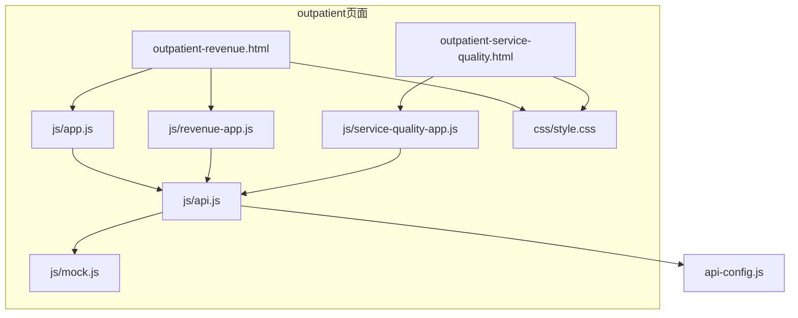
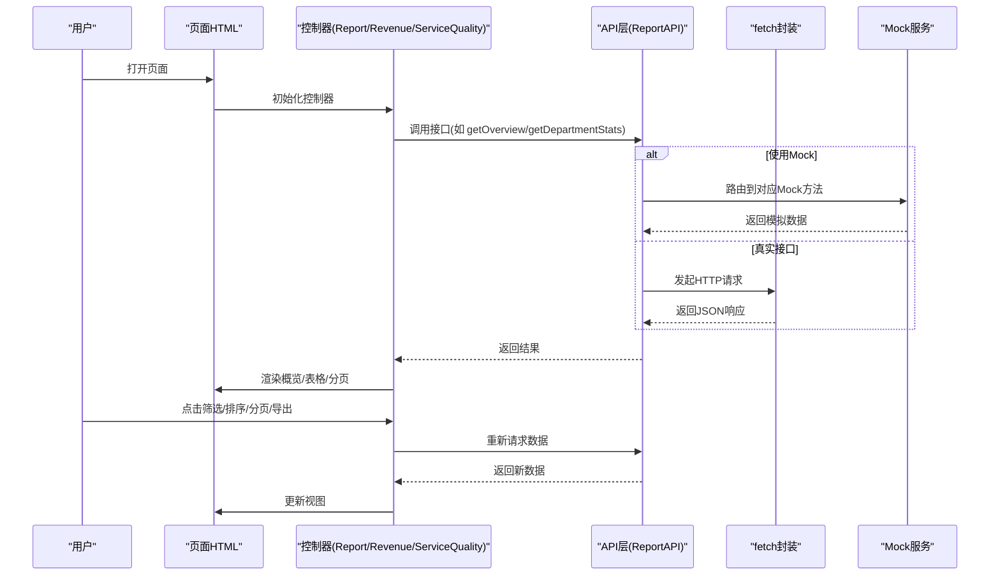
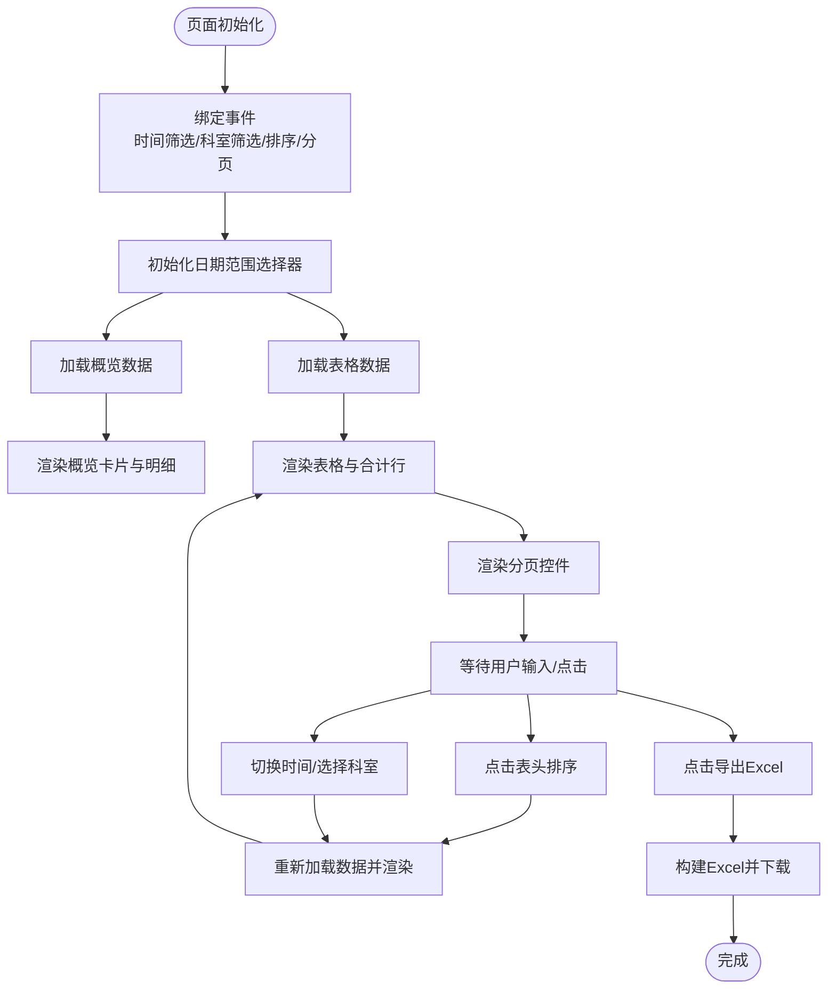
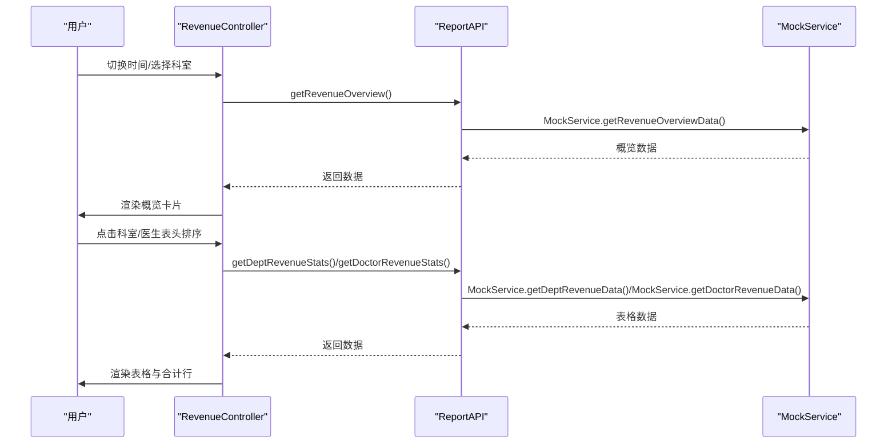
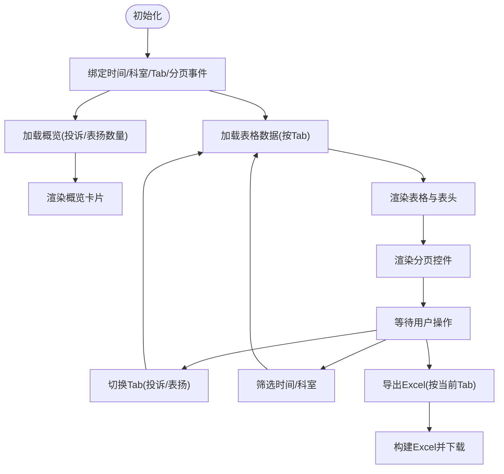
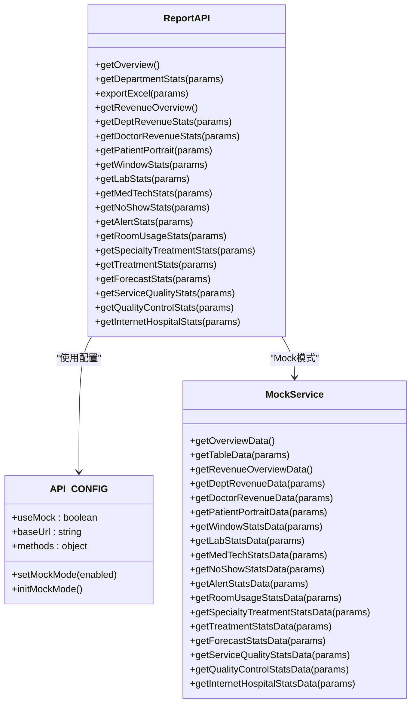
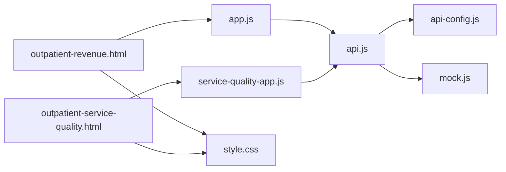

# 门诊报告界面

<cite>
**本文档引用的文件**
- [outpatient/app.js](file://reports-web/outpatient/js/app.js)
- [outpatient/api.js](file://reports-web/outpatient/js/api.js)
- [outpatient/style.css](file://reports-web/outpatient/css/style.css)
- [outpatient/outpatient-revenue.html](file://reports-web/outpatient/outpatient-revenue.html)
- [outpatient/outpatient-service-quality.html](file://reports-web/outpatient/outpatient-service-quality.html)
- [outpatient/revenue-app.js](file://reports-web/outpatient/js/revenue-app.js)
- [outpatient/service-quality-app.js](file://reports-web/outpatient/js/service-quality-app.js)
- [outpatient/mock.js](file://reports-web/outpatient/js/mock.js)
- [api-interface.md](file://reports-web/api-interface.md)
- [api-config.js](file://reports-web/api-config.js)
</cite>

## 目录
1. [简介](#简介)
2. [项目结构](#项目结构)
3. [核心组件](#核心组件)
4. [架构总览](#架构总览)
5. [详细组件分析](#详细组件分析)
6. [依赖关系分析](#依赖关系分析)
7. [性能考虑](#性能考虑)
8. [故障排除指南](#故障排除指南)
9. [结论](#结论)
10. [附录](#附录)

## 简介
本文件面向门诊报告界面的前端实现，系统化梳理各页面的功能特性、数据展示方式与用户交互设计。重点覆盖以下方面：
- 门诊量统计页面：概览卡片、表格数据、排序与分页、导出Excel
- 门诊收入分析页面：科室与医生维度的统计、双表联动、导出
- 门诊服务质量分析页面：投诉/表扬明细切换、字典管理与数据维护弹窗、导出
- 统一API层与Mock机制：接口路由、请求封装、Mock数据切换
- 样式体系与响应式适配：Bootstrap集成、主题变量、移动端优化

## 项目结构
前端采用按功能模块组织的目录结构，outpatient目录下包含各报表页面的HTML、CSS与JS文件；通过统一的API配置与Mock服务实现前后端解耦。

**图表来源**
- [outpatient/outpatient-revenue.html](file://reports-web/outpatient/outpatient-revenue.html)
- [outpatient/outpatient-service-quality.html](file://reports-web/outpatient/outpatient-service-quality.html)
- [outpatient/js/app.js](file://reports-web/outpatient/js/app.js)
- [outpatient/js/revenue-app.js](file://reports-web/outpatient/js/revenue-app.js)
- [outpatient/js/service-quality-app.js](file://reports-web/outpatient/js/service-quality-app.js)
- [outpatient/js/api.js](file://reports-web/outpatient/js/api.js)
- [outpatient/js/mock.js](file://reports-web/outpatient/js/mock.js)
- [outpatient/css/style.css](file://reports-web/outpatient/css/style.css)
- [api-config.js](file://reports-web/api-config.js)

**章节来源**
- [outpatient/outpatient-revenue.html](file://reports-web/outpatient/outpatient-revenue.html)
- [outpatient/outpatient-service-quality.html](file://reports-web/outpatient/outpatient-service-quality.html)
- [outpatient/js/app.js](file://reports-web/outpatient/js/app.js)
- [outpatient/js/revenue-app.js](file://reports-web/outpatient/js/revenue-app.js)
- [outpatient/js/service-quality-app.js](file://reports-web/outpatient/js/service-quality-app.js)
- [outpatient/js/api.js](file://reports-web/outpatient/js/api.js)
- [outpatient/js/mock.js](file://reports-web/outpatient/js/mock.js)
- [outpatient/css/style.css](file://reports-web/outpatient/css/style.css)
- [api-config.js](file://reports-web/api-config.js)

## 核心组件
- 报告控制器（ReportController）：负责门诊量统计页面的状态管理、事件绑定、数据获取与渲染
- 收入控制器（RevenueController）：负责门诊收入分析页面的双表状态、筛选与分页
- 服务质量控制器（ServiceQualityController）：负责投诉/表扬明细切换、字典与数据维护弹窗
- API层（ReportAPI）：统一接口调用入口，基于方法键与端点键路由到具体接口
- Mock服务：提供各类报表的模拟数据，支持开关切换
- 样式系统：基于CSS变量的主题体系，配合Bootstrap实现响应式布局

**章节来源**
- [outpatient/js/app.js](file://reports-web/outpatient/js/app.js)
- [outpatient/js/revenue-app.js](file://reports-web/outpatient/js/revenue-app.js)
- [outpatient/js/service-quality-app.js](file://reports-web/outpatient/js/service-quality-app.js)
- [outpatient/js/api.js](file://reports-web/outpatient/js/api.js)
- [outpatient/js/mock.js](file://reports-web/outpatient/js/mock.js)
- [outpatient/css/style.css](file://reports-web/outpatient/css/style.css)

## 架构总览
前端采用“页面HTML + 控制器 + API层 + Mock/真实接口”的分层架构。页面通过控制器绑定事件、发起API请求、渲染数据；API层根据方法键与端点键路由到具体接口或Mock服务；Mock服务提供模拟数据以支持开发与演示。

**图表来源**
- [outpatient/js/app.js](file://reports-web/outpatient/js/app.js)
- [outpatient/js/revenue-app.js](file://reports-web/outpatient/js/revenue-app.js)
- [outpatient/js/service-quality-app.js](file://reports-web/outpatient/js/service-quality-app.js)
- [outpatient/js/api.js](file://reports-web/outpatient/js/api.js)
- [outpatient/js/mock.js](file://reports-web/outpatient/js/mock.js)
- [api-config.js](file://reports-web/api-config.js)

## 详细组件分析

### 门诊量统计页面（app.js + api.js）
- 功能特性
  - 概览卡片：展示门诊量、预约挂号率、预约诊察率、接诊效率、出诊人次等关键指标
  - 明细展示：按专家类型细分的出诊人次与有效出诊单元
  - 表格数据：支持按专家类型字段排序、分页与筛选
  - 导出Excel：将当前表格数据与合计行导出为Excel文件
- 数据流程
  - 初始化日期范围选择器、绑定事件、加载概览与表格数据
  - 排序时根据字段类型进行数值转换与比较，更新排序图标
  - 分页计算页码区间，渲染分页控件与页码信息
- 用户交互
  - 时间范围按钮切换、日期范围选择器、科室筛选下拉
  - 表头点击排序、分页控件跳转、输入框跳转页码
  - 导出按钮触发Excel导出

**图表来源**
- [outpatient/js/app.js](file://reports-web/outpatient/js/app.js)

**章节来源**
- [outpatient/js/app.js](file://reports-web/outpatient/js/app.js)
- [outpatient/js/api.js](file://reports-web/outpatient/js/api.js)
- [outpatient/css/style.css](file://reports-web/outpatient/css/style.css)

### 门诊收入分析页面（revenue-app.js + api.js）
- 功能特性
  - 双表展示：左侧科室收入统计、右侧医生效益统计
  - 概览卡片：门诊收入与服务性收入
  - 双表独立分页与排序：支持按收入字段排序
  - 导出Excel：分别导出科室与医生数据
- 数据流程
  - 分别维护科室与医生的分页状态与排序状态
  - 根据时间范围与科室筛选条件请求数据
  - 渲染合计行并更新分页信息
- 用户交互
  - 时间范围切换、日期范围选择、科室筛选
  - 左右两表独立的分页控件与跳转输入框
  - 导出按钮分别导出两个表格

**图表来源**
- [outpatient/js/revenue-app.js](file://reports-web/outpatient/js/revenue-app.js)
- [outpatient/js/api.js](file://reports-web/outpatient/js/api.js)
- [outpatient/js/mock.js](file://reports-web/outpatient/js/mock.js)

**章节来源**
- [outpatient/js/revenue-app.js](file://reports-web/outpatient/js/revenue-app.js)
- [outpatient/js/api.js](file://reports-web/outpatient/js/api.js)
- [outpatient/js/mock.js](file://reports-web/outpatient/js/mock.js)

### 门诊服务质量分析页面（service-quality-app.js + api.js）
- 功能特性
  - Tab切换：投诉明细与表扬明细
  - 概览卡片：投诉量与表扬量
  - 表格数据：按时间、科室、人员、岗位类别、分类/方式等字段展示
  - 弹窗功能：字典管理与数据维护
  - 导出Excel：根据当前Tab导出对应明细
- 数据流程
  - 根据activeTab动态切换表头与数据渲染
  - 支持时间范围、科室筛选、分页与跳转
- 用户交互
  - Tab切换、时间范围选择、科室筛选、分页控件
  - 打开字典管理与数据维护弹窗
  - 导出按钮导出当前明细

**图表来源**
- [outpatient/js/service-quality-app.js](file://reports-web/outpatient/js/service-quality-app.js)

**章节来源**
- [outpatient/js/service-quality-app.js](file://reports-web/outpatient/js/service-quality-app.js)
- [outpatient/js/api.js](file://reports-web/outpatient/js/api.js)
- [outpatient/css/style.css](file://reports-web/outpatient/css/style.css)

### API接口与Mock机制
- API层（ReportAPI）
  - 基于方法键与端点键调用具体接口，支持概览、科室统计、导出、收入分析、患者画像、窗口统计、检验统计、医技统计、爽约退号、预警、诊室使用率、专科治疗、治疗统计、预测、服务品质、质量控制、互联网医院等
- 请求封装（apiRequest）
  - 根据useMock开关决定走Mock还是真实接口
  - GET/POST自动识别，支持查询参数与请求体
- Mock服务
  - 提供各报表的模拟数据，支持分页、筛选与合计
  - 支持切换Mock模式并持久化到localStorage

**图表来源**
- [outpatient/js/api.js](file://reports-web/outpatient/js/api.js)
- [api-config.js](file://reports-web/api-config.js)
- [outpatient/js/mock.js](file://reports-web/outpatient/js/mock.js)

**章节来源**
- [outpatient/js/api.js](file://reports-web/outpatient/js/api.js)
- [api-config.js](file://reports-web/api-config.js)
- [outpatient/js/mock.js](file://reports-web/outpatient/js/mock.js)

## 依赖关系分析
- 页面到控制器：每个HTML页面引入对应的应用脚本（app.js、revenue-app.js、service-quality-app.js）
- 控制器到API层：控制器通过ReportAPI调用接口
- API层到配置与Mock：API层根据方法键与端点键路由到具体接口或Mock服务
- 样式依赖：页面引入统一的CSS样式文件，使用Bootstrap与自定义样式

**图表来源**
- [outpatient/outpatient-revenue.html](file://reports-web/outpatient/outpatient-revenue.html)
- [outpatient/outpatient-service-quality.html](file://reports-web/outpatient/outpatient-service-quality.html)
- [outpatient/js/app.js](file://reports-web/outpatient/js/app.js)
- [outpatient/js/service-quality-app.js](file://reports-web/outpatient/js/service-quality-app.js)
- [outpatient/js/api.js](file://reports-web/outpatient/js/api.js)
- [outpatient/js/mock.js](file://reports-web/outpatient/js/mock.js)
- [outpatient/css/style.css](file://reports-web/outpatient/css/style.css)
- [api-config.js](file://reports-web/api-config.js)

**章节来源**
- [outpatient/outpatient-revenue.html](file://reports-web/outpatient/outpatient-revenue.html)
- [outpatient/outpatient-service-quality.html](file://reports-web/outpatient/outpatient-service-quality.html)
- [outpatient/js/app.js](file://reports-web/outpatient/js/app.js)
- [outpatient/js/service-quality-app.js](file://reports-web/outpatient/js/service-quality-app.js)
- [outpatient/js/api.js](file://reports-web/outpatient/js/api.js)
- [outpatient/js/mock.js](file://reports-web/outpatient/js/mock.js)
- [outpatient/css/style.css](file://reports-web/outpatient/css/style.css)
- [api-config.js](file://reports-web/api-config.js)

## 性能考虑
- 数据分页：表格默认每页10条，减少一次性渲染的数据量
- 排序与筛选：在客户端进行，避免频繁网络请求；建议大数据量时结合服务端分页与排序
- Mock延迟：模拟请求包含延迟，便于观察加载状态；生产环境应移除或缩短延迟
- 导出优化：Excel导出仅针对当前页数据与合计行，避免导出全量数据导致内存压力

## 故障排除指南
- Mock开关无法生效
  - 检查localStorage中reports_use_mock键值，确认初始化是否正确
  - 确认页面加载时调用了initMockMode
- 接口请求失败
  - 检查API_CONFIG.baseUrl与方法键/端点键是否正确
  - 查看浏览器Network面板，确认HTTP状态码与响应内容
- 数据为空或异常
  - 切换到Mock模式验证前端渲染逻辑
  - 检查MockService中对应方法的数据生成逻辑
- 导出失败
  - 确认当前页面存在可导出数据
  - 检查XLSX库是否正确加载

**章节来源**
- [api-config.js](file://reports-web/api-config.js)
- [outpatient/js/api.js](file://reports-web/outpatient/js/api.js)
- [outpatient/js/mock.js](file://reports-web/outpatient/js/mock.js)

## 结论
该门诊报告界面通过清晰的分层架构与统一的API配置，实现了多报表页面的一致交互体验。控制器封装了完整的数据生命周期，API层提供了灵活的路由与Mock能力，样式系统保证了良好的视觉与响应式表现。建议后续在大数据场景下增强服务端分页与排序能力，并完善错误提示与加载状态的用户体验。

## 附录

### 页面布局与样式定制
- 主题变量：通过CSS变量统一管理颜色与字体，便于主题定制
- 卡片与网格：使用Bootstrap栅格系统实现响应式布局
- 表格样式：分组表头、悬停高亮、合计行加粗等增强可读性
- 分页控件：支持跳转与省略号显示，提升大页码场景的可用性

**章节来源**
- [outpatient/css/style.css](file://reports-web/outpatient/css/style.css)

### API接口规范与数据格式
- 统一响应格式：code、message、data
- 错误状态码：200成功、400参数错误、401未授权、403无权限、500服务器错误
- 门诊量统计接口：概览与分页表格，支持排序字段与方向
- 收入分析接口：概览、科室收入、医生收入，支持按类型区分
- 服务品质接口：投诉/表扬明细，支持Tab切换与分页

**章节来源**
- [api-interface.md](file://reports-web/api-interface.md)