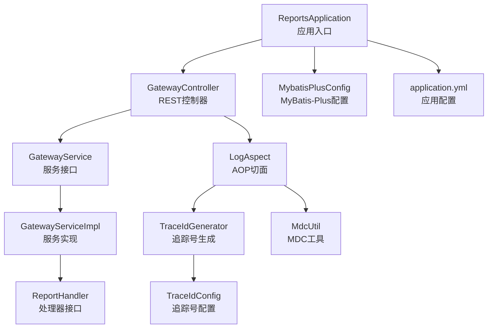
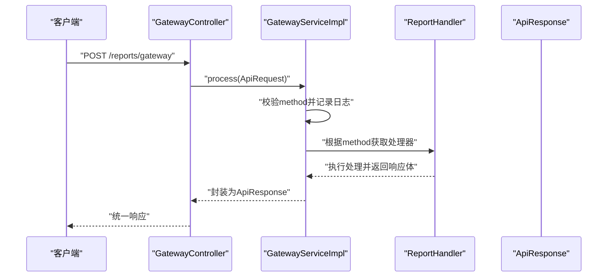
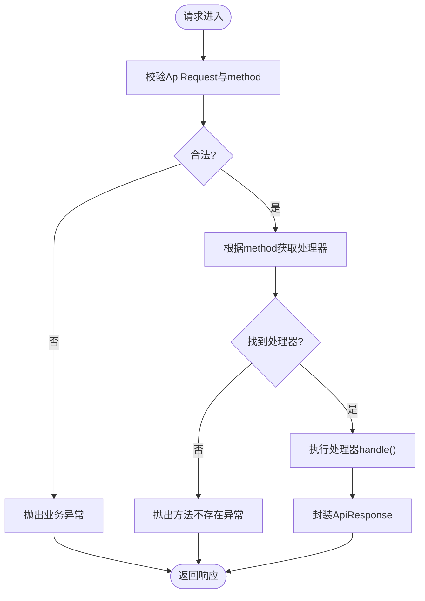
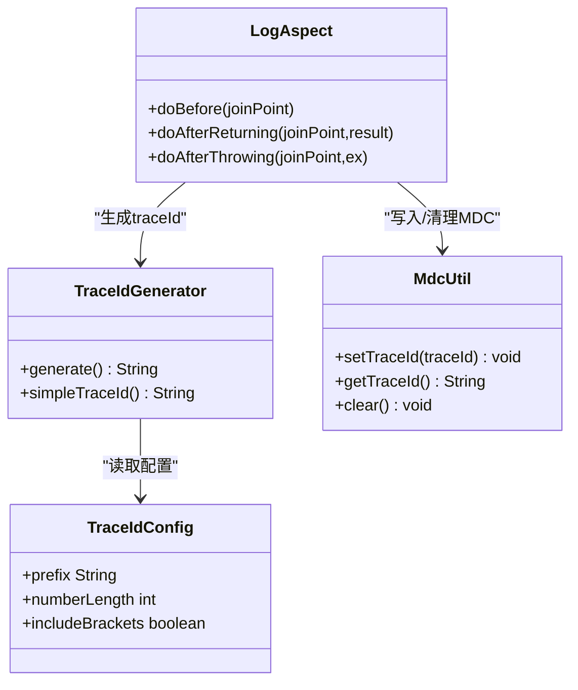
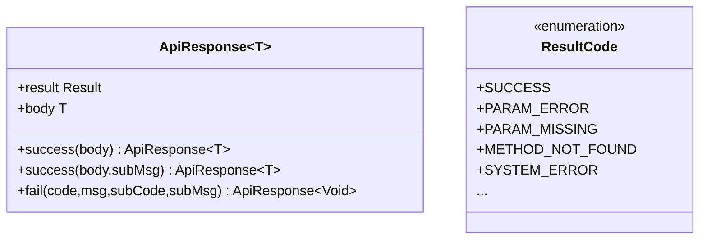
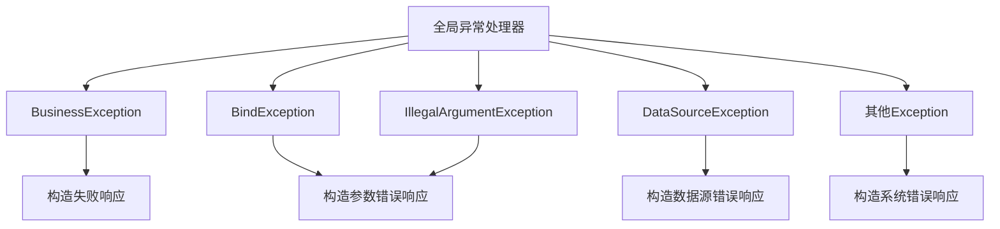
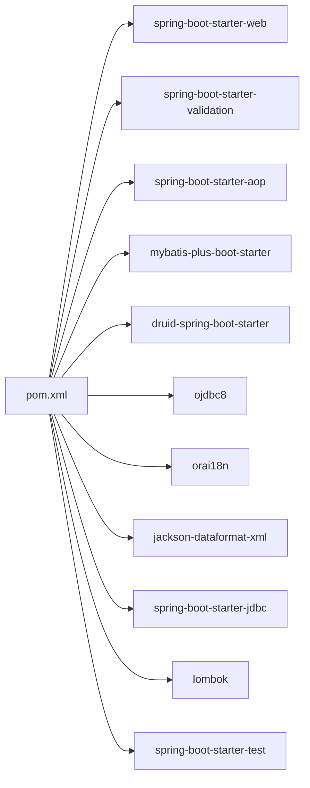

# 代码规范与最佳实践

<cite>
**本文引用的文件**
- [ReportsApplication.java](file://src/main/java/com/reports/ReportsApplication.java)
- [LogAspect.java](file://src/main/java/com/reports/aspect/LogAspect.java)
- [TraceIdConfig.java](file://src/main/java/com/reports/config/TraceIdConfig.java)
- [MdcUtil.java](file://src/main/java/com/reports/util/MdcUtil.java)
- [TraceIdGenerator.java](file://src/main/java/com/reports/util/TraceIdGenerator.java)
- [GatewayController.java](file://src/main/java/com/reports/controller/GatewayController.java)
- [GatewayService.java](file://src/main/java/com/reports/service/GatewayService.java)
- [GatewayServiceImpl.java](file://src/main/java/com/reports/service/impl/GatewayServiceImpl.java)
- [ReportHandler.java](file://src/main/java/com/reports/service/handler/ReportHandler.java)
- [ApiResponse.java](file://src/main/java/com/reports/dto/common/ApiResponse.java)
- [ResultCode.java](file://src/main/java/com/reports/enums/ResultCode.java)
- [GlobalExceptionHandler.java](file://src/main/java/com/reports/exception/GlobalExceptionHandler.java)
- [MybatisPlusConfig.java](file://src/main/java/com/reports/config/MybatisPlusConfig.java)
- [application.yml](file://src/main/resources/application.yml)
- [pom.xml](file://pom.xml)
</cite>

## 目录
1. [引言](#引言)
2. [项目结构](#项目结构)
3. [核心组件](#核心组件)
4. [架构总览](#架构总览)
5. [详细组件分析](#详细组件分析)
6. [依赖分析](#依赖分析)
7. [性能考量](#性能考量)
8. [故障排查指南](#故障排查指南)
9. [结论](#结论)
10. [附录](#附录)

## 引言
本指南面向Spring Boot后端开发团队，系统化总结本项目的代码规范、命名约定、注释标准与设计模式应用；覆盖统一网关、AOP切面、日志与链路追踪、异常处理、参数校验与响应封装等关键主题；并结合实际代码路径给出可直接参考的最佳实践范式，帮助提升一致性、可维护性与扩展性。

## 项目结构
项目采用标准的Spring Boot多模块布局，核心代码位于src/main/java下，按领域分层组织：
- 应用入口与配置：ReportsApplication、application.yml、MybatisPlusConfig
- 控制层：GatewayController
- 服务层：GatewayService及其实现GatewayServiceImpl、处理器接口与工厂（待装配）
- DTO与枚举：统一请求/响应、结果码
- 异常与全局处理：自定义业务异常、全局异常处理器
- AOP与工具：LogAspect、TraceIdConfig、MdcUtil、TraceIdGenerator
- 资源：application.yml

图表来源
- [ReportsApplication.java:1-19](file://src/main/java/com/reports/ReportsApplication.java#L1-L19)
- [GatewayController.java:1-38](file://src/main/java/com/reports/controller/GatewayController.java#L1-L38)
- [GatewayService.java:1-17](file://src/main/java/com/reports/service/GatewayService.java#L1-L17)
- [GatewayServiceImpl.java:1-51](file://src/main/java/com/reports/service/impl/GatewayServiceImpl.java#L1-L51)
- [ReportHandler.java:1-28](file://src/main/java/com/reports/service/handler/ReportHandler.java#L1-L28)
- [LogAspect.java:1-74](file://src/main/java/com/reports/aspect/LogAspect.java#L1-L74)
- [TraceIdGenerator.java:1-57](file://src/main/java/com/reports/util/TraceIdGenerator.java#L1-L57)
- [TraceIdConfig.java:1-33](file://src/main/java/com/reports/config/TraceIdConfig.java#L1-L33)
- [MdcUtil.java:1-34](file://src/main/java/com/reports/util/MdcUtil.java#L1-L34)
- [MybatisPlusConfig.java:1-28](file://src/main/java/com/reports/config/MybatisPlusConfig.java#L1-L28)
- [application.yml:1-32](file://src/main/resources/application.yml#L1-L32)

章节来源
- [ReportsApplication.java:1-19](file://src/main/java/com/reports/ReportsApplication.java#L1-L19)
- [application.yml:1-32](file://src/main/resources/application.yml#L1-L32)

## 核心组件
- 应用入口与启动：通过@SpringBootApplication标注主类，负责应用上下文启动。
- 统一网关：GatewayController接收统一请求，委托GatewayService处理。
- 服务编排：GatewayServiceImpl根据method路由到具体ReportHandler实现。
- 统一响应：ApiResponse封装结果与业务体，ResultCode提供标准化状态码。
- 全局异常：GlobalExceptionHandler集中捕获并输出统一响应。
- 链路追踪：LogAspect在网关层织入AOP，TraceIdGenerator生成追踪号，MdcUtil写入MDC，application.yml配置日志输出含traceId。
- ORM配置：MybatisPlusConfig启用分页插件并扫描mapper包。

章节来源
- [ReportsApplication.java:1-19](file://src/main/java/com/reports/ReportsApplication.java#L1-L19)
- [GatewayController.java:1-38](file://src/main/java/com/reports/controller/GatewayController.java#L1-L38)
- [GatewayService.java:1-17](file://src/main/java/com/reports/service/GatewayService.java#L1-L17)
- [GatewayServiceImpl.java:1-51](file://src/main/java/com/reports/service/impl/GatewayServiceImpl.java#L1-L51)
- [ReportHandler.java:1-28](file://src/main/java/com/reports/service/handler/ReportHandler.java#L1-L28)
- [ApiResponse.java:1-57](file://src/main/java/com/reports/dto/common/ApiResponse.java#L1-L57)
- [ResultCode.java:1-77](file://src/main/java/com/reports/enums/ResultCode.java#L1-L77)
- [GlobalExceptionHandler.java:1-86](file://src/main/java/com/reports/exception/GlobalExceptionHandler.java#L1-L86)
- [LogAspect.java:1-74](file://src/main/java/com/reports/aspect/LogAspect.java#L1-L74)
- [TraceIdGenerator.java:1-57](file://src/main/java/com/reports/util/TraceIdGenerator.java#L1-L57)
- [MdcUtil.java:1-34](file://src/main/java/com/reports/util/MdcUtil.java#L1-L34)
- [MybatisPlusConfig.java:1-28](file://src/main/java/com/reports/config/MybatisPlusConfig.java#L1-L28)
- [application.yml:1-32](file://src/main/resources/application.yml#L1-L32)

## 架构总览
整体采用“网关+处理器”的解耦架构：GatewayController作为单一入口，GatewayServiceImpl依据method选择对应ReportHandler执行，最终统一由ApiResponse返回。AOP在网关层注入TraceId，结合MDC实现全链路日志追踪。

图表来源
- [GatewayController.java:1-38](file://src/main/java/com/reports/controller/GatewayController.java#L1-L38)
- [GatewayServiceImpl.java:1-51](file://src/main/java/com/reports/service/impl/GatewayServiceImpl.java#L1-L51)
- [ReportHandler.java:1-28](file://src/main/java/com/reports/service/handler/ReportHandler.java#L1-L28)
- [ApiResponse.java:1-57](file://src/main/java/com/reports/dto/common/ApiResponse.java#L1-L57)

## 详细组件分析

### 统一网关与请求处理流程
- 控制器职责：接收统一请求，记录traceId与请求体，调用服务层处理。
- 服务层职责：校验method、查找处理器、执行并返回统一响应。
- 设计要点：将method映射与具体业务解耦，便于横向扩展新报表类型。

图表来源
- [GatewayController.java:1-38](file://src/main/java/com/reports/controller/GatewayController.java#L1-L38)
- [GatewayServiceImpl.java:1-51](file://src/main/java/com/reports/service/impl/GatewayServiceImpl.java#L1-L51)
- [ReportHandler.java:1-28](file://src/main/java/com/reports/service/handler/ReportHandler.java#L1-L28)
- [ApiResponse.java:1-57](file://src/main/java/com/reports/dto/common/ApiResponse.java#L1-L57)

章节来源
- [GatewayController.java:1-38](file://src/main/java/com/reports/controller/GatewayController.java#L1-L38)
- [GatewayServiceImpl.java:1-51](file://src/main/java/com/reports/service/impl/GatewayServiceImpl.java#L1-L51)
- [ReportHandler.java:1-28](file://src/main/java/com/reports/service/handler/ReportHandler.java#L1-L28)
- [ApiResponse.java:1-57](file://src/main/java/com/reports/dto/common/ApiResponse.java#L1-L57)

### AOP切面与链路追踪
- 切面范围：对GatewayController的所有方法进行织入。
- 生命周期：请求进入设置traceId并记录请求信息；正常返回与异常分别记录返回值与异常堆栈；最后清理MDC。
- 配置项：TraceIdConfig支持前缀、长度、是否加中括号；application.yml配置控制台日志pattern包含traceId。

图表来源
- [LogAspect.java:1-74](file://src/main/java/com/reports/aspect/LogAspect.java#L1-L74)
- [TraceIdGenerator.java:1-57](file://src/main/java/com/reports/util/TraceIdGenerator.java#L1-L57)
- [TraceIdConfig.java:1-33](file://src/main/java/com/reports/config/TraceIdConfig.java#L1-L33)
- [MdcUtil.java:1-34](file://src/main/java/com/reports/util/MdcUtil.java#L1-L34)

章节来源
- [LogAspect.java:1-74](file://src/main/java/com/reports/aspect/LogAspect.java#L1-L74)
- [TraceIdGenerator.java:1-57](file://src/main/java/com/reports/util/TraceIdGenerator.java#L1-L57)
- [TraceIdConfig.java:1-33](file://src/main/java/com/reports/config/TraceIdConfig.java#L1-L33)
- [MdcUtil.java:1-34](file://src/main/java/com/reports/util/MdcUtil.java#L1-L34)
- [application.yml:1-32](file://src/main/resources/application.yml#L1-L32)

### 统一响应与结果码
- ApiResponse提供success/fail静态方法，统一承载Result与body。
- ResultCode枚举定义业务态码，便于前端与监控侧一致识别。

图表来源
- [ApiResponse.java:1-57](file://src/main/java/com/reports/dto/common/ApiResponse.java#L1-L57)
- [ResultCode.java:1-77](file://src/main/java/com/reports/enums/ResultCode.java#L1-L77)

章节来源
- [ApiResponse.java:1-57](file://src/main/java/com/reports/dto/common/ApiResponse.java#L1-L57)
- [ResultCode.java:1-77](file://src/main/java/com/reports/enums/ResultCode.java#L1-L77)

### 全局异常处理
- 按异常类型分类处理：业务异常、参数绑定异常、非法参数、数据源异常、通用异常。
- 输出统一响应，利用MDC中的traceId便于定位问题。

图表来源
- [GlobalExceptionHandler.java:1-86](file://src/main/java/com/reports/exception/GlobalExceptionHandler.java#L1-L86)
- [ResultCode.java:1-77](file://src/main/java/com/reports/enums/ResultCode.java#L1-L77)
- [ApiResponse.java:1-57](file://src/main/java/com/reports/dto/common/ApiResponse.java#L1-L57)

章节来源
- [GlobalExceptionHandler.java:1-86](file://src/main/java/com/reports/exception/GlobalExceptionHandler.java#L1-L86)
- [ResultCode.java:1-77](file://src/main/java/com/reports/enums/ResultCode.java#L1-L77)
- [ApiResponse.java:1-57](file://src/main/java/com/reports/dto/common/ApiResponse.java#L1-L57)

### MyBatis-Plus配置
- 开启分页插件，适配Oracle方言。
- 自动扫描mapper包，简化DAO层开发。

章节来源
- [MybatisPlusConfig.java:1-28](file://src/main/java/com/reports/config/MybatisPlusConfig.java#L1-L28)

## 依赖分析
- Spring Boot Starter：web、validation、aop、jdbc、test
- ORM：MyBatis-Plus、Druid连接池
- 数据库：Oracle驱动与国际化支持
- 工具：Lombok、Jackson XML

图表来源
- [pom.xml:1-110](file://pom.xml#L1-L110)

章节来源
- [pom.xml:1-110](file://pom.xml#L1-L110)

## 性能考量
- AOP切面仅作用于网关层，避免对业务处理造成额外开销。
- 分页插件在ORM层生效，建议配合合理索引与LIMIT策略。
- 追踪号生成采用安全随机数与原子计数，兼顾唯一性与性能。
- 建议在生产环境开启更细粒度的日志级别，避免过度打印。

## 故障排查指南
- 链路定位：优先查看日志中traceId，结合全局异常处理器输出快速定位。
- 参数问题：关注参数绑定与非法参数异常分支，核对请求体与校验规则。
- 方法路由：确认method是否正确传递以及对应处理器是否注册。
- 数据源：数据源异常通常伴随底层SQL执行失败，检查数据源配置与连接池状态。

章节来源
- [LogAspect.java:1-74](file://src/main/java/com/reports/aspect/LogAspect.java#L1-L74)
- [GlobalExceptionHandler.java:1-86](file://src/main/java/com/reports/exception/GlobalExceptionHandler.java#L1-L86)
- [GatewayServiceImpl.java:1-51](file://src/main/java/com/reports/service/impl/GatewayServiceImpl.java#L1-L51)
- [TraceIdConfig.java:1-33](file://src/main/java/com/reports/config/TraceIdConfig.java#L1-L33)

## 结论
本项目以“统一网关+处理器”为核心，结合AOP链路追踪、统一响应与异常处理，形成清晰、可扩展的架构。遵循本文规范可在保证一致性的同时，显著提升可维护性与可观测性。

## 附录

### 编码规范与命名约定
- 包名：采用反向域名+小写分段，如com.reports。
- 类名：采用帕斯卡命名，接口以名词或形容词开头，实现类加Impl后缀。
- 方法名：采用驼峰命名，动词+宾语，简短明确。
- 常量：全部大写+下划线分隔。
- 配置：属性名使用中划线，如include-brackets。

### 注释标准
- 类注释：说明职责与关键行为，必要时注明扩展点。
- 方法注释：描述输入、输出、异常与边界条件。
- 枚举与配置：对每个字段/属性说明含义与取值范围。

### 设计模式应用
- 工厂模式：通过ReportHandlerFactory按method动态获取处理器，便于扩展新报表类型。
- 策略模式：不同报表类型实现ReportHandler接口，统一由网关调度。
- 中介者模式：GatewayServiceImpl协调请求解析与处理器执行。
- 观察者模式：AOP切面观察控制器生命周期，自动注入追踪信息。

### 最佳实践清单
- 统一响应：始终使用ApiResponse封装结果，避免直接返回原始对象。
- 参数校验：优先使用Spring Validation注解，结合全局异常处理。
- 异常处理：区分业务异常与系统异常，前者携带明确子码，后者记录堆栈。
- 日志与追踪：在网关层设置traceId并写入MDC，确保跨服务链路可串联。
- 配置管理：将可变参数（如追踪号前缀、长度）集中于配置文件，支持环境差异化。