# 前端开发规范

<cite>
**本文档引用的文件**
- [SKILL.md](file://reports-web/SKILL.md)
- [api.js（现金报表）](file://reports-web/cash/js/api.js)
- [api.js（门诊报表）](file://reports-web/outpatient/js/api.js)
- [style.css（现金报表）](file://reports-web/cash/css/style.css)
- [style.css（门诊报表）](file://reports-web/outpatient/css/style.css)
- [cash-cashier-settlement-app.js](file://reports-web/cash/js/cash-cashier-settlement-app.js)
- [cash-discharge-settlement-app.js](file://reports-web/cash/js/cash-discharge-settlement-app.js)
- [alert-app.js](file://reports-web/outpatient/js/alert-app.js)
- [revenue-app.js](file://reports-web/outpatient/js/revenue-app.js)
- [mock.js（现金报表）](file://reports-web/cash/js/mock.js)
</cite>

## 目录
1. [简介](#简介)
2. [项目结构](#项目结构)
3. [核心组件](#核心组件)
4. [架构概览](#架构概览)
5. [详细组件分析](#详细组件分析)
6. [依赖关系分析](#依赖关系分析)
7. [性能考虑](#性能考虑)
8. [故障排除指南](#故障排除指南)
9. [结论](#结论)
10. [附录](#附录)

## 简介

本规范基于Bootstrap 5构建的报表页面开发标准，旨在确保页面能够高保真还原原型设计，同时保证代码的可维护性和可扩展性。该规范涵盖了UI层、数据层、逻辑层的完整开发流程，从原型分析到高保真还原，从Mock数据到真实接口的联调过程。

## 项目结构

该项目采用模块化的文件组织结构，按照功能域进行分离：

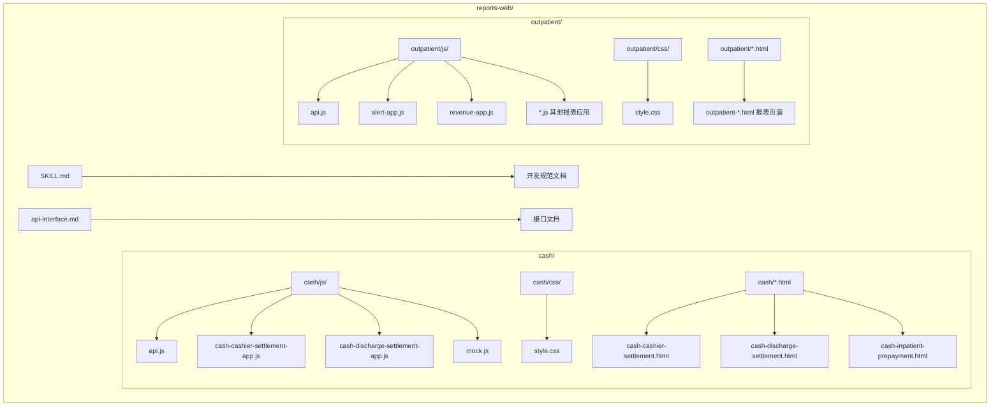

**图表来源**
- [SKILL.md](file://reports-web/SKILL.md)
- [api.js（现金报表）](file://reports-web/cash/js/api.js)
- [api.js（门诊报表）](file://reports-web/outpatient/js/api.js)

**章节来源**
- [SKILL.md](file://reports-web/SKILL.md)

## 核心组件

### 技术栈规范

项目采用统一的技术栈标准：

| 层级 | 技术 | 说明 |
|------|------|------|
| UI层 | Bootstrap 5 + Bootstrap Icons | 组件库和图标库 |
| 数据层 | fetch / axios | 网络请求（默认fetch，复杂场景用axios） |
| 逻辑层 | 原生JavaScript / jQuery | 页面交互逻辑 |

### UI组件使用规范

#### 布局系统
- 使用Bootstrap栅格系统实现响应式布局
- 页面容器采用`container-fluid py-4`结构
- 标题区使用`.page-title`样式
- 筛选区使用`.filter-section`样式

#### 组件规范
- **按钮**：使用`btn btn-primary`基础样式，支持`btn-sm`尺寸
- **卡片**：使用`card stat-card`样式，支持`.stat-icon`图标区域
- **表格**：使用`table table-hover`样式，支持响应式设计
- **分页**：使用`pagination`样式，支持跳转功能

#### 图标系统
统一使用Bootstrap Icons库，包括：
- 统计图标：`bi-bar-chart-fill`、`bi-calendar-check-fill`
- 功能图标：`bi-people-fill`、`bi-clipboard-check-fill`
- 操作图标：`bi-speedometer2`、`bi-hospital-fill`

**章节来源**
- [SKILL.md](file://reports-web/SKILL.md)

## 架构概览

项目采用分层架构设计，确保各层职责清晰：

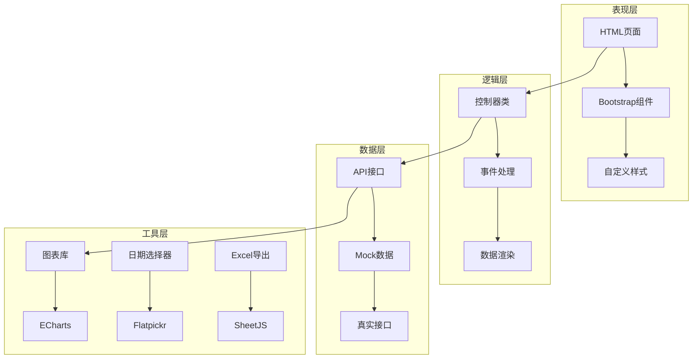

**图表来源**
- [cash-cashier-settlement-app.js](file://reports-web/cash/js/cash-cashier-settlement-app.js)
- [cash-discharge-settlement-app.js](file://reports-web/cash/js/cash-discharge-settlement-app.js)
- [alert-app.js](file://reports-web/outpatient/js/alert-app.js)
- [revenue-app.js](file://reports-web/outpatient/js/revenue-app.js)

## 详细组件分析

### 现金报表系统

#### 收费员结账统计

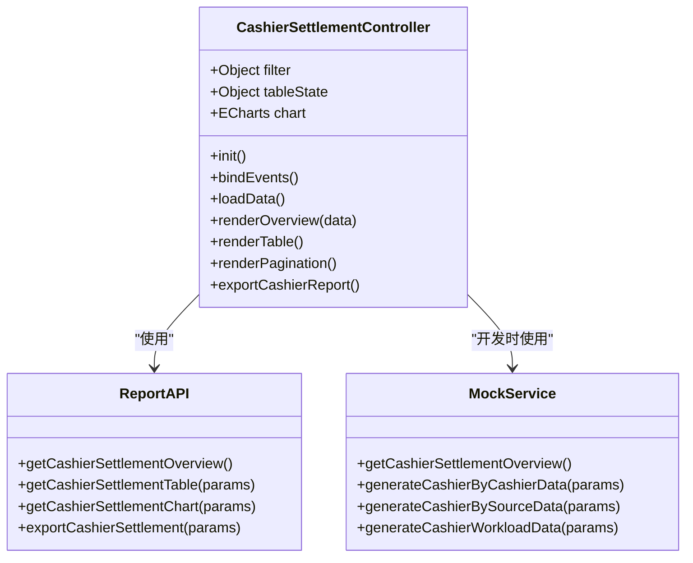

**图表来源**
- [cash-cashier-settlement-app.js](file://reports-web/cash/js/cash-cashier-settlement-app.js)
- [api.js（现金报表）](file://reports-web/cash/js/api.js)
- [mock.js（现金报表）](file://reports-web/cash/js/mock.js)

##### 核心功能特性

1. **多维度统计**：支持按收费员、来源方式、工作量三种模式
2. **动态图表**：使用ECharts实现柱状图可视化
3. **智能分页**：支持5页可见的智能分页算法
4. **Excel导出**：支持多种格式的数据导出

#### 出院结算报表

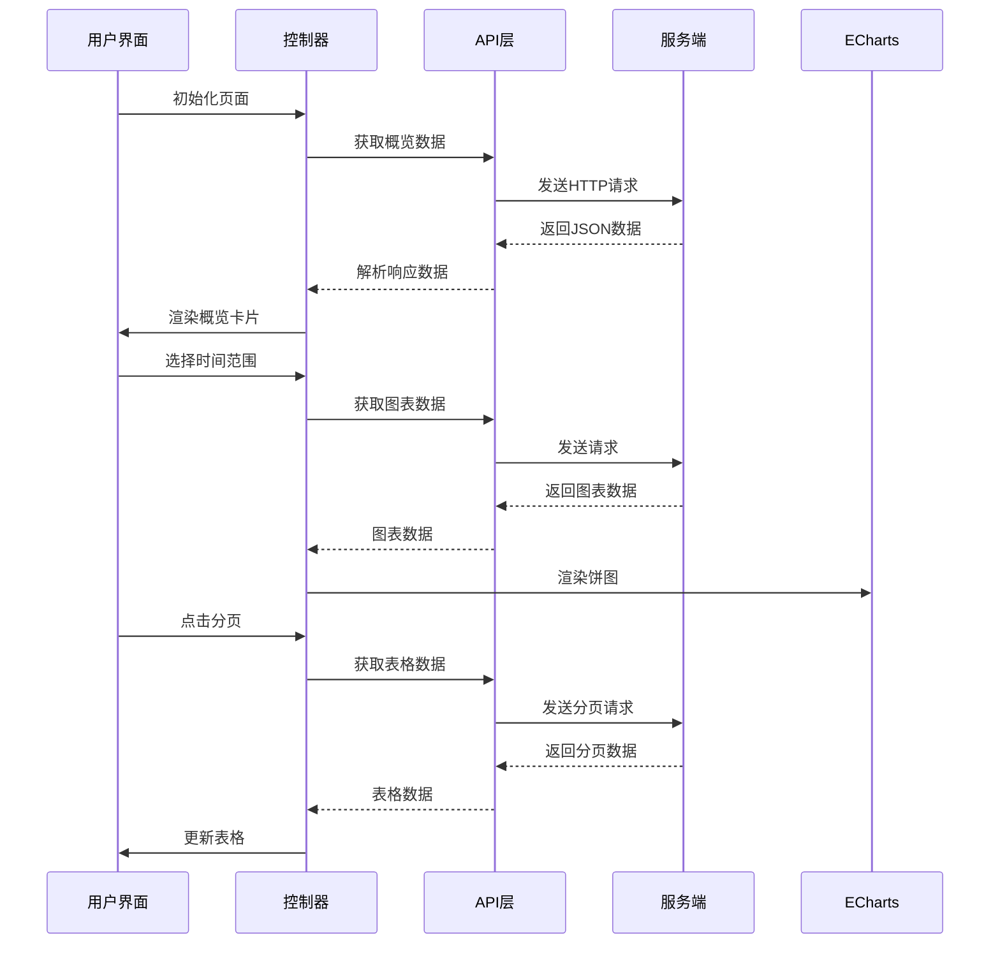

**图表来源**
- [cash-discharge-settlement-app.js](file://reports-web/cash/js/cash-discharge-settlement-app.js)
- [api.js（现金报表）](file://reports-web/cash/js/api.js)

**章节来源**
- [cash-cashier-settlement-app.js](file://reports-web/cash/js/cash-cashier-settlement-app.js)
- [cash-discharge-settlement-app.js](file://reports-web/cash/js/cash-discharge-settlement-app.js)

### 门诊报表系统

#### 门诊预警统计

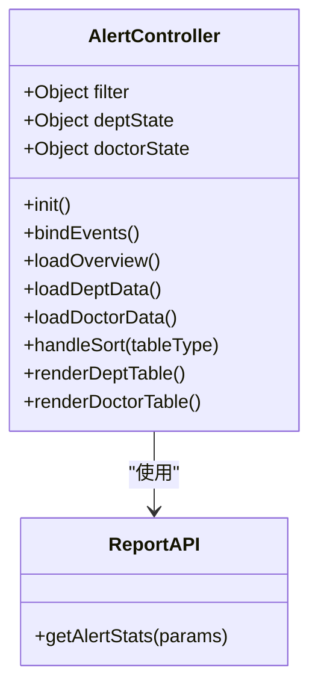

**图表来源**
- [alert-app.js](file://reports-web/outpatient/js/alert-app.js)
- [api.js（门诊报表）](file://reports-web/outpatient/js/api.js)

##### 排序机制实现

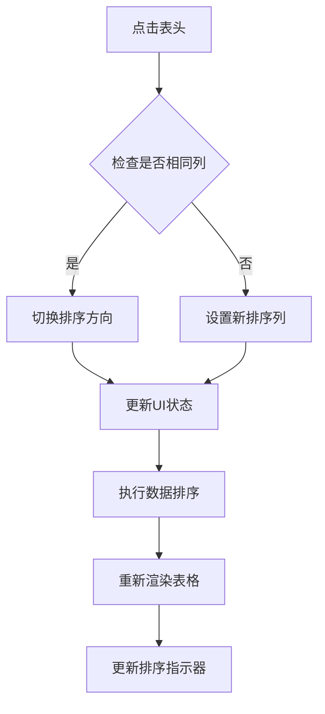

**图表来源**
- [alert-app.js](file://reports-web/outpatient/js/alert-app.js)

#### 门诊收入分析

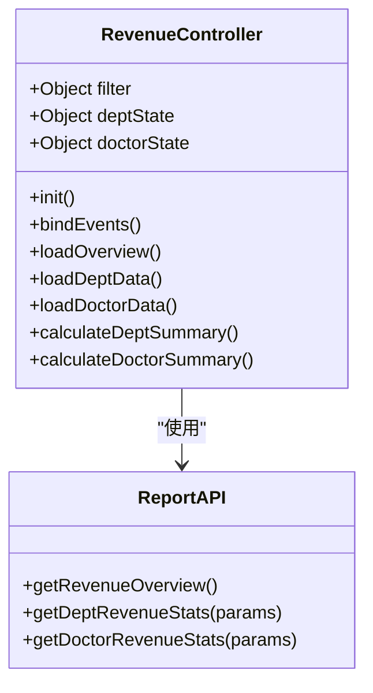

**图表来源**
- [revenue-app.js](file://reports-web/outpatient/js/revenue-app.js)
- [api.js（门诊报表）](file://reports-web/outpatient/js/api.js)

**章节来源**
- [alert-app.js](file://reports-web/outpatient/js/alert-app.js)
- [revenue-app.js](file://reports-web/outpatient/js/revenue-app.js)

### 数据层架构

#### API接口抽象层

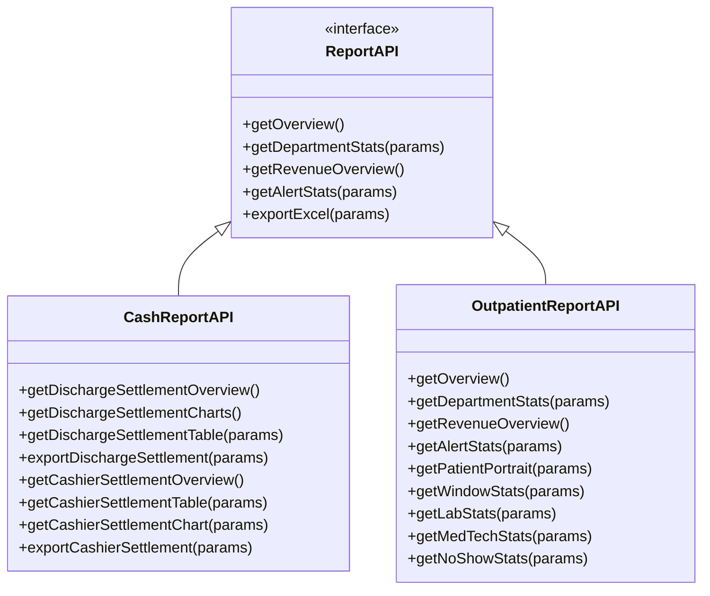

**图表来源**
- [api.js（现金报表）](file://reports-web/cash/js/api.js)
- [api.js（门诊报表）](file://reports-web/outpatient/js/api.js)

**章节来源**
- [api.js（现金报表）](file://reports-web/cash/js/api.js)
- [api.js（门诊报表）](file://reports-web/outpatient/js/api.js)

### 样式系统

#### CSS变量体系

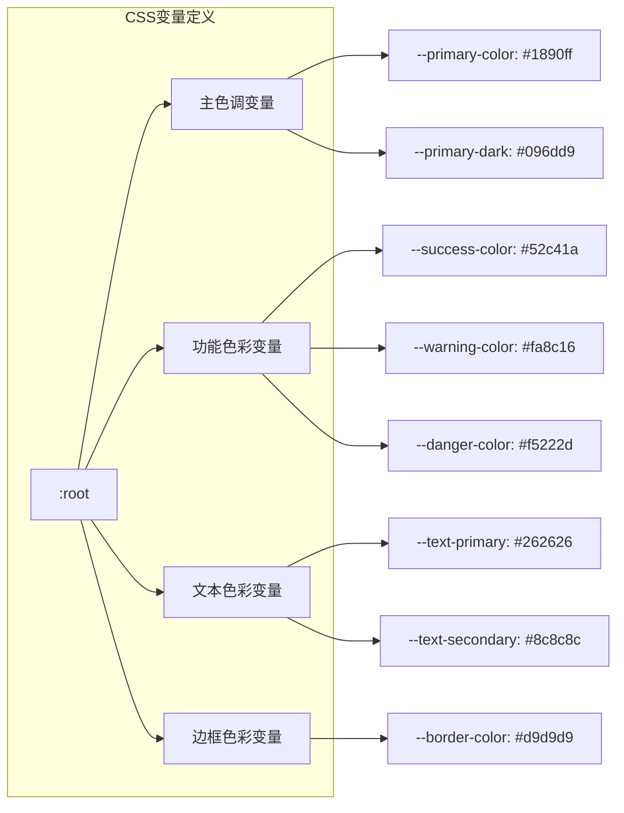

**图表来源**
- [style.css（现金报表）](file://reports-web/cash/css/style.css)
- [style.css（门诊报表）](file://reports-web/outpatient/css/style.css)

**章节来源**
- [style.css（现金报表）](file://reports-web/cash/css/style.css)
- [style.css（门诊报表）](file://reports-web/outpatient/css/style.css)

## 依赖关系分析

### 组件间依赖关系

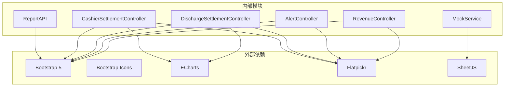

**图表来源**
- [cash-cashier-settlement-app.js](file://reports-web/cash/js/cash-cashier-settlement-app.js)
- [cash-discharge-settlement-app.js](file://reports-web/cash/js/cash-discharge-settlement-app.js)
- [alert-app.js](file://reports-web/outpatient/js/alert-app.js)
- [revenue-app.js](file://reports-web/outpatient/js/revenue-app.js)

### 开发流程依赖

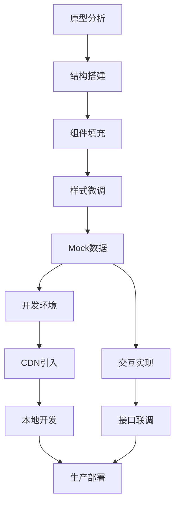

**图表来源**
- [SKILL.md](file://reports-web/SKILL.md)

**章节来源**
- [SKILL.md](file://reports-web/SKILL.md)

## 性能考虑

### 优化策略

1. **懒加载机制**：图表组件按需初始化，减少首屏加载时间
2. **虚拟滚动**：大数据量表格采用虚拟滚动技术
3. **缓存策略**：合理使用浏览器缓存和内存缓存
4. **图片优化**：使用WebP格式和适当的图片尺寸

### 内存管理

- 定期清理事件监听器
- 及时销毁ECharts实例
- 合理管理DOM元素引用

## 故障排除指南

### 常见问题及解决方案

#### 图表显示异常
- **症状**：图表不显示或显示不完整
- **原因**：容器尺寸未正确设置或ECharts实例未正确初始化
- **解决**：确保容器有明确的高度，使用`chart.resize()`响应窗口变化

#### 数据加载失败
- **症状**：页面空白或显示错误信息
- **原因**：网络请求超时或API接口返回错误
- **解决**：检查网络连接，验证API接口URL，查看浏览器开发者工具中的网络面板

#### 样式冲突
- **症状**：组件样式错乱或显示异常
- **原因**：全局样式覆盖了组件样式
- **解决**：使用更具体的选择器，避免全局样式的无意影响

**章节来源**
- [cash-cashier-settlement-app.js](file://reports-web/cash/js/cash-cashier-settlement-app.js)
- [cash-discharge-settlement-app.js](file://reports-web/cash/js/cash-discharge-settlement-app.js)
- [alert-app.js](file://reports-web/outpatient/js/alert-app.js)
- [revenue-app.js](file://reports-web/outpatient/js/revenue-app.js)

## 结论

本前端开发规范为基于Bootstrap 5的报表页面开发提供了完整的指导框架。通过标准化的技术栈、清晰的组件划分和严格的开发流程，确保了项目的高质量交付和长期可维护性。

关键成功因素包括：
- 统一的技术栈和开发标准
- 清晰的分层架构设计
- 完善的Mock数据支持
- 详细的样式和组件规范
- 规范的开发流程和质量控制

## 附录

### 开发最佳实践

1. **代码组织**：按照功能模块组织代码，保持单一职责原则
2. **命名规范**：使用语义化的变量和函数命名
3. **注释规范**：为复杂的逻辑添加详细的注释说明
4. **错误处理**：完善的错误捕获和用户友好的错误提示
5. **测试策略**：单元测试、集成测试和端到端测试相结合

### 维护指南

- 定期更新第三方依赖库
- 保持代码风格的一致性
- 及时修复安全漏洞
- 持续优化性能表现
- 建立完善的文档体系