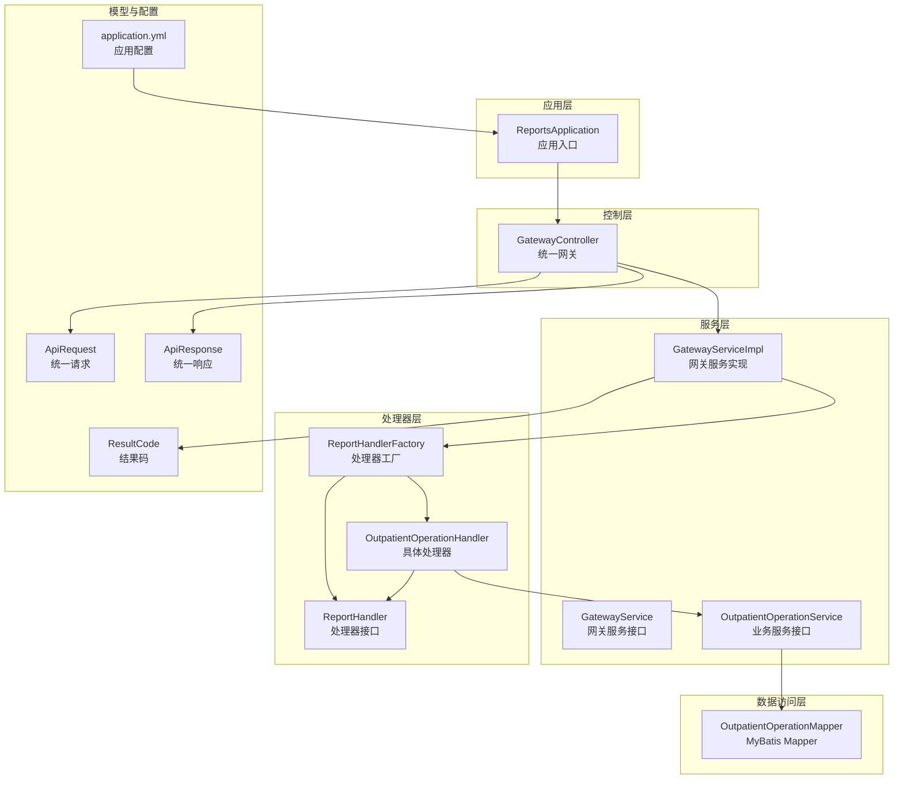
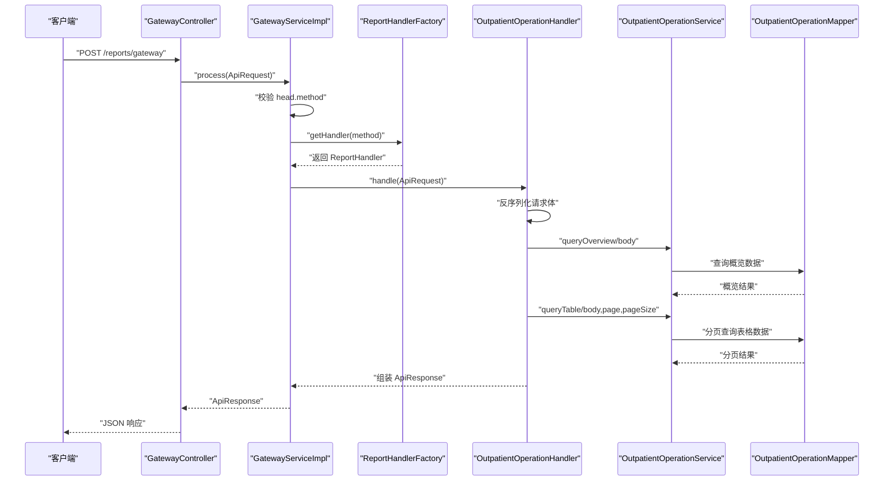
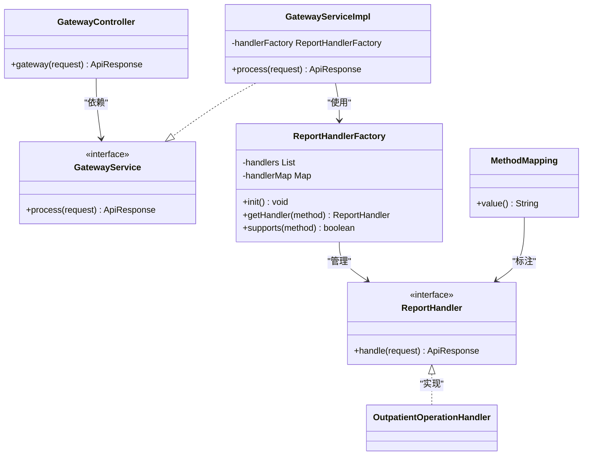
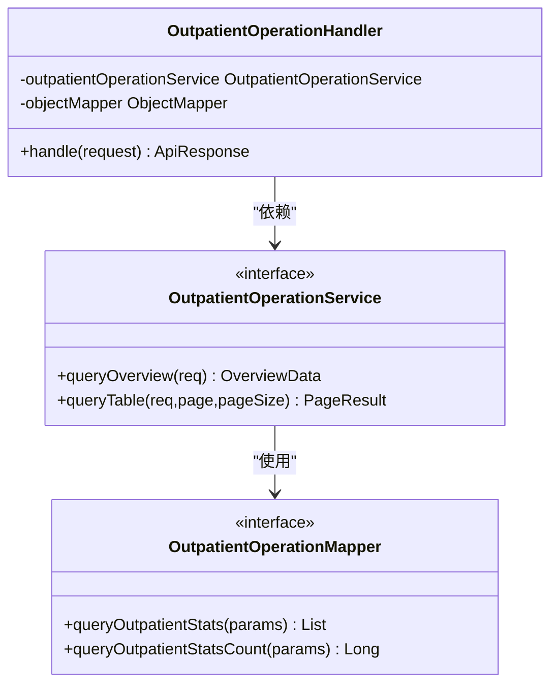
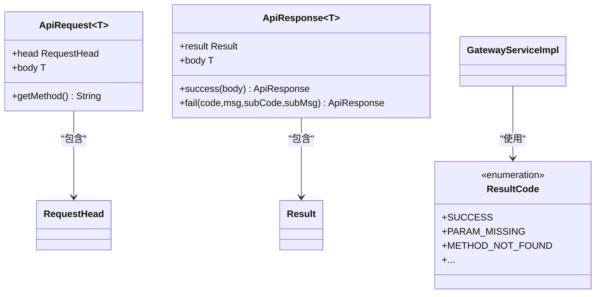
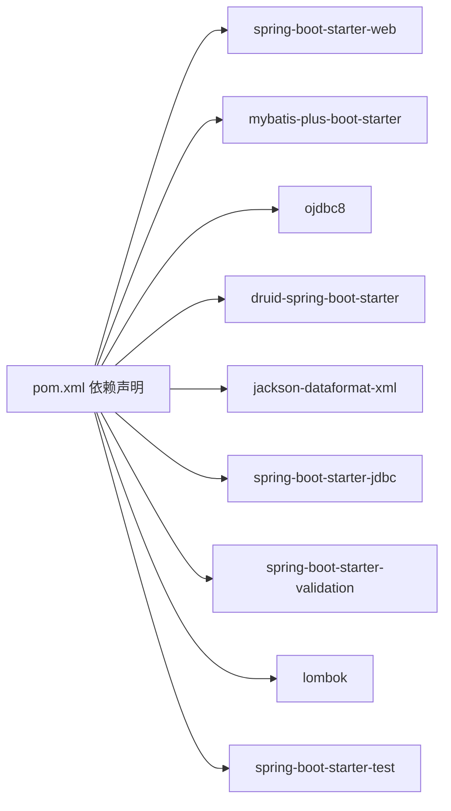

# 开发指南

<cite>
**本文引用的文件**
- [ReportsApplication.java](file://src/main/java/com/reports/ReportsApplication.java)
- [GatewayController.java](file://src/main/java/com/reports/controller/GatewayController.java)
- [GatewayService.java](file://src/main/java/com/reports/service/GatewayService.java)
- [GatewayServiceImpl.java](file://src/main/java/com/reports/service/impl/GatewayServiceImpl.java)
- [ReportHandler.java](file://src/main/java/com/reports/service/handler/ReportHandler.java)
- [ReportHandlerFactory.java](file://src/main/java/com/reports/service/handler/ReportHandlerFactory.java)
- [MethodMapping.java](file://src/main/java/com/reports/service/handler/MethodMapping.java)
- [OutpatientOperationHandler.java](file://src/main/java/com/reports/service/handler/impl/OutpatientOperationHandler.java)
- [OutpatientOperationService.java](file://src/main/java/com/reports/service/OutpatientOperationService.java)
- [OutpatientOperationMapper.java](file://src/main/java/com/reports/mapper/OutpatientOperationMapper.java)
- [ApiRequest.java](file://src/main/java/com/reports/dto/common/ApiRequest.java)
- [ApiResponse.java](file://src/main/java/com/reports/dto/common/ApiResponse.java)
- [ResultCode.java](file://src/main/java/com/reports/enums/ResultCode.java)
- [application.yml](file://src/main/resources/application.yml)
- [pom.xml](file://pom.xml)
</cite>

## 目录
1. [简介](#简介)
2. [项目结构](#项目结构)
3. [核心组件](#核心组件)
4. [架构总览](#架构总览)
5. [详细组件分析](#详细组件分析)
6. [依赖关系分析](#依赖关系分析)
7. [性能与扩展性考虑](#性能与扩展性考虑)
8. [开发流程与最佳实践](#开发流程与最佳实践)
9. [测试与验证](#测试与验证)
10. [调试与排错](#调试与排错)
11. [部署与上线](#部署与上线)
12. [结论](#结论)

## 简介
本指南面向开发者，提供从需求分析到部署上线的完整开发流程，重点围绕以下目标展开：
- 新增报告类型（新增一个报表方法）
- 扩展数据源（切换或扩展数据访问层）
- 修改现有功能（调整处理器、服务与映射器）

文档同时给出编码规范、命名约定、模板参考、常见问题解决方案、调试技巧、性能优化建议与代码审查要点。

## 项目结构
该项目采用 Spring Boot + MyBatis-Plus 的分层架构，核心模块包括：
- 应用入口与配置：应用启动类、全局配置
- 控制层：统一网关控制器，接收所有报表请求
- 服务层：网关服务负责路由与调用，业务服务封装领域逻辑
- 处理器层：基于注解驱动的处理器工厂，按 method 动态路由
- 数据访问层：MyBatis Mapper 接口，当前以 Mock 模式为主
- DTO/枚举：统一请求/响应模型与结果码

图表来源
- [ReportsApplication.java:1-19](file://src/main/java/com/reports/ReportsApplication.java#L1-L19)
- [GatewayController.java:1-38](file://src/main/java/com/reports/controller/GatewayController.java#L1-L38)
- [GatewayServiceImpl.java:1-51](file://src/main/java/com/reports/service/impl/GatewayServiceImpl.java#L1-L51)
- [ReportHandlerFactory.java:1-74](file://src/main/java/com/reports/service/handler/ReportHandlerFactory.java#L1-L74)
- [ReportHandler.java:1-28](file://src/main/java/com/reports/service/handler/ReportHandler.java#L1-L28)
- [OutpatientOperationHandler.java:1-65](file://src/main/java/com/reports/service/handler/impl/OutpatientOperationHandler.java#L1-L65)
- [OutpatientOperationService.java:1-24](file://src/main/java/com/reports/service/OutpatientOperationService.java#L1-L24)
- [OutpatientOperationMapper.java:1-31](file://src/main/java/com/reports/mapper/OutpatientOperationMapper.java#L1-L31)
- [ApiRequest.java:1-35](file://src/main/java/com/reports/dto/common/ApiRequest.java#L1-L35)
- [ApiResponse.java:1-57](file://src/main/java/com/reports/dto/common/ApiResponse.java#L1-L57)
- [ResultCode.java:1-77](file://src/main/java/com/reports/enums/ResultCode.java#L1-L77)
- [application.yml:1-32](file://src/main/resources/application.yml#L1-L32)

章节来源
- [ReportsApplication.java:1-19](file://src/main/java/com/reports/ReportsApplication.java#L1-L19)
- [application.yml:1-32](file://src/main/resources/application.yml#L1-L32)

## 核心组件
- 应用入口：启动 Spring Boot 应用
- 统一网关：接收所有报表请求，校验 method 并转发给对应处理器
- 处理器工厂：扫描并注册所有 ReportHandler 实现，按 method 路由
- 处理器接口：定义 handle(ApiRequest) 规范
- 业务服务：封装具体报表的查询逻辑（概览与分页表格）
- 数据访问：MyBatis Mapper，当前以 Mock 数据为主
- 统一模型：ApiRequest/ApiResponse，ResultCode 枚举

章节来源
- [GatewayController.java:1-38](file://src/main/java/com/reports/controller/GatewayController.java#L1-L38)
- [GatewayService.java:1-17](file://src/main/java/com/reports/service/GatewayService.java#L1-L17)
- [GatewayServiceImpl.java:1-51](file://src/main/java/com/reports/service/impl/GatewayServiceImpl.java#L1-L51)
- [ReportHandler.java:1-28](file://src/main/java/com/reports/service/handler/ReportHandler.java#L1-L28)
- [ReportHandlerFactory.java:1-74](file://src/main/java/com/reports/service/handler/ReportHandlerFactory.java#L1-L74)
- [OutpatientOperationHandler.java:1-65](file://src/main/java/com/reports/service/handler/impl/OutpatientOperationHandler.java#L1-L65)
- [OutpatientOperationService.java:1-24](file://src/main/java/com/reports/service/OutpatientOperationService.java#L1-L24)
- [OutpatientOperationMapper.java:1-31](file://src/main/java/com/reports/mapper/OutpatientOperationMapper.java#L1-L31)
- [ApiRequest.java:1-35](file://src/main/java/com/reports/dto/common/ApiRequest.java#L1-L35)
- [ApiResponse.java:1-57](file://src/main/java/com/reports/dto/common/ApiResponse.java#L1-L57)
- [ResultCode.java:1-77](file://src/main/java/com/reports/enums/ResultCode.java#L1-L77)

## 架构总览
下图展示从客户端到处理器的端到端调用链路，以及工厂注册与路由机制：

图表来源
- [GatewayController.java:28-35](file://src/main/java/com/reports/controller/GatewayController.java#L28-L35)
- [GatewayServiceImpl.java:29-48](file://src/main/java/com/reports/service/impl/GatewayServiceImpl.java#L29-L48)
- [ReportHandlerFactory.java:54-64](file://src/main/java/com/reports/service/handler/ReportHandlerFactory.java#L54-L64)
- [OutpatientOperationHandler.java:33-62](file://src/main/java/com/reports/service/handler/impl/OutpatientOperationHandler.java#L33-L62)
- [OutpatientOperationService.java:11-23](file://src/main/java/com/reports/service/OutpatientOperationService.java#L11-L23)
- [OutpatientOperationMapper.java:14-31](file://src/main/java/com/reports/mapper/OutpatientOperationMapper.java#L14-L31)

## 详细组件分析

### 统一网关与路由
- 控制器接收请求，记录 trace 日志，调用网关服务
- 网关服务校验请求完整性，按 method 查找处理器，执行并返回统一响应
- 处理器工厂通过扫描所有 ReportHandler 实现，读取 MethodMapping 注解完成注册

图表来源
- [GatewayController.java:1-38](file://src/main/java/com/reports/controller/GatewayController.java#L1-L38)
- [GatewayService.java:1-17](file://src/main/java/com/reports/service/GatewayService.java#L1-L17)
- [GatewayServiceImpl.java:1-51](file://src/main/java/com/reports/service/impl/GatewayServiceImpl.java#L1-L51)
- [ReportHandlerFactory.java:1-74](file://src/main/java/com/reports/service/handler/ReportHandlerFactory.java#L1-L74)
- [ReportHandler.java:1-28](file://src/main/java/com/reports/service/handler/ReportHandler.java#L1-L28)
- [MethodMapping.java:1-29](file://src/main/java/com/reports/service/handler/MethodMapping.java#L1-L29)

章节来源
- [GatewayController.java:1-38](file://src/main/java/com/reports/controller/GatewayController.java#L1-L38)
- [GatewayServiceImpl.java:1-51](file://src/main/java/com/reports/service/impl/GatewayServiceImpl.java#L1-L51)
- [ReportHandlerFactory.java:1-74](file://src/main/java/com/reports/service/handler/ReportHandlerFactory.java#L1-L74)

### 报表处理器与业务服务
- 典型处理器：解析请求体、调用业务服务、组装响应
- 业务服务：定义概览与分页查询接口
- Mapper：定义 SQL 接口，当前为示例 SQL，便于替换真实数据源

图表来源
- [OutpatientOperationHandler.java:1-65](file://src/main/java/com/reports/service/handler/impl/OutpatientOperationHandler.java#L1-L65)
- [OutpatientOperationService.java:1-24](file://src/main/java/com/reports/service/OutpatientOperationService.java#L1-L24)
- [OutpatientOperationMapper.java:1-31](file://src/main/java/com/reports/mapper/OutpatientOperationMapper.java#L1-L31)

章节来源
- [OutpatientOperationHandler.java:1-65](file://src/main/java/com/reports/service/handler/impl/OutpatientOperationHandler.java#L1-L65)
- [OutpatientOperationService.java:1-24](file://src/main/java/com/reports/service/OutpatientOperationService.java#L1-L24)
- [OutpatientOperationMapper.java:1-31](file://src/main/java/com/reports/mapper/OutpatientOperationMapper.java#L1-L31)

### 统一请求/响应与结果码
- ApiRequest：包含 head（含 method）与 body
- ApiResponse：统一包装结果与业务体
- ResultCode：标准化错误码与子码

图表来源
- [ApiRequest.java:1-35](file://src/main/java/com/reports/dto/common/ApiRequest.java#L1-L35)
- [ApiResponse.java:1-57](file://src/main/java/com/reports/dto/common/ApiResponse.java#L1-L57)
- [ResultCode.java:1-77](file://src/main/java/com/reports/enums/ResultCode.java#L1-L77)
- [GatewayServiceImpl.java:32-44](file://src/main/java/com/reports/service/impl/GatewayServiceImpl.java#L32-L44)

章节来源
- [ApiRequest.java:1-35](file://src/main/java/com/reports/dto/common/ApiRequest.java#L1-L35)
- [ApiResponse.java:1-57](file://src/main/java/com/reports/dto/common/ApiResponse.java#L1-L57)
- [ResultCode.java:1-77](file://src/main/java/com/reports/enums/ResultCode.java#L1-L77)
- [GatewayServiceImpl.java:1-51](file://src/main/java/com/reports/service/impl/GatewayServiceImpl.java#L1-L51)

## 依赖关系分析
- Spring Boot Web 提供 REST 控制器能力
- MyBatis-Plus 提供 ORM 与分页支持
- Druid 提供连接池监控与配置
- Lombok 减少样板代码
- 测试 Starter 提供单元测试支撑

图表来源
- [pom.xml:26-98](file://pom.xml#L26-L98)

章节来源
- [pom.xml:1-110](file://pom.xml#L1-L110)

## 性能与扩展性考虑
- 处理器工厂使用并发安全的 Map 存储路由，初始化时一次性注册，运行期查找为 O(1)
- 网关服务对 method 校验与空值检查，避免无效请求进入业务层
- Mapper 层支持分页查询，建议结合索引与合理分页大小
- 日志级别与追踪号配置便于定位性能瓶颈与问题根因
- 数据模式可通过配置切换（mock/jdbc/mybatis-plus），便于灰度与压测

章节来源
- [ReportHandlerFactory.java:21-74](file://src/main/java/com/reports/service/handler/ReportHandlerFactory.java#L21-L74)
- [GatewayServiceImpl.java:29-48](file://src/main/java/com/reports/service/impl/GatewayServiceImpl.java#L29-L48)
- [OutpatientOperationMapper.java:14-31](file://src/main/java/com/reports/mapper/OutpatientOperationMapper.java#L14-L31)
- [application.yml:1-32](file://src/main/resources/application.yml#L1-L32)

## 开发流程与最佳实践

### 新增报告类型（新增一个报表方法）
目标：新增一个名为“示例报表”的方法，支持概览与分页表格数据。

步骤清单
- 定义请求/响应 DTO
  - 在请求包中新增请求 DTO（如 ExampleRequest）
  - 在响应包中新增响应 DTO（如 ExampleResponse），包含概览与分页表格字段
  - 参考路径：[OutpatientOperationRequest.java](file://src/main/java/com/reports/dto/request/OutpatientOperationRequest.java)，[OutpatientOperationResponse.java](file://src/main/java/com/reports/dto/response/OutpatientOperationResponse.java)
- 实现业务服务
  - 新增服务接口与实现，提供概览与分页查询方法
  - 参考路径：[OutpatientOperationService.java:1-24](file://src/main/java/com/reports/service/OutpatientOperationService.java#L1-L24)
- 实现数据访问
  - 在 Mapper 中新增 SQL 接口，或复用现有接口
  - 参考路径：[OutpatientOperationMapper.java:1-31](file://src/main/java/com/reports/mapper/OutpatientOperationMapper.java#L1-L31)
- 实现处理器
  - 创建处理器类，标注 MethodMapping 为新方法名
  - 在 handle 中解析请求体、调用服务、组装响应
  - 参考路径：[OutpatientOperationHandler.java:1-65](file://src/main/java/com/reports/service/handler/impl/OutpatientOperationHandler.java#L1-L65)
- 注册处理器
  - 工厂会自动扫描带有 MethodMapping 的实现类，无需额外注册
  - 参考路径：[ReportHandlerFactory.java:31-52](file://src/main/java/com/reports/service/handler/ReportHandlerFactory.java#L31-L52)
- 配置数据源模式
  - 若非 mock 模式，确保 application.yml 中数据模式与数据源配置正确
  - 参考路径：[application.yml:21-24](file://src/main/resources/application.yml#L21-L24)

编码规范与命名约定
- 方法名：小驼峰，清晰表达业务含义；方法标识使用点分法（如 reports.xxx.feature-name）
- 类名：帕斯卡命名；接口以 I 前缀或无前缀均可，视团队约定
- 包名：按功能域划分（dto、service、mapper、controller）
- 注解：处理器必须标注 MethodMapping，value 为唯一 method 标识
- 日志：使用 SLF4J，记录 traceId 以便追踪

模板参考
- 处理器模板：参考 [OutpatientOperationHandler.java:19-65](file://src/main/java/com/reports/service/handler/impl/OutpatientOperationHandler.java#L19-L65)
- 服务接口模板：参考 [OutpatientOperationService.java:8-24](file://src/main/java/com/reports/service/OutpatientOperationService.java#L8-L24)
- Mapper 接口模板：参考 [OutpatientOperationMapper.java:9-31](file://src/main/java/com/reports/mapper/OutpatientOperationMapper.java#L9-L31)
- 请求/响应模板：参考 [ApiRequest.java:7-35](file://src/main/java/com/reports/dto/common/ApiRequest.java#L7-L35)，[ApiResponse.java:7-57](file://src/main/java/com/reports/dto/common/ApiResponse.java#L7-L57)

常见场景与解决方案
- 请求体类型不匹配：处理器内先判断是否为期望类型，否则使用 ObjectMapper 转换
  - 参考路径：[OutpatientOperationHandler.java:37-46](file://src/main/java/com/reports/service/handler/impl/OutpatientOperationHandler.java#L37-L46)
- 分页参数为空：设置默认页码与页大小
  - 参考路径：[OutpatientOperationHandler.java:52-54](file://src/main/java/com/reports/service/handler/impl/OutpatientOperationHandler.java#L52-L54)
- 方法不存在：工厂会在运行期抛出业务异常，确保 method 唯一且正确
  - 参考路径：[ReportHandlerFactory.java:58-64](file://src/main/java/com/reports/service/handler/ReportHandlerFactory.java#L58-L64)，[GatewayServiceImpl.java:41-44](file://src/main/java/com/reports/service/impl/GatewayServiceImpl.java#L41-L44)

章节来源
- [OutpatientOperationHandler.java:1-65](file://src/main/java/com/reports/service/handler/impl/OutpatientOperationHandler.java#L1-L65)
- [OutpatientOperationService.java:1-24](file://src/main/java/com/reports/service/OutpatientOperationService.java#L1-L24)
- [OutpatientOperationMapper.java:1-31](file://src/main/java/com/reports/mapper/OutpatientOperationMapper.java#L1-L31)
- [ReportHandlerFactory.java:1-74](file://src/main/java/com/reports/service/handler/ReportHandlerFactory.java#L1-L74)
- [GatewayServiceImpl.java:1-51](file://src/main/java/com/reports/service/impl/GatewayServiceImpl.java#L1-L51)
- [application.yml:21-24](file://src/main/resources/application.yml#L21-L24)

### 扩展数据源
目标：将数据访问从 mock 切换到真实数据库（如 Oracle）。

步骤清单
- 更新配置
  - 设置 reports.data.mode 为 jdbc 或 mybatis-plus
  - 配置数据源连接信息（URL、用户名、密码等）
  - 参考路径：[application.yml:21-24](file://src/main/resources/application.yml#L21-L24)
- 编写或迁移 SQL
  - 在 Mapper 中实现真实 SQL，或迁移现有示例 SQL
  - 参考路径：[OutpatientOperationMapper.java:18-28](file://src/main/java/com/reports/mapper/OutpatientOperationMapper.java#L18-L28)
- 依赖引入
  - 确保引入 Oracle 驱动与相关依赖
  - 参考路径：[pom.xml:40-51](file://pom.xml#L40-L51)
- 单元测试与集成测试
  - 使用测试环境验证 SQL 正确性与性能

章节来源
- [application.yml:21-24](file://src/main/resources/application.yml#L21-L24)
- [OutpatientOperationMapper.java:1-31](file://src/main/java/com/reports/mapper/OutpatientOperationMapper.java#L1-L31)
- [pom.xml:40-51](file://pom.xml#L40-L51)

### 修改现有功能
目标：调整某报表的查询逻辑或响应结构。

步骤清单
- 修改服务接口与实现
  - 在 OutpatientOperationService 中调整方法签名或行为
  - 参考路径：[OutpatientOperationService.java:11-23](file://src/main/java/com/reports/service/OutpatientOperationService.java#L11-L23)
- 修改 Mapper SQL
  - 在 OutpatientOperationMapper 中更新 SQL 或新增接口
  - 参考路径：[OutpatientOperationMapper.java:17-28](file://src/main/java/com/reports/mapper/OutpatientOperationMapper.java#L17-L28)
- 修改处理器
  - 在 OutpatientOperationHandler 中调整请求解析与响应组装
  - 参考路径：[OutpatientOperationHandler.java:33-62](file://src/main/java/com/reports/service/handler/impl/OutpatientOperationHandler.java#L33-L62)
- 验证与回归测试
  - 保持 method 不变，确保向后兼容

章节来源
- [OutpatientOperationService.java:1-24](file://src/main/java/com/reports/service/OutpatientOperationService.java#L1-L24)
- [OutpatientOperationMapper.java:1-31](file://src/main/java/com/reports/mapper/OutpatientOperationMapper.java#L1-L31)
- [OutpatientOperationHandler.java:1-65](file://src/main/java/com/reports/service/handler/impl/OutpatientOperationHandler.java#L1-L65)

## 测试与验证
- 单元测试
  - 使用 Spring Boot Test 启动上下文，模拟请求与断言响应
  - 参考依赖：[pom.xml:92-98](file://pom.xml#L92-L98)
- 集成测试
  - 启动应用，调用统一网关接口，验证路由与响应
  - 参考控制器：[GatewayController.java:28-35](file://src/main/java/com/reports/controller/GatewayController.java#L28-L35)
- 性能测试
  - 使用分页参数与大数据量验证分页与 SQL 性能
  - 参考处理器分页默认值：[OutpatientOperationHandler.java:52-54](file://src/main/java/com/reports/service/handler/impl/OutpatientOperationHandler.java#L52-L54)
- 日志与追踪
  - 通过日志级别与 traceId 定位问题
  - 参考配置：[application.yml:25-32](file://src/main/resources/application.yml#L25-L32)

章节来源
- [GatewayController.java:1-38](file://src/main/java/com/reports/controller/GatewayController.java#L1-L38)
- [OutpatientOperationHandler.java:52-54](file://src/main/java/com/reports/service/handler/impl/OutpatientOperationHandler.java#L52-L54)
- [application.yml:25-32](file://src/main/resources/application.yml#L25-L32)
- [pom.xml:92-98](file://pom.xml#L92-L98)

## 调试与排错
- 常见错误与定位
  - method 缺失或为空：网关服务会抛出参数缺失异常
    - 参考路径：[GatewayServiceImpl.java:32-35](file://src/main/java/com/reports/service/impl/GatewayServiceImpl.java#L32-L35)
  - method 未找到：工厂会抛出方法不存在异常
    - 参考路径：[ReportHandlerFactory.java:58-64](file://src/main/java/com/reports/service/handler/ReportHandlerFactory.java#L58-L64)，[GatewayServiceImpl.java:41-44](file://src/main/java/com/reports/service/impl/GatewayServiceImpl.java#L41-L44)
  - 数据源异常：ResultCode.DATASOURCE_ERROR
    - 参考路径：[ResultCode.java:51-55](file://src/main/java/com/reports/enums/ResultCode.java#L51-L55)
- 调试技巧
  - 提升日志级别至 TRACE，观察请求与处理链路
  - 使用 traceId 关联一次请求的全链路日志
  - 参考配置：[application.yml:25-32](file://src/main/resources/application.yml#L25-L32)

章节来源
- [GatewayServiceImpl.java:32-44](file://src/main/java/com/reports/service/impl/GatewayServiceImpl.java#L32-L44)
- [ReportHandlerFactory.java:58-64](file://src/main/java/com/reports/service/handler/ReportHandlerFactory.java#L58-L64)
- [ResultCode.java:51-55](file://src/main/java/com/reports/enums/ResultCode.java#L51-L55)
- [application.yml:25-32](file://src/main/resources/application.yml#L25-L32)

## 部署与上线
- 构建
  - 使用 Maven 插件打包，生成可执行 JAR
  - 参考插件：[pom.xml:100-107](file://pom.xml#L100-L107)
- 运行
  - 指定环境配置文件，设置数据源与日志级别
  - 参考配置：[application.yml:1-32](file://src/main/resources/application.yml#L1-L32)
- 上线策略
  - 逐步切换 reports.data.mode，先 mock 再 jdbc/mybatis-plus
  - 通过健康检查与日志观测确认稳定后再全量流量

章节来源
- [pom.xml:100-107](file://pom.xml#L100-L107)
- [application.yml:1-32](file://src/main/resources/application.yml#L1-L32)

## 结论
本指南提供了从零到一新增报告类型、扩展数据源与修改现有功能的完整开发路径，配合统一网关、工厂化处理器与清晰的分层架构，能够快速迭代并保证稳定性。遵循本文的编码规范、测试与调试方法，可在保证质量的前提下高效交付。