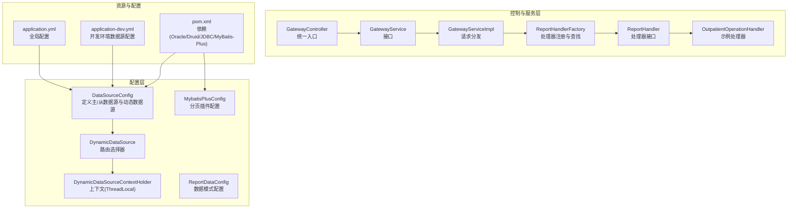
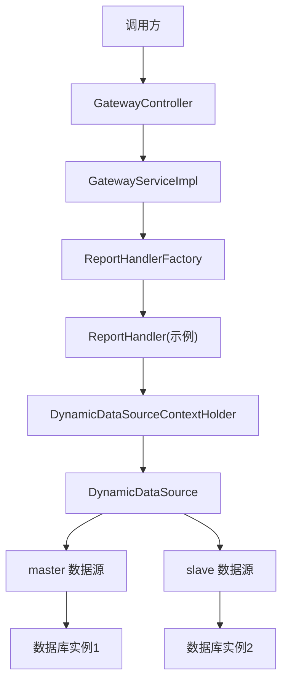
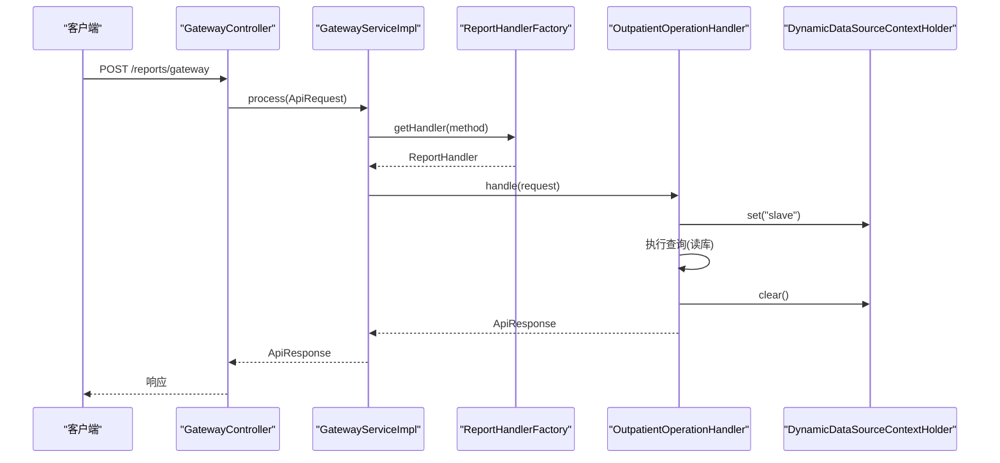
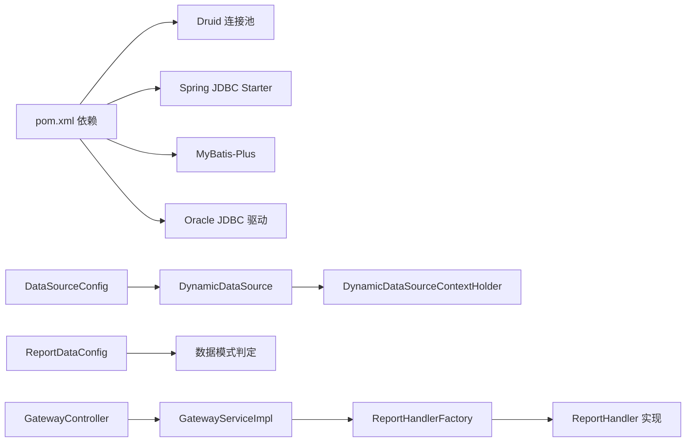

# 数据源扩展开发

<cite>
**本文引用的文件**
- [DataSourceConfig.java](file://src/main/java/com/reports/config/DataSourceConfig.java)
- [DynamicDataSource.java](file://src/main/java/com/reports/config/DynamicDataSource.java)
- [DynamicDataSourceContextHolder.java](file://src/main/java/com/reports/config/DynamicDataSourceContextHolder.java)
- [MybatisPlusConfig.java](file://src/main/java/com/reports/config/MybatisPlusConfig.java)
- [ReportDataConfig.java](file://src/main/java/com/reports/config/ReportDataConfig.java)
- [application.yml](file://src/main/resources/application.yml)
- [application-dev.yml](file://src/main/resources/application-dev.yml)
- [GatewayController.java](file://src/main/java/com/reports/controller/GatewayController.java)
- [GatewayService.java](file://src/main/java/com/reports/service/GatewayService.java)
- [GatewayServiceImpl.java](file://src/main/java/com/reports/service/impl/GatewayServiceImpl.java)
- [ReportHandler.java](file://src/main/java/com/reports/service/handler/ReportHandler.java)
- [ReportHandlerFactory.java](file://src/main/java/com/reports/service/handler/ReportHandlerFactory.java)
- [OutpatientOperationHandler.java](file://src/main/java/com/reports/service/handler/impl/OutpatientOperationHandler.java)
- [DataSourceException.java](file://src/main/java/com/reports/exception/DataSourceException.java)
- [MdcUtil.java](file://src/main/java/com/reports/util/MdcUtil.java)
- [pom.xml](file://pom.xml)
</cite>

## 目录
1. [简介](#简介)
2. [项目结构](#项目结构)
3. [核心组件](#核心组件)
4. [架构总览](#架构总览)
5. [详细组件分析](#详细组件分析)
6. [依赖关系分析](#依赖关系分析)
7. [性能考虑](#性能考虑)
8. [故障排查指南](#故障排查指南)
9. [结论](#结论)
10. [附录](#附录)

## 简介
本指南面向需要在现有系统中新增数据源类型的开发者，提供从配置文件到代码实现的完整流程，涵盖：
- 新增数据源类型：数据源配置类创建、连接池配置、注册与装配
- 动态数据源切换机制：上下文管理器、路由选择器、默认数据源策略
- 数据源上下文管理器的使用：设置、获取、清理
- 事务管理与最佳实践：线程隔离、异常处理、资源释放
- 测试验证方法：接口测试、日志追踪、模式切换

目标是帮助你在不破坏现有功能的前提下，安全地扩展多数据源能力。

## 项目结构
该项目采用基于包的分层组织方式，核心与数据源相关的模块集中在 config 包，业务处理通过控制器-服务-处理器工厂的链路完成。

**图表来源**
- [DataSourceConfig.java:18-53](file://src/main/java/com/reports/config/DataSourceConfig.java#L18-L53)
- [DynamicDataSource.java:8-15](file://src/main/java/com/reports/config/DynamicDataSource.java#L8-L15)
- [DynamicDataSourceContextHolder.java:6-37](file://src/main/java/com/reports/config/DynamicDataSourceContextHolder.java#L6-L37)
- [MybatisPlusConfig.java:13-27](file://src/main/java/com/reports/config/MybatisPlusConfig.java#L13-L27)
- [ReportDataConfig.java:12-44](file://src/main/java/com/reports/config/ReportDataConfig.java#L12-L44)
- [GatewayController.java:16-37](file://src/main/java/com/reports/controller/GatewayController.java#L16-L37)
- [GatewayService.java:9-16](file://src/main/java/com/reports/service/GatewayService.java#L9-L16)
- [GatewayServiceImpl.java:18-50](file://src/main/java/com/reports/service/impl/GatewayServiceImpl.java#L18-L50)
- [ReportHandlerFactory.java:19-73](file://src/main/java/com/reports/service/handler/ReportHandlerFactory.java#L19-L73)
- [OutpatientOperationHandler.java:19-64](file://src/main/java/com/reports/service/handler/impl/OutpatientOperationHandler.java#L19-L64)
- [application.yml:1-32](file://src/main/resources/application.yml#L1-L32)
- [application-dev.yml:1-45](file://src/main/resources/application-dev.yml#L1-L45)
- [pom.xml:40-82](file://pom.xml#L40-L82)

**章节来源**
- [application.yml:1-32](file://src/main/resources/application.yml#L1-L32)
- [application-dev.yml:1-45](file://src/main/resources/application-dev.yml#L1-L45)
- [pom.xml:40-82](file://pom.xml#L40-L82)

## 核心组件
- 数据源配置类：负责定义主/从数据源 Bean，并将它们注册到动态数据源中，同时设置默认数据源。
- 动态数据源路由：继承 Spring 的 AbstractRoutingDataSource，根据上下文中的键值进行数据源路由。
- 上下文管理器：使用 ThreadLocal 存储当前线程的数据源标识，提供设置、获取、清理能力。
- MyBatis-Plus 配置：启用分页插件与映射扫描，适配 Oracle 数据库。
- 报表数据模式配置：通过配置项控制数据访问模式（mock/jdbc/mybatis-plus），便于测试与切换。
- 控制器与服务：统一入口接收请求，服务层进行方法分发，处理器工厂按 method 注册与查找处理器。
- 异常与工具：自定义数据源异常类型，MDC 工具类用于链路追踪。

**章节来源**
- [DataSourceConfig.java:18-53](file://src/main/java/com/reports/config/DataSourceConfig.java#L18-L53)
- [DynamicDataSource.java:8-15](file://src/main/java/com/reports/config/DynamicDataSource.java#L8-L15)
- [DynamicDataSourceContextHolder.java:6-37](file://src/main/java/com/reports/config/DynamicDataSourceContextHolder.java#L6-L37)
- [MybatisPlusConfig.java:13-27](file://src/main/java/com/reports/config/MybatisPlusConfig.java#L13-L27)
- [ReportDataConfig.java:12-44](file://src/main/java/com/reports/config/ReportDataConfig.java#L12-L44)
- [GatewayController.java:16-37](file://src/main/java/com/reports/controller/GatewayController.java#L16-L37)
- [GatewayServiceImpl.java:18-50](file://src/main/java/com/reports/service/impl/GatewayServiceImpl.java#L18-L50)
- [ReportHandlerFactory.java:19-73](file://src/main/java/com/reports/service/handler/ReportHandlerFactory.java#L19-L73)
- [DataSourceException.java:9-27](file://src/main/java/com/reports/exception/DataSourceException.java#L9-L27)
- [MdcUtil.java:8-33](file://src/main/java/com/reports/util/MdcUtil.java#L8-L33)

## 架构总览
系统通过 Spring Boot 自动装配加载数据源配置，动态数据源作为 Primary Bean 对外暴露；业务层通过上下文管理器在执行期间切换数据源键值，从而实现读写分离或跨库查询。

**图表来源**
- [GatewayController.java:16-37](file://src/main/java/com/reports/controller/GatewayController.java#L16-L37)
- [GatewayServiceImpl.java:29-48](file://src/main/java/com/reports/service/impl/GatewayServiceImpl.java#L29-L48)
- [ReportHandlerFactory.java:31-64](file://src/main/java/com/reports/service/handler/ReportHandlerFactory.java#L31-L64)
- [OutpatientOperationHandler.java:33-62](file://src/main/java/com/reports/service/handler/impl/OutpatientOperationHandler.java#L33-L62)
- [DynamicDataSourceContextHolder.java:18-35](file://src/main/java/com/reports/config/DynamicDataSourceContextHolder.java#L18-L35)
- [DynamicDataSource.java:10-13](file://src/main/java/com/reports/config/DynamicDataSource.java#L10-L13)
- [DataSourceConfig.java:40-53](file://src/main/java/com/reports/config/DataSourceConfig.java#L40-L53)

## 详细组件分析

### 数据源配置类（DataSourceConfig）
职责
- 定义主数据源 Bean（masterDataSource）
- 定义从数据源 Bean（slaveDataSource）
- 创建动态数据源 Bean（dynamicDataSource），注入主/从数据源，并设置默认数据源为 master

关键点
- 使用 @ConfigurationProperties 绑定 spring.datasource.master 与 spring.datasource.slave
- 使用 @Primary 标注动态数据源为默认数据源
- 通过 AbstractRoutingDataSource 的子类 DynamicDataSource 实现路由

复杂度与性能
- 初始化阶段 O(N) 注册目标数据源，N 为数据源数量
- 运行时路由开销极低，仅涉及 ThreadLocal 读取与 Map 查找

最佳实践
- 为每个数据源配置独立的 Druid 参数，避免共享连接池导致的资源争用
- 默认数据源建议指向只读副本，保证读写分离的一致性

**章节来源**
- [DataSourceConfig.java:18-53](file://src/main/java/com/reports/config/DataSourceConfig.java#L18-L53)
- [application-dev.yml:4-38](file://src/main/resources/application-dev.yml#L4-L38)

### 动态数据源路由（DynamicDataSource）
职责
- 继承 AbstractRoutingDataSource 并重写 determineCurrentLookupKey
- 从上下文管理器获取当前数据源键值，作为 lookup key

运行机制
- Spring 在获取连接时调用 determineCurrentLookupKey
- 根据返回的键值从 targetDataSources 中选择对应数据源

**章节来源**
- [DynamicDataSource.java:8-15](file://src/main/java/com/reports/config/DynamicDataSource.java#L8-L15)
- [DynamicDataSourceContextHolder.java:24-28](file://src/main/java/com/reports/config/DynamicDataSourceContextHolder.java#L24-L28)

### 数据源上下文管理器（DynamicDataSourceContextHolder）
职责
- 提供线程隔离的数据源键值存储
- 提供 set/get/clear 方法
- 默认数据源键值为 "master"

注意事项
- 必须在 finally 块中调用 clear，防止线程复用导致的数据源泄漏
- 在异步场景中，注意传递上下文或显式设置/清理

**章节来源**
- [DynamicDataSourceContextHolder.java:6-37](file://src/main/java/com/reports/config/DynamicDataSourceContextHolder.java#L6-L37)

### MyBatis-Plus 配置（MybatisPlusConfig）
职责
- 开启分页插件，针对 Oracle 数据库设置分页内核
- 扫描 Mapper 接口路径

适用场景
- 当数据模式为 mybatis-plus 时生效
- 与动态数据源配合，实现跨库分页查询

**章节来源**
- [MybatisPlusConfig.java:13-27](file://src/main/java/com/reports/config/MybatisPlusConfig.java#L13-L27)

### 报表数据模式配置（ReportDataConfig）
职责
- 读取 reports.data.mode 配置
- 提供 isMock/isJdbc/isMybatisPlus 判定方法

典型用法
- 在处理器或服务中根据模式选择不同的数据访问策略
- 支持在不同环境快速切换数据来源

**章节来源**
- [ReportDataConfig.java:12-44](file://src/main/java/com/reports/config/ReportDataConfig.java#L12-L44)
- [application.yml:21-23](file://src/main/resources/application.yml#L21-L23)

### 控制器与服务链路
职责
- GatewayController：统一入口，接收请求并交由服务处理
- GatewayServiceImpl：校验请求、解析 method、通过工厂获取处理器并执行
- ReportHandlerFactory：自动扫描并注册带 @MethodMapping 注解的处理器
- OutpatientOperationHandler：示例处理器，演示如何在业务中切换数据源

**图表来源**
- [GatewayController.java:31-35](file://src/main/java/com/reports/controller/GatewayController.java#L31-L35)
- [GatewayServiceImpl.java:31-47](file://src/main/java/com/reports/service/impl/GatewayServiceImpl.java#L31-L47)
- [ReportHandlerFactory.java:57-64](file://src/main/java/com/reports/service/handler/ReportHandlerFactory.java#L57-L64)
- [OutpatientOperationHandler.java:33-62](file://src/main/java/com/reports/service/handler/impl/OutpatientOperationHandler.java#L33-L62)
- [DynamicDataSourceContextHolder.java:18-35](file://src/main/java/com/reports/config/DynamicDataSourceContextHolder.java#L18-L35)

**章节来源**
- [GatewayController.java:16-37](file://src/main/java/com/reports/controller/GatewayController.java#L16-L37)
- [GatewayService.java:9-16](file://src/main/java/com/reports/service/GatewayService.java#L9-L16)
- [GatewayServiceImpl.java:18-50](file://src/main/java/com/reports/service/impl/GatewayServiceImpl.java#L18-L50)
- [ReportHandlerFactory.java:19-73](file://src/main/java/com/reports/service/handler/ReportHandlerFactory.java#L19-L73)
- [OutpatientOperationHandler.java:19-64](file://src/main/java/com/reports/service/handler/impl/OutpatientOperationHandler.java#L19-L64)

### 异常与工具
- DataSourceException：封装数据源相关错误码与消息
- MdcUtil：提供 TraceId 的设置、获取与清理，便于链路追踪

**章节来源**
- [DataSourceException.java:9-27](file://src/main/java/com/reports/exception/DataSourceException.java#L9-L27)
- [MdcUtil.java:8-33](file://src/main/java/com/reports/util/MdcUtil.java#L8-L33)

## 依赖关系分析
- DataSourceConfig 依赖 Druid 连接池与 Spring Boot 配置属性绑定
- DynamicDataSource 依赖 Spring JDBC 的 AbstractRoutingDataSource
- ReportDataConfig 依赖 Spring Boot 配置属性绑定
- MybatisPlusConfig 依赖 MyBatis-Plus 插件与 Oracle 数据库类型
- 控制器与服务依赖 Spring MVC 与 Spring 容器

**图表来源**
- [pom.xml:40-82](file://pom.xml#L40-L82)
- [DataSourceConfig.java:18-53](file://src/main/java/com/reports/config/DataSourceConfig.java#L18-L53)
- [DynamicDataSource.java:8-15](file://src/main/java/com/reports/config/DynamicDataSource.java#L8-L15)
- [DynamicDataSourceContextHolder.java:6-37](file://src/main/java/com/reports/config/DynamicDataSourceContextHolder.java#L6-L37)
- [ReportDataConfig.java:12-44](file://src/main/java/com/reports/config/ReportDataConfig.java#L12-L44)
- [GatewayController.java:16-37](file://src/main/java/com/reports/controller/GatewayController.java#L16-L37)
- [GatewayServiceImpl.java:18-50](file://src/main/java/com/reports/service/impl/GatewayServiceImpl.java#L18-L50)
- [ReportHandlerFactory.java:19-73](file://src/main/java/com/reports/service/handler/ReportHandlerFactory.java#L19-L73)

**章节来源**
- [pom.xml:40-82](file://pom.xml#L40-L82)

## 性能考虑
- 连接池参数：合理设置初始大小、最大活跃数、等待时间与空闲回收周期，避免连接争用与泄露
- 路由开销：动态数据源路由为常量级开销，影响可忽略
- 事务边界：确保在切换数据源后及时清理上下文，避免跨事务污染
- 读写分离：将只读查询路由至从库，写操作保持在主库，提升整体吞吐
- 分页策略：MyBatis-Plus 分页插件对 Oracle 优化，减少全表扫描

[本节为通用指导，无需特定文件来源]

## 故障排查指南
常见问题与定位步骤
- 数据源无法切换
  - 检查上下文是否正确 set/clear
  - 确认动态数据源已注册为 @Primary
  - 核对 application-dev.yml 中数据源配置键名与 DataSourceConfig 一致
- 连接失败或超时
  - 检查驱动类名、URL、用户名密码
  - 调整 Druid 连接池参数（initial-size/min-idle/max-active/max-wait）
- 事务异常
  - 确保在 finally 块中清理上下文
  - 避免跨数据源事务
- 处理器未找到
  - 确认 @MethodMapping 注解与方法字符串匹配
  - 检查工厂初始化日志，确认处理器已注册

**章节来源**
- [DynamicDataSourceContextHolder.java:18-35](file://src/main/java/com/reports/config/DynamicDataSourceContextHolder.java#L18-L35)
- [DataSourceConfig.java:40-53](file://src/main/java/com/reports/config/DataSourceConfig.java#L40-L53)
- [application-dev.yml:4-38](file://src/main/resources/application-dev.yml#L4-L38)
- [ReportHandlerFactory.java:31-52](file://src/main/java/com/reports/service/handler/ReportHandlerFactory.java#L31-L52)
- [GatewayServiceImpl.java:31-47](file://src/main/java/com/reports/service/impl/GatewayServiceImpl.java#L31-L47)

## 结论
通过以上组件与流程，系统实现了灵活的多数据源扩展能力。新增数据源类型的关键在于：
- 在配置文件中添加新的数据源段落
- 在 DataSourceConfig 中注册新数据源 Bean，并将其加入动态数据源的目标集合
- 在业务逻辑中使用上下文管理器进行数据源切换
- 结合 ReportDataConfig 与 MyBatis-Plus 配置，实现不同模式下的数据访问

遵循本文的最佳实践，可在保证稳定性的同时，平滑扩展数据源能力。

[本节为总结，无需特定文件来源]

## 附录

### 新增数据源类型的完整流程
- 步骤 1：在配置文件中新增数据源段落
  - 参考键名与参数：driver-class-name、url、username、password、type、initial-size、min-idle、max-active、max-wait、validation-query、test-while-idle 等
  - 参考路径：[application-dev.yml:4-38](file://src/main/resources/application-dev.yml#L4-L38)
- 步骤 2：在 DataSourceConfig 中注册新数据源 Bean
  - 添加 @Bean(...) 方法，使用 @ConfigurationProperties 绑定新段落前缀
  - 在 dynamicDataSource 中将新数据源加入 targetDataSources，并设置默认数据源
  - 参考路径：[DataSourceConfig.java:23-53](file://src/main/java/com/reports/config/DataSourceConfig.java#L23-L53)
- 步骤 3：在业务中使用上下文管理器切换数据源
  - 在执行前 set("新数据源键")，结束后 clear()
  - 参考路径：[DynamicDataSourceContextHolder.java:18-35](file://src/main/java/com/reports/config/DynamicDataSourceContextHolder.java#L18-L35)
- 步骤 4：可选，启用 MyBatis-Plus 或调整数据模式
  - 修改 reports.data.mode，或在处理器中按需使用 JdbcTemplate/MyBatis-Plus
  - 参考路径：[ReportDataConfig.java:12-44](file://src/main/java/com/reports/config/ReportDataConfig.java#L12-L44)，[MybatisPlusConfig.java:13-27](file://src/main/java/com/reports/config/MybatisPlusConfig.java#L13-L27)

### 配置示例（片段）
- application-dev.yml 中新增数据源段落
  - 参考路径：[application-dev.yml:22-38](file://src/main/resources/application-dev.yml#L22-L38)
- application.yml 中数据模式
  - 参考路径：[application.yml:21-23](file://src/main/resources/application.yml#L21-L23)

### 代码模板（路径）
- 新增数据源 Bean 注册模板：[DataSourceConfig.java:23-53](file://src/main/java/com/reports/config/DataSourceConfig.java#L23-L53)
- 数据源切换模板（在处理器或服务中）：[DynamicDataSourceContextHolder.java:18-35](file://src/main/java/com/reports/config/DynamicDataSourceContextHolder.java#L18-L35)
- MyBatis-Plus 分页插件模板：[MybatisPlusConfig.java:13-27](file://src/main/java/com/reports/config/MybatisPlusConfig.java#L13-L27)

### 测试验证方法
- 启动项目
  - 参考命令：mvn spring-boot:run
  - 参考路径：[application.yml:1-32](file://src/main/resources/application.yml#L1-L32)
- 接口测试
  - 使用 curl 或 Postman 调用统一网关接口，传入 method 与 body
  - 参考路径：[GatewayController.java:31-35](file://src/main/java/com/reports/controller/GatewayController.java#L31-L35)
- 日志与追踪
  - 通过 MDC 输出 TraceId，结合日志级别定位问题
  - 参考路径：[MdcUtil.java:8-33](file://src/main/java/com/reports/util/MdcUtil.java#L8-L33)，[application.yml:26-31](file://src/main/resources/application.yml#L26-L31)