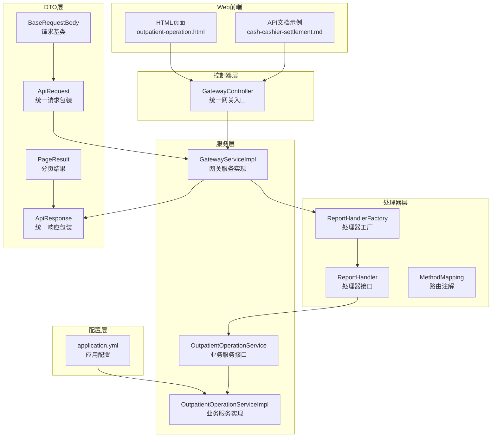
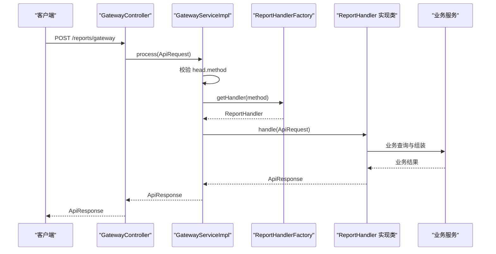
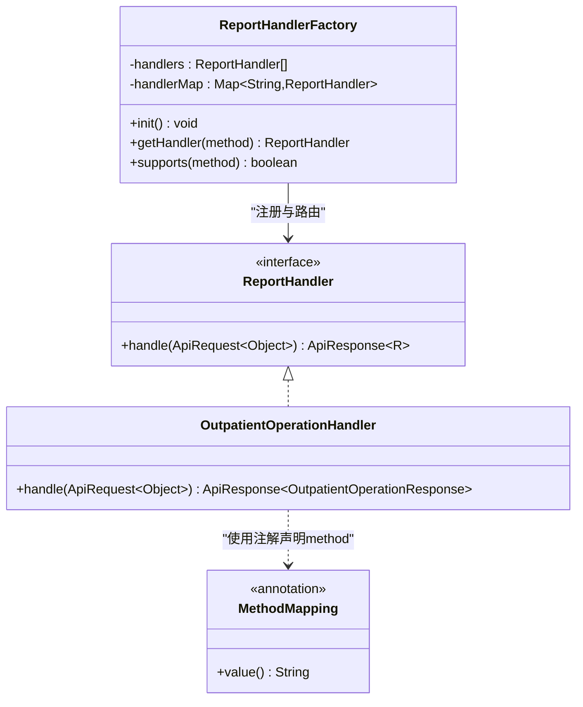
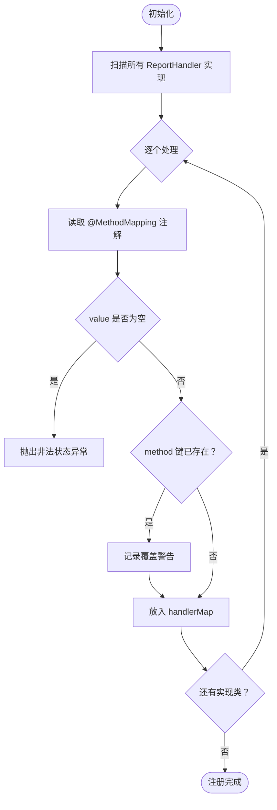
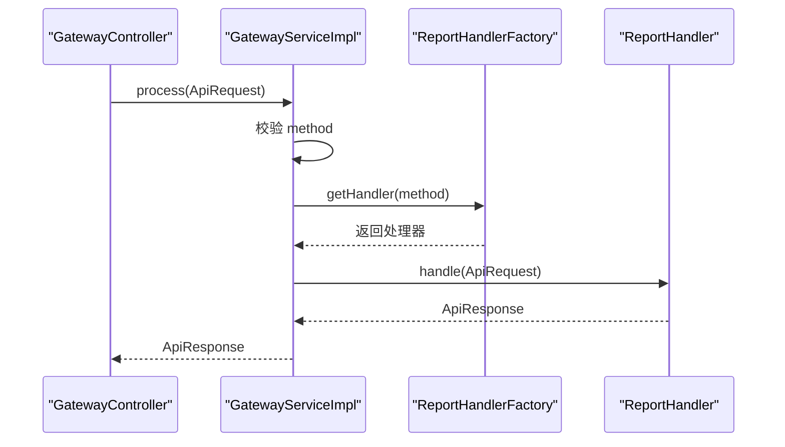
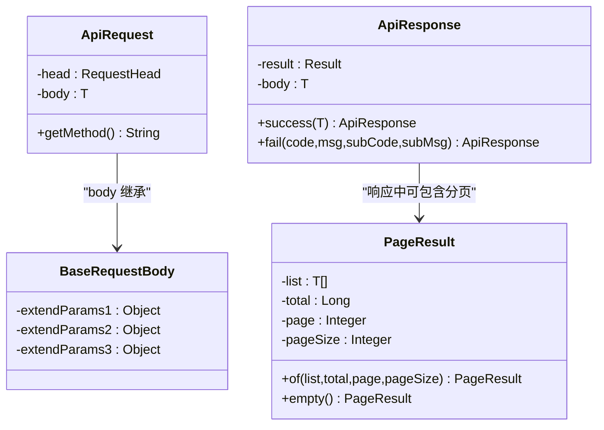
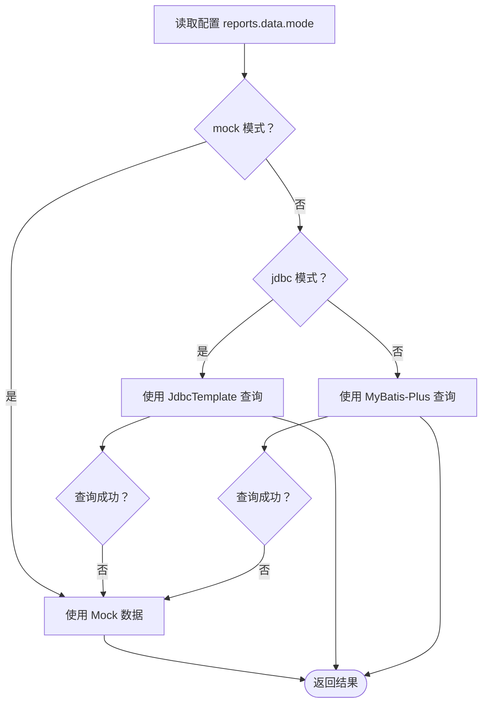
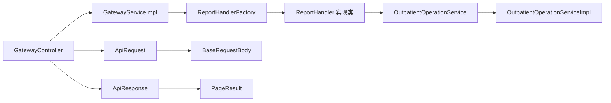

# 新增报告类型开发

<cite>
**本文档引用的文件**
- [ReportHandler.java](file://src/main/java/com/reports/service/handler/ReportHandler.java)
- [MethodMapping.java](file://src/main/java/com/reports/service/handler/MethodMapping.java)
- [ReportHandlerFactory.java](file://src/main/java/com/reports/service/handler/ReportHandlerFactory.java)
- [GatewayController.java](file://src/main/java/com/reports/controller/GatewayController.java)
- [GatewayServiceImpl.java](file://src/main/java/com/reports/service/impl/GatewayServiceImpl.java)
- [ApiRequest.java](file://src/main/java/com/reports/dto/common/ApiRequest.java)
- [ApiResponse.java](file://src/main/java/com/reports/dto/common/ApiResponse.java)
- [BaseRequestBody.java](file://src/main/java/com/reports/dto/common/BaseRequestBody.java)
- [PageResult.java](file://src/main/java/com/reports/dto/common/PageResult.java)
- [OutpatientOperationHandler.java](file://src/main/java/com/reports/service/handler/impl/OutpatientOperationHandler.java)
- [OutpatientOperationRequest.java](file://src/main/java/com/reports/dto/request/OutpatientOperationRequest.java)
- [OutpatientOperationResponse.java](file://src/main/java/com/reports/dto/response/OutpatientOperationResponse.java)
- [OutpatientOperationService.java](file://src/main/java/com/reports/service/OutpatientOperationService.java)
- [OutpatientOperationServiceImpl.java](file://src/main/java/com/reports/service/impl/OutpatientOperationServiceImpl.java)
- [application.yml](file://src/main/resources/application.yml)
- [cash-cashier-settlement.md](file://reports-web/api/cash-cashier-settlement.md)
- [outpatient-operation.html](file://reports-web/outpatient/outpatient-operation.html)
</cite>

## 目录
1. [简介](#简介)
2. [项目结构](#项目结构)
3. [核心组件](#核心组件)
4. [架构总览](#架构总览)
5. [详细组件分析](#详细组件分析)
6. [依赖关系分析](#依赖关系分析)
7. [性能考虑](#性能考虑)
8. [故障排除指南](#故障排除指南)
9. [结论](#结论)
10. [附录](#附录)

## 简介
本指南面向希望在现有报告系统中新增一种报告类型的开发者，提供从零到一的完整开发流程与最佳实践。系统采用统一网关入口，基于注解驱动的处理器工厂实现动态路由分发，支持多种数据获取模式（Mock/JDBC/MyBatis-Plus）。本文将详细说明如何实现新的报告处理器，包括接口实现、注解使用、请求响应DTO设计、注册机制与动态路由原理，并给出开发步骤、模板参考、常见问题与测试验证建议。

## 项目结构
系统采用分层架构与功能模块化组织：
- 控制器层：统一网关入口，接收请求并转发给服务层
- 服务层：网关服务负责校验与路由，业务服务负责数据查询与组装
- 处理器层：定义统一接口与注解，工厂自动注册与路由
- DTO层：统一请求/响应包装与分页模型
- 配置层：数据源与应用配置
- Web前端：HTML页面与API示例文档

**图示来源**
- [GatewayController.java:1-38](file://src/main/java/com/reports/controller/GatewayController.java#L1-L38)
- [GatewayServiceImpl.java:1-51](file://src/main/java/com/reports/service/impl/GatewayServiceImpl.java#L1-L51)
- [ReportHandler.java:1-28](file://src/main/java/com/reports/service/handler/ReportHandler.java#L1-L28)
- [MethodMapping.java:1-29](file://src/main/java/com/reports/service/handler/MethodMapping.java#L1-L29)
- [ReportHandlerFactory.java:1-74](file://src/main/java/com/reports/service/handler/ReportHandlerFactory.java#L1-L74)
- [ApiRequest.java:1-35](file://src/main/java/com/reports/dto/common/ApiRequest.java#L1-L35)
- [ApiResponse.java:1-57](file://src/main/java/com/reports/dto/common/ApiResponse.java#L1-L57)
- [BaseRequestBody.java:1-31](file://src/main/java/com/reports/dto/common/BaseRequestBody.java#L1-L31)
- [PageResult.java:1-64](file://src/main/java/com/reports/dto/common/PageResult.java#L1-L64)
- [OutpatientOperationService.java:1-24](file://src/main/java/com/reports/service/OutpatientOperationService.java#L1-L24)
- [OutpatientOperationServiceImpl.java:1-253](file://src/main/java/com/reports/service/impl/OutpatientOperationServiceImpl.java#L1-L253)
- [application.yml:1-32](file://src/main/resources/application.yml#L1-L32)
- [cash-cashier-settlement.md:1-153](file://reports-web/api/cash-cashier-settlement.md#L1-L153)
- [outpatient-operation.html:1-228](file://reports-web/outpatient/outpatient-operation.html#L1-L228)

**章节来源**
- [GatewayController.java:1-38](file://src/main/java/com/reports/controller/GatewayController.java#L1-L38)
- [GatewayServiceImpl.java:1-51](file://src/main/java/com/reports/service/impl/GatewayServiceImpl.java#L1-L51)
- [ReportHandlerFactory.java:1-74](file://src/main/java/com/reports/service/handler/ReportHandlerFactory.java#L1-L74)
- [application.yml:1-32](file://src/main/resources/application.yml#L1-L32)

## 核心组件
本节概述新增报告类型所需的核心组件及其职责：
- 报告处理器接口：定义统一的处理契约
- 路由注解：声明处理器对应的method键
- 处理器工厂：自动扫描与注册处理器，提供动态路由
- 网关控制器与服务：统一入口与请求分发
- DTO模型：统一请求/响应与分页封装
- 业务服务：数据查询与结果组装

**章节来源**
- [ReportHandler.java:1-28](file://src/main/java/com/reports/service/handler/ReportHandler.java#L1-L28)
- [MethodMapping.java:1-29](file://src/main/java/com/reports/service/handler/MethodMapping.java#L1-L29)
- [ReportHandlerFactory.java:1-74](file://src/main/java/com/reports/service/handler/ReportHandlerFactory.java#L1-L74)
- [GatewayController.java:1-38](file://src/main/java/com/reports/controller/GatewayController.java#L1-L38)
- [GatewayServiceImpl.java:1-51](file://src/main/java/com/reports/service/impl/GatewayServiceImpl.java#L1-L51)
- [ApiRequest.java:1-35](file://src/main/java/com/reports/dto/common/ApiRequest.java#L1-L35)
- [ApiResponse.java:1-57](file://src/main/java/com/reports/dto/common/ApiResponse.java#L1-L57)
- [PageResult.java:1-64](file://src/main/java/com/reports/dto/common/PageResult.java#L1-L64)

## 架构总览
系统通过统一网关接收请求，解析method后交由处理器工厂查找对应处理器，最终由处理器委托业务服务完成数据查询与组装，返回统一响应。

**图示来源**
- [GatewayController.java:28-35](file://src/main/java/com/reports/controller/GatewayController.java#L28-L35)
- [GatewayServiceImpl.java:29-48](file://src/main/java/com/reports/service/impl/GatewayServiceImpl.java#L29-L48)
- [ReportHandlerFactory.java:54-64](file://src/main/java/com/reports/service/handler/ReportHandlerFactory.java#L54-L64)
- [ReportHandler.java:21-25](file://src/main/java/com/reports/service/handler/ReportHandler.java#L21-L25)

**章节来源**
- [GatewayController.java:1-38](file://src/main/java/com/reports/controller/GatewayController.java#L1-L38)
- [GatewayServiceImpl.java:1-51](file://src/main/java/com/reports/service/impl/GatewayServiceImpl.java#L1-L51)
- [ReportHandlerFactory.java:1-74](file://src/main/java/com/reports/service/handler/ReportHandlerFactory.java#L1-L74)
- [ReportHandler.java:1-28](file://src/main/java/com/reports/service/handler/ReportHandler.java#L1-L28)

## 详细组件分析

### 报告处理器接口与注解
- 接口职责：定义handle方法，接收统一请求对象并返回统一响应对象
- 注解职责：在实现类上声明method键，工厂自动读取用于注册与路由
- 设计要点：泛型约束请求/响应类型；请求body可能为LinkedHashMap，需在处理器内转换

**图示来源**
- [ReportHandler.java:19-27](file://src/main/java/com/reports/service/handler/ReportHandler.java#L19-L27)
- [MethodMapping.java:21-28](file://src/main/java/com/reports/service/handler/MethodMapping.java#L21-L28)
- [ReportHandlerFactory.java:21-73](file://src/main/java/com/reports/service/handler/ReportHandlerFactory.java#L21-L73)
- [OutpatientOperationHandler.java:22-31](file://src/main/java/com/reports/service/handler/impl/OutpatientOperationHandler.java#L22-L31)

**章节来源**
- [ReportHandler.java:1-28](file://src/main/java/com/reports/service/handler/ReportHandler.java#L1-L28)
- [MethodMapping.java:1-29](file://src/main/java/com/reports/service/handler/MethodMapping.java#L1-L29)
- [ReportHandlerFactory.java:1-74](file://src/main/java/com/reports/service/handler/ReportHandlerFactory.java#L1-L74)
- [OutpatientOperationHandler.java:1-65](file://src/main/java/com/reports/service/handler/impl/OutpatientOperationHandler.java#L1-L65)

### 处理器工厂注册机制与动态路由
- 自动扫描：构造函数注入所有ReportHandler实现
- 初始化注册：遍历实现类，读取MethodMapping注解的value作为method键，存入并发映射表
- 冲突处理：重复method键时记录警告并覆盖
- 动态路由：根据请求method键从映射表获取对应处理器实例

**图示来源**
- [ReportHandlerFactory.java:31-52](file://src/main/java/com/reports/service/handler/ReportHandlerFactory.java#L31-L52)

**章节来源**
- [ReportHandlerFactory.java:1-74](file://src/main/java/com/reports/service/handler/ReportHandlerFactory.java#L1-L74)

### 网关服务与统一入口
- 请求校验：确保ApiRequest与head.method非空
- 路由分发：通过工厂获取处理器并执行handle
- 异常处理：对缺失method或未知method抛出业务异常

**图示来源**
- [GatewayController.java:31-35](file://src/main/java/com/reports/controller/GatewayController.java#L31-L35)
- [GatewayServiceImpl.java:29-48](file://src/main/java/com/reports/service/impl/GatewayServiceImpl.java#L29-L48)
- [ReportHandlerFactory.java:54-64](file://src/main/java/com/reports/service/handler/ReportHandlerFactory.java#L54-L64)

**章节来源**
- [GatewayController.java:1-38](file://src/main/java/com/reports/controller/GatewayController.java#L1-L38)
- [GatewayServiceImpl.java:1-51](file://src/main/java/com/reports/service/impl/GatewayServiceImpl.java#L1-L51)

### 请求响应DTO设计
- 统一请求包装：包含head与body，提供getMethod便捷访问
- 统一响应包装：包含result与body，提供成功/失败静态工厂方法
- 分页封装：提供of与empty工厂方法，简化分页结果构建
- 请求基类：扩展参数占位，便于后续扩展

**图示来源**
- [ApiRequest.java:13-34](file://src/main/java/com/reports/dto/common/ApiRequest.java#L13-L34)
- [ApiResponse.java:13-56](file://src/main/java/com/reports/dto/common/ApiResponse.java#L13-L56)
- [PageResult.java:15-63](file://src/main/java/com/reports/dto/common/PageResult.java#L15-L63)
- [BaseRequestBody.java:11-30](file://src/main/java/com/reports/dto/common/BaseRequestBody.java#L11-L30)

**章节来源**
- [ApiRequest.java:1-35](file://src/main/java/com/reports/dto/common/ApiRequest.java#L1-L35)
- [ApiResponse.java:1-57](file://src/main/java/com/reports/dto/common/ApiResponse.java#L1-L57)
- [PageResult.java:1-64](file://src/main/java/com/reports/dto/common/PageResult.java#L1-L64)
- [BaseRequestBody.java:1-31](file://src/main/java/com/reports/dto/common/BaseRequestBody.java#L1-L31)

### 业务服务与数据模式
- 业务服务接口：定义概览与表格查询方法
- 业务服务实现：支持三种数据模式（Mock/JDBC/MyBatis-Plus），通过配置切换
- 模式回退：JDBC/MyBatis-Plus失败时回退到Mock，保证可用性

**图示来源**
- [OutpatientOperationServiceImpl.java:47-73](file://src/main/java/com/reports/service/impl/OutpatientOperationServiceImpl.java#L47-L73)
- [application.yml:21-23](file://src/main/resources/application.yml#L21-L23)

**章节来源**
- [OutpatientOperationService.java:1-24](file://src/main/java/com/reports/service/OutpatientOperationService.java#L1-L24)
- [OutpatientOperationServiceImpl.java:1-253](file://src/main/java/com/reports/service/impl/OutpatientOperationServiceImpl.java#L1-L253)
- [application.yml:1-32](file://src/main/resources/application.yml#L1-L32)

## 依赖关系分析
- 控制器依赖网关服务
- 网关服务依赖处理器工厂
- 处理器实现依赖业务服务
- 业务服务依赖配置与数据访问层
- DTO层被控制器、处理器、服务广泛使用

**图示来源**
- [GatewayController.java:1-38](file://src/main/java/com/reports/controller/GatewayController.java#L1-L38)
- [GatewayServiceImpl.java:1-51](file://src/main/java/com/reports/service/impl/GatewayServiceImpl.java#L1-L51)
- [ReportHandlerFactory.java:1-74](file://src/main/java/com/reports/service/handler/ReportHandlerFactory.java#L1-L74)
- [OutpatientOperationService.java:1-24](file://src/main/java/com/reports/service/OutpatientOperationService.java#L1-L24)
- [OutpatientOperationServiceImpl.java:1-253](file://src/main/java/com/reports/service/impl/OutpatientOperationServiceImpl.java#L1-L253)
- [ApiRequest.java:1-35](file://src/main/java/com/reports/dto/common/ApiRequest.java#L1-L35)
- [ApiResponse.java:1-57](file://src/main/java/com/reports/dto/common/ApiResponse.java#L1-L57)
- [BaseRequestBody.java:1-31](file://src/main/java/com/reports/dto/common/BaseRequestBody.java#L1-L31)
- [PageResult.java:1-64](file://src/main/java/com/reports/dto/common/PageResult.java#L1-L64)

**章节来源**
- [GatewayController.java:1-38](file://src/main/java/com/reports/controller/GatewayController.java#L1-L38)
- [GatewayServiceImpl.java:1-51](file://src/main/java/com/reports/service/impl/GatewayServiceImpl.java#L1-L51)
- [ReportHandlerFactory.java:1-74](file://src/main/java/com/reports/service/handler/ReportHandlerFactory.java#L1-L74)
- [OutpatientOperationService.java:1-24](file://src/main/java/com/reports/service/OutpatientOperationService.java#L1-L24)
- [OutpatientOperationServiceImpl.java:1-253](file://src/main/java/com/reports/service/impl/OutpatientOperationServiceImpl.java#L1-L253)
- [ApiRequest.java:1-35](file://src/main/java/com/reports/dto/common/ApiRequest.java#L1-L35)
- [ApiResponse.java:1-57](file://src/main/java/com/reports/dto/common/ApiResponse.java#L1-L57)
- [BaseRequestBody.java:1-31](file://src/main/java/com/reports/dto/common/BaseRequestBody.java#L1-L31)
- [PageResult.java:1-64](file://src/main/java/com/reports/dto/common/PageResult.java#L1-L64)

## 性能考虑
- 并发安全：处理器映射使用ConcurrentHashMap，支持高并发路由查找
- 序列化开销：统一请求/响应DTO均实现序列化接口，注意避免不必要的大对象传输
- 分页策略：合理设置pageSize，避免一次性返回大量数据
- 数据模式选择：生产环境优先JDBC/MyBatis-Plus，Mock仅用于开发调试
- 回退机制：JDBC/MyBatis-Plus失败自动回退Mock，保障系统稳定性

## 故障排除指南
- 缺少@MethodMapping注解：工厂初始化时会抛出非法状态异常，需在处理器实现类上添加注解并指定唯一method键
- method键为空：注解value不能为空，否则抛出非法状态异常
- method键冲突：重复注册同一method键会记录警告并覆盖旧处理器
- 请求method缺失：网关服务会抛出参数缺失异常
- 未知method：工厂不支持该method键时抛出方法不存在异常
- 数据查询失败：JDBC/MyBatis-Plus查询异常会回退到Mock模式

**章节来源**
- [ReportHandlerFactory.java:31-52](file://src/main/java/com/reports/service/handler/ReportHandlerFactory.java#L31-L52)
- [GatewayServiceImpl.java:29-48](file://src/main/java/com/reports/service/impl/GatewayServiceImpl.java#L29-L48)
- [OutpatientOperationServiceImpl.java:173-177](file://src/main/java/com/reports/service/impl/OutpatientOperationServiceImpl.java#L173-L177)

## 结论
通过统一的处理器接口、注解驱动的注册机制与动态路由，系统实现了高度可扩展的报告类型开发框架。新增报告类型只需遵循既定规范，即可快速集成到统一网关体系中。配合灵活的数据模式与完善的异常处理，能够满足不同场景下的性能与可靠性要求。

## 附录

### 新增报告类型的完整开发步骤
1. 创建请求DTO
   - 继承BaseRequestBody
   - 定义业务所需的字段
   - 参考路径：[OutpatientOperationRequest.java:12-36](file://src/main/java/com/reports/dto/request/OutpatientOperationRequest.java#L12-L36)

2. 创建响应DTO
   - 定义概览与表格等业务字段
   - 可复用PageResult进行分页封装
   - 参考路径：[OutpatientOperationResponse.java:10-24](file://src/main/java/com/reports/dto/response/OutpatientOperationResponse.java#L10-L24)

3. 创建业务服务接口与实现
   - 定义查询方法（概览/表格）
   - 实现多数据模式支持与回退逻辑
   - 参考路径：[OutpatientOperationService.java:11-23](file://src/main/java/com/reports/service/OutpatientOperationService.java#L11-L23)，[OutpatientOperationServiceImpl.java:36-73](file://src/main/java/com/reports/service/impl/OutpatientOperationServiceImpl.java#L36-L73)

4. 实现报告处理器
   - 实现ReportHandler接口
   - 添加@Component与@MethodMapping注解
   - 在handle中完成请求转换、业务调用与响应组装
   - 参考路径：[OutpatientOperationHandler.java:22-64](file://src/main/java/com/reports/service/handler/impl/OutpatientOperationHandler.java#L22-L64)

5. 注册与验证
   - 启动应用，检查日志中注册信息
   - 使用统一网关接口进行测试
   - 参考路径：[ReportHandlerFactory.java:31-52](file://src/main/java/com/reports/service/handler/ReportHandlerFactory.java#L31-L52)，[GatewayController.java:31-35](file://src/main/java/com/reports/controller/GatewayController.java#L31-L35)

6. 编写API文档
   - 参考现有文档格式，补充请求/响应示例
   - 参考路径：[cash-cashier-settlement.md:12-108](file://reports-web/api/cash-cashier-settlement.md#L12-L108)

7. 前端页面对接
   - 参考现有HTML页面结构与交互逻辑
   - 参考路径：[outpatient-operation.html:1-228](file://reports-web/outpatient/outpatient-operation.html#L1-L228)

### 最佳实践
- method键命名规范：采用“域.子域.业务标识”的层级结构，确保唯一性与可读性
- 请求转换：在处理器内对body进行类型转换，必要时使用ObjectMapper
- 分页参数：默认page=1、pageSize=10，支持前端自定义
- 异常处理：统一使用业务异常与ResultCode，保持响应一致性
- 配置管理：通过application.yml切换数据模式，避免硬编码

### 常见问题与解决方案
- 无法找到method对应的处理器：检查@MethodMapping注解是否正确配置且未重复
- 请求参数类型不匹配：确认请求body与DTO字段一致，必要时在处理器内进行转换
- 分页数据异常：核对业务服务中的SQL分页逻辑与总数查询
- Mock数据与真实数据差异：调整配置或完善JDBC/MyBatis-Plus实现