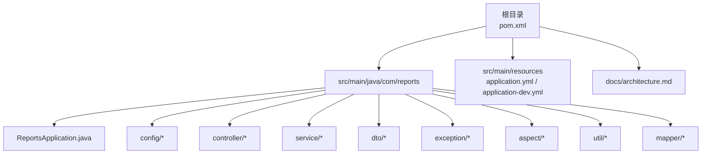
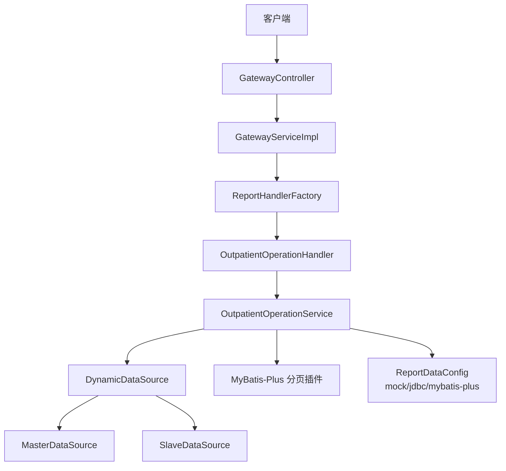
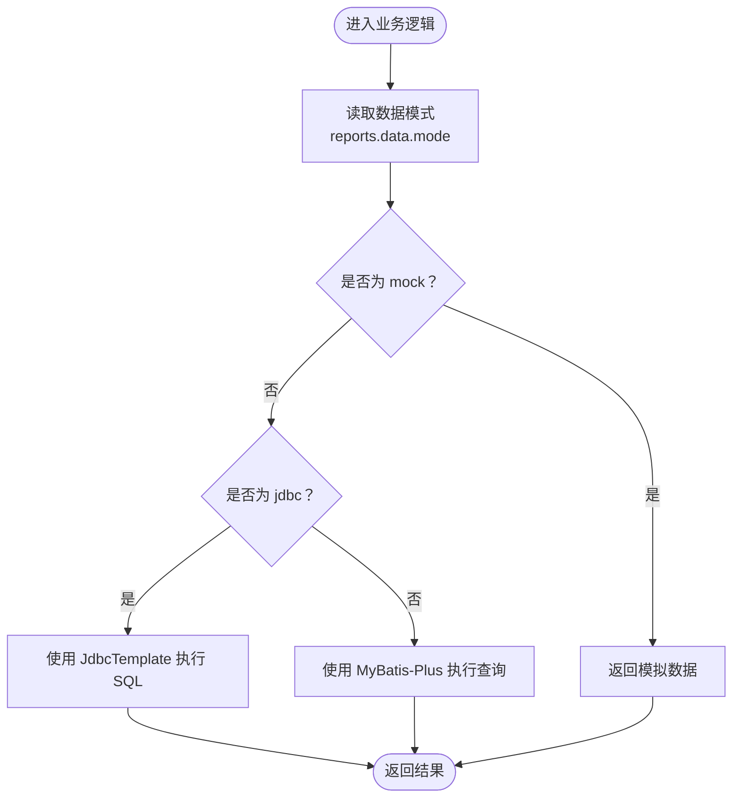
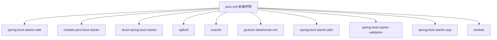

# 快速开始

<cite>
**本文引用的文件**
- [pom.xml](file://pom.xml)
- [ReportsApplication.java](file://src/main/java/com/reports/ReportsApplication.java)
- [application.yml](file://src/main/resources/application.yml)
- [application-dev.yml](file://src/main/resources/application-dev.yml)
- [DataSourceConfig.java](file://src/main/java/com/reports/config/DataSourceConfig.java)
- [DynamicDataSource.java](file://src/main/java/com/reports/config/DynamicDataSource.java)
- [MybatisPlusConfig.java](file://src/main/java/com/reports/config/MybatisPlusConfig.java)
- [GatewayController.java](file://src/main/java/com/reports/controller/GatewayController.java)
- [GatewayService.java](file://src/main/java/com/reports/service/GatewayService.java)
- [GatewayServiceImpl.java](file://src/main/java/com/reports/service/impl/GatewayServiceImpl.java)
- [OutpatientOperationHandler.java](file://src/main/java/com/reports/service/handler/impl/OutpatientOperationHandler.java)
- [ReportDataConfig.java](file://src/main/java/com/reports/config/ReportDataConfig.java)
- [architecture.md](file://docs/architecture.md)
</cite>

## 目录
1. [简介](#简介)
2. [项目结构](#项目结构)
3. [核心组件](#核心组件)
4. [架构总览](#架构总览)
5. [详细组件分析](#详细组件分析)
6. [依赖关系分析](#依赖关系分析)
7. [性能注意事项](#性能注意事项)
8. [故障排查指南](#故障排查指南)
9. [结论](#结论)
10. [附录](#附录)

## 简介
本指南面向首次接触“报告网关系统”的开发者，帮助你在最短时间内完成环境准备、项目构建、数据库配置与初始化、应用启动与验证，并提供常见问题排查方法。系统基于 Spring Boot 2.7.18，采用统一网关入口、多数据源动态切换、链路追踪与统一分页等特性，支持多种数据模式（mock/jdbc/mybatis-plus），便于开发与生产环境灵活切换。

## 项目结构
该工程采用标准 Maven 多模块布局，核心代码位于 src/main/java 下，资源文件位于 src/main/resources；另有 docs 文档目录用于存放架构设计文档。

图表来源
- [pom.xml](file://pom.xml)
- [ReportsApplication.java](file://src/main/java/com/reports/ReportsApplication.java)
- [application.yml](file://src/main/resources/application.yml)
- [application-dev.yml](file://src/main/resources/application-dev.yml)
- [architecture.md](file://docs/architecture.md)

章节来源
- [pom.xml](file://pom.xml)
- [ReportsApplication.java](file://src/main/java/com/reports/ReportsApplication.java)
- [application.yml](file://src/main/resources/application.yml)
- [application-dev.yml](file://src/main/resources/application-dev.yml)
- [architecture.md](file://docs/architecture.md)

## 核心组件
- 应用启动类：负责引导 Spring Boot 应用启动。
- 配置层：多数据源配置、动态数据源路由、MyBatis-Plus 分页插件、报表数据模式配置。
- 控制层：统一网关入口，接收请求并转发至对应处理器。
- 业务层：网关服务实现，根据 method 路由到具体处理器；门诊运行统计处理器示例。
- DTO 层：统一请求/响应封装、分页参数与结果、各报表请求/响应模型。
- 异常与日志：全局异常处理、AOP 日志切面、链路追踪 ID 生成与 MDC 管理。

章节来源
- [ReportsApplication.java](file://src/main/java/com/reports/ReportsApplication.java)
- [DataSourceConfig.java](file://src/main/java/com/reports/config/DataSourceConfig.java)
- [DynamicDataSource.java](file://src/main/java/com/reports/config/DynamicDataSource.java)
- [MybatisPlusConfig.java](file://src/main/java/com/reports/config/MybatisPlusConfig.java)
- [GatewayController.java](file://src/main/java/com/reports/controller/GatewayController.java)
- [GatewayService.java](file://src/main/java/com/reports/service/GatewayService.java)
- [GatewayServiceImpl.java](file://src/main/java/com/reports/service/impl/GatewayServiceImpl.java)
- [OutpatientOperationHandler.java](file://src/main/java/com/reports/service/handler/impl/OutpatientOperationHandler.java)
- [ReportDataConfig.java](file://src/main/java/com/reports/config/ReportDataConfig.java)

## 架构总览
系统采用“统一网关 + 策略+工厂 + 动态数据源 + 链路追踪 + 统一分页 + 异常处理”的整体架构。请求经由网关控制器进入，依据 method 字段路由到对应处理器，处理器调用服务层执行业务逻辑，服务层可选择 mock/jdbc/mybatis-plus 三种数据模式之一进行数据访问，必要时切换主/从数据源，最终统一返回标准化响应。

图表来源
- [GatewayController.java](file://src/main/java/com/reports/controller/GatewayController.java)
- [GatewayServiceImpl.java](file://src/main/java/com/reports/service/impl/GatewayServiceImpl.java)
- [OutpatientOperationHandler.java](file://src/main/java/com/reports/service/handler/impl/OutpatientOperationHandler.java)
- [DataSourceConfig.java](file://src/main/java/com/reports/config/DataSourceConfig.java)
- [DynamicDataSource.java](file://src/main/java/com/reports/config/DynamicDataSource.java)
- [MybatisPlusConfig.java](file://src/main/java/com/reports/config/MybatisPlusConfig.java)
- [ReportDataConfig.java](file://src/main/java/com/reports/config/ReportDataConfig.java)

## 详细组件分析

### 环境准备与安装
- JDK 版本：1.8（与 Maven 编译版本一致）
- 构建工具：Maven（Spring Boot 2.7.18 对应的 Maven 插件已内置）
- 数据库：Oracle（提供 Oracle JDBC 驱动与 NLS 支持），默认使用 Druid 连接池
- 开发工具：推荐使用 IDE（如 IntelliJ IDEA）导入 Maven 项目

章节来源
- [pom.xml](file://pom.xml)
- [application-dev.yml](file://src/main/resources/application-dev.yml)

### 项目克隆与构建
- 克隆仓库后，使用 Maven 进行打包或直接运行：
  - 打包：mvn clean package
  - 运行：mvn spring-boot:run
- 应用启动类为 ReportsApplication，端口默认 18089，上下文路径为根路径

章节来源
- [ReportsApplication.java](file://src/main/java/com/reports/ReportsApplication.java)
- [application.yml](file://src/main/resources/application.yml)

### 数据库配置与初始化
- 开发环境默认激活 dev 配置文件，其中包含主/从两个 Oracle 数据源示例，使用 Druid 连接池
- 若使用真实数据库，请按需修改 application-dev.yml 中的连接信息（主机、端口、SID/Service Name、用户名、密码）
- 数据库初始化脚本未在仓库中提供，需根据实际业务表结构自行准备；系统支持通过 JDBC 或 MyBatis-Plus 访问数据库

章节来源
- [application-dev.yml](file://src/main/resources/application-dev.yml)
- [DataSourceConfig.java](file://src/main/java/com/reports/config/DataSourceConfig.java)
- [MybatisPlusConfig.java](file://src/main/java/com/reports/config/MybatisPlusConfig.java)

### 应用启动与验证
- 启动命令：mvn spring-boot:run
- 访问统一网关：POST http://localhost:18089/reports/gateway
- 示例请求体（method 为门诊运行统计）：
  - head.method: reports.outp.outpatient-operation
  - body 包含日期范围与科室编码等字段
- 正常响应包含标准化结果码与业务数据

章节来源
- [architecture.md](file://docs/architecture.md)
- [GatewayController.java](file://src/main/java/com/reports/controller/GatewayController.java)

### 常见配置选项说明
- 服务器端口与上下文路径：application.yml
- 活跃 Profile：dev（开发环境）
- 追踪号前缀、长度与格式：reports.trace.*
- 数据模式：reports.data.mode（mock/jdbc/mybatis-plus，默认 mock）
- 日志级别与控制台输出格式：logging.level.* 与 logging.pattern.console
- 开发环境数据库连接：spring.datasource.master/slave（Druid 连接池参数）

章节来源
- [application.yml](file://src/main/resources/application.yml)
- [application-dev.yml](file://src/main/resources/application-dev.yml)
- [ReportDataConfig.java](file://src/main/java/com/reports/config/ReportDataConfig.java)

### 开发环境与生产环境差异
- Profile 切换：通过 application.yml 指定 active profile（当前为 dev）
- 生产环境建议：
  - 切换为 prod profile 并提供对应配置文件
  - 将 reports.data.mode 切换为 jdbc 或 mybatis-plus
  - 配置生产数据库连接与连接池参数
  - 调整日志级别与输出格式，启用更严格的异常处理与监控

章节来源
- [application.yml](file://src/main/resources/application.yml)
- [ReportDataConfig.java](file://src/main/java/com/reports/config/ReportDataConfig.java)

### 数据模式切换流程

图表来源
- [ReportDataConfig.java](file://src/main/java/com/reports/config/ReportDataConfig.java)
- [MybatisPlusConfig.java](file://src/main/java/com/reports/config/MybatisPlusConfig.java)

## 依赖关系分析
- Spring Boot Web：提供 Web 容器与 MVC 能力
- MyBatis-Plus：ORM 框架，提供分页插件与 Mapper 扫描
- Druid：连接池，提供监控与性能优化
- Oracle JDBC/NLS：数据库驱动与国际化支持
- Lombok：简化 POJO 代码
- Spring AOP/Validation：日志切面与参数校验
- Jackson XML：XML 序列化支持（可选）

图表来源
- [pom.xml](file://pom.xml)

章节来源
- [pom.xml](file://pom.xml)

## 性能注意事项
- 连接池参数：根据并发与数据库性能调整 Druid 初始化大小、最大活跃数、等待超时等
- 分页策略：统一使用 PageParam/PageResult，避免一次性加载大量数据
- SQL 监控：开启 Druid 监控面板，观察慢查询与连接占用
- 缓存优化：对热点报表数据引入缓存（如 Redis），降低数据库压力
- 日志级别：生产环境建议降低 TRACE 级别，避免过多日志开销

## 故障排查指南
- 启动失败（端口占用）
  - 现象：端口 18089 被占用导致启动失败
  - 处理：修改 application.yml 中 server.port 或释放端口
- 数据库连接失败
  - 现象：无法连接 Oracle 数据库
  - 处理：检查 application-dev.yml 中的连接串、用户名、密码与网络连通性；确认 Oracle 驱动版本兼容
- 方法不存在或未实现
  - 现象：返回方法不存在或未实现错误
  - 处理：确认请求 head.method 是否正确；检查 ReportHandler 注册与实现
- 数据模式不匹配
  - 现象：mock 模式下无真实数据，或 jdbc/mybatis-plus 模式下 SQL 执行异常
  - 处理：根据需要切换 reports.data.mode；核对 SQL 与表结构
- 日志链路追踪缺失
  - 现象：控制台缺少 TraceId
  - 处理：确认日志格式配置与 MDC 使用；检查 AOP 切面是否生效

章节来源
- [application.yml](file://src/main/resources/application.yml)
- [application-dev.yml](file://src/main/resources/application-dev.yml)
- [GatewayServiceImpl.java](file://src/main/java/com/reports/service/impl/GatewayServiceImpl.java)
- [ReportDataConfig.java](file://src/main/java/com/reports/config/ReportDataConfig.java)

## 结论
通过本快速开始指南，你可以在本地完成环境准备、项目构建、数据库配置与应用启动，并掌握统一网关、多数据源与数据模式切换等核心能力。建议在开发完成后，逐步完善生产环境配置、接入缓存与监控，并持续优化 SQL 与日志策略，确保系统稳定高效运行。

## 附录

### API 请求与响应示例
- 请求地址：POST http://localhost:18089/reports/gateway
- 请求示例（门诊运行统计）：
  - head.method: reports.outp.outpatient-operation
  - body 包含日期范围与科室编码等字段
- 响应示例：包含标准化结果码与业务数据

章节来源
- [architecture.md](file://docs/architecture.md)