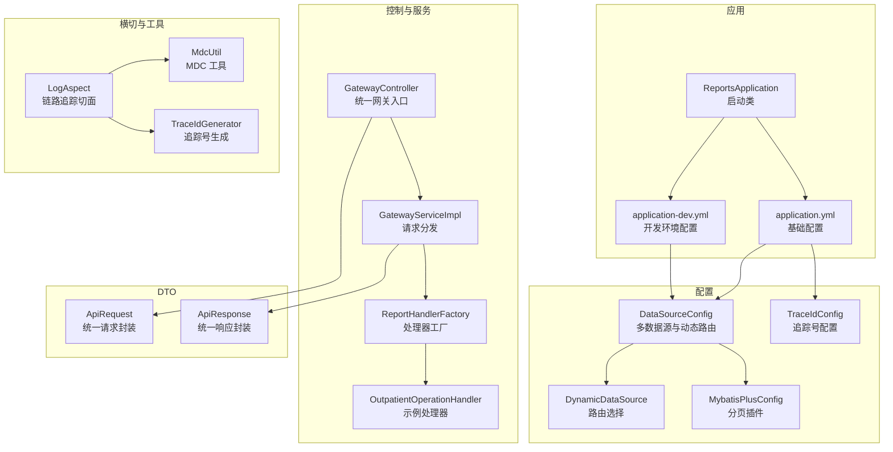
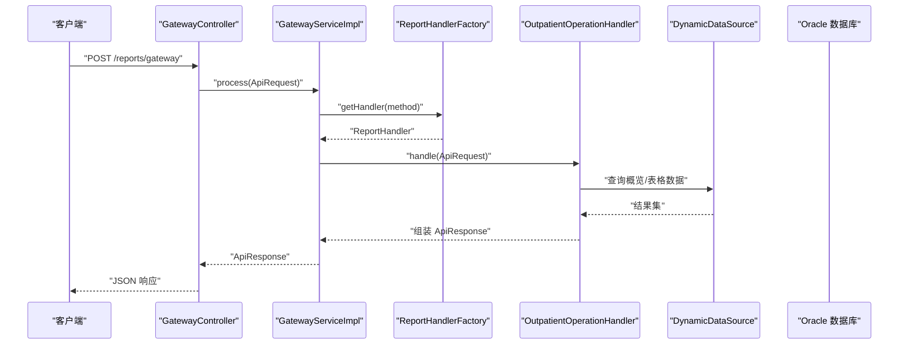
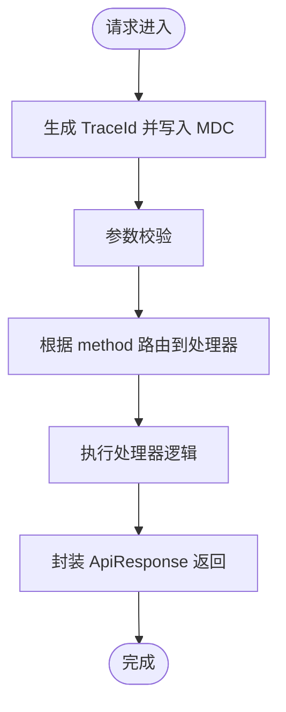
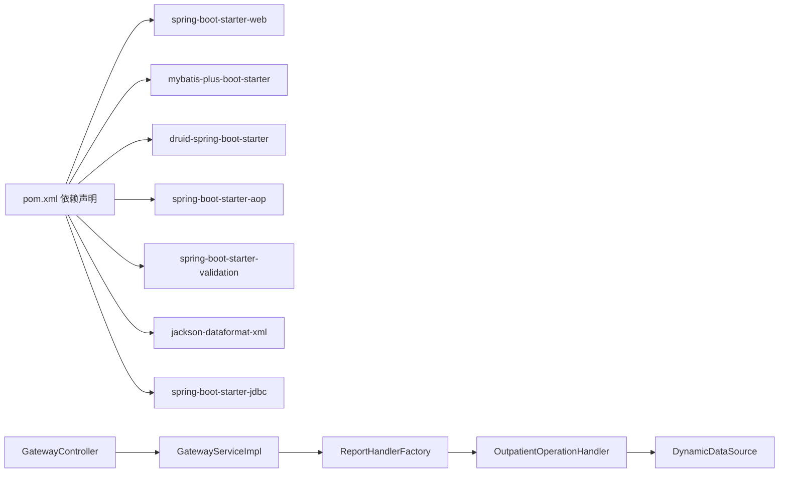

# 性能监控排查

<cite>
**本文引用的文件**
- [ReportsApplication.java](file://src/main/java/com/reports/ReportsApplication.java)
- [application.yml](file://src/main/resources/application.yml)
- [application-dev.yml](file://src/main/resources/application-dev.yml)
- [DataSourceConfig.java](file://src/main/java/com/reports/config/DataSourceConfig.java)
- [DynamicDataSource.java](file://src/main/java/com/reports/config/DynamicDataSource.java)
- [MybatisPlusConfig.java](file://src/main/java/com/reports/config/MybatisPlusConfig.java)
- [LogAspect.java](file://src/main/java/com/reports/aspect/LogAspect.java)
- [MdcUtil.java](file://src/main/java/com/reports/util/MdcUtil.java)
- [TraceIdGenerator.java](file://src/main/java/com/reports/util/TraceIdGenerator.java)
- [TraceIdConfig.java](file://src/main/java/com/reports/config/TraceIdConfig.java)
- [GatewayController.java](file://src/main/java/com/reports/controller/GatewayController.java)
- [GatewayServiceImpl.java](file://src/main/java/com/reports/service/impl/GatewayServiceImpl.java)
- [ReportHandlerFactory.java](file://src/main/java/com/reports/service/handler/ReportHandlerFactory.java)
- [OutpatientOperationHandler.java](file://src/main/java/com/reports/service/handler/impl/OutpatientOperationHandler.java)
- [ApiRequest.java](file://src/main/java/com/reports/dto/common/ApiRequest.java)
- [ApiResponse.java](file://src/main/java/com/reports/dto/common/ApiResponse.java)
- [pom.xml](file://pom.xml)
</cite>

## 目录
1. [简介](#简介)
2. [项目结构](#项目结构)
3. [核心组件](#核心组件)
4. [架构总览](#架构总览)
5. [详细组件分析](#详细组件分析)
6. [依赖分析](#依赖分析)
7. [性能考虑](#性能考虑)
8. [故障排查指南](#故障排查指南)
9. [结论](#结论)
10. [附录](#附录)

## 简介
本指南面向开发与运维人员，围绕该“报表网关”项目的性能监控与排查展开，重点覆盖以下方面：
- 系统性能指标监控方法与常用观测点
- 性能瓶颈识别与定位技巧
- 数据库连接池监控与调优要点
- API 响应时间分析路径与日志链路
- 内存使用检查与 JVM 参数建议
- 线程池配置优化思路（当前项目未显式定义线程池，提供通用优化建议）
- 缓存命中率监控（当前项目未显式引入缓存，提供通用监控建议）
- 性能测试工具使用、压力测试方法与性能回归检测流程
- 开发与生产环境监控差异与最佳实践

## 项目结构
该项目采用 Spring Boot 应用结构，核心模块包括：
- 启动类与配置：应用启动、环境配置、数据源与 MyBatis-Plus 配置
- 控制层与服务层：统一网关入口、请求分发与处理器工厂
- 切面与工具：链路追踪（TraceId）与日志埋点
- DTO：统一请求/响应封装
- 依赖管理：Web、MyBatis-Plus、Druid、AOP、Jackson XML、JDBC 等

**图表来源**
- [ReportsApplication.java:1-19](file://src/main/java/com/reports/ReportsApplication.java#L1-L19)
- [application.yml:1-32](file://src/main/resources/application.yml#L1-L32)
- [application-dev.yml:1-45](file://src/main/resources/application-dev.yml#L1-L45)
- [DataSourceConfig.java:1-56](file://src/main/java/com/reports/config/DataSourceConfig.java#L1-L56)
- [DynamicDataSource.java:1-16](file://src/main/java/com/reports/config/DynamicDataSource.java#L1-L16)
- [MybatisPlusConfig.java:1-28](file://src/main/java/com/reports/config/MybatisPlusConfig.java#L1-L28)
- [TraceIdConfig.java:1-33](file://src/main/java/com/reports/config/TraceIdConfig.java#L1-L33)
- [GatewayController.java:1-38](file://src/main/java/com/reports/controller/GatewayController.java#L1-L38)
- [GatewayServiceImpl.java:1-51](file://src/main/java/com/reports/service/impl/GatewayServiceImpl.java#L1-L51)
- [ReportHandlerFactory.java:1-74](file://src/main/java/com/reports/service/handler/ReportHandlerFactory.java#L1-L74)
- [OutpatientOperationHandler.java:1-65](file://src/main/java/com/reports/service/handler/impl/OutpatientOperationHandler.java#L1-L65)
- [LogAspect.java:1-74](file://src/main/java/com/reports/aspect/LogAspect.java#L1-L74)
- [MdcUtil.java:1-34](file://src/main/java/com/reports/util/MdcUtil.java#L1-L34)
- [TraceIdGenerator.java:1-57](file://src/main/java/com/reports/util/TraceIdGenerator.java#L1-L57)
- [ApiRequest.java:1-35](file://src/main/java/com/reports/dto/common/ApiRequest.java#L1-L35)
- [ApiResponse.java:1-57](file://src/main/java/com/reports/dto/common/ApiResponse.java#L1-L57)

**章节来源**
- [ReportsApplication.java:1-19](file://src/main/java/com/reports/ReportsApplication.java#L1-L19)
- [application.yml:1-32](file://src/main/resources/application.yml#L1-L32)
- [application-dev.yml:1-45](file://src/main/resources/application-dev.yml#L1-L45)

## 核心组件
- 应用启动与配置
  - 启动类负责应用引导，配置文件定义端口、上下文路径、日志级别与追踪号规则、数据模式等。
- 数据源与连接池
  - 多数据源配置与动态路由，基于 Druid 连接池，提供初始大小、最大活跃数、等待超时、空闲回收等参数。
- MyBatis-Plus
  - 分页插件配置，支持 Oracle 方言。
- 链路追踪
  - 切面在网关入口生成 TraceId 并写入 MDC，贯穿请求生命周期，便于日志关联与性能分析。
- 统一网关与处理器
  - 网关接收请求，通过工厂按 method 分发到对应处理器；处理器执行业务逻辑并返回统一响应。

**章节来源**
- [application.yml:1-32](file://src/main/resources/application.yml#L1-L32)
- [application-dev.yml:1-45](file://src/main/resources/application-dev.yml#L1-L45)
- [DataSourceConfig.java:1-56](file://src/main/java/com/reports/config/DataSourceConfig.java#L1-L56)
- [DynamicDataSource.java:1-16](file://src/main/java/com/reports/config/DynamicDataSource.java#L1-L16)
- [MybatisPlusConfig.java:1-28](file://src/main/java/com/reports/config/MybatisPlusConfig.java#L1-L28)
- [LogAspect.java:1-74](file://src/main/java/com/reports/aspect/LogAspect.java#L1-L74)
- [MdcUtil.java:1-34](file://src/main/java/com/reports/util/MdcUtil.java#L1-L34)
- [TraceIdGenerator.java:1-57](file://src/main/java/com/reports/util/TraceIdGenerator.java#L1-L57)
- [GatewayController.java:1-38](file://src/main/java/com/reports/controller/GatewayController.java#L1-L38)
- [GatewayServiceImpl.java:1-51](file://src/main/java/com/reports/service/impl/GatewayServiceImpl.java#L1-L51)
- [ReportHandlerFactory.java:1-74](file://src/main/java/com/reports/service/handler/ReportHandlerFactory.java#L1-L74)
- [OutpatientOperationHandler.java:1-65](file://src/main/java/com/reports/service/handler/impl/OutpatientOperationHandler.java#L1-L65)
- [ApiRequest.java:1-35](file://src/main/java/com/reports/dto/common/ApiRequest.java#L1-L35)
- [ApiResponse.java:1-57](file://src/main/java/com/reports/dto/common/ApiResponse.java#L1-L57)

## 架构总览
下图展示从客户端到数据库的关键调用链与监控关注点：

**图表来源**
- [GatewayController.java:1-38](file://src/main/java/com/reports/controller/GatewayController.java#L1-L38)
- [GatewayServiceImpl.java:1-51](file://src/main/java/com/reports/service/impl/GatewayServiceImpl.java#L1-L51)
- [ReportHandlerFactory.java:1-74](file://src/main/java/com/reports/service/handler/ReportHandlerFactory.java#L1-L74)
- [OutpatientOperationHandler.java:1-65](file://src/main/java/com/reports/service/handler/impl/OutpatientOperationHandler.java#L1-L65)
- [DataSourceConfig.java:1-56](file://src/main/java/com/reports/config/DataSourceConfig.java#L1-L56)
- [DynamicDataSource.java:1-16](file://src/main/java/com/reports/config/DynamicDataSource.java#L1-L16)

## 详细组件分析

### 数据库连接池监控与调优
- 当前配置位于开发环境配置中，使用 Druid 连接池，关键参数包括初始大小、最小空闲、最大活跃、最大等待时间、空闲回收周期、验证查询等。
- 监控要点
  - 活跃连接数与等待队列长度：避免频繁超时与排队
  - 连接泄漏：定期巡检空闲超时与健康检查
  - 验证策略：启用空闲验证，避免返回失效连接
- 调优建议
  - 根据并发与数据库承载能力调整初始与最大活跃
  - 适当缩短空闲回收周期，降低无效连接占用
  - 结合慢查询与锁等待指标，评估 SQL 优化空间

**章节来源**
- [application-dev.yml:1-45](file://src/main/resources/application-dev.yml#L1-L45)
- [DataSourceConfig.java:1-56](file://src/main/java/com/reports/config/DataSourceConfig.java#L1-L56)
- [DynamicDataSource.java:1-16](file://src/main/java/com/reports/config/DynamicDataSource.java#L1-L16)

### API 响应时间分析与链路追踪
- 链路追踪
  - 切面在网关入口生成 TraceId 并写入 MDC，请求返回与异常时清理，日志格式包含 TraceId，便于跨服务串联。
  - 追踪号规则由配置类读取，可自定义前缀、长度与括号包裹。
- 响应时间拆解
  - 网关接收与参数校验
  - 处理器工厂按 method 查找处理器
  - 具体处理器执行业务（如概览与分页表格查询）
  - 统一封装响应返回
- 建议
  - 在关键节点增加日志或埋点（如查询开始/结束），结合 TraceId 快速定位耗时环节
  - 生产环境建议开启采样日志或 APM（如 SkyWalking/OpenTelemetry）

**图表来源**
- [LogAspect.java:1-74](file://src/main/java/com/reports/aspect/LogAspect.java#L1-L74)
- [MdcUtil.java:1-34](file://src/main/java/com/reports/util/MdcUtil.java#L1-L34)
- [TraceIdGenerator.java:1-57](file://src/main/java/com/reports/util/TraceIdGenerator.java#L1-L57)
- [TraceIdConfig.java:1-33](file://src/main/java/com/reports/config/TraceIdConfig.java#L1-L33)
- [GatewayController.java:1-38](file://src/main/java/com/reports/controller/GatewayController.java#L1-L38)
- [GatewayServiceImpl.java:1-51](file://src/main/java/com/reports/service/impl/GatewayServiceImpl.java#L1-L51)
- [ReportHandlerFactory.java:1-74](file://src/main/java/com/reports/service/handler/ReportHandlerFactory.java#L1-L74)
- [OutpatientOperationHandler.java:1-65](file://src/main/java/com/reports/service/handler/impl/OutpatientOperationHandler.java#L1-L65)

**章节来源**
- [LogAspect.java:1-74](file://src/main/java/com/reports/aspect/LogAspect.java#L1-L74)
- [MdcUtil.java:1-34](file://src/main/java/com/reports/util/MdcUtil.java#L1-L34)
- [TraceIdGenerator.java:1-57](file://src/main/java/com/reports/util/TraceIdGenerator.java#L1-L57)
- [TraceIdConfig.java:1-33](file://src/main/java/com/reports/config/TraceIdConfig.java#L1-L33)

### 内存使用检查与 JVM 参数建议
- 当前项目未显式声明 JVM 参数，建议在容器或进程启动时设置如下关键参数以提升稳定性与可观测性：
  - 堆大小：-Xms 与 -Xmx 设定一致，减少 GC 抖动
  - 新生代比例：-XX:NewRatio 或 -XX:SurvivorRatio 控制新生代占比
  - GC 策略：G1GC 或 ZGC（取决于 JDK 版本与延迟要求）
  - GC 日志：-Xloggc:gc.log -XX:+PrintGCDetails -XX:+PrintGCTimeStamps
  - 元空间：-XX:MetaspaceSize 与 -XX:MaxMetaspaceSize
  - 锁竞争：-XX:+PrintLockStatistics（问题定位时临时开启）
- 观测手段
  - 使用 jstat/jmap/jstack 定期采集堆、线程与锁信息
  - 结合 APM 或 JVM 监控平台查看 GC、内存与线程状态趋势

[本节为通用指导，不直接分析具体文件]

### 线程池配置优化（当前项目现状与建议）
- 现状
  - 项目未显式定义线程池 Bean，Spring MVC 默认使用内置线程池处理请求；业务侧未见异步任务线程池配置。
- 建议
  - 若后续引入异步任务或外部 I/O 并行处理，建议：
    - 明确核心线程数、最大线程数、队列容量与拒绝策略
    - 对阻塞型任务与计算型任务分离线程池
    - 监控队列长度与拒绝次数，防止过载导致级联失败
  - 对于 Web 层，可通过 server.tomcat threads 来微调，但需结合实际压测结果

[本节为通用指导，不直接分析具体文件]

### 缓存命中率监控（当前项目现状与建议）
- 现状
  - 项目未显式引入缓存组件（如 Redis/Caffeine），未见缓存注解或埋点。
- 建议
  - 对热点查询（如字典、配置、报表元数据）引入本地/分布式缓存
  - 通过 AOP 或拦截器记录命中/未命中计数，计算命中率并可视化
  - 关注缓存穿透、击穿与雪崩的防护策略

[本节为通用指导，不直接分析具体文件]

### 性能测试工具与压力测试方法
- 工具
  - JMeter：接口脚本、并发场景、聚合报告
  - Locust：Python 脚本化压测，实时观察
  - wrk/wrk2：轻量命令行压测，适合快速验证
  - APM：SkyWalking/OpenTelemetry（生产环境）
- 方法
  - 基准场景：单接口吞吐、P95/P99 延迟、错误率
  - 突发流量：阶梯式加压，观察系统弹性与恢复
  - 持续压测：长时间稳定运行，观察内存与 GC 趋势
- 回归流程
  - 建立基线指标（RPS、延迟、错误率、资源使用）
  - 变更后对比，若偏离基线则触发复盘

[本节为通用指导，不直接分析具体文件]

## 依赖分析
- 外部依赖
  - Spring Web、MyBatis-Plus、Druid、AOP、Validation、Jackson XML、JDBC、Lombok、Test
- 关键依赖对性能的影响
  - Web：请求处理与序列化开销
  - MyBatis-Plus：SQL 执行与分页插件
  - Druid：连接池性能与健康度
  - AOP：切面带来的额外开销，需谨慎使用
- 内部耦合
  - 控制器依赖服务层；服务层依赖工厂与处理器；处理器依赖数据访问层；数据访问层依赖动态数据源

**图表来源**
- [pom.xml:1-110](file://pom.xml#L1-L110)
- [GatewayController.java:1-38](file://src/main/java/com/reports/controller/GatewayController.java#L1-L38)
- [GatewayServiceImpl.java:1-51](file://src/main/java/com/reports/service/impl/GatewayServiceImpl.java#L1-L51)
- [ReportHandlerFactory.java:1-74](file://src/main/java/com/reports/service/handler/ReportHandlerFactory.java#L1-L74)
- [OutpatientOperationHandler.java:1-65](file://src/main/java/com/reports/service/handler/impl/OutpatientOperationHandler.java#L1-L65)
- [DataSourceConfig.java:1-56](file://src/main/java/com/reports/config/DataSourceConfig.java#L1-L56)
- [DynamicDataSource.java:1-16](file://src/main/java/com/reports/config/DynamicDataSource.java#L1-L16)

**章节来源**
- [pom.xml:1-110](file://pom.xml#L1-L110)

## 性能考虑
- 日志与追踪
  - 开发环境日志级别较低，便于调试；生产环境建议降低日志级别，避免 IO 放大
  - TraceId 与 MDC 已就绪，建议配合采样策略或 APM 实现全链路观测
- 数据访问
  - 合理设置连接池参数，避免过度连接或等待
  - SQL 分页与索引优化，避免全表扫描
- 序列化
  - Jackson XML 用于特定场景，注意其性能与内存占用
- 并发与线程
  - Web 层默认线程池已可满足一般场景；如引入异步任务，需独立线程池隔离

[本节为通用指导，不直接分析具体文件]

## 故障排查指南
- 快速定位
  - 通过 TraceId 在日志中检索完整链路，确认瓶颈发生在网关、处理器还是数据库层
  - 关注异常分支：参数缺失、方法不存在、业务异常等
- 常见问题
  - 数据库连接池耗尽：检查活跃连接数、最大等待与回收策略
  - SQL 性能差：结合慢查询日志与执行计划优化
  - 处理器未注册：检查 @MethodMapping 注解与初始化日志
- 诊断步骤
  - 采集 CPU、内存、GC、线程、连接池状态
  - 重现问题场景，记录关键指标与日志片段
  - 逐步缩小范围：网络/应用/数据库三层排查

**章节来源**
- [LogAspect.java:1-74](file://src/main/java/com/reports/aspect/LogAspect.java#L1-L74)
- [GatewayServiceImpl.java:1-51](file://src/main/java/com/reports/service/impl/GatewayServiceImpl.java#L1-L51)
- [ReportHandlerFactory.java:1-74](file://src/main/java/com/reports/service/handler/ReportHandlerFactory.java#L1-L74)
- [application-dev.yml:1-45](file://src/main/resources/application-dev.yml#L1-L45)

## 结论
本项目具备完善的链路追踪与统一网关结构，便于进行端到端性能观测。建议在现有基础上：
- 引入 APM/采样日志，完善端到端时延与错误率监控
- 依据压测结果优化连接池与 SQL，持续进行性能回归
- 在需要时引入线程池与缓存，并配套监控与告警

[本节为总结性内容，不直接分析具体文件]

## 附录

### 开发环境与生产环境监控差异与最佳实践
- 开发环境
  - 较低日志级别，便于定位问题
  - 数据模式可切换至 mock/jdbc/mybatis-plus，便于离线测试
  - 连接池参数偏向易用，默认即可
- 生产环境
  - 严格控制日志级别与采样率，避免影响性能
  - 启用 APM/探针，建立延迟、错误率、资源使用等指标
  - 连接池参数以稳定性与吞吐为目标进行调优
  - 建立性能回归基线与变更评审流程

**章节来源**
- [application.yml:1-32](file://src/main/resources/application.yml#L1-L32)
- [application-dev.yml:1-45](file://src/main/resources/application-dev.yml#L1-L45)