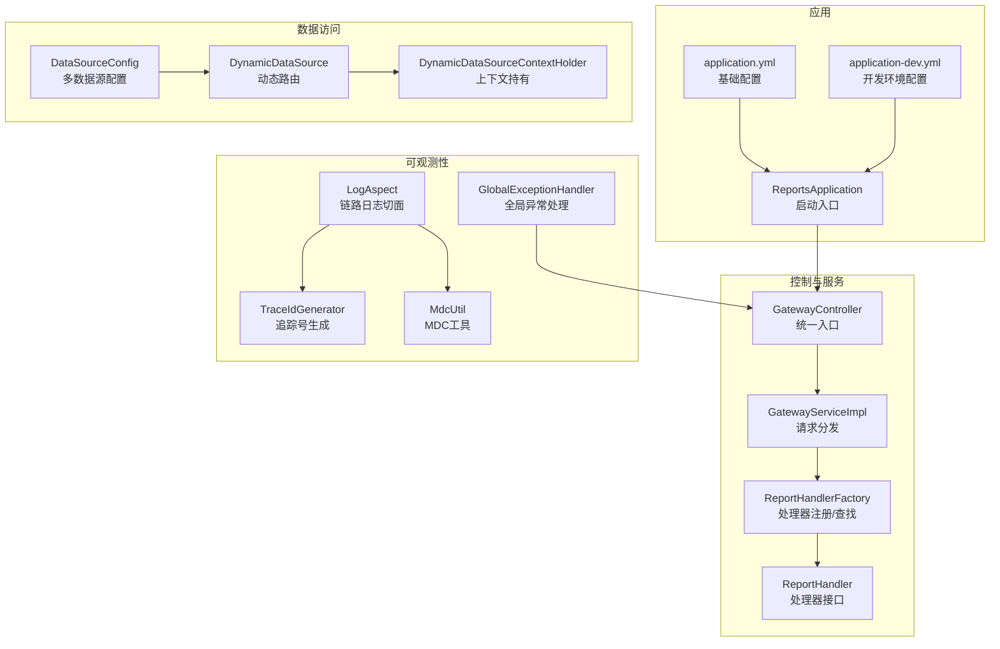
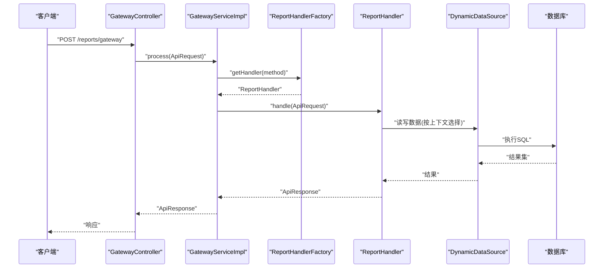
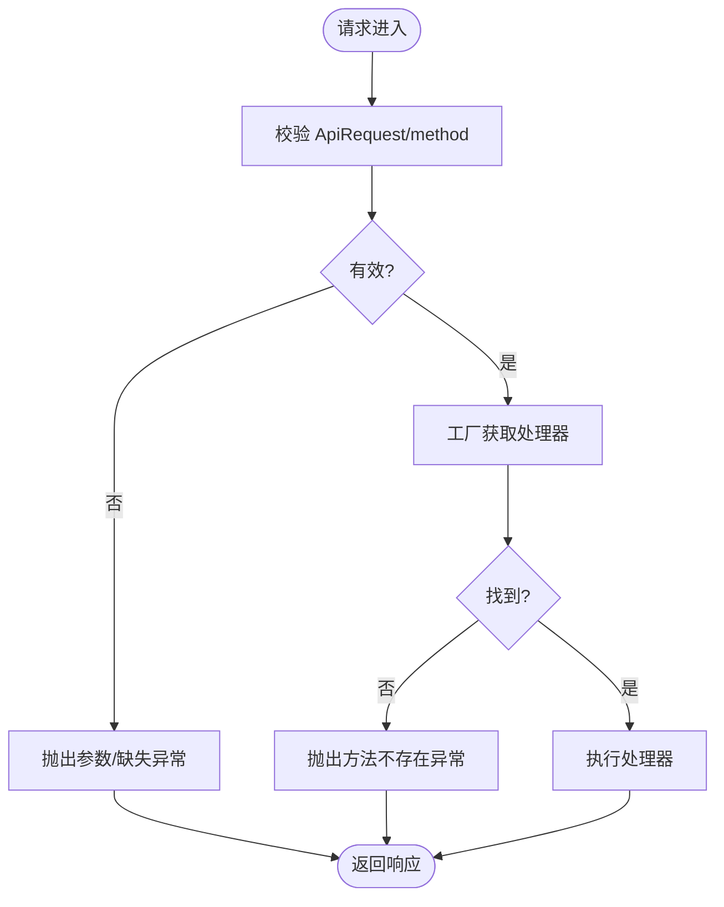
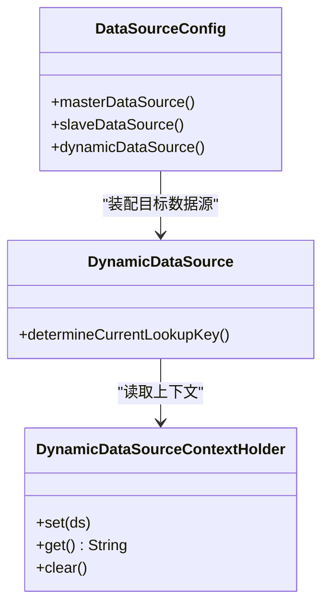
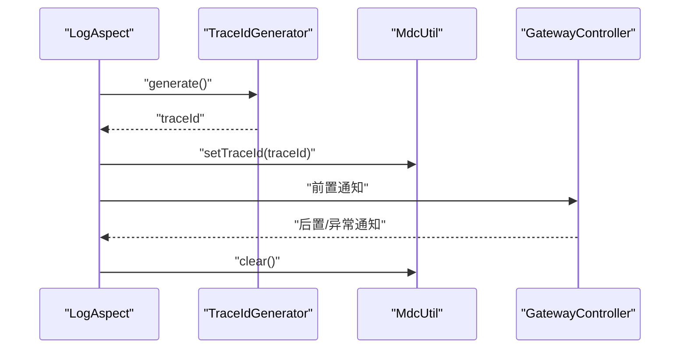
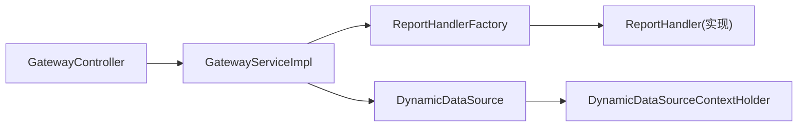

# 故障排查

<cite>
**本文引用的文件**
- [ReportsApplication.java](file://src/main/java/com/reports/ReportsApplication.java)
- [application.yml](file://src/main/resources/application.yml)
- [application-dev.yml](file://src/main/resources/application-dev.yml)
- [DataSourceConfig.java](file://src/main/java/com/reports/config/DataSourceConfig.java)
- [DynamicDataSource.java](file://src/main/java/com/reports/config/DynamicDataSource.java)
- [DynamicDataSourceContextHolder.java](file://src/main/java/com/reports/config/DynamicDataSourceContextHolder.java)
- [GlobalExceptionHandler.java](file://src/main/java/com/reports/exception/GlobalExceptionHandler.java)
- [LogAspect.java](file://src/main/java/com/reports/aspect/LogAspect.java)
- [MdcUtil.java](file://src/main/java/com/reports/util/MdcUtil.java)
- [TraceIdGenerator.java](file://src/main/java/com/reports/util/TraceIdGenerator.java)
- [GatewayController.java](file://src/main/java/com/reports/controller/GatewayController.java)
- [GatewayService.java](file://src/main/java/com/reports/service/GatewayService.java)
- [GatewayServiceImpl.java](file://src/main/java/com/reports/service/impl/GatewayServiceImpl.java)
- [ReportHandler.java](file://src/main/java/com/reports/service/handler/ReportHandler.java)
- [ReportHandlerFactory.java](file://src/main/java/com/reports/service/handler/ReportHandlerFactory.java)
- [ApiRequest.java](file://src/main/java/com/reports/dto/common/ApiRequest.java)
- [ApiResponse.java](file://src/main/java/com/reports/dto/common/ApiResponse.java)
- [ResultCode.java](file://src/main/java/com/reports/enums/ResultCode.java)
</cite>

## 目录
1. [简介](#简介)
2. [项目结构](#项目结构)
3. [核心组件](#核心组件)
4. [架构总览](#架构总览)
5. [详细组件分析](#详细组件分析)
6. [依赖关系分析](#依赖关系分析)
7. [性能与资源排查](#性能与资源排查)
8. [故障排查指南](#故障排查指南)
9. [结论](#结论)
10. [附录](#附录)

## 简介
本指南面向运维与开发人员，围绕统一网关与动态数据源架构，提供系统化的故障排查方法。内容覆盖：系统日志分析、性能瓶颈定位、内存泄漏检测、数据库连接问题、API调用失败、数据源切换异常等典型问题的排查步骤；并给出调试工具使用、监控指标解读、告警处理流程、开发与生产环境差异策略、问题上报与应急响应预案。

## 项目结构
后端基于 Spring Boot 应用，采用“网关 + 处理器工厂 + 动态数据源”的分层设计。应用启动入口、配置文件、控制器、服务层、异常处理、日志切面、追踪号生成与数据源路由均在上述文件中体现。

图示来源
- [ReportsApplication.java:11-16](file://src/main/java/com/reports/ReportsApplication.java#L11-L16)
- [application.yml:1-32](file://src/main/resources/application.yml#L1-L32)
- [application-dev.yml:1-45](file://src/main/resources/application-dev.yml#L1-L45)
- [GatewayController.java:16-37](file://src/main/java/com/reports/controller/GatewayController.java#L16-L37)
- [GatewayServiceImpl.java:18-50](file://src/main/java/com/reports/service/impl/GatewayServiceImpl.java#L18-L50)
- [ReportHandlerFactory.java:19-73](file://src/main/java/com/reports/service/handler/ReportHandlerFactory.java#L19-L73)
- [DataSourceConfig.java:17-55](file://src/main/java/com/reports/config/DataSourceConfig.java#L17-L55)
- [DynamicDataSource.java:8-15](file://src/main/java/com/reports/config/DynamicDataSource.java#L8-L15)
- [DynamicDataSourceContextHolder.java:6-37](file://src/main/java/com/reports/config/DynamicDataSourceContextHolder.java#L6-L37)
- [LogAspect.java:20-73](file://src/main/java/com/reports/aspect/LogAspect.java#L20-L73)
- [TraceIdGenerator.java:13-56](file://src/main/java/com/reports/util/TraceIdGenerator.java#L13-L56)
- [MdcUtil.java:8-33](file://src/main/java/com/reports/util/MdcUtil.java#L8-L33)
- [GlobalExceptionHandler.java:16-85](file://src/main/java/com/reports/exception/GlobalExceptionHandler.java#L16-L85)

章节来源
- [ReportsApplication.java:11-16](file://src/main/java/com/reports/ReportsApplication.java#L11-L16)
- [application.yml:1-32](file://src/main/resources/application.yml#L1-L32)
- [application-dev.yml:1-45](file://src/main/resources/application-dev.yml#L1-L45)

## 核心组件
- 启动与配置
  - 应用启动类负责引导 Spring Boot 应用。
  - 配置文件定义端口、上下文路径、追踪号规则、数据模式、日志级别与控制台输出格式。
- 控制与服务
  - 网关控制器接收统一请求，服务实现解析 method 并通过工厂获取对应处理器执行。
- 处理器体系
  - 处理器接口约定统一处理方法；工厂自动扫描并注册带注解的处理器，按 method 分发。
- 动态数据源
  - 多数据源配置 + 动态路由 + 上下文持有，支持主从切换与默认回退。
- 观测性
  - 切面埋点、追踪号生成、MDC 透传、全局异常处理，形成闭环的日志与错误反馈。

章节来源
- [ReportsApplication.java:11-16](file://src/main/java/com/reports/ReportsApplication.java#L11-L16)
- [application.yml:1-32](file://src/main/resources/application.yml#L1-L32)
- [GatewayController.java:16-37](file://src/main/java/com/reports/controller/GatewayController.java#L16-L37)
- [GatewayServiceImpl.java:18-50](file://src/main/java/com/reports/service/impl/GatewayServiceImpl.java#L18-L50)
- [ReportHandler.java:19-27](file://src/main/java/com/reports/service/handler/ReportHandler.java#L19-L27)
- [ReportHandlerFactory.java:19-73](file://src/main/java/com/reports/service/handler/ReportHandlerFactory.java#L19-L73)
- [DataSourceConfig.java:17-55](file://src/main/java/com/reports/config/DataSourceConfig.java#L17-L55)
- [DynamicDataSource.java:8-15](file://src/main/java/com/reports/config/DynamicDataSource.java#L8-L15)
- [DynamicDataSourceContextHolder.java:6-37](file://src/main/java/com/reports/config/DynamicDataSourceContextHolder.java#L6-L37)
- [LogAspect.java:20-73](file://src/main/java/com/reports/aspect/LogAspect.java#L20-L73)
- [TraceIdGenerator.java:13-56](file://src/main/java/com/reports/util/TraceIdGenerator.java#L13-L56)
- [MdcUtil.java:8-33](file://src/main/java/com/reports/util/MdcUtil.java#L8-L33)
- [GlobalExceptionHandler.java:16-85](file://src/main/java/com/reports/exception/GlobalExceptionHandler.java#L16-L85)

## 架构总览
统一网关作为入口，接收请求后根据 method 查找处理器执行；处理器可按需切换数据源；全链路通过切面与追踪号贯穿日志，异常统一收敛到全局处理器。

图示来源
- [GatewayController.java:28-35](file://src/main/java/com/reports/controller/GatewayController.java#L28-L35)
- [GatewayServiceImpl.java:29-48](file://src/main/java/com/reports/service/impl/GatewayServiceImpl.java#L29-L48)
- [ReportHandlerFactory.java:54-64](file://src/main/java/com/reports/service/handler/ReportHandlerFactory.java#L54-L64)
- [DynamicDataSource.java:10-13](file://src/main/java/com/reports/config/DynamicDataSource.java#L10-L13)

## 详细组件分析

### 组件A：统一网关与请求分发
- 关键职责
  - 接收统一请求，校验 method，委派给处理器工厂获取处理器并执行。
- 典型问题
  - method 缺失或非法、处理器未注册、处理器内部异常。
- 排查要点
  - 检查请求头 method 是否存在与正确；查看处理器注册日志；关注全局异常返回码。

图示来源
- [GatewayServiceImpl.java:29-48](file://src/main/java/com/reports/service/impl/GatewayServiceImpl.java#L29-L48)
- [ReportHandlerFactory.java:54-64](file://src/main/java/com/reports/service/handler/ReportHandlerFactory.java#L54-L64)
- [ApiRequest.java:13-34](file://src/main/java/com/reports/dto/common/ApiRequest.java#L13-L34)

章节来源
- [GatewayController.java:28-35](file://src/main/java/com/reports/controller/GatewayController.java#L28-L35)
- [GatewayServiceImpl.java:29-48](file://src/main/java/com/reports/service/impl/GatewayServiceImpl.java#L29-L48)
- [ReportHandlerFactory.java:54-64](file://src/main/java/com/reports/service/handler/ReportHandlerFactory.java#L54-L64)
- [ApiRequest.java:13-34](file://src/main/java/com/reports/dto/common/ApiRequest.java#L13-L34)

### 组件B：动态数据源与上下文切换
- 关键职责
  - 多数据源配置、动态路由、上下文持有；默认主库，支持切换从库。
- 典型问题
  - 数据源不可用、连接池耗尽、切换异常、默认回退。
- 排查要点
  - 检查连接池参数与健康状态；确认上下文设置与清理；核对默认数据源配置。

图示来源
- [DataSourceConfig.java:17-55](file://src/main/java/com/reports/config/DataSourceConfig.java#L17-L55)
- [DynamicDataSource.java:8-15](file://src/main/java/com/reports/config/DynamicDataSource.java#L8-L15)
- [DynamicDataSourceContextHolder.java:6-37](file://src/main/java/com/reports/config/DynamicDataSourceContextHolder.java#L6-L37)

章节来源
- [DataSourceConfig.java:17-55](file://src/main/java/com/reports/config/DataSourceConfig.java#L17-L55)
- [DynamicDataSource.java:8-15](file://src/main/java/com/reports/config/DynamicDataSource.java#L8-L15)
- [DynamicDataSourceContextHolder.java:6-37](file://src/main/java/com/reports/config/DynamicDataSourceContextHolder.java#L6-L37)

### 组件C：日志与追踪链路
- 关键职责
  - 切面拦截网关方法，生成并注入追踪号，贯穿请求进入、返回与异常阶段。
- 典型问题
  - 追踪号缺失、日志不完整、异常未捕获。
- 排查要点
  - 校验日志输出格式是否包含追踪号；确认切面生效范围；检查 MDC 清理时机。

图示来源
- [LogAspect.java:42-71](file://src/main/java/com/reports/aspect/LogAspect.java#L42-L71)
- [TraceIdGenerator.java:29-47](file://src/main/java/com/reports/util/TraceIdGenerator.java#L29-L47)
- [MdcUtil.java:15-31](file://src/main/java/com/reports/util/MdcUtil.java#L15-L31)

章节来源
- [LogAspect.java:42-71](file://src/main/java/com/reports/aspect/LogAspect.java#L42-L71)
- [TraceIdGenerator.java:29-47](file://src/main/java/com/reports/util/TraceIdGenerator.java#L29-L47)
- [MdcUtil.java:15-31](file://src/main/java/com/reports/util/MdcUtil.java#L15-L31)

### 组件D：全局异常处理
- 关键职责
  - 对业务异常、参数绑定异常、非法参数、数据源异常与其他异常进行统一处理，返回标准化响应。
- 典型问题
  - 异常未分类、错误码不一致、追踪号未透传。
- 排查要点
  - 核对 ResultCode 枚举与异常映射；检查日志中是否包含追踪号；确认响应结构。

章节来源
- [GlobalExceptionHandler.java:23-83](file://src/main/java/com/reports/exception/GlobalExceptionHandler.java#L23-L83)
- [ResultCode.java:9-76](file://src/main/java/com/reports/enums/ResultCode.java#L9-L76)

## 依赖关系分析
- 组件耦合
  - 网关服务依赖处理器工厂；处理器工厂依赖处理器实现；动态数据源依赖上下文持有者。
- 外部依赖
  - 数据源为 Oracle（Druid 连接池）；MyBatis-Plus 配置位于开发环境。
- 潜在风险
  - 处理器未标注路由键会导致初始化失败；日志格式依赖 MDC，若未正确设置则追踪号缺失。

图示来源
- [GatewayController.java:28-35](file://src/main/java/com/reports/controller/GatewayController.java#L28-L35)
- [GatewayServiceImpl.java:29-48](file://src/main/java/com/reports/service/impl/GatewayServiceImpl.java#L29-L48)
- [ReportHandlerFactory.java:54-64](file://src/main/java/com/reports/service/handler/ReportHandlerFactory.java#L54-L64)
- [DynamicDataSource.java:10-13](file://src/main/java/com/reports/config/DynamicDataSource.java#L10-L13)
- [DynamicDataSourceContextHolder.java:25-27](file://src/main/java/com/reports/config/DynamicDataSourceContextHolder.java#L25-L27)

章节来源
- [ReportHandlerFactory.java:31-52](file://src/main/java/com/reports/service/handler/ReportHandlerFactory.java#L31-L52)
- [application-dev.yml:40-45](file://src/main/resources/application-dev.yml#L40-L45)

## 性能与资源排查
- 日志级别与输出
  - 开发环境建议开启更细粒度日志以辅助定位；生产环境建议降低日志量，避免 I/O 压力。
- 连接池参数
  - 初始大小、最大活跃数、最大等待时间、空闲回收周期等直接影响吞吐与延迟；需结合压测与慢查询分析调整。
- 处理器执行时间
  - 结合追踪号聚合日志，定位耗时环节；必要时拆分处理器或引入缓存。
- 内存与 GC
  - 使用 JVM 监控工具观察堆栈、GC 频率与停顿；排查大对象、集合未释放、线程池泄漏等问题。

[本节为通用指导，无需特定文件引用]

## 故障排查指南

### 一、系统日志分析方法
- 定位入口
  - 通过统一网关入口日志与追踪号快速定位一次请求的全链路轨迹。
- 关键字段
  - 时间戳、线程名、日志级别、类名、追踪号、请求方法与参数、异常堆栈。
- 实操步骤
  - 在日志中搜索追踪号，串联请求进入、处理器执行、数据源访问、异常抛出等节点。
  - 若追踪号缺失，检查切面与 MDC 设置是否生效。

章节来源
- [application.yml:25-31](file://src/main/resources/application.yml#L25-L31)
- [LogAspect.java:42-71](file://src/main/java/com/reports/aspect/LogAspect.java#L42-L71)
- [MdcUtil.java:15-31](file://src/main/java/com/reports/util/MdcUtil.java#L15-L31)

### 二、性能瓶颈识别
- CPU/线程
  - 观察线程阻塞、死锁、上下文切换频繁；结合处理器执行耗时定位热点。
- I/O
  - 数据库慢查询、连接池等待超时；结合连接池监控与 SQL 日志分析。
- 缓存与降载
  - 对高频报表引入缓存；对长尾请求限流或熔断。

章节来源
- [application-dev.yml:9-20](file://src/main/resources/application-dev.yml#L9-L20)
- [application-dev.yml:40-45](file://src/main/resources/application-dev.yml#L40-L45)

### 三、内存泄漏检测
- 常见场景
  - 线程局部变量未清理、静态集合累积、大对象未释放、连接未关闭。
- 检测手段
  - Heap Dump 分析、GC 日志分析、JVM 堆快照对比。
- 预防措施
  - 明确生命周期，确保在切面异常/返回后清理 MDC；规范资源释放。

章节来源
- [LogAspect.java:57-71](file://src/main/java/com/reports/aspect/LogAspect.java#L57-L71)
- [MdcUtil.java:29-31](file://src/main/java/com/reports/util/MdcUtil.java#L29-L31)

### 四、数据库连接问题
- 症状
  - 连接池耗尽、超时、驱动加载失败、SQL 执行异常。
- 排查步骤
  - 检查数据源配置与驱动类名；核对连接串、用户名密码；查看连接池健康状态与等待队列。
  - 若启用动态数据源，确认上下文切换逻辑与默认回退。
- 解决方案
  - 调整连接池参数；优化 SQL 与索引；必要时增加只读副本。

章节来源
- [application-dev.yml:2-38](file://src/main/resources/application-dev.yml#L2-L38)
- [DataSourceConfig.java:23-53](file://src/main/java/com/reports/config/DataSourceConfig.java#L23-L53)
- [DynamicDataSourceContextHolder.java:18-27](file://src/main/java/com/reports/config/DynamicDataSourceContextHolder.java#L18-L27)

### 五、API 调用失败
- 常见原因
  - method 缺失或非法、处理器未注册、参数绑定失败、业务异常。
- 排查步骤
  - 校验请求头 method；查看处理器注册日志；检查全局异常返回码与消息。
- 解决方案
  - 补充缺失参数；修复非法值；完善处理器实现与异常处理。

章节来源
- [GatewayServiceImpl.java:32-44](file://src/main/java/com/reports/service/impl/GatewayServiceImpl.java#L32-L44)
- [ReportHandlerFactory.java:31-52](file://src/main/java/com/reports/service/handler/ReportHandlerFactory.java#L31-L52)
- [GlobalExceptionHandler.java:23-55](file://src/main/java/com/reports/exception/GlobalExceptionHandler.java#L23-L55)

### 六、数据源切换异常
- 症状
  - 读写错库、默认回退、切换失败。
- 排查步骤
  - 检查上下文设置与清理；核对默认数据源；验证目标数据源可用性。
- 解决方案
  - 在事务边界明确切换；异常时及时清理上下文；完善降级策略。

章节来源
- [DynamicDataSource.java:10-13](file://src/main/java/com/reports/config/DynamicDataSource.java#L10-L13)
- [DynamicDataSourceContextHolder.java:18-35](file://src/main/java/com/reports/config/DynamicDataSourceContextHolder.java#L18-L35)

### 七、调试工具与监控指标
- 调试工具
  - 日志检索（按追踪号）、JVM 监控（JConsole/JProfiler）、数据库慢查询日志。
- 监控指标
  - QPS、P95/P99 延迟、错误率、连接池活跃数、等待时长、GC 次数与停顿。
- 告警策略
  - 基于阈值与趋势的分级告警；结合追踪号聚合告警事件。

章节来源
- [application.yml:25-31](file://src/main/resources/application.yml#L25-L31)
- [application-dev.yml:9-20](file://src/main/resources/application-dev.yml#L9-L20)

### 八、开发环境与生产环境差异
- 开发环境
  - 更详细的日志与 SQL 输出；可选 mock 数据模式；便于本地联调。
- 生产环境
  - 严格的日志级别与输出格式；连接池参数与超时配置；完善的异常与告警机制。

章节来源
- [application.yml:21-23](file://src/main/resources/application.yml#L21-L23)
- [application-dev.yml:40-45](file://src/main/resources/application-dev.yml#L40-L45)

### 九、问题上报流程与应急响应
- 上报流程
  - 快速复现与最小化信息收集（请求样例、追踪号、日志片段、错误码）；分级升级。
- 应急响应
  - 降级开关、熔断限流、快速回滚、热点修复；事后复盘与根因分析。

章节来源
- [GlobalExceptionHandler.java:23-83](file://src/main/java/com/reports/exception/GlobalExceptionHandler.java#L23-L83)
- [ResultCode.java:9-76](file://src/main/java/com/reports/enums/ResultCode.java#L9-L76)

## 结论
本指南提供了从日志、性能、资源到数据源与 API 的全链路故障排查方法。建议在日常运维中固化追踪号与日志规范，完善监控与告警，建立问题分级与应急流程，持续优化连接池与 SQL，确保系统稳定运行。

## 附录

### A. 关键配置与默认行为
- 应用端口与上下文路径、追踪号规则、数据模式、日志输出格式
- 开发环境数据源与连接池参数、MyBatis-Plus 配置

章节来源
- [application.yml:1-32](file://src/main/resources/application.yml#L1-L32)
- [application-dev.yml:1-45](file://src/main/resources/application-dev.yml#L1-L45)

### B. 统一请求/响应模型
- 请求封装包含请求头与请求体；响应封装包含结果与业务体；失败时携带标准错误码与子码。

章节来源
- [ApiRequest.java:13-34](file://src/main/java/com/reports/dto/common/ApiRequest.java#L13-L34)
- [ApiResponse.java:13-56](file://src/main/java/com/reports/dto/common/ApiResponse.java#L13-L56)
- [ResultCode.java:9-76](file://src/main/java/com/reports/enums/ResultCode.java#L9-L76)