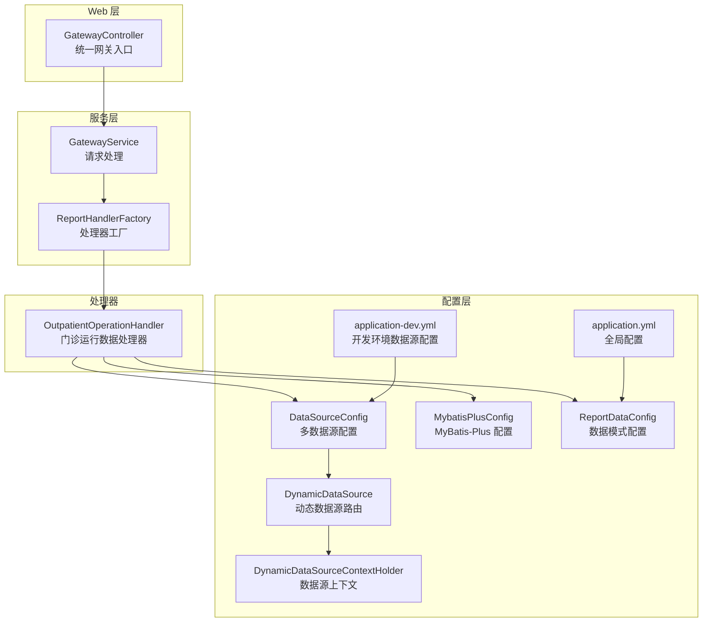
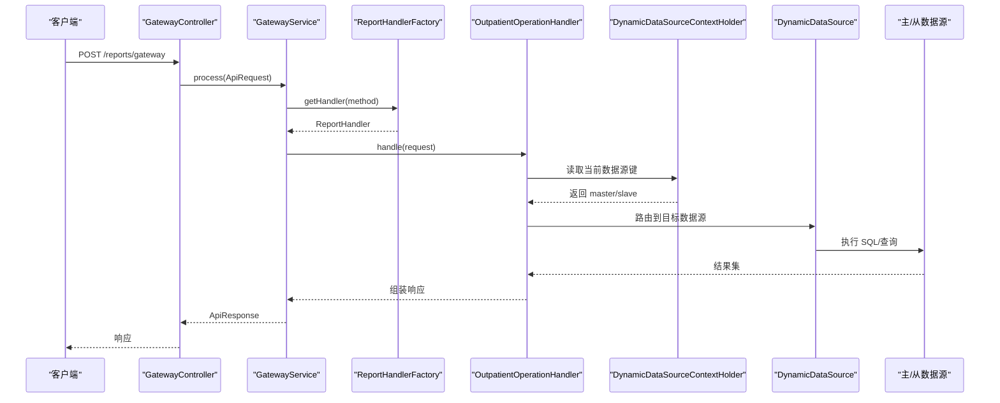
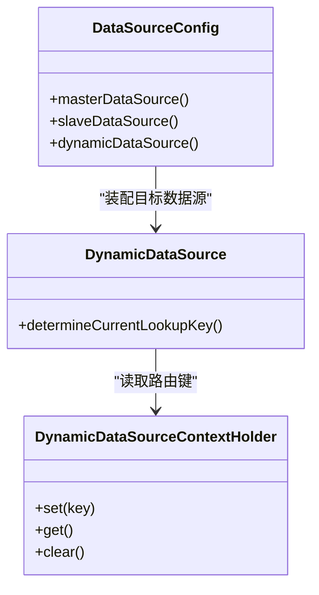
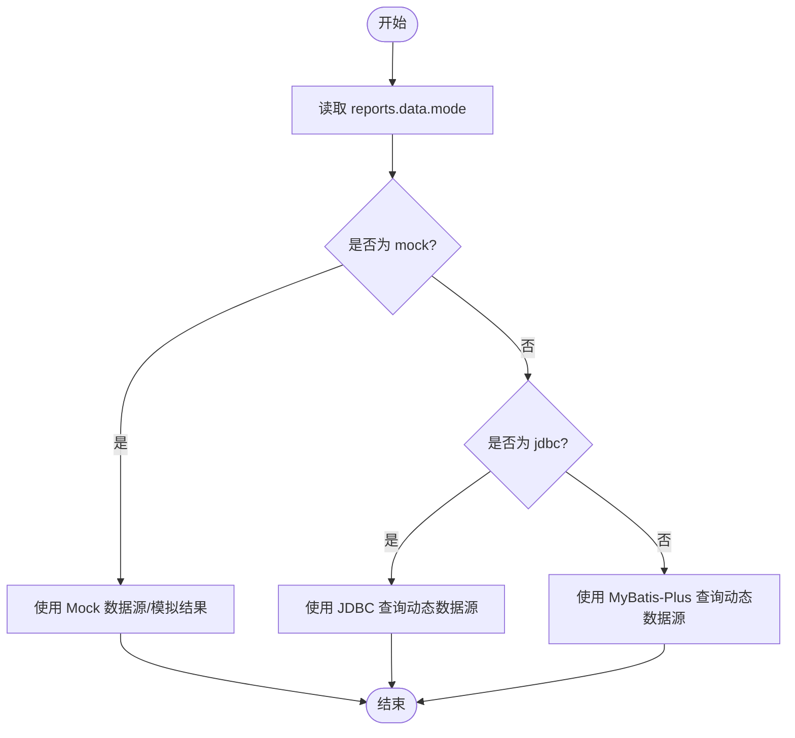
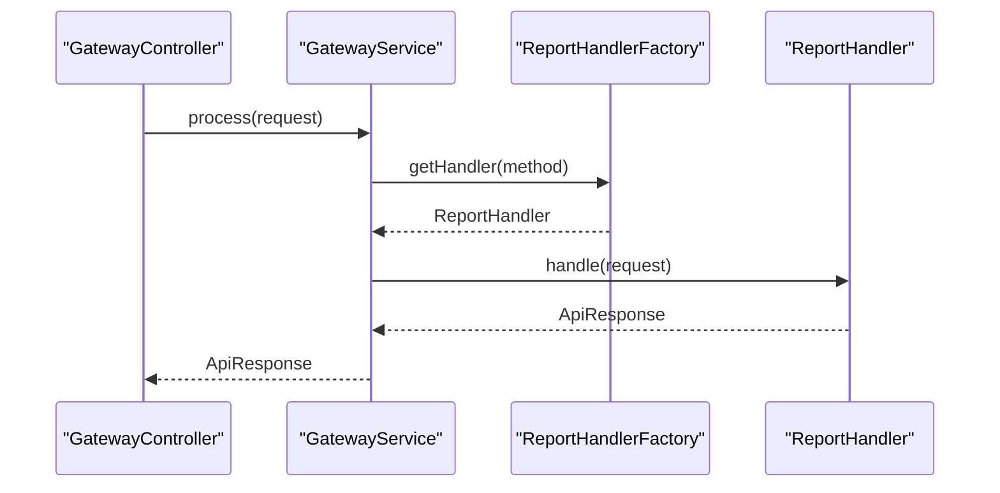
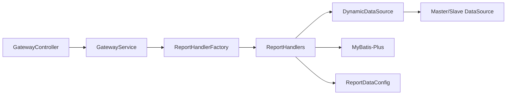

# 数据源问题排查

<cite>
**本文引用的文件**
- [DataSourceConfig.java](file://src/main/java/com/reports/config/DataSourceConfig.java)
- [DynamicDataSource.java](file://src/main/java/com/reports/config/DynamicDataSource.java)
- [DynamicDataSourceContextHolder.java](file://src/main/java/com/reports/config/DynamicDataSourceContextHolder.java)
- [MybatisPlusConfig.java](file://src/main/java/com/reports/config/MybatisPlusConfig.java)
- [ReportDataConfig.java](file://src/main/java/com/reports/config/ReportDataConfig.java)
- [application.yml](file://src/main/resources/application.yml)
- [application-dev.yml](file://src/main/resources/application-dev.yml)
- [GatewayController.java](file://src/main/java/com/reports/controller/GatewayController.java)
- [GatewayService.java](file://src/main/java/com/reports/service/GatewayService.java)
- [GatewayServiceImpl.java](file://src/main/java/com/reports/service/impl/GatewayServiceImpl.java)
- [ReportHandlerFactory.java](file://src/main/java/com/reports/service/handler/ReportHandlerFactory.java)
- [MethodMapping.java](file://src/main/java/com/reports/service/handler/MethodMapping.java)
- [OutpatientOperationHandler.java](file://src/main/java/com/reports/service/handler/impl/OutpatientOperationHandler.java)
- [DataSourceException.java](file://src/main/java/com/reports/exception/DataSourceException.java)
- [LogAspect.java](file://src/main/java/com/reports/aspect/LogAspect.java)
</cite>

## 目录
1. [简介](#简介)
2. [项目结构](#项目结构)
3. [核心组件](#核心组件)
4. [架构总览](#架构总览)
5. [详细组件分析](#详细组件分析)
6. [依赖分析](#依赖分析)
7. [性能考虑](#性能考虑)
8. [故障排查指南](#故障排查指南)
9. [结论](#结论)
10. [附录](#附录)

## 简介
本指南聚焦于“数据源问题排查”，围绕多数据源配置与动态切换、数据库连接超时与连接池耗尽、数据源切换异常、SQL执行性能与慢查询、数据库锁等待、数据源配置验证与连接状态监控、以及数据一致性检查等主题，结合代码库中的实际实现，给出可操作的诊断步骤与优化建议。同时覆盖三种数据源模式（mock、jdbc、mybatis-plus）的问题排查与切换策略。

## 项目结构
该项目采用 Spring Boot 架构，通过配置类定义多数据源与动态路由，并以统一网关入口接收请求，经由处理器工厂分发到具体业务处理器，最终调用服务层完成查询。配置层面支持通过配置文件控制数据模式（mock/jdbc/mybatis-plus），并提供 Oracle 连接参数与 Druid 连接池参数示例。

**图表来源**
- [GatewayController.java:1-38](file://src/main/java/com/reports/controller/GatewayController.java#L1-L38)
- [GatewayServiceImpl.java:1-51](file://src/main/java/com/reports/service/impl/GatewayServiceImpl.java#L1-L51)
- [ReportHandlerFactory.java:1-74](file://src/main/java/com/reports/service/handler/ReportHandlerFactory.java#L1-L74)
- [OutpatientOperationHandler.java:1-65](file://src/main/java/com/reports/service/handler/impl/OutpatientOperationHandler.java#L1-L65)
- [DataSourceConfig.java:1-56](file://src/main/java/com/reports/config/DataSourceConfig.java#L1-L56)
- [DynamicDataSource.java:1-16](file://src/main/java/com/reports/config/DynamicDataSource.java#L1-L16)
- [DynamicDataSourceContextHolder.java:1-38](file://src/main/java/com/reports/config/DynamicDataSourceContextHolder.java#L1-L38)
- [MybatisPlusConfig.java:1-28](file://src/main/java/com/reports/config/MybatisPlusConfig.java#L1-L28)
- [ReportDataConfig.java:1-45](file://src/main/java/com/reports/config/ReportDataConfig.java#L1-L45)
- [application.yml:1-32](file://src/main/resources/application.yml#L1-L32)
- [application-dev.yml:1-45](file://src/main/resources/application-dev.yml#L1-L45)

**章节来源**
- [GatewayController.java:1-38](file://src/main/java/com/reports/controller/GatewayController.java#L1-L38)
- [GatewayServiceImpl.java:1-51](file://src/main/java/com/reports/service/impl/GatewayServiceImpl.java#L1-L51)
- [ReportHandlerFactory.java:1-74](file://src/main/java/com/reports/service/handler/ReportHandlerFactory.java#L1-L74)
- [OutpatientOperationHandler.java:1-65](file://src/main/java/com/reports/service/handler/impl/OutpatientOperationHandler.java#L1-L65)
- [DataSourceConfig.java:1-56](file://src/main/java/com/reports/config/DataSourceConfig.java#L1-L56)
- [DynamicDataSource.java:1-16](file://src/main/java/com/reports/config/DynamicDataSource.java#L1-L16)
- [DynamicDataSourceContextHolder.java:1-38](file://src/main/java/com/reports/config/DynamicDataSourceContextHolder.java#L1-L38)
- [MybatisPlusConfig.java:1-28](file://src/main/java/com/reports/config/MybatisPlusConfig.java#L1-L28)
- [ReportDataConfig.java:1-45](file://src/main/java/com/reports/config/ReportDataConfig.java#L1-L45)
- [application.yml:1-32](file://src/main/resources/application.yml#L1-L32)
- [application-dev.yml:1-45](file://src/main/resources/application-dev.yml#L1-L45)

## 核心组件
- 多数据源与动态路由
  - 通过配置类定义主/从数据源 Bean，并装配到动态数据源中，默认指向主数据源。
  - 动态数据源根据线程上下文中的键值选择目标数据源。
- 数据模式配置
  - 通过配置项控制报表查询走 Mock、JDBC 或 MyBatis-Plus 模式。
- Web 入口与请求分发
  - 统一网关控制器接收请求，服务层校验请求并委派给处理器工厂，按 method 路由到具体处理器。
- 日志与链路追踪
  - 切面记录请求进入、返回与异常，结合 TraceId 便于跨模块定位问题。

**章节来源**
- [DataSourceConfig.java:1-56](file://src/main/java/com/reports/config/DataSourceConfig.java#L1-L56)
- [DynamicDataSource.java:1-16](file://src/main/java/com/reports/config/DynamicDataSource.java#L1-L16)
- [DynamicDataSourceContextHolder.java:1-38](file://src/main/java/com/reports/config/DynamicDataSourceContextHolder.java#L1-L38)
- [ReportDataConfig.java:1-45](file://src/main/java/com/reports/config/ReportDataConfig.java#L1-L45)
- [GatewayController.java:1-38](file://src/main/java/com/reports/controller/GatewayController.java#L1-L38)
- [GatewayServiceImpl.java:1-51](file://src/main/java/com/reports/service/impl/GatewayServiceImpl.java#L1-L51)
- [LogAspect.java:1-74](file://src/main/java/com/reports/aspect/LogAspect.java#L1-L74)

## 架构总览
下图展示从请求进入网关到数据源选择的关键路径，以及数据模式对查询路径的影响。

**图表来源**
- [GatewayController.java:1-38](file://src/main/java/com/reports/controller/GatewayController.java#L1-L38)
- [GatewayServiceImpl.java:1-51](file://src/main/java/com/reports/service/impl/GatewayServiceImpl.java#L1-L51)
- [ReportHandlerFactory.java:1-74](file://src/main/java/com/reports/service/handler/ReportHandlerFactory.java#L1-L74)
- [OutpatientOperationHandler.java:1-65](file://src/main/java/com/reports/service/handler/impl/OutpatientOperationHandler.java#L1-L65)
- [DynamicDataSourceContextHolder.java:1-38](file://src/main/java/com/reports/config/DynamicDataSourceContextHolder.java#L1-L38)
- [DynamicDataSource.java:1-16](file://src/main/java/com/reports/config/DynamicDataSource.java#L1-L16)
- [DataSourceConfig.java:1-56](file://src/main/java/com/reports/config/DataSourceConfig.java#L1-L56)

## 详细组件分析

### 多数据源与动态路由
- 数据源定义
  - 主/从数据源分别绑定到配置前缀 spring.datasource.master 与 spring.datasource.slave。
  - 动态数据源装配两个目标数据源，并设置默认数据源为主数据源。
- 路由机制
  - 动态数据源通过 determineCurrentLookupKey 读取线程上下文中的键，若为空则回退到默认键（master）。
- 切换策略
  - 在业务处理前设置上下文键为 master 或 slave；处理完成后清理，避免泄漏。

**图表来源**
- [DataSourceConfig.java:1-56](file://src/main/java/com/reports/config/DataSourceConfig.java#L1-L56)
- [DynamicDataSource.java:1-16](file://src/main/java/com/reports/config/DynamicDataSource.java#L1-L16)
- [DynamicDataSourceContextHolder.java:1-38](file://src/main/java/com/reports/config/DynamicDataSourceContextHolder.java#L1-L38)

**章节来源**
- [DataSourceConfig.java:1-56](file://src/main/java/com/reports/config/DataSourceConfig.java#L1-L56)
- [DynamicDataSource.java:1-16](file://src/main/java/com/reports/config/DynamicDataSource.java#L1-L16)
- [DynamicDataSourceContextHolder.java:1-38](file://src/main/java/com/reports/config/DynamicDataSourceContextHolder.java#L1-L38)

### 数据模式配置与切换
- 模式控制
  - reports.data.mode 支持 mock、jdbc、mybatis-plus 三类模式，默认为 mock。
  - 提供 isMock/isJdbc/isMybatisPlus 辅助判断。
- 切换策略
  - 在处理器或服务层根据模式分支执行不同查询路径（Mock、JDBC、MyBatis-Plus）。
  - 切换时需确保数据源上下文与模式一致，避免误用。

**图表来源**
- [ReportDataConfig.java:1-45](file://src/main/java/com/reports/config/ReportDataConfig.java#L1-L45)
- [application.yml:21-23](file://src/main/resources/application.yml#L21-L23)

**章节来源**
- [ReportDataConfig.java:1-45](file://src/main/java/com/reports/config/ReportDataConfig.java#L1-L45)
- [application.yml:21-23](file://src/main/resources/application.yml#L21-L23)

### 处理器与请求分发
- 工厂模式
  - 自动扫描所有 ReportHandler 实现，读取 MethodMapping 注解注册到映射表。
  - 支持按 method 快速定位处理器，未找到时抛出业务异常。
- 处理流程
  - 网关控制器接收请求，服务层校验参数，工厂返回处理器，处理器内部根据模式与数据源上下文执行查询。

**图表来源**
- [GatewayController.java:1-38](file://src/main/java/com/reports/controller/GatewayController.java#L1-L38)
- [GatewayServiceImpl.java:1-51](file://src/main/java/com/reports/service/impl/GatewayServiceImpl.java#L1-L51)
- [ReportHandlerFactory.java:1-74](file://src/main/java/com/reports/service/handler/ReportHandlerFactory.java#L1-L74)
- [MethodMapping.java:1-29](file://src/main/java/com/reports/service/handler/MethodMapping.java#L1-L29)

**章节来源**
- [GatewayController.java:1-38](file://src/main/java/com/reports/controller/GatewayController.java#L1-L38)
- [GatewayServiceImpl.java:1-51](file://src/main/java/com/reports/service/impl/GatewayServiceImpl.java#L1-L51)
- [ReportHandlerFactory.java:1-74](file://src/main/java/com/reports/service/handler/ReportHandlerFactory.java#L1-L74)
- [MethodMapping.java:1-29](file://src/main/java/com/reports/service/handler/MethodMapping.java#L1-L29)

### MyBatis-Plus 配置
- 插件与扫描
  - 启用分页插件，针对 Oracle 数据库类型。
  - 扫描 Mapper 包路径，加载 XML 映射文件。
- 影响范围
  - 当模式为 mybatis-plus 时，查询通过 MyBatis-Plus 执行，SQL 日志可通过配置输出。

**章节来源**
- [MybatisPlusConfig.java:1-28](file://src/main/java/com/reports/config/MybatisPlusConfig.java#L1-L28)

## 依赖分析
- 组件耦合
  - 网关层仅依赖服务层接口；服务层依赖处理器工厂；处理器依赖数据访问层（JDBC/MyBatis-Plus/Mock）。
  - 动态数据源与上下文解耦，通过键值路由，降低耦合度。
- 外部依赖
  - Druid 连接池参数在开发环境配置中提供示例，包括初始大小、最大活跃数、最大等待时间、空闲回收周期等。
- 潜在风险
  - 若未正确设置/清理数据源上下文，可能导致错误的数据源路由。
  - 模式切换与数据源切换未同步，可能引发查询失败或数据不一致。

**图表来源**
- [GatewayController.java:1-38](file://src/main/java/com/reports/controller/GatewayController.java#L1-L38)
- [GatewayServiceImpl.java:1-51](file://src/main/java/com/reports/service/impl/GatewayServiceImpl.java#L1-L51)
- [ReportHandlerFactory.java:1-74](file://src/main/java/com/reports/service/handler/ReportHandlerFactory.java#L1-L74)
- [OutpatientOperationHandler.java:1-65](file://src/main/java/com/reports/service/handler/impl/OutpatientOperationHandler.java#L1-L65)
- [DataSourceConfig.java:1-56](file://src/main/java/com/reports/config/DataSourceConfig.java#L1-L56)
- [DynamicDataSource.java:1-16](file://src/main/java/com/reports/config/DynamicDataSource.java#L1-L16)
- [MybatisPlusConfig.java:1-28](file://src/main/java/com/reports/config/MybatisPlusConfig.java#L1-L28)
- [ReportDataConfig.java:1-45](file://src/main/java/com/reports/config/ReportDataConfig.java#L1-L45)

**章节来源**
- [application-dev.yml:1-45](file://src/main/resources/application-dev.yml#L1-L45)

## 性能考虑
- 连接池参数
  - 开发环境示例展示了 Druid 连接池的关键参数，如初始大小、最小空闲、最大活跃、最大等待时间等，直接影响并发与超时行为。
- SQL 执行与分页
  - MyBatis-Plus 分页插件已启用，建议在高并发场景下配合合理的分页策略与索引设计。
- 日志与追踪
  - 切面日志包含 TraceId，便于定位慢查询与异常路径。

**章节来源**
- [application-dev.yml:9-20](file://src/main/resources/application-dev.yml#L9-L20)
- [MybatisPlusConfig.java:1-28](file://src/main/java/com/reports/config/MybatisPlusConfig.java#L1-L28)
- [LogAspect.java:1-74](file://src/main/java/com/reports/aspect/LogAspect.java#L1-L74)

## 故障排查指南

### 一、多数据源配置与切换排查
- 症状
  - 查询落到错误的数据源（只读从库写入、主库不可用导致写失败）。
- 排查步骤
  - 确认配置文件中主/从数据源参数是否正确（驱动、URL、用户名、密码、连接池参数）。
  - 确认动态数据源装配的目标数据源与默认数据源是否正确。
  - 在业务处理前设置数据源上下文键为 master 或 slave；处理完成后清理。
  - 核对处理器是否在正确时机设置了上下文并清理。
- 关联文件
  - [application-dev.yml:2-38](file://src/main/resources/application-dev.yml#L2-L38)
  - [DataSourceConfig.java:1-56](file://src/main/java/com/reports/config/DataSourceConfig.java#L1-L56)
  - [DynamicDataSource.java:1-16](file://src/main/java/com/reports/config/DynamicDataSource.java#L1-L16)
  - [DynamicDataSourceContextHolder.java:1-38](file://src/main/java/com/reports/config/DynamicDataSourceContextHolder.java#L1-L38)
  - [OutpatientOperationHandler.java:1-65](file://src/main/java/com/reports/service/handler/impl/OutpatientOperationHandler.java#L1-L65)

**章节来源**
- [application-dev.yml:2-38](file://src/main/resources/application-dev.yml#L2-L38)
- [DataSourceConfig.java:1-56](file://src/main/java/com/reports/config/DataSourceConfig.java#L1-L56)
- [DynamicDataSource.java:1-16](file://src/main/java/com/reports/config/DynamicDataSource.java#L1-L16)
- [DynamicDataSourceContextHolder.java:1-38](file://src/main/java/com/reports/config/DynamicDataSourceContextHolder.java#L1-L38)
- [OutpatientOperationHandler.java:1-65](file://src/main/java/com/reports/service/handler/impl/OutpatientOperationHandler.java#L1-L65)

### 二、数据库连接超时与连接池耗尽
- 症状
  - 获取连接超时、大量请求堆积、系统响应缓慢。
- 排查步骤
  - 检查连接池参数：初始大小、最小空闲、最大活跃、最大等待时间。
  - 观察连接池指标（活跃连接、等待队列长度、创建/销毁速率）。
  - 评估 SQL 执行时间与事务持续时间，避免长事务占用连接。
  - 在高并发场景下适当提高最大活跃数与最大等待时间，但需结合数据库最大连接数限制。
- 关联文件
  - [application-dev.yml:9-20](file://src/main/resources/application-dev.yml#L9-L20)

**章节来源**
- [application-dev.yml:9-20](file://src/main/resources/application-dev.yml#L9-L20)

### 三、数据源切换异常
- 症状
  - 上下文未清理导致后续请求使用错误数据源；或切换逻辑缺失导致默认回退为主库。
- 排查步骤
  - 确保在每次请求结束后调用上下文清理方法。
  - 在关键节点打印/记录当前数据源键，核对预期与实际。
  - 对切换逻辑增加单元测试，覆盖正常与异常分支。
- 关联文件
  - [DynamicDataSourceContextHolder.java:1-38](file://src/main/java/com/reports/config/DynamicDataSourceContextHolder.java#L1-L38)
  - [LogAspect.java:1-74](file://src/main/java/com/reports/aspect/LogAspect.java#L1-L74)

**章节来源**
- [DynamicDataSourceContextHolder.java:1-38](file://src/main/java/com/reports/config/DynamicDataSourceContextHolder.java#L1-L38)
- [LogAspect.java:1-74](file://src/main/java/com/reports/aspect/LogAspect.java#L1-L74)

### 四、SQL 执行性能分析与慢查询识别
- 症状
  - 接口响应时间过长、数据库负载升高。
- 排查步骤
  - 启用 SQL 日志输出（MyBatis-Plus 配置中可开启日志实现），结合 TraceId 定位慢查询。
  - 使用数据库自带的执行计划工具分析慢 SQL，补充必要索引。
  - 分页查询需配合合理分页策略，避免大偏移量。
- 关联文件
  - [MybatisPlusConfig.java:1-28](file://src/main/java/com/reports/config/MybatisPlusConfig.java#L1-L28)
  - [LogAspect.java:1-74](file://src/main/java/com/reports/aspect/LogAspect.java#L1-L74)

**章节来源**
- [MybatisPlusConfig.java:1-28](file://src/main/java/com/reports/config/MybatisPlusConfig.java#L1-L28)
- [LogAspect.java:1-74](file://src/main/java/com/reports/aspect/LogAspect.java#L1-L74)

### 五、数据库锁等待问题排查
- 症状
  - 请求长时间阻塞、出现锁等待或死锁。
- 排查步骤
  - 通过数据库锁监控工具查看锁等待链路与持有者。
  - 检查热点更新语句与事务边界，减少长事务与热点行锁竞争。
  - 在应用侧增加重试与超时控制，避免级联阻塞。
- 关联文件
  - [application-dev.yml:9-20](file://src/main/resources/application-dev.yml#L9-L20)

**章节来源**
- [application-dev.yml:9-20](file://src/main/resources/application-dev.yml#L9-L20)

### 六、数据源配置验证与连接状态监控
- 配置验证
  - 使用最小化配置启动，逐项验证主/从数据源连通性与权限。
  - 对比配置文件与运行时生效配置，确认未遗漏覆盖项。
- 连接状态监控
  - 结合 Druid 提供的监控页面或指标，观察活跃连接、等待时间、错误计数等。
- 关联文件
  - [application-dev.yml:9-20](file://src/main/resources/application-dev.yml#L9-L20)
  - [DataSourceConfig.java:1-56](file://src/main/java/com/reports/config/DataSourceConfig.java#L1-L56)

**章节来源**
- [application-dev.yml:9-20](file://src/main/resources/application-dev.yml#L9-L20)
- [DataSourceConfig.java:1-56](file://src/main/java/com/reports/config/DataSourceConfig.java#L1-L56)

### 七、数据一致性检查
- 检查点
  - 主从延迟：对比主库与从库关键指标，评估复制延迟。
  - 读写分离一致性：确保写操作后读取主库，重要查询强制走主库。
  - 并发一致性：检查事务隔离级别与锁策略，避免脏读与幻读。
- 关联文件
  - [DynamicDataSourceContextHolder.java:1-38](file://src/main/java/com/reports/config/DynamicDataSourceContextHolder.java#L1-L38)

**章节来源**
- [DynamicDataSourceContextHolder.java:1-38](file://src/main/java/com/reports/config/DynamicDataSourceContextHolder.java#L1-L38)

### 八、不同数据源模式的问题排查与切换策略
- Mock 模式
  - 适用：开发调试、快速验证接口契约。
  - 风险：与真实数据存在偏差，不能替代真实数据库测试。
  - 排查：确认模式开关与 Mock 数据生成逻辑，避免误用真实数据源。
- JDBC 模式
  - 适用：直接使用 JdbcTemplate/JDBC API 执行 SQL。
  - 风险：SQL 书写与性能优化需自行负责。
  - 排查：核对 SQL 语法、参数绑定、事务传播与连接释放。
- MyBatis-Plus 模式
  - 适用：ORM 场景，分页、条件构造器等能力。
  - 风险：复杂 SQL 可能难以维护，需关注 SQL 输出与执行计划。
  - 排查：启用 SQL 日志、检查分页插件配置、核对 Mapper/XML。
- 切换策略
  - 在处理器或服务层根据 reports.data.mode 决定执行路径，确保切换前后上下文一致。
  - 切换时记录 TraceId，便于问题回溯。
- 关联文件
  - [ReportDataConfig.java:1-45](file://src/main/java/com/reports/config/ReportDataConfig.java#L1-L45)
  - [application.yml:21-23](file://src/main/resources/application.yml#L21-L23)
  - [MybatisPlusConfig.java:1-28](file://src/main/java/com/reports/config/MybatisPlusConfig.java#L1-L28)
  - [OutpatientOperationHandler.java:1-65](file://src/main/java/com/reports/service/handler/impl/OutpatientOperationHandler.java#L1-L65)

**章节来源**
- [ReportDataConfig.java:1-45](file://src/main/java/com/reports/config/ReportDataConfig.java#L1-L45)
- [application.yml:21-23](file://src/main/resources/application.yml#L21-L23)
- [MybatisPlusConfig.java:1-28](file://src/main/java/com/reports/config/MybatisPlusConfig.java#L1-L28)
- [OutpatientOperationHandler.java:1-65](file://src/main/java/com/reports/service/handler/impl/OutpatientOperationHandler.java#L1-L65)

## 结论
本指南基于代码库的实际实现，提供了从配置、路由、模式切换到性能与一致性保障的全链路排查思路。建议在生产环境中：
- 明确主从职责与切换边界；
- 严格管理数据源上下文生命周期；
- 启用可观测性（日志、指标、链路追踪）；
- 持续优化 SQL 与索引，控制连接池规模；
- 在模式切换前后做好一致性与数据验证。

## 附录
- 常用排查清单
  - 数据源参数核对（驱动、URL、账号、密码、连接池参数）
  - 动态数据源装配与默认数据源配置
  - 数据源上下文设置与清理
  - 模式开关与处理器分支逻辑
  - SQL 日志与执行计划
  - 连接池指标与数据库锁监控
  - 主从延迟与一致性验证