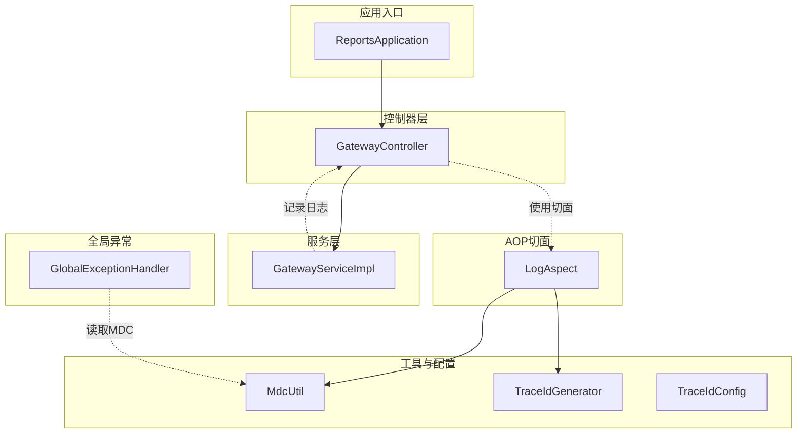
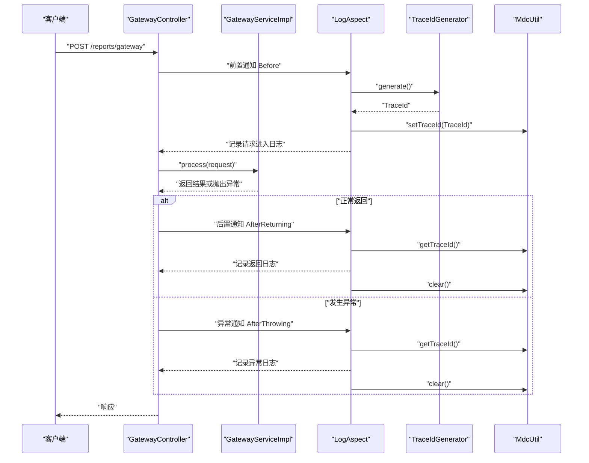
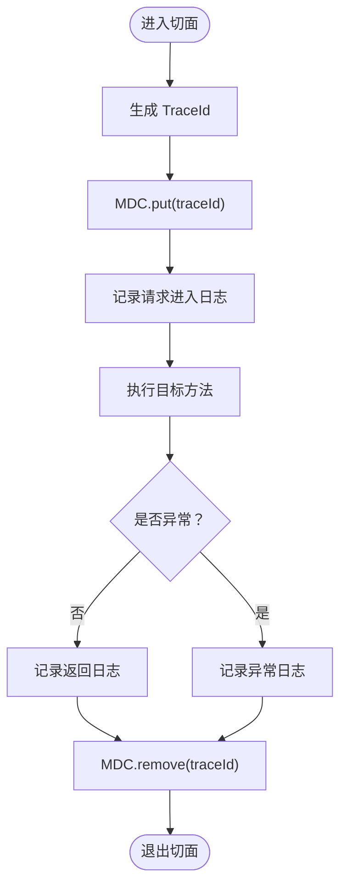
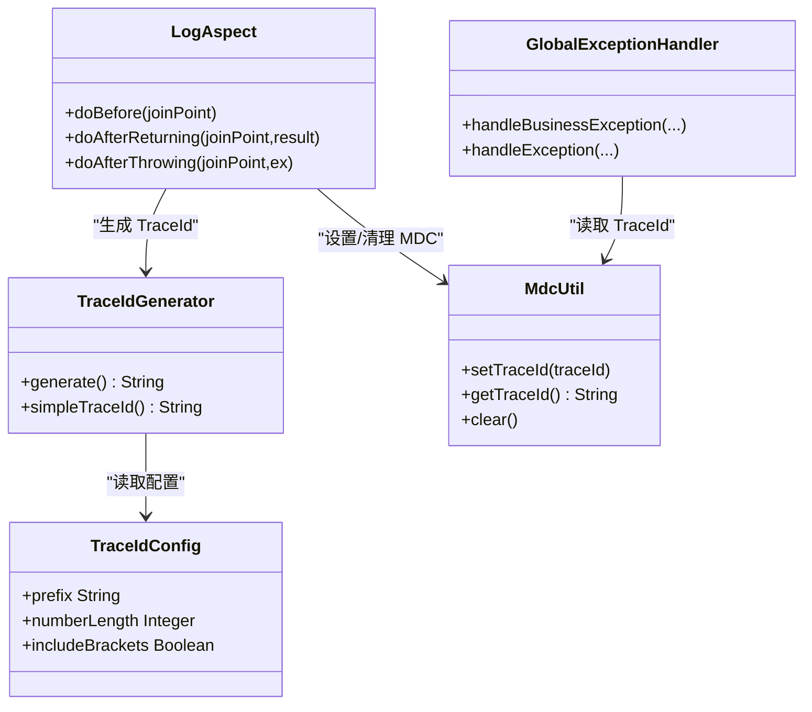

# 日志分析排查

<cite>
**本文引用的文件**
- [LogAspect.java](file://src/main/java/com/reports/aspect/LogAspect.java)
- [MdcUtil.java](file://src/main/java/com/reports/util/MdcUtil.java)
- [TraceIdGenerator.java](file://src/main/java/com/reports/util/TraceIdGenerator.java)
- [TraceIdConfig.java](file://src/main/java/com/reports/config/TraceIdConfig.java)
- [application.yml](file://src/main/resources/application.yml)
- [application-dev.yml](file://src/main/resources/application-dev.yml)
- [GatewayController.java](file://src/main/java/com/reports/controller/GatewayController.java)
- [GatewayServiceImpl.java](file://src/main/java/com/reports/service/impl/GatewayServiceImpl.java)
- [GlobalExceptionHandler.java](file://src/main/java/com/reports/exception/GlobalExceptionHandler.java)
- [ReportsApplication.java](file://src/main/java/com/reports/ReportsApplication.java)
</cite>

## 目录
1. [简介](#简介)
2. [项目结构](#项目结构)
3. [核心组件](#核心组件)
4. [架构总览](#架构总览)
5. [详细组件分析](#详细组件分析)
6. [依赖关系分析](#依赖关系分析)
7. [性能考量](#性能考量)
8. [故障排查指南](#故障排查指南)
9. [结论](#结论)
10. [附录](#附录)

## 简介
本指南围绕该报告网关项目的日志体系展开，重点覆盖以下内容：
- AOP日志切面的实现原理与日志记录机制
- TraceId链路追踪的使用方法、MDC上下文传递与日志聚合
- 关键日志节点标记与跨服务调用的日志关联策略
- 日志级别设置、日志查询与分析工具使用建议
- 开发调试日志与生产环境日志的最佳实践
- 日志性能优化建议与常见问题排查

## 项目结构
该项目采用 Spring Boot 标准目录结构，日志相关的关键模块分布如下：
- 切面与工具：aspect、util
- 配置：config
- 控制层与服务层：controller、service
- 全局异常处理：exception
- 应用入口：ReportsApplication
- 日志与配置：application.yml、application-dev.yml

图表来源
- [ReportsApplication.java:1-19](file://src/main/java/com/reports/ReportsApplication.java#L1-L19)
- [GatewayController.java:1-38](file://src/main/java/com/reports/controller/GatewayController.java#L1-L38)
- [GatewayServiceImpl.java:1-51](file://src/main/java/com/reports/service/impl/GatewayServiceImpl.java#L1-L51)
- [LogAspect.java:1-74](file://src/main/java/com/reports/aspect/LogAspect.java#L1-L74)
- [MdcUtil.java:1-34](file://src/main/java/com/reports/util/MdcUtil.java#L1-L34)
- [TraceIdGenerator.java:1-57](file://src/main/java/com/reports/util/TraceIdGenerator.java#L1-L57)
- [TraceIdConfig.java:1-33](file://src/main/java/com/reports/config/TraceIdConfig.java#L1-L33)
- [GlobalExceptionHandler.java:1-85](file://src/main/java/com/reports/exception/GlobalExceptionHandler.java#L1-L85)

章节来源
- [ReportsApplication.java:1-19](file://src/main/java/com/reports/ReportsApplication.java#L1-L19)
- [application.yml:1-32](file://src/main/resources/application.yml#L1-L32)

## 核心组件
- AOP日志切面：在网关控制器方法执行前后织入日志，生成并注入 TraceId，记录请求进入、返回与异常信息，并在完成后清理上下文。
- MDC 工具：封装 SLF4J MDC 的 TraceId 存取与清理，确保线程上下文一致。
- TraceId 生成器：根据配置生成带前缀与方括号的 TraceId；提供简单 TraceId 生成方法供内部使用。
- TraceId 配置：通过配置项控制前缀、数字长度与是否包含方括号。
- 全局异常处理器：从 MDC 中读取 TraceId，统一输出异常日志，便于跨模块关联。

章节来源
- [LogAspect.java:1-74](file://src/main/java/com/reports/aspect/LogAspect.java#L1-L74)
- [MdcUtil.java:1-34](file://src/main/java/com/reports/util/MdcUtil.java#L1-L34)
- [TraceIdGenerator.java:1-57](file://src/main/java/com/reports/util/TraceIdGenerator.java#L1-L57)
- [TraceIdConfig.java:1-33](file://src/main/java/com/reports/config/TraceIdConfig.java#L1-L33)
- [GlobalExceptionHandler.java:1-85](file://src/main/java/com/reports/exception/GlobalExceptionHandler.java#L1-L85)

## 架构总览
下图展示一次请求从进入网关到返回的完整链路，以及日志与 TraceId 的贯穿过程。

图表来源
- [LogAspect.java:1-74](file://src/main/java/com/reports/aspect/LogAspect.java#L1-L74)
- [TraceIdGenerator.java:1-57](file://src/main/java/com/reports/util/TraceIdGenerator.java#L1-L57)
- [MdcUtil.java:1-34](file://src/main/java/com/reports/util/MdcUtil.java#L1-L34)
- [GatewayController.java:1-38](file://src/main/java/com/reports/controller/GatewayController.java#L1-L38)
- [GatewayServiceImpl.java:1-51](file://src/main/java/com/reports/service/impl/GatewayServiceImpl.java#L1-L51)

## 详细组件分析

### AOP 日志切面（LogAspect）
- 切点定义：针对网关控制器的所有方法，确保请求生命周期内的日志覆盖。
- 前置通知：生成 TraceId，写入 MDC，记录请求进入日志（含类名、方法名与参数）。
- 后置通知：从 MDC 读取 TraceId，记录返回日志，随后清理上下文。
- 异常通知：从 MDC 读取 TraceId，记录异常日志，随后清理上下文。
- 设计要点：通过 AOP 将横切关注点与业务逻辑解耦，保证日志的一致性与完整性。

图表来源
- [LogAspect.java:1-74](file://src/main/java/com/reports/aspect/LogAspect.java#L1-L74)
- [MdcUtil.java:1-34](file://src/main/java/com/reports/util/MdcUtil.java#L1-L34)
- [TraceIdGenerator.java:1-57](file://src/main/java/com/reports/util/TraceIdGenerator.java#L1-L57)

章节来源
- [LogAspect.java:1-74](file://src/main/java/com/reports/aspect/LogAspect.java#L1-L74)

### MDC 上下文工具（MdcUtil）
- 职责：封装 MDC 的 TraceId 存取与清理，避免直接操作 MDC 的分散代码。
- 关键点：统一键名、线程安全、生命周期管理（进入时设置、异常/返回后清理）。

章节来源
- [MdcUtil.java:1-34](file://src/main/java/com/reports/util/MdcUtil.java#L1-L34)

### TraceId 生成器（TraceIdGenerator）
- 生成策略：基于配置前缀与数字长度拼接，可选包裹方括号；提供简单 TraceId 生成方法用于内部场景。
- 配置依赖：读取 TraceIdConfig 的前缀、长度与括号开关。
- 性能考虑：使用安全随机数与原子计数器，兼顾唯一性与线程安全。

章节来源
- [TraceIdGenerator.java:1-57](file://src/main/java/com/reports/util/TraceIdGenerator.java#L1-L57)
- [TraceIdConfig.java:1-33](file://src/main/java/com/reports/config/TraceIdConfig.java#L1-L33)

### 全局异常处理（GlobalExceptionHandler）
- 功能：从 MDC 读取 TraceId，统一输出各类异常日志，便于跨模块串联。
- 覆盖范围：业务异常、参数绑定异常、非法参数、数据源异常与通用系统异常。
- 输出格式：包含 TraceId，便于按链路检索。

章节来源
- [GlobalExceptionHandler.java:1-85](file://src/main/java/com/reports/exception/GlobalExceptionHandler.java#L1-L85)
- [MdcUtil.java:1-34](file://src/main/java/com/reports/util/MdcUtil.java#L1-L34)

### 控制器与服务层日志
- 控制器：记录请求到达与处理阶段的日志，便于定位入口层问题。
- 服务层：记录方法级处理流程与关键决策点，辅助排查业务逻辑。

章节来源
- [GatewayController.java:1-38](file://src/main/java/com/reports/controller/GatewayController.java#L1-L38)
- [GatewayServiceImpl.java:1-51](file://src/main/java/com/reports/service/impl/GatewayServiceImpl.java#L1-L51)

## 依赖关系分析
- LogAspect 依赖 TraceIdGenerator 与 MdcUtil，负责在控制器方法执行前后注入与清理 TraceId。
- TraceIdGenerator 依赖 TraceIdConfig，受配置驱动。
- GlobalExceptionHandler 依赖 MdcUtil 读取 TraceId，统一输出异常日志。
- 控制器与服务层通过日志与 TraceId 实现端到端链路追踪。

图表来源
- [LogAspect.java:1-74](file://src/main/java/com/reports/aspect/LogAspect.java#L1-L74)
- [TraceIdGenerator.java:1-57](file://src/main/java/com/reports/util/TraceIdGenerator.java#L1-L57)
- [TraceIdConfig.java:1-33](file://src/main/java/com/reports/config/TraceIdConfig.java#L1-L33)
- [MdcUtil.java:1-34](file://src/main/java/com/reports/util/MdcUtil.java#L1-L34)
- [GlobalExceptionHandler.java:1-85](file://src/main/java/com/reports/exception/GlobalExceptionHandler.java#L1-L85)

## 性能考量
- 日志级别：开发环境可开启更细粒度日志（如 com.reports: TRACE），生产环境建议收敛至 INFO/ WARN/ ERROR，避免高吞吐场景下的 I/O 压力。
- 日志格式：控制台模式中包含 TraceId 占位符，便于快速过滤与聚合；生产环境建议接入集中式日志系统（如 ELK/SLS）以提升检索效率。
- 切面开销：AOP 切面在方法前后织入日志，通常开销较小；但应避免在高频路径上输出过重日志体（如大对象序列化）。
- TraceId 生成：随机数与字符串拼接成本极低；若存在大量并发，仍需关注日志系统承载能力。
- 异常处理：统一异常日志输出可减少重复代码，同时确保 TraceId 一致性，降低排查成本。

## 故障排查指南
- 快速定位请求链路
  - 在请求进入时，切面会生成并写入 TraceId；在返回与异常时读取并输出日志。可通过 TraceId 在全链路中串联请求。
  - 参考路径：[LogAspect.java:1-74](file://src/main/java/com/reports/aspect/LogAspect.java#L1-L74)、[MdcUtil.java:1-34](file://src/main/java/com/reports/util/MdcUtil.java#L1-L34)
- 检查 TraceId 生成与配置
  - 若日志中未出现期望的 TraceId 格式，检查配置项 reports.trace 的前缀、长度与括号开关。
  - 参考路径：[application.yml:12-20](file://src/main/resources/application.yml#L12-L20)、[TraceIdConfig.java:1-33](file://src/main/java/com/reports/config/TraceIdConfig.java#L1-L33)
- 排查异常与错误
  - 全局异常处理器会从 MDC 读取 TraceId 并输出异常日志；若缺失 TraceId，确认切面是否正确设置与清理。
  - 参考路径：[GlobalExceptionHandler.java:1-85](file://src/main/java/com/reports/exception/GlobalExceptionHandler.java#L1-L85)、[LogAspect.java:1-74](file://src/main/java/com/reports/aspect/LogAspect.java#L1-L74)
- 开发与生产日志差异
  - 开发环境可启用 com.reports: TRACE 以便观察详细流程；生产环境建议降低级别并接入集中式日志平台。
  - 参考路径：[application.yml:25-31](file://src/main/resources/application.yml#L25-L31)
- 数据源与 SQL 日志
  - 开发环境可开启 MyBatis SQL 输出，便于定位数据访问问题；生产环境应关闭或限制输出。
  - 参考路径：[application-dev.yml:40-44](file://src/main/resources/application-dev.yml#L40-L44)

章节来源
- [LogAspect.java:1-74](file://src/main/java/com/reports/aspect/LogAspect.java#L1-L74)
- [MdcUtil.java:1-34](file://src/main/java/com/reports/util/MdcUtil.java#L1-L34)
- [TraceIdConfig.java:1-33](file://src/main/java/com/reports/config/TraceIdConfig.java#L1-L33)
- [application.yml:25-31](file://src/main/resources/application.yml#L25-L31)
- [application-dev.yml:40-44](file://src/main/resources/application-dev.yml#L40-L44)
- [GlobalExceptionHandler.java:1-85](file://src/main/java/com/reports/exception/GlobalExceptionHandler.java#L1-L85)

## 结论
该日志体系通过 AOP 切面、MDC 与 TraceId 生成器实现了端到端的链路追踪，配合全局异常处理与合理的日志级别配置，能够在开发与生产环境中高效定位问题。建议在生产环境接入集中式日志平台，结合 TraceId 实现跨服务的统一检索与聚合分析。

## 附录

### 日志级别设置与最佳实践
- 开发环境
  - 建议：com.reports: TRACE，便于观察完整链路与业务细节
  - 参考路径：[application.yml:27-28](file://src/main/resources/application.yml#L27-L28)
- 生产环境
  - 建议：INFO/WARN/ERROR，避免过度 I/O；必要时开启采样或条件日志
  - 参考路径：[application.yml:27-29](file://src/main/resources/application.yml#L27-L29)

### 关键日志节点标记建议
- 请求进入：记录类名、方法名与参数摘要
- 业务处理：记录关键分支与决策点
- 返回/异常：记录结果或异常堆栈，务必包含 TraceId
- 参考路径：[LogAspect.java:42-71](file://src/main/java/com/reports/aspect/LogAspect.java#L42-L71)、[GatewayController.java:33-35](file://src/main/java/com/reports/controller/GatewayController.java#L33-L35)、[GatewayServiceImpl.java:38-47](file://src/main/java/com/reports/service/impl/GatewayServiceImpl.java#L38-L47)

### TraceId 配置项说明
- reports.trace.prefix：前缀，默认“YQ”
- reports.trace.number-length：数字长度，默认9
- reports.trace.include-brackets：是否包含方括号，默认true
- 参考路径：[application.yml:12-20](file://src/main/resources/application.yml#L12-L20)、[TraceIdConfig.java:15-31](file://src/main/java/com/reports/config/TraceIdConfig.java#L15-L31)

### 日志查询与分析建议
- 查询语法示例（以集中式日志平台为例）
  - 按 TraceId 聚合：traceId="YQ123456789" | group by traceId
  - 按时间窗口统计：timestamp >= "2025-01-01T00:00:00Z" AND timestamp <= "2025-01-02T00:00:00Z"
  - 按错误类型过滤：level="ERROR" AND message="系统异常"
- 分析技巧
  - 以 TraceId 为线索串联请求进入、服务处理与异常抛出
  - 对高频错误进行分组统计，识别热点问题
  - 结合业务维度（如 method）进行聚合分析

### 跨服务调用的日志关联
- 在上游服务生成并透传 TraceId 至下游（如通过请求头或消息头）
- 下游服务在入口处读取并写入 MDC，确保后续日志均携带同一 TraceId
- 参考路径：[MdcUtil.java:10-31](file://src/main/java/com/reports/util/MdcUtil.java#L10-L31)、[LogAspect.java:42-71](file://src/main/java/com/reports/aspect/LogAspect.java#L42-L71)

### 日志性能优化建议
- 控制日志体量：避免输出大对象或复杂结构；必要时输出摘要
- 合理使用异步日志：在高并发场景下减少阻塞
- 选择合适的日志级别：生产环境避免过多 TRACE/INFO
- 使用结构化日志：便于解析与检索
- 参考路径：[application.yml:25-31](file://src/main/resources/application.yml#L25-L31)