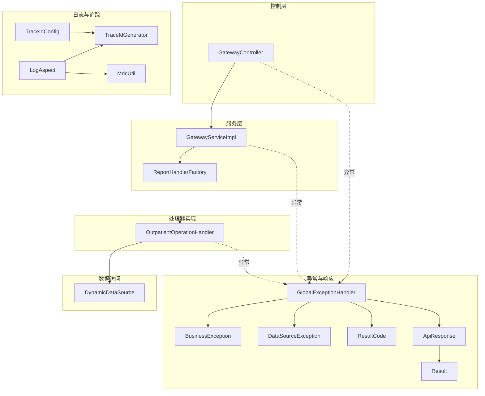
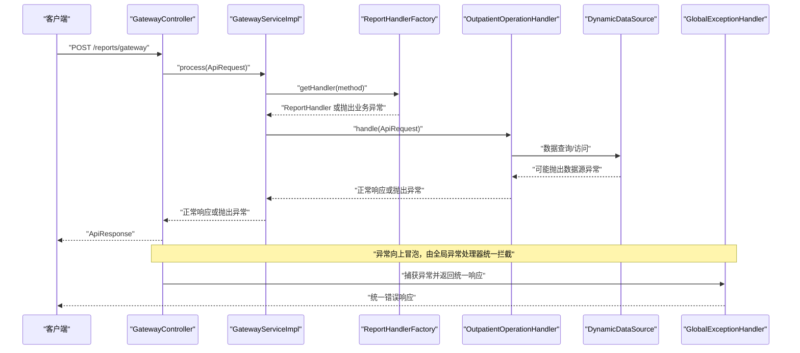
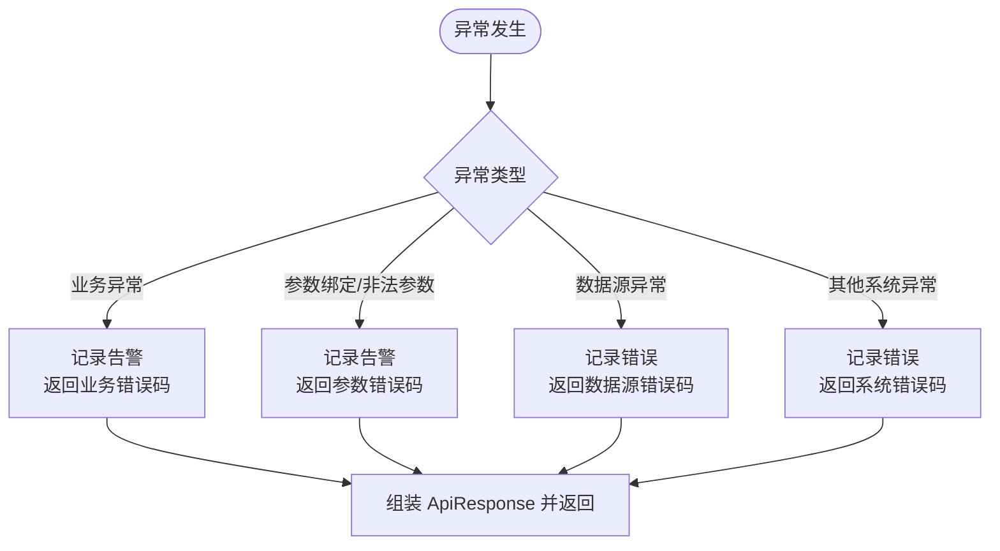
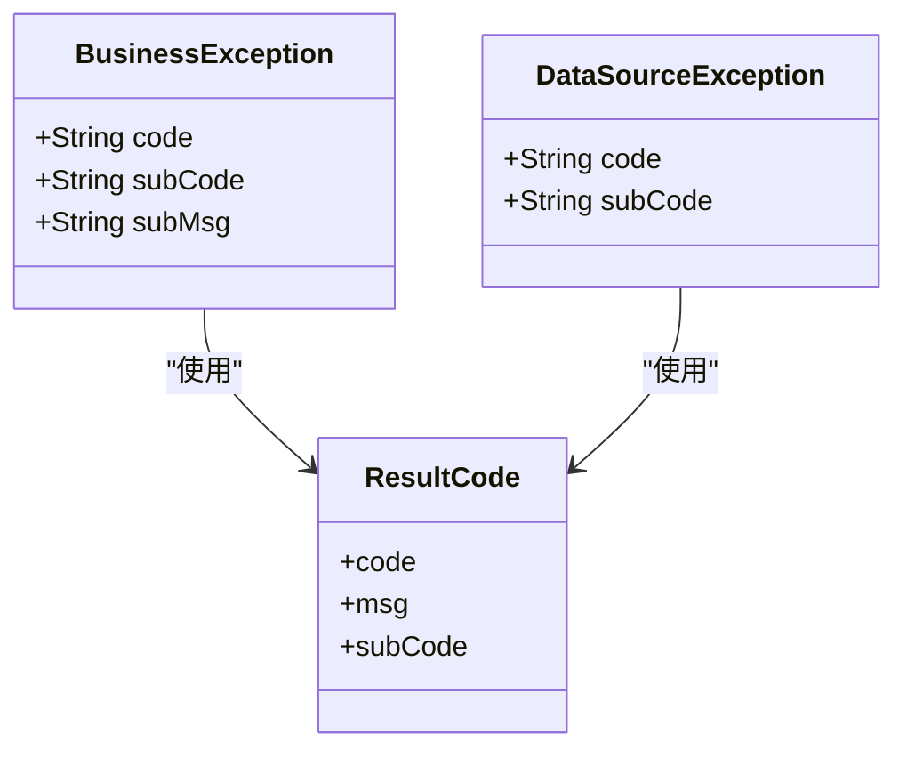
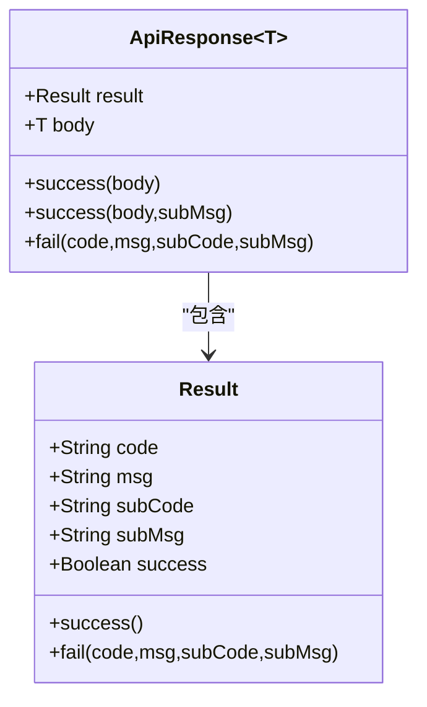
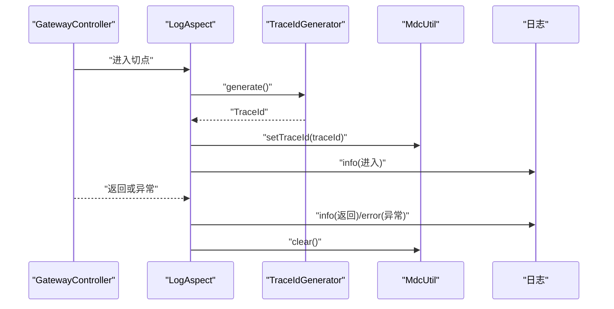
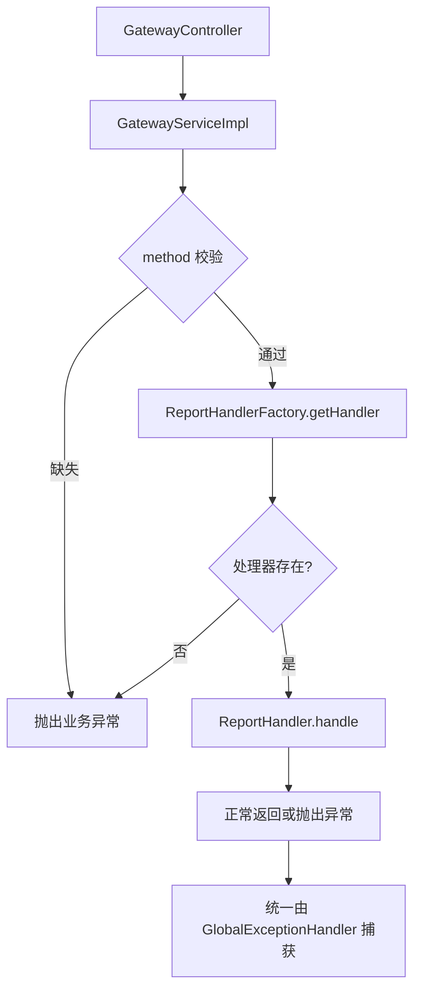
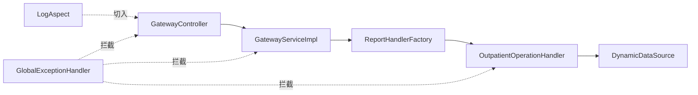
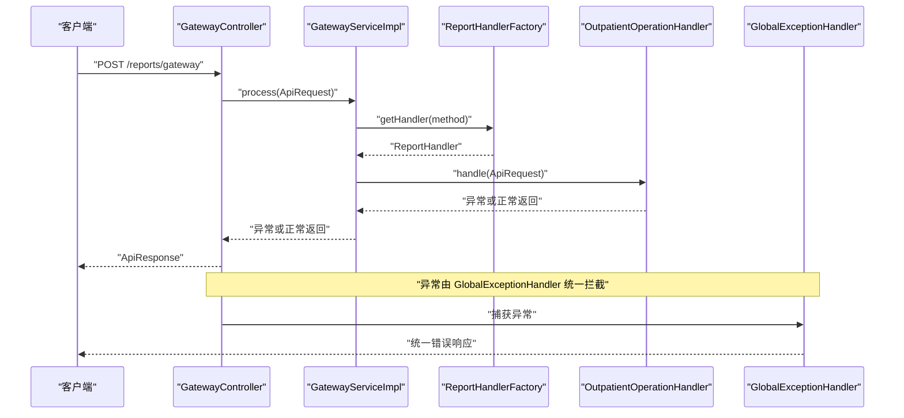

# 系统错误排查

<cite>
**本文引用的文件**
- [GlobalExceptionHandler.java](file://src/main/java/com/reports/exception/GlobalExceptionHandler.java)
- [BusinessException.java](file://src/main/java/com/reports/exception/BusinessException.java)
- [DataSourceException.java](file://src/main/java/com/reports/exception/DataSourceException.java)
- [ResultCode.java](file://src/main/java/com/reports/enums/ResultCode.java)
- [ApiResponse.java](file://src/main/java/com/reports/dto/common/ApiResponse.java)
- [Result.java](file://src/main/java/com/reports/dto/common/Result.java)
- [LogAspect.java](file://src/main/java/com/reports/aspect/LogAspect.java)
- [MdcUtil.java](file://src/main/java/com/reports/util/MdcUtil.java)
- [TraceIdGenerator.java](file://src/main/java/com/reports/util/TraceIdGenerator.java)
- [application.yml](file://src/main/resources/application.yml)
- [application-dev.yml](file://src/main/resources/application-dev.yml)
- [GatewayController.java](file://src/main/java/com/reports/controller/GatewayController.java)
- [GatewayServiceImpl.java](file://src/main/java/com/reports/service/impl/GatewayServiceImpl.java)
- [ReportHandlerFactory.java](file://src/main/java/com/reports/service/handler/ReportHandlerFactory.java)
- [OutpatientOperationHandler.java](file://src/main/java/com/reports/service/handler/impl/OutpatientOperationHandler.java)
- [DynamicDataSource.java](file://src/main/java/com/reports/config/DynamicDataSource.java)
- [TraceIdConfig.java](file://src/main/java/com/reports/config/TraceIdConfig.java)
</cite>

## 目录
1. [简介](#简介)
2. [项目结构](#项目结构)
3. [核心组件](#核心组件)
4. [架构总览](#架构总览)
5. [详细组件分析](#详细组件分析)
6. [依赖关系分析](#依赖关系分析)
7. [性能与稳定性考量](#性能与稳定性考量)
8. [故障排查指南](#故障排查指南)
9. [结论](#结论)
10. [附录](#附录)

## 简介
本指南面向开发与运维人员，聚焦于系统异常排查与治理。内容涵盖全局异常处理器工作机制、异常类型与处理流程、错误码对照、异常日志查看方法、异常分类与优先级策略、开发调试中的异常捕获技巧以及生产环境的异常监控建议。通过结合链路追踪与统一响应模型，帮助快速定位问题根因并高效恢复服务。

## 项目结构
围绕异常处理的关键模块与文件如下：
- 异常定义与统一响应
  - 异常类：BusinessException、DataSourceException
  - 统一响应封装：ApiResponse、Result
  - 错误码枚举：ResultCode
- 全局异常处理：GlobalExceptionHandler
- 链路追踪与日志切面：LogAspect、MdcUtil、TraceIdGenerator、TraceIdConfig
- 控制器与服务层：GatewayController、GatewayServiceImpl
- 处理器工厂与示例处理器：ReportHandlerFactory、OutpatientOperationHandler
- 动态数据源：DynamicDataSource
- 配置文件：application.yml、application-dev.yml

图表来源
- [GatewayController.java:1-38](file://src/main/java/com/reports/controller/GatewayController.java#L1-L38)
- [GatewayServiceImpl.java:1-51](file://src/main/java/com/reports/service/impl/GatewayServiceImpl.java#L1-L51)
- [ReportHandlerFactory.java:1-74](file://src/main/java/com/reports/service/handler/ReportHandlerFactory.java#L1-L74)
- [OutpatientOperationHandler.java:1-65](file://src/main/java/com/reports/service/handler/impl/OutpatientOperationHandler.java#L1-L65)
- [GlobalExceptionHandler.java:1-86](file://src/main/java/com/reports/exception/GlobalExceptionHandler.java#L1-L86)
- [BusinessException.java:1-38](file://src/main/java/com/reports/exception/BusinessException.java#L1-L38)
- [DataSourceException.java:1-28](file://src/main/java/com/reports/exception/DataSourceException.java#L1-L28)
- [ResultCode.java:1-77](file://src/main/java/com/reports/enums/ResultCode.java#L1-L77)
- [ApiResponse.java:1-57](file://src/main/java/com/reports/dto/common/ApiResponse.java#L1-L57)
- [Result.java:1-78](file://src/main/java/com/reports/dto/common/Result.java#L1-L78)
- [LogAspect.java:1-74](file://src/main/java/com/reports/aspect/LogAspect.java#L1-L74)
- [MdcUtil.java:1-34](file://src/main/java/com/reports/util/MdcUtil.java#L1-L34)
- [TraceIdGenerator.java:1-57](file://src/main/java/com/reports/util/TraceIdGenerator.java#L1-L57)
- [TraceIdConfig.java:1-33](file://src/main/java/com/reports/config/TraceIdConfig.java#L1-L33)
- [DynamicDataSource.java:1-16](file://src/main/java/com/reports/config/DynamicDataSource.java#L1-L16)

章节来源
- [application.yml:1-32](file://src/main/resources/application.yml#L1-L32)
- [application-dev.yml:1-45](file://src/main/resources/application-dev.yml#L1-L45)

## 核心组件
- 全局异常处理器：集中拦截业务异常、参数绑定异常、非法参数异常、数据源异常与其他系统异常，统一输出 ApiResponse 结构化响应。
- 业务异常与数据源异常：分别承载业务错误与数据源切换/访问错误，携带主子错误码与消息。
- 统一响应模型：Result 与 ApiResponse 提供一致的响应结构，便于前端与监控系统解析。
- 错误码枚举：ResultCode 定义标准错误码，覆盖参数、方法、数据、数据库、数据源、SQL、系统等类别。
- 链路追踪：LogAspect 在网关入口生成并注入 TraceId，贯穿请求生命周期；MdcUtil/TraceIdGenerator/TraceIdConfig 提供追踪号生成与配置。
- 动态数据源：DynamicDataSource 基于上下文路由数据源，配合 DataSourceException 可识别数据源相关异常。

章节来源
- [GlobalExceptionHandler.java:1-86](file://src/main/java/com/reports/exception/GlobalExceptionHandler.java#L1-L86)
- [BusinessException.java:1-38](file://src/main/java/com/reports/exception/BusinessException.java#L1-L38)
- [DataSourceException.java:1-28](file://src/main/java/com/reports/exception/DataSourceException.java#L1-L28)
- [ResultCode.java:1-77](file://src/main/java/com/reports/enums/ResultCode.java#L1-L77)
- [ApiResponse.java:1-57](file://src/main/java/com/reports/dto/common/ApiResponse.java#L1-L57)
- [Result.java:1-78](file://src/main/java/com/reports/dto/common/Result.java#L1-L78)
- [LogAspect.java:1-74](file://src/main/java/com/reports/aspect/LogAspect.java#L1-L74)
- [MdcUtil.java:1-34](file://src/main/java/com/reports/util/MdcUtil.java#L1-L34)
- [TraceIdGenerator.java:1-57](file://src/main/java/com/reports/util/TraceIdGenerator.java#L1-L57)
- [TraceIdConfig.java:1-33](file://src/main/java/com/reports/config/TraceIdConfig.java#L1-L33)
- [DynamicDataSource.java:1-16](file://src/main/java/com/reports/config/DynamicDataSource.java#L1-L16)

## 架构总览
下图展示一次典型请求从网关到处理器再到异常处理的整体流程，以及异常发生时的统一拦截路径。

图表来源
- [GatewayController.java:1-38](file://src/main/java/com/reports/controller/GatewayController.java#L1-L38)
- [GatewayServiceImpl.java:1-51](file://src/main/java/com/reports/service/impl/GatewayServiceImpl.java#L1-L51)
- [ReportHandlerFactory.java:1-74](file://src/main/java/com/reports/service/handler/ReportHandlerFactory.java#L1-L74)
- [OutpatientOperationHandler.java:1-65](file://src/main/java/com/reports/service/handler/impl/OutpatientOperationHandler.java#L1-L65)
- [DynamicDataSource.java:1-16](file://src/main/java/com/reports/config/DynamicDataSource.java#L1-L16)
- [GlobalExceptionHandler.java:1-86](file://src/main/java/com/reports/exception/GlobalExceptionHandler.java#L1-L86)

## 详细组件分析

### 全局异常处理器工作机制
- 拦截范围
  - 业务异常：记录告警级别日志，返回业务错误码与消息。
  - 参数绑定异常与非法参数异常：记录告警级别日志，返回参数错误码与具体校验信息。
  - 数据源异常：记录错误级别日志，返回数据源错误码与异常消息。
  - 其他系统异常：记录错误级别日志，返回系统内部错误码。
- 日志与追踪
  - 使用 MDC 中的 traceId 输出统一格式日志，便于跨服务串联。
- 返回结构
  - 通过 ApiResponse<Result> 统一包装，前端可直接解析 code/subCode/msg/subMsg。

图表来源
- [GlobalExceptionHandler.java:1-86](file://src/main/java/com/reports/exception/GlobalExceptionHandler.java#L1-L86)
- [ResultCode.java:1-77](file://src/main/java/com/reports/enums/ResultCode.java#L1-L77)
- [ApiResponse.java:1-57](file://src/main/java/com/reports/dto/common/ApiResponse.java#L1-L57)
- [Result.java:1-78](file://src/main/java/com/reports/dto/common/Result.java#L1-L78)

章节来源
- [GlobalExceptionHandler.java:1-86](file://src/main/java/com/reports/exception/GlobalExceptionHandler.java#L1-L86)

### 业务异常与数据源异常
- 业务异常
  - 由服务层或处理器抛出，携带主子错误码与消息，便于前端与运营侧区分与提示。
- 数据源异常
  - 用于标识数据源切换或访问失败，统一错误码与异常消息，便于快速定位数据访问问题。

图表来源
- [BusinessException.java:1-38](file://src/main/java/com/reports/exception/BusinessException.java#L1-L38)
- [DataSourceException.java:1-28](file://src/main/java/com/reports/exception/DataSourceException.java#L1-L28)
- [ResultCode.java:1-77](file://src/main/java/com/reports/enums/ResultCode.java#L1-L77)

章节来源
- [BusinessException.java:1-38](file://src/main/java/com/reports/exception/BusinessException.java#L1-L38)
- [DataSourceException.java:1-28](file://src/main/java/com/reports/exception/DataSourceException.java#L1-L28)

### 统一响应模型与错误码
- Result：封装 code/msg/subCode/subMsg/success 等字段，提供静态构造方法。
- ApiResponse：泛型封装，包含 result 与 body，提供 success/fail 静态方法。
- ResultCode：标准化错误码，覆盖参数、方法、数据、数据库、数据源、SQL、系统等类别。

图表来源
- [Result.java:1-78](file://src/main/java/com/reports/dto/common/Result.java#L1-L78)
- [ApiResponse.java:1-57](file://src/main/java/com/reports/dto/common/ApiResponse.java#L1-L57)

章节来源
- [Result.java:1-78](file://src/main/java/com/reports/dto/common/Result.java#L1-L78)
- [ApiResponse.java:1-57](file://src/main/java/com/reports/dto/common/ApiResponse.java#L1-L57)
- [ResultCode.java:1-77](file://src/main/java/com/reports/enums/ResultCode.java#L1-L77)

### 链路追踪与日志切面
- LogAspect 在网关入口生成 TraceId 并写入 MDC，请求结束或异常时清理，确保日志可串。
- MdcUtil/TraceIdGenerator/TraceIdConfig 提供追踪号生成与配置能力。
- application.yml 中配置了控制台日志格式，包含 [traceId] 占位。

图表来源
- [LogAspect.java:1-74](file://src/main/java/com/reports/aspect/LogAspect.java#L1-L74)
- [TraceIdGenerator.java:1-57](file://src/main/java/com/reports/util/TraceIdGenerator.java#L1-L57)
- [MdcUtil.java:1-34](file://src/main/java/com/reports/util/MdcUtil.java#L1-L34)
- [application.yml:25-32](file://src/main/resources/application.yml#L25-L32)

章节来源
- [LogAspect.java:1-74](file://src/main/java/com/reports/aspect/LogAspect.java#L1-L74)
- [MdcUtil.java:1-34](file://src/main/java/com/reports/util/MdcUtil.java#L1-L34)
- [TraceIdGenerator.java:1-57](file://src/main/java/com/reports/util/TraceIdGenerator.java#L1-L57)
- [TraceIdConfig.java:1-33](file://src/main/java/com/reports/config/TraceIdConfig.java#L1-L33)
- [application.yml:25-32](file://src/main/resources/application.yml#L25-L32)

### 控制器与服务层异常传播
- GatewayController 接收请求并委托 GatewayServiceImpl 处理。
- GatewayServiceImpl 校验请求、查找处理器、执行处理，必要时抛出业务异常。
- ReportHandlerFactory 在找不到处理器时抛出业务异常，由全局异常处理器统一处理。

图表来源
- [GatewayController.java:1-38](file://src/main/java/com/reports/controller/GatewayController.java#L1-L38)
- [GatewayServiceImpl.java:1-51](file://src/main/java/com/reports/service/impl/GatewayServiceImpl.java#L1-L51)
- [ReportHandlerFactory.java:1-74](file://src/main/java/com/reports/service/handler/ReportHandlerFactory.java#L1-L74)
- [GlobalExceptionHandler.java:1-86](file://src/main/java/com/reports/exception/GlobalExceptionHandler.java#L1-L86)

章节来源
- [GatewayController.java:1-38](file://src/main/java/com/reports/controller/GatewayController.java#L1-L38)
- [GatewayServiceImpl.java:1-51](file://src/main/java/com/reports/service/impl/GatewayServiceImpl.java#L1-L51)
- [ReportHandlerFactory.java:1-74](file://src/main/java/com/reports/service/handler/ReportHandlerFactory.java#L1-L74)

### 动态数据源与数据源异常
- DynamicDataSource 基于上下文决定当前数据源，若切换或访问失败，可抛出 DataSourceException，由全局异常处理器按数据源异常处理。
- application-dev.yml 展示了多数据源示例配置，便于验证动态数据源行为。

章节来源
- [DynamicDataSource.java:1-16](file://src/main/java/com/reports/config/DynamicDataSource.java#L1-L16)
- [DataSourceException.java:1-28](file://src/main/java/com/reports/exception/DataSourceException.java#L1-L28)
- [application-dev.yml:1-45](file://src/main/resources/application-dev.yml#L1-L45)

## 依赖关系分析
- 控制层依赖服务层；服务层依赖处理器工厂与具体处理器；处理器依赖数据访问组件。
- 异常处理横切于各层，通过 Spring MVC Advice 统一拦截。
- 日志切面横切控制层，负责追踪号注入与清理。

图表来源
- [GatewayController.java:1-38](file://src/main/java/com/reports/controller/GatewayController.java#L1-L38)
- [GatewayServiceImpl.java:1-51](file://src/main/java/com/reports/service/impl/GatewayServiceImpl.java#L1-L51)
- [ReportHandlerFactory.java:1-74](file://src/main/java/com/reports/service/handler/ReportHandlerFactory.java#L1-L74)
- [OutpatientOperationHandler.java:1-65](file://src/main/java/com/reports/service/handler/impl/OutpatientOperationHandler.java#L1-L65)
- [GlobalExceptionHandler.java:1-86](file://src/main/java/com/reports/exception/GlobalExceptionHandler.java#L1-L86)
- [LogAspect.java:1-74](file://src/main/java/com/reports/aspect/LogAspect.java#L1-L74)
- [DynamicDataSource.java:1-16](file://src/main/java/com/reports/config/DynamicDataSource.java#L1-L16)

章节来源
- [GatewayController.java:1-38](file://src/main/java/com/reports/controller/GatewayController.java#L1-L38)
- [GatewayServiceImpl.java:1-51](file://src/main/java/com/reports/service/impl/GatewayServiceImpl.java#L1-L51)
- [ReportHandlerFactory.java:1-74](file://src/main/java/com/reports/service/handler/ReportHandlerFactory.java#L1-L74)
- [OutpatientOperationHandler.java:1-65](file://src/main/java/com/reports/service/handler/impl/OutpatientOperationHandler.java#L1-L65)
- [GlobalExceptionHandler.java:1-86](file://src/main/java/com/reports/exception/GlobalExceptionHandler.java#L1-L86)
- [LogAspect.java:1-74](file://src/main/java/com/reports/aspect/LogAspect.java#L1-L74)
- [DynamicDataSource.java:1-16](file://src/main/java/com/reports/config/DynamicDataSource.java#L1-L16)

## 性能与稳定性考量
- 异常处理开销：全局异常处理器仅在异常发生时介入，正常路径零侵入，对性能影响极小。
- 日志级别：业务异常与参数异常使用告警级别，系统异常使用错误级别，有助于日志检索与告警阈值设置。
- 追踪号：统一 TraceId 便于跨服务链路分析，减少排查时间。
- 数据源：动态数据源切换失败应尽快暴露，避免长时间阻塞；建议结合熔断与降级策略。

[本节为通用指导，不直接分析具体文件]

## 故障排查指南

### 一、异常类型与处理流程
- 业务异常（如参数缺失、方法不存在、数据不存在等）
  - 触发点：服务层/处理器校验失败或业务规则不满足。
  - 处理：全局异常处理器记录告警日志，返回业务错误码与消息。
  - 排查要点：核对请求参数、方法映射、数据是否存在。
- 参数绑定/非法参数异常
  - 触发点：Spring 参数绑定失败或参数校验不通过。
  - 处理：记录告警日志，返回参数错误码与具体校验信息。
  - 排查要点：检查请求体结构、字段类型与必填项。
- 数据源异常
  - 触发点：动态数据源切换或访问失败。
  - 处理：记录错误日志，返回数据源错误码与异常消息。
  - 排查要点：检查数据源配置、连接池状态、网络连通性。
- 其他系统异常
  - 触发点：未预期的运行时异常。
  - 处理：记录错误日志，返回系统内部错误码。
  - 排查要点：关注堆栈与上下文，定位具体代码位置。

章节来源
- [GlobalExceptionHandler.java:1-86](file://src/main/java/com/reports/exception/GlobalExceptionHandler.java#L1-L86)
- [GatewayServiceImpl.java:1-51](file://src/main/java/com/reports/service/impl/GatewayServiceImpl.java#L1-L51)
- [ReportHandlerFactory.java:1-74](file://src/main/java/com/reports/service/handler/ReportHandlerFactory.java#L1-L74)
- [DataSourceException.java:1-28](file://src/main/java/com/reports/exception/DataSourceException.java#L1-L28)

### 二、异常堆栈分析方法
- 关联 TraceId：所有异常日志均带有 [traceId]，按此过滤单次请求全链路日志。
- 分层定位：先看控制层日志确认请求进入与返回；再看服务层日志定位业务分支；最后看处理器与数据访问日志定位具体异常点。
- 快速收敛：优先查看异常首次抛出点与最近一次异常日志，避免被重复异常信息干扰。

章节来源
- [LogAspect.java:1-74](file://src/main/java/com/reports/aspect/LogAspect.java#L1-L74)
- [application.yml:25-32](file://src/main/resources/application.yml#L25-L32)

### 三、错误码对照表
- 成功：10000
- 参数错误：20001
- 参数缺失：20002
- 参数格式错误：20003
- 方法不存在：30001
- 方法未实现：30002
- 数据不存在：40001
- 数据库异常：50001
- 数据源异常：50002
- SQL执行异常：50003
- 系统内部错误：99999

章节来源
- [ResultCode.java:1-77](file://src/main/java/com/reports/enums/ResultCode.java#L1-L77)

### 四、常见异常与解决方案
- 参数缺失/格式错误
  - 现象：返回参数错误码。
  - 解决：补齐必填字段、修正字段类型与格式。
- 方法不存在
  - 现象：返回方法不存在错误码。
  - 解决：确认 method 名称与处理器注册是否一致。
- 数据源异常
  - 现象：返回数据源错误码。
  - 解决：检查数据源配置、连接池参数、网络连通性与权限。
- 系统内部错误
  - 现象：返回系统内部错误码。
  - 解决：查看堆栈定位代码问题，修复后重试。

章节来源
- [GatewayServiceImpl.java:1-51](file://src/main/java/com/reports/service/impl/GatewayServiceImpl.java#L1-L51)
- [ReportHandlerFactory.java:1-74](file://src/main/java/com/reports/service/handler/ReportHandlerFactory.java#L1-L74)
- [DataSourceException.java:1-28](file://src/main/java/com/reports/exception/DataSourceException.java#L1-L28)
- [application-dev.yml:1-45](file://src/main/resources/application-dev.yml#L1-L45)

### 五、异常日志查看方法
- 开启控制台日志：application.yml 中已配置包含 [traceId] 的日志格式。
- 查找步骤：
  1) 在控制台日志中搜索请求 TraceId；
  2) 按 TraceId 顺序查看进入、处理、返回或异常日志；
  3) 定位异常发生点后，结合堆栈与上下文信息进一步分析。

章节来源
- [application.yml:25-32](file://src/main/resources/application.yml#L25-L32)
- [LogAspect.java:1-74](file://src/main/java/com/reports/aspect/LogAspect.java#L1-L74)

### 六、异常分类与优先级处理策略
- P0（最高）：系统内部错误、数据源异常、SQL执行异常
  - 行动：立即通知值班与相关负责人，优先恢复服务。
- P1：方法不存在、方法未实现、数据库异常
  - 行动：快速修复或回滚变更，评估影响范围。
- P2：参数缺失/格式错误、数据不存在
  - 行动：根据业务影响评估修复优先级，优化前端校验与提示。
- P3（最低）：业务异常（如业务规则不满足）
  - 行动：记录并归档，持续观察趋势。

[本节为通用指导，不直接分析具体文件]

### 七、开发调试中的异常捕获技巧
- 明确异常边界：在服务层与处理器层尽早校验与抛出业务异常，避免吞异常。
- 使用统一异常：优先使用 BusinessException/DataSourceException，便于统一处理。
- 增加上下文信息：在抛出异常时补充关键上下文（如请求方法、参数摘要），提升可诊断性。
- 单元测试覆盖：针对异常分支编写测试，确保异常路径稳定。

[本节为通用指导，不直接分析具体文件]

### 八、生产环境异常监控方案
- 日志采集：集中采集应用日志，确保包含 [traceId] 与异常堆栈。
- 告警策略：基于错误码与异常类型设置阈值告警，P0/P1 异常即时告警。
- 链路追踪：结合 TraceId 做端到端链路分析，定位慢调用与失败点。
- 数据源监控：监控数据源连接池指标（活跃数、等待数、最大等待时间），提前发现资源瓶颈。
- 版本与变更管理：异常激增时优先回滚最近变更，缩小排查范围。

[本节为通用指导，不直接分析具体文件]

## 结论
通过统一的异常模型、全局异常处理器与链路追踪机制，系统实现了异常的快速定位与标准化输出。建议在日常开发中严格遵循异常边界与统一响应规范，在生产环境中完善监控与告警体系，以保障服务稳定性与可维护性。

[本节为总结性内容，不直接分析具体文件]

## 附录

### A. 关键流程时序图（请求-处理-异常拦截）

图表来源
- [GatewayController.java:1-38](file://src/main/java/com/reports/controller/GatewayController.java#L1-L38)
- [GatewayServiceImpl.java:1-51](file://src/main/java/com/reports/service/impl/GatewayServiceImpl.java#L1-L51)
- [ReportHandlerFactory.java:1-74](file://src/main/java/com/reports/service/handler/ReportHandlerFactory.java#L1-L74)
- [OutpatientOperationHandler.java:1-65](file://src/main/java/com/reports/service/handler/impl/OutpatientOperationHandler.java#L1-L65)
- [GlobalExceptionHandler.java:1-86](file://src/main/java/com/reports/exception/GlobalExceptionHandler.java#L1-L86)

### B. 配置参考
- 追踪号配置：prefix、number-length、include-brackets
- 日志级别与控制台格式：包含 [traceId] 占位
- 数据源配置：多数据源示例与连接池参数

章节来源
- [application.yml:1-32](file://src/main/resources/application.yml#L1-L32)
- [application-dev.yml:1-45](file://src/main/resources/application-dev.yml#L1-L45)
- [TraceIdConfig.java:1-33](file://src/main/java/com/reports/config/TraceIdConfig.java#L1-L33)