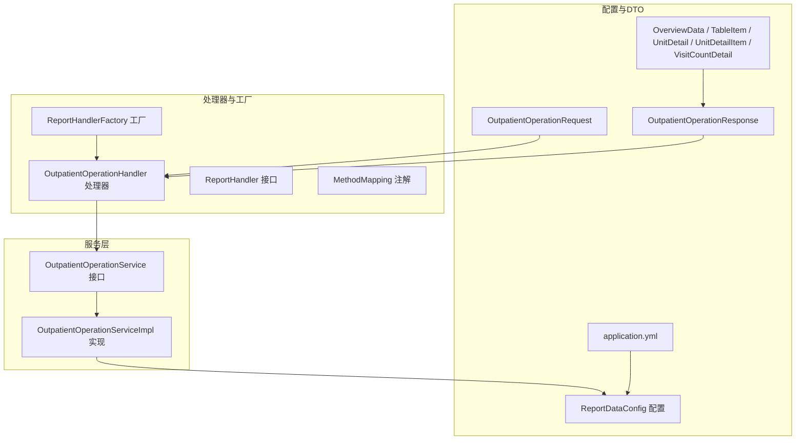
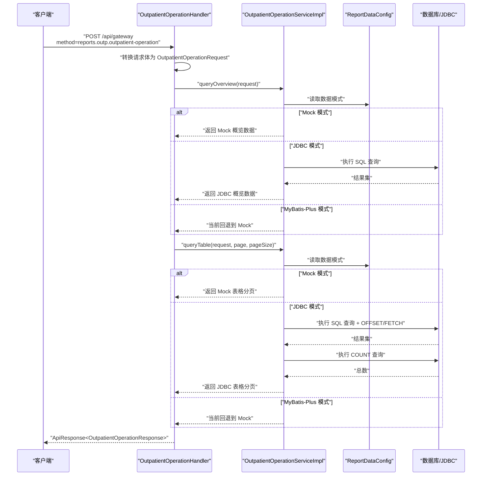
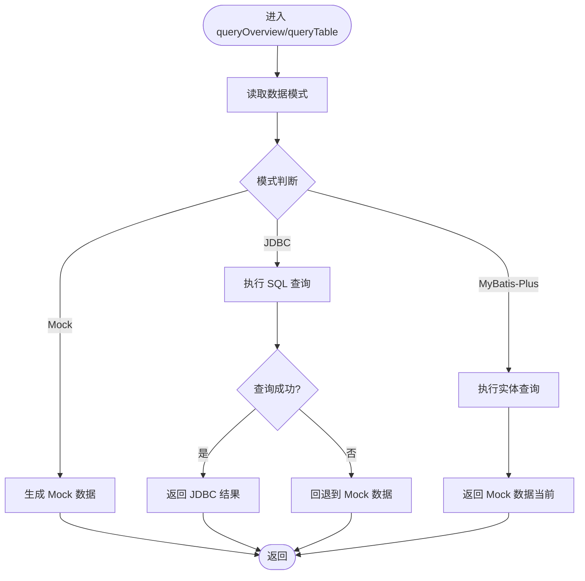
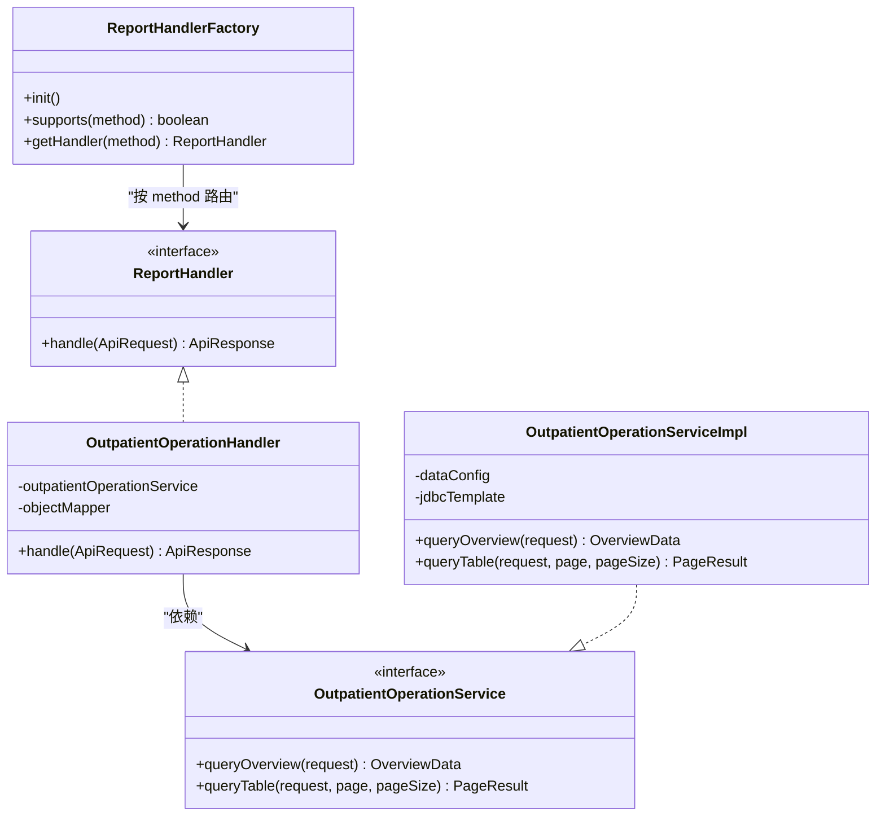
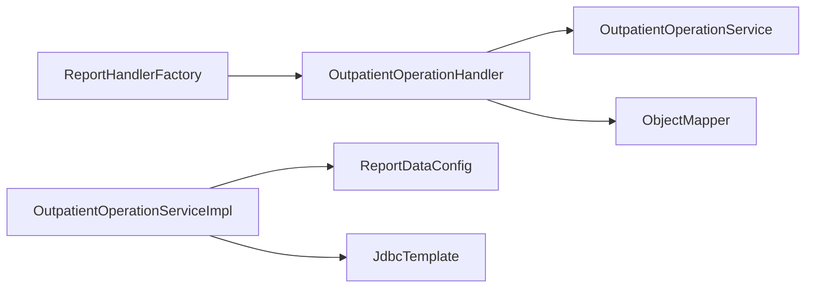

# 业务服务层

<cite>
**本文引用的文件**
- [OutpatientOperationService.java](file://src/main/java/com/reports/service/OutpatientOperationService.java)
- [OutpatientOperationServiceImpl.java](file://src/main/java/com/reports/service/impl/OutpatientOperationServiceImpl.java)
- [OutpatientOperationHandler.java](file://src/main/java/com/reports/service/handler/impl/OutpatientOperationHandler.java)
- [ReportHandlerFactory.java](file://src/main/java/com/reports/service/handler/ReportHandlerFactory.java)
- [ReportHandler.java](file://src/main/java/com/reports/service/handler/ReportHandler.java)
- [MethodMapping.java](file://src/main/java/com/reports/service/handler/MethodMapping.java)
- [OutpatientOperationRequest.java](file://src/main/java/com/reports/dto/request/OutpatientOperationRequest.java)
- [OutpatientOperationResponse.java](file://src/main/java/com/reports/dto/response/OutpatientOperationResponse.java)
- [OverviewData.java](file://src/main/java/com/reports/dto/response/OverviewData.java)
- [TableItem.java](file://src/main/java/com/reports/dto/response/TableItem.java)
- [UnitDetail.java](file://src/main/java/com/reports/dto/response/UnitDetail.java)
- [UnitDetailItem.java](file://src/main/java/com/reports/dto/response/UnitDetailItem.java)
- [VisitCountDetail.java](file://src/main/java/com/reports/dto/response/VisitCountDetail.java)
- [BaseRequestBody.java](file://src/main/java/com/reports/dto/common/BaseRequestBody.java)
- [ReportDataConfig.java](file://src/main/java/com/reports/config/ReportDataConfig.java)
- [application.yml](file://src/main/resources/application.yml)
- [BusinessException.java](file://src/main/java/com/reports/exception/BusinessException.java)
</cite>

## 目录
1. [简介](#简介)
2. [项目结构](#项目结构)
3. [核心组件](#核心组件)
4. [架构总览](#架构总览)
5. [详细组件分析](#详细组件分析)
6. [依赖分析](#依赖分析)
7. [性能考虑](#性能考虑)
8. [故障排查指南](#故障排查指南)
9. [结论](#结论)
10. [附录](#附录)

## 简介
本文件面向业务服务层，聚焦“门诊运行数据统计”能力，系统性阐述 OutpatientOperationService 接口设计与 OutpatientOperationServiceImpl 的实现细节，包括：
- 业务逻辑处理流程与数据获取策略
- 三种数据模式（Mock/JDBC/MyBatis-Plus）的切换与回退机制
- 与处理器工厂 ReportHandlerFactory 的协作关系与调用模式
- 与其他服务组件的依赖关系与接口契约
- 事务管理、并发控制与性能优化策略
- 错误处理机制与异常恢复方案

## 项目结构
围绕“门诊运行数据统计”，服务层采用“接口 + 实现 + 处理器 + 工厂”的分层设计，配合统一的 DTO 与配置中心，形成清晰的职责边界与扩展点。

图示来源
- [OutpatientOperationService.java:11-23](file://src/main/java/com/reports/service/OutpatientOperationService.java#L11-L23)
- [OutpatientOperationServiceImpl.java:36-45](file://src/main/java/com/reports/service/impl/OutpatientOperationServiceImpl.java#L36-L45)
- [OutpatientOperationHandler.java:22-31](file://src/main/java/com/reports/service/handler/impl/OutpatientOperationHandler.java#L22-L31)
- [ReportHandlerFactory.java:21-51](file://src/main/java/com/reports/service/handler/ReportHandlerFactory.java#L21-L51)
- [ReportDataConfig.java:16-42](file://src/main/java/com/reports/config/ReportDataConfig.java#L16-L42)
- [application.yml:21-23](file://src/main/resources/application.yml#L21-L23)

章节来源
- [OutpatientOperationService.java:11-23](file://src/main/java/com/reports/service/OutpatientOperationService.java#L11-L23)
- [OutpatientOperationServiceImpl.java:36-73](file://src/main/java/com/reports/service/impl/OutpatientOperationServiceImpl.java#L36-L73)
- [OutpatientOperationHandler.java:22-62](file://src/main/java/com/reports/service/handler/impl/OutpatientOperationHandler.java#L22-L62)
- [ReportHandlerFactory.java:21-73](file://src/main/java/com/reports/service/handler/ReportHandlerFactory.java#L21-L73)
- [ReportDataConfig.java:16-42](file://src/main/java/com/reports/config/ReportDataConfig.java#L16-L42)
- [application.yml:21-23](file://src/main/resources/application.yml#L21-L23)

## 核心组件
- 接口层：定义“概览数据查询”和“表格分页查询”两个核心能力，约束输入输出与分页语义。
- 实现层：根据配置选择数据模式，分别提供 Mock、JDBC、MyBatis-Plus 三套实现，并在 JDBC 模式下具备回退到 Mock 的容错能力。
- 处理器层：将通用请求体转换为具体请求 DTO，调用服务层查询并组装统一响应。
- 工厂层：基于注解自动注册处理器，按 method 路由分发，缺失时抛出业务异常。
- 配置层：集中管理数据模式，支持运行期切换。

章节来源
- [OutpatientOperationService.java:11-23](file://src/main/java/com/reports/service/OutpatientOperationService.java#L11-L23)
- [OutpatientOperationServiceImpl.java:36-252](file://src/main/java/com/reports/service/impl/OutpatientOperationServiceImpl.java#L36-L252)
- [OutpatientOperationHandler.java:22-62](file://src/main/java/com/reports/service/handler/impl/OutpatientOperationHandler.java#L22-L62)
- [ReportHandlerFactory.java:21-73](file://src/main/java/com/reports/service/handler/ReportHandlerFactory.java#L21-L73)
- [ReportDataConfig.java:16-42](file://src/main/java/com/reports/config/ReportDataConfig.java#L16-L42)

## 架构总览
下图展示“门诊运行数据统计”的端到端调用链路：处理器接收请求，解析为具体请求体，调用服务层查询概览与表格数据，最终封装为统一响应返回。

图示来源
- [OutpatientOperationHandler.java:34-61](file://src/main/java/com/reports/service/handler/impl/OutpatientOperationHandler.java#L34-L61)
- [OutpatientOperationServiceImpl.java:47-73](file://src/main/java/com/reports/service/impl/OutpatientOperationServiceImpl.java#L47-L73)
- [ReportDataConfig.java:26-42](file://src/main/java/com/reports/config/ReportDataConfig.java#L26-L42)

## 详细组件分析

### 接口设计：OutpatientOperationService
- 职责：对外暴露“概览数据”和“表格分页数据”的查询能力，输入为统一请求体，输出为强类型的响应 DTO。
- 设计要点：
  - 输入参数明确：开始/结束日期、科室编码/名称等。
  - 输出结构清晰：概览数据 + 表格分页数据，便于前端聚合展示。
  - 分页接口独立：表格查询支持分页参数，避免一次性拉取大量数据。

章节来源
- [OutpatientOperationService.java:11-23](file://src/main/java/com/reports/service/OutpatientOperationService.java#L11-L23)
- [OutpatientOperationRequest.java:12-36](file://src/main/java/com/reports/dto/request/OutpatientOperationRequest.java#L12-L36)
- [OutpatientOperationResponse.java:10-24](file://src/main/java/com/reports/dto/response/OutpatientOperationResponse.java#L10-L24)

### 实现策略：OutpatientOperationServiceImpl
- 数据模式选择：
  - 通过配置中心读取 reports.data.mode，支持 mock/jdbc/mybatis-plus。
  - 三种模式分别对应 Mock 模板数据、JDBC 直连 SQL、MyBatis-Plus 实体查询。
- 容错回退：
  - JDBC 模式查询异常时，自动回退到 Mock 数据，保证可用性。
  - MyBatis-Plus 模式当前回退到 Mock（预留扩展点）。
- 日志与追踪：
  - 关键路径均打印日志，便于问题定位与性能观测。
- 并发与线程安全：
  - 无共享可变状态，纯函数式处理，天然线程安全。
  - 使用 JdbcTemplate 时，遵循 Spring 对线程池与连接池的管理约定。

图示来源
- [OutpatientOperationServiceImpl.java:47-73](file://src/main/java/com/reports/service/impl/OutpatientOperationServiceImpl.java#L47-L73)
- [OutpatientOperationServiceImpl.java:152-212](file://src/main/java/com/reports/service/impl/OutpatientOperationServiceImpl.java#L152-L212)
- [OutpatientOperationServiceImpl.java:216-241](file://src/main/java/com/reports/service/impl/OutpatientOperationServiceImpl.java#L216-L241)
- [ReportDataConfig.java:26-42](file://src/main/java/com/reports/config/ReportDataConfig.java#L26-L42)

章节来源
- [OutpatientOperationServiceImpl.java:36-73](file://src/main/java/com/reports/service/impl/OutpatientOperationServiceImpl.java#L36-L73)
- [OutpatientOperationServiceImpl.java:77-148](file://src/main/java/com/reports/service/impl/OutpatientOperationServiceImpl.java#L77-L148)
- [OutpatientOperationServiceImpl.java:152-212](file://src/main/java/com/reports/service/impl/OutpatientOperationServiceImpl.java#L152-L212)
- [OutpatientOperationServiceImpl.java:216-241](file://src/main/java/com/reports/service/impl/OutpatientOperationServiceImpl.java#L216-L241)
- [ReportDataConfig.java:16-42](file://src/main/java/com/reports/config/ReportDataConfig.java#L16-L42)

### 处理器与工厂：协作关系与调用模式
- 处理器职责：
  - 将通用 ApiRequest 的 body 转换为 OutpatientOperationRequest。
  - 调用服务层查询概览与表格数据。
  - 组装 OutpatientOperationResponse 并返回统一 ApiResponse。
- 工厂职责：
  - 扫描所有 ReportHandler 实现，读取 MethodMapping 注解，建立 method -> 处理器 映射。
  - 提供 supports 与 getHandler 方法；不支持的 method 将抛出业务异常。
- 调用模式：
  - 以 method 作为路由键，工厂按需返回对应处理器实例。
  - 处理器内部注入服务层，完成业务编排。

图示来源
- [ReportHandlerFactory.java:21-73](file://src/main/java/com/reports/service/handler/ReportHandlerFactory.java#L21-L73)
- [ReportHandler.java:19-27](file://src/main/java/com/reports/service/handler/ReportHandler.java#L19-L27)
- [OutpatientOperationHandler.java:22-62](file://src/main/java/com/reports/service/handler/impl/OutpatientOperationHandler.java#L22-L62)
- [OutpatientOperationService.java:11-23](file://src/main/java/com/reports/service/OutpatientOperationService.java#L11-L23)
- [OutpatientOperationServiceImpl.java:36-73](file://src/main/java/com/reports/service/impl/OutpatientOperationServiceImpl.java#L36-L73)

章节来源
- [OutpatientOperationHandler.java:22-62](file://src/main/java/com/reports/service/handler/impl/OutpatientOperationHandler.java#L22-L62)
- [ReportHandlerFactory.java:21-73](file://src/main/java/com/reports/service/handler/ReportHandlerFactory.java#L21-L73)
- [MethodMapping.java:21-28](file://src/main/java/com/reports/service/handler/MethodMapping.java#L21-L28)

### 数据模型与契约
- 请求体：包含日期范围与科室信息，继承基础请求体扩展参数。
- 响应体：包含概览数据与表格分页数据。
- 概览数据：总就诊人次、预约率、检查率、效率、单元数等指标及明细。
- 表格行数据：科室维度的统计指标与单元明细。
- 单元明细：按专家级别划分的有效/总数统计。

章节来源
- [OutpatientOperationRequest.java:12-36](file://src/main/java/com/reports/dto/request/OutpatientOperationRequest.java#L12-L36)
- [OutpatientOperationResponse.java:10-24](file://src/main/java/com/reports/dto/response/OutpatientOperationResponse.java#L10-L24)
- [OverviewData.java:9-56](file://src/main/java/com/reports/dto/response/OverviewData.java#L9-L56)
- [TableItem.java:9-81](file://src/main/java/com/reports/dto/response/TableItem.java#L9-L81)
- [UnitDetail.java:9-18](file://src/main/java/com/reports/dto/response/UnitDetail.java#L9-L18)
- [UnitDetailItem.java:9-21](file://src/main/java/com/reports/dto/response/UnitDetailItem.java#L9-L21)
- [VisitCountDetail.java:9-41](file://src/main/java/com/reports/dto/response/VisitCountDetail.java#L9-L41)
- [BaseRequestBody.java:11-30](file://src/main/java/com/reports/dto/common/BaseRequestBody.java#L11-L30)

### 业务场景示例
- 场景一：默认 Mock 模式
  - 配置 reports.data.mode = mock
  - 处理器调用服务层，直接返回模板化数据，适合开发联调与演示。
- 场景二：JDBC 模式
  - 配置 reports.data.mode = jdbc
  - 服务层执行 SQL 查询，支持 OFFSET/FETCH 分页与 COUNT 统计总数；异常时回退 Mock。
- 场景三：MyBatis-Plus 模式
  - 配置 reports.data.mode = mybatis-plus
  - 服务层当前回退到 Mock（预留 QueryWrapper + 分页插件扩展点）。

章节来源
- [application.yml:21-23](file://src/main/resources/application.yml#L21-L23)
- [OutpatientOperationHandler.java:48-61](file://src/main/java/com/reports/service/handler/impl/OutpatientOperationHandler.java#L48-L61)
- [OutpatientOperationServiceImpl.java:47-73](file://src/main/java/com/reports/service/impl/OutpatientOperationServiceImpl.java#L47-L73)

## 依赖分析
- 组件耦合度
  - 处理器对服务层为接口依赖，低耦合高内聚。
  - 服务层对配置中心为只读依赖，无副作用。
  - 工厂对处理器实现为运行时动态绑定，通过注解与反射建立映射。
- 外部依赖
  - JDBC 模式依赖数据库访问与连接池。
  - ObjectMapper 用于 JSON 与 DTO 的双向转换。
- 循环依赖
  - 未发现循环依赖；工厂负责装配，处理器与服务层单向依赖。

图示来源
- [OutpatientOperationHandler.java:28-31](file://src/main/java/com/reports/service/handler/impl/OutpatientOperationHandler.java#L28-L31)
- [OutpatientOperationServiceImpl.java:42-44](file://src/main/java/com/reports/service/impl/OutpatientOperationServiceImpl.java#L42-L44)
- [ReportHandlerFactory.java:27-29](file://src/main/java/com/reports/service/handler/ReportHandlerFactory.java#L27-L29)

章节来源
- [OutpatientOperationHandler.java:22-31](file://src/main/java/com/reports/service/handler/impl/OutpatientOperationHandler.java#L22-L31)
- [OutpatientOperationServiceImpl.java:36-45](file://src/main/java/com/reports/service/impl/OutpatientOperationServiceImpl.java#L36-L45)
- [ReportHandlerFactory.java:21-51](file://src/main/java/com/reports/service/handler/ReportHandlerFactory.java#L21-L51)

## 性能考虑
- 数据模式选择
  - Mock：零 IO，适合开发与压测；生产环境建议关闭。
  - JDBC：SQL 层面使用 OFFSET/FETCH 分页，注意大偏移量的性能影响；建议结合索引与 LIMIT 控制。
  - MyBatis-Plus：利用分页插件与 QueryWrapper，减少手写 SQL 的复杂度。
- 连接与资源
  - 使用 JdbcTemplate 时，遵循 Spring Boot 默认连接池配置；避免在循环中频繁创建连接。
- 日志与追踪
  - 启用 traceId 与统一日志格式，便于端到端性能分析。
- 缓存与降级
  - 可在服务层增加缓存（如 Redis）或限流熔断，提升高峰期稳定性。
- 并发控制
  - 服务层无共享状态，天然线程安全；若引入缓存，需关注缓存一致性与并发更新。

## 故障排查指南
- 常见问题
  - method 不存在：工厂未注册或注解缺失，将抛出业务异常。
  - JDBC 查询失败：自动回退到 Mock，同时记录告警日志。
  - 配置错误：reports.data.mode 非法值将导致默认行为不符合预期。
- 定位步骤
  - 查看处理器日志：确认请求体转换与调用链路。
  - 校验配置：确认 application.yml 中 reports.data.mode 设置。
  - 观察回退：JDBC 异常时应观察 Mock 回退是否生效。
- 异常恢复
  - 优先修复数据源与 SQL；其次调整分页参数；最后启用 Mock 快速恢复线上功能。

章节来源
- [ReportHandlerFactory.java:31-51](file://src/main/java/com/reports/service/handler/ReportHandlerFactory.java#L31-L51)
- [ReportHandlerFactory.java:58-64](file://src/main/java/com/reports/service/handler/ReportHandlerFactory.java#L58-L64)
- [OutpatientOperationServiceImpl.java:173-176](file://src/main/java/com/reports/service/impl/OutpatientOperationServiceImpl.java#L173-L176)
- [OutpatientOperationServiceImpl.java:208-211](file://src/main/java/com/reports/service/impl/OutpatientOperationServiceImpl.java#L208-L211)
- [BusinessException.java:10-37](file://src/main/java/com/reports/exception/BusinessException.java#L10-L37)

## 结论
本服务层通过清晰的接口设计与灵活的数据模式切换，实现了“门诊运行数据统计”的可演进能力。处理器工厂提供了稳定的路由与扩展机制，服务实现兼顾了可用性与性能。建议在生产环境中逐步从 Mock 切换至 JDBC/MyBatis-Plus，并配套缓存、限流与监控体系，持续优化查询性能与稳定性。

## 附录
- 配置项参考
  - reports.data.mode：mock/jdbc/mybatis-plus
- 关键类一览
  - 接口：OutpatientOperationService
  - 实现：OutpatientOperationServiceImpl
  - 处理器：OutpatientOperationHandler
  - 工厂：ReportHandlerFactory
  - 配置：ReportDataConfig
  - 请求/响应：OutpatientOperationRequest / OutpatientOperationResponse
  - 概览/表格/明细：OverviewData / TableItem / UnitDetail / UnitDetailItem / VisitCountDetail