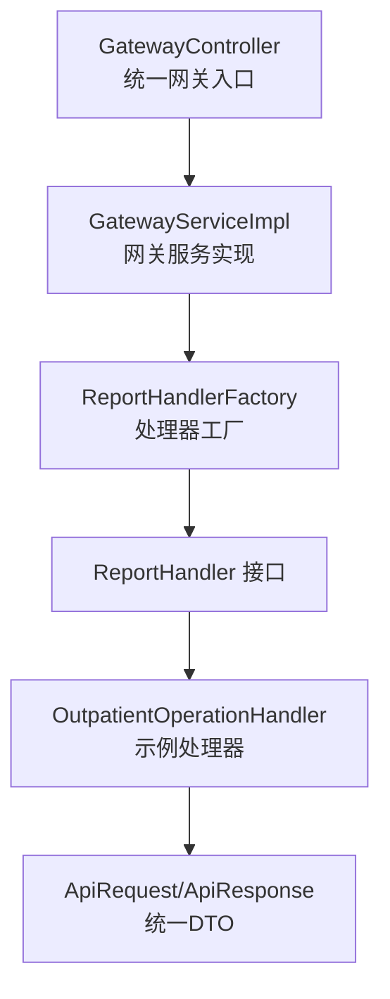
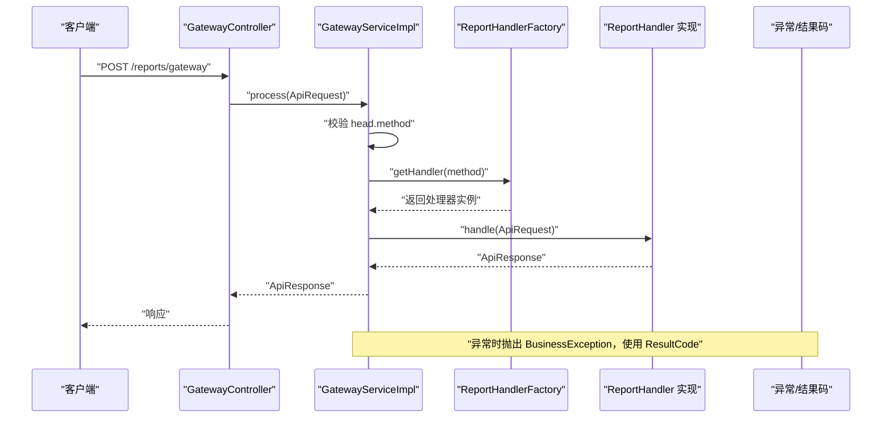
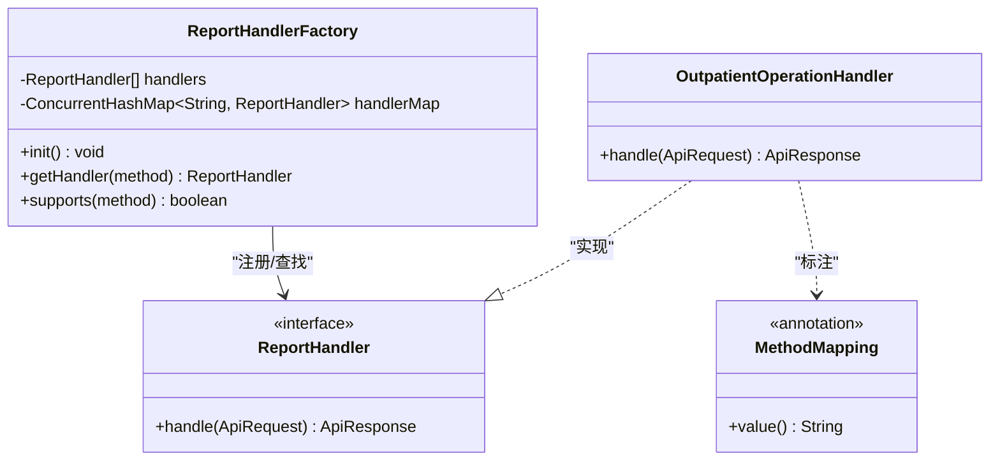
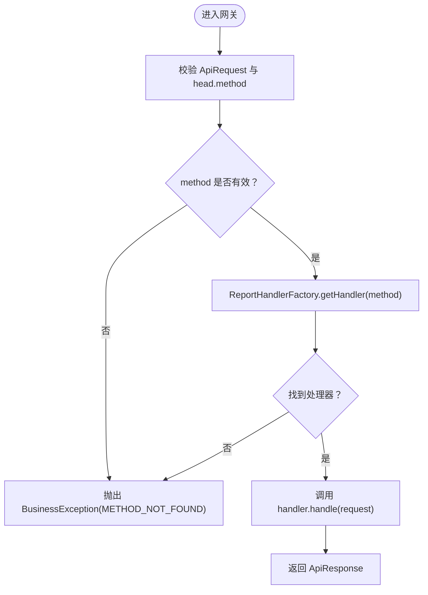
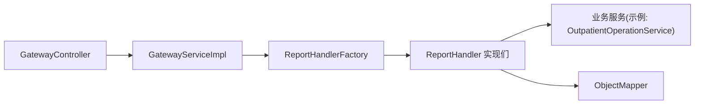

# 处理器工厂

<cite>
**本文引用的文件**
- [ReportHandlerFactory.java](file://src/main/java/com/reports/service/handler/ReportHandlerFactory.java)
- [ReportHandler.java](file://src/main/java/com/reports/service/handler/ReportHandler.java)
- [MethodMapping.java](file://src/main/java/com/reports/service/handler/MethodMapping.java)
- [OutpatientOperationHandler.java](file://src/main/java/com/reports/service/handler/impl/OutpatientOperationHandler.java)
- [GatewayController.java](file://src/main/java/com/reports/controller/GatewayController.java)
- [GatewayServiceImpl.java](file://src/main/java/com/reports/service/impl/GatewayServiceImpl.java)
- [ApiRequest.java](file://src/main/java/com/reports/dto/common/ApiRequest.java)
- [ApiResponse.java](file://src/main/java/com/reports/dto/common/ApiResponse.java)
- [RequestHead.java](file://src/main/java/com/reports/dto/common/RequestHead.java)
- [ResultCode.java](file://src/main/java/com/reports/enums/ResultCode.java)
- [application.yml](file://src/main/resources/application.yml)
</cite>

## 目录
1. [简介](#简介)
2. [项目结构](#项目结构)
3. [核心组件](#核心组件)
4. [架构总览](#架构总览)
5. [详细组件分析](#详细组件分析)
6. [依赖关系分析](#依赖关系分析)
7. [性能考量](#性能考量)
8. [故障排查指南](#故障排查指南)
9. [结论](#结论)
10. [附录](#附录)

## 简介
本文件围绕“处理器工厂”主题，系统性阐述 ReportHandlerFactory 的工厂模式实现、处理器注册机制与动态路由分发逻辑；详解 @MethodMapping 注解的使用方式与处理器映射规则；记录 ReportHandler 接口的设计理念与扩展机制；解释处理器生命周期管理与实例化策略；给出处理器注册与使用的代码示例路径；涵盖处理器缓存机制、线程安全考虑与性能优化方案，并提供新增处理器的开发指南与最佳实践。

## 项目结构
本项目采用分层架构，核心处理链路位于 service 层的 handler 子包，配合统一的网关入口与 DTO 定义。关键目录与职责如下：
- controller：对外暴露统一网关入口，接收请求并委托给网关服务
- service：包含网关服务与处理器工厂，负责请求路由与执行
- service/handler：定义处理器接口、注解与工厂，实现按 method 动态分发
- dto/common：统一请求/响应封装与通用字段定义
- enums：统一结果码枚举
- resources：应用配置与日志级别等

图表来源
- [GatewayController.java:1-38](file://src/main/java/com/reports/controller/GatewayController.java#L1-L38)
- [GatewayServiceImpl.java:1-51](file://src/main/java/com/reports/service/impl/GatewayServiceImpl.java#L1-L51)
- [ReportHandlerFactory.java:1-74](file://src/main/java/com/reports/service/handler/ReportHandlerFactory.java#L1-L74)
- [ReportHandler.java:1-28](file://src/main/java/com/reports/service/handler/ReportHandler.java#L1-L28)
- [OutpatientOperationHandler.java:1-65](file://src/main/java/com/reports/service/handler/impl/OutpatientOperationHandler.java#L1-L65)
- [ApiRequest.java:1-35](file://src/main/java/com/reports/dto/common/ApiRequest.java#L1-L35)
- [ApiResponse.java:1-57](file://src/main/java/com/reports/dto/common/ApiResponse.java#L1-L57)

章节来源
- [application.yml:1-32](file://src/main/resources/application.yml#L1-L32)

## 核心组件
- ReportHandlerFactory：基于 Spring 容器收集所有 ReportHandler 实现，通过 @MethodMapping 注解提取路由键，构建线程安全的处理器映射表，提供按 method 获取处理器与能力判断方法。
- ReportHandler：处理器接口，定义统一的 handle(ApiRequest) 方法，约定请求体泛型化以适配不同报表场景。
- MethodMapping：处理器路由注解，标注于实现类上，声明该处理器对应的 method 值。
- GatewayServiceImpl：网关服务实现，负责校验请求、根据 method 获取处理器并执行。
- GatewayController：REST 控制器，暴露 POST /reports/gateway 统一入口。
- ApiRequest/ApiResponse：统一请求/响应封装，head.method 作为路由键，body 支持泛型。
- ResultCode：统一结果码枚举，用于异常与业务状态返回。

章节来源
- [ReportHandlerFactory.java:1-74](file://src/main/java/com/reports/service/handler/ReportHandlerFactory.java#L1-L74)
- [ReportHandler.java:1-28](file://src/main/java/com/reports/service/handler/ReportHandler.java#L1-L28)
- [MethodMapping.java:1-29](file://src/main/java/com/reports/service/handler/MethodMapping.java#L1-L29)
- [GatewayServiceImpl.java:1-51](file://src/main/java/com/reports/service/impl/GatewayServiceImpl.java#L1-L51)
- [GatewayController.java:1-38](file://src/main/java/com/reports/controller/GatewayController.java#L1-L38)
- [ApiRequest.java:1-35](file://src/main/java/com/reports/dto/common/ApiRequest.java#L1-L35)
- [ApiResponse.java:1-57](file://src/main/java/com/reports/dto/common/ApiResponse.java#L1-L57)
- [ResultCode.java:1-77](file://src/main/java/com/reports/enums/ResultCode.java#L1-L77)

## 架构总览
下图展示从网关入口到处理器执行的完整流程，包括初始化注册、路由分发与异常处理。

图表来源
- [GatewayController.java:28-35](file://src/main/java/com/reports/controller/GatewayController.java#L28-L35)
- [GatewayServiceImpl.java:29-48](file://src/main/java/com/reports/service/impl/GatewayServiceImpl.java#L29-L48)
- [ReportHandlerFactory.java:54-64](file://src/main/java/com/reports/service/handler/ReportHandlerFactory.java#L54-L64)
- [ResultCode.java:32-39](file://src/main/java/com/reports/enums/ResultCode.java#L32-L39)

## 详细组件分析

### ReportHandlerFactory 工厂模式与注册机制
- 组件定位：Spring 管理的单例组件，负责扫描并注册所有 ReportHandler 实现。
- 初始化流程：
  - 构造函数注入 List<ReportHandler<?, ?>>，由 Spring 自动收集所有实现。
  - @PostConstruct init() 中遍历处理器列表，反射读取 @MethodMapping 注解的 value 作为路由键。
  - 使用 ConcurrentHashMap<String, ReportHandler<?, ?>> 维护线程安全的映射表。
  - 对重复 method 的覆盖行为进行告警日志，保证幂等注册。
- 能力查询：supports(String method) 提供是否存在处理器的能力判断。
- 获取处理器：getHandler(String method) 返回强转后的处理器实例，不存在时抛出 BusinessException（METHOD_NOT_FOUND）。

图表来源
- [ReportHandlerFactory.java:21-74](file://src/main/java/com/reports/service/handler/ReportHandlerFactory.java#L21-L74)
- [ReportHandler.java:19-27](file://src/main/java/com/reports/service/handler/ReportHandler.java#L19-L27)
- [MethodMapping.java:18-28](file://src/main/java/com/reports/service/handler/MethodMapping.java#L18-L28)
- [OutpatientOperationHandler.java:19-65](file://src/main/java/com/reports/service/handler/impl/OutpatientOperationHandler.java#L19-L65)

章节来源
- [ReportHandlerFactory.java:31-52](file://src/main/java/com/reports/service/handler/ReportHandlerFactory.java#L31-L52)
- [ReportHandlerFactory.java:54-71](file://src/main/java/com/reports/service/handler/ReportHandlerFactory.java#L54-L71)

### @MethodMapping 注解与映射规则
- 注解位置：标注在 ReportHandler 实现类上。
- 元数据：value() 为字符串，对应请求头 RequestHead.method。
- 规则约束：
  - 必须提供非空 value，否则初始化阶段抛出非法状态异常。
  - 同一 method 重复注册将被覆盖，并输出警告日志。
  - 路由键即为 method 字段值，大小写敏感。
- 使用示例（参考路径）：
  - [OutpatientOperationHandler.java](file://src/main/java/com/reports/service/handler/impl/OutpatientOperationHandler.java#L21)

章节来源
- [MethodMapping.java:7-28](file://src/main/java/com/reports/service/handler/MethodMapping.java#L7-L28)
- [ReportHandlerFactory.java:35-49](file://src/main/java/com/reports/service/handler/ReportHandlerFactory.java#L35-L49)

### ReportHandler 接口设计与扩展机制
- 设计理念：
  - 泛型化请求/响应体，便于不同报表场景复用同一接口。
  - 统一返回 ApiResponse，确保响应结构一致。
  - 请求体可能为 LinkedHashMap，实现类需自行转换为具体类型。
- 扩展机制：
  - 新增处理器只需实现 ReportHandler 并标注 @MethodMapping。
  - Spring 自动发现并注入，工厂自动注册。
  - 通过 RequestHead.method 与 @MethodMapping.value 的一致性完成路由。

章节来源
- [ReportHandler.java:6-27](file://src/main/java/com/reports/service/handler/ReportHandler.java#L6-L27)
- [OutpatientOperationHandler.java:33-62](file://src/main/java/com/reports/service/handler/impl/OutpatientOperationHandler.java#L33-L62)

### 处理器生命周期与实例化策略
- 生命周期：
  - 由 Spring 容器管理，@Component 标注的实现类在容器启动时实例化。
  - ReportHandlerFactory 在 @PostConstruct 中完成注册，属于容器启动阶段的初始化流程。
- 实例化策略：
  - 默认单例（@Component），无状态或线程安全的处理器可直接复用。
  - 若处理器内持有有状态对象，需确保线程安全或使用线程局部存储。

章节来源
- [OutpatientOperationHandler.java:19-31](file://src/main/java/com/reports/service/handler/impl/OutpatientOperationHandler.java#L19-L31)
- [ReportHandlerFactory.java:31-52](file://src/main/java/com/reports/service/handler/ReportHandlerFactory.java#L31-L52)

### 动态路由分发逻辑
- 网关层：
  - GatewayController 暴露 /reports/gateway POST 入口。
  - GatewayServiceImpl 校验请求与 method，调用 ReportHandlerFactory.getHandler(method) 获取处理器。
- 分发细节：
  - getHandler(String) 内部通过 ConcurrentHashMap 查找，O(1) 时间复杂度。
  - 未找到时抛出 BusinessException，使用 ResultCode.METHOD_NOT_FOUND。
- 执行流程：
  - 获取处理器后直接调用其 handle(ApiRequest)，返回 ApiResponse。

图表来源
- [GatewayServiceImpl.java:29-48](file://src/main/java/com/reports/service/impl/GatewayServiceImpl.java#L29-L48)
- [ReportHandlerFactory.java:54-64](file://src/main/java/com/reports/service/handler/ReportHandlerFactory.java#L54-L64)
- [ResultCode.java:32-39](file://src/main/java/com/reports/enums/ResultCode.java#L32-L39)

章节来源
- [GatewayController.java:28-35](file://src/main/java/com/reports/controller/GatewayController.java#L28-L35)
- [GatewayServiceImpl.java:29-48](file://src/main/java/com/reports/service/impl/GatewayServiceImpl.java#L29-L48)

### 处理器注册与使用示例（代码路径）
- 新增处理器步骤：
  1) 实现 ReportHandler<T, R> 接口，定义 handle(ApiRequest)。
  2) 添加 @Component 与 @MethodMapping("your.method.key") 注解。
  3) Spring 启动时自动注册至 ReportHandlerFactory。
- 示例参考：
  - [OutpatientOperationHandler.java:19-65](file://src/main/java/com/reports/service/handler/impl/OutpatientOperationHandler.java#L19-L65)
  - [ReportHandlerFactory.java:31-52](file://src/main/java/com/reports/service/handler/ReportHandlerFactory.java#L31-L52)

章节来源
- [OutpatientOperationHandler.java:19-65](file://src/main/java/com/reports/service/handler/impl/OutpatientOperationHandler.java#L19-L65)
- [ReportHandlerFactory.java:31-52](file://src/main/java/com/reports/service/handler/ReportHandlerFactory.java#L31-L52)

## 依赖关系分析
- 组件耦合：
  - GatewayServiceImpl 依赖 ReportHandlerFactory，形成控制反转。
  - ReportHandlerFactory 依赖 Spring 容器提供的 ReportHandler 实现集合。
  - 处理器实现依赖服务层（如 OutpatientOperationService）与 Jackson ObjectMapper。
- 外部依赖：
  - Spring Boot Starter Web（REST 控制器）、Spring Beans（依赖注入）、Lombok（日志与 POJO）。
- 可能的循环依赖：
  - 当前结构无循环依赖：控制器 -> 服务 -> 工厂 -> 处理器。

图表来源
- [GatewayController.java:1-38](file://src/main/java/com/reports/controller/GatewayController.java#L1-L38)
- [GatewayServiceImpl.java:1-51](file://src/main/java/com/reports/service/impl/GatewayServiceImpl.java#L1-L51)
- [ReportHandlerFactory.java:1-74](file://src/main/java/com/reports/service/handler/ReportHandlerFactory.java#L1-L74)
- [OutpatientOperationHandler.java:1-65](file://src/main/java/com/reports/service/handler/impl/OutpatientOperationHandler.java#L1-L65)

章节来源
- [GatewayServiceImpl.java:22-27](file://src/main/java/com/reports/service/impl/GatewayServiceImpl.java#L22-L27)
- [ReportHandlerFactory.java:23-29](file://src/main/java/com/reports/service/handler/ReportHandlerFactory.java#L23-L29)

## 性能考量
- 缓存机制：
  - 使用 ConcurrentHashMap<String, ReportHandler<?, ?>> 作为处理器缓存，支持高并发读取。
- 线程安全：
  - 注册阶段在 @PostConstruct 中完成，运行期只读，避免并发修改。
  - getHandler() 与 supports() 均基于 ConcurrentHashMap，天然线程安全。
- 性能优化建议：
  - 减少处理器数量与初始化开销：仅注册必要处理器。
  - 处理器内部避免阻塞操作，必要时异步化。
  - 对高频方法可考虑本地缓存热点处理器引用（谨慎使用，避免内存泄漏）。
  - 合理设置日志级别，生产环境避免过细粒度日志。

章节来源
- [ReportHandlerFactory.java](file://src/main/java/com/reports/service/handler/ReportHandlerFactory.java#L24)
- [ReportHandlerFactory.java:58-71](file://src/main/java/com/reports/service/handler/ReportHandlerFactory.java#L58-L71)

## 故障排查指南
- 常见问题与定位：
  - 注解缺失：初始化时报错提示缺少 @MethodMapping 或 value 为空。
  - 方法不存在：调用 getHandler 时抛出 METHOD_NOT_FOUND。
  - 请求参数缺失：网关层校验失败，抛出 PARAM_MISSING。
- 排查步骤：
  1) 检查处理器类是否标注 @Component 与 @MethodMapping。
  2) 确认 RequestHead.method 与 @MethodMapping.value 一致。
  3) 查看日志输出，关注注册阶段的覆盖告警与运行期异常栈。
- 相关枚举与异常：
  - [ResultCode.java:32-39](file://src/main/java/com/reports/enums/ResultCode.java#L32-L39)
  - [GatewayServiceImpl.java:32-44](file://src/main/java/com/reports/service/impl/GatewayServiceImpl.java#L32-L44)
  - [ReportHandlerFactory.java:37-49](file://src/main/java/com/reports/service/handler/ReportHandlerFactory.java#L37-L49)

章节来源
- [ReportHandlerFactory.java:35-49](file://src/main/java/com/reports/service/handler/ReportHandlerFactory.java#L35-L49)
- [GatewayServiceImpl.java:32-44](file://src/main/java/com/reports/service/impl/GatewayServiceImpl.java#L32-L44)
- [ResultCode.java:32-39](file://src/main/java/com/reports/enums/ResultCode.java#L32-L39)

## 结论
ReportHandlerFactory 通过注解驱动与 Spring 容器实现了灵活的处理器注册与动态路由分发。结合统一的请求/响应封装与结果码体系，系统具备良好的扩展性与可维护性。遵循本文的最佳实践与开发指南，可快速、安全地扩展新的报表处理器。

## 附录

### 开发指南与最佳实践
- 新增处理器步骤
  1) 创建实现类，实现 ReportHandler<T, R> 接口，定义 handle(ApiRequest)。
  2) 添加 @Component 与 @MethodMapping("your.unique.method.key") 注解。
  3) 在处理器内部完成请求体转换与业务处理，返回 ApiResponse。
  4) 确保 RequestHead.method 与 @MethodMapping.value 严格一致。
- 最佳实践
  - 注解值命名规范：采用点分层级（如 reports.outp.xxx），便于分类与检索。
  - 处理器无状态或线程安全：避免共享可变状态，减少并发风险。
  - 异常处理：统一使用 ResultCode 枚举，保持响应一致性。
  - 日志：使用 SLF4J 记录关键路径，避免生产环境过度打印。
  - 单元测试：对 handle(ApiRequest) 进行边界与异常场景测试。

章节来源
- [OutpatientOperationHandler.java:19-65](file://src/main/java/com/reports/service/handler/impl/OutpatientOperationHandler.java#L19-L65)
- [ReportHandlerFactory.java:31-52](file://src/main/java/com/reports/service/handler/ReportHandlerFactory.java#L31-L52)
- [ResultCode.java:1-77](file://src/main/java/com/reports/enums/ResultCode.java#L1-L77)