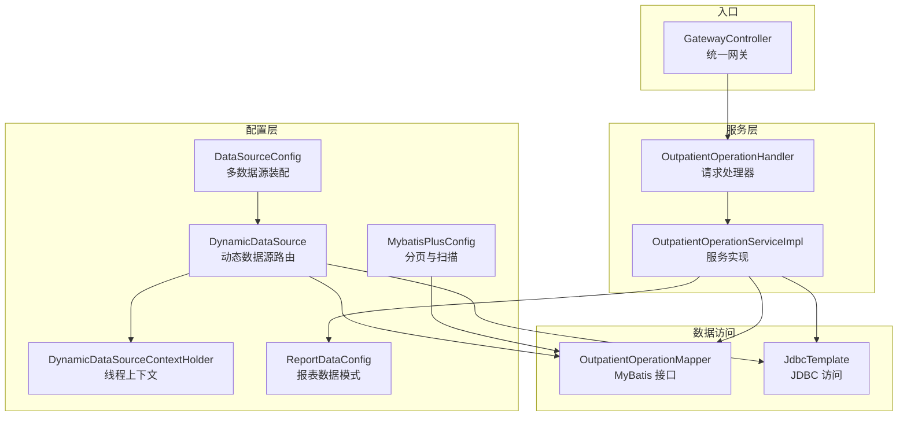
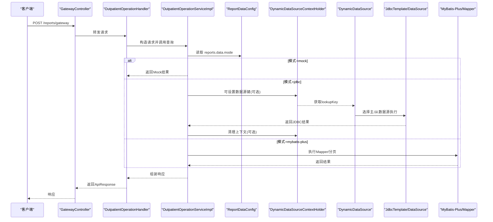
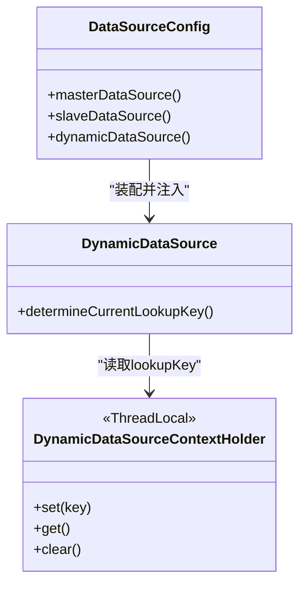
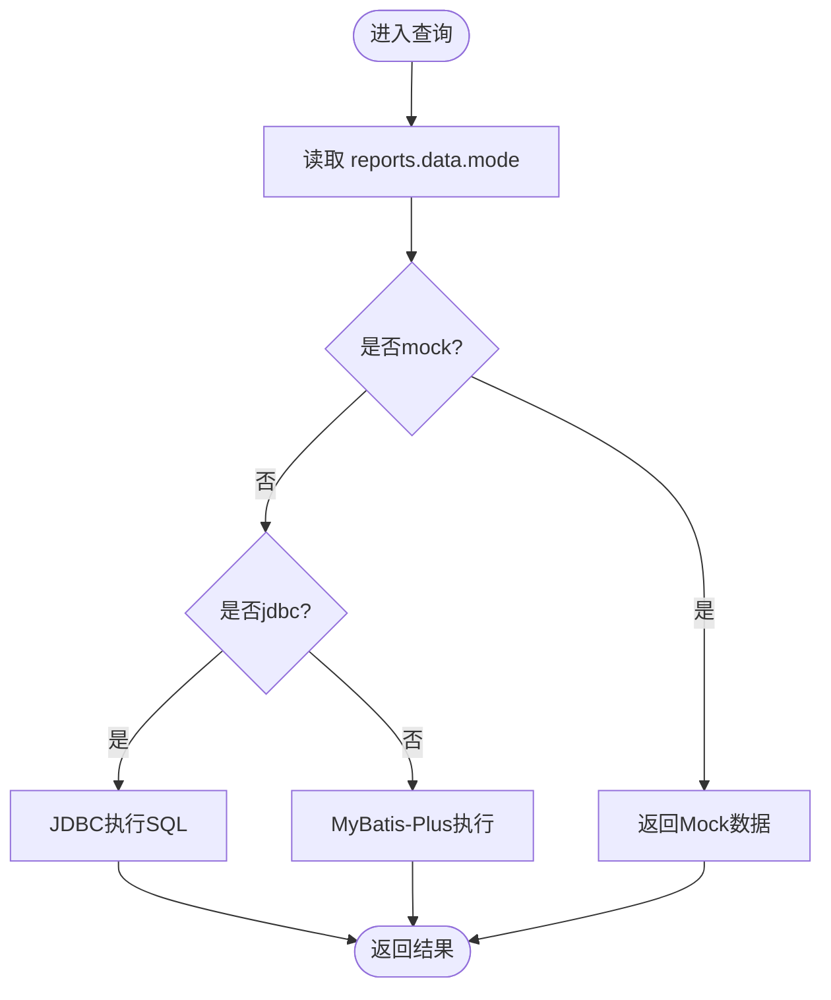
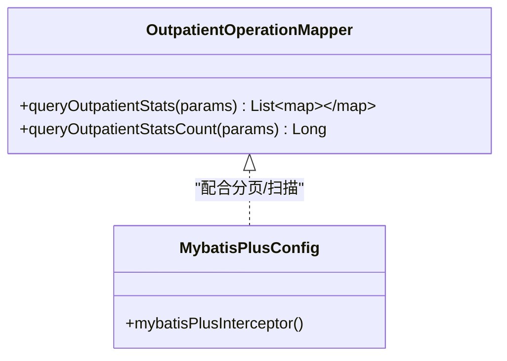
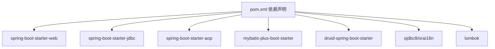

# 数据访问层

<cite>
**本文引用的文件**
- [DataSourceConfig.java](file://src/main/java/com/reports/config/DataSourceConfig.java)
- [DynamicDataSource.java](file://src/main/java/com/reports/config/DynamicDataSource.java)
- [DynamicDataSourceContextHolder.java](file://src/main/java/com/reports/config/DynamicDataSourceContextHolder.java)
- [ReportDataConfig.java](file://src/main/java/com/reports/config/ReportDataConfig.java)
- [MybatisPlusConfig.java](file://src/main/java/com/reports/config/MybatisPlusConfig.java)
- [OutpatientOperationMapper.java](file://src/main/java/com/reports/mapper/OutpatientOperationMapper.java)
- [OutpatientOperationServiceImpl.java](file://src/main/java/com/reports/service/impl/OutpatientOperationServiceImpl.java)
- [OutpatientOperationHandler.java](file://src/main/java/com/reports/service/handler/impl/OutpatientOperationHandler.java)
- [application.yml](file://src/main/resources/application.yml)
- [application-dev.yml](file://src/main/resources/application-dev.yml)
- [OutpatientOperationRequest.java](file://src/main/java/com/reports/dto/request/OutpatientOperationRequest.java)
- [OutpatientOperationResponse.java](file://src/main/java/com/reports/dto/response/OutpatientOperationResponse.java)
- [GatewayController.java](file://src/main/java/com/reports/controller/GatewayController.java)
- [GatewayService.java](file://src/main/java/com/reports/service/GatewayService.java)
- [pom.xml](file://pom.xml)
</cite>

## 目录
1. [简介](#简介)
2. [项目结构](#项目结构)
3. [核心组件](#核心组件)
4. [架构总览](#架构总览)
5. [详细组件分析](#详细组件分析)
6. [依赖分析](#依赖分析)
7. [性能考虑](#性能考虑)
8. [故障排查指南](#故障排查指南)
9. [结论](#结论)
10. [附录](#附录)

## 简介
本文件面向数据访问层，系统性阐述多数据源配置与动态切换、上下文管理策略、报表数据模式配置、MyBatis 映射与 SQL 执行策略，并提供三种数据源模式（mock、jdbc、mybatis-plus）的使用示例与最佳实践。同时覆盖连接池配置、事务管理建议、性能优化与故障转移、监控告警等运维要点。

## 项目结构
数据访问层围绕配置类、服务实现、处理器与映射器展开，采用“配置驱动 + 模式开关”的设计，支持在不修改业务逻辑的情况下切换数据来源与访问技术栈。

图表来源
- [DataSourceConfig.java:1-56](file://src/main/java/com/reports/config/DataSourceConfig.java#L1-L56)
- [DynamicDataSource.java:1-16](file://src/main/java/com/reports/config/DynamicDataSource.java#L1-L16)
- [DynamicDataSourceContextHolder.java:1-38](file://src/main/java/com/reports/config/DynamicDataSourceContextHolder.java#L1-L38)
- [ReportDataConfig.java:1-45](file://src/main/java/com/reports/config/ReportDataConfig.java#L1-L45)
- [MybatisPlusConfig.java:1-28](file://src/main/java/com/reports/config/MybatisPlusConfig.java#L1-L28)
- [OutpatientOperationHandler.java:1-65](file://src/main/java/com/reports/service/handler/impl/OutpatientOperationHandler.java#L1-L65)
- [OutpatientOperationServiceImpl.java:1-253](file://src/main/java/com/reports/service/impl/OutpatientOperationServiceImpl.java#L1-L253)
- [OutpatientOperationMapper.java:1-31](file://src/main/java/com/reports/mapper/OutpatientOperationMapper.java#L1-L31)
- [GatewayController.java:1-38](file://src/main/java/com/reports/controller/GatewayController.java#L1-L38)

章节来源
- [DataSourceConfig.java:1-56](file://src/main/java/com/reports/config/DataSourceConfig.java#L1-L56)
- [application.yml:1-32](file://src/main/resources/application.yml#L1-L32)
- [application-dev.yml:1-45](file://src/main/resources/application-dev.yml#L1-L45)

## 核心组件
- 多数据源配置与装配：通过配置类装配主/从数据源与动态数据源，绑定 Druid 连接池参数。
- 动态数据源路由：基于线程上下文键值选择目标数据源，缺省为主数据源。
- 报表数据模式：以 reports.data.mode 控制数据来源模式（mock/jdbc/mybatis-plus），服务层按模式分支执行。
- MyBatis-Plus 配置：启用分页插件与 Mapper 扫描，支持 Oracle 分页语法。
- 访问层实现：服务层支持三种模式；MyBatis 映射器提供 SQL 片段占位，当前示例使用 Mock 数据。

章节来源
- [DataSourceConfig.java:14-56](file://src/main/java/com/reports/config/DataSourceConfig.java#L14-L56)
- [DynamicDataSource.java:5-16](file://src/main/java/com/reports/config/DynamicDataSource.java#L5-L16)
- [DynamicDataSourceContextHolder.java:3-38](file://src/main/java/com/reports/config/DynamicDataSourceContextHolder.java#L3-L38)
- [ReportDataConfig.java:8-45](file://src/main/java/com/reports/config/ReportDataConfig.java#L8-L45)
- [MybatisPlusConfig.java:10-28](file://src/main/java/com/reports/config/MybatisPlusConfig.java#L10-L28)
- [OutpatientOperationMapper.java:9-31](file://src/main/java/com/reports/mapper/OutpatientOperationMapper.java#L9-L31)
- [OutpatientOperationServiceImpl.java:21-33](file://src/main/java/com/reports/service/impl/OutpatientOperationServiceImpl.java#L21-L33)

## 架构总览
下图展示从网关入口到数据访问的完整链路，以及多数据源与模式切换的关键节点。

图表来源
- [GatewayController.java:28-36](file://src/main/java/com/reports/controller/GatewayController.java#L28-L36)
- [OutpatientOperationHandler.java:33-62](file://src/main/java/com/reports/service/handler/impl/OutpatientOperationHandler.java#L33-L62)
- [OutpatientOperationServiceImpl.java:47-73](file://src/main/java/com/reports/service/impl/OutpatientOperationServiceImpl.java#L47-L73)
- [ReportDataConfig.java:18-42](file://src/main/java/com/reports/config/ReportDataConfig.java#L18-L42)
- [DynamicDataSourceContextHolder.java:16-35](file://src/main/java/com/reports/config/DynamicDataSourceContextHolder.java#L16-L35)
- [DataSourceConfig.java:38-53](file://src/main/java/com/reports/config/DataSourceConfig.java#L38-L53)

## 详细组件分析

### 多数据源配置与动态切换
- 数据源装配
  - 主/从数据源分别通过配置前缀 spring.datasource.master/slave 绑定 Druid 参数。
  - 动态数据源将 master/slave 注册为目标数据源，并设置默认数据源为主。
- 动态路由
  - 动态数据源继承 Spring 的 AbstractRoutingDataSource，通过 determineCurrentLookupKey 读取线程上下文键。
  - 上下文持有者提供 set/get/clear 方法，默认键为 master。
- 使用建议
  - 在需要读取从库或特定数据源时，可在服务层设置上下文键并在调用后清理，确保线程安全。

图表来源
- [DataSourceConfig.java:14-56](file://src/main/java/com/reports/config/DataSourceConfig.java#L14-L56)
- [DynamicDataSource.java:5-16](file://src/main/java/com/reports/config/DynamicDataSource.java#L5-L16)
- [DynamicDataSourceContextHolder.java:3-38](file://src/main/java/com/reports/config/DynamicDataSourceContextHolder.java#L3-L38)

章节来源
- [DataSourceConfig.java:14-56](file://src/main/java/com/reports/config/DataSourceConfig.java#L14-L56)
- [DynamicDataSource.java:5-16](file://src/main/java/com/reports/config/DynamicDataSource.java#L5-L16)
- [DynamicDataSourceContextHolder.java:3-38](file://src/main/java/com/reports/config/DynamicDataSourceContextHolder.java#L3-L38)

### 报表数据模式配置（ReportDataConfig）
- 模式控制
  - reports.data.mode 支持 mock、jdbc、mybatis-plus 三类模式。
  - 提供 isMock/isJdbc/isMybatisPlus 辅助判断。
- 服务层分支
  - 服务实现依据模式选择 Mock、JDBC 或 MyBatis-Plus 路径；当前 MyBatis-Plus 路径回退至 Mock（便于演示）。

图表来源
- [ReportDataConfig.java:18-42](file://src/main/java/com/reports/config/ReportDataConfig.java#L18-L42)
- [OutpatientOperationServiceImpl.java:47-73](file://src/main/java/com/reports/service/impl/OutpatientOperationServiceImpl.java#L47-L73)

章节来源
- [ReportDataConfig.java:8-45](file://src/main/java/com/reports/config/ReportDataConfig.java#L8-L45)
- [OutpatientOperationServiceImpl.java:21-33](file://src/main/java/com/reports/service/impl/OutpatientOperationServiceImpl.java#L21-L33)

### MyBatis 映射与 SQL 执行策略（OutpatientOperationMapper）
- 映射器定义
  - 使用 @Mapper 注解声明接口，当前提供两个示例方法：统计与计数。
  - SQL 使用 Oracle 分页语法，便于后续接入真实数据库。
- 执行策略
  - 服务层当前未直接调用该 Mapper（处于 Mock 演示阶段）。
  - 若启用 MyBatis-Plus 模式，可结合分页插件与实体类进行查询。

图表来源
- [OutpatientOperationMapper.java:9-31](file://src/main/java/com/reports/mapper/OutpatientOperationMapper.java#L9-L31)
- [MybatisPlusConfig.java:10-28](file://src/main/java/com/reports/config/MybatisPlusConfig.java#L10-L28)

章节来源
- [OutpatientOperationMapper.java:9-31](file://src/main/java/com/reports/mapper/OutpatientOperationMapper.java#L9-L31)
- [MybatisPlusConfig.java:10-28](file://src/main/java/com/reports/config/MybatisPlusConfig.java#L10-L28)

### 服务层实现（OutpatientOperationServiceImpl）
- 模式分支
  - 概览与表格查询均按模式分支执行，分别提供 Mock、JDBC、MyBatis-Plus 三套实现。
- 数据源切换
  - JDBC 模式示例中展示了如何设置/清理动态数据源上下文键，便于切换主/从库。
- 回退机制
  - JDBC 模式在异常时回退到 Mock，提升可用性。

章节来源
- [OutpatientOperationServiceImpl.java:21-33](file://src/main/java/com/reports/service/impl/OutpatientOperationServiceImpl.java#L21-L33)
- [OutpatientOperationServiceImpl.java:150-212](file://src/main/java/com/reports/service/impl/OutpatientOperationServiceImpl.java#L150-L212)

### 处理器与入口（OutpatientOperationHandler、GatewayController）
- 处理器
  - 通过注解 MethodMapping 定义报表标识，负责请求解析、调用服务与组装响应。
- 网关
  - 统一入口接收请求并转发给网关服务，便于扩展与治理。

章节来源
- [OutpatientOperationHandler.java:16-65](file://src/main/java/com/reports/service/handler/impl/OutpatientOperationHandler.java#L16-L65)
- [GatewayController.java:13-38](file://src/main/java/com/reports/controller/GatewayController.java#L13-L38)

## 依赖分析
- 外部依赖
  - Spring Boot Starter Web、JDBC、AOP、Validation、Jackson XML、Lombok。
  - MyBatis-Plus 启动器、Druid Spring Boot Starter、Oracle OJDBC 与 NLS。
- 内部耦合
  - 服务层依赖 ReportDataConfig 与 JdbcTemplate；可选依赖动态数据源上下文。
  - Mapper 层依赖 MyBatis-Plus 配置与分页插件。

图表来源
- [pom.xml:26-98](file://pom.xml#L26-L98)

章节来源
- [pom.xml:19-58](file://pom.xml#L19-L58)

## 性能考虑
- 连接池配置
  - 建议在开发环境外的配置文件中设置合理的初始大小、最大活跃数、空闲阈值与校验查询，避免频繁创建销毁与连接泄漏。
- 事务管理
  - 对于只读报表查询，建议使用只读事务或无事务，减少锁竞争；写操作需显式开启事务并合理设置隔离级别。
- SQL 优化
  - 使用合适的索引（如日期范围、科室维度）；分页查询注意排序字段与覆盖索引。
- 缓存策略
  - 对高频且低变化的报表数据引入缓存（如 Redis），设置 TTL 与失效策略。
- 异步与限流
  - 对高并发场景引入异步处理与限流（令牌桶/漏桶），防止下游数据库过载。
- 监控与日志
  - 记录慢查询、错误率与连接池指标；结合链路追踪（TraceId）定位问题。

## 故障排查指南
- 数据源切换无效
  - 检查是否正确设置/清理动态数据源上下文键；确认线程内一致。
- SQL 执行异常
  - JDBC 模式下若出现异常会回退到 Mock；检查 SQL 语法与参数绑定，核对数据库连通性与权限。
- MyBatis-Plus 未生效
  - 确认 Mapper 扫描路径与分页插件已注册；检查实体类与字段映射。
- 连接池耗尽
  - 调整最大活跃数、等待时间与健康检查参数；排查未关闭的连接与长时间事务。
- 模式切换不生效
  - 确认配置文件中的 reports.data.mode 值正确，且应用已加载最新配置。

章节来源
- [OutpatientOperationServiceImpl.java:173-177](file://src/main/java/com/reports/service/impl/OutpatientOperationServiceImpl.java#L173-L177)
- [application.yml:21-23](file://src/main/resources/application.yml#L21-L23)

## 结论
本数据访问层通过“配置驱动 + 模式开关 + 动态数据源”的组合，实现了灵活的数据来源与访问技术栈切换。在 Mock 演示的基础上，可平滑过渡到 JDBC 与 MyBatis-Plus，并结合连接池、事务、缓存与监控等手段实现高性能与高可用。

## 附录

### 配置项速查
- 报表数据模式
  - reports.data.mode: mock | jdbc | mybatis-plus
- 数据源配置（示例）
  - spring.datasource.master.* 与 spring.datasource.slave.*：驱动、URL、用户名、密码、Druid 参数
- MyBatis-Plus
  - mybatis-plus.configuration.log-impl：日志实现
  - mybatis-plus.mapper-locations：Mapper XML 路径

章节来源
- [application.yml:21-23](file://src/main/resources/application.yml#L21-L23)
- [application-dev.yml:2-38](file://src/main/resources/application-dev.yml#L2-L38)
- [MybatisPlusConfig.java:40-44](file://src/main/java/com/reports/config/MybatisPlusConfig.java#L40-L44)

### 使用示例（三种模式）
- Mock 模式
  - 将 reports.data.mode 设为 mock；服务层直接返回模拟数据，适合前端联调与测试。
- JDBC 模式
  - 将 reports.data.mode 设为 jdbc；服务层使用 JdbcTemplate 执行 SQL；可按需设置动态数据源上下文键切换主/从库。
- MyBatis-Plus 模式
  - 将 reports.data.mode 设为 mybatis-plus；服务层可结合实体类与分页插件进行查询；当前示例回退到 Mock。

章节来源
- [ReportDataConfig.java:18-42](file://src/main/java/com/reports/config/ReportDataConfig.java#L18-L42)
- [OutpatientOperationServiceImpl.java:150-212](file://src/main/java/com/reports/service/impl/OutpatientOperationServiceImpl.java#L150-L212)