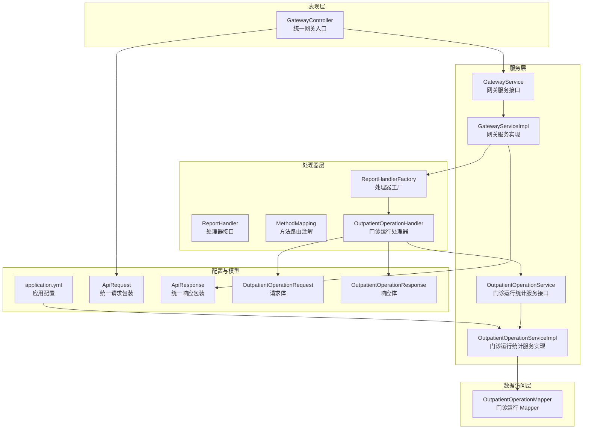
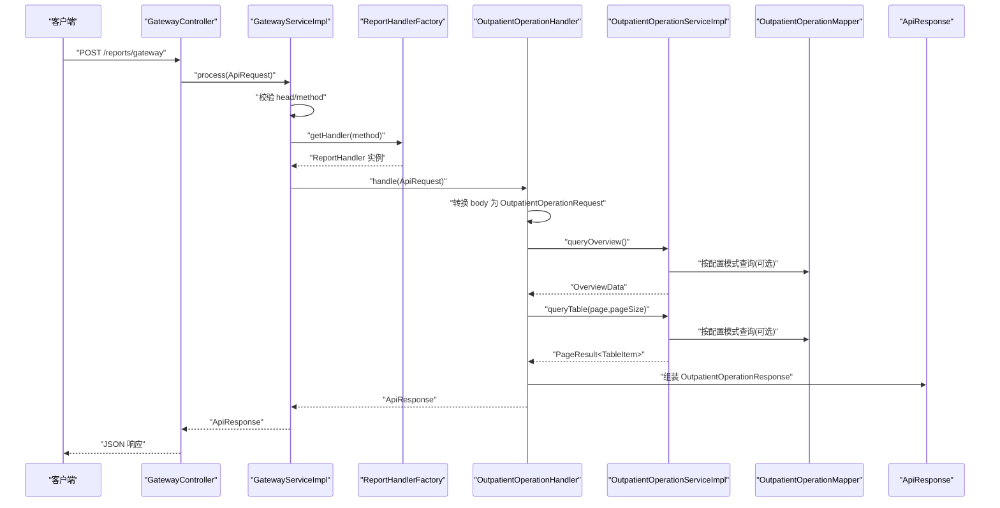
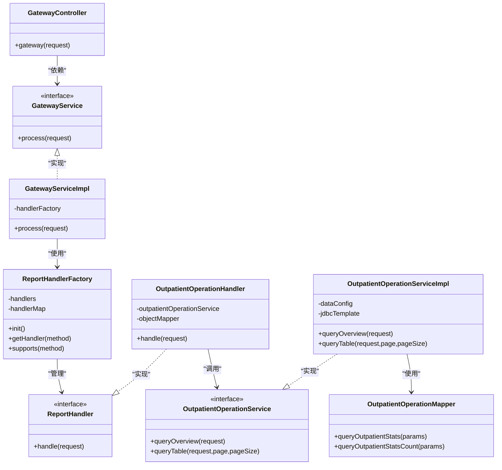

# 核心模块

<cite>
**本文引用的文件**
- [GatewayController.java](file://src/main/java/com/reports/controller/GatewayController.java)
- [GatewayService.java](file://src/main/java/com/reports/service/GatewayService.java)
- [GatewayServiceImpl.java](file://src/main/java/com/reports/service/impl/GatewayServiceImpl.java)
- [ReportHandler.java](file://src/main/java/com/reports/service/handler/ReportHandler.java)
- [ReportHandlerFactory.java](file://src/main/java/com/reports/service/handler/ReportHandlerFactory.java)
- [MethodMapping.java](file://src/main/java/com/reports/service/handler/MethodMapping.java)
- [OutpatientOperationHandler.java](file://src/main/java/com/reports/service/handler/impl/OutpatientOperationHandler.java)
- [ApiRequest.java](file://src/main/java/com/reports/dto/common/ApiRequest.java)
- [ApiResponse.java](file://src/main/java/com/reports/dto/common/ApiResponse.java)
- [OutpatientOperationService.java](file://src/main/java/com/reports/service/OutpatientOperationService.java)
- [OutpatientOperationServiceImpl.java](file://src/main/java/com/reports/service/impl/OutpatientOperationServiceImpl.java)
- [OutpatientOperationRequest.java](file://src/main/java/com/reports/dto/request/OutpatientOperationRequest.java)
- [OutpatientOperationResponse.java](file://src/main/java/com/reports/dto/response/OutpatientOperationResponse.java)
- [OutpatientOperationMapper.java](file://src/main/java/com/reports/mapper/OutpatientOperationMapper.java)
- [application.yml](file://src/main/resources/application.yml)
</cite>

## 目录
1. [引言](#引言)
2. [项目结构](#项目结构)
3. [核心组件](#核心组件)
4. [架构总览](#架构总览)
5. [详细组件分析](#详细组件分析)
6. [依赖分析](#依赖分析)
7. [性能考虑](#性能考虑)
8. [故障排查指南](#故障排查指南)
9. [结论](#结论)
10. [附录](#附录)

## 引言
本文件聚焦于报告系统的“核心模块”，围绕统一网关、服务层、处理器接口与工厂、数据访问层等关键组件，系统阐述其职责边界、调用关系、接口定义、配置项与返回规范，并结合实际场景给出使用模式与最佳实践。文档既面向初学者提供清晰的入门路径，也为资深开发者提供深入的技术细节与扩展建议。

## 项目结构
项目采用按领域与层次混合的组织方式：
- 控制器层：统一网关入口负责接收请求并委派给服务层
- 服务层：网关服务负责方法路由与异常处理；具体业务服务封装数据获取策略
- 处理器层：基于注解驱动的处理器接口与工厂，实现按 method 的动态分发
- DTO 层：统一请求/响应包装、业务请求/响应模型
- 数据访问层：Mapper 接口与 Service 内部多模式数据获取策略
- 配置层：应用配置文件集中管理追踪号与数据模式

图表来源
- [GatewayController.java:1-38](file://src/main/java/com/reports/controller/GatewayController.java#L1-L38)
- [GatewayService.java:1-17](file://src/main/java/com/reports/service/GatewayService.java#L1-L17)
- [GatewayServiceImpl.java:1-51](file://src/main/java/com/reports/service/impl/GatewayServiceImpl.java#L1-L51)
- [ReportHandler.java:1-28](file://src/main/java/com/reports/service/handler/ReportHandler.java#L1-L28)
- [ReportHandlerFactory.java:1-74](file://src/main/java/com/reports/service/handler/ReportHandlerFactory.java#L1-L74)
- [MethodMapping.java:1-29](file://src/main/java/com/reports/service/handler/MethodMapping.java#L1-L29)
- [OutpatientOperationHandler.java:1-65](file://src/main/java/com/reports/service/handler/impl/OutpatientOperationHandler.java#L1-L65)
- [OutpatientOperationService.java:1-24](file://src/main/java/com/reports/service/OutpatientOperationService.java#L1-L24)
- [OutpatientOperationServiceImpl.java:1-253](file://src/main/java/com/reports/service/impl/OutpatientOperationServiceImpl.java#L1-L253)
- [OutpatientOperationMapper.java:1-31](file://src/main/java/com/reports/mapper/OutpatientOperationMapper.java#L1-L31)
- [ApiRequest.java:1-35](file://src/main/java/com/reports/dto/common/ApiRequest.java#L1-L35)
- [ApiResponse.java:1-57](file://src/main/java/com/reports/dto/common/ApiResponse.java#L1-L57)
- [OutpatientOperationRequest.java:1-37](file://src/main/java/com/reports/dto/request/OutpatientOperationRequest.java#L1-L37)
- [OutpatientOperationResponse.java:1-25](file://src/main/java/com/reports/dto/response/OutpatientOperationResponse.java#L1-L25)
- [application.yml:1-32](file://src/main/resources/application.yml#L1-L32)

章节来源
- [GatewayController.java:1-38](file://src/main/java/com/reports/controller/GatewayController.java#L1-L38)
- [application.yml:1-32](file://src/main/resources/application.yml#L1-L32)

## 核心组件
本节对关键组件进行深入解析，包括职责、接口定义、参数与返回值规范、错误处理策略以及与其它组件的耦合关系。

- 统一网关入口
  - 职责：接收统一请求，记录日志，调用网关服务进行处理
  - 关键点：基于 Spring MVC 的 POST 接口，路径为 /reports/gateway；请求体为 ApiRequest<Object>
  - 返回：ApiResponse<?>，由网关服务统一装配
  - 参考路径：[GatewayController.java:28-35](file://src/main/java/com/reports/controller/GatewayController.java#L28-L35)

- 网关服务接口与实现
  - 接口：GatewayService，定义 process(ApiRequest) 方法
  - 实现：GatewayServiceImpl
    - 参数校验：head/method 必填
    - 路由分发：通过 ReportHandlerFactory 根据 method 获取处理器
    - 异常处理：缺失 method 或找不到处理器时抛出业务异常
    - 返回：委托处理器执行后的 ApiResponse
  - 参考路径：
    - [GatewayService.java:9-16](file://src/main/java/com/reports/service/GatewayService.java#L9-L16)
    - [GatewayServiceImpl.java:29-48](file://src/main/java/com/reports/service/impl/GatewayServiceImpl.java#L29-L48)

- 处理器接口与工厂
  - 接口：ReportHandler<T, R>，定义 handle(ApiRequest<Object>) -> ApiResponse<R>
  - 注解：MethodMapping，标注在实现类上，声明 method 路由键
  - 工厂：ReportHandlerFactory
    - 初始化：扫描所有 ReportHandler 实现，读取 @MethodMapping 注解，注册到内存映射
    - 安全校验：缺少注解、注解为空、重复注册均触发告警或异常
    - 提供：getHandler(method) 与 supports(method)
  - 参考路径：
    - [ReportHandler.java:19-27](file://src/main/java/com/reports/service/handler/ReportHandler.java#L19-L27)
    - [MethodMapping.java:21-28](file://src/main/java/com/reports/service/handler/MethodMapping.java#L21-L28)
    - [ReportHandlerFactory.java:31-71](file://src/main/java/com/reports/service/handler/ReportHandlerFactory.java#L31-L71)

- 门诊运行统计处理器
  - 实现：OutpatientOperationHandler
  - 路由键：reports.outp.outpatient-operation（由 @MethodMapping 声明）
  - 处理流程：
    - 将 ApiRequest<Object> 的 body 转换为 OutpatientOperationRequest
    - 调用 OutpatientOperationService 查询概览与表格数据
    - 组装 OutpatientOperationResponse 并返回 ApiResponse.success(...)
  - 参考路径：
    - [OutpatientOperationHandler.java:21-62](file://src/main/java/com/reports/service/handler/impl/OutpatientOperationHandler.java#L21-L62)

- 门诊运行统计服务接口与实现
  - 接口：OutpatientOperationService，定义 queryOverview 与 queryTable
  - 实现：OutpatientOperationServiceImpl
    - 数据模式：通过 application.yml 的 reports.data.mode 切换
      - mock：返回模拟数据
      - jdbc：使用 JdbcTemplate 直连 SQL
      - mybatis-plus：使用 MyBatis-Plus（当前回退至 mock）
    - 错误回退：JDBC/MP 查询异常时回退到 mock
  - 参考路径：
    - [OutpatientOperationService.java:11-23](file://src/main/java/com/reports/service/OutpatientOperationService.java#L11-L23)
    - [OutpatientOperationServiceImpl.java:47-73](file://src/main/java/com/reports/service/impl/OutpatientOperationServiceImpl.java#L47-L73)
    - [application.yml:21-23](file://src/main/resources/application.yml#L21-L23)

- 数据访问层
  - Mapper：OutpatientOperationMapper（当前示例 SQL 仅作演示，实际可替换为真实 SQL）
  - Service 内部：根据配置选择不同数据获取方式
  - 参考路径：
    - [OutpatientOperationMapper.java:14-30](file://src/main/java/com/reports/mapper/OutpatientOperationMapper.java#L14-L30)
    - [OutpatientOperationServiceImpl.java:150-241](file://src/main/java/com/reports/service/impl/OutpatientOperationServiceImpl.java#L150-L241)

- DTO 与统一包装
  - ApiRequest<T>：包含 head 与 body；提供 getMethod() 便捷方法
  - ApiResponse<T>：包含 result 与 body；提供 success/fail 静态工厂方法
  - 门诊运行请求/响应：OutpatientOperationRequest/OutpatientOperationResponse
  - 参考路径：
    - [ApiRequest.java:13-34](file://src/main/java/com/reports/dto/common/ApiRequest.java#L13-L34)
    - [ApiResponse.java:13-56](file://src/main/java/com/reports/dto/common/ApiResponse.java#L13-L56)
    - [OutpatientOperationRequest.java:12-36](file://src/main/java/com/reports/dto/request/OutpatientOperationRequest.java#L12-L36)
    - [OutpatientOperationResponse.java:10-24](file://src/main/java/com/reports/dto/response/OutpatientOperationResponse.java#L10-L24)

章节来源
- [GatewayController.java:1-38](file://src/main/java/com/reports/controller/GatewayController.java#L1-L38)
- [GatewayService.java:1-17](file://src/main/java/com/reports/service/GatewayService.java#L1-L17)
- [GatewayServiceImpl.java:1-51](file://src/main/java/com/reports/service/impl/GatewayServiceImpl.java#L1-L51)
- [ReportHandler.java:1-28](file://src/main/java/com/reports/service/handler/ReportHandler.java#L1-L28)
- [ReportHandlerFactory.java:1-74](file://src/main/java/com/reports/service/handler/ReportHandlerFactory.java#L1-L74)
- [MethodMapping.java:1-29](file://src/main/java/com/reports/service/handler/MethodMapping.java#L1-L29)
- [OutpatientOperationHandler.java:1-65](file://src/main/java/com/reports/service/handler/impl/OutpatientOperationHandler.java#L1-L65)
- [OutpatientOperationService.java:1-24](file://src/main/java/com/reports/service/OutpatientOperationService.java#L1-L24)
- [OutpatientOperationServiceImpl.java:1-253](file://src/main/java/com/reports/service/impl/OutpatientOperationServiceImpl.java#L1-L253)
- [OutpatientOperationMapper.java:1-31](file://src/main/java/com/reports/mapper/OutpatientOperationMapper.java#L1-L31)
- [ApiRequest.java:1-35](file://src/main/java/com/reports/dto/common/ApiRequest.java#L1-L35)
- [ApiResponse.java:1-57](file://src/main/java/com/reports/dto/common/ApiResponse.java#L1-L57)
- [OutpatientOperationRequest.java:1-37](file://src/main/java/com/reports/dto/request/OutpatientOperationRequest.java#L1-L37)
- [OutpatientOperationResponse.java:1-25](file://src/main/java/com/reports/dto/response/OutpatientOperationResponse.java#L1-L25)
- [application.yml:1-32](file://src/main/resources/application.yml#L1-L32)

## 架构总览
下图展示了从请求进入网关到最终返回响应的完整链路，以及各组件之间的依赖关系与交互顺序。

图表来源
- [GatewayController.java:31-35](file://src/main/java/com/reports/controller/GatewayController.java#L31-L35)
- [GatewayServiceImpl.java:31-47](file://src/main/java/com/reports/service/impl/GatewayServiceImpl.java#L31-L47)
- [ReportHandlerFactory.java:57-64](file://src/main/java/com/reports/service/handler/ReportHandlerFactory.java#L57-L64)
- [OutpatientOperationHandler.java:34-61](file://src/main/java/com/reports/service/handler/impl/OutpatientOperationHandler.java#L34-L61)
- [OutpatientOperationServiceImpl.java:47-73](file://src/main/java/com/reports/service/impl/OutpatientOperationServiceImpl.java#L47-L73)
- [OutpatientOperationMapper.java:14-30](file://src/main/java/com/reports/mapper/OutpatientOperationMapper.java#L14-L30)
- [ApiResponse.java:38-54](file://src/main/java/com/reports/dto/common/ApiResponse.java#L38-L54)

## 详细组件分析

### 统一网关控制器
- 角色定位：系统对外唯一入口，屏蔽内部实现细节
- 关键行为：
  - 记录请求 trace 日志
  - 直接委派给 GatewayService.process
- 参数与返回：
  - 输入：ApiRequest<Object>
  - 输出：ApiResponse<?>
- 使用模式：
  - 前端/外部系统统一向 /reports/gateway 发送 JSON 请求
  - 请求头包含 method，用于路由到具体处理器
- 参考路径：
  - [GatewayController.java:28-35](file://src/main/java/com/reports/controller/GatewayController.java#L28-L35)

章节来源
- [GatewayController.java:1-38](file://src/main/java/com/reports/controller/GatewayController.java#L1-L38)

### 网关服务实现
- 路由机制：
  - 从 ApiRequest.head.method 获取路由键
  - 通过 ReportHandlerFactory 查找处理器
- 错误处理：
  - method 缺失或为空：抛出业务异常
  - 未找到处理器：抛出业务异常
- 性能与健壮性：
  - 使用并发安全的 Map 存储处理器映射
  - 初始化阶段完成扫描与注册，运行期仅做查找
- 参考路径：
  - [GatewayServiceImpl.java:31-48](file://src/main/java/com/reports/service/impl/GatewayServiceImpl.java#L31-L48)

章节来源
- [GatewayServiceImpl.java:1-51](file://src/main/java/com/reports/service/impl/GatewayServiceImpl.java#L1-L51)

### 处理器接口与工厂
- 接口设计：
  - 泛型 T/R 明确请求/响应类型，便于编译期约束
  - handle(ApiRequest<Object>) 适配统一入参
- 注解驱动：
  - @MethodMapping(value) 声明路由键，避免硬编码
  - 工厂在容器启动后扫描并注册
- 安全与可观测性：
  - 缺失注解或空值抛出异常
  - 重复注册发出警告
  - 注册完成后输出统计日志
- 参考路径：
  - [ReportHandler.java:19-27](file://src/main/java/com/reports/service/handler/ReportHandler.java#L19-L27)
  - [MethodMapping.java:21-28](file://src/main/java/com/reports/service/handler/MethodMapping.java#L21-L28)
  - [ReportHandlerFactory.java:31-71](file://src/main/java/com/reports/service/handler/ReportHandlerFactory.java#L31-L71)

章节来源
- [ReportHandler.java:1-28](file://src/main/java/com/reports/service/handler/ReportHandler.java#L1-L28)
- [MethodMapping.java:1-29](file://src/main/java/com/reports/service/handler/MethodMapping.java#L1-L29)
- [ReportHandlerFactory.java:1-74](file://src/main/java/com/reports/service/handler/ReportHandlerFactory.java#L1-L74)

### 门诊运行统计处理器
- 路由键：reports.outp.outpatient-operation
- 处理步骤：
  - 解析请求体为强类型请求对象
  - 调用服务层查询概览与表格数据
  - 组装响应并返回成功状态
- 参数与返回：
  - 请求：ApiRequest<Object> -> OutpatientOperationRequest
  - 响应：ApiResponse<OutpatientOperationResponse>
- 参考路径：
  - [OutpatientOperationHandler.java:21-62](file://src/main/java/com/reports/service/handler/impl/OutpatientOperationHandler.java#L21-L62)

章节来源
- [OutpatientOperationHandler.java:1-65](file://src/main/java/com/reports/service/handler/impl/OutpatientOperationHandler.java#L1-L65)

### 门诊运行统计服务实现
- 数据模式切换：
  - mock：直接构造模拟数据
  - jdbc：使用 JdbcTemplate 执行 SQL
  - mybatis-plus：使用 MyBatis-Plus（当前回退到 mock）
- 回退策略：
  - JDBC/MP 查询异常时回退到 mock，保证可用性
- 配置项：
  - reports.data.mode：mock/jdbc/mybatis-plus
- 参考路径：
  - [OutpatientOperationServiceImpl.java:29-73](file://src/main/java/com/reports/service/impl/OutpatientOperationServiceImpl.java#L29-L73)
  - [application.yml:21-23](file://src/main/resources/application.yml#L21-L23)

章节来源
- [OutpatientOperationServiceImpl.java:1-253](file://src/main/java/com/reports/service/impl/OutpatientOperationServiceImpl.java#L1-L253)
- [application.yml:1-32](file://src/main/resources/application.yml#L1-L32)

### 数据访问层
- Mapper 接口：
  - 提供示例 SQL（演示 Oracle 分页语法），可替换为真实业务 SQL
- Service 内部策略：
  - 根据配置选择 mock/jdbc/mp
  - JDBC/MP 查询失败时回退 mock
- 参考路径：
  - [OutpatientOperationMapper.java:14-30](file://src/main/java/com/reports/mapper/OutpatientOperationMapper.java#L14-L30)
  - [OutpatientOperationServiceImpl.java:150-241](file://src/main/java/com/reports/service/impl/OutpatientOperationServiceImpl.java#L150-L241)

章节来源
- [OutpatientOperationMapper.java:1-31](file://src/main/java/com/reports/mapper/OutpatientOperationMapper.java#L1-L31)
- [OutpatientOperationServiceImpl.java:1-253](file://src/main/java/com/reports/service/impl/OutpatientOperationServiceImpl.java#L1-L253)

### DTO 与统一包装
- ApiRequest<T>：
  - head：包含 method 等通用头部信息
  - body：泛型请求体
  - getMethod()：便捷获取 method
- ApiResponse<T>：
  - result：统一结果对象
  - body：业务响应体
  - success/fail 静态工厂方法
- 门诊运行 DTO：
  - 请求体：OutpatientOperationRequest（包含日期范围、科室信息等）
  - 响应体：OutpatientOperationResponse（概览 + 分页表格）
- 参考路径：
  - [ApiRequest.java:13-34](file://src/main/java/com/reports/dto/common/ApiRequest.java#L13-L34)
  - [ApiResponse.java:13-56](file://src/main/java/com/reports/dto/common/ApiResponse.java#L13-L56)
  - [OutpatientOperationRequest.java:12-36](file://src/main/java/com/reports/dto/request/OutpatientOperationRequest.java#L12-L36)
  - [OutpatientOperationResponse.java:10-24](file://src/main/java/com/reports/dto/response/OutpatientOperationResponse.java#L10-L24)

章节来源
- [ApiRequest.java:1-35](file://src/main/java/com/reports/dto/common/ApiRequest.java#L1-L35)
- [ApiResponse.java:1-57](file://src/main/java/com/reports/dto/common/ApiResponse.java#L1-L57)
- [OutpatientOperationRequest.java:1-37](file://src/main/java/com/reports/dto/request/OutpatientOperationRequest.java#L1-L37)
- [OutpatientOperationResponse.java:1-25](file://src/main/java/com/reports/dto/response/OutpatientOperationResponse.java#L1-L25)

## 依赖分析
- 组件内聚与耦合
  - 网关层与处理器层通过接口解耦，路由逻辑集中在工厂
  - 服务层对数据访问层的依赖通过配置项解耦（mock/jdbc/mp）
- 直接依赖
  - GatewayController -> GatewayService
  - GatewayServiceImpl -> ReportHandlerFactory
  - ReportHandlerFactory -> ReportHandler 实现
  - OutpatientOperationHandler -> OutpatientOperationService
  - OutpatientOperationServiceImpl -> OutpatientOperationMapper
- 外部依赖
  - Spring Web（控制器）、Spring Beans（依赖注入）、MyBatis/MyBatis-Plus（可选）

图表来源
- [GatewayController.java:1-38](file://src/main/java/com/reports/controller/GatewayController.java#L1-L38)
- [GatewayService.java:1-17](file://src/main/java/com/reports/service/GatewayService.java#L1-L17)
- [GatewayServiceImpl.java:1-51](file://src/main/java/com/reports/service/impl/GatewayServiceImpl.java#L1-L51)
- [ReportHandlerFactory.java:1-74](file://src/main/java/com/reports/service/handler/ReportHandlerFactory.java#L1-L74)
- [ReportHandler.java:1-28](file://src/main/java/com/reports/service/handler/ReportHandler.java#L1-L28)
- [OutpatientOperationHandler.java:1-65](file://src/main/java/com/reports/service/handler/impl/OutpatientOperationHandler.java#L1-L65)
- [OutpatientOperationService.java:1-24](file://src/main/java/com/reports/service/OutpatientOperationService.java#L1-L24)
- [OutpatientOperationServiceImpl.java:1-253](file://src/main/java/com/reports/service/impl/OutpatientOperationServiceImpl.java#L1-L253)
- [OutpatientOperationMapper.java:1-31](file://src/main/java/com/reports/mapper/OutpatientOperationMapper.java#L1-L31)

章节来源
- [GatewayServiceImpl.java:22-27](file://src/main/java/com/reports/service/impl/GatewayServiceImpl.java#L22-L27)
- [ReportHandlerFactory.java:23-51](file://src/main/java/com/reports/service/handler/ReportHandlerFactory.java#L23-L51)
- [OutpatientOperationHandler.java:24-31](file://src/main/java/com/reports/service/handler/impl/OutpatientOperationHandler.java#L24-L31)
- [OutpatientOperationServiceImpl.java:38-45](file://src/main/java/com/reports/service/impl/OutpatientOperationServiceImpl.java#L38-L45)

## 性能考虑
- 路由查找
  - 工厂初始化时一次性扫描并缓存处理器映射，运行期为 O(1) 查找
- 序列化与转换
  - 处理器内部对 body 进行类型转换，建议确保请求体结构稳定以减少转换开销
- 数据访问
  - JDBC/MP 查询失败回退到 mock，保障可用性但可能影响性能与准确性
  - 建议在生产环境完善 SQL 与索引，避免回退
- 日志与追踪
  - 控制台日志包含 traceId，便于链路追踪与性能分析
- 参考路径：
  - [ReportHandlerFactory.java:57-64](file://src/main/java/com/reports/service/handler/ReportHandlerFactory.java#L57-L64)
  - [OutpatientOperationHandler.java:37-46](file://src/main/java/com/reports/service/handler/impl/OutpatientOperationHandler.java#L37-L46)
  - [OutpatientOperationServiceImpl.java:173-177](file://src/main/java/com/reports/service/impl/OutpatientOperationServiceImpl.java#L173-L177)
  - [application.yml:25-31](file://src/main/resources/application.yml#L25-L31)

## 故障排查指南
- 常见问题与定位
  - method 缺失或为空：网关服务会抛出业务异常
    - 参考路径：[GatewayServiceImpl.java:32-35](file://src/main/java/com/reports/service/impl/GatewayServiceImpl.java#L32-L35)
  - method 未注册处理器：工厂会抛出业务异常
    - 参考路径：[ReportHandlerFactory.java:60-62](file://src/main/java/com/reports/service/handler/ReportHandlerFactory.java#L60-L62)
  - 处理器实现缺少 @MethodMapping 注解：工厂初始化阶段抛出异常
    - 参考路径：[ReportHandlerFactory.java:37-39](file://src/main/java/com/reports/service/handler/ReportHandlerFactory.java#L37-L39)
  - JDBC/MP 查询异常：服务实现回退到 mock
    - 参考路径：[OutpatientOperationServiceImpl.java:173-177](file://src/main/java/com/reports/service/impl/OutpatientOperationServiceImpl.java#L173-L177)
- 排查步骤
  - 检查请求头 head.method 是否正确
  - 检查处理器实现是否添加 @MethodMapping 注解且值非空
  - 检查 reports.data.mode 配置是否符合预期
  - 查看服务层日志，确认是否发生回退
- 参考路径：
  - [GatewayServiceImpl.java:31-48](file://src/main/java/com/reports/service/impl/GatewayServiceImpl.java#L31-L48)
  - [ReportHandlerFactory.java:31-71](file://src/main/java/com/reports/service/handler/ReportHandlerFactory.java#L31-L71)
  - [OutpatientOperationServiceImpl.java:47-73](file://src/main/java/com/reports/service/impl/OutpatientOperationServiceImpl.java#L47-L73)

章节来源
- [GatewayServiceImpl.java:1-51](file://src/main/java/com/reports/service/impl/GatewayServiceImpl.java#L1-L51)
- [ReportHandlerFactory.java:1-74](file://src/main/java/com/reports/service/handler/ReportHandlerFactory.java#L1-L74)
- [OutpatientOperationServiceImpl.java:1-253](file://src/main/java/com/reports/service/impl/OutpatientOperationServiceImpl.java#L1-L253)

## 结论
本核心模块通过“统一网关 + 处理器工厂 + 多数据模式服务”的架构，实现了高内聚、低耦合、易扩展的报表处理体系。注解驱动的路由机制简化了新增报表的能力，而配置化的数据访问策略则提供了灵活的部署与迁移能力。建议在生产环境中完善 SQL 与索引，减少回退概率，并持续优化日志与监控以提升可观测性。

## 附录
- 配置项说明
  - reports.trace.prefix：追踪号前缀
  - reports.trace.number-length：追踪号数字长度
  - reports.trace.include-brackets：是否包含方括号
  - reports.data.mode：数据模式（mock/jdbc/mybatis-plus）
- 参考路径：
  - [application.yml:13-23](file://src/main/resources/application.yml#L13-L23)