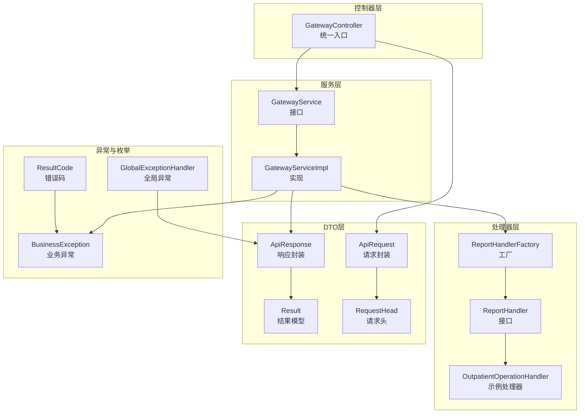
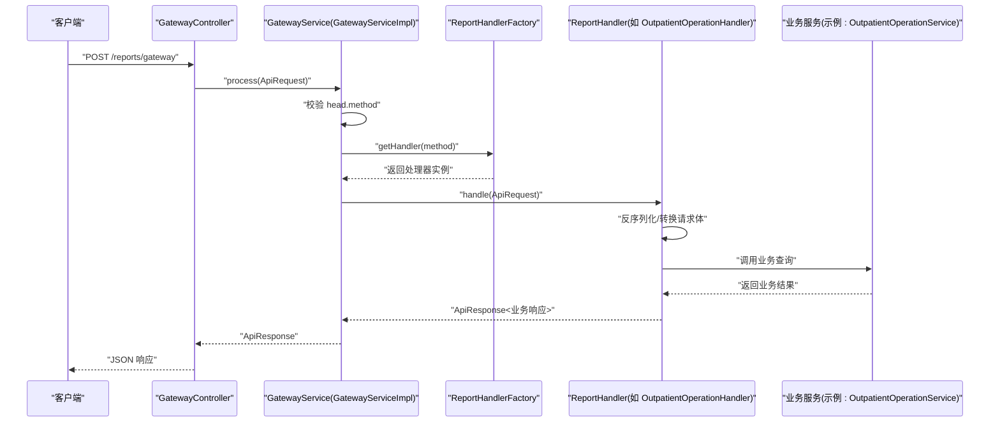
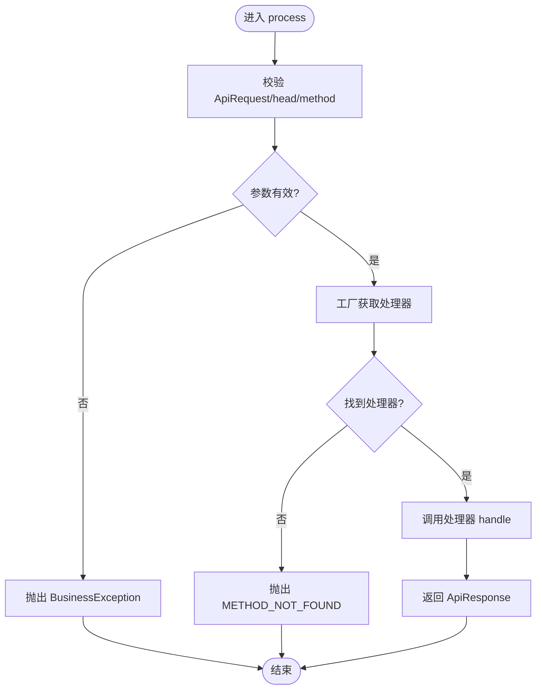
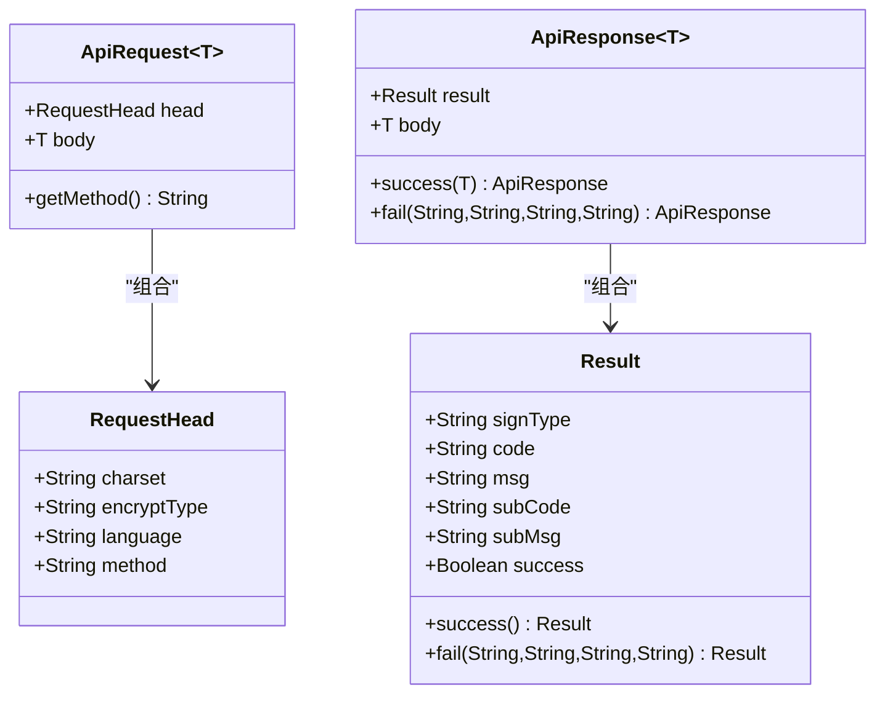
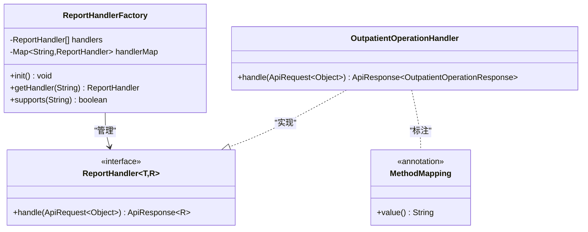
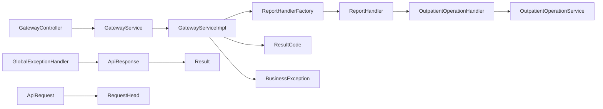

# 网关层

<cite>
**本文引用的文件**
- [GatewayController.java](file://src/main/java/com/reports/controller/GatewayController.java)
- [GatewayServiceImpl.java](file://src/main/java/com/reports/service/impl/GatewayServiceImpl.java)
- [GatewayService.java](file://src/main/java/com/reports/service/GatewayService.java)
- [ApiRequest.java](file://src/main/java/com/reports/dto/common/ApiRequest.java)
- [ApiResponse.java](file://src/main/java/com/reports/dto/common/ApiResponse.java)
- [RequestHead.java](file://src/main/java/com/reports/dto/common/RequestHead.java)
- [Result.java](file://src/main/java/com/reports/dto/common/Result.java)
- [ResultCode.java](file://src/main/java/com/reports/enums/ResultCode.java)
- [ReportHandlerFactory.java](file://src/main/java/com/reports/service/handler/ReportHandlerFactory.java)
- [ReportHandler.java](file://src/main/java/com/reports/service/handler/ReportHandler.java)
- [MethodMapping.java](file://src/main/java/com/reports/service/handler/MethodMapping.java)
- [OutpatientOperationHandler.java](file://src/main/java/com/reports/service/handler/impl/OutpatientOperationHandler.java)
- [BusinessException.java](file://src/main/java/com/reports/exception/BusinessException.java)
- [GlobalExceptionHandler.java](file://src/main/java/com/reports/exception/GlobalExceptionHandler.java)
- [OutpatientOperationRequest.java](file://src/main/java/com/reports/dto/request/OutpatientOperationRequest.java)
</cite>

## 目录
1. [简介](#简介)
2. [项目结构](#项目结构)
3. [核心组件](#核心组件)
4. [架构总览](#架构总览)
5. [组件详解](#组件详解)
6. [依赖关系分析](#依赖关系分析)
7. [性能考量](#性能考量)
8. [故障排查指南](#故障排查指南)
9. [结论](#结论)
10. [附录](#附录)

## 简介
本文件面向“网关层”的技术文档，围绕统一入口控制器 GatewayController、请求路由与参数校验、服务实现 GatewayServiceImpl、数据传输对象 DTO（ApiRequest/ApiResponse/Result）、处理器工厂与调用流程、以及错误码与异常处理策略展开。文档旨在帮助开发者快速理解并扩展网关能力，同时提供可视化图示与最佳实践建议。

## 项目结构
网关层位于 com.reports 包下，采用按职责分层组织：
- 控制器层：GatewayController 提供统一入口，接收 JSON 请求并委派给服务层
- 服务层：GatewayService 接口与 GatewayServiceImpl 实现负责参数校验、方法路由、异常处理与响应封装
- DTO 层：ApiRequest/ApiResponse/Result/RequestHead 等统一请求/响应模型
- 处理器层：ReportHandler 接口及其实现，通过 ReportHandlerFactory 进行集中注册与路由
- 异常层：BusinessException 与全局异常 GlobalExceptionHandler 统一兜底
- 枚举层：ResultCode 定义统一错误码体系

图表来源
- [GatewayController.java:1-38](file://src/main/java/com/reports/controller/GatewayController.java#L1-L38)
- [GatewayServiceImpl.java:1-51](file://src/main/java/com/reports/service/impl/GatewayServiceImpl.java#L1-L51)
- [GatewayService.java:1-17](file://src/main/java/com/reports/service/GatewayService.java#L1-L17)
- [ReportHandlerFactory.java:1-74](file://src/main/java/com/reports/service/handler/ReportHandlerFactory.java#L1-L74)
- [ReportHandler.java:1-28](file://src/main/java/com/reports/service/handler/ReportHandler.java#L1-L28)
- [OutpatientOperationHandler.java:1-65](file://src/main/java/com/reports/service/handler/impl/OutpatientOperationHandler.java#L1-L65)
- [ApiRequest.java:1-35](file://src/main/java/com/reports/dto/common/ApiRequest.java#L1-L35)
- [ApiResponse.java:1-57](file://src/main/java/com/reports/dto/common/ApiResponse.java#L1-L57)
- [Result.java:1-78](file://src/main/java/com/reports/dto/common/Result.java#L1-L78)
- [RequestHead.java:1-37](file://src/main/java/com/reports/dto/common/RequestHead.java#L1-L37)
- [BusinessException.java:1-38](file://src/main/java/com/reports/exception/BusinessException.java#L1-L38)
- [GlobalExceptionHandler.java:1-86](file://src/main/java/com/reports/exception/GlobalExceptionHandler.java#L1-L86)
- [ResultCode.java:1-77](file://src/main/java/com/reports/enums/ResultCode.java#L1-L77)

章节来源
- [GatewayController.java:1-38](file://src/main/java/com/reports/controller/GatewayController.java#L1-L38)
- [GatewayServiceImpl.java:1-51](file://src/main/java/com/reports/service/impl/GatewayServiceImpl.java#L1-L51)
- [GatewayService.java:1-17](file://src/main/java/com/reports/service/GatewayService.java#L1-L17)
- [ReportHandlerFactory.java:1-74](file://src/main/java/com/reports/service/handler/ReportHandlerFactory.java#L1-L74)
- [ReportHandler.java:1-28](file://src/main/java/com/reports/service/handler/ReportHandler.java#L1-L28)
- [OutpatientOperationHandler.java:1-65](file://src/main/java/com/reports/service/handler/impl/OutpatientOperationHandler.java#L1-L65)
- [ApiRequest.java:1-35](file://src/main/java/com/reports/dto/common/ApiRequest.java#L1-L35)
- [ApiResponse.java:1-57](file://src/main/java/com/reports/dto/common/ApiResponse.java#L1-L57)
- [Result.java:1-78](file://src/main/java/com/reports/dto/common/Result.java#L1-L78)
- [RequestHead.java:1-37](file://src/main/java/com/reports/dto/common/RequestHead.java#L1-L37)
- [BusinessException.java:1-38](file://src/main/java/com/reports/exception/BusinessException.java#L1-L38)
- [GlobalExceptionHandler.java:1-86](file://src/main/java/com/reports/exception/GlobalExceptionHandler.java#L1-L86)
- [ResultCode.java:1-77](file://src/main/java/com/reports/enums/ResultCode.java#L1-L77)

## 核心组件
- 统一入口控制器：GatewayController 暴露 POST /reports/gateway，接收 ApiRequest 并调用 GatewayService.process 返回 ApiResponse
- 网关服务实现：GatewayServiceImpl 负责参数校验、方法路由、异常处理与响应封装
- 数据传输对象：ApiRequest/ApiResponse/Result/RequestHead 统一请求/响应结构；泛型支持不同业务响应体
- 处理器与工厂：ReportHandler 定义处理契约；ReportHandlerFactory 基于 @MethodMapping 注解自动注册，按 method 路由到具体处理器
- 错误码与异常：ResultCode 定义统一错误码；BusinessException 与 GlobalExceptionHandler 统一兜底

章节来源
- [GatewayController.java:13-38](file://src/main/java/com/reports/controller/GatewayController.java#L13-L38)
- [GatewayServiceImpl.java:15-51](file://src/main/java/com/reports/service/impl/GatewayServiceImpl.java#L15-L51)
- [ApiRequest.java:7-35](file://src/main/java/com/reports/dto/common/ApiRequest.java#L7-L35)
- [ApiResponse.java:7-57](file://src/main/java/com/reports/dto/common/ApiResponse.java#L7-L57)
- [Result.java:7-78](file://src/main/java/com/reports/dto/common/Result.java#L7-L78)
- [RequestHead.java:7-37](file://src/main/java/com/reports/dto/common/RequestHead.java#L7-L37)
- [ReportHandler.java:6-28](file://src/main/java/com/reports/service/handler/ReportHandler.java#L6-L28)
- [ReportHandlerFactory.java:14-74](file://src/main/java/com/reports/service/handler/ReportHandlerFactory.java#L14-L74)
- [ResultCode.java:5-77](file://src/main/java/com/reports/enums/ResultCode.java#L5-L77)
- [BusinessException.java:6-38](file://src/main/java/com/reports/exception/BusinessException.java#L6-L38)
- [GlobalExceptionHandler.java:13-86](file://src/main/java/com/reports/exception/GlobalExceptionHandler.java#L13-L86)

## 架构总览
网关层采用“控制器-服务-处理器工厂-处理器”的分层架构，通过统一 DTO 与错误码体系实现高内聚、低耦合的扩展性。

图表来源
- [GatewayController.java:28-35](file://src/main/java/com/reports/controller/GatewayController.java#L28-L35)
- [GatewayServiceImpl.java:29-48](file://src/main/java/com/reports/service/impl/GatewayServiceImpl.java#L29-L48)
- [ReportHandlerFactory.java:54-64](file://src/main/java/com/reports/service/handler/ReportHandlerFactory.java#L54-L64)
- [OutpatientOperationHandler.java:33-62](file://src/main/java/com/reports/service/handler/impl/OutpatientOperationHandler.java#L33-L62)

## 组件详解

### GatewayController 设计理念与请求路由
- 统一入口：暴露 /reports/gateway 的 POST 接口，接收 ApiRequest 对象
- 单一职责：仅负责接收请求、记录日志、委派处理、返回响应
- 与 Spring MVC 集成：基于注解驱动，简化开发与测试

章节来源
- [GatewayController.java:13-38](file://src/main/java/com/reports/controller/GatewayController.java#L13-L38)

### GatewayServiceImpl 实现细节
- 参数验证：校验 ApiRequest 与 RequestHead.method 是否为空
- 方法路由：通过 ReportHandlerFactory 按 method 获取处理器
- 异常处理：对缺失参数与未知方法抛出 BusinessException
- 响应封装：直接返回处理器返回的 ApiResponse

图表来源
- [GatewayServiceImpl.java:29-48](file://src/main/java/com/reports/service/impl/GatewayServiceImpl.java#L29-L48)
- [ResultCode.java:31-40](file://src/main/java/com/reports/enums/ResultCode.java#L31-L40)

章节来源
- [GatewayServiceImpl.java:15-51](file://src/main/java/com/reports/service/impl/GatewayServiceImpl.java#L15-L51)

### 数据传输对象设计（DTO）
- ApiRequest<T>：包含 RequestHead 与泛型请求体 body；提供 getMethod() 便捷访问 head.method
- RequestHead：包含字符集、加密类型、语言与 method 等路由字段
- ApiResponse<T>：包含 Result 与泛型响应体 body；提供 success/fail 静态构造方法
- Result：统一结果模型，包含 code/msg/subCode/subMsg/success 等字段

图表来源
- [ApiRequest.java:7-35](file://src/main/java/com/reports/dto/common/ApiRequest.java#L7-L35)
- [RequestHead.java:7-37](file://src/main/java/com/reports/dto/common/RequestHead.java#L7-L37)
- [ApiResponse.java:7-57](file://src/main/java/com/reports/dto/common/ApiResponse.java#L7-L57)
- [Result.java:7-78](file://src/main/java/com/reports/dto/common/Result.java#L7-L78)

章节来源
- [ApiRequest.java:7-35](file://src/main/java/com/reports/dto/common/ApiRequest.java#L7-L35)
- [RequestHead.java:7-37](file://src/main/java/com/reports/dto/common/RequestHead.java#L7-L37)
- [ApiResponse.java:7-57](file://src/main/java/com/reports/dto/common/ApiResponse.java#L7-L57)
- [Result.java:7-78](file://src/main/java/com/reports/dto/common/Result.java#L7-L78)

### 处理器工厂与调用流程
- 注册机制：@PostConstruct 初始化时扫描所有 ReportHandler 实现，读取 @MethodMapping 注解值作为路由键注册
- 路由查找：getHandler(method) 依据 method 查找处理器，未找到则抛出 BusinessException
- 支持判断：supports(method) 用于外部判定是否支持某方法
- 处理器契约：ReportHandler.handle(ApiRequest<Object>) 返回 ApiResponse<R>，实现类负责将 Object 转换为强类型请求体

图表来源
- [ReportHandlerFactory.java:14-74](file://src/main/java/com/reports/service/handler/ReportHandlerFactory.java#L14-L74)
- [ReportHandler.java:6-28](file://src/main/java/com/reports/service/handler/ReportHandler.java#L6-L28)
- [MethodMapping.java:7-29](file://src/main/java/com/reports/service/handler/MethodMapping.java#L7-L29)
- [OutpatientOperationHandler.java:16-65](file://src/main/java/com/reports/service/handler/impl/OutpatientOperationHandler.java#L16-L65)

章节来源
- [ReportHandlerFactory.java:14-74](file://src/main/java/com/reports/service/handler/ReportHandlerFactory.java#L14-L74)
- [ReportHandler.java:6-28](file://src/main/java/com/reports/service/handler/ReportHandler.java#L6-L28)
- [MethodMapping.java:7-29](file://src/main/java/com/reports/service/handler/MethodMapping.java#L7-L29)
- [OutpatientOperationHandler.java:16-65](file://src/main/java/com/reports/service/handler/impl/OutpatientOperationHandler.java#L16-L65)

### 请求处理示例（以门诊运行数据为例）
- 请求路由：reports.outp.outpatient-operation
- 处理器：OutpatientOperationHandler
- 流程要点：
  - 将 ApiRequest.body 从通用 Object 转换为 OutpatientOperationRequest
  - 调用业务服务查询概览与分页表格数据
  - 组装 OutpatientOperationResponse 并通过 ApiResponse.success 返回

章节来源
- [OutpatientOperationHandler.java:33-62](file://src/main/java/com/reports/service/handler/impl/OutpatientOperationHandler.java#L33-L62)
- [OutpatientOperationRequest.java:7-37](file://src/main/java/com/reports/dto/request/OutpatientOperationRequest.java#L7-L37)

### 错误码定义与异常处理策略
- 错误码：ResultCode 定义统一错误码，覆盖参数、方法、数据、数据库、系统等场景
- 业务异常：BusinessException 携带 code/subCode/subMsg，便于前端识别与提示
- 全局异常：GlobalExceptionHandler 捕获业务异常、参数绑定异常、非法参数、数据源异常与通用异常，统一返回 ApiResponse.fail

章节来源
- [ResultCode.java:5-77](file://src/main/java/com/reports/enums/ResultCode.java#L5-L77)
- [BusinessException.java:6-38](file://src/main/java/com/reports/exception/BusinessException.java#L6-L38)
- [GlobalExceptionHandler.java:13-86](file://src/main/java/com/reports/exception/GlobalExceptionHandler.java#L13-L86)

## 依赖关系分析
- 控制器依赖服务接口，服务实现依赖工厂与处理器接口
- 工厂依赖处理器实现列表，处理器实现依赖业务服务与 Jackson ObjectMapper
- DTO 之间松耦合，通过泛型与静态工厂方法实现灵活组装
- 异常与枚举为横切关注点，贯穿各层

图表来源
- [GatewayController.java:1-38](file://src/main/java/com/reports/controller/GatewayController.java#L1-L38)
- [GatewayServiceImpl.java:1-51](file://src/main/java/com/reports/service/impl/GatewayServiceImpl.java#L1-L51)
- [ReportHandlerFactory.java:1-74](file://src/main/java/com/reports/service/handler/ReportHandlerFactory.java#L1-L74)
- [ReportHandler.java:1-28](file://src/main/java/com/reports/service/handler/ReportHandler.java#L1-L28)
- [OutpatientOperationHandler.java:1-65](file://src/main/java/com/reports/service/handler/impl/OutpatientOperationHandler.java#L1-L65)
- [ApiRequest.java:1-35](file://src/main/java/com/reports/dto/common/ApiRequest.java#L1-L35)
- [ApiResponse.java:1-57](file://src/main/java/com/reports/dto/common/ApiResponse.java#L1-L57)
- [Result.java:1-78](file://src/main/java/com/reports/dto/common/Result.java#L1-L78)
- [ResultCode.java:1-77](file://src/main/java/com/reports/enums/ResultCode.java#L1-L77)
- [BusinessException.java:1-38](file://src/main/java/com/reports/exception/BusinessException.java#L1-L38)
- [GlobalExceptionHandler.java:1-86](file://src/main/java/com/reports/exception/GlobalExceptionHandler.java#L1-L86)

章节来源
- [GatewayController.java:1-38](file://src/main/java/com/reports/controller/GatewayController.java#L1-L38)
- [GatewayServiceImpl.java:1-51](file://src/main/java/com/reports/service/impl/GatewayServiceImpl.java#L1-L51)
- [ReportHandlerFactory.java:1-74](file://src/main/java/com/reports/service/handler/ReportHandlerFactory.java#L1-L74)
- [ReportHandler.java:1-28](file://src/main/java/com/reports/service/handler/ReportHandler.java#L1-L28)
- [OutpatientOperationHandler.java:1-65](file://src/main/java/com/reports/service/handler/impl/OutpatientOperationHandler.java#L1-L65)
- [ApiRequest.java:1-35](file://src/main/java/com/reports/dto/common/ApiRequest.java#L1-L35)
- [ApiResponse.java:1-57](file://src/main/java/com/reports/dto/common/ApiResponse.java#L1-L57)
- [Result.java:1-78](file://src/main/java/com/reports/dto/common/Result.java#L1-L78)
- [ResultCode.java:1-77](file://src/main/java/com/reports/enums/ResultCode.java#L1-L77)
- [BusinessException.java:1-38](file://src/main/java/com/reports/exception/BusinessException.java#L1-L38)
- [GlobalExceptionHandler.java:1-86](file://src/main/java/com/reports/exception/GlobalExceptionHandler.java#L1-L86)

## 性能考量
- 路由查找：ReportHandlerFactory 使用并发安全的 Map 存储处理器，查找为 O(1)，适合高频路由
- 序列化转换：处理器内部使用 ObjectMapper 将通用 body 转为强类型请求体，建议在处理器层复用 ObjectMapper 实例
- 日志开销：控制器与服务层使用 TRACE/INFO 级别日志，建议生产环境合理配置日志级别
- 异常路径：异常处理集中在全局异常，避免重复 try-catch，减少分支判断带来的性能损耗
- 分页与查询：示例处理器对表格数据进行分页查询，建议结合数据库索引与分页参数控制单页大小

## 故障排查指南
- 参数缺失：当 ApiRequest 或 head.method 为空时，将抛出 PARAM_MISSING；检查客户端请求体与 method 字段
- 方法不存在：当 method 未注册时，抛出 METHOD_NOT_FOUND；确认 @MethodMapping 注解与工厂初始化
- 业务异常：捕获 BusinessException 后统一返回 ApiResponse.fail；根据 code/subCode/subMsg 定位问题
- 全局异常：参数绑定/非法参数/数据源异常/通用异常均会被全局异常处理器接管，查看日志 traceId 定位请求链路

章节来源
- [GatewayServiceImpl.java:32-44](file://src/main/java/com/reports/service/impl/GatewayServiceImpl.java#L32-L44)
- [ReportHandlerFactory.java:31-52](file://src/main/java/com/reports/service/handler/ReportHandlerFactory.java#L31-L52)
- [BusinessException.java:6-38](file://src/main/java/com/reports/exception/BusinessException.java#L6-L38)
- [GlobalExceptionHandler.java:13-86](file://src/main/java/com/reports/exception/GlobalExceptionHandler.java#L13-L86)

## 结论
网关层通过统一入口、参数校验、方法路由与异常处理，构建了清晰、可扩展、易维护的请求处理通道。配合 DTO 与错误码体系，能够快速适配各类报表类业务接口，并通过工厂模式实现处理器的动态注册与扩展。

## 附录
- 请求与响应格式规范
  - 请求：ApiRequest.head.method 用于路由；head 支持字符集、加密类型、语言等元信息；body 为具体业务请求体
  - 响应：ApiResponse.result 为 Result，包含 code/msg/subCode/subMsg/success；body 为具体业务响应体
- 常见错误码参考
  - 成功：10000
  - 参数错误：20001
  - 参数缺失：20002
  - 方法不存在：30001
  - 数据不存在：40001
  - 系统错误：99999

章节来源
- [ApiRequest.java:7-35](file://src/main/java/com/reports/dto/common/ApiRequest.java#L7-L35)
- [ApiResponse.java:7-57](file://src/main/java/com/reports/dto/common/ApiResponse.java#L7-L57)
- [Result.java:7-78](file://src/main/java/com/reports/dto/common/Result.java#L7-L78)
- [ResultCode.java:5-77](file://src/main/java/com/reports/enums/ResultCode.java#L5-L77)