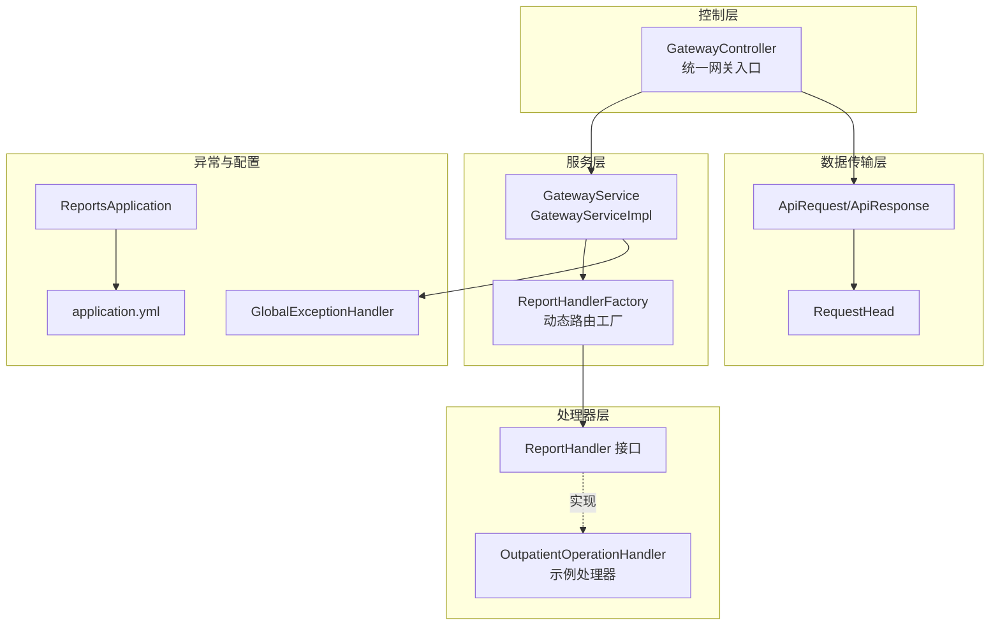
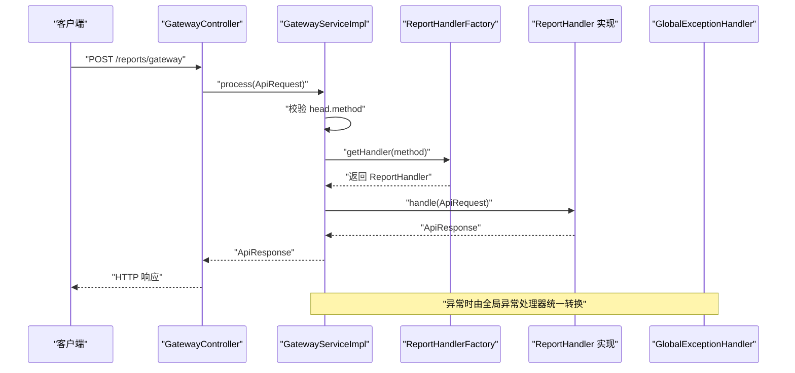
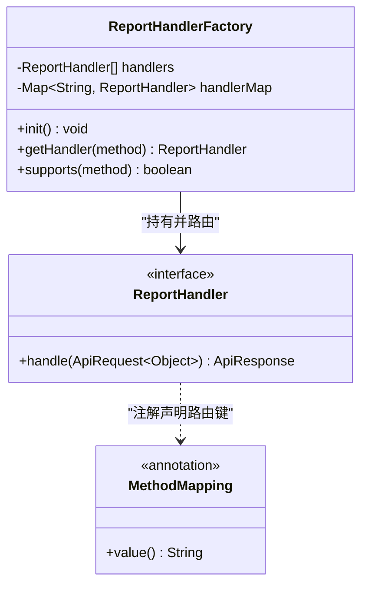
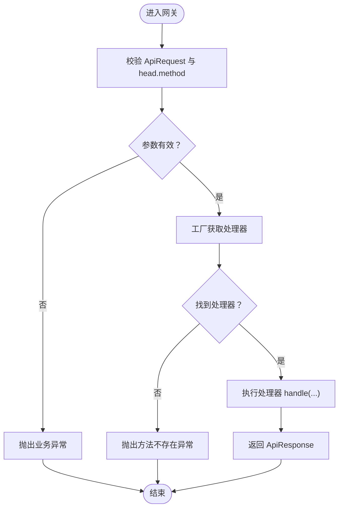
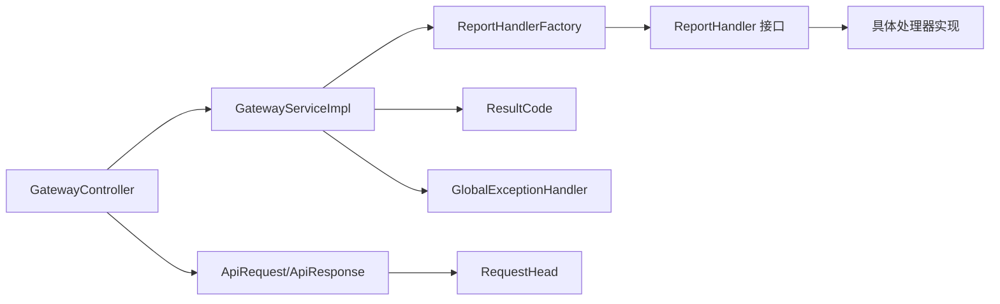

# 处理器工厂架构

<cite>
**本文引用的文件**
- [ReportHandlerFactory.java](file://src/main/java/com/reports/service/handler/ReportHandlerFactory.java)
- [ReportHandler.java](file://src/main/java/com/reports/service/handler/ReportHandler.java)
- [MethodMapping.java](file://src/main/java/com/reports/service/handler/MethodMapping.java)
- [OutpatientOperationHandler.java](file://src/main/java/com/reports/service/handler/impl/OutpatientOperationHandler.java)
- [GatewayController.java](file://src/main/java/com/reports/controller/GatewayController.java)
- [GatewayService.java](file://src/main/java/com/reports/service/GatewayService.java)
- [GatewayServiceImpl.java](file://src/main/java/com/reports/service/impl/GatewayServiceImpl.java)
- [ApiRequest.java](file://src/main/java/com/reports/dto/common/ApiRequest.java)
- [ApiResponse.java](file://src/main/java/com/reports/dto/common/ApiResponse.java)
- [RequestHead.java](file://src/main/java/com/reports/dto/common/RequestHead.java)
- [ResultCode.java](file://src/main/java/com/reports/enums/ResultCode.java)
- [GlobalExceptionHandler.java](file://src/main/java/com/reports/exception/GlobalExceptionHandler.java)
- [ReportsApplication.java](file://src/main/java/com/reports/ReportsApplication.java)
- [application.yml](file://src/main/resources/application.yml)
</cite>

## 目录
1. [引言](#引言)
2. [项目结构](#项目结构)
3. [核心组件](#核心组件)
4. [架构总览](#架构总览)
5. [详细组件分析](#详细组件分析)
6. [依赖关系分析](#依赖关系分析)
7. [性能与可扩展性](#性能与可扩展性)
8. [故障排查指南](#故障排查指南)
9. [结论](#结论)
10. [附录：新增处理器开发流程与最佳实践](#附录新增处理器开发流程与最佳实践)

## 引言
本文件面向报告网关系统的“处理器工厂架构”，系统性阐述工厂模式与策略模式的结合应用，重点解析以下主题：
- ReportHandlerFactory 的动态路由与自动注册机制
- MethodMapping 注解的自动发现与注册流程
- ReportHandler 接口设计原则、泛型参数使用规范
- 处理器生命周期、依赖注入与异常处理策略
- 新增处理器的完整开发流程与最佳实践

## 项目结构
系统采用 Spring Boot 应用，核心模块围绕“统一网关入口 → 网关服务 → 处理器工厂 → 具体处理器”的链路组织，配合统一请求/响应 DTO、全局异常处理与配置项，形成清晰的职责边界。

图示来源
- [GatewayController.java:1-38](file://src/main/java/com/reports/controller/GatewayController.java#L1-L38)
- [GatewayServiceImpl.java:1-51](file://src/main/java/com/reports/service/impl/GatewayServiceImpl.java#L1-L51)
- [ReportHandlerFactory.java:1-74](file://src/main/java/com/reports/service/handler/ReportHandlerFactory.java#L1-L74)
- [ReportHandler.java:1-28](file://src/main/java/com/reports/service/handler/ReportHandler.java#L1-L28)
- [OutpatientOperationHandler.java:1-65](file://src/main/java/com/reports/service/handler/impl/OutpatientOperationHandler.java#L1-L65)
- [ApiRequest.java:1-35](file://src/main/java/com/reports/dto/common/ApiRequest.java#L1-L35)
- [RequestHead.java:1-37](file://src/main/java/com/reports/dto/common/RequestHead.java#L1-L37)
- [GlobalExceptionHandler.java:1-86](file://src/main/java/com/reports/exception/GlobalExceptionHandler.java#L1-L86)
- [ReportsApplication.java:1-19](file://src/main/java/com/reports/ReportsApplication.java#L1-L19)
- [application.yml:1-32](file://src/main/resources/application.yml#L1-L32)

章节来源
- [ReportsApplication.java:1-19](file://src/main/java/com/reports/ReportsApplication.java#L1-L19)
- [application.yml:1-32](file://src/main/resources/application.yml#L1-L32)

## 核心组件
- 统一网关入口：GatewayController 提供对外 HTTP 接口，接收统一请求并委托给网关服务。
- 网关服务：GatewayServiceImpl 校验请求、根据 method 获取处理器并执行。
- 处理器工厂：ReportHandlerFactory 在启动时扫描所有 ReportHandler 实现，读取 MethodMapping 注解完成注册；提供按 method 获取处理器的能力。
- 处理器接口：ReportHandler 定义统一的 handle(ApiRequest<Object>) 签名，请求体泛型化以适配不同报表类型。
- 注解驱动：MethodMapping 用于声明处理器对应的 method 路由键，避免硬编码与重复实现。
- 统一 DTO：ApiRequest/ApiResponse 包装请求头与响应体，RequestHead 携带 method 字段。
- 全局异常处理：GlobalExceptionHandler 将业务异常与系统异常统一转化为 ApiResponse。

章节来源
- [GatewayController.java:1-38](file://src/main/java/com/reports/controller/GatewayController.java#L1-L38)
- [GatewayService.java:1-17](file://src/main/java/com/reports/service/GatewayService.java#L1-L17)
- [GatewayServiceImpl.java:1-51](file://src/main/java/com/reports/service/impl/GatewayServiceImpl.java#L1-L51)
- [ReportHandlerFactory.java:1-74](file://src/main/java/com/reports/service/handler/ReportHandlerFactory.java#L1-L74)
- [ReportHandler.java:1-28](file://src/main/java/com/reports/service/handler/ReportHandler.java#L1-L28)
- [MethodMapping.java:1-29](file://src/main/java/com/reports/service/handler/MethodMapping.java#L1-L29)
- [ApiRequest.java:1-35](file://src/main/java/com/reports/dto/common/ApiRequest.java#L1-L35)
- [ApiResponse.java:1-57](file://src/main/java/com/reports/dto/common/ApiResponse.java#L1-L57)
- [RequestHead.java:1-37](file://src/main/java/com/reports/dto/common/RequestHead.java#L1-L37)
- [GlobalExceptionHandler.java:1-86](file://src/main/java/com/reports/exception/GlobalExceptionHandler.java#L1-L86)

## 架构总览
下图展示从 HTTP 请求到处理器执行的端到端流程，以及工厂的动态注册与路由决策。

图示来源
- [GatewayController.java:28-35](file://src/main/java/com/reports/controller/GatewayController.java#L28-L35)
- [GatewayServiceImpl.java:29-48](file://src/main/java/com/reports/service/impl/GatewayServiceImpl.java#L29-L48)
- [ReportHandlerFactory.java:54-64](file://src/main/java/com/reports/service/handler/ReportHandlerFactory.java#L54-L64)
- [GlobalExceptionHandler.java:23-27](file://src/main/java/com/reports/exception/GlobalExceptionHandler.java#L23-L27)

## 详细组件分析

### ReportHandlerFactory：动态路由与自动注册
- 角色定位：工厂 + 策略容器，负责收集所有 ReportHandler 实现并通过 MethodMapping 注解建立 method → 处理器映射。
- 初始化流程：
  - 构造函数注入 List<ReportHandler<?, ?>> handlers，利用 Spring 容器自动收集所有实现。
  - @PostConstruct 生命周期方法中遍历 handlers，反射读取 MethodMapping 注解，提取 method 键并注册到并发安全的 Map 中。
  - 对空注解值与重复 method 进行校验与告警，保证注册健壮性。
- 路由查询：
  - getHandler(method) 返回对应处理器，若不存在则抛出业务异常（方法不存在）。
  - supports(method) 提供存在性判断，便于上游快速判定。

图示来源
- [ReportHandlerFactory.java:21-74](file://src/main/java/com/reports/service/handler/ReportHandlerFactory.java#L21-L74)
- [ReportHandler.java:19-27](file://src/main/java/com/reports/service/handler/ReportHandler.java#L19-L27)
- [MethodMapping.java:21-28](file://src/main/java/com/reports/service/handler/MethodMapping.java#L21-L28)

章节来源
- [ReportHandlerFactory.java:31-52](file://src/main/java/com/reports/service/handler/ReportHandlerFactory.java#L31-L52)
- [ReportHandlerFactory.java:54-71](file://src/main/java/com/reports/service/handler/ReportHandlerFactory.java#L54-L71)

### MethodMapping 注解：自动注册机制
- 作用：标注在 ReportHandler 实现类上，声明该处理器对应的 method 路由键。
- 读取位置：工厂初始化时通过反射读取注解值作为路由键。
- 设计要点：
  - 注解保留至运行时，确保工厂可在启动阶段完成注册。
  - 若实现类缺少注解或注解值为空，工厂初始化阶段即抛出非法状态异常，避免静默失败。
  - 同一路由键重复注册会触发告警并覆盖，提示潜在冲突。

章节来源
- [MethodMapping.java:7-28](file://src/main/java/com/reports/service/handler/MethodMapping.java#L7-L28)
- [ReportHandlerFactory.java:35-49](file://src/main/java/com/reports/service/handler/ReportHandlerFactory.java#L35-L49)

### ReportHandler 接口：设计原则与实现规范
- 泛型参数：
  - 第一个类型参数 T 表示请求体类型，第二个类型参数 R 表示响应体类型。
  - 通过泛型约束处理器输入输出类型，提升编译期安全性与可维护性。
- 统一签名：
  - handle(ApiRequest<Object>) 使各处理器可接收通用请求体，内部自行转换为强类型 DTO。
  - 返回 ApiResponse<R>，保持统一响应结构与错误码体系。
- 实现建议：
  - 明确区分“请求体转换”与“业务处理”，在 handle 内部完成类型转换与参数校验。
  - 保持幂等与无副作用，必要时引入幂等键与重试策略。
  - 严格遵循 ResultCode 语义，避免自定义错误码。

章节来源
- [ReportHandler.java:6-27](file://src/main/java/com/reports/service/handler/ReportHandler.java#L6-L27)

### 示例处理器：OutpatientOperationHandler
- 注解与装配：
  - 使用 @Component 与 @MethodMapping("reports.outp.outpatient-operation") 标注。
  - 通过构造函数注入所需依赖（如服务类与 ObjectMapper）。
- 处理流程：
  - handle 中先将 ApiRequest<Object> 的 body 转换为强类型请求体。
  - 调用业务服务查询概览与分页表格数据。
  - 组装响应体并返回 ApiResponse.success(...)。
- 依赖注入与日志：
  - 使用 Lombok 日志注解简化日志记录。
  - 通过 Spring 自动装配依赖，降低耦合度。

章节来源
- [OutpatientOperationHandler.java:16-64](file://src/main/java/com/reports/service/handler/impl/OutpatientOperationHandler.java#L16-L64)

### 网关服务与控制器：请求接入与执行
- GatewayController：
  - 提供 /reports/gateway POST 接口，接收 ApiRequest 并调用网关服务。
- GatewayServiceImpl：
  - 校验请求与 method，调用工厂获取处理器并执行。
  - 对缺失参数与未知 method 场景抛出业务异常。
- 统一异常处理：
  - GlobalExceptionHandler 将业务异常转换为 ApiResponse，包含 code/subCode/subMsg 等字段，便于前端统一处理。

图示来源
- [GatewayServiceImpl.java:29-48](file://src/main/java/com/reports/service/impl/GatewayServiceImpl.java#L29-L48)
- [GlobalExceptionHandler.java:23-27](file://src/main/java/com/reports/exception/GlobalExceptionHandler.java#L23-L27)

章节来源
- [GatewayController.java:28-35](file://src/main/java/com/reports/controller/GatewayController.java#L28-L35)
- [GatewayService.java:9-16](file://src/main/java/com/reports/service/GatewayService.java#L9-L16)
- [GatewayServiceImpl.java:29-48](file://src/main/java/com/reports/service/impl/GatewayServiceImpl.java#L29-L48)
- [GlobalExceptionHandler.java:23-83](file://src/main/java/com/reports/exception/GlobalExceptionHandler.java#L23-L83)

## 依赖关系分析
- 组件耦合：
  - GatewayController 仅依赖 GatewayService 接口，低耦合高内聚。
  - GatewayServiceImpl 依赖 ReportHandlerFactory 与 ResultCode，职责单一。
  - ReportHandlerFactory 依赖 ReportHandler 接口与 MethodMapping 注解，通过反射与 Spring 容器实现松耦合。
- 外部依赖：
  - Spring Boot 自动装配、组件扫描与依赖注入。
  - Jackson ObjectMapper 用于请求体的类型转换。
- 循环依赖：
  - 当前结构无循环依赖风险，工厂仅单向依赖处理器接口。

图示来源
- [GatewayController.java:1-38](file://src/main/java/com/reports/controller/GatewayController.java#L1-L38)
- [GatewayServiceImpl.java:1-51](file://src/main/java/com/reports/service/impl/GatewayServiceImpl.java#L1-L51)
- [ReportHandlerFactory.java:1-74](file://src/main/java/com/reports/service/handler/ReportHandlerFactory.java#L1-L74)
- [ReportHandler.java:1-28](file://src/main/java/com/reports/service/handler/ReportHandler.java#L1-L28)
- [ApiRequest.java:1-35](file://src/main/java/com/reports/dto/common/ApiRequest.java#L1-L35)
- [RequestHead.java:1-37](file://src/main/java/com/reports/dto/common/RequestHead.java#L1-L37)
- [ResultCode.java:1-77](file://src/main/java/com/reports/enums/ResultCode.java#L1-L77)
- [GlobalExceptionHandler.java:1-86](file://src/main/java/com/reports/exception/GlobalExceptionHandler.java#L1-L86)

章节来源
- [GatewayServiceImpl.java:22-27](file://src/main/java/com/reports/service/impl/GatewayServiceImpl.java#L22-L27)
- [ReportHandlerFactory.java:23-29](file://src/main/java/com/reports/service/handler/ReportHandlerFactory.java#L23-L29)

## 性能与可扩展性
- 并发安全：工厂内部使用并发安全的 Map 存储路由映射，适合多线程访问场景。
- 初始化成本：工厂在启动阶段一次性扫描与注册，运行时为 O(1) 查找复杂度。
- 扩展性：
  - 新增处理器只需实现 ReportHandler 并添加 @MethodMapping 注解，即可自动被工厂识别与注册。
  - 支持多种数据源模式（mock/jdbc/mybatis-plus），通过配置切换，不影响处理器实现。
- 建议：
  - 为高频方法预留缓存层（如 Redis）以减少重复计算。
  - 对复杂报表可拆分“概览 + 分页明细”两阶段查询，优化首屏性能。

[本节为通用指导，不直接分析具体文件]

## 故障排查指南
- 方法不存在：
  - 现象：请求 method 有效但未注册。
  - 定位：检查处理器是否正确实现 ReportHandler 并添加 @MethodMapping 注解。
  - 参考：工厂在 getHandler 时抛出业务异常，网关服务捕获并交由全局异常处理器返回。
- 注解缺失或为空：
  - 现象：应用启动时报错，提示缺少 @MethodMapping 或其 value 为空。
  - 定位：确认处理器类上的注解与值是否正确。
- 参数异常：
  - 现象：请求体无法转换或参数缺失。
  - 定位：检查 ApiRequest.body 类型转换逻辑与前端传参。
- 全局异常：
  - 现象：业务异常统一转换为 ApiResponse。
  - 定位：查看 GlobalExceptionHandler 的异常分支与 ResultCode 语义。

章节来源
- [ReportHandlerFactory.java:37-44](file://src/main/java/com/reports/service/handler/ReportHandlerFactory.java#L37-L44)
- [GatewayServiceImpl.java:33-35](file://src/main/java/com/reports/service/impl/GatewayServiceImpl.java#L33-L35)
- [GlobalExceptionHandler.java:23-83](file://src/main/java/com/reports/exception/GlobalExceptionHandler.java#L23-L83)
- [ResultCode.java:32-39](file://src/main/java/com/reports/enums/ResultCode.java#L32-L39)

## 结论
本架构以工厂 + 策略为核心，结合注解驱动的自动注册机制，实现了“零样板代码”的处理器扩展能力。通过统一的请求/响应模型与全局异常处理，系统具备良好的一致性、可维护性与可扩展性。开发者只需关注业务实现，即可快速接入新的报表功能。

[本节为总结性内容，不直接分析具体文件]

## 附录：新增处理器开发流程与最佳实践

### 开发流程
1. 创建处理器类
   - 实现 ReportHandler<T, R>，其中 T 为请求 DTO，R 为响应 DTO。
   - 添加 @Component 与 @MethodMapping("your.method.key") 注解。
   - 通过构造函数注入所需依赖。
   - 在 handle(ApiRequest<Object>) 中完成请求体转换与业务处理，返回 ApiResponse.success(...)。
2. 编写 DTO
   - 在 dto.request 与 dto.response 下分别定义请求与响应 DTO。
   - 保持字段命名与前端一致，必要时添加校验注解。
3. 编写服务层（可选）
   - 若业务逻辑较复杂，建议在 service 层封装查询与聚合逻辑。
4. 单元测试（建议）
   - 针对 handle 流程编写单元测试，覆盖正常路径与边界条件。
5. 启动验证
   - 启动应用，观察工厂注册日志。
   - 使用网关接口发送请求，验证路由与响应。

章节来源
- [OutpatientOperationHandler.java:16-64](file://src/main/java/com/reports/service/handler/impl/OutpatientOperationHandler.java#L16-L64)
- [ReportHandler.java:6-27](file://src/main/java/com/reports/service/handler/ReportHandler.java#L6-L27)
- [MethodMapping.java:7-28](file://src/main/java/com/reports/service/handler/MethodMapping.java#L7-L28)

### 最佳实践
- 注解与路由
  - method 键命名采用“域.子域.功能”层级风格，避免冲突。
  - 严禁空字符串或重复的 method 键。
- 类型安全
  - 明确区分 ApiRequest<Object> 与强类型 DTO 的转换时机。
  - 对空请求体进行兜底处理，避免空指针。
- 异常处理
  - 优先抛出业务异常（含 code/subCode/subMsg），交由全局异常处理器统一响应。
  - 对外部依赖异常（如数据源异常）进行分类处理。
- 日志与追踪
  - 使用统一的日志格式与 TraceId，便于问题定位。
- 配置与环境
  - 通过 application.yml 切换数据源模式，确保本地开发与生产一致。

章节来源
- [application.yml:21-23](file://src/main/resources/application.yml#L21-L23)
- [GlobalExceptionHandler.java:23-83](file://src/main/java/com/reports/exception/GlobalExceptionHandler.java#L23-L83)
- [ResultCode.java:32-64](file://src/main/java/com/reports/enums/ResultCode.java#L32-L64)