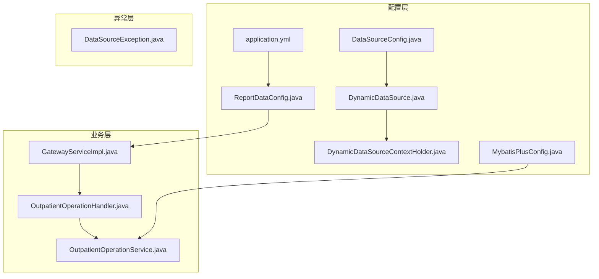
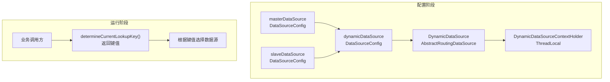
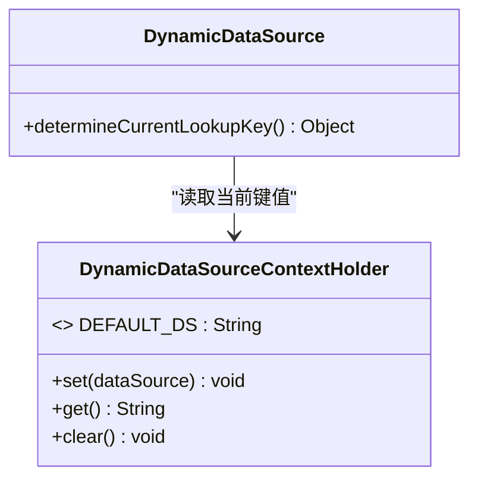
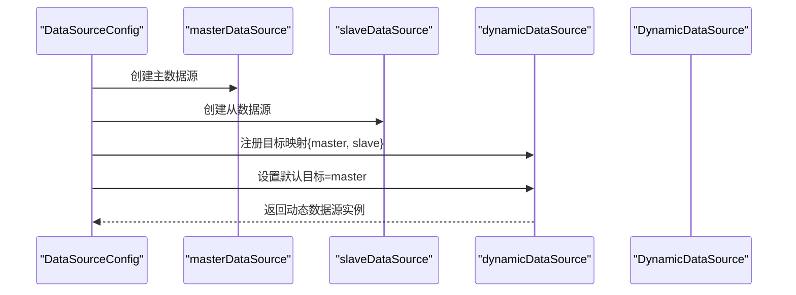
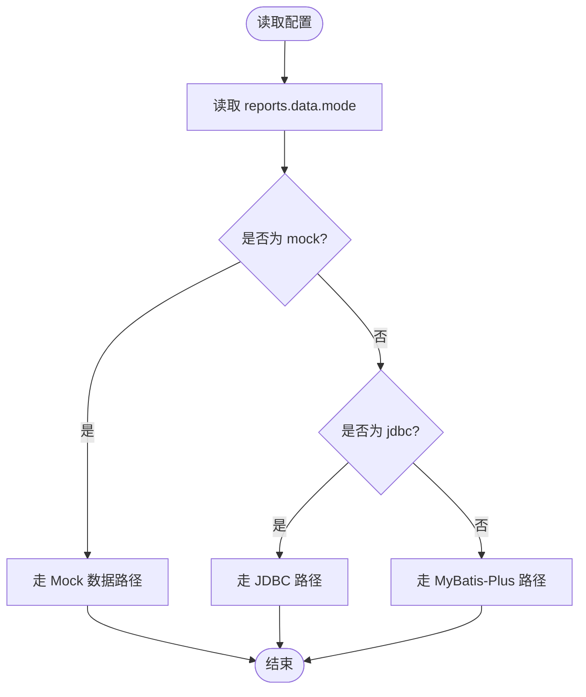
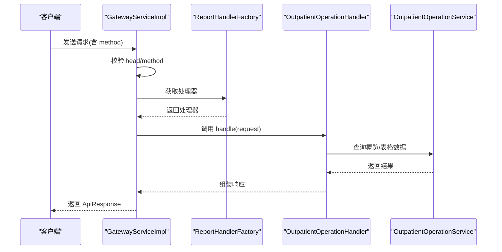
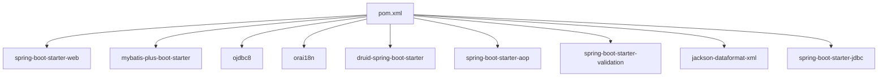

# 数据访问架构

<cite>
**本文引用的文件**
- [DynamicDataSource.java](file://src/main/java/com/reports/config/DynamicDataSource.java)
- [DynamicDataSourceContextHolder.java](file://src/main/java/com/reports/config/DynamicDataSourceContextHolder.java)
- [DataSourceConfig.java](file://src/main/java/com/reports/config/DataSourceConfig.java)
- [ReportDataConfig.java](file://src/main/java/com/reports/config/ReportDataConfig.java)
- [MybatisPlusConfig.java](file://src/main/java/com/reports/config/MybatisPlusConfig.java)
- [application.yml](file://src/main/resources/application.yml)
- [pom.xml](file://pom.xml)
- [GatewayServiceImpl.java](file://src/main/java/com/reports/service/impl/GatewayServiceImpl.java)
- [OutpatientOperationHandler.java](file://src/main/java/com/reports/service/handler/impl/OutpatientOperationHandler.java)
- [OutpatientOperationService.java](file://src/main/java/com/reports/service/OutpatientOperationService.java)
- [DataSourceException.java](file://src/main/java/com/reports/exception/DataSourceException.java)
</cite>

## 目录
1. [引言](#引言)
2. [项目结构](#项目结构)
3. [核心组件](#核心组件)
4. [架构总览](#架构总览)
5. [详细组件分析](#详细组件分析)
6. [依赖分析](#依赖分析)
7. [性能考虑](#性能考虑)
8. [故障排查指南](#故障排查指南)
9. [结论](#结论)
10. [附录](#附录)

## 引言
本文件面向报告网关系统的数据访问架构，系统通过多数据源动态切换与数据访问模式控制，实现灵活的报表查询能力。核心包括：
- 多数据源动态切换：基于 Spring 的 AbstractRoutingDataSource 实现，结合 ThreadLocal 上下文进行数据源路由。
- 数据访问模式控制：通过配置项控制报表查询走 Mock、JDBC 或 MyBatis-Plus 模式。
- 配置与注册：主从数据源的装配、动态数据源的注册以及 MyBatis-Plus 的分页插件配置。

## 项目结构
围绕数据访问的关键模块分布如下：
- 配置层：数据源配置、动态数据源、MyBatis-Plus 配置、报表数据模式配置
- 业务层：网关服务、报表处理器、服务接口
- 异常层：数据源异常定义
- 资源层：应用配置文件

**图表来源**
- [DataSourceConfig.java:1-56](file://src/main/java/com/reports/config/DataSourceConfig.java#L1-L56)
- [DynamicDataSource.java:1-16](file://src/main/java/com/reports/config/DynamicDataSource.java#L1-L16)
- [DynamicDataSourceContextHolder.java:1-38](file://src/main/java/com/reports/config/DynamicDataSourceContextHolder.java#L1-L38)
- [MybatisPlusConfig.java:1-28](file://src/main/java/com/reports/config/MybatisPlusConfig.java#L1-L28)
- [ReportDataConfig.java:1-45](file://src/main/java/com/reports/config/ReportDataConfig.java#L1-L45)
- [application.yml:1-32](file://src/main/resources/application.yml#L1-L32)
- [GatewayServiceImpl.java:1-51](file://src/main/java/com/reports/service/impl/GatewayServiceImpl.java#L1-L51)
- [OutpatientOperationHandler.java:1-65](file://src/main/java/com/reports/service/handler/impl/OutpatientOperationHandler.java#L1-L65)
- [OutpatientOperationService.java:1-24](file://src/main/java/com/reports/service/OutpatientOperationService.java#L1-L24)
- [DataSourceException.java:1-28](file://src/main/java/com/reports/exception/DataSourceException.java#L1-L28)

**章节来源**
- [DataSourceConfig.java:1-56](file://src/main/java/com/reports/config/DataSourceConfig.java#L1-L56)
- [application.yml:1-32](file://src/main/resources/application.yml#L1-L32)

## 核心组件
- 动态数据源路由：通过覆写 determineCurrentLookupKey，从线程上下文中读取当前数据源键值，实现按需路由到主库或从库。
- 数据源上下文：以 ThreadLocal 存储当前线程的数据源标识，默认回退到“master”。
- 数据源配置：装配主从数据源，并将两者注册到动态数据源的目标映射中，设置默认目标为 master。
- 报表数据模式：通过配置项控制查询模式（mock/jdbc/mybatis-plus），并提供便捷判断方法。
- MyBatis-Plus 配置：启用分页插件，扫描 Mapper 包路径，适配 Oracle 数据库方言。

**章节来源**
- [DynamicDataSource.java:1-16](file://src/main/java/com/reports/config/DynamicDataSource.java#L1-L16)
- [DynamicDataSourceContextHolder.java:1-38](file://src/main/java/com/reports/config/DynamicDataSourceContextHolder.java#L1-L38)
- [DataSourceConfig.java:1-56](file://src/main/java/com/reports/config/DataSourceConfig.java#L1-L56)
- [ReportDataConfig.java:1-45](file://src/main/java/com/reports/config/ReportDataConfig.java#L1-L45)
- [MybatisPlusConfig.java:1-28](file://src/main/java/com/reports/config/MybatisPlusConfig.java#L1-L28)

## 架构总览
系统采用“配置驱动 + 动态路由”的数据访问架构：
- 配置阶段：在 DataSourceConfig 中注册 master 和 slave 两个数据源，并注入到 DynamicDataSource 的目标映射；同时将 DynamicDataSource 声明为 @Primary，作为应用默认数据源。
- 运行阶段：通过 DynamicDataSourceContextHolder 在线程内设置数据源键值；当执行数据库操作时，Spring 借助 AbstractRoutingDataSource 读取当前键值，选择对应数据源。
- 访问模式：ReportDataConfig 提供 reports.data.mode 控制项，决定查询走 Mock、JDBC 或 MyBatis-Plus；该配置由 application.yml 默认设置为 mock。

**图表来源**
- [DataSourceConfig.java:1-56](file://src/main/java/com/reports/config/DataSourceConfig.java#L1-L56)
- [DynamicDataSource.java:1-16](file://src/main/java/com/reports/config/DynamicDataSource.java#L1-L16)
- [DynamicDataSourceContextHolder.java:1-38](file://src/main/java/com/reports/config/DynamicDataSourceContextHolder.java#L1-L38)

## 详细组件分析

### 动态数据源与上下文管理
- DynamicDataSource 继承自 AbstractRoutingDataSource，重写 determineCurrentLookupKey，使其返回当前线程上下文中的数据源键值。
- DynamicDataSourceContextHolder 使用 ThreadLocal 存储键值，默认值为“master”，并在清理时移除当前线程的值，避免内存泄漏。
- 典型使用流程：在进入业务逻辑前设置数据源键（如“master”或“slave”），执行数据库操作后清理上下文。

**图表来源**
- [DynamicDataSource.java:1-16](file://src/main/java/com/reports/config/DynamicDataSource.java#L1-L16)
- [DynamicDataSourceContextHolder.java:1-38](file://src/main/java/com/reports/config/DynamicDataSourceContextHolder.java#L1-L38)

**章节来源**
- [DynamicDataSource.java:1-16](file://src/main/java/com/reports/config/DynamicDataSource.java#L1-L16)
- [DynamicDataSourceContextHolder.java:1-38](file://src/main/java/com/reports/config/DynamicDataSourceContextHolder.java#L1-L38)

### 数据源配置与注册
- 主从数据源：分别通过 @Bean 注解注册 masterDataSource 与 slaveDataSource，并绑定 spring.datasource.master 与 spring.datasource.slave 前缀的外部配置。
- 动态数据源：将 master 与 slave 注入到 DynamicDataSource 的目标映射中，并设置默认目标为 master，最终以 @Primary 声明为应用级默认数据源。
- 依赖注入：通过构造函数注入 master 与 slave，确保装配顺序与依赖清晰。

**图表来源**
- [DataSourceConfig.java:1-56](file://src/main/java/com/reports/config/DataSourceConfig.java#L1-L56)

**章节来源**
- [DataSourceConfig.java:1-56](file://src/main/java/com/reports/config/DataSourceConfig.java#L1-L56)

### 报表数据模式配置
- 配置项：reports.data.mode 支持三种模式：mock（默认）、jdbc、mybatis-plus。
- 判断方法：提供 isMock、isJdbc、isMybatisPlus 三个便捷方法，便于在业务逻辑中根据模式分支处理。
- 默认值：application.yml 中将 reports.data.mode 设为 mock，便于开发与联调阶段快速验证。

**图表来源**
- [ReportDataConfig.java:1-45](file://src/main/java/com/reports/config/ReportDataConfig.java#L1-L45)
- [application.yml:1-32](file://src/main/resources/application.yml#L1-L32)

**章节来源**
- [ReportDataConfig.java:1-45](file://src/main/java/com/reports/config/ReportDataConfig.java#L1-L45)
- [application.yml:1-32](file://src/main/resources/application.yml#L1-L32)

### MyBatis-Plus 配置
- 分页插件：注册 MybatisPlusInterceptor 并添加 PaginationInnerInterceptor，针对 Oracle 数据库方言生效。
- Mapper 扫描：通过 @MapperScan 指定包路径，使 Mapper 接口被自动识别并注入。
- 适用场景：当 reports.data.mode 为 mybatis-plus 时，服务层可直接使用 MyBatis-Plus 的实体与 Mapper 进行查询。

**章节来源**
- [MybatisPlusConfig.java:1-28](file://src/main/java/com/reports/config/MybatisPlusConfig.java#L1-L28)

### 业务处理链路与数据访问模式
- 网关服务：GatewayServiceImpl 根据请求 method 查找对应处理器，执行统一的参数校验与异常处理。
- 报表处理器：OutpatientOperationHandler 将通用请求体转换为具体类型，调用服务层查询概览与分页表格数据，组装响应。
- 服务接口：OutpatientOperationService 定义查询契约，实际实现依据数据模式选择不同数据访问方式。

**图表来源**
- [GatewayServiceImpl.java:1-51](file://src/main/java/com/reports/service/impl/GatewayServiceImpl.java#L1-L51)
- [OutpatientOperationHandler.java:1-65](file://src/main/java/com/reports/service/handler/impl/OutpatientOperationHandler.java#L1-L65)
- [OutpatientOperationService.java:1-24](file://src/main/java/com/reports/service/OutpatientOperationService.java#L1-L24)

**章节来源**
- [GatewayServiceImpl.java:1-51](file://src/main/java/com/reports/service/impl/GatewayServiceImpl.java#L1-L51)
- [OutpatientOperationHandler.java:1-65](file://src/main/java/com/reports/service/handler/impl/OutpatientOperationHandler.java#L1-L65)
- [OutpatientOperationService.java:1-24](file://src/main/java/com/reports/service/OutpatientOperationService.java#L1-L24)

## 依赖分析
- 核心依赖：Spring Boot Starter Web、MyBatis-Plus、Oracle JDBC 驱动、Druid 连接池、Spring AOP、Validation、Jackson XML、JDBC Starter。
- 版本与范围：Java 1.8、MyBatis-Plus 版本属性集中管理；Oracle 相关依赖版本固定。

**图表来源**
- [pom.xml:1-110](file://pom.xml#L1-L110)

**章节来源**
- [pom.xml:1-110](file://pom.xml#L1-L110)

## 性能考虑
- 连接池与超时：通过 Druid 连接池配置可调优连接数、空闲回收与 SQL 监控；建议结合压测设定合理的连接上限与超时阈值。
- 读写分离策略：将只读报表查询路由至 slave，写操作路由至 master，降低主库压力；注意事务边界内的数据源一致性。
- 分页与索引：MyBatis-Plus 分页插件对大数据量查询友好；配合合理索引与慢查询日志定位性能瓶颈。
- 线程安全：ThreadLocal 上下文在请求结束后务必清理，避免线程复用导致的数据源污染与内存泄漏。
- 模式切换成本：Mock 模式适合快速验证与本地联调；生产环境建议使用 JDBC 或 MyBatis-Plus，减少额外序列化开销。

## 故障排查指南
- 数据源异常：抛出 DataSourceException，携带统一错误码；检查数据源配置、连接串与凭据。
- 请求参数缺失：GatewayServiceImpl 对 method 校验失败会抛出业务异常；确认请求头与方法名正确。
- 数据源键未设置：若未显式设置键值，将回退到默认“master”，可能导致误走主库；应在进入只读查询前明确设置为“slave”。
- 模式不匹配：当 reports.data.mode 与实际实现不符（例如配置为 jdbc 却未注入 JdbcTemplate），会导致运行时异常；请核对配置与依赖。

**章节来源**
- [DataSourceException.java:1-28](file://src/main/java/com/reports/exception/DataSourceException.java#L1-L28)
- [GatewayServiceImpl.java:1-51](file://src/main/java/com/reports/service/impl/GatewayServiceImpl.java#L1-L51)
- [DynamicDataSourceContextHolder.java:1-38](file://src/main/java/com/reports/config/DynamicDataSourceContextHolder.java#L1-L38)
- [ReportDataConfig.java:1-45](file://src/main/java/com/reports/config/ReportDataConfig.java#L1-L45)

## 结论
本数据访问架构通过“配置 + 动态路由 + 模式控制”的组合，实现了灵活且可扩展的多数据源与多种数据访问模式支持。建议在生产环境中严格遵循数据源上下文的设置与清理规范，结合 Druid 与 MyBatis-Plus 的最佳实践，持续优化性能与稳定性。

## 附录

### 配置示例与使用场景
- 多数据源配置
  - 在配置文件中为 spring.datasource.master 与 spring.datasource.slave 提供连接信息，DataSourceConfig 将自动装配为 master 与 slave 数据源，并注册到 DynamicDataSource。
  - 参考路径：[DataSourceConfig.java:1-56](file://src/main/java/com/reports/config/DataSourceConfig.java#L1-L56)
- 动态数据源切换
  - 在只读查询前设置上下文键值为“slave”，执行完成后清理；默认回退“master”。
  - 参考路径：[DynamicDataSourceContextHolder.java:1-38](file://src/main/java/com/reports/config/DynamicDataSourceContextHolder.java#L1-L38)
- 报表数据模式
  - reports.data.mode 可设为 mock/jdbc/mybatis-plus；默认为 mock。
  - 参考路径：[application.yml:1-32](file://src/main/resources/application.yml#L1-L32)，[ReportDataConfig.java:1-45](file://src/main/java/com/reports/config/ReportDataConfig.java#L1-L45)
- MyBatis-Plus 分页
  - 启用分页插件并扫描 Mapper 包，适用于 mybatis-plus 模式下的查询。
  - 参考路径：[MybatisPlusConfig.java:1-28](file://src/main/java/com/reports/config/MybatisPlusConfig.java#L1-L28)