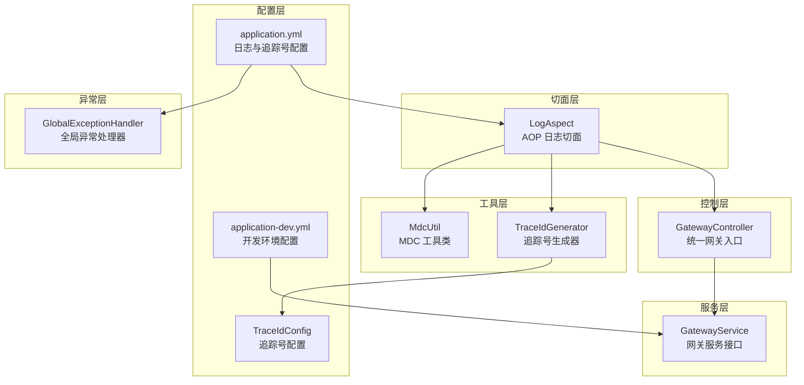
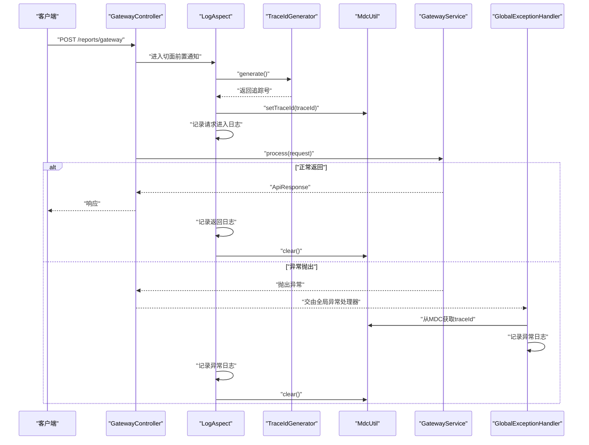
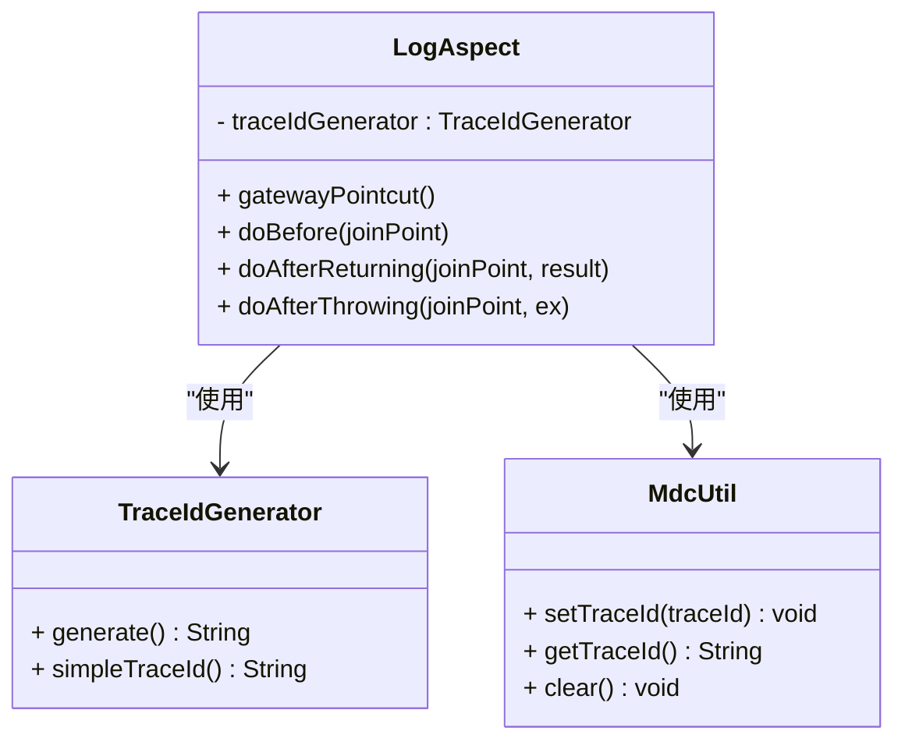
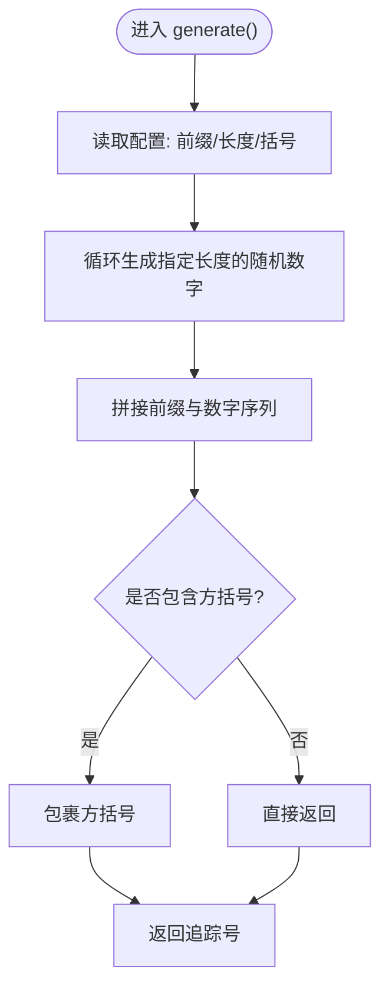
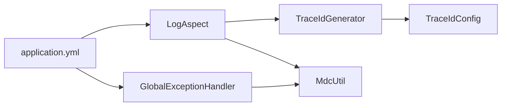

# 监控日志架构

<cite>
**本文引用的文件**
- [LogAspect.java](file://src/main/java/com/reports/aspect/LogAspect.java)
- [TraceIdGenerator.java](file://src/main/java/com/reports/util/TraceIdGenerator.java)
- [TraceIdConfig.java](file://src/main/java/com/reports/config/TraceIdConfig.java)
- [MdcUtil.java](file://src/main/java/com/reports/util/MdcUtil.java)
- [GatewayController.java](file://src/main/java/com/reports/controller/GatewayController.java)
- [GlobalExceptionHandler.java](file://src/main/java/com/reports/exception/GlobalExceptionHandler.java)
- [application.yml](file://src/main/resources/application.yml)
- [application-dev.yml](file://src/main/resources/application-dev.yml)
- [ApiRequest.java](file://src/main/java/com/reports/dto/common/ApiRequest.java)
- [ApiResponse.java](file://src/main/java/com/reports/dto/common/ApiResponse.java)
- [ReportsApplication.java](file://src/main/java/com/reports/ReportsApplication.java)
</cite>

## 目录
1. [简介](#简介)
2. [项目结构](#项目结构)
3. [核心组件](#核心组件)
4. [架构总览](#架构总览)
5. [详细组件分析](#详细组件分析)
6. [依赖关系分析](#依赖关系分析)
7. [性能考量](#性能考量)
8. [故障排查指南](#故障排查指南)
9. [结论](#结论)
10. [附录](#附录)

## 简介
本文件面向报告网关系统的监控日志架构，系统性阐述基于 AOP 的全链路日志记录方案，重点包括：
- AOP 切面编程在日志记录中的应用与拦截机制
- 追踪号生成器与配置规则
- MDC（映射诊断上下文）工作原理与工具方法
- 全链路追踪的实现策略（日志级别设计、MDC 上下文传递、异常处理中的追踪号获取）
- 日志配置最佳实践、性能影响分析与监控指标建议
- 日志格式示例与调试技巧

## 项目结构
报告网关采用 Spring Boot 标准目录结构，关键模块如下：
- 控制层：统一网关入口控制器
- 服务层：网关服务接口与实现
- 切面层：AOP 日志切面
- 工具层：追踪号生成器、MDC 工具类
- 配置层：追踪号配置、日志与数据源配置
- 异常层：全局异常处理器，统一输出带追踪号的日志

图表来源
- [GatewayController.java:1-38](file://src/main/java/com/reports/controller/GatewayController.java#L1-L38)
- [LogAspect.java:1-74](file://src/main/java/com/reports/aspect/LogAspect.java#L1-L74)
- [TraceIdGenerator.java:1-57](file://src/main/java/com/reports/util/TraceIdGenerator.java#L1-L57)
- [TraceIdConfig.java:1-33](file://src/main/java/com/reports/config/TraceIdConfig.java#L1-L33)
- [MdcUtil.java:1-34](file://src/main/java/com/reports/util/MdcUtil.java#L1-L34)
- [application.yml:1-32](file://src/main/resources/application.yml#L1-L32)
- [application-dev.yml:1-45](file://src/main/resources/application-dev.yml#L1-L45)
- [GlobalExceptionHandler.java:1-86](file://src/main/java/com/reports/exception/GlobalExceptionHandler.java#L1-L86)

章节来源
- [ReportsApplication.java:1-19](file://src/main/java/com/reports/ReportsApplication.java#L1-L19)
- [application.yml:1-32](file://src/main/resources/application.yml#L1-L32)

## 核心组件
- AOP 日志切面：对网关控制器方法进行前置、后置与异常拦截，自动注入追踪号并记录请求进入、返回与异常信息。
- 追踪号生成器：根据配置生成带前缀与方括号的追踪号，并提供内部使用的简单追踪号生成方法。
- MDC 工具类：封装 SLF4J MDC 的 put/get/remove 操作，统一键名，便于日志格式化输出。
- 追踪号配置：通过外部配置项控制前缀、数字长度与是否包含方括号。
- 全局异常处理器：在异常场景中从 MDC 获取追踪号，确保异常日志具备可追溯性。

章节来源
- [LogAspect.java:1-74](file://src/main/java/com/reports/aspect/LogAspect.java#L1-L74)
- [TraceIdGenerator.java:1-57](file://src/main/java/com/reports/util/TraceIdGenerator.java#L1-L57)
- [MdcUtil.java:1-34](file://src/main/java/com/reports/util/MdcUtil.java#L1-L34)
- [TraceIdConfig.java:1-33](file://src/main/java/com/reports/config/TraceIdConfig.java#L1-L33)
- [GlobalExceptionHandler.java:1-86](file://src/main/java/com/reports/exception/GlobalExceptionHandler.java#L1-L86)

## 架构总览
全链路追踪的关键流程：
- 请求进入网关控制器
- AOP 切面在前置通知中生成追踪号并写入 MDC
- 控制器调用服务处理请求
- 正常返回或异常抛出时，切面分别记录返回与异常日志，并清理 MDC
- 全局异常处理器在异常时同样从 MDC 获取追踪号，保证异常日志可关联

图表来源
- [LogAspect.java:1-74](file://src/main/java/com/reports/aspect/LogAspect.java#L1-L74)
- [TraceIdGenerator.java:1-57](file://src/main/java/com/reports/util/TraceIdGenerator.java#L1-L57)
- [MdcUtil.java:1-34](file://src/main/java/com/reports/util/MdcUtil.java#L1-L34)
- [GatewayController.java:1-38](file://src/main/java/com/reports/controller/GatewayController.java#L1-L38)
- [GlobalExceptionHandler.java:1-86](file://src/main/java/com/reports/exception/GlobalExceptionHandler.java#L1-L86)

## 详细组件分析

### AOP 日志切面（LogAspect）
- 切点定义：拦截网关控制器的所有方法执行
- 前置通知：生成追踪号，写入 MDC，记录请求进入日志（含类名、方法名与参数）
- 后置通知：从 MDC 读取追踪号，记录返回日志，并清理 MDC
- 异常通知：从 MDC 读取追踪号，记录异常日志，并清理 MDC
- 设计要点：
  - 使用 SLF4J 记录，结合 MDC 输出统一格式
  - 通过 TraceIdGenerator 与 MdcUtil 解耦追踪号生成与上下文管理
  - 在异常场景下仍能正确获取追踪号，避免上下文丢失

图表来源
- [LogAspect.java:1-74](file://src/main/java/com/reports/aspect/LogAspect.java#L1-L74)
- [TraceIdGenerator.java:1-57](file://src/main/java/com/reports/util/TraceIdGenerator.java#L1-L57)
- [MdcUtil.java:1-34](file://src/main/java/com/reports/util/MdcUtil.java#L1-L34)

章节来源
- [LogAspect.java:1-74](file://src/main/java/com/reports/aspect/LogAspect.java#L1-L74)

### 追踪号生成器（TraceIdGenerator）
- 生成策略：
  - 读取配置：前缀、数字长度、是否包含方括号
  - 生成固定长度的随机数字序列
  - 拼接前缀与数字序列，按需包裹方括号
- 内部生成：提供简单追踪号生成方法，用于内部场景（如时间戳+自增计数）
- 配置来源：通过 TraceIdConfig 注入配置值

图表来源
- [TraceIdGenerator.java:1-57](file://src/main/java/com/reports/util/TraceIdGenerator.java#L1-L57)
- [TraceIdConfig.java:1-33](file://src/main/java/com/reports/config/TraceIdConfig.java#L1-L33)

章节来源
- [TraceIdGenerator.java:1-57](file://src/main/java/com/reports/util/TraceIdGenerator.java#L1-L57)
- [TraceIdConfig.java:1-33](file://src/main/java/com/reports/config/TraceIdConfig.java#L1-L33)

### 追踪号配置（TraceIdConfig）
- 配置项：
  - 前缀：默认“YQ”
  - 数字长度：默认 9
  - 包含方括号：默认 true
- 配置绑定：通过 Spring Boot 配置属性绑定到 reports.trace 前缀

章节来源
- [TraceIdConfig.java:1-33](file://src/main/java/com/reports/config/TraceIdConfig.java#L1-L33)
- [application.yml:12-21](file://src/main/resources/application.yml#L12-L21)

### MDC 工具类（MdcUtil）
- 功能：
  - setTraceId：将追踪号放入 MDC
  - getTraceId：从 MDC 获取追踪号
  - clear：移除追踪号键值
- 键名：统一使用 traceId，与日志格式中的 %X{traceId} 对应

章节来源
- [MdcUtil.java:1-34](file://src/main/java/com/reports/util/MdcUtil.java#L1-L34)
- [application.yml](file://src/main/resources/application.yml#L31)

### 全局异常处理器（GlobalExceptionHandler）
- 职责：捕获各类异常，统一返回 ApiResponse，并在日志中携带 MDC 中的追踪号
- 异常类型覆盖：业务异常、参数绑定异常、非法参数异常、数据源异常、通用异常
- 日志级别：业务异常与参数异常使用警告级别，数据源异常与系统异常使用错误级别

章节来源
- [GlobalExceptionHandler.java:1-86](file://src/main/java/com/reports/exception/GlobalExceptionHandler.java#L1-L86)

### 控制器与服务交互
- 控制器：接收统一请求对象，记录 trace 级别的请求到达日志，调用服务处理
- 服务：处理请求并返回统一响应对象

章节来源
- [GatewayController.java:1-38](file://src/main/java/com/reports/controller/GatewayController.java#L1-L38)
- [ApiRequest.java:1-35](file://src/main/java/com/reports/dto/common/ApiRequest.java#L1-L35)
- [ApiResponse.java:1-57](file://src/main/java/com/reports/dto/common/ApiResponse.java#L1-L57)

## 依赖关系分析
- LogAspect 依赖 TraceIdGenerator 与 MdcUtil
- TraceIdGenerator 依赖 TraceIdConfig
- GlobalExceptionHandler 依赖 MDC 以获取追踪号
- 日志格式依赖 application.yml 中的 pattern.console 与 %X{traceId}

图表来源
- [LogAspect.java:1-74](file://src/main/java/com/reports/aspect/LogAspect.java#L1-L74)
- [TraceIdGenerator.java:1-57](file://src/main/java/com/reports/util/TraceIdGenerator.java#L1-L57)
- [TraceIdConfig.java:1-33](file://src/main/java/com/reports/config/TraceIdConfig.java#L1-L33)
- [MdcUtil.java:1-34](file://src/main/java/com/reports/util/MdcUtil.java#L1-L34)
- [GlobalExceptionHandler.java:1-86](file://src/main/java/com/reports/exception/GlobalExceptionHandler.java#L1-L86)
- [application.yml:25-31](file://src/main/resources/application.yml#L25-L31)

章节来源
- [application.yml:25-31](file://src/main/resources/application.yml#L25-L31)

## 性能考量
- AOP 切面开销：前置/后置/异常通知在每个网关方法调用上都会执行，建议在生产环境保持必要的日志级别，避免过度记录
- MDC 操作：put/get/remove 为轻量操作，但频繁的字符串拼接与日志输出仍可能带来 CPU 与内存压力
- 追踪号生成：随机数生成与字符串构建成本较低，但在高并发下仍需关注线程安全与 GC 影响
- 日志级别：建议在生产环境将 com.reports 设置为 INFO 或 WARN，仅在调试阶段提升至 TRACE
- 日志落盘：控制台输出适合开发环境；生产环境建议使用文件或集中式日志收集，避免阻塞 IO

## 故障排查指南
- 追踪号缺失：
  - 检查 LogAspect 是否生效（确认已启用 AOP）
  - 检查 MDC 键名是否为 traceId，日志 pattern 中是否使用 %X{traceId}
  - 确认异常发生时是否仍能访问 MDC（全局异常处理器会从 MDC 获取）
- 日志格式不一致：
  - 核对 application.yml 中 logging.pattern.console 的 %X{traceId} 占位符
  - 确保不同环境下的 pattern 配置一致
- 配置未生效：
  - 检查 reports.trace 前缀的配置项是否正确
  - 确认配置文件加载顺序与 profile 激活情况
- 高并发问题：
  - 观察日志输出频率与线程数，必要时降低日志级别或采样
  - 关注 GC 与堆内存使用情况

章节来源
- [application.yml:25-31](file://src/main/resources/application.yml#L25-L31)
- [LogAspect.java:1-74](file://src/main/java/com/reports/aspect/LogAspect.java#L1-L74)
- [GlobalExceptionHandler.java:1-86](file://src/main/java/com/reports/exception/GlobalExceptionHandler.java#L1-L86)

## 结论
该监控日志架构通过 AOP 切面、追踪号生成器与 MDC 工具类实现了端到端的全链路追踪能力。配合全局异常处理器，确保异常场景也能保留追踪号，便于问题定位与审计。通过合理的日志级别与配置，可在可观测性与性能之间取得平衡。

## 附录

### 日志配置最佳实践
- 日志级别：
  - 开发环境：com.reports 设置为 TRACE，便于调试
  - 生产环境：建议设置为 INFO 或 WARN，减少日志体量
- 日志格式：
  - 使用 %X{traceId} 输出追踪号，便于跨服务串联
  - 建议包含时间戳、线程名、日志级别、Logger 名称与消息
- 配置文件：
  - 将 reports.trace 的 prefix、number-length、include-brackets 作为可运维参数，便于快速调整
  - 不同环境使用不同的 application-*.yml，避免硬编码

章节来源
- [application.yml:25-31](file://src/main/resources/application.yml#L25-L31)
- [TraceIdConfig.java:1-33](file://src/main/java/com/reports/config/TraceIdConfig.java#L1-L33)

### 监控指标设计建议
- 请求总量与成功率：按方法维度统计
- 响应时间分布：区分 P50/P95/P99
- 异常率与异常类型分布：区分业务异常与系统异常
- 追踪号命中率：验证 MDC 是否正确传递
- 日志吞吐量：控制台/文件/远程日志输出速率

### 日志格式示例
- 控制台格式（来自配置）：包含时间戳、线程名、日志级别、Logger 名称、追踪号与消息
- 示例字段说明：
  - 时间戳：yyyy-MM-dd HH:mm:ss.SSS
  - 线程名：线程标识
  - 日志级别：TRACE/INFO/WARN/ERROR
  - Logger 名称：类路径缩写
  - 追踪号：traceId
  - 消息：具体日志内容

章节来源
- [application.yml](file://src/main/resources/application.yml#L31)

### 调试技巧
- 使用 TRACE 级别：在开发环境开启 com.reports TRACE，观察完整调用链
- 快速定位异常：利用全局异常处理器输出的追踪号，跨服务检索日志
- 验证 MDC 传递：在中间件或异步任务中打印 MDC 值，确认上下文是否丢失
- 性能压测：在高并发场景下评估日志输出对延迟的影响，必要时降级日志级别或启用采样