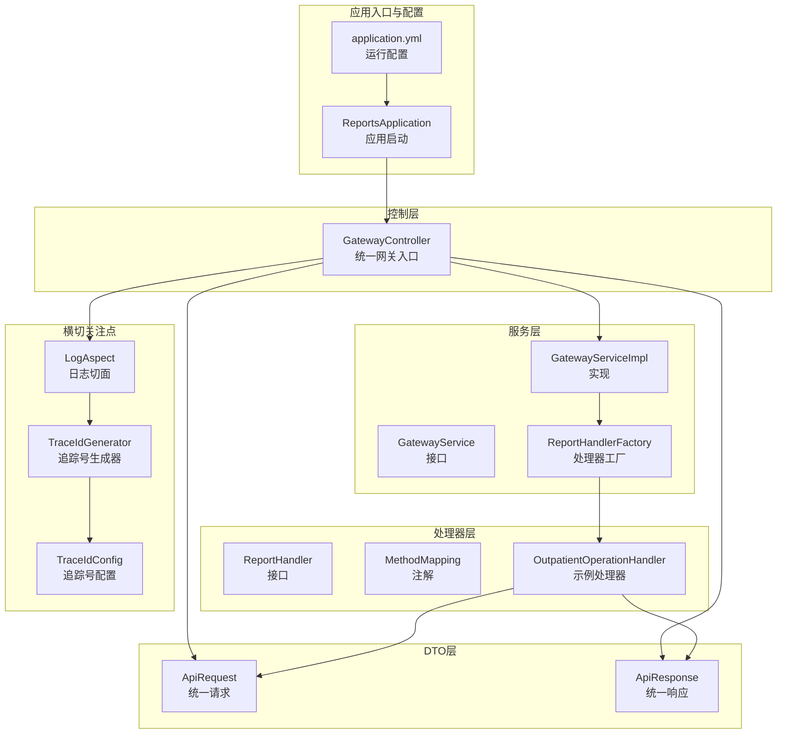
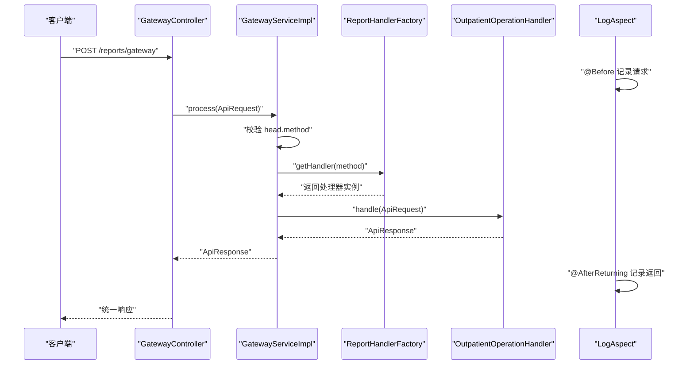
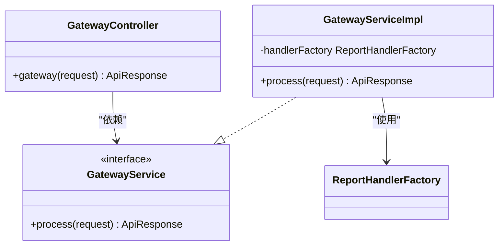
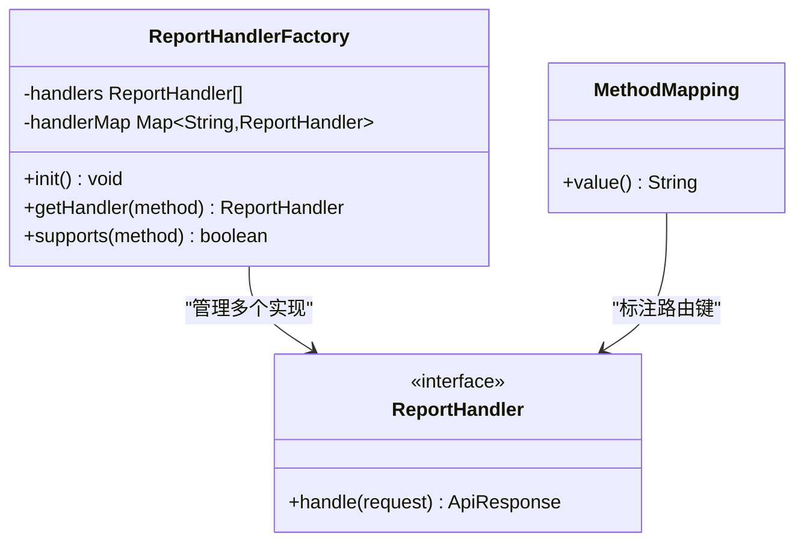
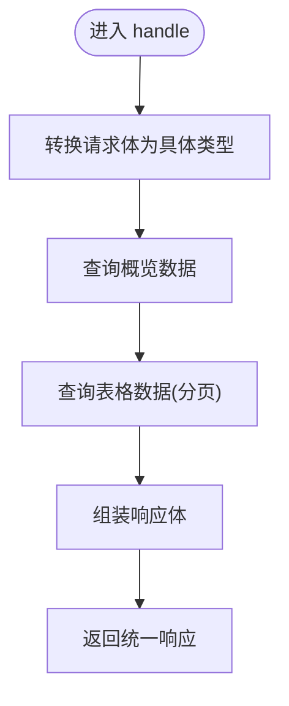
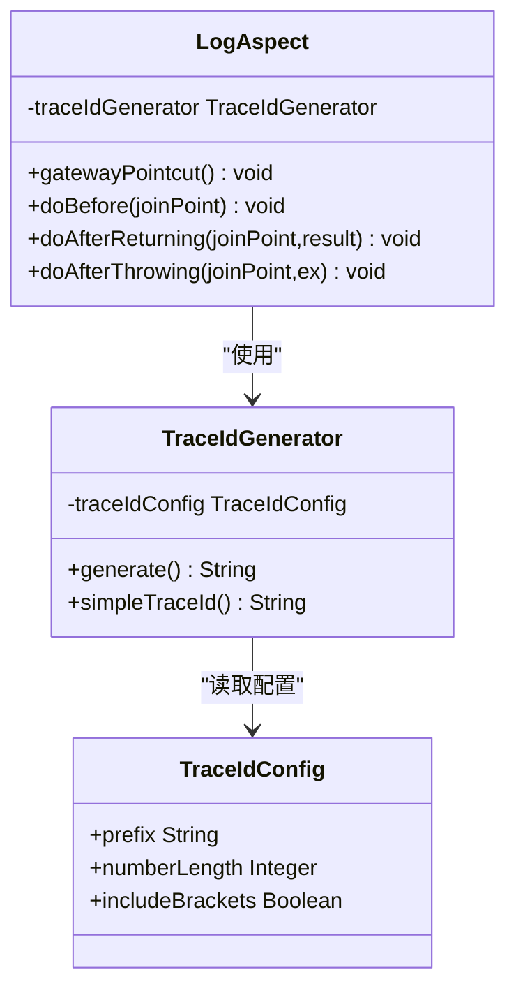
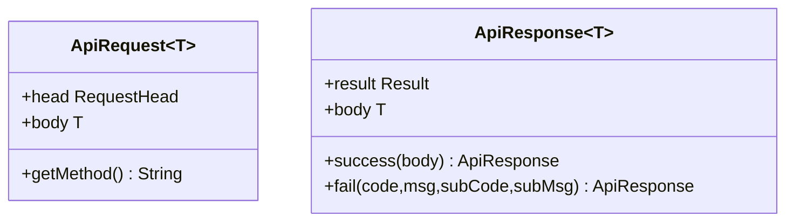
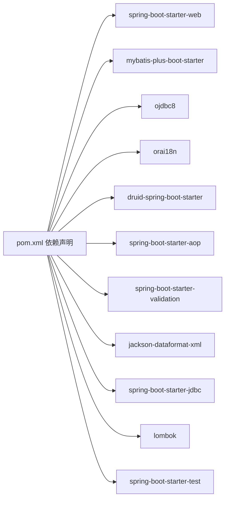

# 系统架构

<cite>
**本文引用的文件**
- [ReportsApplication.java](file://src/main/java/com/reports/ReportsApplication.java)
- [GatewayController.java](file://src/main/java/com/reports/controller/GatewayController.java)
- [GatewayService.java](file://src/main/java/com/reports/service/GatewayService.java)
- [GatewayServiceImpl.java](file://src/main/java/com/reports/service/impl/GatewayServiceImpl.java)
- [ReportHandler.java](file://src/main/java/com/reports/service/handler/ReportHandler.java)
- [ReportHandlerFactory.java](file://src/main/java/com/reports/service/handler/ReportHandlerFactory.java)
- [MethodMapping.java](file://src/main/java/com/reports/service/handler/MethodMapping.java)
- [OutpatientOperationHandler.java](file://src/main/java/com/reports/service/handler/impl/OutpatientOperationHandler.java)
- [ApiRequest.java](file://src/main/java/com/reports/dto/common/ApiRequest.java)
- [ApiResponse.java](file://src/main/java/com/reports/dto/common/ApiResponse.java)
- [LogAspect.java](file://src/main/java/com/reports/aspect/LogAspect.java)
- [TraceIdConfig.java](file://src/main/java/com/reports/config/TraceIdConfig.java)
- [TraceIdGenerator.java](file://src/main/java/com/reports/util/TraceIdGenerator.java)
- [application.yml](file://src/main/resources/application.yml)
- [pom.xml](file://pom.xml)
</cite>

## 目录
1. [引言](#引言)
2. [项目结构](#项目结构)
3. [核心组件](#核心组件)
4. [架构总览](#架构总览)
5. [详细组件分析](#详细组件分析)
6. [依赖分析](#依赖分析)
7. [性能考虑](#性能考虑)
8. [故障排查指南](#故障排查指南)
9. [结论](#结论)
10. [附录](#附录)

## 引言
本架构文档面向“报告网关系统”，聚焦于统一入口、动态路由与可插拔处理器的设计模式落地，以及围绕链路追踪、日志切面、数据源配置等横切能力的实现。系统采用 Spring Boot 作为基础框架，通过工厂模式与策略模式结合注解驱动的方式，实现按 method 动态分发到不同报表处理器，具备良好的扩展性与可维护性。

## 项目结构
系统采用基于功能域的分层组织方式，主要模块包括：
- 应用入口与配置：应用启动类、全局配置与环境变量
- 控制层：统一网关入口控制器
- 服务层：网关服务与处理器工厂
- 处理器层：按报表维度实现的具体处理器
- DTO 层：统一请求/响应封装
- 横切关注点：日志切面、链路追踪工具与配置
- 前端示例：Web 页面与 JS 示例（用于演示调用）

图表来源
- [ReportsApplication.java:11-16](file://src/main/java/com/reports/ReportsApplication.java#L11-L16)
- [application.yml:1-32](file://src/main/resources/application.yml#L1-L32)
- [GatewayController.java:18-35](file://src/main/java/com/reports/controller/GatewayController.java#L18-L35)
- [GatewayServiceImpl.java:20-48](file://src/main/java/com/reports/service/impl/GatewayServiceImpl.java#L20-L48)
- [ReportHandlerFactory.java:21-52](file://src/main/java/com/reports/service/handler/ReportHandlerFactory.java#L21-L52)
- [ReportHandler.java:19-27](file://src/main/java/com/reports/service/handler/ReportHandler.java#L19-L27)
- [MethodMapping.java:21-28](file://src/main/java/com/reports/service/handler/MethodMapping.java#L21-L28)
- [OutpatientOperationHandler.java:22-62](file://src/main/java/com/reports/service/handler/impl/OutpatientOperationHandler.java#L22-L62)
- [ApiRequest.java:13-34](file://src/main/java/com/reports/dto/common/ApiRequest.java#L13-L34)
- [ApiResponse.java:13-56](file://src/main/java/com/reports/dto/common/ApiResponse.java#L13-L56)
- [LogAspect.java:23-73](file://src/main/java/com/reports/aspect/LogAspect.java#L23-L73)
- [TraceIdConfig.java:15-32](file://src/main/java/com/reports/config/TraceIdConfig.java#L15-L32)
- [TraceIdGenerator.java:14-56](file://src/main/java/com/reports/util/TraceIdGenerator.java#L14-L56)

章节来源
- [ReportsApplication.java:11-16](file://src/main/java/com/reports/ReportsApplication.java#L11-L16)
- [application.yml:1-32](file://src/main/resources/application.yml#L1-L32)

## 核心组件
- 应用入口：负责启动 Spring Boot 应用，加载配置与组件。
- 统一网关控制器：接收外部请求，转发至网关服务。
- 网关服务：校验请求、解析 method，并委派给处理器工厂获取具体处理器执行。
- 处理器工厂：扫描并注册所有 ReportHandler 实现，基于 MethodMapping 注解建立 method 到处理器的映射。
- 报表处理器：实现具体业务逻辑，负责请求参数转换、调用领域服务、组装统一响应。
- 统一 DTO：ApiRequest/ApiResponse 提供跨报表一致的请求/响应结构。
- 日志与追踪：LogAspect 以 AOP 方式织入链路追踪，TraceIdGenerator 与 TraceIdConfig 提供追踪号生成与配置。

章节来源
- [GatewayController.java:18-35](file://src/main/java/com/reports/controller/GatewayController.java#L18-L35)
- [GatewayService.java:9-16](file://src/main/java/com/reports/service/GatewayService.java#L9-L16)
- [GatewayServiceImpl.java:20-48](file://src/main/java/com/reports/service/impl/GatewayServiceImpl.java#L20-L48)
- [ReportHandlerFactory.java:21-73](file://src/main/java/com/reports/service/handler/ReportHandlerFactory.java#L21-L73)
- [ReportHandler.java:19-27](file://src/main/java/com/reports/service/handler/ReportHandler.java#L19-L27)
- [MethodMapping.java:21-28](file://src/main/java/com/reports/service/handler/MethodMapping.java#L21-L28)
- [OutpatientOperationHandler.java:22-62](file://src/main/java/com/reports/service/handler/impl/OutpatientOperationHandler.java#L22-L62)
- [ApiRequest.java:13-34](file://src/main/java/com/reports/dto/common/ApiRequest.java#L13-L34)
- [ApiResponse.java:13-56](file://src/main/java/com/reports/dto/common/ApiResponse.java#L13-L56)
- [LogAspect.java:23-73](file://src/main/java/com/reports/aspect/LogAspect.java#L23-L73)
- [TraceIdConfig.java:15-32](file://src/main/java/com/reports/config/TraceIdConfig.java#L15-L32)
- [TraceIdGenerator.java:14-56](file://src/main/java/com/reports/util/TraceIdGenerator.java#L14-L56)

## 架构总览
系统采用“请求统一入口 + 工厂 + 策略”的分发架构。请求经由 GatewayController 进入，GatewayServiceImpl 校验 method 并通过 ReportHandlerFactory 查找对应处理器，处理器完成业务处理后返回统一响应。LogAspect 在控制器层面织入 AOP，实现链路追踪与日志埋点。

图表来源
- [GatewayController.java:31-35](file://src/main/java/com/reports/controller/GatewayController.java#L31-L35)
- [GatewayServiceImpl.java:31-47](file://src/main/java/com/reports/service/impl/GatewayServiceImpl.java#L31-L47)
- [ReportHandlerFactory.java:58-64](file://src/main/java/com/reports/service/handler/ReportHandlerFactory.java#L58-L64)
- [OutpatientOperationHandler.java:34-62](file://src/main/java/com/reports/service/handler/impl/OutpatientOperationHandler.java#L34-L62)
- [LogAspect.java:42-71](file://src/main/java/com/reports/aspect/LogAspect.java#L42-L71)

## 详细组件分析

### 组件一：统一网关入口与服务
- GatewayController：定义统一入口路径，接收 ApiRequest 并调用 GatewayService。
- GatewayService/GatewayServiceImpl：集中校验请求合法性，提取 method，委派工厂获取处理器并执行，最终返回 ApiResponse。

图表来源
- [GatewayController.java:18-35](file://src/main/java/com/reports/controller/GatewayController.java#L18-L35)
- [GatewayService.java:9-16](file://src/main/java/com/reports/service/GatewayService.java#L9-L16)
- [GatewayServiceImpl.java:20-48](file://src/main/java/com/reports/service/impl/GatewayServiceImpl.java#L20-L48)

章节来源
- [GatewayController.java:18-35](file://src/main/java/com/reports/controller/GatewayController.java#L18-L35)
- [GatewayService.java:9-16](file://src/main/java/com/reports/service/GatewayService.java#L9-L16)
- [GatewayServiceImpl.java:20-48](file://src/main/java/com/reports/service/impl/GatewayServiceImpl.java#L20-L48)

### 组件二：处理器工厂与策略分发
- ReportHandlerFactory：在容器初始化阶段扫描所有 ReportHandler 实现，读取 MethodMapping 注解值，构建 method 到处理器的并发安全映射；提供 supports 与 getHandler 方法。
- MethodMapping：标注在处理器实现类上，声明该处理器对应的 method 值。
- ReportHandler：处理器接口，定义 handle(ApiRequest) 返回统一响应。

图表来源
- [ReportHandlerFactory.java:21-73](file://src/main/java/com/reports/service/handler/ReportHandlerFactory.java#L21-L73)
- [MethodMapping.java:21-28](file://src/main/java/com/reports/service/handler/MethodMapping.java#L21-L28)
- [ReportHandler.java:19-27](file://src/main/java/com/reports/service/handler/ReportHandler.java#L19-L27)

章节来源
- [ReportHandlerFactory.java:21-73](file://src/main/java/com/reports/service/handler/ReportHandlerFactory.java#L21-L73)
- [MethodMapping.java:21-28](file://src/main/java/com/reports/service/handler/MethodMapping.java#L21-L28)
- [ReportHandler.java:19-27](file://src/main/java/com/reports/service/handler/ReportHandler.java#L19-L27)

### 组件三：示例处理器（门诊运行数据统计）
- OutpatientOperationHandler：实现 MethodMapping("reports.outp.outpatient-operation")，在 handle 中将通用 ApiRequest.body 转换为具体请求类型，调用领域服务查询概览与表格数据，组装统一响应。

图表来源
- [OutpatientOperationHandler.java:34-62](file://src/main/java/com/reports/service/handler/impl/OutpatientOperationHandler.java#L34-L62)

章节来源
- [OutpatientOperationHandler.java:22-62](file://src/main/java/com/reports/service/handler/impl/OutpatientOperationHandler.java#L22-L62)

### 组件四：日志切面与链路追踪
- LogAspect：以 AOP 切面方式织入 GatewayController 的方法，在前置通知生成并注入 TraceId，在后置通知与异常通知分别记录返回与异常信息，并清理上下文。
- TraceIdGenerator：根据 TraceIdConfig 生成符合规范的追踪号字符串。
- TraceIdConfig：从 application.yml 中读取追踪号前缀、长度与格式化选项。

图表来源
- [LogAspect.java:23-73](file://src/main/java/com/reports/aspect/LogAspect.java#L23-L73)
- [TraceIdGenerator.java:14-56](file://src/main/java/com/reports/util/TraceIdGenerator.java#L14-L56)
- [TraceIdConfig.java:15-32](file://src/main/java/com/reports/config/TraceIdConfig.java#L15-L32)

章节来源
- [LogAspect.java:23-73](file://src/main/java/com/reports/aspect/LogAspect.java#L23-L73)
- [TraceIdGenerator.java:14-56](file://src/main/java/com/reports/util/TraceIdGenerator.java#L14-L56)
- [TraceIdConfig.java:15-32](file://src/main/java/com/reports/config/TraceIdConfig.java#L15-L32)

### 组件五：统一请求/响应模型
- ApiRequest：封装 head 与 body，并提供便捷的 getMethod。
- ApiResponse：封装 result 与 body，并提供 success/fail 工厂方法。

图表来源
- [ApiRequest.java:13-34](file://src/main/java/com/reports/dto/common/ApiRequest.java#L13-L34)
- [ApiResponse.java:13-56](file://src/main/java/com/reports/dto/common/ApiResponse.java#L13-L56)

章节来源
- [ApiRequest.java:13-34](file://src/main/java/com/reports/dto/common/ApiRequest.java#L13-L34)
- [ApiResponse.java:13-56](file://src/main/java/com/reports/dto/common/ApiResponse.java#L13-L56)

## 依赖分析
系统依赖以 Maven 管理，核心依赖包括：
- Spring Boot Starter Web：提供 Web 容器与 MVC 能力
- MyBatis-Plus：持久层增强工具
- Oracle JDBC 与相关本地化包：数据库访问
- Druid：连接池与监控
- Spring AOP：实现日志切面
- Validation/Jackson XML：参数校验与 XML 支持
- Lombok：简化 POJO
- 测试 Starter：单元测试

图表来源
- [pom.xml:26-97](file://pom.xml#L26-L97)

章节来源
- [pom.xml:19-24](file://pom.xml#L19-L24)
- [pom.xml:26-97](file://pom.xml#L26-L97)

## 性能考虑
- 处理器注册：工厂在容器启动时一次性扫描并缓存映射，运行时查找为 O(1)，并发安全使用 ConcurrentHashMap。
- 请求转换：处理器内部对通用 body 进行类型转换，建议在上游确保请求体结构稳定，避免重复转换开销。
- 日志与追踪：AOP 切面在控制器入口/出口/异常处记录，注意在高并发场景下控制日志级别与字段输出，避免 I/O 压力。
- 数据访问：当前配置支持 mock 模式，生产环境建议切换为真实数据源并启用连接池与慢查询监控。

## 故障排查指南
- 请求校验失败：当 ApiRequest 或 head.method 缺失时，网关服务抛出业务异常，检查请求报文与头部字段。
- method 未找到：若 ReportHandlerFactory 中未注册对应 method，将抛出业务异常；确认处理器类是否正确标注 MethodMapping 且值非空。
- 处理器未生效：检查处理器是否被 Spring 扫描到，确保实现类标注为组件并位于可扫描包路径内。
- 链路追踪：若日志中缺少 TraceId，检查 LogAspect 是否生效、MDC 设置是否正确，以及 TraceIdConfig 的配置项是否合理。
- 配置问题：application.yml 中 server.port、reports.trace、reports.data 等配置项需与部署环境匹配。

章节来源
- [GatewayServiceImpl.java:32-44](file://src/main/java/com/reports/service/impl/GatewayServiceImpl.java#L32-L44)
- [ReportHandlerFactory.java:32-51](file://src/main/java/com/reports/service/handler/ReportHandlerFactory.java#L32-L51)
- [LogAspect.java:42-71](file://src/main/java/com/reports/aspect/LogAspect.java#L42-L71)
- [application.yml:1-32](file://src/main/resources/application.yml#L1-L32)

## 结论
本系统通过“统一网关 + 工厂 + 策略 + 注解”的组合，实现了清晰的职责分离与良好的扩展性。配合 AOP 切面与链路追踪，满足可观测性与可维护性的需求。建议在生产环境中完善数据源配置、接入监控与告警，并持续以注解驱动的方式新增报表处理器，保持统一的请求/响应契约与日志规范。

## 附录
- 系统边界
  - 外部边界：HTTP 客户端通过统一入口 /reports/gateway 发起请求
  - 内部边界：网关服务、处理器工厂与各报表处理器
- 部署拓扑
  - 单机部署：Spring Boot 应用直接启动
  - 扩展部署：多实例横向扩展，结合负载均衡与共享配置中心
- 基础设施要求
  - Java 版本：1.8（与 Spring Boot 2.7.x 兼容）
  - 数据库：Oracle（ojdbc8），可替换为其他数据源
  - 连接池：Druid（含监控）
  - 日志：控制台输出格式包含 TraceId，便于链路追踪
- 第三方依赖与版本兼容性
  - Spring Boot：2.7.18
  - MyBatis-Plus：3.5.7
  - Oracle JDBC：21.8.0.0
  - Druid：1.2.18
  - Lombok：1.18.36
- 设计模式要点
  - 工厂模式：ReportHandlerFactory 负责处理器注册与获取
  - 策略模式：不同报表处理器实现同一接口，按 method 分发
  - AOP 切面：LogAspect 对控制器方法进行横切增强
  - 注解驱动：MethodMapping 简化路由键声明，降低样板代码