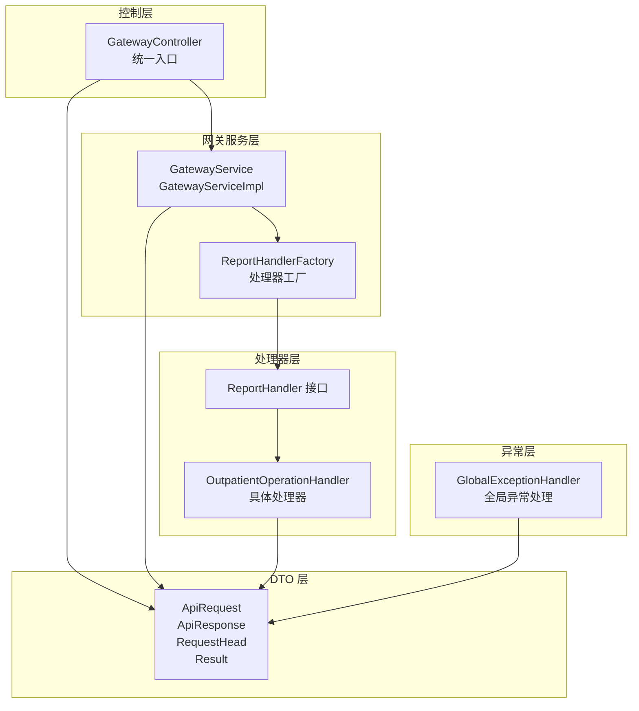
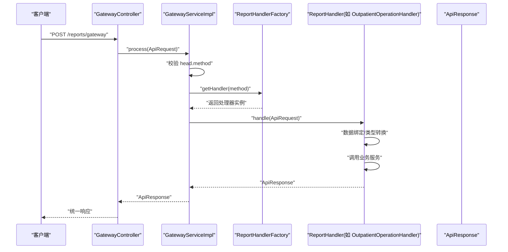
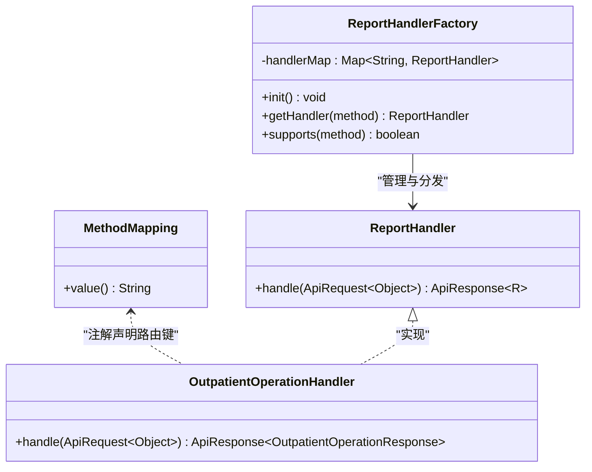
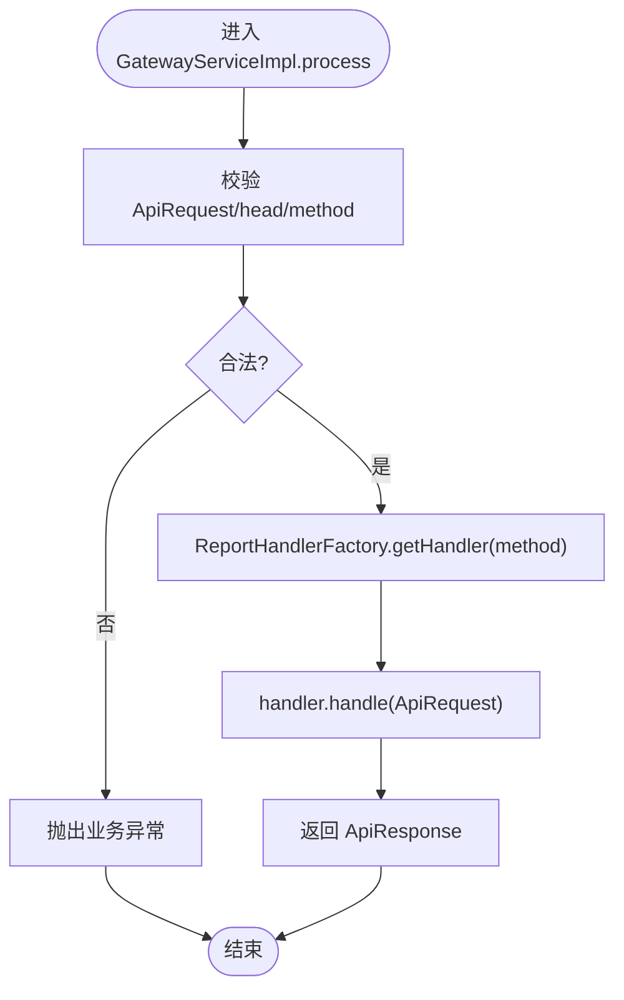
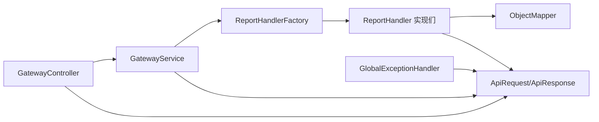

# 网关层架构

<cite>
**本文引用的文件**
- [GatewayController.java](file://src/main/java/com/reports/controller/GatewayController.java)
- [GatewayService.java](file://src/main/java/com/reports/service/GatewayService.java)
- [GatewayServiceImpl.java](file://src/main/java/com/reports/service/impl/GatewayServiceImpl.java)
- [ReportHandler.java](file://src/main/java/com/reports/service/handler/ReportHandler.java)
- [ReportHandlerFactory.java](file://src/main/java/com/reports/service/handler/ReportHandlerFactory.java)
- [MethodMapping.java](file://src/main/java/com/reports/service/handler/MethodMapping.java)
- [ApiRequest.java](file://src/main/java/com/reports/dto/common/ApiRequest.java)
- [ApiResponse.java](file://src/main/java/com/reports/dto/common/ApiResponse.java)
- [RequestHead.java](file://src/main/java/com/reports/dto/common/RequestHead.java)
- [Result.java](file://src/main/java/com/reports/dto/common/Result.java)
- [ResultCode.java](file://src/main/java/com/reports/enums/ResultCode.java)
- [OutpatientOperationHandler.java](file://src/main/java/com/reports/service/handler/impl/OutpatientOperationHandler.java)
- [OutpatientOperationRequest.java](file://src/main/java/com/reports/dto/request/OutpatientOperationRequest.java)
- [OutpatientOperationResponse.java](file://src/main/java/com/reports/dto/response/OutpatientOperationResponse.java)
- [GlobalExceptionHandler.java](file://src/main/java/com/reports/exception/GlobalExceptionHandler.java)
</cite>

## 目录
1. [引言](#引言)
2. [项目结构](#项目结构)
3. [核心组件](#核心组件)
4. [架构总览](#架构总览)
5. [详细组件分析](#详细组件分析)
6. [依赖关系分析](#依赖关系分析)
7. [性能考虑](#性能考虑)
8. [故障排查指南](#故障排查指南)
9. [结论](#结论)
10. [附录](#附录)

## 引言
本文件面向报告网关系统的“网关层”，系统性阐述统一入口设计、请求路由机制与参数验证逻辑；详解 GatewayController 的实现原理，包括 RESTful API 设计、请求报文格式规范、响应格式标准化；解释 ApiRequest/ApiResponse 统一包装的设计理念与 RequestHead 头部信息的作用；梳理请求参数验证、数据绑定与类型转换机制；给出扩展新网关接口的实践步骤与最佳实践，并提供性能优化建议。

## 项目结构
网关层位于后端服务的控制层与业务层之间，采用“统一入口 + 工厂路由 + 处理器实现”的分层设计。核心目录与职责如下：
- 控制层：统一入口控制器负责接收请求、记录日志并委派给网关服务。
- 网关服务层：负责校验请求合法性、根据 method 路由到具体处理器并返回结果。
- 处理器层：按接口维度实现 ReportHandler，完成请求体解析、业务调用与响应封装。
- DTO 层：统一请求/响应包装、请求头、通用结果模型等。
- 异常层：全局异常处理，将异常映射为标准响应。

图表来源
- [GatewayController.java:1-38](file://src/main/java/com/reports/controller/GatewayController.java#L1-L38)
- [GatewayServiceImpl.java:1-51](file://src/main/java/com/reports/service/impl/GatewayServiceImpl.java#L1-L51)
- [ReportHandlerFactory.java:1-74](file://src/main/java/com/reports/service/handler/ReportHandlerFactory.java#L1-L74)
- [ReportHandler.java:1-28](file://src/main/java/com/reports/service/handler/ReportHandler.java#L1-L28)
- [OutpatientOperationHandler.java:1-65](file://src/main/java/com/reports/service/handler/impl/OutpatientOperationHandler.java#L1-L65)
- [ApiRequest.java:1-35](file://src/main/java/com/reports/dto/common/ApiRequest.java#L1-L35)
- [ApiResponse.java:1-57](file://src/main/java/com/reports/dto/common/ApiResponse.java#L1-L57)
- [RequestHead.java:1-37](file://src/main/java/com/reports/dto/common/RequestHead.java#L1-L37)
- [Result.java:1-78](file://src/main/java/com/reports/dto/common/Result.java#L1-L78)
- [GlobalExceptionHandler.java:1-86](file://src/main/java/com/reports/exception/GlobalExceptionHandler.java#L1-L86)

章节来源
- [GatewayController.java:1-38](file://src/main/java/com/reports/controller/GatewayController.java#L1-L38)
- [GatewayServiceImpl.java:1-51](file://src/main/java/com/reports/service/impl/GatewayServiceImpl.java#L1-L51)
- [ReportHandlerFactory.java:1-74](file://src/main/java/com/reports/service/handler/ReportHandlerFactory.java#L1-L74)

## 核心组件
- 统一入口控制器：提供 RESTful 接口 /reports/gateway，接收统一请求报文，直接委派至网关服务。
- 网关服务实现：校验请求合法性（head.method 必填），通过工厂根据 method 获取处理器并执行。
- 处理器接口与工厂：定义统一处理契约，基于注解自动注册路由，提供按 method 分发能力。
- 统一报文模型：ApiRequest/ApiResponse/RequestHead/Result 提供一致的请求/响应结构与状态码体系。
- 全局异常处理：将业务异常、参数绑定异常、数据源异常与系统异常统一映射为标准响应。

章节来源
- [GatewayController.java:1-38](file://src/main/java/com/reports/controller/GatewayController.java#L1-L38)
- [GatewayService.java:1-17](file://src/main/java/com/reports/service/GatewayService.java#L1-L17)
- [GatewayServiceImpl.java:1-51](file://src/main/java/com/reports/service/impl/GatewayServiceImpl.java#L1-L51)
- [ReportHandler.java:1-28](file://src/main/java/com/reports/service/handler/ReportHandler.java#L1-L28)
- [ReportHandlerFactory.java:1-74](file://src/main/java/com/reports/service/handler/ReportHandlerFactory.java#L1-L74)
- [ApiRequest.java:1-35](file://src/main/java/com/reports/dto/common/ApiRequest.java#L1-L35)
- [ApiResponse.java:1-57](file://src/main/java/com/reports/dto/common/ApiResponse.java#L1-L57)
- [RequestHead.java:1-37](file://src/main/java/com/reports/dto/common/RequestHead.java#L1-L37)
- [Result.java:1-78](file://src/main/java/com/reports/dto/common/Result.java#L1-L78)
- [GlobalExceptionHandler.java:1-86](file://src/main/java/com/reports/exception/GlobalExceptionHandler.java#L1-L86)

## 架构总览
下图展示从客户端到业务处理器的完整链路，包括统一入口、路由分发、处理器执行与统一响应。

图表来源
- [GatewayController.java:28-35](file://src/main/java/com/reports/controller/GatewayController.java#L28-L35)
- [GatewayServiceImpl.java:29-48](file://src/main/java/com/reports/service/impl/GatewayServiceImpl.java#L29-L48)
- [ReportHandlerFactory.java:54-64](file://src/main/java/com/reports/service/handler/ReportHandlerFactory.java#L54-L64)
- [OutpatientOperationHandler.java:33-62](file://src/main/java/com/reports/service/handler/impl/OutpatientOperationHandler.java#L33-L62)
- [ApiResponse.java:35-54](file://src/main/java/com/reports/dto/common/ApiResponse.java#L35-L54)

## 详细组件分析

### 统一入口与 RESTful 设计
- 控制器路径：/reports/gateway，使用 POST 方法接收统一请求。
- 请求体：ApiRequest<Object>，泛型 body 支持不同接口的请求体类型。
- 返回体：ApiResponse<?>，统一承载 Result 与业务响应体。
- 日志：开启 trace 级别日志记录请求内容，便于问题定位。

章节来源
- [GatewayController.java:13-35](file://src/main/java/com/reports/controller/GatewayController.java#L13-L35)

### 请求报文格式规范
- ApiRequest 结构
  - head：请求头，包含 charset、encryptType、language、method 等字段。
  - body：请求体，泛型类型由具体接口定义。
- RequestHead 字段说明
  - charset：字符集，默认 utf-8。
  - encryptType：加密类型，默认 AES。
  - language：语言，默认 zh_CN。
  - method：接口方法名，用于路由分发。
- ApiRequest 方法
  - 提供 getMethod() 便捷访问 head.method。

章节来源
- [ApiRequest.java:7-34](file://src/main/java/com/reports/dto/common/ApiRequest.java#L7-L34)
- [RequestHead.java:7-36](file://src/main/java/com/reports/dto/common/RequestHead.java#L7-L36)

### 响应格式标准化
- ApiResponse 结构
  - result：Result 对象，包含 code/msg/subCode/subMsg/success 等。
  - body：业务响应体，泛型类型由具体接口定义。
- Result 对象
  - 统一响应码体系，提供 success()/fail() 静态工厂方法。
- ApiResponse 静态工厂
  - success(body)/success(body, subMsg)/fail(code,msg,subCode,subMsg)。

章节来源
- [ApiResponse.java:7-56](file://src/main/java/com/reports/dto/common/ApiResponse.java#L7-L56)
- [Result.java:7-77](file://src/main/java/com/reports/dto/common/Result.java#L7-L77)
- [ResultCode.java:1-77](file://src/main/java/com/reports/enums/ResultCode.java#L1-L77)

### 请求路由机制与处理器工厂
- ReportHandler 接口
  - 定义 handle(ApiRequest<Object>) 统一处理签名。
  - 实现类需标注 @MethodMapping(value="...")，声明路由键。
- ReportHandlerFactory
  - 在容器初始化时扫描所有 ReportHandler 实现。
  - 从 @MethodMapping 注解读取 method，注册到并发安全的 Map 中。
  - 提供 getHandler(method) 与 supports(method)。
- 路由策略
  - GatewayServiceImpl 在 process 中读取 ApiRequest.head.method，调用工厂获取处理器并执行。

图表来源
- [ReportHandler.java:1-28](file://src/main/java/com/reports/service/handler/ReportHandler.java#L1-L28)
- [MethodMapping.java:1-29](file://src/main/java/com/reports/service/handler/MethodMapping.java#L1-L29)
- [ReportHandlerFactory.java:1-74](file://src/main/java/com/reports/service/handler/ReportHandlerFactory.java#L1-L74)
- [OutpatientOperationHandler.java:1-65](file://src/main/java/com/reports/service/handler/impl/OutpatientOperationHandler.java#L1-L65)

章节来源
- [ReportHandler.java:6-27](file://src/main/java/com/reports/service/handler/ReportHandler.java#L6-L27)
- [MethodMapping.java:7-28](file://src/main/java/com/reports/service/handler/MethodMapping.java#L7-L28)
- [ReportHandlerFactory.java:31-71](file://src/main/java/com/reports/service/handler/ReportHandlerFactory.java#L31-L71)

### 参数验证、数据绑定与类型转换
- 网关层验证
  - GatewayServiceImpl 在 process 中校验 ApiRequest/head/method 是否为空，否则抛出业务异常。
- Spring MVC 绑定
  - 控制器使用 @RequestBody 接收 ApiRequest，Spring 默认将 JSON body 绑定为 ApiRequest。
  - 若 body 为通用 Map/LinkedHashMap，处理器内部使用 ObjectMapper 进行类型转换。
- 处理器示例
  - OutpatientOperationHandler 在 handle 中判断 body 类型，必要时通过 ObjectMapper 转换为具体请求体类型。
  - 之后调用业务服务查询概览与分页表格数据，组装 ApiResponse。

图表来源
- [GatewayServiceImpl.java:29-48](file://src/main/java/com/reports/service/impl/GatewayServiceImpl.java#L29-L48)

章节来源
- [GatewayServiceImpl.java:29-48](file://src/main/java/com/reports/service/impl/GatewayServiceImpl.java#L29-L48)
- [OutpatientOperationHandler.java:33-62](file://src/main/java/com/reports/service/handler/impl/OutpatientOperationHandler.java#L33-L62)

### 典型接口实现：门诊运行数据统计
- 路由键：reports.outp.outpatient-operation
- 请求体：OutpatientOperationRequest（继承 BaseRequestBody，包含日期范围与科室信息）。
- 响应体：OutpatientOperationResponse（包含概览数据与分页表格）。
- 处理流程：解析请求 -> 查询概览 -> 查询分页表格 -> 组装 ApiResponse -> 返回。

章节来源
- [OutpatientOperationHandler.java:16-65](file://src/main/java/com/reports/service/handler/impl/OutpatientOperationHandler.java#L16-L65)
- [OutpatientOperationRequest.java:7-36](file://src/main/java/com/reports/dto/request/OutpatientOperationRequest.java#L7-L36)
- [OutpatientOperationResponse.java:6-24](file://src/main/java/com/reports/dto/response/OutpatientOperationResponse.java#L6-L24)

### 扩展新网关接口的步骤
- 定义请求体 DTO
  - 继承 BaseRequestBody（若存在），添加业务字段与格式约束。
- 定义响应体 DTO
  - 组织概览与分页等业务数据结构。
- 实现 ReportHandler
  - 使用 @MethodMapping 注解声明唯一 method 值。
  - 在 handle 中完成数据绑定与类型转换（必要时使用 ObjectMapper）。
  - 调用业务服务，组装 ApiResponse。
- 注册与测试
  - 确保实现类被 Spring 扫描到，启动后工厂自动注册。
  - 使用统一入口 /reports/gateway 测试请求格式与响应结构。

章节来源
- [MethodMapping.java:7-28](file://src/main/java/com/reports/service/handler/MethodMapping.java#L7-L28)
- [ReportHandler.java:6-27](file://src/main/java/com/reports/service/handler/ReportHandler.java#L6-L27)
- [OutpatientOperationHandler.java:16-65](file://src/main/java/com/reports/service/handler/impl/OutpatientOperationHandler.java#L16-L65)

## 依赖关系分析
- 控制器依赖网关服务接口，实现松耦合。
- 网关服务依赖处理器工厂，通过 method 解耦具体处理器。
- 处理器实现依赖业务服务与 ObjectMapper（类型转换）。
- 统一报文模型贯穿各层，保证契约稳定。
- 全局异常处理器统一捕获异常并输出标准响应。

图表来源
- [GatewayController.java:1-38](file://src/main/java/com/reports/controller/GatewayController.java#L1-L38)
- [GatewayServiceImpl.java:1-51](file://src/main/java/com/reports/service/impl/GatewayServiceImpl.java#L1-L51)
- [ReportHandlerFactory.java:1-74](file://src/main/java/com/reports/service/handler/ReportHandlerFactory.java#L1-L74)
- [OutpatientOperationHandler.java:1-65](file://src/main/java/com/reports/service/handler/impl/OutpatientOperationHandler.java#L1-L65)
- [GlobalExceptionHandler.java:1-86](file://src/main/java/com/reports/exception/GlobalExceptionHandler.java#L1-L86)

章节来源
- [GatewayController.java:1-38](file://src/main/java/com/reports/controller/GatewayController.java#L1-L38)
- [GatewayServiceImpl.java:1-51](file://src/main/java/com/reports/service/impl/GatewayServiceImpl.java#L1-L51)
- [ReportHandlerFactory.java:1-74](file://src/main/java/com/reports/service/handler/ReportHandlerFactory.java#L1-L74)
- [GlobalExceptionHandler.java:1-86](file://src/main/java/com/reports/exception/GlobalExceptionHandler.java#L1-L86)

## 性能考虑
- 路由分发
  - 工厂使用并发安全 Map 存储处理器，getHandler 为 O(1) 查找，适合高并发场景。
- 序列化与反序列化
  - 统一使用 ApiRequest/ApiResponse，避免重复序列化开销。
  - 处理器内类型转换仅在必要时进行（如 body 为 Map），减少不必要的转换成本。
- 日志级别
  - 控制器使用 trace 记录请求，生产环境建议关闭或降级，避免 IO 压力。
- 异常处理
  - 全局异常处理器集中处理，避免异常穿透导致的额外开销与不一致响应。
- 并发与线程安全
  - 工厂初始化在容器启动阶段完成，运行期只读，无锁读取。
- 建议
  - 对高频接口增加缓存（如概览数据）与限流保护。
  - 对大分页查询设置最大页大小与默认页大小，防止资源耗尽。
  - 对外部依赖（数据库/第三方）配置连接池与超时策略。

## 故障排查指南
- 常见错误与定位
  - method 为空或非法：检查 ApiRequest.head.method 是否正确传递。
  - 处理器未注册：确认实现类是否标注 @MethodMapping 且值非空。
  - 参数绑定失败：关注 BindException，检查请求体 JSON 结构与字段命名。
  - 业务异常：查看 BusinessException 的 code/subCode/subMsg，结合日志 traceId 定位。
- 日志与追踪
  - 全局异常处理器记录 MDC traceId，便于跨服务链路追踪。
- 快速验证
  - 使用统一入口 /reports/gateway 发送最小化请求，逐步增加字段以定位问题。

章节来源
- [GatewayServiceImpl.java:29-48](file://src/main/java/com/reports/service/impl/GatewayServiceImpl.java#L29-L48)
- [ReportHandlerFactory.java:31-52](file://src/main/java/com/reports/service/handler/ReportHandlerFactory.java#L31-L52)
- [GlobalExceptionHandler.java:20-83](file://src/main/java/com/reports/exception/GlobalExceptionHandler.java#L20-L83)

## 结论
本网关层通过统一入口、统一报文与工厂路由实现了清晰的职责分离与良好的扩展性。ApiRequest/ApiResponse 的标准化设计确保了前后端交互的一致性；RequestHead 的引入为国际化、加密与路由提供了基础能力；全局异常处理保障了错误信息的规范化输出。遵循本文的扩展步骤与最佳实践，可快速新增稳定可靠的网关接口。

## 附录
- 请求报文示例（字段说明）
  - head.charset：字符集（默认 utf-8）
  - head.encryptType：加密类型（默认 AES）
  - head.language：语言（默认 zh_CN）
  - head.method：接口方法名（必填）
  - body：业务请求体（按接口定义）
- 响应报文示例（字段说明）
  - result.code/msg/subCode/subMsg/success：统一结果码与消息
  - body：业务响应体（按接口定义）