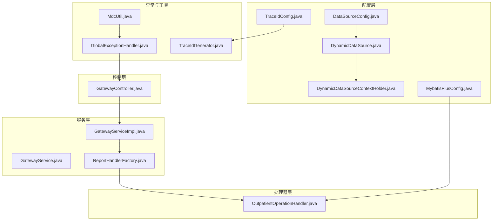
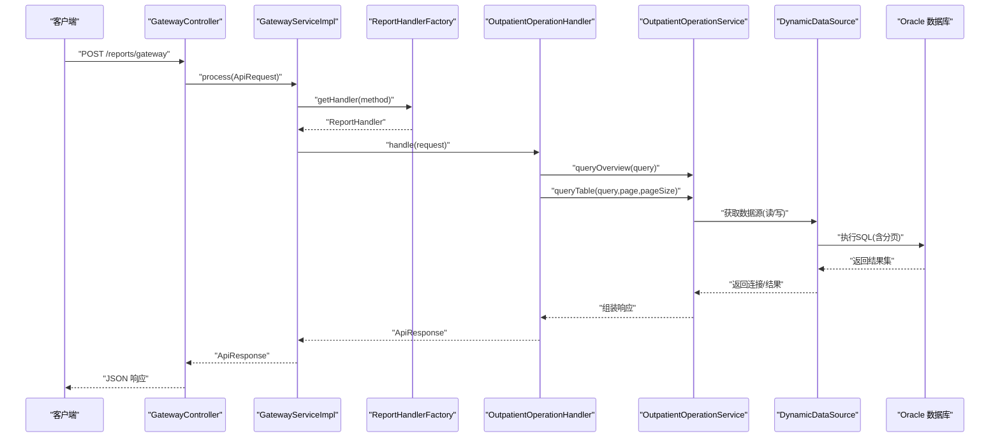
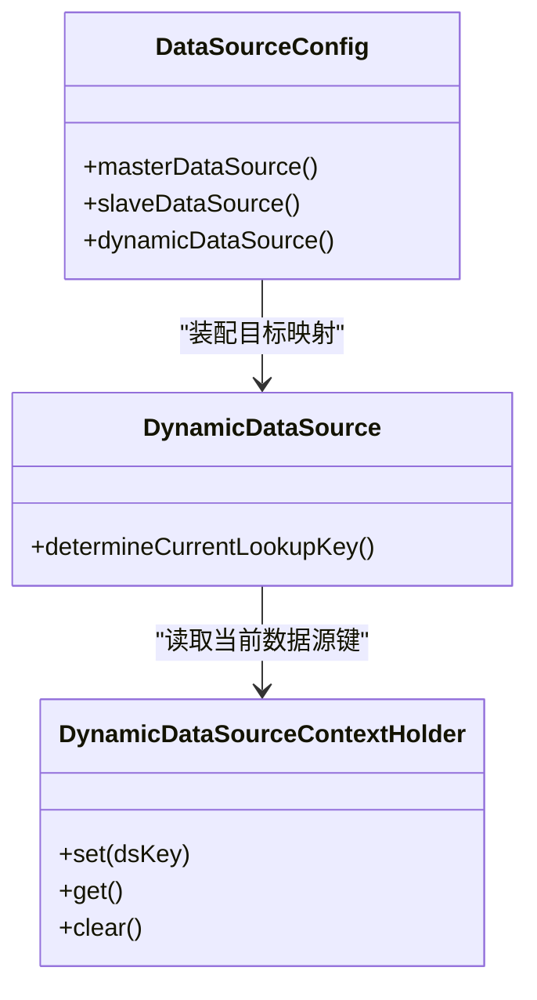
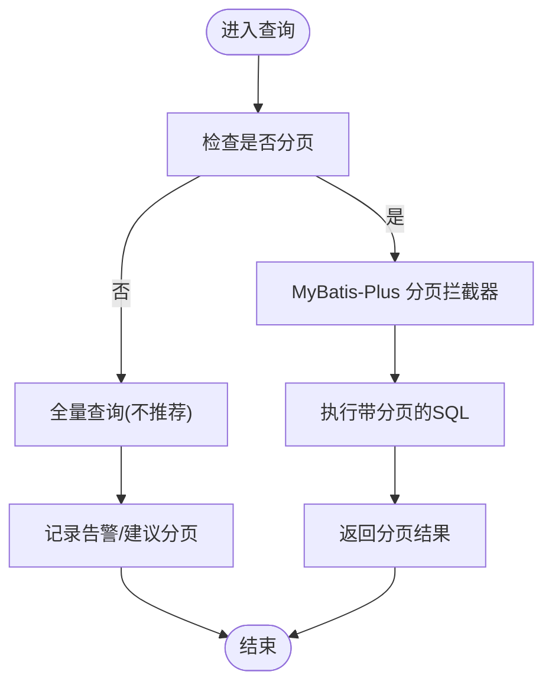
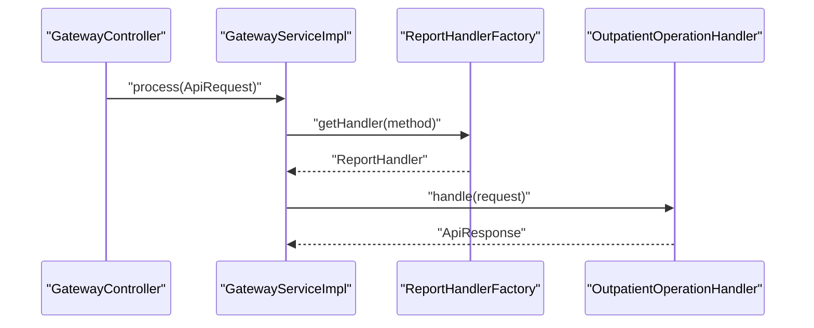
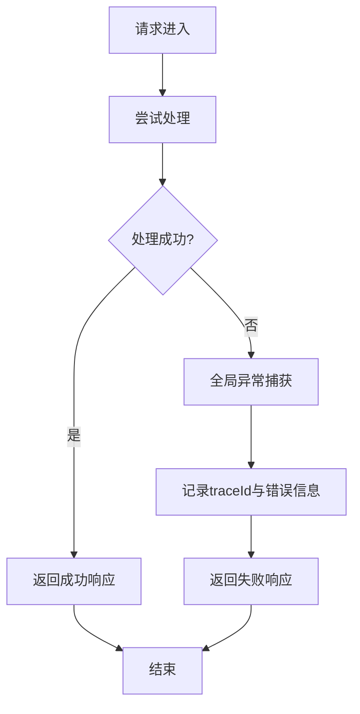
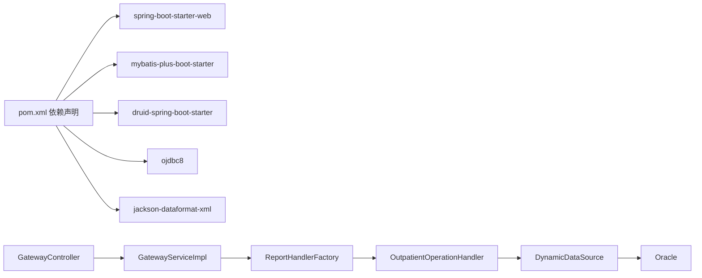

# 性能调优

<cite>
**本文引用的文件**
- [application.yml](file://src/main/resources/application.yml)
- [application-dev.yml](file://src/main/resources/application-dev.yml)
- [pom.xml](file://pom.xml)
- [DataSourceConfig.java](file://src/main/java/com/reports/config/DataSourceConfig.java)
- [DynamicDataSource.java](file://src/main/java/com/reports/config/DynamicDataSource.java)
- [DynamicDataSourceContextHolder.java](file://src/main/java/com/reports/config/DynamicDataSourceContextHolder.java)
- [MybatisPlusConfig.java](file://src/main/java/com/reports/config/MybatisPlusConfig.java)
- [GatewayController.java](file://src/main/java/com/reports/controller/GatewayController.java)
- [GatewayService.java](file://src/main/java/com/reports/service/GatewayService.java)
- [GatewayServiceImpl.java](file://src/main/java/com/reports/service/impl/GatewayServiceImpl.java)
- [ReportHandlerFactory.java](file://src/main/java/com/reports/service/handler/ReportHandlerFactory.java)
- [OutpatientOperationHandler.java](file://src/main/java/com/reports/service/handler/impl/OutpatientOperationHandler.java)
- [GlobalExceptionHandler.java](file://src/main/java/com/reports/exception/GlobalExceptionHandler.java)
- [MdcUtil.java](file://src/main/java/com/reports/util/MdcUtil.java)
- [TraceIdGenerator.java](file://src/main/java/com/reports/util/TraceIdGenerator.java)
- [TraceIdConfig.java](file://src/main/java/com/reports/config/TraceIdConfig.java)
</cite>

## 目录
1. [引言](#引言)
2. [项目结构](#项目结构)
3. [核心组件](#核心组件)
4. [架构总览](#架构总览)
5. [详细组件分析](#详细组件分析)
6. [依赖分析](#依赖分析)
7. [性能考虑](#性能考虑)
8. [故障排查指南](#故障排查指南)
9. [结论](#结论)
10. [附录](#附录)

## 引言
本文件面向性能调优与系统优化，结合代码库现状，系统性梳理JVM参数建议、数据库连接池配置优化、MyBatis-Plus查询优化、多数据源在不同场景下的性能对比、缓存策略设计、并发处理优化、压力测试与基准测试方法、瓶颈识别技巧、负载均衡与集群部署优化、高可用架构设计以及性能监控指标与持续优化建议。目标是帮助读者在不改变业务逻辑的前提下，通过配置与架构层面的优化显著提升系统吞吐与稳定性。

## 项目结构
该项目采用Spring Boot标准目录结构，核心模块包括：
- 配置层：多数据源与MyBatis-Plus配置、追踪号配置
- 控制层：统一网关入口，接收请求并委派到处理器
- 服务层：网关服务与处理器工厂，按method路由到具体处理器
- 处理器层：按报表维度实现的业务处理器
- 异常与工具：全局异常处理、MDC与追踪号生成

图表来源
- [DataSourceConfig.java:1-56](file://src/main/java/com/reports/config/DataSourceConfig.java#L1-L56)
- [DynamicDataSource.java:1-16](file://src/main/java/com/reports/config/DynamicDataSource.java#L1-L16)
- [DynamicDataSourceContextHolder.java:1-38](file://src/main/java/com/reports/config/DynamicDataSourceContextHolder.java#L1-L38)
- [MybatisPlusConfig.java:1-28](file://src/main/java/com/reports/config/MybatisPlusConfig.java#L1-L28)
- [GatewayController.java:1-38](file://src/main/java/com/reports/controller/GatewayController.java#L1-L38)
- [GatewayService.java:1-17](file://src/main/java/com/reports/service/GatewayService.java#L1-L17)
- [GatewayServiceImpl.java:1-51](file://src/main/java/com/reports/service/impl/GatewayServiceImpl.java#L1-L51)
- [ReportHandlerFactory.java:1-74](file://src/main/java/com/reports/service/handler/ReportHandlerFactory.java#L1-L74)
- [OutpatientOperationHandler.java:1-65](file://src/main/java/com/reports/service/handler/impl/OutpatientOperationHandler.java#L1-L65)
- [GlobalExceptionHandler.java:1-86](file://src/main/java/com/reports/exception/GlobalExceptionHandler.java#L1-L86)
- [MdcUtil.java:1-34](file://src/main/java/com/reports/util/MdcUtil.java#L1-L34)
- [TraceIdGenerator.java:1-57](file://src/main/java/com/reports/util/TraceIdGenerator.java#L1-L57)
- [TraceIdConfig.java:1-33](file://src/main/java/com/reports/config/TraceIdConfig.java#L1-L33)

章节来源
- [application.yml:1-32](file://src/main/resources/application.yml#L1-L32)
- [application-dev.yml:1-45](file://src/main/resources/application-dev.yml#L1-L45)
- [pom.xml:1-110](file://pom.xml#L1-L110)

## 核心组件
- 多数据源与动态路由：通过配置类装配主从数据源，并以ThreadLocal维护当前数据源键，实现读写分离与按需切换。
- MyBatis-Plus：启用分页插件，适配Oracle方言，减少全量扫描。
- 网关与处理器：统一入口校验method并路由到对应处理器；处理器内执行概览与分页表格查询。
- 异常与追踪：全局异常捕获并携带traceId；MDC贯穿日志链路；追踪号可配置前缀、长度与格式。

章节来源
- [DataSourceConfig.java:1-56](file://src/main/java/com/reports/config/DataSourceConfig.java#L1-L56)
- [DynamicDataSource.java:1-16](file://src/main/java/com/reports/config/DynamicDataSource.java#L1-L16)
- [DynamicDataSourceContextHolder.java:1-38](file://src/main/java/com/reports/config/DynamicDataSourceContextHolder.java#L1-L38)
- [MybatisPlusConfig.java:1-28](file://src/main/java/com/reports/config/MybatisPlusConfig.java#L1-L28)
- [GatewayController.java:1-38](file://src/main/java/com/reports/controller/GatewayController.java#L1-L38)
- [GatewayServiceImpl.java:1-51](file://src/main/java/com/reports/service/impl/GatewayServiceImpl.java#L1-L51)
- [ReportHandlerFactory.java:1-74](file://src/main/java/com/reports/service/handler/ReportHandlerFactory.java#L1-L74)
- [OutpatientOperationHandler.java:1-65](file://src/main/java/com/reports/service/handler/impl/OutpatientOperationHandler.java#L1-L65)
- [GlobalExceptionHandler.java:1-86](file://src/main/java/com/reports/exception/GlobalExceptionHandler.java#L1-L86)
- [MdcUtil.java:1-34](file://src/main/java/com/reports/util/MdcUtil.java#L1-L34)
- [TraceIdGenerator.java:1-57](file://src/main/java/com/reports/util/TraceIdGenerator.java#L1-L57)
- [TraceIdConfig.java:1-33](file://src/main/java/com/reports/config/TraceIdConfig.java#L1-L33)

## 架构总览
下图展示从HTTP请求到数据库访问的关键路径与性能相关节点。

图表来源
- [GatewayController.java:1-38](file://src/main/java/com/reports/controller/GatewayController.java#L1-L38)
- [GatewayServiceImpl.java:1-51](file://src/main/java/com/reports/service/impl/GatewayServiceImpl.java#L1-L51)
- [ReportHandlerFactory.java:1-74](file://src/main/java/com/reports/service/handler/ReportHandlerFactory.java#L1-L74)
- [OutpatientOperationHandler.java:1-65](file://src/main/java/com/reports/service/handler/impl/OutpatientOperationHandler.java#L1-L65)
- [DynamicDataSource.java:1-16](file://src/main/java/com/reports/config/DynamicDataSource.java#L1-L16)

## 详细组件分析

### 多数据源与动态路由
- 设计要点
  - 主从数据源分别注入，动态数据源持有映射并在运行时根据上下文选择目标数据源。
  - 默认数据源为“master”，可通过上下文切换至“slave”。
- 性能影响
  - 读写分离可降低主库压力；需确保事务边界内使用同一数据源，避免脏读。
  - 连接池大小与等待时间直接影响并发与排队延迟。
- 优化建议
  - 按流量比例设置主从权重，必要时引入只读副本与延迟复制。
  - 使用连接池健康检查与回收策略，避免空闲连接占用资源。

图表来源
- [DataSourceConfig.java:1-56](file://src/main/java/com/reports/config/DataSourceConfig.java#L1-L56)
- [DynamicDataSource.java:1-16](file://src/main/java/com/reports/config/DynamicDataSource.java#L1-L16)
- [DynamicDataSourceContextHolder.java:1-38](file://src/main/java/com/reports/config/DynamicDataSourceContextHolder.java#L1-L38)

章节来源
- [DataSourceConfig.java:1-56](file://src/main/java/com/reports/config/DataSourceConfig.java#L1-L56)
- [DynamicDataSource.java:1-16](file://src/main/java/com/reports/config/DynamicDataSource.java#L1-L16)
- [DynamicDataSourceContextHolder.java:1-38](file://src/main/java/com/reports/config/DynamicDataSourceContextHolder.java#L1-L38)
- [application-dev.yml:1-45](file://src/main/resources/application-dev.yml#L1-L45)

### MyBatis-Plus 查询与分页
- 设计要点
  - 启用分页插件并指定Oracle方言，避免一次性加载大结果集。
  - Mapper扫描路径与日志实现可辅助定位慢查询。
- 性能影响
  - 分页能显著降低内存与网络开销；但需配合索引与SQL优化。
  - SQL日志在生产环境应谨慎开启，避免I/O放大。
- 优化建议
  - 对高频查询建立合适索引；避免SELECT *，精准列投影。
  - 使用explain/执行计划分析慢SQL，必要时拆分复杂查询或引入物化视图。

图表来源
- [MybatisPlusConfig.java:1-28](file://src/main/java/com/reports/config/MybatisPlusConfig.java#L1-L28)
- [OutpatientOperationHandler.java:1-65](file://src/main/java/com/reports/service/handler/impl/OutpatientOperationHandler.java#L1-L65)

章节来源
- [MybatisPlusConfig.java:1-28](file://src/main/java/com/reports/config/MybatisPlusConfig.java#L1-L28)
- [OutpatientOperationHandler.java:1-65](file://src/main/java/com/reports/service/handler/impl/OutpatientOperationHandler.java#L1-L65)

### 网关与处理器路由
- 设计要点
  - 统一入口校验method并交由工厂按注解注册的路由键查找处理器。
  - 处理器内部先查概览再查分页表格，避免重复扫描。
- 性能影响
  - 路由查找为O(1)哈希表操作，开销极低。
  - 处理器内多次查询需注意连接池与事务边界。
- 优化建议
  - 对热点方法预热处理器注册；对长耗时步骤引入异步或批量化。

图表来源
- [GatewayController.java:1-38](file://src/main/java/com/reports/controller/GatewayController.java#L1-L38)
- [GatewayServiceImpl.java:1-51](file://src/main/java/com/reports/service/impl/GatewayServiceImpl.java#L1-L51)
- [ReportHandlerFactory.java:1-74](file://src/main/java/com/reports/service/handler/ReportHandlerFactory.java#L1-L74)
- [OutpatientOperationHandler.java:1-65](file://src/main/java/com/reports/service/handler/impl/OutpatientOperationHandler.java#L1-L65)

章节来源
- [GatewayController.java:1-38](file://src/main/java/com/reports/controller/GatewayController.java#L1-L38)
- [GatewayServiceImpl.java:1-51](file://src/main/java/com/reports/service/impl/GatewayServiceImpl.java#L1-L51)
- [ReportHandlerFactory.java:1-74](file://src/main/java/com/reports/service/handler/ReportHandlerFactory.java#L1-L74)
- [OutpatientOperationHandler.java:1-65](file://src/main/java/com/reports/service/handler/impl/OutpatientOperationHandler.java#L1-L65)

### 异常处理与追踪链路
- 设计要点
  - 全局异常捕获并携带traceId；MDC贯穿日志，便于端到端追踪。
  - 追踪号可配置前缀、长度与格式，满足不同业务需求。
- 性能影响
  - MDC写入与日志级别控制是关键；生产环境建议INFO以上级别。
  - 异常栈打印会带来CPU与IO开销，应避免在高频路径中频繁抛错。
- 优化建议
  - 对参数校验前置，减少无效请求进入业务流程。
  - 使用结构化日志与集中式日志收集，避免本地磁盘I/O瓶颈。

图表来源
- [GlobalExceptionHandler.java:1-86](file://src/main/java/com/reports/exception/GlobalExceptionHandler.java#L1-L86)
- [MdcUtil.java:1-34](file://src/main/java/com/reports/util/MdcUtil.java#L1-L34)
- [TraceIdGenerator.java:1-57](file://src/main/java/com/reports/util/TraceIdGenerator.java#L1-L57)
- [application.yml:1-32](file://src/main/resources/application.yml#L1-L32)

章节来源
- [GlobalExceptionHandler.java:1-86](file://src/main/java/com/reports/exception/GlobalExceptionHandler.java#L1-L86)
- [MdcUtil.java:1-34](file://src/main/java/com/reports/util/MdcUtil.java#L1-L34)
- [TraceIdGenerator.java:1-57](file://src/main/java/com/reports/util/TraceIdGenerator.java#L1-L57)
- [TraceIdConfig.java:1-33](file://src/main/java/com/reports/config/TraceIdConfig.java#L1-L33)
- [application.yml:1-32](file://src/main/resources/application.yml#L1-L32)

## 依赖分析
- 外部依赖
  - Spring Boot Starter Web、MyBatis-Plus、Druid、Oracle JDBC、Jackson XML、Validation、AOP等。
- 内部耦合
  - 控制器依赖服务实现；服务实现依赖处理器工厂；处理器依赖服务接口；数据源配置依赖动态路由与上下文。
- 潜在风险
  - 连接池参数与线程模型需匹配；分页插件与SQL质量共同决定性能上限。

图表来源
- [pom.xml:1-110](file://pom.xml#L1-L110)
- [GatewayController.java:1-38](file://src/main/java/com/reports/controller/GatewayController.java#L1-L38)
- [GatewayServiceImpl.java:1-51](file://src/main/java/com/reports/service/impl/GatewayServiceImpl.java#L1-L51)
- [ReportHandlerFactory.java:1-74](file://src/main/java/com/reports/service/handler/ReportHandlerFactory.java#L1-L74)
- [OutpatientOperationHandler.java:1-65](file://src/main/java/com/reports/service/handler/impl/OutpatientOperationHandler.java#L1-L65)
- [DynamicDataSource.java:1-16](file://src/main/java/com/reports/config/DynamicDataSource.java#L1-L16)

章节来源
- [pom.xml:1-110](file://pom.xml#L1-L110)

## 性能考虑

### JVM参数建议（基于Spring Boot 2.7 + JDK 8）
- 堆内存
  - 新生代与老年代比例建议：新生代占堆的30%~40%，依据对象晋升速率调整。
  - 初始堆与最大堆保持一致，避免动态扩缩容带来的停顿波动。
- 垃圾收集器
  - 生产环境优先考虑G1GC，目标停顿时间可配置；如延迟敏感场景可评估ZGC（JDK 11+）。
- GC日志
  - 开启GC日志与堆快照，定位晋升失败与碎片化问题。
- 其他
  - 禁用偏斜锁与偏向锁在高并发写场景可能退化；必要时关闭。
  - 线程栈大小按实际调用深度设置，避免过大导致线程数受限。

### 数据库连接池配置优化（Druid）
- 连接数
  - 初始连接与最小空闲：保证冷启动快速可用；最大活跃连接需结合数据库最大连接数与平均并发。
- 等待策略
  - 最大等待时间应与业务SLA匹配；过短会导致排队失败，过长会放大排队延迟。
- 回收与验证
  - 空闲回收周期与最小空闲时间平衡资源占用与连接有效性；验证SQL需轻量且可复用。
- 监控
  - 开启Druid StatView与Web URI，观察活跃/等待/创建/销毁等指标。

章节来源
- [application-dev.yml:1-45](file://src/main/resources/application-dev.yml#L1-L45)
- [DataSourceConfig.java:1-56](file://src/main/java/com/reports/config/DataSourceConfig.java#L1-L56)

### MyBatis-Plus查询性能优化
- 分页
  - 严格限制每页大小，避免超大分页；对排序字段建立索引。
- SQL质量
  - 使用explain分析执行计划；避免隐式转换与函数包裹在索引列上。
- 结果集
  - 精准列投影，减少序列化与网络传输；必要时采用流式输出。
- 插件
  - 在开发环境开启SQL日志，在生产关闭或降级到WARN级别。

章节来源
- [MybatisPlusConfig.java:1-28](file://src/main/java/com/reports/config/MybatisPlusConfig.java#L1-L28)
- [OutpatientOperationHandler.java:1-65](file://src/main/java/com/reports/service/handler/impl/OutpatientOperationHandler.java#L1-L65)

### 多数据源性能对比分析
- 单数据源
  - 优点：实现简单、事务一致性强；缺点：读写同库，扩展性受限。
- 主从分离
  - 优点：读扩展、写专注；缺点：最终一致性、跨库事务复杂。
- 多实例/多副本
  - 优点：高可用与跨机房容灾；缺点：一致性与同步延迟。
- 建议
  - 读多写少场景优先从库分流；对强一致需求的事务保持在同一实例内。

章节来源
- [DataSourceConfig.java:1-56](file://src/main/java/com/reports/config/DataSourceConfig.java#L1-L56)
- [DynamicDataSource.java:1-16](file://src/main/java/com/reports/config/DynamicDataSource.java#L1-L16)
- [DynamicDataSourceContextHolder.java:1-38](file://src/main/java/com/reports/config/DynamicDataSourceContextHolder.java#L1-L38)

### 缓存策略设计
- 应用层缓存
  - L1：本地缓存（如Caffeine）缓存热点查询结果；L2：分布式缓存（Redis）做跨节点共享。
- 缓存粒度
  - 按报表维度与时间窗口划分；对高频聚合结果进行预计算。
- 更新策略
  - 增量更新与失效策略结合；对写多场景采用写后失效或写时更新。
- 注意事项
  - 缓存穿透、击穿、雪崩的防护；缓存与数据库双写一致性。

### 并发处理优化
- 线程模型
  - Web容器线程池与业务线程池分离；对IO密集型任务合理设置队列与拒绝策略。
- 连接池
  - 连接池大小与业务线程数匹配，避免过度连接导致数据库拥塞。
- 锁与同步
  - 减少全局锁，使用无锁数据结构或分段锁；避免长事务与死锁。

### 压力测试与基准测试
- 方法
  - 使用JMeter/Locust进行并发压测；针对关键路径（网关->处理器->数据库）构造场景。
- 指标
  - 吞吐、P99延迟、错误率、连接池饱和度、GC停顿、数据库等待事件。
- 基准
  - 建立基线版本，逐步引入优化项并对比回归。

### 瓶颈识别技巧
- 分层定位
  - CPU瓶颈（热点方法）、内存瓶颈（GC与对象分配）、IO瓶颈（磁盘/网络/数据库）。
- 关键手段
  - 火焰图、线程转储、GC日志、数据库慢查询日志、APM链路追踪。

### 负载均衡与集群部署优化
- 负载均衡
  - Nginx/ALB基于权重与健康检查；会话粘性按需开启。
- 集群
  - 无状态部署，共享存储与缓存；水平扩展时关注数据分片与路由。
- 高可用
  - 多副本与自动切换；熔断与限流保护；故障演练常态化。

### 性能监控指标与持续优化
- 指标体系
  - 应用：请求QPS/P99、错误率、线程池饱和度、GC停顿、堆内存使用。
  - 数据库：连接池活跃数、等待时间、慢查询数量、锁等待、buffer hit ratio。
  - 网络：RTT、丢包、带宽利用率。
- 持续优化
  - 周期性回顾与回归测试；建立变更评审与灰度发布流程。

## 故障排查指南
- 常见问题
  - 连接池耗尽：检查最大活跃连接与等待时间，确认是否存在泄漏。
  - 慢查询：启用SQL日志与执行计划分析，优化索引与语句。
  - 异常风暴：查看全局异常处理器输出，结合traceId定位根因。
- 工具与命令
  - jstack/jstat/jmap、top/iostat/sar、数据库AWR/慢查询日志。
- 快速恢复
  - 临时降级非关键功能、扩容连接池或数据库实例、回滚可疑变更。

章节来源
- [GlobalExceptionHandler.java:1-86](file://src/main/java/com/reports/exception/GlobalExceptionHandler.java#L1-L86)
- [MdcUtil.java:1-34](file://src/main/java/com/reports/util/MdcUtil.java#L1-L34)
- [application.yml:1-32](file://src/main/resources/application.yml#L1-L32)

## 结论
通过合理的JVM参数、连接池配置、MyBatis-Plus分页与SQL优化、多数据源读写分离、缓存与并发策略，以及完善的压测与监控体系，可在不牺牲业务正确性的前提下显著提升系统的吞吐与稳定性。建议以基线测试为起点，持续迭代优化，并将高可用与可观测性作为基础设施的一部分长期投入。

## 附录
- 配置参考
  - 运行端口与日志级别、追踪号前缀与长度、数据模式（mock/jdbc/mybatis-plus）等。
- 版本与依赖
  - Spring Boot 2.7、MyBatis-Plus 3.5、Druid 1.2、Oracle JDBC 21c。

章节来源
- [application.yml:1-32](file://src/main/resources/application.yml#L1-L32)
- [application-dev.yml:1-45](file://src/main/resources/application-dev.yml#L1-L45)
- [pom.xml:1-110](file://pom.xml#L1-L110)