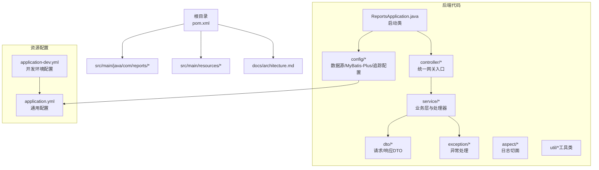
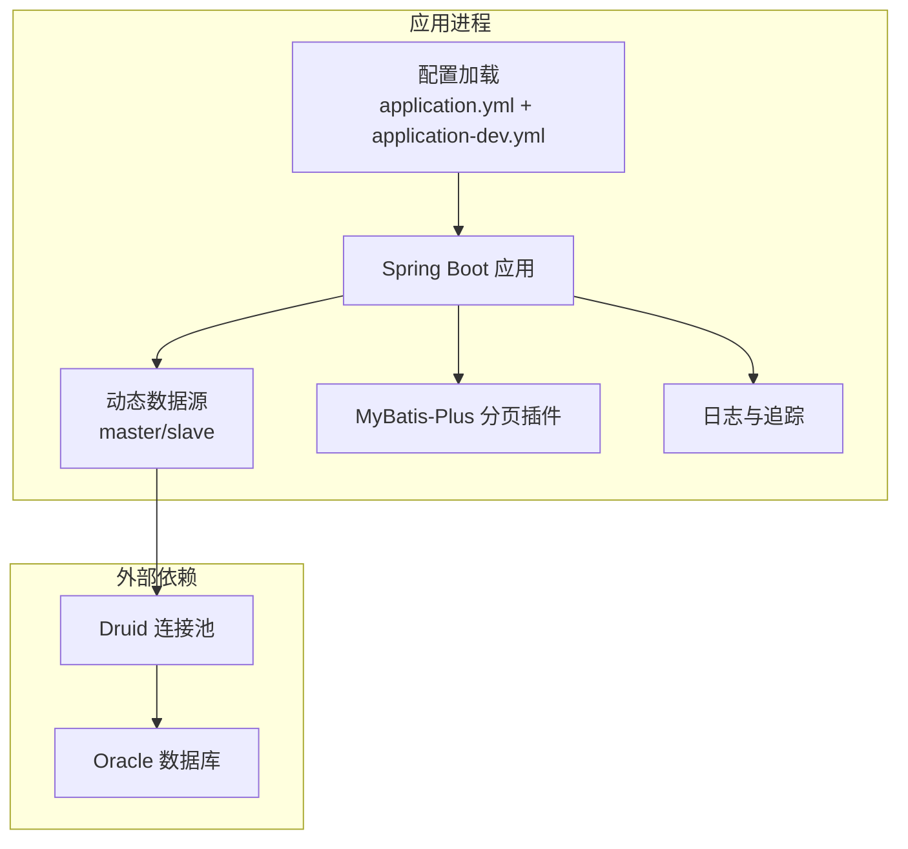
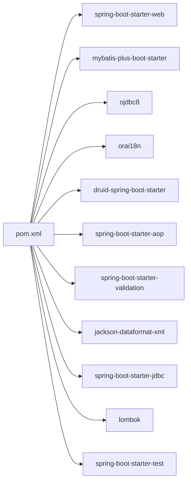

# 环境准备

<cite>
**本文引用的文件**
- [pom.xml](file://pom.xml)
- [application.yml](file://src/main/resources/application.yml)
- [application-dev.yml](file://src/main/resources/application-dev.yml)
- [DataSourceConfig.java](file://src/main/java/com/reports/config/DataSourceConfig.java)
- [DynamicDataSource.java](file://src/main/java/com/reports/config/DynamicDataSource.java)
- [MybatisPlusConfig.java](file://src/main/java/com/reports/config/MybatisPlusConfig.java)
- [architecture.md](file://docs/architecture.md)
</cite>

## 目录
1. [简介](#简介)
2. [项目结构](#项目结构)
3. [核心组件](#核心组件)
4. [架构总览](#架构总览)
5. [详细组件分析](#详细组件分析)
6. [依赖分析](#依赖分析)
7. [性能考虑](#性能考虑)
8. [故障排查指南](#故障排查指南)
9. [结论](#结论)
10. [附录](#附录)

## 简介
本文件面向开发与运维团队，提供“报表网关”项目的环境准备与部署指南。内容覆盖：
- 运行时与构建工具要求（Java 8+、Maven）
- 数据库环境准备（Oracle 12c+）
- 开发与生产环境差异配置
- JVM 参数调优、内存分配建议与系统资源要求
- 环境变量、网络端口与防火墙配置
- Docker 环境准备与容器化部署前准备

## 项目结构
该仓库为一个基于 Spring Boot 的报表网关服务，采用多数据源动态切换、MyBatis-Plus 分页、Druid 连接池与统一链路追踪日志等技术栈。

图表来源
- [architecture.md:21-82](file://docs/architecture.md#L21-L82)
- [pom.xml:1-110](file://pom.xml#L1-L110)

章节来源
- [architecture.md:21-82](file://docs/architecture.md#L21-L82)
- [pom.xml:1-110](file://pom.xml#L1-L110)

## 核心组件
- 运行时与构建工具
  - Java 版本：1.8（兼容性要求）
  - Maven：用于构建与打包
- 数据库与驱动
  - Oracle JDBC 驱动版本：21.8.0.0
  - 连接池：Druid 1.2.18
  - ORM：MyBatis-Plus 3.5.7（含分页插件）
- 应用配置
  - 默认端口：18089
  - 默认激活配置：dev
  - 日志级别与控制台输出格式已配置
  - 数据模式：mock/jdbc/mybatis-plus（可通过配置切换）

章节来源
- [pom.xml:19-24](file://pom.xml#L19-L24)
- [pom.xml:40-51](file://pom.xml#L40-L51)
- [pom.xml:33-38](file://pom.xml#L33-L38)
- [application.yml:1-32](file://src/main/resources/application.yml#L1-L32)
- [application-dev.yml:1-45](file://src/main/resources/application-dev.yml#L1-L45)
- [MybatisPlusConfig.java:1-28](file://src/main/java/com/reports/config/MybatisPlusConfig.java#L1-L28)

## 架构总览
下图展示应用启动与数据访问的关键路径，以及与数据库的交互关系。

图表来源
- [application.yml:1-32](file://src/main/resources/application.yml#L1-L32)
- [application-dev.yml:1-45](file://src/main/resources/application-dev.yml#L1-L45)
- [DataSourceConfig.java:1-56](file://src/main/java/com/reports/config/DataSourceConfig.java#L1-L56)
- [DynamicDataSource.java:1-16](file://src/main/java/com/reports/config/DynamicDataSource.java#L1-L16)
- [MybatisPlusConfig.java:1-28](file://src/main/java/com/reports/config/MybatisPlusConfig.java#L1-L28)

## 详细组件分析

### Java 运行环境与构建工具
- 运行时要求
  - JDK：1.8（满足项目属性与依赖）
  - 推荐使用长期支持版本（如 OpenJDK 或 Oracle JDK 8）
- 构建工具
  - Maven：用于编译、测试与打包
  - 插件：spring-boot-maven-plugin 用于打包可执行 JAR
- 版本一致性
  - Maven 编译目标与源码版本均为 1.8，确保跨平台兼容

章节来源
- [pom.xml:19-24](file://pom.xml#L19-L24)
- [pom.xml:100-107](file://pom.xml#L100-L107)

### 数据库环境准备（Oracle 12c+）
- 驱动与连接
  - Oracle JDBC 驱动：ojdbc8 21.8.0.0
  - 连接池：Druid，提供连接池监控与健康检查能力
- 多数据源配置
  - 支持 master（主）、slave（从）两个数据源
  - 默认数据源为 master；可通过上下文切换至 slave
- 开发环境示例
  - 默认开发环境使用本地 Oracle 实例（localhost:1521），账号密码示例已在配置中给出
  - 另一个示例数据源指向 localhost:1522 的另一个实例
- 生产环境建议
  - 使用独立的生产数据库实例，配置高可用与备份策略
  - 严格区分账号权限与网络访问控制

章节来源
- [pom.xml:40-51](file://pom.xml#L40-L51)
- [application-dev.yml:1-45](file://src/main/resources/application-dev.yml#L1-L45)
- [DataSourceConfig.java:1-56](file://src/main/java/com/reports/config/DataSourceConfig.java#L1-L56)
- [DynamicDataSource.java:1-16](file://src/main/java/com/reports/config/DynamicDataSource.java#L1-L16)

### 开发与生产环境差异配置
- 配置文件
  - application.yml：通用配置（端口、应用名、默认激活 profile、追踪与日志）
  - application-dev.yml：开发环境专用（数据源、Druid 连接池、MyBatis-Plus 配置）
- 关键差异点
  - 数据源：开发环境默认使用本地 Oracle；生产环境需替换为生产库地址与凭据
  - 日志级别：开发环境开启更详细的日志输出（例如 TRACE），生产环境建议调整为 INFO 或 WARN
  - 数据模式：reports.data.mode 支持 mock/jdbc/mybatis-plus，开发阶段可使用 mock 快速验证
- Profile 切换
  - 通过 spring.profiles.active 切换 dev/prod 等环境
  - 可通过命令行或环境变量传入 -Dspring.profiles.active=prod

章节来源
- [application.yml:1-32](file://src/main/resources/application.yml#L1-L32)
- [application-dev.yml:1-45](file://src/main/resources/application-dev.yml#L1-L45)
- [architecture.md:386-418](file://docs/architecture.md#L386-L418)

### JVM 参数调优与内存分配建议
- 基础建议
  - Xms 与 Xmx：根据并发与数据量设定，建议初始堆与最大堆一致以避免扩容开销
  - Metaspace：建议设置为合理上限（如 256m~512m），避免类元数据溢出
  - GC：优先使用 G1GC，结合 -XX:+UseG1GC、-XX:MaxGCPauseMillis 等参数平衡停顿与吞吐
- 连接池与数据库
  - Druid 连接池参数（示例）：initial-size、min-idle、max-active、validation-query 等
  - 建议与数据库最大连接数匹配，避免连接争用
- 日志与追踪
  - TRACE 级别会增加日志开销，生产环境建议关闭或限制范围
- 线程与队列
  - Web 容器线程池大小与业务线程池需与 CPU 核数匹配，避免过度上下文切换

章节来源
- [application-dev.yml:9-20](file://src/main/resources/application-dev.yml#L9-L20)
- [application-dev.yml:22-38](file://src/main/resources/application-dev.yml#L22-L38)
- [application.yml:25-32](file://src/main/resources/application.yml#L25-L32)

### 系统资源要求（估算）
- CPU：单实例建议至少 2 核，高并发场景建议 4 核以上
- 内存：建议 2GB 起步，高峰期按 QPS 与报表复杂度评估
- 存储：日志与临时文件占用需预留空间；数据库存储按历史数据规模评估
- 网络：应用端口 18089 对外提供服务；数据库端口 1521/1522（示例）需内网可达

章节来源
- [application.yml:1-5](file://src/main/resources/application.yml#L1-L5)
- [application-dev.yml:5-8](file://src/main/resources/application-dev.yml#L5-L8)

### 环境变量、网络端口与防火墙
- 环境变量
  - JAVA_OPTS：用于传递 JVM 参数（如 -Xms、-Xmx、-XX:MetaspaceSize 等）
  - SPRING_PROFILES_ACTIVE：指定运行环境（dev/prod）
  - DB_URL/DB_USER/DB_PASSWORD：可选，用于覆盖配置文件中的数据库凭据（生产环境推荐）
- 网络端口
  - 应用监听：18089（HTTP）
  - 数据库：1521/1522（示例，实际以生产配置为准）
- 防火墙
  - 出站：允许访问数据库所在主机与端口
  - 入站：仅开放 18089 至可信网段或反向代理

章节来源
- [application.yml:1-10](file://src/main/resources/application.yml#L1-L10)
- [application-dev.yml:5-8](file://src/main/resources/application-dev.yml#L5-L8)

### Docker 环境准备与容器化部署前准备
- 基础镜像选择
  - 建议使用官方 OpenJDK 8 镜像作为基础
- 构建产物
  - 使用 Maven 打包生成可执行 JAR，复制至容器内对应目录
- 容器运行
  - 挂载配置文件（application.yml 与 application-{env}.yml）以覆盖默认配置
  - 暴露端口 18089
  - 设置环境变量：SPRING_PROFILES_ACTIVE、JAVA_OPTS 等
- 数据库连接
  - 通过网络连通性保证容器可访问数据库
  - 生产环境建议使用服务发现或内网域名解析
- 健康检查
  - 提供 HTTP 健康检查端点（如 /actuator/health），便于编排系统探测

章节来源
- [pom.xml:100-107](file://pom.xml#L100-L107)
- [application.yml:1-10](file://src/main/resources/application.yml#L1-L10)
- [application-dev.yml:1-45](file://src/main/resources/application-dev.yml#L1-L45)

## 依赖分析
项目主要依赖如下：
- Spring Boot Web：提供 Web 服务器与 MVC 能力
- MyBatis-Plus：ORM 与分页插件
- Oracle JDBC：数据库驱动
- Druid：连接池与监控
- Lombok：简化代码
- Spring AOP/Validation/Jackson XML/JDBC/Test：辅助功能

图表来源
- [pom.xml:26-98](file://pom.xml#L26-L98)

章节来源
- [pom.xml:26-98](file://pom.xml#L26-L98)

## 性能考虑
- 数据访问
  - 合理设置 Druid 连接池参数，避免连接泄漏与超时
  - 使用 MyBatis-Plus 分页插件，避免一次性拉取大量数据
- 日志与追踪
  - 生产环境降低日志级别，避免 IO 压力
  - 追踪号生成与 MDC 使用需避免额外开销
- 并发与线程
  - 根据 CPU 核心数与 QPS 调整线程池大小
  - 避免阻塞操作在主线程执行
- 缓存与导出
  - 对热点报表可引入缓存（如 Redis）
  - 报表导出建议异步处理并限制并发

章节来源
- [MybatisPlusConfig.java:1-28](file://src/main/java/com/reports/config/MybatisPlusConfig.java#L1-L28)
- [application-dev.yml:9-20](file://src/main/resources/application-dev.yml#L9-L20)
- [application.yml:25-32](file://src/main/resources/application.yml#L25-L32)
- [architecture.md:450-458](file://docs/architecture.md#L450-L458)

## 故障排查指南
- 数据库连接失败
  - 检查 application-dev.yml 中的 URL、用户名、密码是否正确
  - 确认数据库端口与网络连通性
- 连接池问题
  - 观察 Druid 连接池状态与慢查询日志
  - 调整 max-active、max-wait 等参数
- 日志与追踪
  - 确认日志级别与控制台格式配置
  - 核对 TraceId 生成与传播链路
- 启动与端口
  - 确认端口 18089 未被占用
  - 检查 spring.profiles.active 是否正确

章节来源
- [application-dev.yml:1-45](file://src/main/resources/application-dev.yml#L1-L45)
- [application.yml:1-32](file://src/main/resources/application.yml#L1-L32)
- [architecture.md:159-189](file://docs/architecture.md#L159-L189)

## 结论
本指南明确了“报表网关”项目在开发与生产环境下的准备要点，涵盖运行时、数据库、配置、JVM 与系统资源、网络与防火墙以及容器化部署等关键环节。建议在生产环境中严格区分配置与凭据，强化监控与告警，并持续优化连接池与日志策略以获得稳定高效的运行表现。

## 附录
- 快速启动
  - 使用 Maven 启动：mvn spring-boot:run
  - 访问网关：POST http://localhost:18089/reports/gateway
- 常用命令参考
  - 打包：mvn clean package
  - 运行（prod）：SPRING_PROFILES_ACTIVE=prod java -jar reports-*.jar

章节来源
- [architecture.md:420-447](file://docs/architecture.md#L420-L447)