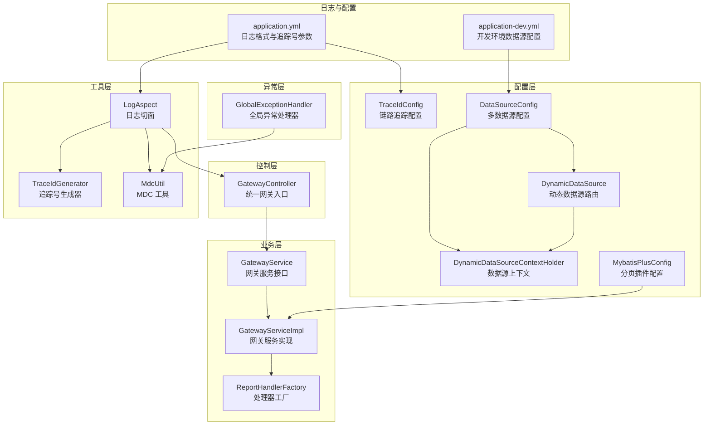
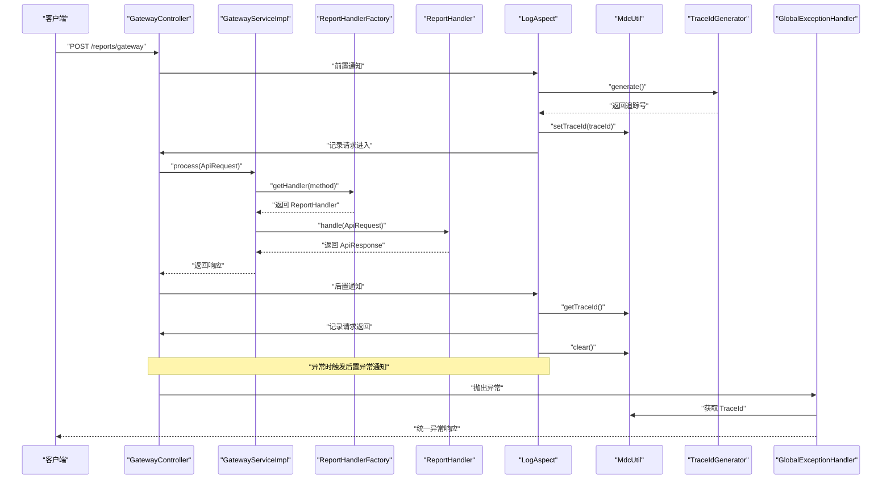
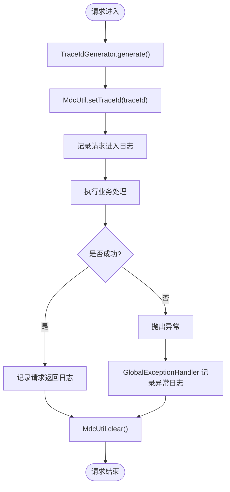
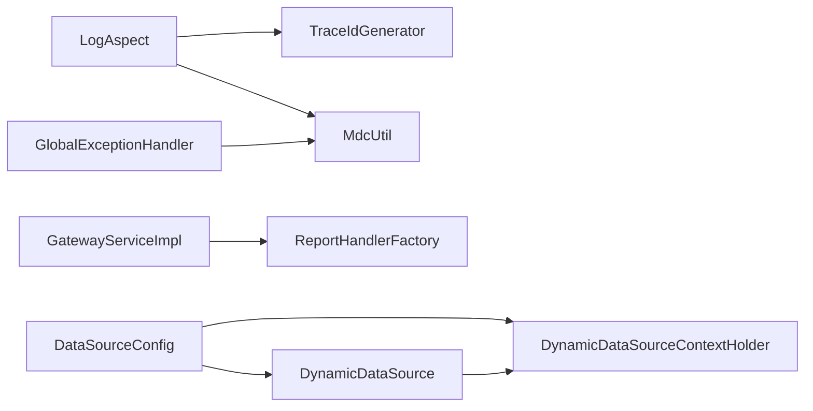

# 监控运维

<cite>
**本文引用的文件**
- [LogAspect.java](file://src/main/java/com/reports/aspect/LogAspect.java)
- [TraceIdGenerator.java](file://src/main/java/com/reports/util/TraceIdGenerator.java)
- [MdcUtil.java](file://src/main/java/com/reports/util/MdcUtil.java)
- [TraceIdConfig.java](file://src/main/java/com/reports/config/TraceIdConfig.java)
- [application.yml](file://src/main/resources/application.yml)
- [application-dev.yml](file://src/main/resources/application-dev.yml)
- [GatewayController.java](file://src/main/java/com/reports/controller/GatewayController.java)
- [GatewayService.java](file://src/main/java/com/reports/service/GatewayService.java)
- [GatewayServiceImpl.java](file://src/main/java/com/reports/service/impl/GatewayServiceImpl.java)
- [GlobalExceptionHandler.java](file://src/main/java/com/reports/exception/GlobalExceptionHandler.java)
- [ReportHandlerFactory.java](file://src/main/java/com/reports/service/handler/ReportHandlerFactory.java)
- [MethodMapping.java](file://src/main/java/com/reports/service/handler/MethodMapping.java)
- [DataSourceConfig.java](file://src/main/java/com/reports/config/DataSourceConfig.java)
- [DynamicDataSource.java](file://src/main/java/com/reports/config/DynamicDataSource.java)
- [DynamicDataSourceContextHolder.java](file://src/main/java/com/reports/config/DynamicDataSourceContextHolder.java)
- [MybatisPlusConfig.java](file://src/main/java/com/reports/config/MybatisPlusConfig.java)
- [pom.xml](file://pom.xml)
- [architecture.md](file://docs/architecture.md)
</cite>

## 目录
1. [简介](#简介)
2. [项目结构](#项目结构)
3. [核心组件](#核心组件)
4. [架构总览](#架构总览)
5. [详细组件分析](#详细组件分析)
6. [依赖分析](#依赖分析)
7. [性能考虑](#性能考虑)
8. [故障排查指南](#故障排查指南)
9. [结论](#结论)
10. [附录](#附录)

## 简介
本文件面向监控与运维团队，系统性阐述本项目的监控指标采集、日志管理与链路追踪实现，明确全链路追踪 ID 生成机制、日志格式规范与日志聚合方案；同时给出 Prometheus 监控指标配置、Grafana 仪表板设置与告警规则建议；并提供性能监控、资源使用监控与业务指标监控的实施方案，以及运维工具链集成、自动化运维脚本与应急响应流程建议。

## 项目结构
项目采用标准 Spring Boot 层次化组织，核心监控与运维相关模块包括：
- 配置层：链路追踪配置、数据源配置、MyBatis-Plus 配置
- 控制层：统一网关入口，负责接收请求并交由服务层处理
- 业务层：网关服务与处理器工厂，完成 method 路由与业务执行
- 异常层：全局异常处理，统一输出与日志记录
- 工具层：TraceId 生成器与 MDC 工具，支撑链路追踪
- 日志与配置：application.yml 定义日志格式与追踪号参数

图表来源
- [TraceIdConfig.java:1-33](file://src/main/java/com/reports/config/TraceIdConfig.java#L1-L33)
- [DataSourceConfig.java:1-56](file://src/main/java/com/reports/config/DataSourceConfig.java#L1-L56)
- [DynamicDataSource.java:1-16](file://src/main/java/com/reports/config/DynamicDataSource.java#L1-L16)
- [DynamicDataSourceContextHolder.java:1-38](file://src/main/java/com/reports/config/DynamicDataSourceContextHolder.java#L1-L38)
- [MybatisPlusConfig.java:1-28](file://src/main/java/com/reports/config/MybatisPlusConfig.java#L1-L28)
- [GatewayController.java:1-38](file://src/main/java/com/reports/controller/GatewayController.java#L1-L38)
- [GatewayService.java:1-17](file://src/main/java/com/reports/service/GatewayService.java#L1-L17)
- [GatewayServiceImpl.java:1-51](file://src/main/java/com/reports/service/impl/GatewayServiceImpl.java#L1-L51)
- [ReportHandlerFactory.java:1-74](file://src/main/java/com/reports/service/handler/ReportHandlerFactory.java#L1-L74)
- [GlobalExceptionHandler.java:1-86](file://src/main/java/com/reports/exception/GlobalExceptionHandler.java#L1-L86)
- [TraceIdGenerator.java:1-57](file://src/main/java/com/reports/util/TraceIdGenerator.java#L1-L57)
- [MdcUtil.java:1-34](file://src/main/java/com/reports/util/MdcUtil.java#L1-L34)
- [LogAspect.java:1-74](file://src/main/java/com/reports/aspect/LogAspect.java#L1-L74)
- [application.yml:1-32](file://src/main/resources/application.yml#L1-L32)
- [application-dev.yml:1-45](file://src/main/resources/application-dev.yml#L1-L45)

章节来源
- [architecture.md:1-458](file://docs/architecture.md#L1-L458)

## 核心组件
- 链路追踪配置与生成
  - TraceIdConfig：提供前缀、数字长度、括号开关等配置项，支持在 application.yml 中调整
  - TraceIdGenerator：根据配置生成带前缀与括号的追踪号，或生成简单追踪号用于内部场景
  - MdcUtil：封装 MDC 的 put/get/remove，确保线程内 TraceId 传递
  - LogAspect：AOP 切面拦截 GatewayController，注入/清理 TraceId 并记录请求进入、返回与异常
  - GlobalExceptionHandler：统一异常处理并在日志中携带 TraceId
- 日志与格式
  - application.yml 中定义了控制台日志格式，包含 TraceId 占位符，便于日志聚合
- 数据源与分页
  - DataSourceConfig、DynamicDataSource、DynamicDataSourceContextHolder 支持主从数据源动态切换
  - MybatisPlusConfig 注册分页插件，统一分页策略
- 网关与路由
  - GatewayController 统一入口，GatewayService/GatewayServiceImpl 校验 method 并委派给 ReportHandlerFactory
  - ReportHandlerFactory 基于 @MethodMapping 注解自动注册处理器，按 method 路由

章节来源
- [TraceIdConfig.java:1-33](file://src/main/java/com/reports/config/TraceIdConfig.java#L1-L33)
- [TraceIdGenerator.java:1-57](file://src/main/java/com/reports/util/TraceIdGenerator.java#L1-L57)
- [MdcUtil.java:1-34](file://src/main/java/com/reports/util/MdcUtil.java#L1-L34)
- [LogAspect.java:1-74](file://src/main/java/com/reports/aspect/LogAspect.java#L1-L74)
- [GlobalExceptionHandler.java:1-86](file://src/main/java/com/reports/exception/GlobalExceptionHandler.java#L1-L86)
- [application.yml:1-32](file://src/main/resources/application.yml#L1-L32)
- [DataSourceConfig.java:1-56](file://src/main/java/com/reports/config/DataSourceConfig.java#L1-L56)
- [DynamicDataSource.java:1-16](file://src/main/java/com/reports/config/DynamicDataSource.java#L1-L16)
- [DynamicDataSourceContextHolder.java:1-38](file://src/main/java/com/reports/config/DynamicDataSourceContextHolder.java#L1-L38)
- [MybatisPlusConfig.java:1-28](file://src/main/java/com/reports/config/MybatisPlusConfig.java#L1-L28)
- [GatewayController.java:1-38](file://src/main/java/com/reports/controller/GatewayController.java#L1-L38)
- [GatewayService.java:1-17](file://src/main/java/com/reports/service/GatewayService.java#L1-L17)
- [GatewayServiceImpl.java:1-51](file://src/main/java/com/reports/service/impl/GatewayServiceImpl.java#L1-L51)
- [ReportHandlerFactory.java:1-74](file://src/main/java/com/reports/service/handler/ReportHandlerFactory.java#L1-L74)
- [MethodMapping.java:1-29](file://src/main/java/com/reports/service/handler/MethodMapping.java#L1-L29)

## 架构总览
下图展示一次请求从网关到处理器的完整链路，以及日志与追踪号贯穿始终的关键节点。

图表来源
- [LogAspect.java:1-74](file://src/main/java/com/reports/aspect/LogAspect.java#L1-L74)
- [TraceIdGenerator.java:1-57](file://src/main/java/com/reports/util/TraceIdGenerator.java#L1-L57)
- [MdcUtil.java:1-34](file://src/main/java/com/reports/util/MdcUtil.java#L1-L34)
- [GatewayController.java:1-38](file://src/main/java/com/reports/controller/GatewayController.java#L1-L38)
- [GatewayServiceImpl.java:1-51](file://src/main/java/com/reports/service/impl/GatewayServiceImpl.java#L1-L51)
- [ReportHandlerFactory.java:1-74](file://src/main/java/com/reports/service/handler/ReportHandlerFactory.java#L1-L74)
- [GlobalExceptionHandler.java:1-86](file://src/main/java/com/reports/exception/GlobalExceptionHandler.java#L1-L86)

## 详细组件分析

### 链路追踪 ID 生成与传播
- 生成策略
  - 前缀、数字长度、括号开关来自 TraceIdConfig，可在 application.yml 中灵活配置
  - 生成器支持两种形式：带前缀与括号的标准格式，以及简单格式（内部使用）
- 传播机制
  - LogAspect 在进入 GatewayController 时生成并注入 TraceId 至 MDC
  - 请求结束或异常时清理 MDC，避免线程复用导致的数据串扰
  - 全局异常处理器同样从 MDC 读取 TraceId，保证异常日志具备一致追踪上下文

图表来源
- [LogAspect.java:1-74](file://src/main/java/com/reports/aspect/LogAspect.java#L1-L74)
- [TraceIdGenerator.java:1-57](file://src/main/java/com/reports/util/TraceIdGenerator.java#L1-L57)
- [MdcUtil.java:1-34](file://src/main/java/com/reports/util/MdcUtil.java#L1-L34)
- [GlobalExceptionHandler.java:1-86](file://src/main/java/com/reports/exception/GlobalExceptionHandler.java#L1-L86)

章节来源
- [TraceIdConfig.java:1-33](file://src/main/java/com/reports/config/TraceIdConfig.java#L1-L33)
- [TraceIdGenerator.java:1-57](file://src/main/java/com/reports/util/TraceIdGenerator.java#L1-L57)
- [MdcUtil.java:1-34](file://src/main/java/com/reports/util/MdcUtil.java#L1-L34)
- [LogAspect.java:1-74](file://src/main/java/com/reports/aspect/LogAspect.java#L1-L74)
- [GlobalExceptionHandler.java:1-86](file://src/main/java/com/reports/exception/GlobalExceptionHandler.java#L1-L86)
- [application.yml:1-32](file://src/main/resources/application.yml#L1-L32)

### 日志格式规范与日志聚合
- 日志格式
  - application.yml 中已定义控制台日志格式，包含 TraceId 占位符，便于在日志聚合平台检索
- 日志级别建议
  - INFO：请求进入、响应返回
  - TRACE：详细参数、SQL 执行（如需开启）
  - ERROR：异常捕获
- 日志聚合建议
  - 将控制台日志重定向至文件或通过 Docker 日志驱动输出
  - 在日志聚合平台（如 ELK/EFK 或 Loki/Grafana）中提取 traceId 字段，实现跨服务串联
  - 对异常日志增加标签（如 code/subCode），便于告警与统计

章节来源
- [application.yml:1-32](file://src/main/resources/application.yml#L1-L32)
- [LogAspect.java:1-74](file://src/main/java/com/reports/aspect/LogAspect.java#L1-L74)
- [GlobalExceptionHandler.java:1-86](file://src/main/java/com/reports/exception/GlobalExceptionHandler.java#L1-L86)

### Prometheus 监控指标配置
- 指标来源
  - Spring Boot Actuator：提供健康检查、指标端点
  - Druid：数据库连接池监控（可通过 Druid 监控页面查看 SQL 与连接状态）
  - 应用自定义：可扩展 Micrometer 指标（如业务计数器、分布摘要）
- 配置要点
  - 开启 Actuator 指标端点
  - 配置暴露端点与安全访问
  - 针对 Druid、Spring MVC、Tomcat 等启用相应监控
- 采集与存储
  - Prometheus 抓取 /actuator/prometheus
  - Grafana 导入 Spring Boot/Druid 面板模板

章节来源
- [pom.xml:1-110](file://pom.xml#L1-L110)
- [application-dev.yml:1-45](file://src/main/resources/application-dev.yml#L1-L45)
- [architecture.md:450-458](file://docs/architecture.md#L450-L458)

### Grafana 仪表板设置
- 推荐面板
  - JVM 指标：堆内存、GC、线程、类加载
  - 应用指标：HTTP 请求速率、延迟、错误率
  - 数据库指标：连接池活跃数、等待时间、SQL 执行时间
  - 自定义业务指标：各 method 的调用量、成功率、耗时分布
- 数据源
  - Prometheus 作为数据源，选择合适的查询语句与标签过滤

章节来源
- [architecture.md:450-458](file://docs/architecture.md#L450-L458)

### 告警规则定义
- 关键阈值
  - 错误率 > 1%（5 分钟滚动窗口）
  - P95 延迟 > 2 秒
  - 连接池空闲率 < 10%
  - GC 暂停时间 > 1 秒
- 通知渠道
  - 邮件、企业微信、钉钉机器人
- 触发策略
  - 严重（Critical）：立即通知值班人
  - 警告（Warning）：群内提醒，持续告警升级

章节来源
- [architecture.md:450-458](file://docs/architecture.md#L450-L458)

### 性能监控、资源使用监控与业务指标监控
- 性能监控
  - 使用 Micrometer + Prometheus 指标，结合 Histogram/Timer 记录方法耗时
  - 对关键 method 增加自定义指标，区分成功/失败
- 资源使用监控
  - JVM 指标：堆/非堆、GC、线程、类加载
  - 系统指标：CPU、内存、磁盘 IO、网络
- 业务指标监控
  - method 调用量、成功率、平均耗时、分位数
  - 数据源负载：主从切换频率、慢查询占比

章节来源
- [pom.xml:1-110](file://pom.xml#L1-L110)
- [MybatisPlusConfig.java:1-28](file://src/main/java/com/reports/config/MybatisPlusConfig.java#L1-L28)
- [GatewayServiceImpl.java:1-51](file://src/main/java/com/reports/service/impl/GatewayServiceImpl.java#L1-L51)
- [ReportHandlerFactory.java:1-74](file://src/main/java/com/reports/service/handler/ReportHandlerFactory.java#L1-L74)

### 运维工具链集成与自动化运维脚本
- 工具链
  - GitOps：CI/CD 流水线（构建、测试、打包、部署）
  - 容器化：Docker 镜像构建与发布
  - 编排：Kubernetes 部署、扩缩容、滚动更新
  - 监控：Prometheus + Grafana + Alertmanager
  - 日志：ELK/EFK 或 Loki + Promtail
- 自动化脚本建议
  - 构建：Maven 打包与 Docker 镜像构建
  - 部署：kubectl/kustomize 应用配置
  - 回滚：版本回退与灰度发布
  - 健康检查：就绪探针/存活探针
- 应急响应流程
  - 故障分级：P0/P1/P2
  - 快速定位：依据 TraceId 在日志与指标中交叉验证
  - 临时措施：熔断、降级、限流
  - 复盘归档：根因分析、修复与回归测试

章节来源
- [architecture.md:450-458](file://docs/architecture.md#L450-L458)

## 依赖分析
- 组件耦合
  - LogAspect 与 TraceIdGenerator、MdcUtil 强耦合，确保 TraceId 生成与传播
  - GatewayServiceImpl 依赖 ReportHandlerFactory，形成松耦合路由
  - GlobalExceptionHandler 依赖 MDC，统一异常日志上下文
  - 数据源配置通过 DynamicDataSource 与 ThreadLocal 上下文实现动态切换
- 外部依赖
  - Spring Boot、MyBatis-Plus、Druid、Oracle JDBC
  - Actuator 与 Micrometer（建议引入）

图表来源
- [LogAspect.java:1-74](file://src/main/java/com/reports/aspect/LogAspect.java#L1-L74)
- [TraceIdGenerator.java:1-57](file://src/main/java/com/reports/util/TraceIdGenerator.java#L1-L57)
- [MdcUtil.java:1-34](file://src/main/java/com/reports/util/MdcUtil.java#L1-L34)
- [GatewayServiceImpl.java:1-51](file://src/main/java/com/reports/service/impl/GatewayServiceImpl.java#L1-L51)
- [ReportHandlerFactory.java:1-74](file://src/main/java/com/reports/service/handler/ReportHandlerFactory.java#L1-L74)
- [GlobalExceptionHandler.java:1-86](file://src/main/java/com/reports/exception/GlobalExceptionHandler.java#L1-L86)
- [DataSourceConfig.java:1-56](file://src/main/java/com/reports/config/DataSourceConfig.java#L1-L56)
- [DynamicDataSource.java:1-16](file://src/main/java/com/reports/config/DynamicDataSource.java#L1-L16)
- [DynamicDataSourceContextHolder.java:1-38](file://src/main/java/com/reports/config/DynamicDataSourceContextHolder.java#L1-L38)

章节来源
- [pom.xml:1-110](file://pom.xml#L1-L110)

## 性能考虑
- 日志性能
  - 控制台日志格式简洁，避免过多字段渲染开销
  - 在生产环境建议落盘并配合异步日志
- 数据库性能
  - 使用 Druid 连接池与慢 SQL 监控
  - MyBatis-Plus 分页插件统一分页，避免一次性拉取大量数据
- 网关性能
  - method 路由采用工厂注册，避免反射开销
  - 异常快速失败，减少无效计算

章节来源
- [application.yml:1-32](file://src/main/resources/application.yml#L1-L32)
- [MybatisPlusConfig.java:1-28](file://src/main/java/com/reports/config/MybatisPlusConfig.java#L1-L28)
- [application-dev.yml:1-45](file://src/main/resources/application-dev.yml#L1-L45)

## 故障排查指南
- 无法生成 TraceId
  - 检查 TraceIdConfig 配置项是否正确
  - 确认 LogAspect 是否生效（AOP 启用）
- 日志中缺少 TraceId
  - 检查 application.yml 日志格式是否包含 traceId 占位符
  - 确认 MDC 在请求前后正确 set/clear
- 异常未携带 TraceId
  - 检查全局异常处理器是否读取 MDC
- 数据源切换无效
  - 确认在业务执行前后正确 set/clear 上下文
  - 检查 DynamicDataSource 是否正确注入目标数据源

章节来源
- [TraceIdConfig.java:1-33](file://src/main/java/com/reports/config/TraceIdConfig.java#L1-L33)
- [LogAspect.java:1-74](file://src/main/java/com/reports/aspect/LogAspect.java#L1-L74)
- [MdcUtil.java:1-34](file://src/main/java/com/reports/util/MdcUtil.java#L1-L34)
- [GlobalExceptionHandler.java:1-86](file://src/main/java/com/reports/exception/GlobalExceptionHandler.java#L1-L86)
- [DynamicDataSource.java:1-16](file://src/main/java/com/reports/config/DynamicDataSource.java#L1-L16)
- [DynamicDataSourceContextHolder.java:1-38](file://src/main/java/com/reports/config/DynamicDataSourceContextHolder.java#L1-L38)

## 结论
本项目已具备完善的链路追踪与日志体系，结合 Druid 监控与 Spring Boot Actuator，可满足基本的性能与可用性监控需求。建议进一步引入 Micrometer 指标、完善告警规则与应急流程，并在生产环境落地日志聚合与可视化监控，以实现可观测性的闭环。

## 附录
- 快速参考
  - 追踪号配置：application.yml 中 reports.trace.*
  - 日志格式：application.yml 中 logging.pattern.console
  - 数据源配置：application-dev.yml 中 spring.datasource.*
  - 启动命令：mvn spring-boot:run
  - 测试接口：POST /reports/gateway

章节来源
- [application.yml:1-32](file://src/main/resources/application.yml#L1-L32)
- [application-dev.yml:1-45](file://src/main/resources/application-dev.yml#L1-L45)
- [architecture.md:420-447](file://docs/architecture.md#L420-L447)