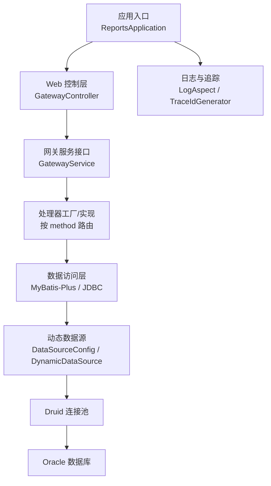
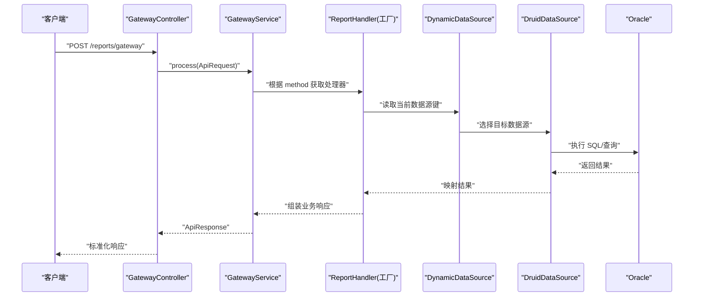
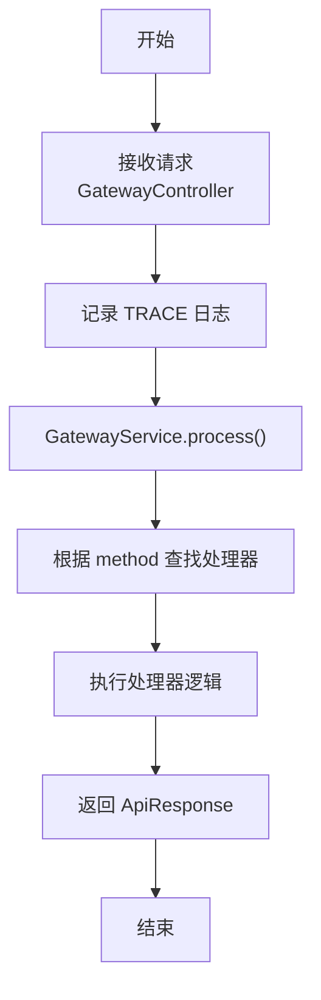
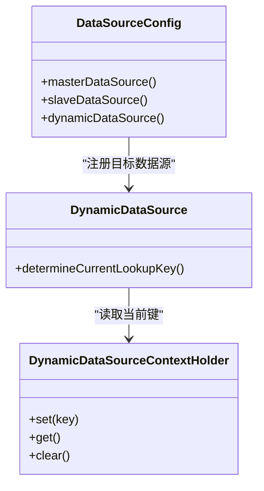
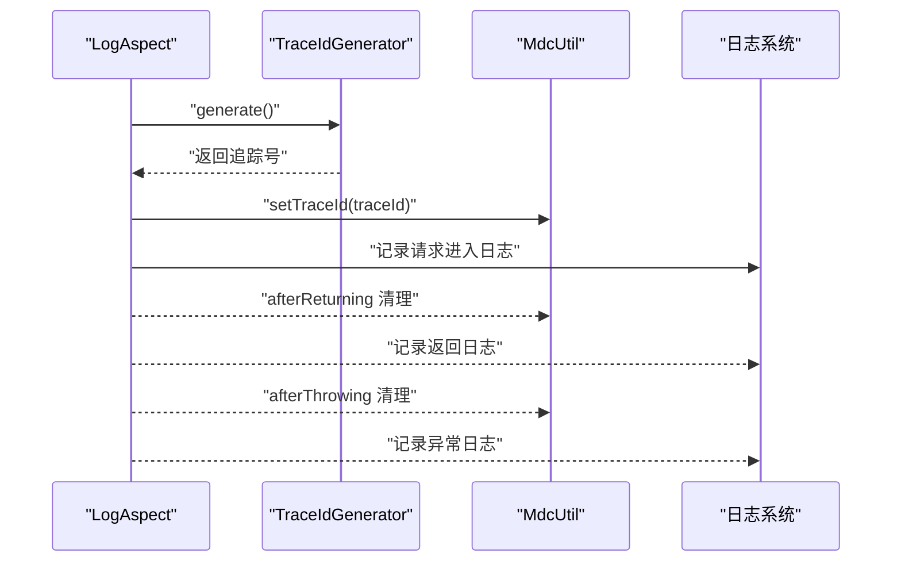
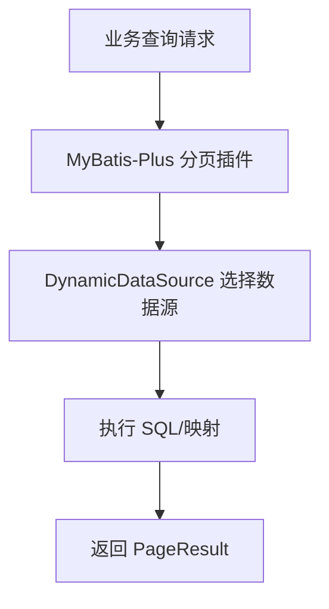
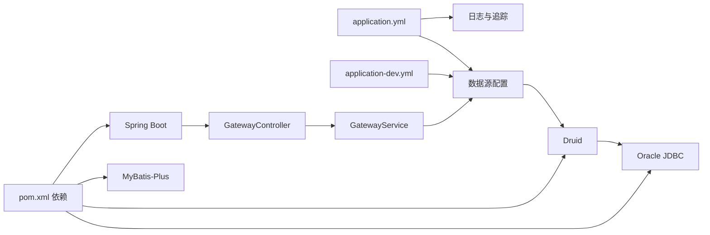

# 部署运维

<cite>
**本文引用的文件**
- [pom.xml](file://pom.xml)
- [application.yml](file://src/main/resources/application.yml)
- [application-dev.yml](file://src/main/resources/application-dev.yml)
- [ReportsApplication.java](file://src/main/java/com/reports/ReportsApplication.java)
- [GatewayController.java](file://src/main/java/com/reports/controller/GatewayController.java)
- [DataSourceConfig.java](file://src/main/java/com/reports/config/DataSourceConfig.java)
- [DynamicDataSource.java](file://src/main/java/com/reports/config/DynamicDataSource.java)
- [MybatisPlusConfig.java](file://src/main/java/com/reports/config/MybatisPlusConfig.java)
- [TraceIdConfig.java](file://src/main/java/com/reports/config/TraceIdConfig.java)
- [TraceIdGenerator.java](file://src/main/java/com/reports/util/TraceIdGenerator.java)
- [LogAspect.java](file://src/main/java/com/reports/aspect/LogAspect.java)
- [GatewayService.java](file://src/main/java/com/reports/service/GatewayService.java)
- [ApiRequest.java](file://src/main/java/com/reports/dto/common/ApiRequest.java)
- [architecture.md](file://docs/architecture.md)
</cite>

## 目录
1. [简介](#简介)
2. [项目结构](#项目结构)
3. [核心组件](#核心组件)
4. [架构总览](#架构总览)
5. [详细组件分析](#详细组件分析)
6. [依赖分析](#依赖分析)
7. [性能考虑](#性能考虑)
8. [故障排查指南](#故障排查指南)
9. [结论](#结论)
10. [附录](#附录)

## 简介
本部署运维文档面向“报表网关”项目的生产环境交付与长期运维，覆盖环境准备、部署配置、容器化方案、监控告警、日志管理、性能调优、容量规划、数据库备份恢复、安全加固与合规性要求，并提供自动化部署与版本发布策略建议。该服务基于 Spring Boot 2.7.18、JDK 1.8、MyBatis-Plus 3.5.7、Druid 连接池与 Oracle JDBC 驱动，采用统一网关入口、动态数据源与链路追踪日志能力。

## 项目结构
- 应用入口与构建
  - 应用主类位于 [ReportsApplication.java:1-19](file://src/main/java/com/reports/ReportsApplication.java#L1-L19)，负责启动 Spring Boot 应用。
  - 构建配置位于 [pom.xml:1-110](file://pom.xml#L1-L110)，声明了 Spring Boot、MyBatis-Plus、Druid、Oracle JDBC、Jackson XML、Lombok、测试等依赖。
- 配置与环境
  - 默认配置位于 [application.yml:1-32](file://src/main/resources/application.yml#L1-L32)，包含端口、应用名、活动 Profile、追踪号与日志格式等。
  - 开发环境数据源与 MyBatis-Plus 配置位于 [application-dev.yml:1-45](file://src/main/resources/application-dev.yml#L1-L45)。
- 核心模块
  - 控制层：统一网关入口 [GatewayController.java:1-38](file://src/main/java/com/reports/controller/GatewayController.java#L1-L38)。
  - 配置层：多数据源与动态路由 [DataSourceConfig.java:1-56](file://src/main/java/com/reports/config/DataSourceConfig.java#L1-L56)、[DynamicDataSource.java:1-16](file://src/main/java/com/reports/config/DynamicDataSource.java#L1-L16)；MyBatis-Plus 分页插件 [MybatisPlusConfig.java:1-28](file://src/main/java/com/reports/config/MybatisPlusConfig.java#L1-L28)；追踪号配置 [TraceIdConfig.java:1-33](file://src/main/java/com/reports/config/TraceIdConfig.java#L1-L33)。
  - 日志与追踪：AOP 切面 [LogAspect.java:1-74](file://src/main/java/com/reports/aspect/LogAspect.java#L1-L74)、追踪号生成器 [TraceIdGenerator.java:1-57](file://src/main/java/com/reports/util/TraceIdGenerator.java#L1-L57)。
  - DTO 与服务契约：统一请求封装 [ApiRequest.java:1-35](file://src/main/java/com/reports/dto/common/ApiRequest.java#L1-L35)、网关服务接口 [GatewayService.java:1-17](file://src/main/java/com/reports/service/GatewayService.java#L1-L17)。
- 文档与架构
  - 架构设计与扩展指南见 [architecture.md:1-458](file://docs/architecture.md#L1-L458)。

**图表来源**
- [ReportsApplication.java:1-19](file://src/main/java/com/reports/ReportsApplication.java#L1-L19)
- [GatewayController.java:1-38](file://src/main/java/com/reports/controller/GatewayController.java#L1-L38)
- [GatewayService.java:1-17](file://src/main/java/com/reports/service/GatewayService.java#L1-L17)
- [DataSourceConfig.java:1-56](file://src/main/java/com/reports/config/DataSourceConfig.java#L1-L56)
- [DynamicDataSource.java:1-16](file://src/main/java/com/reports/config/DynamicDataSource.java#L1-L16)
- [MybatisPlusConfig.java:1-28](file://src/main/java/com/reports/config/MybatisPlusConfig.java#L1-L28)
- [LogAspect.java:1-74](file://src/main/java/com/reports/aspect/LogAspect.java#L1-L74)
- [TraceIdGenerator.java:1-57](file://src/main/java/com/reports/util/TraceIdGenerator.java#L1-L57)

**章节来源**
- [ReportsApplication.java:1-19](file://src/main/java/com/reports/ReportsApplication.java#L1-L19)
- [pom.xml:1-110](file://pom.xml#L1-L110)
- [application.yml:1-32](file://src/main/resources/application.yml#L1-L32)
- [application-dev.yml:1-45](file://src/main/resources/application-dev.yml#L1-L45)
- [architecture.md:1-458](file://docs/architecture.md#L1-L458)

## 核心组件
- 应用与构建
  - Spring Boot 启动类负责应用生命周期与自动装配。
  - Maven 依赖包含 Web、MyBatis-Plus、Druid、Oracle JDBC、AOP、Validation、Jackson XML、Lombok、测试等。
- 配置与数据源
  - 多数据源配置与动态路由：通过主从数据源 Bean 注册与 AbstractRoutingDataSource 实现切换。
  - MyBatis-Plus 分页插件已启用，适配 Oracle。
- 日志与追踪
  - AOP 切面拦截网关控制器，生成并注入 TraceId，结合 MDC 输出统一日志格式。
  - 追踪号前缀、长度与括号控制可通过配置类生效。
- 统一网关
  - 控制器接收统一请求体，提取 method 并交由服务层处理，返回标准化响应。

**章节来源**
- [pom.xml:26-98](file://pom.xml#L26-L98)
- [DataSourceConfig.java:1-56](file://src/main/java/com/reports/config/DataSourceConfig.java#L1-L56)
- [DynamicDataSource.java:1-16](file://src/main/java/com/reports/config/DynamicDataSource.java#L1-L16)
- [MybatisPlusConfig.java:1-28](file://src/main/java/com/reports/config/MybatisPlusConfig.java#L1-L28)
- [TraceIdConfig.java:1-33](file://src/main/java/com/reports/config/TraceIdConfig.java#L1-L33)
- [LogAspect.java:1-74](file://src/main/java/com/reports/aspect/LogAspect.java#L1-L74)
- [TraceIdGenerator.java:1-57](file://src/main/java/com/reports/util/TraceIdGenerator.java#L1-L57)
- [GatewayController.java:1-38](file://src/main/java/com/reports/controller/GatewayController.java#L1-L38)
- [ApiRequest.java:1-35](file://src/main/java/com/reports/dto/common/ApiRequest.java#L1-L35)

## 架构总览
下图展示从客户端到数据库的典型请求路径，包括动态数据源与日志追踪：

**图表来源**
- [GatewayController.java:1-38](file://src/main/java/com/reports/controller/GatewayController.java#L1-L38)
- [GatewayService.java:1-17](file://src/main/java/com/reports/service/GatewayService.java#L1-L17)
- [DataSourceConfig.java:1-56](file://src/main/java/com/reports/config/DataSourceConfig.java#L1-L56)
- [DynamicDataSource.java:1-16](file://src/main/java/com/reports/config/DynamicDataSource.java#L1-L16)
- [MybatisPlusConfig.java:1-28](file://src/main/java/com/reports/config/MybatisPlusConfig.java#L1-L28)

## 详细组件分析

### 组件一：统一网关与请求处理
- 统一入口：控制器接收 JSON 请求，记录 TRACE 日志后交由服务层处理。
- 请求模型：统一请求封装包含 head 与 body，head 中的 method 字段用于路由。
- 处理流程：服务层解析 method，工厂模式查找对应处理器，执行业务逻辑并返回标准响应。

**图表来源**
- [GatewayController.java:1-38](file://src/main/java/com/reports/controller/GatewayController.java#L1-L38)
- [ApiRequest.java:1-35](file://src/main/java/com/reports/dto/common/ApiRequest.java#L1-L35)
- [LogAspect.java:1-74](file://src/main/java/com/reports/aspect/LogAspect.java#L1-L74)

**章节来源**
- [GatewayController.java:1-38](file://src/main/java/com/reports/controller/GatewayController.java#L1-L38)
- [ApiRequest.java:1-35](file://src/main/java/com/reports/dto/common/ApiRequest.java#L1-L35)
- [LogAspect.java:1-74](file://src/main/java/com/reports/aspect/LogAspect.java#L1-L74)

### 组件二：动态数据源与多数据源配置
- 配置方式：通过主从数据源 Bean 注册到动态数据源，设置默认数据源。
- 切换方式：在业务层设置 ThreadLocal 上下文键，随后执行查询，最后清理上下文。
- 运行时路由：动态数据源根据当前键决定使用哪个目标数据源。

**图表来源**
- [DataSourceConfig.java:1-56](file://src/main/java/com/reports/config/DataSourceConfig.java#L1-L56)
- [DynamicDataSource.java:1-16](file://src/main/java/com/reports/config/DynamicDataSource.java#L1-L16)

**章节来源**
- [DataSourceConfig.java:1-56](file://src/main/java/com/reports/config/DataSourceConfig.java#L1-L56)
- [DynamicDataSource.java:1-16](file://src/main/java/com/reports/config/DynamicDataSource.java#L1-L16)

### 组件三：日志追踪与链路追踪
- 追踪号生成：支持前缀、长度与括号配置，生成带方括号或纯数字的追踪号。
- AOP 切面：拦截网关控制器，进入时生成并放入 MDC，返回与异常时分别记录日志并清理。
- 日志格式：控制台输出包含时间戳、线程、级别、Logger、TraceId 与消息。

**图表来源**
- [LogAspect.java:1-74](file://src/main/java/com/reports/aspect/LogAspect.java#L1-L74)
- [TraceIdGenerator.java:1-57](file://src/main/java/com/reports/util/TraceIdGenerator.java#L1-L57)

**章节来源**
- [TraceIdConfig.java:1-33](file://src/main/java/com/reports/config/TraceIdConfig.java#L1-L33)
- [TraceIdGenerator.java:1-57](file://src/main/java/com/reports/util/TraceIdGenerator.java#L1-L57)
- [LogAspect.java:1-74](file://src/main/java/com/reports/aspect/LogAspect.java#L1-L74)
- [application.yml:25-32](file://src/main/resources/application.yml#L25-L32)

### 组件四：MyBatis-Plus 分页与 SQL 执行
- 分页插件：已配置 Oracle 分页内核，Mapper 扫描路径为 com.reports.mapper。
- SQL 执行：可结合动态数据源在 Service 层执行 SQL 或使用 MyBatis-Plus 能力。

**图表来源**
- [MybatisPlusConfig.java:1-28](file://src/main/java/com/reports/config/MybatisPlusConfig.java#L1-L28)
- [DataSourceConfig.java:1-56](file://src/main/java/com/reports/config/DataSourceConfig.java#L1-L56)

**章节来源**
- [MybatisPlusConfig.java:1-28](file://src/main/java/com/reports/config/MybatisPlusConfig.java#L1-L28)
- [application-dev.yml:40-45](file://src/main/resources/application-dev.yml#L40-L45)

## 依赖分析
- 外部依赖
  - Spring Boot Web、MyBatis-Plus、Druid、Oracle JDBC、AOP、Validation、Jackson XML、Lombok、测试。
- 运行时耦合
  - 控制器依赖服务接口；服务层依赖处理器工厂与数据访问层；数据访问层依赖动态数据源与 Druid。
- 配置耦合
  - application.yml 与 application-dev.yml 提供端口、日志、追踪号与数据源参数；MyBatis-Plus 配置影响分页行为。

**图表来源**
- [pom.xml:26-98](file://pom.xml#L26-L98)
- [application.yml:1-32](file://src/main/resources/application.yml#L1-L32)
- [application-dev.yml:1-45](file://src/main/resources/application-dev.yml#L1-L45)
- [GatewayController.java:1-38](file://src/main/java/com/reports/controller/GatewayController.java#L1-L38)
- [GatewayService.java:1-17](file://src/main/java/com/reports/service/GatewayService.java#L1-L17)
- [DataSourceConfig.java:1-56](file://src/main/java/com/reports/config/DataSourceConfig.java#L1-L56)

**章节来源**
- [pom.xml:1-110](file://pom.xml#L1-L110)
- [application.yml:1-32](file://src/main/resources/application.yml#L1-L32)
- [application-dev.yml:1-45](file://src/main/resources/application-dev.yml#L1-L45)

## 性能考虑
- 连接池与数据库
  - Druid 连接池已在开发配置中启用，建议在生产配置中细化初始大小、最大活跃数、等待超时、空闲回收等参数，并开启监控。
- SQL 与分页
  - 使用 MyBatis-Plus 分页插件，确保 SQL 设计合理并配合索引；避免 N+1 查询与全表扫描。
- 缓存与限流
  - 对热点报表结果引入缓存（如 Redis），并结合限流策略防止突发流量冲击。
- JVM 与容器
  - JDK 1.8 生产环境建议升级至 LTS 版本；容器中设置合理的堆大小、GC 参数与健康检查端点。
- 监控与日志
  - 启用 Druid 监控面板与应用指标采集，结合日志聚合与告警。

[本节为通用指导，不直接分析具体文件]

## 故障排查指南
- 常见问题定位
  - 追踪号缺失：确认 AOP 切面是否生效、MDC 设置是否正确。
  - 数据源切换失败：检查动态数据源上下文是否在 finally 中清理。
  - SQL 执行异常：查看 Druid 监控面板与日志中的 TraceId 定位。
- 日志与告警
  - 日志级别：INFO 记录请求进入/返回，TRACE 记录详细参数与 SQL，ERROR 记录异常。
  - 告警阈值：连接池使用率、SQL 响应时间、异常比率、线程池阻塞数。
- 快速恢复
  - 临时回滚：保留上一个稳定镜像与配置快照。
  - 降级策略：对非关键报表降级为缓存或 Mock 数据。

**章节来源**
- [LogAspect.java:1-74](file://src/main/java/com/reports/aspect/LogAspect.java#L1-L74)
- [TraceIdGenerator.java:1-57](file://src/main/java/com/reports/util/TraceIdGenerator.java#L1-L57)
- [application.yml:25-32](file://src/main/resources/application.yml#L25-L32)

## 结论
本项目具备清晰的统一网关、动态数据源与链路追踪能力，适合在生产环境中进行容器化部署与可观测性建设。建议优先完善鉴权、限流、缓存与监控告警体系，结合数据库备份恢复与安全加固策略，形成完整的运维闭环。

[本节为总结性内容，不直接分析具体文件]

## 附录

### 环境准备与部署配置
- 系统与中间件
  - 操作系统：Linux（推荐 CentOS/Ubuntu）。
  - JDK：建议使用较新的 LTS 版本（如 17/21），若需兼容现有代码可维持 1.8。
  - 数据库：Oracle 12c/19c/21c，确保网络连通与字符集一致。
  - 连接池：Druid 已内置，建议在生产配置中细化参数并开启监控。
- 应用配置
  - 端口与上下文：参考 [application.yml:1-10](file://src/main/resources/application.yml#L1-L10)。
  - 追踪号与日志：参考 [application.yml:12-32](file://src/main/resources/application.yml#L12-L32) 与 [TraceIdConfig.java:1-33](file://src/main/java/com/reports/config/TraceIdConfig.java#L1-L33)。
  - 数据源：参考 [application-dev.yml:1-45](file://src/main/resources/application-dev.yml#L1-L45) 与 [DataSourceConfig.java:1-56](file://src/main/java/com/reports/config/DataSourceConfig.java#L1-L56)。
  - MyBatis-Plus：参考 [application-dev.yml:40-45](file://src/main/resources/application-dev.yml#L40-L45) 与 [MybatisPlusConfig.java:1-28](file://src/main/java/com/reports/config/MybatisPlusConfig.java#L1-L28)。
- 启动方式
  - 本地开发：参考 [architecture.md:420-427](file://docs/architecture.md#L420-L427) 的启动命令。
  - 生产部署：打包后通过 Java 命令或容器运行。

**章节来源**
- [application.yml:1-32](file://src/main/resources/application.yml#L1-L32)
- [application-dev.yml:1-45](file://src/main/resources/application-dev.yml#L1-L45)
- [TraceIdConfig.java:1-33](file://src/main/java/com/reports/config/TraceIdConfig.java#L1-L33)
- [DataSourceConfig.java:1-56](file://src/main/java/com/reports/config/DataSourceConfig.java#L1-L56)
- [MybatisPlusConfig.java:1-28](file://src/main/java/com/reports/config/MybatisPlusConfig.java#L1-L28)
- [architecture.md:420-427](file://docs/architecture.md#L420-L427)

### 容器化部署方案
- Dockerfile（建议）
  - 基于官方 JDK 镜像，复制打包产物，设置 JAVA_OPTS 与应用端口，暴露 18089。
- Kubernetes（建议）
  - Deployment：副本数、探针（Liveness/Readiness）、资源限制。
  - Service：ClusterIP/NodePort/LoadBalancer，按需配置。
  - ConfigMap：挂载 application-prod.yml（生产配置）。
  - Secret：数据库凭据与敏感参数。
- 健康检查
  - HTTP GET /actuator/health 或应用内部健康端点。

[本小节为概念性方案，不直接分析具体文件]

### 运维监控要点
- 指标采集
  - 应用：JVM、GC、线程、内存、请求量与延迟。
  - 数据库：连接数、事务、锁等待、慢查询。
  - 连接池：活跃/空闲连接、等待时间、异常计数。
- 日志管理
  - 控制台与文件双输出，按天切割，保留 30 天。
  - 通过 ELK/Fluentd/Vector 收集，建立 TraceId 关联查询。
- 告警策略
  - 响应时间 P95 超过阈值、错误率上升、连接池耗尽、数据库锁等待激增。

[本小节为通用指导，不直接分析具体文件]

### 生产环境最佳实践
- 配置分离：dev/test/prod 三套配置，敏感信息使用密钥管理。
- 数据库高可用：RAC/主备/只读副本，定期压测与容量评估。
- 发布策略：蓝绿/金丝雀发布，灰度窗口与回滚预案。
- 安全加固：最小权限、加密传输、访问控制、审计日志。

[本小节为通用指导，不直接分析具体文件]

### 自动化部署与 CI/CD
- 构建
  - Maven 打包：clean package -DskipTests（或在流水线中按阶段执行）。
- 镜像
  - Docker Build：固定镜像标签（如 vYYYYMMDD-HHMMSS）。
- 部署
  - Helm/Kustomize：声明式管理资源，支持滚动更新与回滚。
- 版本发布
  - 语义化版本：主版本.次版本.修订号，变更日志与发布说明。

[本小节为通用指导，不直接分析具体文件]

### 数据库备份与恢复
- 备份策略
  - 全量+增量，周期性校验，异地容灾。
- 恢复演练
  - 定期演练恢复流程，验证数据一致性与应用可用性。
- 监控与告警
  - 备份任务失败、恢复时间超限告警。

[本小节为通用指导，不直接分析具体文件]

### 安全加固与合规
- 网络与访问
  - 仅开放必要端口，内网访问，WAF/防火墙策略。
- 数据保护
  - 敏感字段脱敏、传输加密、存储加密。
- 审计与合规
  - 操作审计、日志留存、合规检查报告。

[本小节为通用指导，不直接分析具体文件]