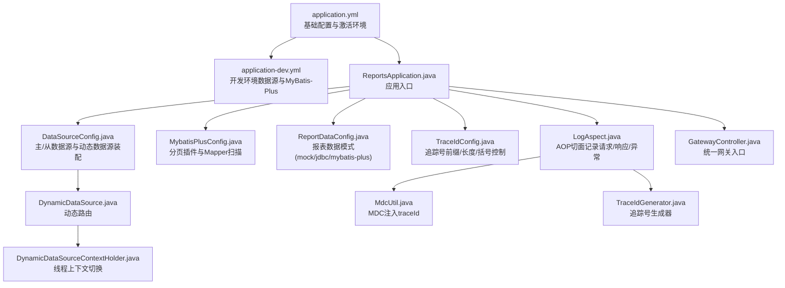
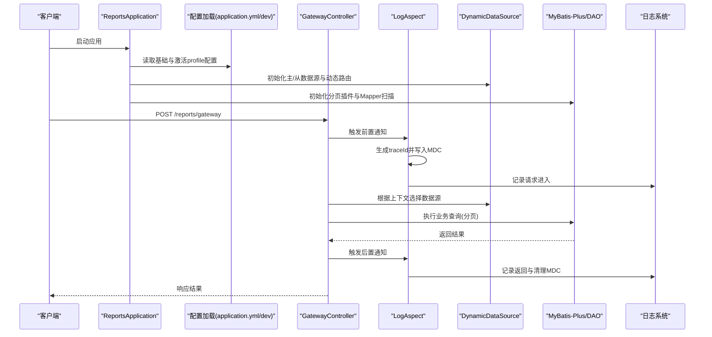
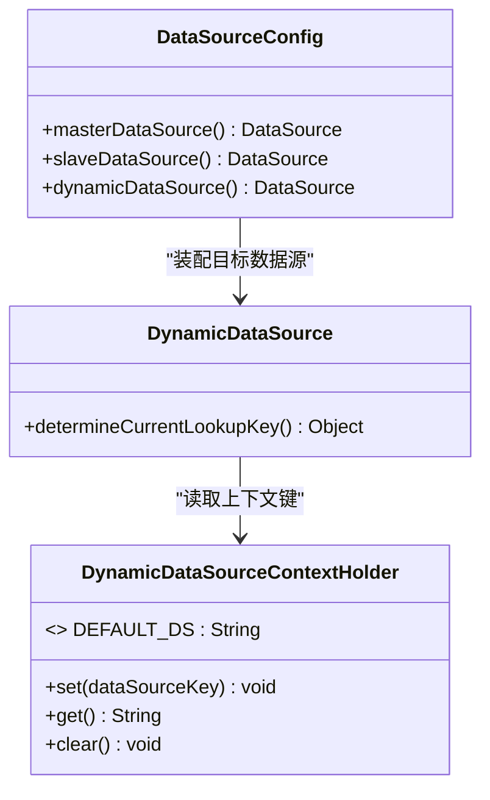
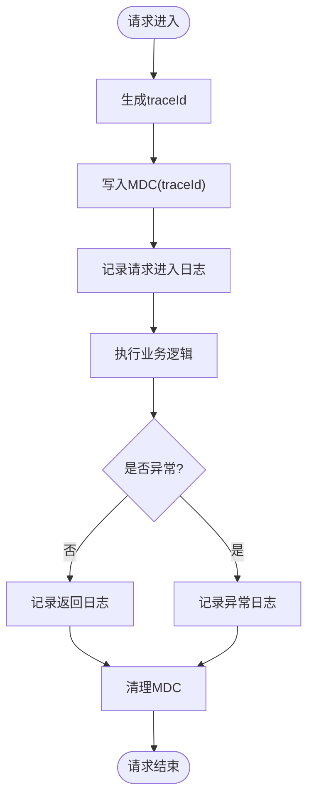
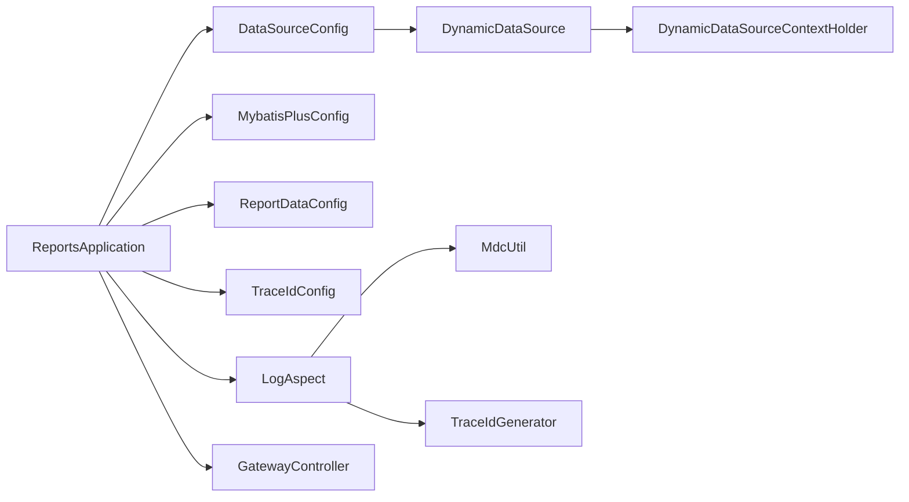

# 部署配置

<cite>
**本文引用的文件**
- [application.yml](file://src/main/resources/application.yml)
- [application-dev.yml](file://src/main/resources/application-dev.yml)
- [pom.xml](file://pom.xml)
- [ReportsApplication.java](file://src/main/java/com/reports/ReportsApplication.java)
- [DataSourceConfig.java](file://src/main/java/com/reports/config/DataSourceConfig.java)
- [DynamicDataSource.java](file://src/main/java/com/reports/config/DynamicDataSource.java)
- [DynamicDataSourceContextHolder.java](file://src/main/java/com/reports/config/DynamicDataSourceContextHolder.java)
- [MybatisPlusConfig.java](file://src/main/java/com/reports/config/MybatisPlusConfig.java)
- [ReportDataConfig.java](file://src/main/java/com/reports/config/ReportDataConfig.java)
- [TraceIdConfig.java](file://src/main/java/com/reports/config/TraceIdConfig.java)
- [LogAspect.java](file://src/main/java/com/reports/aspect/LogAspect.java)
- [MdcUtil.java](file://src/main/java/com/reports/util/MdcUtil.java)
- [TraceIdGenerator.java](file://src/main/java/com/reports/util/TraceIdGenerator.java)
- [GatewayController.java](file://src/main/java/com/reports/controller/GatewayController.java)
</cite>

## 目录
1. [简介](#简介)
2. [项目结构](#项目结构)
3. [核心组件](#核心组件)
4. [架构总览](#架构总览)
5. [详细组件分析](#详细组件分析)
6. [依赖关系分析](#依赖关系分析)
7. [性能考虑](#性能考虑)
8. [故障排查指南](#故障排查指南)
9. [结论](#结论)
10. [附录](#附录)

## 简介
本文件面向运维与开发团队，提供该Spring Boot报表网关服务的完整部署配置说明。内容涵盖配置文件结构与参数含义、数据库连接与数据源切换、日志级别与链路追踪、性能参数调优、多环境配置管理（dev/test/prod）及加载优先级、Docker镜像构建与容器运行参数、以及CI/CD流水线与自动化部署脚本模板建议。

## 项目结构
该项目为标准Spring Boot Maven工程，核心资源位于resources目录，Java源码位于src/main/java。关键配置集中在application.yml与application-{profile}.yml中；数据库连接、动态数据源与MyBatis-Plus配置通过Java配置类实现；日志与链路追踪通过AOP切面与MDC集成。

图表来源
- [application.yml:1-32](file://src/main/resources/application.yml#L1-L32)
- [application-dev.yml:1-45](file://src/main/resources/application-dev.yml#L1-L45)
- [ReportsApplication.java:1-19](file://src/main/java/com/reports/ReportsApplication.java#L1-L19)
- [DataSourceConfig.java:1-56](file://src/main/java/com/reports/config/DataSourceConfig.java#L1-L56)
- [DynamicDataSource.java:1-16](file://src/main/java/com/reports/config/DynamicDataSource.java#L1-L16)
- [DynamicDataSourceContextHolder.java:1-38](file://src/main/java/com/reports/config/DynamicDataSourceContextHolder.java#L1-L38)
- [MybatisPlusConfig.java:1-28](file://src/main/java/com/reports/config/MybatisPlusConfig.java#L1-L28)
- [ReportDataConfig.java:1-45](file://src/main/java/com/reports/config/ReportDataConfig.java#L1-L45)
- [TraceIdConfig.java:1-33](file://src/main/java/com/reports/config/TraceIdConfig.java#L1-L33)
- [LogAspect.java:1-74](file://src/main/java/com/reports/aspect/LogAspect.java#L1-L74)
- [MdcUtil.java:1-34](file://src/main/java/com/reports/util/MdcUtil.java#L1-L34)
- [TraceIdGenerator.java:1-57](file://src/main/java/com/reports/util/TraceIdGenerator.java#L1-L57)
- [GatewayController.java:1-38](file://src/main/java/com/reports/controller/GatewayController.java#L1-L38)

章节来源
- [application.yml:1-32](file://src/main/resources/application.yml#L1-L32)
- [application-dev.yml:1-45](file://src/main/resources/application-dev.yml#L1-L45)
- [ReportsApplication.java:1-19](file://src/main/java/com/reports/ReportsApplication.java#L1-L19)

## 核心组件
- 应用入口与基础配置
  - 应用入口类负责启动Spring Boot应用。
  - 基础配置文件定义服务器端口、上下文路径、应用名与激活的profile。
- 数据库与数据源
  - 使用Druid连接池，支持主/从数据源配置与动态切换。
  - 动态数据源通过线程上下文键值决定当前使用哪个数据源。
- ORM与分页
  - MyBatis-Plus配置启用分页插件与Mapper扫描，适配Oracle方言。
- 报表数据模式
  - 通过配置项控制报表查询走Mock、JDBC或MyBatis-Plus。
- 链路追踪与日志
  - AOP切面在网关层织入请求进入/返回/异常处理，结合MDC输出带traceId的日志。
  - 追踪号可配置前缀、长度与是否包含方括号。

章节来源
- [ReportsApplication.java:1-19](file://src/main/java/com/reports/ReportsApplication.java#L1-L19)
- [application.yml:6-32](file://src/main/resources/application.yml#L6-L32)
- [application-dev.yml:1-45](file://src/main/resources/application-dev.yml#L1-L45)
- [DataSourceConfig.java:14-56](file://src/main/java/com/reports/config/DataSourceConfig.java#L14-L56)
- [DynamicDataSource.java:5-16](file://src/main/java/com/reports/config/DynamicDataSource.java#L5-L16)
- [DynamicDataSourceContextHolder.java:3-38](file://src/main/java/com/reports/config/DynamicDataSourceContextHolder.java#L3-L38)
- [MybatisPlusConfig.java:10-28](file://src/main/java/com/reports/config/MybatisPlusConfig.java#L10-L28)
- [ReportDataConfig.java:8-45](file://src/main/java/com/reports/config/ReportDataConfig.java#L8-L45)
- [TraceIdConfig.java:8-33](file://src/main/java/com/reports/config/TraceIdConfig.java#L8-L33)
- [LogAspect.java:17-74](file://src/main/java/com/reports/aspect/LogAspect.java#L17-L74)
- [MdcUtil.java:8-34](file://src/main/java/com/reports/util/MdcUtil.java#L8-L34)
- [TraceIdGenerator.java:10-57](file://src/main/java/com/reports/util/TraceIdGenerator.java#L10-L57)
- [GatewayController.java:13-38](file://src/main/java/com/reports/controller/GatewayController.java#L13-L38)

## 架构总览
下图展示应用启动到请求处理的关键流程，包括配置加载、数据源选择、ORM执行与日志追踪。

图表来源
- [ReportsApplication.java:14-16](file://src/main/java/com/reports/ReportsApplication.java#L14-L16)
- [application.yml:6-10](file://src/main/resources/application.yml#L6-L10)
- [application-dev.yml:1-45](file://src/main/resources/application-dev.yml#L1-L45)
- [GatewayController.java:28-35](file://src/main/java/com/reports/controller/GatewayController.java#L28-L35)
- [LogAspect.java:42-71](file://src/main/java/com/reports/aspect/LogAspect.java#L42-L71)
- [DynamicDataSource.java:10-13](file://src/main/java/com/reports/config/DynamicDataSource.java#L10-L13)
- [MybatisPlusConfig.java:20-25](file://src/main/java/com/reports/config/MybatisPlusConfig.java#L20-L25)

## 详细组件分析

### 配置文件结构与参数说明
- 基础配置(application.yml)
  - server.port: 应用监听端口
  - server.servlet.context-path: 上下文路径
  - spring.application.name: 应用名称
  - spring.profiles.active: 激活的profile（此处为dev）
  - reports.trace: 追踪号前缀、长度、是否包含方括号
  - reports.data.mode: 报表数据模式（mock/jdbc/mybatis-plus）
  - logging.level: 包级别的日志级别
  - logging.pattern.console: 控制台日志格式，包含traceId占位
- 开发环境配置(application-dev.yml)
  - spring.datasource.master: 主数据源配置（驱动、URL、账号、密码、Druid参数）
  - spring.datasource.slave: 从数据源配置（示例）
  - mybatis-plus.configuration: 日志实现、下划线转驼峰
  - mybatis-plus.mapper-locations: Mapper XML位置

章节来源
- [application.yml:1-32](file://src/main/resources/application.yml#L1-L32)
- [application-dev.yml:1-45](file://src/main/resources/application-dev.yml#L1-L45)

### 数据库连接与数据源切换
- 数据源装配
  - 主/从数据源Bean分别绑定spring.datasource.master与spring.datasource.slave前缀。
  - 动态数据源将主/从数据源注册为目标数据源，并设置默认数据源为master。
- 动态切换机制
  - 通过DynamicDataSourceContextHolder在线程上下文中保存当前数据源键值。
  - DynamicDataSource根据当前键值路由到对应数据源。
- 使用建议
  - 读操作可切换至slave，写操作保持master。
  - 在事务边界内确保数据源一致，避免跨数据源事务。

图表来源
- [DataSourceConfig.java:14-56](file://src/main/java/com/reports/config/DataSourceConfig.java#L14-L56)
- [DynamicDataSource.java:5-16](file://src/main/java/com/reports/config/DynamicDataSource.java#L5-L16)
- [DynamicDataSourceContextHolder.java:3-38](file://src/main/java/com/reports/config/DynamicDataSourceContextHolder.java#L3-L38)

章节来源
- [DataSourceConfig.java:14-56](file://src/main/java/com/reports/config/DataSourceConfig.java#L14-L56)
- [DynamicDataSource.java:5-16](file://src/main/java/com/reports/config/DynamicDataSource.java#L5-L16)
- [DynamicDataSourceContextHolder.java:3-38](file://src/main/java/com/reports/config/DynamicDataSourceContextHolder.java#L3-L38)

### 日志级别与链路追踪
- 日志级别
  - 通过logging.level对包进行细粒度控制，便于开发调试与生产监控。
- 日志格式
  - logging.pattern.console包含traceId占位，便于关联一次请求的全链路日志。
- 链路追踪
  - LogAspect在GatewayController方法上织入，生成traceId并写入MDC。
  - 请求进入、返回与异常均记录，异常时保留堆栈信息。
  - MdcUtil封装MDC的put/get/remove，TraceIdGenerator按配置生成带/不带方括号的追踪号。

图表来源
- [LogAspect.java:42-71](file://src/main/java/com/reports/aspect/LogAspect.java#L42-L71)
- [MdcUtil.java:10-31](file://src/main/java/com/reports/util/MdcUtil.java#L10-L31)
- [TraceIdGenerator.java:29-47](file://src/main/java/com/reports/util/TraceIdGenerator.java#L29-L47)
- [application.yml:25-32](file://src/main/resources/application.yml#L25-L32)

章节来源
- [LogAspect.java:17-74](file://src/main/java/com/reports/aspect/LogAspect.java#L17-L74)
- [MdcUtil.java:8-34](file://src/main/java/com/reports/util/MdcUtil.java#L8-L34)
- [TraceIdGenerator.java:10-57](file://src/main/java/com/reports/util/TraceIdGenerator.java#L10-L57)
- [TraceIdConfig.java:8-33](file://src/main/java/com/reports/config/TraceIdConfig.java#L8-L33)
- [application.yml:25-32](file://src/main/resources/application.yml#L25-L32)

### 性能参数调优
- 连接池参数（Druid）
  - 初始大小、最小空闲、最大活跃、最大等待时间、空闲回收与校验策略等，需结合并发与数据库负载调整。
- ORM与分页
  - MyBatis-Plus分页插件已配置为Oracle方言，建议配合索引与SQL优化。
- 日志输出
  - 生产环境建议提升日志级别，减少不必要的DEBUG/TRACE输出以降低IO开销。

章节来源
- [application-dev.yml:9-38](file://src/main/resources/application-dev.yml#L9-L38)
- [MybatisPlusConfig.java:20-25](file://src/main/java/com/reports/config/MybatisPlusConfig.java#L20-L25)
- [application.yml:25-32](file://src/main/resources/application.yml#L25-L32)

### 多环境配置管理（dev/test/prod）
- 加载顺序与优先级（基于Spring Boot官方约定）
  1) 文件系统中的配置（如外部配置目录）
  2) application-{profile}.yml（resources目录）
  3) application.yml（resources目录）
  4) @PropertySource注解
  5) 系统属性
  6) 操作系统环境变量
- 实践建议
  - 将敏感信息置于操作系统环境变量或外部配置文件，避免提交到版本库。
  - 在容器编排中通过环境变量覆盖application.yml中的默认值。
  - 不同环境仅变更差异部分，公共配置放入application.yml。

章节来源
- [application.yml:6-10](file://src/main/resources/application.yml#L6-L10)
- [application-dev.yml:1-45](file://src/main/resources/application-dev.yml#L1-L45)

### Docker镜像构建与容器运行
- 构建建议
  - 使用多阶段构建减少镜像体积；第一阶段编译打包，第二阶段仅复制可执行jar与JRE。
  - 指定JAVA_OPTS传入JVM参数（如内存、GC、日志级别）。
- 容器运行
  - 通过环境变量覆盖配置：spring.profiles.active、spring.datasource.*、reports.*、logging.*。
  - 映射端口与日志目录，挂载外部配置文件以隔离环境差异。
- 示例命令（概念性）
  - docker build -t reports-gateway .
  - docker run -d --name rgw -p 18089:18089 -e SPRING_PROFILES_ACTIVE=prod reports-gateway

[本节为通用实践说明，未直接分析具体文件，故不附加“章节来源”]

### CI/CD流水线与自动化部署（模板建议）
- 流水线阶段
  - 代码检出 → 依赖安装 → 单元测试 → 代码质量检查 → 构建镜像 → 推送镜像 → 部署到目标环境
- 关键步骤
  - 使用Maven插件构建可执行jar（spring-boot-maven-plugin已在pom中配置）。
  - 使用容器编排平台（如Kubernetes）管理部署，通过ConfigMap/Secret注入配置。
  - 支持蓝绿/金丝雀发布，结合健康检查与回滚策略。
- 自动化脚本模板（概念性）
  - 构建脚本：设置JAVA_OPTS、执行mvn clean package、生成Docker镜像、推送仓库。
  - 部署脚本：拉取最新镜像、更新编排配置、滚动重启、健康检查。

[本节为通用实践说明，未直接分析具体文件，故不附加“章节来源”]

## 依赖关系分析
- 组件耦合
  - DataSourceConfig与DynamicDataSource强耦合，共同完成数据源装配与路由。
  - LogAspect与MdcUtil/TraceIdGenerator存在运行期协作，保证日志可追踪。
  - MybatisPlusConfig与Mapper接口解耦，通过注解扫描加载。
- 外部依赖
  - Oracle驱动、Druid连接池、MyBatis-Plus Starter、AOP与Validation Starter等。

图表来源
- [ReportsApplication.java:11-16](file://src/main/java/com/reports/ReportsApplication.java#L11-L16)
- [DataSourceConfig.java:17-53](file://src/main/java/com/reports/config/DataSourceConfig.java#L17-L53)
- [DynamicDataSource.java:8-15](file://src/main/java/com/reports/config/DynamicDataSource.java#L8-L15)
- [DynamicDataSourceContextHolder.java:6-37](file://src/main/java/com/reports/config/DynamicDataSourceContextHolder.java#L6-L37)
- [MybatisPlusConfig.java:13-27](file://src/main/java/com/reports/config/MybatisPlusConfig.java#L13-L27)
- [ReportDataConfig.java:12-44](file://src/main/java/com/reports/config/ReportDataConfig.java#L12-L44)
- [TraceIdConfig.java:11-32](file://src/main/java/com/reports/config/TraceIdConfig.java#L11-L32)
- [LogAspect.java:20-30](file://src/main/java/com/reports/aspect/LogAspect.java#L20-L30)
- [MdcUtil.java:8-33](file://src/main/java/com/reports/util/MdcUtil.java#L8-L33)
- [TraceIdGenerator.java:13-24](file://src/main/java/com/reports/util/TraceIdGenerator.java#L13-L24)
- [GatewayController.java:16-26](file://src/main/java/com/reports/controller/GatewayController.java#L16-L26)

章节来源
- [pom.xml:26-98](file://pom.xml#L26-L98)

## 性能考虑
- 连接池
  - 合理设置初始/最小/最大连接数与等待超时，避免高并发下的连接争用。
- 查询优化
  - 结合分页插件与索引设计，避免全表扫描；必要时缓存热点数据。
- 日志
  - 生产环境降低日志级别，避免过多I/O；控制台格式包含traceId便于问题定位。
- JVM参数
  - 通过JAVA_OPTS设置堆大小、GC策略与线程栈大小，结合容器资源限制。

[本节提供通用指导，未直接分析具体文件，故不附加“章节来源”]

## 故障排查指南
- 数据库连接失败
  - 检查spring.datasource.master/slave的URL、用户名、密码与驱动类。
  - 查看Druid监控与连接池状态，确认max-wait与max-active是否合理。
- 动态数据源切换无效
  - 确认在业务开始前设置了正确的数据源键值，在事务结束或异常后清理上下文。
- 日志无traceId
  - 检查LogAspect是否生效、MDC是否正确写入与清理、日志格式pattern是否包含traceId占位。
- 报表数据模式不生效
  - 确认reports.data.mode配置正确且ReportDataConfig被Spring管理。

章节来源
- [application-dev.yml:2-38](file://src/main/resources/application-dev.yml#L2-L38)
- [DynamicDataSourceContextHolder.java:18-35](file://src/main/java/com/reports/config/DynamicDataSourceContextHolder.java#L18-L35)
- [LogAspect.java:42-71](file://src/main/java/com/reports/aspect/LogAspect.java#L42-L71)
- [ReportDataConfig.java:16-42](file://src/main/java/com/reports/config/ReportDataConfig.java#L16-L42)

## 结论
本部署配置文档梳理了该Spring Boot报表网关的核心配置与运行机制，明确了多环境配置加载优先级、数据源动态切换、链路追踪与日志规范、性能调优要点，并给出了Docker与CI/CD落地建议。建议在生产环境中严格区分配置来源，强化安全与可观测性，持续优化数据库与查询性能。

## 附录
- Maven构建与打包
  - 已内置spring-boot-maven-plugin，可通过mvn package生成可执行jar。
- 启动参数建议
  - JAVA_OPTS可设置内存、GC、日志级别与JMX等参数。
- 环境变量映射
  - 通过SPRING_PROFILES_ACTIVE、spring.datasource.*、reports.*、logging.*等覆盖默认配置。

章节来源
- [pom.xml:100-107](file://pom.xml#L100-L107)
- [application.yml:6-10](file://src/main/resources/application.yml#L6-L10)