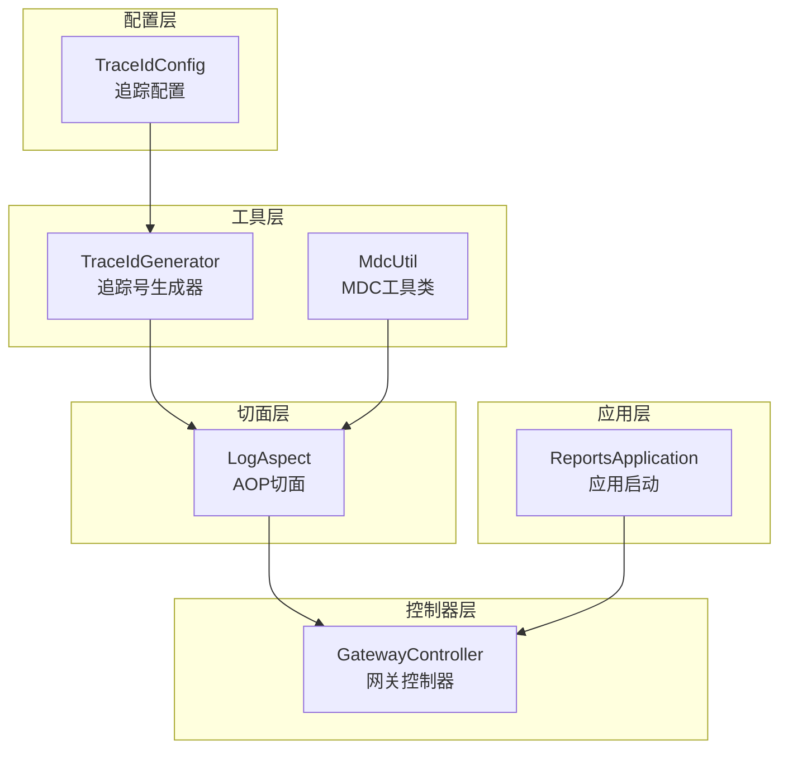
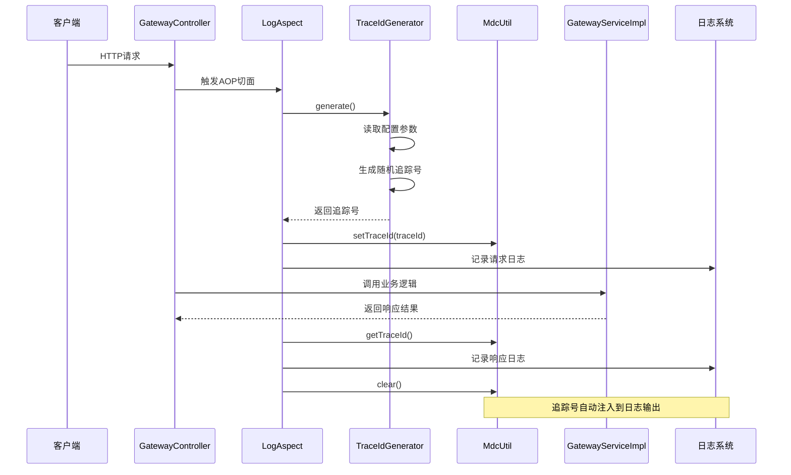
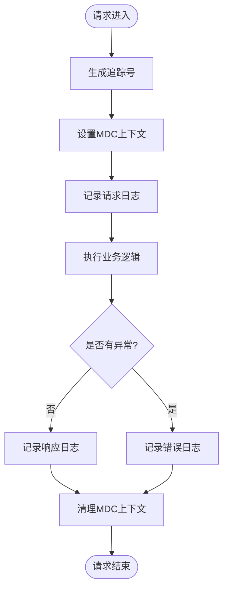
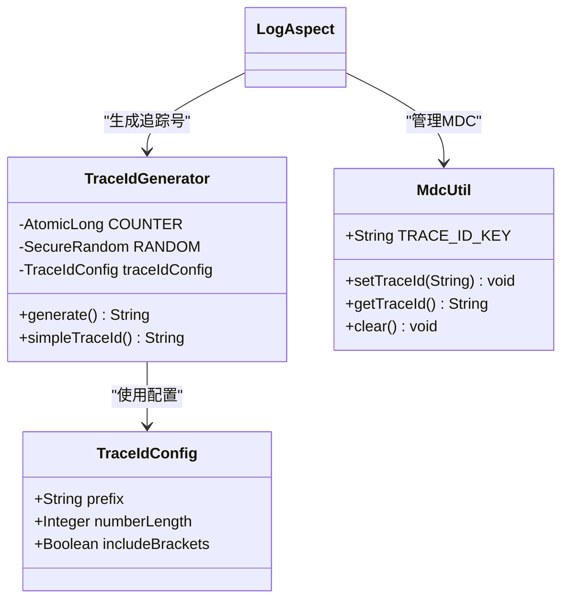
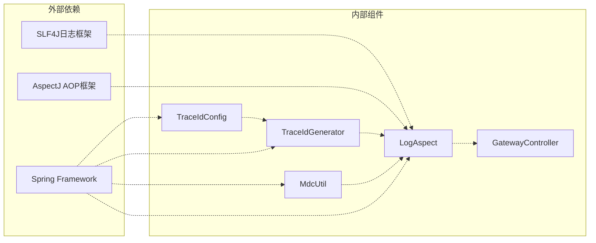

# AOP追踪配置

<cite>
**本文档引用的文件**
- [TraceIdConfig.java](file://src/main/java/com/reports/config/TraceIdConfig.java)
- [TraceIdGenerator.java](file://src/main/java/com/reports/util/TraceIdGenerator.java)
- [MdcUtil.java](file://src/main/java/com/reports/util/MdcUtil.java)
- [LogAspect.java](file://src/main/java/com/reports/aspect/LogAspect.java)
- [application.yml](file://src/main/resources/application.yml)
- [GatewayController.java](file://src/main/java/com/reports/controller/GatewayController.java)
- [GatewayServiceImpl.java](file://src/main/java/com/reports/service/impl/GatewayServiceImpl.java)
- [ReportsApplication.java](file://src/main/java/com/reports/ReportsApplication.java)
</cite>

## 目录
1. [简介](#简介)
2. [项目结构](#项目结构)
3. [核心组件](#核心组件)
4. [架构概览](#架构概览)
5. [详细组件分析](#详细组件分析)
6. [依赖分析](#依赖分析)
7. [性能考虑](#性能考虑)
8. [故障排除指南](#故障排除指南)
9. [结论](#结论)

## 简介

本文件详细说明了基于Spring AOP的日志追踪配置实现，重点涵盖TraceIdConfig链路追踪配置、TraceIdGenerator追踪号生成器以及MDC（Mapped Diagnostic Context）的使用。文档将解释追踪号生成算法和规则，包括前缀设置、数字长度、格式化选项等，并提供AOP切面配置和拦截规则的完整说明。同时包含追踪配置的验证方法、调试技巧、分布式追踪最佳实践和性能考虑。

## 项目结构

该项目采用标准的Spring Boot项目结构，追踪功能主要分布在以下模块：
- 配置层：TraceIdConfig负责追踪配置管理
- 工具层：TraceIdGenerator和MdcUtil提供追踪号生成和MDC操作
- 切面层：LogAspect实现AOP拦截和日志记录
- 控制器层：GatewayController处理统一网关入口
- 应用启动：ReportsApplication启动Spring Boot应用

**图表来源**
- [TraceIdConfig.java:1-33](file://src/main/java/com/reports/config/TraceIdConfig.java#L1-L33)
- [TraceIdGenerator.java:1-57](file://src/main/java/com/reports/util/TraceIdGenerator.java#L1-L57)
- [MdcUtil.java:1-34](file://src/main/java/com/reports/util/MdcUtil.java#L1-L34)
- [LogAspect.java:1-74](file://src/main/java/com/reports/aspect/LogAspect.java#L1-L74)
- [GatewayController.java:1-38](file://src/main/java/com/reports/controller/GatewayController.java#L1-L38)
- [ReportsApplication.java:1-19](file://src/main/java/com/reports/ReportsApplication.java#L1-L19)

**章节来源**
- [ReportsApplication.java:1-19](file://src/main/java/com/reports/ReportsApplication.java#L1-L19)
- [application.yml:1-32](file://src/main/resources/application.yml#L1-L32)

## 核心组件

### TraceIdConfig配置类

TraceIdConfig是追踪配置的核心类，通过@ConfigurationProperties注解从application.yml中读取配置信息。

**主要配置项：**
- **prefix（前缀）**：默认值为"YQ"，用于标识追踪号的业务类型
- **numberLength（数字长度）**：默认值为9，控制随机数字部分的位数
- **includeBrackets（方括号）**：默认值为true，决定是否在追踪号周围添加方括号

这些配置项直接影响追踪号的生成格式和显示效果。

**章节来源**
- [TraceIdConfig.java:11-32](file://src/main/java/com/reports/config/TraceIdConfig.java#L11-L32)
- [application.yml:12-20](file://src/main/resources/application.yml#L12-L20)

### TraceIdGenerator追踪号生成器

TraceIdGenerator实现了两种追踪号生成策略：

**策略一：完整追踪号生成**
- 基于配置的前缀、数字长度和格式化选项
- 使用SecureRandom确保随机性
- 支持可选的方括号包装

**策略二：简单追踪号生成**
- 基于时间戳和原子计数器的组合
- 适用于内部系统间通信
- 不包含前缀和格式化装饰

**章节来源**
- [TraceIdGenerator.java:13-56](file://src/main/java/com/reports/util/TraceIdGenerator.java#L13-L56)

### MdcUtil MDC工具类

MdcUtil封装了SLF4J MDC的操作，提供线程安全的追踪号管理：

**核心功能：**
- **setTraceId**：将追踪号放入当前线程的MDC上下文中
- **getTraceId**：从MDC中获取当前线程的追踪号
- **clear**：清理MDC中的追踪号，防止内存泄漏

MDC确保每个线程的追踪号独立管理，避免多线程环境下的数据污染。

**章节来源**
- [MdcUtil.java:8-33](file://src/main/java/com/reports/util/MdcUtil.java#L8-L33)

## 架构概览

整个追踪系统采用分层架构设计，通过AOP切面实现横切关注点，确保追踪功能与业务逻辑分离。

**图表来源**
- [LogAspect.java:42-71](file://src/main/java/com/reports/aspect/LogAspect.java#L42-L71)
- [TraceIdGenerator.java:29-47](file://src/main/java/com/reports/util/TraceIdGenerator.java#L29-L47)
- [MdcUtil.java:15-31](file://src/main/java/com/reports/util/MdcUtil.java#L15-L31)

## 详细组件分析

### AOP切面配置

LogAspect实现了完整的请求生命周期追踪：

**切点定义：**
- 拦截com.reports.controller.GatewayController包下所有公共方法
- 精确匹配网关控制器的所有接口方法

**拦截时机：**
- **@Before**：请求进入时生成追踪号并记录请求信息
- **@AfterReturning**：正常响应时记录返回结果并清理上下文
- **@AfterThrowing**：异常时记录错误信息并清理上下文

**日志格式：**
- 使用MDC中的traceId键自动注入追踪号
- 格式化输出包含类名、方法名和参数信息

**图表来源**
- [LogAspect.java:35-71](file://src/main/java/com/reports/aspect/LogAspect.java#L35-L71)

**章节来源**
- [LogAspect.java:20-74](file://src/main/java/com/reports/aspect/LogAspect.java#L20-L74)

### 追踪号生成算法

TraceIdGenerator的生成算法具有以下特点：

**算法流程：**
1. 读取配置参数（前缀、长度、格式化选项）
2. 生成指定长度的随机数字序列
3. 组合前缀和数字序列
4. 根据配置决定是否添加方括号包装

**复杂度分析：**
- 时间复杂度：O(n)，其中n为数字长度
- 空间复杂度：O(n)，用于存储追踪号字符串
- 随机性：使用SecureRandom确保高质量随机数

**格式化规则：**
- 前缀必须符合字母组合+数字的规范
- 数字长度可配置，默认9位
- 方括号可选，便于日志识别

**图表来源**
- [TraceIdConfig.java:15-31](file://src/main/java/com/reports/config/TraceIdConfig.java#L15-L31)
- [TraceIdGenerator.java:14-24](file://src/main/java/com/reports/util/TraceIdGenerator.java#L14-L24)
- [MdcUtil.java:10-31](file://src/main/java/com/reports/util/MdcUtil.java#L10-L31)

**章节来源**
- [TraceIdGenerator.java:10-56](file://src/main/java/com/reports/util/TraceIdGenerator.java#L10-L56)

### MDC集成机制

MDC（Mapped Diagnostic Context）提供了线程级别的上下文存储：

**工作原理：**
- 每个线程维护独立的MDC映射表
- 追踪号作为键值对存储在当前线程上下文中
- SLF4J日志框架自动注入MDC中的值到日志输出

**内存管理：**
- 在请求结束时必须清理MDC，防止线程池复用导致的数据泄漏
- Spring AOP确保异常和正常路径都能正确清理上下文

**章节来源**
- [MdcUtil.java:8-33](file://src/main/java/com/reports/util/MdcUtil.java#L8-L33)
- [LogAspect.java:56-71](file://src/main/java/com/reports/aspect/LogAspect.java#L56-L71)

## 依赖分析

追踪系统的依赖关系清晰明确，遵循单一职责原则：

**图表来源**
- [TraceIdConfig.java:14](file://src/main/java/com/reports/config/TraceIdConfig.java#L14)
- [TraceIdGenerator.java:22](file://src/main/java/com/reports/util/TraceIdGenerator.java#L22)
- [LogAspect.java:28](file://src/main/java/com/reports/aspect/LogAspect.java#L28)

**依赖特性：**
- **低耦合**：各组件职责明确，相互依赖最小化
- **高内聚**：每个组件专注于特定功能领域
- **线程安全**：MDC天然支持多线程环境
- **可配置性**：通过配置文件灵活调整行为

**章节来源**
- [application.yml:12-31](file://src/main/resources/application.yml#L12-L31)

## 性能考虑

### 内存使用优化

**MDC内存管理：**
- 每个线程的MDC映射表大小有限
- 建议在请求结束时及时清理，避免长期占用
- 对于高并发场景，注意监控MDC内存使用情况

**追踪号生成开销：**
- SecureRandom初始化成本较高，但只在生成时使用
- 原子计数器simpleTraceId方法开销极小
- 建议根据业务需求选择合适的生成策略

### 日志性能影响

**异步日志：**
- 建议使用异步日志框架减少阻塞
- 合理配置日志队列大小和丢弃策略
- 对高频接口考虑采样记录

**日志级别控制：**
- 生产环境建议使用INFO级别
- 开发环境可使用TRACE级别进行详细追踪
- 避免在热路径中使用DEBUG级别

## 故障排除指南

### 常见问题诊断

**追踪号未显示：**
1. 检查application.yml中的日志模式配置
2. 确认MDC键名是否正确（traceId）
3. 验证AOP切面是否正确拦截目标方法

**追踪号重复：**
1. 检查TraceIdConfig配置是否正确
2. 确认随机数生成器初始化状态
3. 验证数字长度配置是否合理

**内存泄漏排查：**
1. 检查AOP切面的清理逻辑
2. 确认异常路径也能执行清理
3. 监控线程池复用时的MDC状态

### 调试技巧

**开发环境调试：**
- 启用TRACE级别日志查看更多细节
- 使用简单追踪号进行内部通信测试
- 验证不同配置组合的效果

**生产环境监控：**
- 监控日志中追踪号的分布情况
- 分析请求延迟与追踪号的关系
- 建立基于追踪号的错误追踪机制

**配置验证方法：**
1. 通过单元测试验证追踪号生成逻辑
2. 使用集成测试验证AOP切面拦截效果
3. 创建专门的测试接口验证MDC集成

**章节来源**
- [application.yml:25-31](file://src/main/resources/application.yml#L25-L31)
- [LogAspect.java:42-71](file://src/main/java/com/reports/aspect/LogAspect.java#L42-L71)

## 结论

本追踪系统通过精心设计的配置、生成器和工具类，实现了高效、可靠的链路追踪功能。关键优势包括：

**技术优势：**
- **配置灵活**：通过application.yml轻松调整追踪行为
- **线程安全**：MDC天然支持多线程环境
- **AOP集成**：横切关注点实现业务逻辑解耦
- **性能友好**：合理的算法设计和内存管理

**最佳实践建议：**
- 在生产环境中使用合理的日志级别
- 建立完善的监控和告警机制
- 定期审查追踪配置的有效性
- 考虑分布式环境下的追踪号唯一性

该系统为后续扩展分布式追踪奠定了良好基础，可通过引入Zipkin、Jaeger等分布式追踪系统进一步完善。