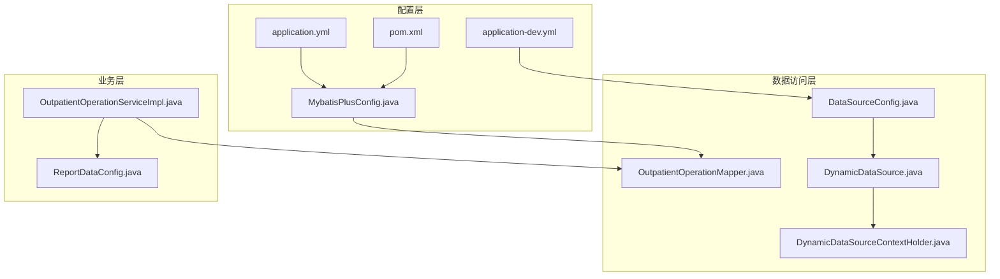
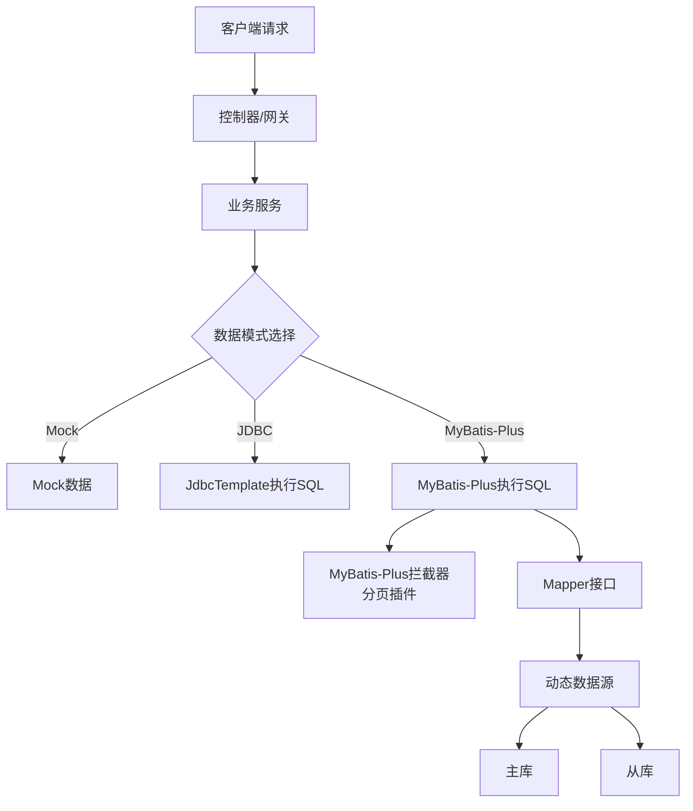
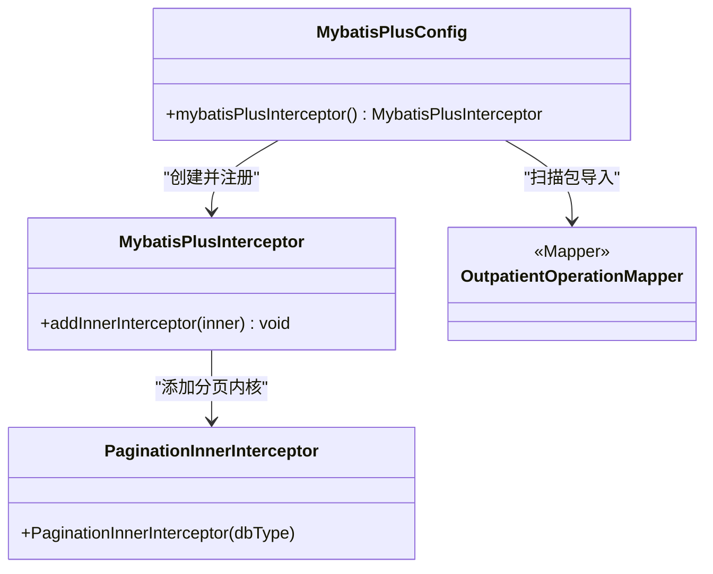
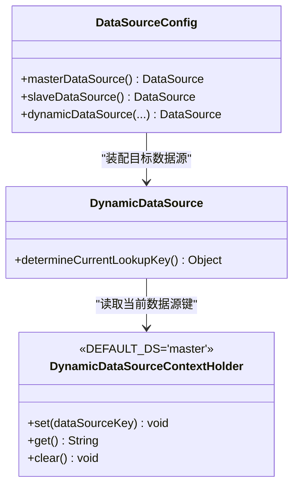
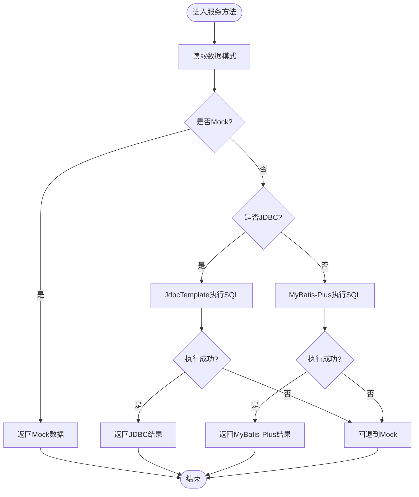
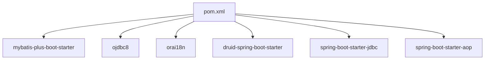

# MyBatis配置

<cite>
**本文引用的文件**
- [MybatisPlusConfig.java](file://src/main/java/com/reports/config/MybatisPlusConfig.java)
- [application.yml](file://src/main/resources/application.yml)
- [application-dev.yml](file://src/main/resources/application-dev.yml)
- [pom.xml](file://pom.xml)
- [OutpatientOperationMapper.java](file://src/main/java/com/reports/mapper/OutpatientOperationMapper.java)
- [OutpatientOperationServiceImpl.java](file://src/main/java/com/reports/service/impl/OutpatientOperationServiceImpl.java)
- [ReportDataConfig.java](file://src/main/java/com/reports/config/ReportDataConfig.java)
- [DataSourceConfig.java](file://src/main/java/com/reports/config/DataSourceConfig.java)
- [DynamicDataSource.java](file://src/main/java/com/reports/config/DynamicDataSource.java)
- [DynamicDataSourceContextHolder.java](file://src/main/java/com/reports/config/DynamicDataSourceContextHolder.java)
</cite>

## 目录
1. [简介](#简介)
2. [项目结构](#项目结构)
3. [核心组件](#核心组件)
4. [架构总览](#架构总览)
5. [详细组件分析](#详细组件分析)
6. [依赖分析](#依赖分析)
7. [性能考虑](#性能考虑)
8. [故障排查指南](#故障排查指南)
9. [结论](#结论)
10. [附录](#附录)

## 简介
本文件面向MyBatis-Plus在本项目的配置与使用，重点覆盖以下方面：
- MyBatis-Plus拦截器与分页插件配置
- 实体扫描包与Mapper位置配置
- MyBatis日志与命名策略配置
- 数据源多数据源配置与动态路由
- MyBatis-Plus全局配置项（如逻辑删除、自动填充）的扩展建议
- 配置验证与调试方法
- 性能优化与常见问题处理

## 项目结构
本项目采用Spring Boot标准目录结构，MyBatis-Plus相关配置集中在config包中，并通过application.yml与application-dev.yml进行环境化配置。

**图表来源**
- [MybatisPlusConfig.java:1-28](file://src/main/java/com/reports/config/MybatisPlusConfig.java#L1-L28)
- [application.yml:1-32](file://src/main/resources/application.yml#L1-L32)
- [application-dev.yml:1-45](file://src/main/resources/application-dev.yml#L1-L45)
- [pom.xml:1-110](file://pom.xml#L1-L110)
- [OutpatientOperationMapper.java:1-31](file://src/main/java/com/reports/mapper/OutpatientOperationMapper.java#L1-L31)
- [DataSourceConfig.java:1-55](file://src/main/java/com/reports/config/DataSourceConfig.java#L1-L55)
- [DynamicDataSource.java:1-16](file://src/main/java/com/reports/config/DynamicDataSource.java#L1-L16)
- [DynamicDataSourceContextHolder.java:1-37](file://src/main/java/com/reports/config/DynamicDataSourceContextHolder.java#L1-L37)
- [OutpatientOperationServiceImpl.java:1-253](file://src/main/java/com/reports/service/impl/OutpatientOperationServiceImpl.java#L1-L253)
- [ReportDataConfig.java:1-45](file://src/main/java/com/reports/config/ReportDataConfig.java#L1-L45)

**章节来源**
- [MybatisPlusConfig.java:1-28](file://src/main/java/com/reports/config/MybatisPlusConfig.java#L1-L28)
- [application.yml:1-32](file://src/main/resources/application.yml#L1-L32)
- [application-dev.yml:1-45](file://src/main/resources/application-dev.yml#L1-L45)
- [pom.xml:1-110](file://pom.xml#L1-L110)

## 核心组件
- MyBatis-Plus配置类：负责注册分页插件与Mapper扫描包。
- 应用配置：定义MyBatis-Plus配置项、Mapper XML路径、日志实现与驼峰映射。
- 数据源配置：主从数据源与动态路由，支持读写分离场景。
- 服务层：演示三种数据获取模式（Mock/JDBC/MyBatis-Plus），便于验证配置效果。

**章节来源**
- [MybatisPlusConfig.java:10-27](file://src/main/java/com/reports/config/MybatisPlusConfig.java#L10-L27)
- [application-dev.yml:40-44](file://src/main/resources/application-dev.yml#L40-L44)
- [DataSourceConfig.java:17-55](file://src/main/java/com/reports/config/DataSourceConfig.java#L17-L55)
- [OutpatientOperationServiceImpl.java:21-73](file://src/main/java/com/reports/service/impl/OutpatientOperationServiceImpl.java#L21-L73)

## 架构总览
下图展示了MyBatis-Plus在系统中的装配与调用关系：

**图表来源**
- [OutpatientOperationServiceImpl.java:47-73](file://src/main/java/com/reports/service/impl/OutpatientOperationServiceImpl.java#L47-L73)
- [MybatisPlusConfig.java:20-25](file://src/main/java/com/reports/config/MybatisPlusConfig.java#L20-L25)
- [DataSourceConfig.java:41-53](file://src/main/java/com/reports/config/DataSourceConfig.java#L41-L53)
- [DynamicDataSource.java:8-15](file://src/main/java/com/reports/config/DynamicDataSource.java#L8-L15)

## 详细组件分析

### MyBatis-Plus配置组件
- 分页插件：注册MyBatis-Plus拦截器，并添加针对Oracle的分页内核。
- Mapper扫描：指定Mapper接口所在的基础包，确保自动注入生效。
- 全局配置：通过application-dev.yml设置日志实现、驼峰映射与Mapper XML路径。

**图表来源**
- [MybatisPlusConfig.java:14-25](file://src/main/java/com/reports/config/MybatisPlusConfig.java#L14-L25)
- [OutpatientOperationMapper.java:14-14](file://src/main/java/com/reports/mapper/OutpatientOperationMapper.java#L14-L14)

**章节来源**
- [MybatisPlusConfig.java:10-27](file://src/main/java/com/reports/config/MybatisPlusConfig.java#L10-L27)
- [application-dev.yml:40-44](file://src/main/resources/application-dev.yml#L40-L44)

### 数据源与动态路由
- 多数据源：定义master与slave两个Druid数据源，分别对应主库与从库。
- 动态路由：通过DynamicDataSource与上下文持有者实现按线程切换数据源。
- 默认策略：未显式设置时，默认使用master数据源。

**图表来源**
- [DataSourceConfig.java:18-53](file://src/main/java/com/reports/config/DataSourceConfig.java#L18-L53)
- [DynamicDataSource.java:8-15](file://src/main/java/com/reports/config/DynamicDataSource.java#L8-L15)
- [DynamicDataSourceContextHolder.java:6-37](file://src/main/java/com/reports/config/DynamicDataSourceContextHolder.java#L6-L37)

**章节来源**
- [DataSourceConfig.java:17-55](file://src/main/java/com/reports/config/DataSourceConfig.java#L17-L55)
- [DynamicDataSource.java:1-16](file://src/main/java/com/reports/config/DynamicDataSource.java#L1-L16)
- [DynamicDataSourceContextHolder.java:1-37](file://src/main/java/com/reports/config/DynamicDataSourceContextHolder.java#L1-L37)

### 服务层数据模式与MyBatis-Plus集成点
- 数据模式：通过ReportDataConfig控制使用Mock、JDBC或MyBatis-Plus模式。
- MyBatis-Plus模式：当前示例中保留了注释说明，展示如何使用Page与QueryWrapper进行分页与条件查询。
- 调试与回退：当JDBC或MyBatis-Plus异常时，会回退到Mock数据，便于定位问题。

**图表来源**
- [OutpatientOperationServiceImpl.java:47-73](file://src/main/java/com/reports/service/impl/OutpatientOperationServiceImpl.java#L47-L73)
- [ReportDataConfig.java:16-42](file://src/main/java/com/reports/config/ReportDataConfig.java#L16-L42)

**章节来源**
- [OutpatientOperationServiceImpl.java:21-73](file://src/main/java/com/reports/service/impl/OutpatientOperationServiceImpl.java#L21-L73)
- [ReportDataConfig.java:1-45](file://src/main/java/com/reports/config/ReportDataConfig.java#L1-L45)

## 依赖分析
- MyBatis-Plus版本：在pom.xml中声明为3.5.7，确保与Spring Boot版本兼容。
- Oracle驱动与国际化支持：引入ojdbc8与orai18n以适配Oracle数据库。
- Druid连接池：通过druid-spring-boot-starter简化连接池配置。
- JDBC与AOP：为动态数据源与事务管理提供基础能力。

**图表来源**
- [pom.xml:23-82](file://pom.xml#L23-L82)

**章节来源**
- [pom.xml:1-110](file://pom.xml#L1-L110)

## 性能考虑
- 分页策略：已启用Oracle分页内核，建议在复杂查询中配合索引与LIMIT策略，避免全表扫描。
- 日志输出：开发环境开启StdOut日志实现，便于观察SQL与参数；生产环境建议调整为更轻量的日志实现。
- 连接池参数：根据业务并发与响应时间目标，调优Druid连接池的初始大小、最大活跃数与等待超时。
- 命名策略：开启下划线转驼峰映射，减少手工映射成本，提升可维护性。
- 动态数据源：在读多写少场景下，将只读查询路由至从库，降低主库压力。

[本节为通用指导，无需列出具体文件来源]

## 故障排查指南
- 分页不生效
  - 检查是否正确注册MyBatis-Plus拦截器与分页内核。
  - 确认Mapper扫描包是否包含目标接口。
  - 参考：[MybatisPlusConfig.java:14-25](file://src/main/java/com/reports/config/MybatisPlusConfig.java#L14-L25)，[application-dev.yml:40-44](file://src/main/resources/application-dev.yml#L40-L44)
- SQL日志未输出
  - 确认mybatis-plus.configuration.log-impl配置正确。
  - 参考：[application-dev.yml:41-42](file://src/main/resources/application-dev.yml#L41-L42)
- 数据源切换无效
  - 确认在业务线程中设置了正确的数据源键并在调用后清理。
  - 参考：[DynamicDataSourceContextHolder.java:18-35](file://src/main/java/com/reports/config/DynamicDataSourceContextHolder.java#L18-L35)，[DynamicDataSource.java:10-13](file://src/main/java/com/reports/config/DynamicDataSource.java#L10-L13)
- 读写分离未生效
  - 检查DataSourceConfig中targetDataSources与defaultTargetDataSource配置。
  - 参考：[DataSourceConfig.java:41-53](file://src/main/java/com/reports/config/DataSourceConfig.java#L41-L53)
- MyBatis-Plus模式无法使用
  - 当前服务层示例中MyBatis-Plus分支仍回退到Mock，检查实体类与Mapper是否完善后再启用。
  - 参考：[OutpatientOperationServiceImpl.java:216-241](file://src/main/java/com/reports/service/impl/OutpatientOperationServiceImpl.java#L216-L241)

**章节来源**
- [MybatisPlusConfig.java:14-25](file://src/main/java/com/reports/config/MybatisPlusConfig.java#L14-L25)
- [application-dev.yml:40-44](file://src/main/resources/application-dev.yml#L40-L44)
- [DynamicDataSourceContextHolder.java:18-35](file://src/main/java/com/reports/config/DynamicDataSourceContextHolder.java#L18-L35)
- [DynamicDataSource.java:10-13](file://src/main/java/com/reports/config/DynamicDataSource.java#L10-L13)
- [DataSourceConfig.java:41-53](file://src/main/java/com/reports/config/DataSourceConfig.java#L41-L53)
- [OutpatientOperationServiceImpl.java:216-241](file://src/main/java/com/reports/service/impl/OutpatientOperationServiceImpl.java#L216-L241)

## 结论
本项目对MyBatis-Plus的配置较为简洁，重点在于：
- 正确注册分页插件与Mapper扫描包
- 明确的环境化配置（日志、命名策略、Mapper XML路径）
- 完整的多数据源与动态路由方案
- 服务层对多种数据模式的支持，便于配置验证与问题定位

后续可在现有基础上扩展MyBatis-Plus全局配置（如逻辑删除、自动填充、类型处理器等），以满足更复杂的业务需求。

[本节为总结性内容，无需列出具体文件来源]

## 附录

### MyBatis-Plus全局配置清单与建议
- 逻辑删除
  - 建议在实体类上使用注解标注逻辑删除字段，并在全局配置中启用。
  - 参考：实体类字段与全局配置项的组合使用。
- 自动填充
  - 建议在实体类中使用自动填充注解，并在全局配置中注册对应的元对象处理器。
  - 参考：实体类字段与全局配置项的组合使用。
- 类型处理器
  - 若存在特殊字段类型（如JSON、枚举），建议在全局配置中注册自定义TypeHandler。
  - 参考：全局配置中的type-handlers-package或手动注册方式。
- 全局配置项参考
  - map-underscore-to-camel-case：已启用驼峰映射。
  - log-impl：已配置日志实现。
  - mapper-locations：已配置Mapper XML路径。
  - 参考：[application-dev.yml:40-44](file://src/main/resources/application-dev.yml#L40-L44)

**章节来源**
- [application-dev.yml:40-44](file://src/main/resources/application-dev.yml#L40-L44)