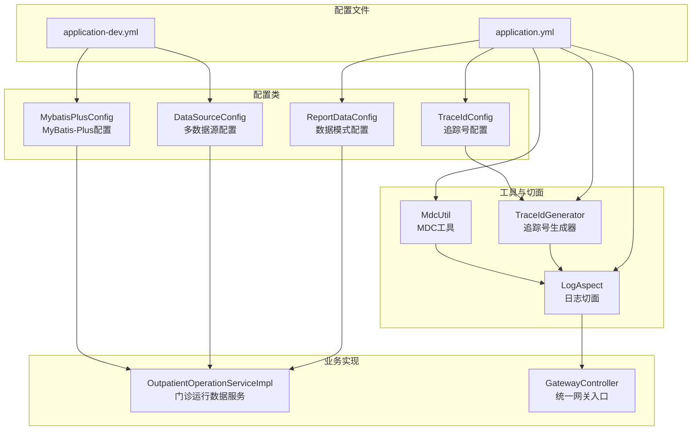
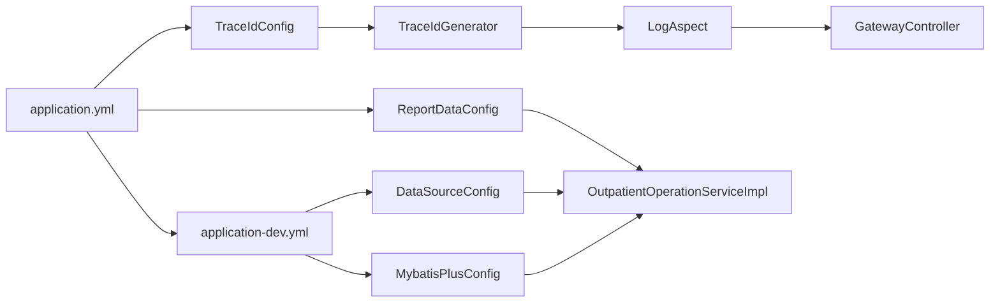
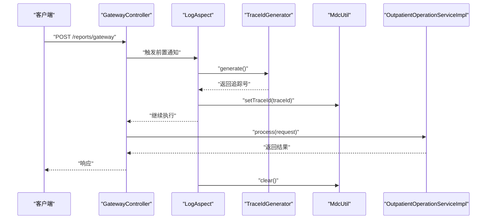
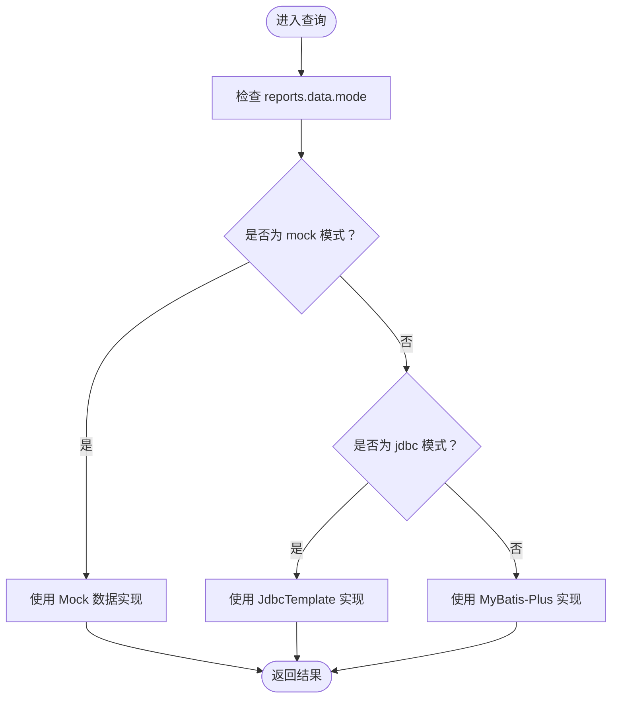
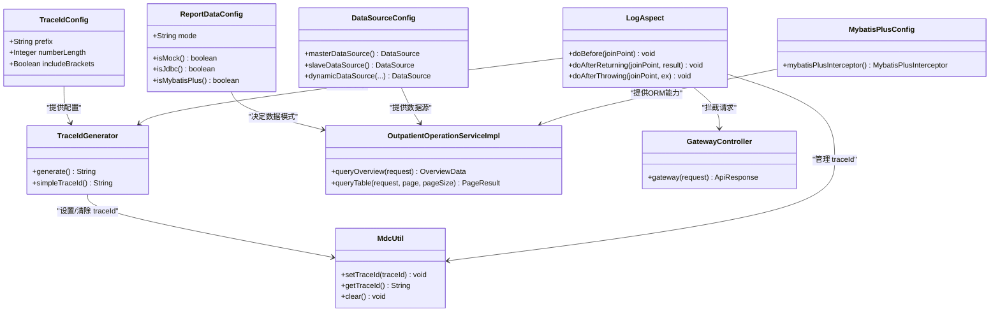

# 应用配置

<cite>
**本文档引用的文件**
- [application.yml](file://src/main/resources/application.yml)
- [application-dev.yml](file://src/main/resources/application-dev.yml)
- [TraceIdConfig.java](file://src/main/java/com/reports/config/TraceIdConfig.java)
- [ReportDataConfig.java](file://src/main/java/com/reports/config/ReportDataConfig.java)
- [TraceIdGenerator.java](file://src/main/java/com/reports/util/TraceIdGenerator.java)
- [MdcUtil.java](file://src/main/java/com/reports/util/MdcUtil.java)
- [LogAspect.java](file://src/main/java/com/reports/aspect/LogAspect.java)
- [DataSourceConfig.java](file://src/main/java/com/reports/config/DataSourceConfig.java)
- [DynamicDataSource.java](file://src/main/java/com/reports/config/DynamicDataSource.java)
- [MybatisPlusConfig.java](file://src/main/java/com/reports/config/MybatisPlusConfig.java)
- [OutpatientOperationServiceImpl.java](file://src/main/java/com/reports/service/impl/OutpatientOperationServiceImpl.java)
- [GatewayController.java](file://src/main/java/com/reports/controller/GatewayController.java)
</cite>

## 目录
1. [简介](#简介)
2. [项目结构](#项目结构)
3. [核心配置组件](#核心配置组件)
4. [架构总览](#架构总览)
5. [详细配置分析](#详细配置分析)
6. [依赖关系分析](#依赖关系分析)
7. [性能考虑](#性能考虑)
8. [故障排查指南](#故障排查指南)
9. [结论](#结论)

## 简介
本文件面向应用配置的使用者与维护者，系统性梳理并解释以下配置主题：
- application.yml 中的基础配置项：服务器端口、上下文路径、应用名称、活动配置文件等
- reports.trace 追踪号配置：前缀规则、数字长度、方括号包含等参数
- reports.data 数据模式配置：mock、jdbc、mybatis-plus 三种模式的区别与使用场景
- logging 日志配置：日志级别与控制台输出格式
- 配置验证方法与常见错误的解决方案

## 项目结构
该应用采用 Spring Boot 标准目录结构，配置文件位于 resources 目录下，核心配置类位于 config 包中，日志链路通过切面与工具类实现。

图表来源
- [application.yml:1-32](file://src/main/resources/application.yml#L1-L32)
- [application-dev.yml:1-45](file://src/main/resources/application-dev.yml#L1-L45)
- [TraceIdConfig.java:1-33](file://src/main/java/com/reports/config/TraceIdConfig.java#L1-L33)
- [ReportDataConfig.java:1-45](file://src/main/java/com/reports/config/ReportDataConfig.java#L1-L45)
- [TraceIdGenerator.java:1-57](file://src/main/java/com/reports/util/TraceIdGenerator.java#L1-L57)
- [MdcUtil.java:1-34](file://src/main/java/com/reports/util/MdcUtil.java#L1-L34)
- [LogAspect.java:1-74](file://src/main/java/com/reports/aspect/LogAspect.java#L1-L74)
- [DataSourceConfig.java:1-56](file://src/main/java/com/reports/config/DataSourceConfig.java#L1-L56)
- [MybatisPlusConfig.java:1-28](file://src/main/java/com/reports/config/MybatisPlusConfig.java#L1-L28)
- [OutpatientOperationServiceImpl.java:1-253](file://src/main/java/com/reports/service/impl/OutpatientOperationServiceImpl.java#L1-L253)
- [GatewayController.java:1-38](file://src/main/java/com/reports/controller/GatewayController.java#L1-L38)

章节来源
- [application.yml:1-32](file://src/main/resources/application.yml#L1-L32)
- [application-dev.yml:1-45](file://src/main/resources/application-dev.yml#L1-L45)

## 核心配置组件
本节聚焦 application.yml 中的关键配置项及其作用范围与默认值。

- 服务器配置
  - server.port：HTTP 服务监听端口，默认值由配置文件定义
  - server.servlet.context-path：Web 上下文根路径，默认为根路径
- Spring 应用配置
  - spring.application.name：应用名称，用于服务识别与日志标记
  - spring.profiles.active：当前激活的配置文件，开发环境默认 dev
- 追踪号配置（reports.trace）
  - prefix：追踪号前缀字符串，用于标识来源或业务域
  - number-length：追踪号数字部分长度
  - include-brackets：是否在追踪号两侧添加方括号
- 数据模式配置（reports.data）
  - mode：数据访问模式，支持 mock、jdbc、mybatis-plus
- 日志配置（logging）
  - level：包级别的日志级别，如 com.reports、org.springframework.web
  - pattern.console：控制台日志输出格式，包含时间、线程、级别、Logger、traceId 和消息

章节来源
- [application.yml:1-32](file://src/main/resources/application.yml#L1-L32)

## 架构总览
下图展示配置如何影响系统行为：配置文件驱动配置类，配置类被工具与切面使用，最终体现在日志输出与数据访问策略上。

图表来源
- [application.yml:12-32](file://src/main/resources/application.yml#L12-L32)
- [application-dev.yml:1-45](file://src/main/resources/application-dev.yml#L1-L45)
- [TraceIdConfig.java:14-32](file://src/main/java/com/reports/config/TraceIdConfig.java#L14-L32)
- [ReportDataConfig.java:15-44](file://src/main/java/com/reports/config/ReportDataConfig.java#L15-L44)
- [TraceIdGenerator.java:19-47](file://src/main/java/com/reports/util/TraceIdGenerator.java#L19-L47)
- [LogAspect.java:25-71](file://src/main/java/com/reports/aspect/LogAspect.java#L25-L71)
- [GatewayController.java:18-35](file://src/main/java/com/reports/controller/GatewayController.java#L18-L35)
- [DataSourceConfig.java:23-53](file://src/main/java/com/reports/config/DataSourceConfig.java#L23-L53)
- [MybatisPlusConfig.java:14-27](file://src/main/java/com/reports/config/MybatisPlusConfig.java#L14-L27)
- [OutpatientOperationServiceImpl.java:36-73](file://src/main/java/com/reports/service/impl/OutpatientOperationServiceImpl.java#L36-L73)

## 详细配置分析

### 基础配置项详解
- 服务器端口与上下文路径
  - server.port：决定应用对外暴露的 HTTP 端口
  - server.servlet.context-path：决定 Web 路由的根路径
- 应用名称与活动配置文件
  - spring.application.name：用于日志标记与服务发现
  - spring.profiles.active：决定加载 application-dev.yml 等开发配置

章节来源
- [application.yml:1-10](file://src/main/resources/application.yml#L1-L10)

### 追踪号配置（reports.trace）
- 前缀规则（prefix）
  - 用途：标识业务域或来源，便于日志聚合与问题定位
  - 默认值：由配置类提供默认值
- 数字长度（number-length）
  - 用途：控制追踪号数字部分的位数，影响唯一性与可读性
  - 默认值：由配置类提供默认值
- 方括号包含（include-brackets）
  - 用途：在追踪号两侧添加方括号，增强可读性
  - 默认值：由配置类提供默认值

追踪号生成逻辑与日志集成：
- 生成器根据配置动态生成追踪号
- 切面在请求进入/返回/异常时设置与清理 MDC 中的 traceId
- 控制台日志格式包含 traceId，便于端到端追踪

图表来源
- [LogAspect.java:42-71](file://src/main/java/com/reports/aspect/LogAspect.java#L42-L71)
- [TraceIdGenerator.java:29-47](file://src/main/java/com/reports/util/TraceIdGenerator.java#L29-L47)
- [MdcUtil.java:15-31](file://src/main/java/com/reports/util/MdcUtil.java#L15-L31)
- [GatewayController.java:31-35](file://src/main/java/com/reports/controller/GatewayController.java#L31-L35)

章节来源
- [application.yml:12-20](file://src/main/resources/application.yml#L12-L20)
- [TraceIdConfig.java:14-32](file://src/main/java/com/reports/config/TraceIdConfig.java#L14-L32)
- [TraceIdGenerator.java:19-47](file://src/main/java/com/reports/util/TraceIdGenerator.java#L19-L47)
- [MdcUtil.java:10-31](file://src/main/java/com/reports/util/MdcUtil.java#L10-L31)
- [LogAspect.java:25-71](file://src/main/java/com/reports/aspect/LogAspect.java#L25-L71)

### 数据模式配置（reports.data）
- 模式类型
  - mock：返回模拟数据，便于开发与联调
  - jdbc：使用 JdbcTemplate 直接执行 SQL
  - mybatis-plus：使用 MyBatis-Plus 实体与分页插件
- 切换机制
  - 通过 ReportDataConfig 的 isMock/isJdbc/isMybatisPlus 方法判断当前模式
  - 服务层根据模式分支选择对应的数据访问实现

图表来源
- [ReportDataConfig.java:26-42](file://src/main/java/com/reports/config/ReportDataConfig.java#L26-L42)
- [OutpatientOperationServiceImpl.java:47-73](file://src/main/java/com/reports/service/impl/OutpatientOperationServiceImpl.java#L47-L73)

章节来源
- [application.yml:21-23](file://src/main/resources/application.yml#L21-L23)
- [ReportDataConfig.java:15-44](file://src/main/java/com/reports/config/ReportDataConfig.java#L15-L44)
- [OutpatientOperationServiceImpl.java:21-33](file://src/main/java/com/reports/service/impl/OutpatientOperationServiceImpl.java#L21-L33)

### 日志配置（logging）
- 日志级别
  - com.reports：设置为较高级别以输出详细信息
  - org.springframework.web：设置为 INFO，避免过多调试噪声
- 控制台输出格式
  - 包含时间戳、线程名、日志级别、Logger 名称、traceId、消息与换行符
  - traceId 来自 MDC，由切面在请求生命周期内注入

章节来源
- [application.yml:25-32](file://src/main/resources/application.yml#L25-L32)
- [LogAspect.java:46-71](file://src/main/java/com/reports/aspect/LogAspect.java#L46-L71)
- [MdcUtil.java:15-31](file://src/main/java/com/reports/util/MdcUtil.java#L15-L31)

## 依赖关系分析
- 配置类与工具类
  - TraceIdConfig 与 ReportDataConfig 作为配置载体，被 TraceIdGenerator、LogAspect、OutpatientOperationServiceImpl 使用
- 数据源与 MyBatis-Plus
  - application-dev.yml 提供多数据源与 MyBatis-Plus 配置，DataSourceConfig 与 MybatisPlusConfig 将其装配为 Bean
- 切面与控制器
  - LogAspect 通过注解拦截 GatewayController 的方法，贯穿请求生命周期

图表来源
- [TraceIdConfig.java:14-32](file://src/main/java/com/reports/config/TraceIdConfig.java#L14-L32)
- [ReportDataConfig.java:15-44](file://src/main/java/com/reports/config/ReportDataConfig.java#L15-L44)
- [TraceIdGenerator.java:19-47](file://src/main/java/com/reports/util/TraceIdGenerator.java#L19-L47)
- [MdcUtil.java:10-31](file://src/main/java/com/reports/util/MdcUtil.java#L10-L31)
- [LogAspect.java:25-71](file://src/main/java/com/reports/aspect/LogAspect.java#L25-L71)
- [DataSourceConfig.java:23-53](file://src/main/java/com/reports/config/DataSourceConfig.java#L23-L53)
- [MybatisPlusConfig.java:14-27](file://src/main/java/com/reports/config/MybatisPlusConfig.java#L14-L27)
- [OutpatientOperationServiceImpl.java:36-73](file://src/main/java/com/reports/service/impl/OutpatientOperationServiceImpl.java#L36-L73)
- [GatewayController.java:24-35](file://src/main/java/com/reports/controller/GatewayController.java#L24-L35)

## 性能考虑
- 追踪号生成
  - 使用安全随机数生成数字序列，长度可调；过长会增加字符串拼接成本
- 日志输出
  - 控制台格式包含 traceId，建议在生产环境结合文件输出与异步日志框架优化吞吐
- 数据访问模式
  - mock 模式适合开发联调，但不反映真实性能
  - jdbc 模式需要关注 SQL 性能与连接池配置
  - mybatis-plus 模式依赖分页插件与映射配置，注意实体与 SQL 的一致性

## 故障排查指南
- 追踪号未显示
  - 检查 reports.trace 配置是否正确，确认 include-brackets 与 prefix 设置
  - 确认 LogAspect 是否生效且已拦截 GatewayController 的方法
- 日志中缺少 traceId
  - 检查 logging.pattern.console 是否包含 traceId 占位符
  - 确认 MdcUtil 在请求进入时设置，在返回或异常后清理
- 数据访问异常回退
  - 若 jdbc 或 mybatis-plus 模式查询失败，服务实现会回退到 mock 数据
  - 检查数据源连接、SQL 语法与实体映射配置
- 多数据源切换
  - 确认 application-dev.yml 中主从数据源配置正确
  - 检查 DynamicDataSource 的路由键与上下文设置

章节来源
- [application.yml:12-32](file://src/main/resources/application.yml#L12-L32)
- [LogAspect.java:42-71](file://src/main/java/com/reports/aspect/LogAspect.java#L42-L71)
- [MdcUtil.java:15-31](file://src/main/java/com/reports/util/MdcUtil.java#L15-L31)
- [OutpatientOperationServiceImpl.java:173-177](file://src/main/java/com/reports/service/impl/OutpatientOperationServiceImpl.java#L173-L177)
- [OutpatientOperationServiceImpl.java:208-212](file://src/main/java/com/reports/service/impl/OutpatientOperationServiceImpl.java#L208-L212)
- [application-dev.yml:22-38](file://src/main/resources/application-dev.yml#L22-L38)
- [DataSourceConfig.java:41-53](file://src/main/java/com/reports/config/DataSourceConfig.java#L41-L53)
- [DynamicDataSource.java:10-13](file://src/main/java/com/reports/config/DynamicDataSource.java#L10-L13)

## 结论
本文档系统化地解析了应用配置文件与相关配置类的作用与交互关系，重点覆盖了：
- 基础配置项的含义与默认值
- 追踪号配置的参数与生成流程
- 数据模式的三种实现与切换机制
- 日志配置与输出格式
- 配置验证方法与常见问题的排查路径

通过合理调整这些配置，可以在开发、测试与生产环境中获得一致、可观测且可维护的系统行为。